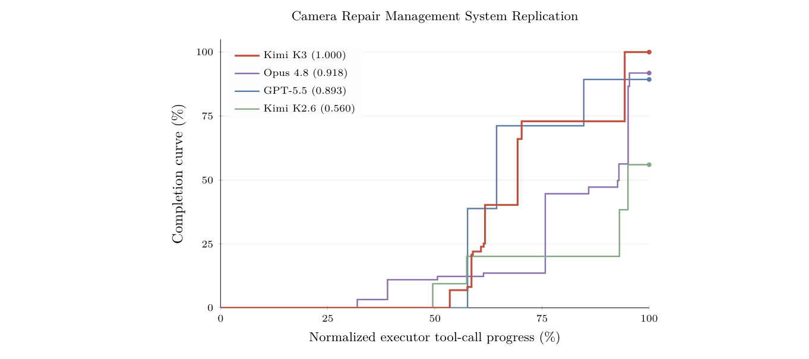

# Agent Environments（エージェントの訓練環境）

**エージェントを強化学習（RL）で鍛えるための*環境*そのもの**を主題とするページ。[[reinforcement-learning-from-human-feedback]] が「どう学習則を回すか（アルゴリズム側）」、[[agent-evaluation]] が「能力をどう*測る*か」を扱うのに対し、本ページは「**エージェントに何を経験させるか**」——タスクの分布・報酬の接地・サンドボックスの隔離——を扱う。

**なぜ環境が第一級か。** モデルレポートが繰り返し述べる観察は「**RL の効果は、豊かで・多様で・頑健に検証可能な環境に律速される**」（[[summaries/2026-kimi-k3]]）である。同じ RL アルゴリズム・同じベースモデルでも、環境の質——報酬が客観的に接地されているか、タスクが本当に長期ホライズンの能力を要求するか、サンドボックスが探索を安全に許すか——で得られる能力が変わる。だから環境設計は、報酬設計 ＋ タスク分布 ＋ サンドボックスの合成問題として、独立した工学の対象になる。

### 近隣ページとの境界

| ページ | 守備範囲 |
|---|---|
| **本ページ** | **訓練用の環境**——タスク合成・検証器（報酬）・サンドボックス・ハーネスのモジュール化 |
| [[reinforcement-learning-from-human-feedback]] | 環境の上で回す**学習則**（GRPO・OPD・partial rollout・GRM） |
| [[agent-evaluation]] | 能力を**測る**環境（ベンチマーク）。訓練環境と測定環境は別物（下記） |
| [[harness-engineering]] | 環境が RL 中に差し替える**ハーネスそのもの**の設計 |
| [[agent-safety-and-guardrails]] | サンドボックスの**隔離**を安全対策として見る側 |

## 蓄積の系譜 — 本 wiki の 4 原典

エージェント環境は、本 wiki が取り込んだモデルレポートに**反復的に登場するテーマ**である。ここに一枚の地図としてまとめる。

| 原典 | 環境の焦点 | 中身 |
|---|---|---|
| **K2**（[[summaries/2025-kimi-k2]]） | **ツール合成** | GitHub から実 MCP ツール 3000+ を取得しドメイン階層の進化で合成ツール 20,000+ を生成。状態を保持するツールシミュレータ（成功・部分失敗・エッジケースを確率的に生成）で多ターン軌跡を作り、**LLM ジャッジがルーブリック採点した合格分だけ残す＝大規模な棄却サンプリング** → [[tool-use-and-function-calling]] |
| **K2.5**（[[summaries/2026-kimi-k2.5]]） | **swarm 環境** | 逐次実行では予算内に完了できない wide/deep search のタスク分布を作り、**並列分解が自然に有利になるよう仕向ける**（PARL は並列化の意思決定を RL で学習） → [[multi-agent-systems]] の (e) |
| **DeepSeek-V4**（[[summaries/2026-deepseek-v4]]） | **スペシャリスト環境 ＋ 本番サンドボックス** | 領域ごとの RL 環境で専門家を作り OPD で統合。実行を **DSec**（Function Call プール／Docker／microVM/Firecracker／fullVM/QEMU の 4 基盤）に振り分け、全コマンドを trajectory ログに永続記録 → [[agent-safety-and-guardrails]] |
| **K3**（[[summaries/2026-kimi-k3]]） | **モジュール化ハーネス ＋ KG 合成 ＋ AET ＋ AgentENV** | 下記 5 要素 |

**この系譜の含意**は「モデルの能力の一部は、環境設計の達成である」ということである——同じ主張は [[summaries/2026-code-as-agent-harness]] と [[summaries/2026-externalization]] が「ベンチマークはハーネス／外部化の寄与を過少に測る」として評価の側から述べている（→ [下記](#訓練する環境と測る環境は別物)）。

## K3 の 5 要素

<figure>

<figcaption>図9（再掲, Kimi K3）: 知識グラフに導かれるタスク合成。階層的な DAG 知識グラフをエージェントが Web 探索で再帰的に拡張し、関連ノードのキーワード集合で公開材料を検索してタスクを合成する。</figcaption>
</figure>

### (1) white-box modular harness — ハーネスを訓練時の変数にする

**K3 の最も概念的に新しい点。** 主張は端的である——

> **単一の固定されたエージェントハーネスで訓練すると、モデルは特定のツールスキーマ・システムプロンプト・コンテキスト管理機構・相互作用プロトコルへ*過適合*しうる。**

そこで K3 は**ハーネスを設定可能で合成可能なモジュールの集合**（ツールインターフェース・システムプロンプト・コンテキスト管理戦略・スキル・記憶・サブエージェント）として表現する統一 white-box 環境を作る。設定を通じてこれらを合成することで、環境は **Kimi Code / Claude Code / Codex / OpenClaw / Hermes** のような主流ハーネスや、まったく新しいものを具現化できる。**RL 中はタスクグループごとに異なるハーネス構成を動的に構築し、単一ハーネスの慣習ではなく多様な組み合わせにモデルを晒す。**

これは [[harness-engineering]] の視点を訓練側から裏返したものである。同ページは「**ハーネスのすべての部品はモデルが単独でできないことへの仮定であり、モデルの改善で陳腐化する**」と述べ、部品を*剥がす*側から論じた。K3 は逆に、**訓練時にハーネスを撹乱（randomize）することで、特定の部品への依存を最初から作らない**——配備時に別のハーネスへ載せ替えても頑健になりやすい。**「ハーネスは固定の容れ物ではなく、訓練分布に含める変数である」**という見方は、[[summaries/2026-code-as-agent-harness]] の *agent-initiated code artifacts* や AHE の自動進化（[[summaries/2026-agentic-harness-engineering]]）と同じ「ハーネスを第一級の対象にする」流れにある。

### (2) KG-guided task synthesis — 自己進化する知識グラフ

タスクの品質と多様性は**源材料**に左右される。K3 は**自己進化する階層的な DAG（有向非巡回グラフ）知識グラフ**を、エージェントが Web 規模の探索を通じて再帰的に拡張する。

- **構築**: 粗粒度のシードノードから始め、各ノードにエージェントを割り当てて複数の Web 検索で概念を調べる。新ノードを加える前に既存グラフを探索して重複を最小化する。**辺は常に粗い概念から細かい概念へ向く**。枝は概念が十分「原子的」になったら止まる。
- **合成**: 望ましい領域・タスク型の分布を狙って様々な粒度のノードをサンプリングし、キーワードと祖先ノードの文脈を組み合わせて Web クエリを作り、検索した実世界材料からタスクを合成する。

**K2 のツール合成が「ツールと軌跡を作る」だったのに対し、K3 の KG 合成は「タスクの源となる知識空間そのものを育てる」**——粒度 × 網羅を制御して、専門的で過小表現の知識まで届かせる。

### (3) AET（Autonomous Execution Tasks）— verify-in-the-loop

<figure>

<figcaption>図10（再掲, Kimi K3）: Camera Repair Management System の完了曲線。ブラックボックスのシステム複製タスクで、エージェントは隠された 3D カメラ修理システムをオラクルへの問い合わせを通じて Web アプリとして再構築する。完了度は検証器が評価した進捗。</figcaption>
</figure>

各 AET は **初期状態 ＋ 制約付き目標 ＋ ツールベースの行動空間 ＋ 実行予算 ＋ 独立した検証器**を指定する。エージェントは目的・文脈・制約・検証インターフェースだけを見て、**参照軌跡や事前定義された手続きなしに**、タスク分解・ツール選択・計画・エラー回復・終了を自律的に行う。

**設計の核心は報酬の接地である**——

> **報酬はエージェントの*自己申告の完了*ではなく、検証器による*最終環境状態*の評価に接地される。**

検証器は多様化される——black-box システム複製（図 10）・定量的ファクター発見・税務監査など。これは [[agent-loop]] の「途中までは正しくても最後の一手で失敗する」問題に対する訓練側の答えであり、[[agent-evaluation]] の oracle adequacy（検証器が意図したタスクを捉えているか）と表裏である。

### (4) モックアプリ — 再現可能な持続的環境

長期ホライズンのパーソナルアシスタントのタスクのため、**Gmail・Notion・Slack・Canvas** の現実的なモック実装を作る。核心的な意味論を保ちつつ、**外部 API やレート制限なしで**再現可能で大規模な相互作用を可能にする。エージェントは複数のシミュレートされた日にわたる持続的で進化する環境で動作し、**1 ロールアウトが最大で数千のツール呼び出しと数百万のコンテキストトークン**を含みうる。各イベントは決定論的な規則あるいは LLM ベースの評価器で評価される。

### (5) AgentENV — 再開可能な microVM サンドボックス

エージェント AI ワークロードのために設計された microVM ベースのサンドボックスランタイム。3 つの設計目標を持つ。

- **高忠実度の隔離** — **エージェントが有能になるほど積極的に探索し reward hacking を試みる**。伝統的なコンテナベースのランタイムでの初期実験では、意図しないエージェント操作が **kernel panic やデッドロック**を引き起こした。microVM 隔離が「できるだけ多くの探索を許す」と「安全」の緊張を解く。
- **柔軟なライフサイクル** — 漸進的なチェックポイント（前回以降に汚れたメモリページのみ保存）で、**チェックポイント/再開の遅延をそれぞれ 133ms/49ms** まで下げる。Pause/Resume など高水準操作を提供。partial rollout で軌跡が複数反復にまたがる agentic RL に不可欠。
- **高効率・高密度** — OverlayBD イメージ形式 ＋ カスタム ublk ドライバ ＋ P2P 転送でサブ秒起動。**訓練・評価を通じて 150 万イメージにわたる 5,121 万個のサンドボックスが作られた。**

これは [[summaries/2026-deepseek-v4]] の **DSec**（4 実行基盤・全コマンドを trajectory ログに記録）の次の世代にあたり、**「エージェント RL・評価のインフラは安全性インフラを兼ねる」**という観察の続きである → [[agent-safety-and-guardrails]]。

## 設計軸

環境設計を比較・点検するための軸を、上記の系譜から抽出する。

| 軸 | 問い | 例 |
|---|---|---|
| **検証可能性**（verifiability） | 報酬が客観的に接地されているか | テスト合格率（実行）・独立検証器（AET）・LLM ジャッジのルーブリック（GRM）。**自己申告の完了を信じない** |
| **ハーネスのモジュール性** | 単一ハーネスへ過適合していないか | K3 の white-box 環境が構成を動的に撹乱する |
| **タスク合成** | タスクの分布をどう制御するか | K2 のツール合成／K3 の KG 合成（粒度 × 網羅） |
| **サンドボックスの隔離と再開性** | 探索を安全に許し、中断から再開できるか | AgentENV の microVM ＋ 漸進チェックポイント／DSec の 4 基盤 |
| **報酬設計** | reward hacking をどう防ぐか | K3 の予算ペナルティ（冗長性・過剰思考）／K2.5 PARL の r_finish（spurious parallelism 対策） |

## 訓練する環境と測る環境は別物

**同じ「環境」でも、訓練用と評価用では要件が違う。**

- **訓練環境**は、報酬信号が RL の勾配を歪めない程度に頑健で、タスク分布が能力の成長を駆動し、サンドボックスが探索を安全に許せばよい。多少ノイズがあっても大量に回せば平均化される。
- **評価環境**（[[agent-evaluation]]）は、**汚染されておらず・再現可能で・意図したタスクを捉える**必要がある。ここでの検証器の弱さは「解けたつもりのスコア」を生む（oracle adequacy）。

K3 はこの区別が曖昧になる例でもある——**内製ベンチ（Swarm Bench・Deep Research Bench）で強みを主張する一方、それらは外部再現不可**で、ハーネス割り当ても評価をまたいで不均一である。**「モデルの能力」と「環境・ハーネスの寄与」が混ざる**というのは、[[summaries/2026-code-as-agent-harness]]（ハーネス水準の 6 指標）と [[summaries/2026-externalization]]（転移可能性）が独立に指摘した問題そのものである。**環境を作り込むほど、その寄与を切り分ける評価が必要になる。**

## 関連ページ

- [[reinforcement-learning-from-human-feedback]] — 環境の上で回す学習則（GRPO・OPD・MOPD・partial rollout・GRM）
- [[agent-evaluation]] — 測る環境。訓練環境との区別、ハーネス水準の指標
- [[harness-engineering]] — 環境が撹乱する対象としてのハーネス
- [[agent-safety-and-guardrails]] — サンドボックスの隔離を安全対策として見る側
- [[agent-loop]] — 環境が訓練する「観測→思考→行動」のループ
- [[coding-agents]] — 検証が最も速く機械可読な訓練環境（実行フィードバック）
- [[multi-agent-systems]] — K2.5 の swarm 環境・PARL
- [[tool-use-and-function-calling]] — K2 のツール合成（環境の前段）
- [[summaries/2026-kimi-k3]] — 本ページの主たる根拠原典（white-box harness・KG・AET・モック・AgentENV）
- [[summaries/2025-kimi-k2]] / [[summaries/2026-kimi-k2.5]] / [[summaries/2026-deepseek-v4]] — 系譜の前段
- [[summaries/2026-code-as-agent-harness]] / [[summaries/2026-externalization]] — 環境・ハーネスの寄与を測る評価の側
