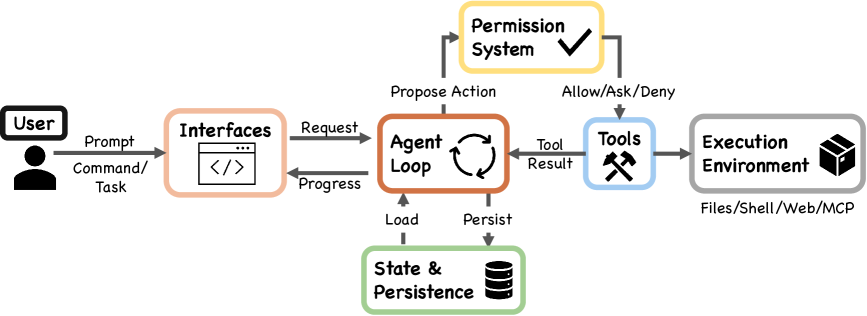

# Coding Agents（コーディングエージェント）

**コードを書き・実行し・その結果を観測して修正する**ループを回すエージェントの総称。[[agent-loop]] の応用形のうち最も成熟した領域で、環境は「リポジトリ＋実行環境（シェル・テスト・開発サーバー）」、行動は「ファイル編集・コマンド実行」、観測は「コンパイル結果・テスト出力・実行ログ」である。コーディングが応用の先頭を走る理由は、**環境からのフィードバックが速く・機械可読で・ほぼ無料**なこと——書いたものが動くかを即座に検証できるため、[[reinforcement-learning-from-human-feedback]] の検証可能報酬とも、実行時の自己修正ループとも相性がよい。代表製品・システムに Claude Code・SWE-agent・Devin・Cursor など（各詳細は概説。専用原典は未 ingest）。

## 構成要素

- **ツール（ACI）**: エージェントが使うツールは人間向け CLI の流用では最適でない。ツール群をエージェントの認知に合わせて設計し直す考え方が **ACI**（agent-computer interface）で、**SWE-agent**（[[summaries/2024-swe-agent]], NeurIPS 2024）が確立した——詳細は下記の専用節。興味深いことに、フロンティアモデルの評価ハーネスは最小構成に収斂している——[[summaries/2026-deepseek-v4]] の SWE 評価は「bash＋ファイル編集」の 2 ツール、[[summaries/2026-kimi-k2.5]] は bash / create_file / insert / view / str_replace / submit の 6 ツールで、豊富なツールより**少数の直交したツール**が好まれる（→ [[tool-use-and-function-calling]] の「ツールの弱さが推論を引き出す」の現代形）。
- **実行フィードバック**: 単体テスト・型検査・リンタ・開発サーバー・ブラウザ自動化。どの層まで検証するかが品質を決める（後述）。
- **状態管理**: **git が天然のチェックポイント機構**を提供する——コミットは進捗記録・ロールバック手段・次セッションへの引き継ぎ記録を兼ねる。エージェント設計で外部メモリをゼロから作る前に、リポジトリに既にある仕組みを使うのが定跡。

## ACI — インターフェースを設計変数にする

**SWE-agent**（[[summaries/2024-swe-agent]], Yang・Jimenez ら, Princeton, NeurIPS 2024）が導入した概念で、本ページの中心にあたる。主張は単純だが射程が広い——**LM は「独自の必要と能力を持つ新しいカテゴリのエンドユーザー」であり、ソフトウェア向けの API・人間向けの UI に続く第 3 のインターフェースを必要とする**。それが **ACI**（agent-computer interface）である。

**なぜ既存の UI では足りないのか。** 人間と LM の違いが設計指針を分ける。人間は不要な情報を柔軟に無視できるが、**LM にとってはすべての内容がメモリと計算において固定のコストを持ち、気を散らす文脈は性能を害する**。人間には上下キーの連打が直観的だが、LM にとってそれは冗長で高くつく。一方で IDE が人間に与える機能（構文検査・ナビゲーション）は、**形さえ変えれば LM にも有用**である。

**4 つの設計原則**（同論文 §2）: (1) 行動は単純で理解しやすく、(2) 行動はコンパクトかつ効率的（高次の操作を複数ターンの合成に分解させない）、(3) 環境のフィードバックは情報を与えるが簡潔に、(4) ガードレールが誤りの伝播を緩和し回復を早める。

**実装の要点**は、`edit <n>:<m>` で範囲を単一ステップ置換し**編集後にファイルビューアが自動で更新後を表示する**こと（確認のターンが消える）、ファイルビューアが**100 行の窓**と省略行数・行番号を常に示すこと、検索結果に**上限 50 件**を置き超えたら結果でなく「より具体的なクエリを書け」と返すこと、そして**直近 5 つより前の観測を 1 行へ折り畳む**ことである。

**リンタをガードレールにする**設計が転用価値が高い。編集を適用してから `flake8` を走らせ、**構文エラーが出たら差し戻す**。差し戻すとき返すのは**エラー・編集後がどう見えたはずか・編集前の元の内容**の 3 点セットで、著者らは変種を試したうえで 3 つとも要ると結論している——元の内容がないと、エージェントは**より新しいという理由だけで誤ったファイル内容に対して編集を生成する**。

### 効果の大きさ — アブレーションが示す非自明さ

SWE-bench Lite（GPT-4 Turbo、既定 18.0%）でのアブレーションが、この領域で最も引用に値する数字である。

| 軸 | 既定 | 代替 | 落差 |
| --- | --- | --- | --- |
| Editor | `edit` ＋ linting **18.0** | linting なし 15.0 / `edit` なし **10.3** | **−7.7** |
| Search | Summarized **18.0** | **Iterative 12.0** / 検索なし 15.7 | — |
| File Viewer | 100 行 **18.0** | 30 行 14.3 / ファイル全体 12.7 | −5.3 |
| Context | 直近 5 観測 **18.0** | 全履歴 15.0 / 実演なし 16.3 | −3.0 |

**最も重要なのは Search の行である。Iterative search（12.0）は「検索ツールを一切与えない」（15.7）より悪い。**Iterative search は Vim や VSCode の検索 UI を直接模したもので、結果を `next` / `prev` で 1 件ずつ送る。人間には自然だが、**エージェントは全一致を網羅的に舐めようとして `next` を呼び続け、コスト予算とコンテキストを枯渇させる**。**「人間にとって良い UI」がエージェントには積極的に有害でありうる**——ACI という概念が単なる言い換えでないことの、最も直接的な証拠になっている。ファイルビューアの窓サイズに**両側の最適点**がある（少なすぎても多すぎても落ちる）のも同じ含意を持つ。

なおフロンティアモデルの評価ハーネスは、この方向とは逆に**最小構成へ収斂している**——[[summaries/2026-deepseek-v4]] の SWE 評価は「bash＋ファイル編集」の 2 ツール、[[summaries/2026-kimi-k2.5]] は bash / create_file / insert / view。**モデルが強くなるほど足場を薄くできる**という [[summaries/2026-harness-design]] の主題と、ACI の主題（弱いモデルほどインターフェースで底上げできる）は、同じ軸の両端と読める。

### 編集は連鎖して壊れる

SWE-agent の軌跡分析は、コーディングエージェントの失敗の形を数字にしている。**2,294 インスタンスのうち 1,185（51.7%）が失敗した編集を 1 回以上含む。**そして**回復確率は失敗が積むほど落ちる**——編集のどんな試みも最終的に成功する確率は **90.5%** だが、**1 回失敗した直後には 57.2%**、つまり **1 回の編集エラーで 42.8% はもう回復しない**。リンタのガードレールはこの連鎖を断つために置かれている。

失敗の内訳も示唆的で、**Incorrect Implementation 39.9% ＋ Overly Specific Implementation 12.1% = 52.0%** が「妥当な場所を触ったが解が正しくない／一般的すぎない」。**位置特定より実装が難所**である（Failed to Find Relevant File はわずか 2.4%）。

**「エージェントは速く成功し、ゆっくり失敗する」**という観察も運用に効く——解決できたものは中央値 $1.21・12 ステップ、できなかったものは平均 $2.52・21 ステップで、**解決できたインスタンスの 93.0% は予算を使い切る前に提出**している。**予算やトークン上限を上げても性能はさほど伸びない**、というのが著者らの結論である。

## 検証の設計 — 「コードだけ見て完了宣言」問題

コーディングエージェントの品質は**どこまで検証させるか**で決まる。実務で繰り返し観測される失敗が「単体テストや curl は通したが、end-to-end では動かないのに完了とマークする」であり、対策は**人間のユーザーと同じ経路での検証**——Web アプリならブラウザ自動化（Puppeteer 等。ブラウザ操作という意味で [[computer-use-agents]] の技術の検証用途への転用）で実際に操作させる。ただし 2 つの罠が残る:

1. **検証ツールの盲点は品質の穴になる**: Puppeteer MCP から見えない alert モーダルに依存する機能はバグが残った（[[summaries/2025-effective-harnesses]]）——エージェントが観測できない場所は検証されない。
2. **自己検証の偽陽性は致命傷**: [[summaries/2023-reflexion]] の実測どおり、誤った実装を通してしまうテスト（偽陽性）は「確信を持った誤り」を生む。長時間ハーネスの feature list（全機能を `"passes": false` で列挙し、エージェント自身が passing にしていく完了定義。→ [[harness-engineering]]）の self-verify も同じ構造を持ち、検証手段が弱いドメインでは機能しにくい。評価側の対応物は [[agent-evaluation]] の終了状態評価。

## ハーネス — 本ページから切り出した層

コーディングエージェントの成熟は**ハーネス（モデルの外側にある編集可能な構成要素の総体——システムプロンプト・ツール・ミドルウェア・記憶・サブエージェント設定）** を独立した設計対象へ押し上げた。**その設計・縮小・自動探索・自動進化・仮想化は 2026-08-03 に [[harness-engineering]] へ切り出した**（本 wiki のハーネス系の原典が 7 本に達し、しかもその議論がコーディングに固有でなくなったため）。本ページには**コーディング固有の話**を残す。

あちらで扱う要点だけ挙げておく。

- **長時間タスクの二部構成**（[[summaries/2025-effective-harnesses]]）——initializer が feature list JSON・進捗ログ・`init.sh`・初期 commit で環境の足場を作り、coding agent が毎セッション 1 機能ずつ進めてクリーンに終了する。**引き継ぎ媒体を「要約」でなく検査可能な構造化 artifact にした**のが要点。
- **generator / evaluator / planner の分業と、ハーネスの縮小**（[[summaries/2026-harness-design]]）——「**すべての部品は『モデルが単独でできないこと』への仮定であり、モデルの改善で陳腐化する**」。1 部品ずつ外して確認する。
- **ハーネスの自動探索**（[[summaries/2026-meta-harness]]）——コーディングエージェント自身を proposer にしてハーネスコードを探索させる。**原典の脚注は、このワークフローが「2026 年初頭のコーディングエージェント能力の大幅改善で初めて実用的になった」と証言する**——本ページの主題の成熟が、自分自身の実行基盤の改善という**再帰的な仕事**を可能にした記録である。
- **ハーネスの自動進化**（[[summaries/2026-agentic-harness-engineering]]）——観測された失敗から編集を導き、**すべての編集に「直すタスク」と「壊すタスク」を自己申告させて次ラウンドで採点する**。Terminal-Bench 2 で 69.7% → 77.0%。**層別の価値が定量化されており、長期記憶 +5.6 / ツール +3.3 / ミドルウェア +2.2 に対しシステムプロンプトは −2.3 pp** ——**事実としてのハーネス構造は転移するが、散文レベルの戦略は転移しない。**

## Claude Code という設計点 — ハーネスが 98.4% を占める

本ページの他の節が「どう設計すべきか」の指針だったのに対し、[[summaries/2026-dive-into-claude-code]]（VILA Lab / MBZUAI・UCL, 2026）は**実際に出荷されている本番系を、公開された TypeScript ソース（v2.1.88、約 1,884 ファイル・51.2 万行）から解剖した**第三者の分析である。Anthropic の刊行物ではない。**証拠を 3 階層（Tier A = 公式ドキュメント／Tier B = コード検証済み／Tier C = 再構成・推論）でラベル付けしている**点で、リバースエンジニアリング系の資料としては珍しく誠実な形をしている。

**この論文の要約を一言にすると次の比率である。**

> **コードベースのうち AI の意思決定ロジックは推定 1.6%、残る 98.4% は運用ハーネスである。**

**ただしこれは Tier C（コミュニティ解析からの推定）であり、Tier B の主張と同じ強さでは読めない。** それでも本ページの他の原典と方向は一致する——**中核のエージェントループは「モデルを呼び、ツールを実行し、繰り返す」だけの while ループで、複雑さのすべてはその周囲にある**。著者らの言い方では「**工学的な複雑さは、モデルの決定を制約するためではなくそれを可能にするために存在する**」。

<figure>

<figcaption>図: Claude Code の高水準構造。7 コンポーネント（user / interfaces / agent loop / permission system / tools / state &amp; persistence / execution environment）。対話 CLI・headless CLI・Agent SDK・IDE のすべてが**同じ 1 つのエージェントループ**に収束する。（[[summaries/2026-dive-into-claude-code]] 図1 より引用）</figcaption>
</figure>

### 4 つの設計上の問い

著者らは、あらゆる本番コーディングエージェントが答えなければならない問いを 4 つに整理した。**本ページの他の系（SWE-agent・Aider・Devin）と比較する軸としてそのまま使える。**

| 問い | Claude Code | SWE-agent / OpenHands | Aider | Devin / LangGraph |
|---|---|---|---|---|
| **推論はどこに宿るか** | モデルが推論、ハーネスが実行。**モデルは FS・シェル・ネットワークに直接触れない** | 同様（コンテナ内） | 同様 | **スキャフォールディング側**に計画構造・状態グラフを持つ |
| **実行エンジンは何個か** | **1 個**（`queryLoop()`）。変わるのはレンダリングだけ | — | — | モード固有のエンジンもありうる |
| **既定の安全姿勢** | **deny-first ＋人間へのエスカレーション**、独立層の並列適用 | **コンテナ隔離** | **git ロールバック** | — |
| **拘束的な資源制約** | **コンテキストウィンドウ**（200K / 1M） | — | — | 計算予算、明示的スクラッチパッド |

**「推論はどこに宿るか」への答えにはセキュリティ上の帰結がある**——推論と強制が別々のコードパスを占めるので、**危殆化したモデルでもハーネスの権限チェックやサンドボックスを上書きできない**。モデルの外界への唯一のインターフェースは `tool_use` プロトコルであり、ハーネスが実行前に検証する。→ [[agent-safety-and-guardrails]]

### サブシステムの所在

各サブシステムの詳細は関係する概念ページへ置いた。ここでは所在だけ示す。

| サブシステム | 要点 | 詳細 |
|---|---|---|
| **`queryLoop()`** | 単一 `State` オブジェクトを全体代入で更新／`AsyncGenerator`／停止条件 5・回復機構 5（回数を数える） | [[agent-loop]] |
| **5 層 compaction** | budget reduction → snip → microcompact → context collapse → auto-compact。**遅延劣化の原則** | [[context-engineering]] |
| **CLAUDE.md 4 階層** | managed / user / project / local。**埋め込みを使わずファイルヘッダを LLM でスキャン** | [[agent-memory]] |
| **7 層の権限** | 事前フィルタ → deny-first → モード → 分類器 → サンドボックス → **resume で復元しない** → フック | [[agent-safety-and-guardrails]] |
| **4 拡張機構** | フック（0）・スキル（低）・プラグイン（中）・MCP（高）の**コンテキストコスト階層** | [[agent-frameworks]] |
| **subagent** | worktree 隔離・**要約のみ返却**・sidechain トランスクリプト・**7× のトークン** | [[multi-agent-systems]] |
| **永続化** | ほぼ追記のみの JSONL・読み取り時の連鎖修復・3 チャネル独立 | [[context-engineering]] |

### コーディングエージェントに固有の設計判断

上表の外で、**この論文がコーディングエージェント固有の教訓として読めるもの**が 3 つある。

- **git worktree を隔離機構に使う。** subagent の隔離モードは worktree / remote / in-process の 3 つで、**worktree は一時的な git worktree を作って subagent に自分用のリポジトリのコピーを与える**。コンテナのオーケストレーションを導入せず、**外部依存ゼロでファイルシステム水準の分離**が得られる——本ページ冒頭の「git が天然のチェックポイント機構」の延長にある。SWE-agent / OpenHands の Docker 隔離、AutoGen のコンテキストのみの隔離との中間に位置する。
- **エージェントチームの調整はファイルロックで行う。** メッセージブローカーも分散調整サービスも使わず、**共有タスクリストからロックファイルによる排他制御で主張する**。スループットを**依存ゼロの配備**と**プレーンテキスト JSON を読むだけのデバッグ可能性**と引き換えにしている。
- **CLAUDE.md はシステムプロンプトでなく user メッセージとして届く。** 著者らはこの含意を明記する——「**会話的なコンテキストとして届けられるため、これらの指示へのモデルの遵守は保証されたものではなく確率的である**」。決定論的な強制は権限ルールが担う。**指針（確率的）と強制（決定論的）の意図的な分離**であり、CLAUDE.md に何を書き、何を書いてはいけないかの判断基準になる。

### 弱点として記録に値するもの

- **多層防御の独立性の仮定が破れる。** Claude Code の安全性の層は**共通の性能・経済上の制約を共有している**（分類器は追加の LLM 呼び出し、AST チェックは解析遅延）。実例として**50 を超えるサブコマンドを持つコマンドは、解析が UI をフリーズさせたため、サブコマンドごとの deny チェックを飛ばして単一の汎用承認プロンプトへフォールバックする**。→ [[agent-safety-and-guardrails]]
- **compaction がユーザーに見えない。** とくに **context collapse はユーザーに見える出力なしに動作する**。何が失われたかを検査する手段がない。→ [[context-engineering]]
- **リバースエンジニアリングの限界。** 著者らが自ら書くとおり、**ソースは実装された構造を明らかにするが、設計の意図・本番で有効なフラグ・ランタイムでの出現頻度・出荷されていない挙動は確認できない**。機能フラグはビルド時の可変性を作り、`TRANSCRIPT_CLASSIFIER` が false のビルドでは **auto-mode 分類器全体が除去される**。**「異なるビルドターゲットは機能的に異なるアプリケーションを生成しうる」。**

### OpenClaw との対比が示すこと

論文は Claude Code を **OpenClaw**（約 2 ダースのメッセージング表面をエージェントランタイムへ繋ぐ local-first の WebSocket ゲートウェイ）と 6 次元で比較する。**同じ問いに正反対の答えが出るのが要点**で、信頼境界は「モデルと実行環境の間」対「ゲートウェイの境界」、エージェントループは「系の中心」対「制御平面の中の 1 コンポーネント」、拡張は「単一エージェントのコンテキスト」対「ゲートウェイ全体の能力面」となる。

**そして 2 つは合成できる**——**OpenClaw は ACP（Agent Client Protocol）を通じて Claude Code を外部のコーディングハーネスとしてホストできる**。著者らの結論が本 wiki にとって有用である——「**エージェントの設計空間は平坦な分類ではなく層状のものであり、ゲートウェイ水準の系とタスク水準のハーネスが合成できる**」。→ [[agent-frameworks]]

## 短期の増幅と長期の損耗 — 使った結果、人間側に何が起きるか

**本ページはここまで「どう作るか」だけを扱ってきた。しかし [[summaries/2026-dive-into-claude-code]] は、コーディングエージェントを*使った結果*についての懐疑的な実証を集めており、本 wiki にはこの軸の記述が 1 つも無かった。** 論文はこれを 5 つの価値と対等な設計価値ではなく「**評価的レンズ**」——アーキテクチャを横断して当てる問い——として扱っている。理由も明記されている: **長期的な人間の能力の保全は、Claude Code のアーキテクチャにも Anthropic の表明された設計価値にも、設計の駆動因として顕著には反映されていない**から。

### 実証されているもの

| 研究 | 規模 | 知見 |
|---|---|---|
| **RCT**（becker2025measuring） | 経験豊富な開発者 **16 名・246 タスク** | **AI ツール使用時に 19% 遅くなった。本人たちは 20% 速くなったと知覚していた** |
| **Cursor 導入の因果分析**（he2026cursor） | **807 リポジトリ** | **複雑度 +40.7%（p < 0.001）**。速度スパイクは初月 +281% だが**3 か月目でベースラインへ**。複雑度の上昇は将来の速度低下と比例——**利得は自己相殺的** |
| **AI コミットの監査**（liu2026techdebt） | **30.4 万コミット・6,275 リポジトリ** | **AI が導入した問題の約 1/4 が最新リビジョンまで持続**。セキュリティ関連はさらに高率で持続 |
| **理解度テスト**（shen2026skill） | — | AI 支援条件の開発者は**理解度テストで 17% 低いスコア** |
| **EEG 研究**（kosmyna2025brain） | **54 名** | LLM 利用者は**神経結合の弱まりを示し、AI を取り除いた後も持続** |
| **採用の時系列**（rak2025aihiring） | — | **2023→2024 で初級技術職の採用が 25% 減** |
| Anthropic 内部調査（anthropic2025internal） | エンジニア・研究者 **132 名** | **タスクの約 27% はツールがなければ着手されなかった**。同時に「**監督のパラドックス**」——AI への過度の依存が、それを監督するのに必要なスキルを萎縮させるリスク——を記録 |

**最初の 1 行が最も重要だと思う。「19% 遅くなったのに 20% 速くなったと感じていた」は、主観的な生産性の報告が測定の代わりにならないことの直接の実証**であり、[[agent-evaluation]] が繰り返し扱ってきた「判定器と人間の一致」問題の、人間自身が判定器になった場合の変種として読める。

### アーキテクチャ側の予測と、それを支持するデータ

**論文の構成が良いのは、外部の実証を持ち出す前に、アーキテクチャからの予測を先に立てていることである。**

> 有界なコンテキストウィンドウは**コードベース全体の同時把握を妨げる**。したがって**エージェント生成コードはパターンの重複と規約違反の率が高くなる**とアーキテクチャ的に予測される。**subagent の隔離がこれを増幅する——並列のエージェントは、他所に既に存在する解を独立に再実装しうる。**
>
> **設計哲学はモデルが良い局所的な決定をすることを信頼するが、モデルが大域的な文脈を欠くとき、良い局所的な決定は悪い大域的な帰結を生みうる。**

上表の複雑度 +40.7% と技術的負債の持続は、**この予測と整合する外部データ**という位置づけになる。**著者らは正直に留保も付けている**——Claude Code の 5 層 compaction・キャッシュ意識・読み取り時の射影・subagent の要約隔離は**まさにこれらの効果を緩和するよう設計されており、それが十分かは「ソースレベルの解析では解決できない、直接測定可能な実証的な問い」である**。上表の研究はいずれも隣接ツール（Cursor 等）を標的にしている。

### 測れないという問題

**論文が最後に置く問いが、本 wiki にとっては最も実務的である。**

> 既存の引用はセッションから数か月の尺度で動作する**が、ハーネスは理解や規約のドリフトについてセッションごとの信号を一切露出していない。**

つまり**「短期の増幅と長期の損耗のトレードオフを、開発者が自分のセッションで観測する手段が今は存在しない」**。著者らは (a) セッション粒度で測定可能にすることと、(b) 測定が存在したときアーキテクチャがそれに応答できるかを、別々の未解決問題として分けている。そして**「ハーネスがそもそもその行動の正しい場所なのか（IDE、組織、人間の開発ループではなく）はアーキテクチャの分析では裁定できない」**と留保する。

**設計上の持ち帰りは 3 つ。**

1. **速度の自己申告を成果指標にしない。** 19% 対 +20% の乖離は、**主観的な速さの感覚が測定と逆を向きうる**ことを示す。ベロシティを測るなら実測する。
2. **複雑度と技術的負債を継続的に測る。** 初速のスパイクは 3 か月で消え、複雑度は残る。**導入の効果は 1 か月では評価できない。**
3. **エージェントに大域的な文脈が無いことを前提に設計する。** 規約の集約（CLAUDE.md 等）・重複検出・レビュー段の分離は、**アーキテクチャの構造的な限界に対する緩和であって、モデルが賢くなれば消える問題ではない**。

## 評価

**この領域の主戦場が SWE-bench**（[[summaries/2023-swe-bench]], Jimenez ら, ICLR 2024）である。実際の GitHub イシューと、それを解決したマージ済み PR の対から **2,294 件**（12 の Python リポジトリ）を自動収集し、**リポジトリ自身の単体テストで実行ベースに採点する**。詳しい設計は [[agent-evaluation]] に置いた。

**出発点の水準を押さえておく価値がある。** 2023 年当時、**編集すべきファイルを教える「オラクル」設定でさえ Claude 2 が 4.8%、GPT-4 が 1.7%**、普通に BM25 で検索させると 1.96% / 0.00% だった。翌年の [[summaries/2024-swe-agent]] が 12.47% へ、その後さらに大きく伸びる。**この領域の進歩の速さを測る基準線**として使える。

当時の失敗の質も記録されている——**モデルは gold より短く単純な編集を書き**（19.6 行 対 44.1 行）、**ほぼ単一ファイルしか触らない**（1.0 対 1.7 ファイル）。**パッチ形式で出させるほうがファイル全体を書き直させるより成績が良い**（Claude 2: 4.8% 対 2.2%）一方で、**整形式のパッチを出すこと自体に苦労する**（GPT-4 はオラクル設定で適用成功 150/472、うち 68.7% が自動修復を要した）。ファインチューニングした SWE-Llama は適用率が高く修復率が低く、**書式の遵守は微調整で改善する種類の問題**であることを示した。

興味深いのは、**成績が同程度でも解けている問題が重ならない**ことである——オラクル設定で Claude 2 は 110 件、SWE-Llama 13b は 91 件を解くが、**Claude 2 は SWE-Llama が解いた問題の 42% しか解けていない**。単一のスカラーがモデルの能力を代表しない。

標準は **SWE-bench 系**（実 GitHub イシューの解決率。Verified / Pro / Multilingual）・Terminal Bench（端末操作）・LiveCodeBench（競技・汚染対策つき）など → 詳細は [[agent-evaluation]]。実務上の注意として、同じモデルでもハーネスでスコアが大きく動く（ハーネス差・step 上限・コンテキスト管理の開示が比較の前提）ことと、フロンティアの到達点（2026 年時点で SWE-bench Verified 80 前後 → [[summaries/2026-deepseek-v4]] 表6）に対し、**長時間の自律構築タスクには標準ベンチマークがまだ無い**（Anthropic の記事も定量評価なし）ことが挙げられる。

## 設計論点

- **単一汎用 vs 特化分業**: テスト専任・QA・クリーンアップ等の特化エージェント分業が単一 coding agent に勝るかは**未解決**（[[summaries/2025-effective-harnesses]] が明示的にオープンクエスチョンとした）。[[multi-agent-systems]] の一般論（依存の密なコーディングは並列分業に不向き——Anthropic Research の自己申告）と、Agent Swarm 系（並列化を学習で解く）の間で、コーディング領域の答えはまだ出ていない。
- **エージェントの書きやすさに環境を寄せる**: init.sh・機能リスト・進捗ログは「エージェントのための開発者体験（DX）」であり、人間の新人オンボーディングと同じ投資が効く。モデル訓練側でも同じ力学が働く——[[summaries/2025-kimi-k2]] のツール利用データ合成や [[summaries/2026-deepseek-v4]] の R&D 実タスク評価は、エージェントが働く環境・課題の整備がモデル性能と同じくらい結果を左右することを示す。
- **セッションの型化**: 「状況把握 → 健全性確認 → 1 単位 → クリーン終了」はコーディング以外の長時間タスク（研究・分析）にも流用可能な汎用テンプレート。
- **安全性**: コード実行はサンドボックス内で（→ [[agent-safety-and-guardrails]] の DSec が本番規模の実例）。リポジトリ書き込み・デプロイ権限は最小化し、不可逆操作（force push・本番反映）は人間の承認を挟む。
- **生成コードの静的解析をループに組み込む**: 上のリンタ・ガードレールの発想は、**セキュリティ**にもそのまま延長できる。**CodeShield**（[[summaries/2025-llamafirewall]], Meta）は Semgrep と正規表現のルールで 50 超の **CWE**（Common Weakness Enumeration, 脆弱性の型を番号で分類した業界標準）を検査し、危険なパッチを差し戻してエージェントに書き直させる——リンタが構文の門番なら、こちらは**脆弱性の門番**である。レイテンシ設計も参考になり、**60ms の軽い層で入力の約 90% を捌き、疑わしいものだけを 300ms の本格解析へ回す**二層構成でエンドツーエンド 70ms 未満に収めている。エージェントのループに毎回挟むガードレールは、この程度まで安くないと成立しない。ただし**再現率は 79%**（適合率 96%）——**危険なコードの 5 本に 1 本は通る**ので、単独の関門にはできない。
- **脅威は「攻撃」だけではない**: LlamaFirewall のシナリオ 2 が良い例で、エージェントが高評価の投稿から**文字列連結の SQL**（インジェクション脆弱性の典型）を学んで真似るのは、悪意ある攻撃者が存在しない失敗である。**コーディングエージェントの脅威モデルには、汚染された学習・参照ソースからの「善意の脆弱性伝播」を含める**必要がある。

## 関連ページ

- [[agent-loop]] — 基礎となる観測→思考→行動ループ
- [[tool-use-and-function-calling]] — ツール設計（ACI・最小ツール構成）
- [[agent-evaluation]] — SWE-bench 系・終了状態評価
- [[context-engineering]] — セッション間の状態外部化
- [[harness-engineering]] — ハーネスの設計・縮小・自動探索・自動進化・仮想化（本ページから 2026-08-03 に切り出した）
- [[agent-frameworks]] — エージェントを組み立てる道具立て
- [[computer-use-agents]] — E2E 検証手段としてのブラウザ操作
- [[agent-safety-and-guardrails]] — サンドボックス・生成コードの静的解析・権限設計
- [[summaries/2025-effective-harnesses]] — 本ページの主要な根拠原典（長時間ハーネス）
- [[summaries/2026-harness-design]] — 続編（3 エージェント構成・ハーネス縮小の方法論）
- [[summaries/2025-llamafirewall]] — CodeShield（生成コードの静的解析ガードレール）の一次資料
- [[summaries/2026-dive-into-claude-code]] — Claude Code v2.1.88 のソースレベル解剖。本ページの「設計点」節と「短期の増幅と長期の損耗」節の根拠原典
- [[agent-memory]] — CLAUDE.md 階層と、埋め込みを使わない記憶検索
- [[multi-agent-systems]] — subagent の隔離と要約のみの返却
