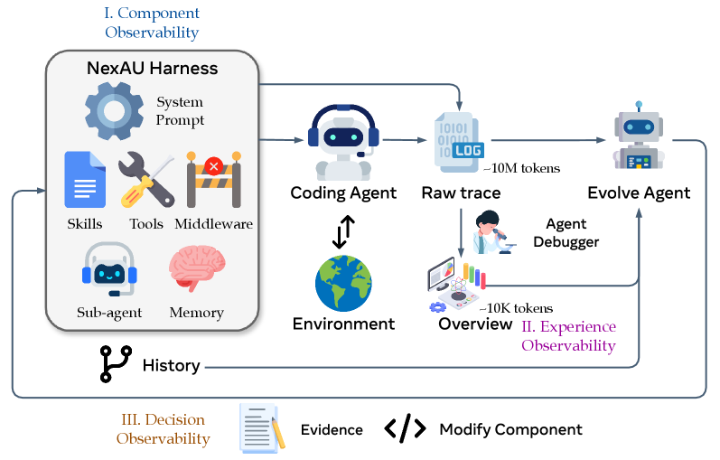

# Harness Engineering（ハーネス工学）

**ハーネス（harness）とは、モデルの外側にある編集可能な構成要素の総体**である——システムプロンプト、ツールの定義と実装、コンテキストの管理、実行の制約、回復のロジック、記憶、サブエージェントの設定。**モデルは固定したまま、これらを変えるだけでタスクの完了率が実質的に動く**ことが確立したため、ハーネスの設計は AI エージェント開発における**第一級のてこ**になった。本ページは、**それを人手で作ることから、剥がすこと、探索すること、自動で進化させること、そしてその下に安定した基盤を敷くことまで**を扱う（2026-08-03 に [[coding-agents]] と [[agent-frameworks]] から切り出して新設した）。

**なぜ独立したページにするか。** 本 wiki には**ハーネスを主題とする原典が 7 本**あり、それらが 2 ページに散っていた。しかも**ハーネスの議論はコーディングに固有ではない**（[[summaries/2026-managed-agents]] のランタイム分離も、そこで引かれる OpenClaw も、コーディング限定でない）。**「エージェントを組み立てる道具立て」とは別に、「モデルを包む実行基盤そのもの」を設計対象として立てる**のが本ページの役割である。

### 近隣ページとの境界

| ページ | 守備範囲 |
|---|---|
| **本ページ** | **モデル外側の編集可能な構成要素の総体**と、その設計・縮小・自動探索・自動進化・仮想化 |
| [[agent-frameworks]] | workflow / agent の区別、設計パターンのカタログ、LangGraph・AutoGen 等の**具体的なフレームワーク製品**、抽象度のトレードオフ、3 つの注入点 |
| [[agent-loop]] | ループ**そのもの**の定式化、thought の密度、停止条件、失敗モード |
| [[coding-agents]] | コーディング**固有**の話——ACI の詳細、検証の設計、SWE-bench、短期の増幅と長期の損耗 |
| [[context-engineering]] | ハーネスの構成要素のうち**コンテキストの積み方**に特化した層 |

## ハーネスとは何を指すか — 独立に収束した 7 コンポーネント

**定義を具体化するのに最も良い材料は、独立した 2 本の原典がほぼ同じ分類に着地している**ことである。

| | **NexAU**（[[summaries/2026-agentic-harness-engineering]]） | **Claude Code v2.1.88**（[[summaries/2026-dive-into-claude-code]]） |
|---|---|---|
| 指示 | システムプロンプト | システムプロンプト |
| 記憶・文脈 | 長期記憶 | CLAUDE.md の 4 階層 ＋ auto memory |
| ツールの契約 | ツール記述 | ツール記述（`*.tool.yaml` 相当） |
| ツールの実体 | ツール実装 | 組み込みツール ＋ MCP ツール |
| ループへの介入 | ミドルウェア | フック（27 イベント） |
| 手続きの束 | スキル | スキル（`SKILL.md`） |
| 委譲 | サブエージェント設定 | サブエージェント定義（`.claude/agents/*.md`） |

**片方は復旦大学らの研究プロトタイプ、もう片方は Anthropic の出荷製品を第三者が解剖したもので、系譜的な繋がりはない。それでも分類がほぼ一致する**——これは**ハーネスという設計対象がある程度まで自然な関節を持っている**ことの、弱いが有用な証拠だと思う。

**この分類が実務で効くのは、「どこを触るべきか」を決められるから**である。[[summaries/2026-agentic-harness-engineering]] の言い方では——**「各失敗パターンが単一のコンポーネント・クラスへ対応するので、行動空間がきれいになり、あらゆる性能変化が 1 つのファイルへ局在する」**。

**そして層によって効き方が違う**（下記「自動で進化させる」のアブレーションが定量化している）。

## 部品はどこから来るのか — 3 要素の区別

7 コンポーネントの分類は「**何が**ハーネスの部品か」を答えるが、「**誰が**それを置いたか」は答えない。[[summaries/2026-code-as-agent-harness]]（UIUC / Meta / Stanford のサーベイ, 2026）はここに線を引き、長期実行のエージェント系を **3 要素**に分解する。

| 要素 | 中身 | 誰が置くか |
|---|---|---|
| **model-internal capabilities**（モデル内在の能力） | 推論・知覚・計画・シミュレーション・評価 | 事前学習と post-training |
| **system-provided harness infrastructure**（系が提供するハーネス・インフラ） | 事前定義されたツール・API・サンドボックス・記憶系・検証器・権限境界・テレメトリ・ワークフロー | **人間の設計者**（＝上表の 7 コンポーネント） |
| **agent-initiated code artifacts**（エージェント発のコード成果物） | 回帰テスト・一時的なツール・DSL プログラム・実行可能なワークフロー・再利用可能なスキル・中間的なプログラム状態 | **エージェント自身が実行ループの中で書き足す** |

**この区別が効くのは、ハーネスが静的な容れ物ではなくなっているから**である。3 番目の要素——エージェントがタスクの最中に自分で書き、実行し、観測し、改訂し、永続化するコード——は、**実行環境を現在のタスクの周りに作り変える**。下記「自動で進化させる」の AHE は 2 番目の要素をメタエージェントが書き換える話であり、[[coding-agents]] のスキルライブラリや、身体化エージェントの Voyager 型スキル蓄積は 3 番目の要素にあたる。**同じ「ハーネスが変わる」でも、書き手が別なら統治の仕方も別になる**（前者は昇格の前に回帰スイートを通すべきだが、後者はタスク実行の一部として起きる）。

### なぜ「コード」が基盤になるのか

同サーベイは、ハーネスの媒体がコードである理由を **3 性質**に還元する。**実行可能（executable）**＝モデルが何を意図したかをハーネスが検証できる。**検査可能（inspectable）**＝失敗を診断してフィードバックへ戻せる。**状態を持つ（stateful）**＝相互作用の履歴がステップ間で失われない。**この 3 つは、そのまま「良いハーネスの必要条件」に読み替えられる。** 逆に言えば、自然言語だけで組んだ足場はこの 3 つをどれも保証しない。

同サーベイは「コード」を比喩に薄めないための境界も切っている——コードとは**実行可能あるいは機械検査可能な成果物**（プログラム・スクリプト・形式仕様・証明スクリプト・API スキーマ・ツール定義・テスト・リポジトリ・シミュレータ・設定ファイル・実行系が生成／消費するトレース）であり、**生の知覚・物理状態・人間の意図・モデル内在の潜在的推論はコードではない**。

## 統治された状態遷移として書き直す — PEV ループ

エージェントの実行を「計画してツールを呼んで直す」と記述すると、**どこに統治を挿すべきかが見えない**。[[summaries/2026-code-as-agent-harness]] は同じループを **Plan–Execute–Verify（PEV）** として書き直す。デバッグを「事後の訂正の段階」ではなく「**実行可能なプログラム状態に対する制御**」として捉え、ハーネスを**サイバネティックな統治者（cybernetic governor）**——行動の効果を観測して以後の状態遷移を調節する制御層——と位置づける枠組みである。

| フェーズ | ハーネスの仕事 | 実装上の含意 |
|---|---|---|
| **Plan** | 要求を**次の状態遷移についての明示的な契約**へ変える。関連ファイル・期待される不変条件・検証コマンド・巻き戻し地点・危険な操作を特定する | 計画は「観測されない推論のトレース」ではなく**ハーネスの成果物**になる。AGENTS.md 形式の指針・[[model-context-protocol]] のサーバーレジストリ・型付きツールのスキーマが、利用可能な行動を**実行の前に**検査可能にする |
| **Execute** | 隔離されたファイルシステム・シェル・ランタイム・資源境界の中で、計画を**有界で観測可能な状態遷移**として実現する | 権限を **読み取り専用 / サンドボックス編集 / 完全アクセス**の 3 層に分ける。完全アクセス層（ネットワーク・資格情報・配備・パッケージ公開・Git 履歴の変更）は帰結がサンドボックスの外へ広がるので **HITL ゲート必須** → [[agent-safety-and-guardrails]] |
| **Verify** | linter・パーサ・コンパイラ・型検査器・テスト・静的解析器・fuzzer・ランタイムモニタ・CI という**決定論的センサ**で新しい状態を検査する | **自然言語の批評はセンサの出力を*置き換える*のではなく*解釈する*べきである。** 終了もモデルの確信ではなく検証によって統治される |

**この 3 分割の利点は、計画とデバッグを分離しないこと**にある——失敗した検証が計画を更新し、計画がどの検証の証拠を有意味とみなすかを決めるからである。上記「自動で進化させる」の進化エージェント自身も PEV の対象になる（ハーネスの変異を計画し、隔離環境で実行し、テレメトリと回帰テストで検証し、危険な変更を人間へエスカレートする）。

## 人手で作る — 長時間タスクの二部構成

単発のバグ修正を超えて**数時間〜数日のプロジェクト**を任せると、**セッション（コンテキストウィンドウ）の境界が支配的な問題**になる。[[summaries/2025-effective-harnesses]]（Anthropic, 2025）は claude.ai クローン構築（200 超の機能）でこれを解いたハーネスを開示した。

**失敗の 2 形態**: (1) 一発完成を狙って文脈切れし「半実装・記録なし」を残す、(2) 途中参加のセッションが進捗を見て**早期勝利宣言**する。**compaction（要約圧縮）では防げない**——要約は次セッションへの指示として不完全だから。

- **initializer agent**（初回のみ）: 環境の足場を作る——**feature list JSON**（全機能を `"passes": false` で列挙し「完成の定義」を外部化。JSON は Markdown より改変されにくく、「テスト削除は容認不可」の強い文言で守る）・進捗ログファイル・`init.sh`（起動手順の固定）・初期 git commit。
- **coding agent**（毎セッション）: **状況把握**（pwd → 進捗ファイル・git log → 未完了の最優先機能を 1 つ選ぶ）→ **基本 E2E テスト**（壊れていたら新機能より先に修復）→ **1 機能だけ**実装・検証 → **クリーンに終了**（「main にマージできる状態」で commit ＋ 進捗更新）。

**特筆すべき設計判断**として、**initializer と coding は「別エージェント」ではなく、同一ハーネスで初期プロンプトだけが違う**。新しい問題（セッション境界）に対して、マルチエージェント化でもフレームワーク追加でもなく**「最初のウィンドウにだけ別プロンプト」という最小の介入**で応えている。

**位置づけ**: [[summaries/2025-multi-agent-research-system]] が**空間方向の分業**（並列サブエージェント）なら、これは**時間方向の分業**（直列セッションの引き継ぎ）である。**引き継ぎ媒体を「要約」でなく検査可能な構造化 artifact**（git 履歴・JSON・ログ）にした点が [[summaries/2023-memgpt]] の recursive summary からの進化 → [[context-engineering]]。

## 分業させる — generator / evaluator / planner

続編（[[summaries/2026-harness-design]], 2026）は二部構成を **3 エージェント**へ発展させた。

- **planner**: 1〜4 文のプロンプトを完全な仕様へ拡張（一文 → 16 機能・10 スプリント）。**成果物レベルで縛り技術詳細は指定しない**——細かい技術指定の誤りは下流へ連鎖するため。外すと generator は仕様化を省いて under-scope する。
- **generator / evaluator の分離**: 自己評価は構造的に甘い（自分の仕事を自信満々に承認する）が、**独立した evaluator を懐疑的にチューニングする方が、generator を自己批判的にするよりはるかに扱いやすい**。evaluator は Playwright で実操作 QA を行い、基準ごとの硬い閾値で不合格判定＋具体的フィードバックを返す。着手前には **sprint contract**——「このチャンクの完了とは何か」への事前合意——を generator と交渉する。
- **実測の対比**（Opus 4.5, レトロゲームメーカー）: solo 20 分/$9 は見た目それらしいが**ゲームが動かない**。フルハーネス 6 時間/$200 は動く。v2（Opus 4.6, DAW）は 3h50m/$124.70 で、QA は合計 $10 程度のコストで「表示だけの機能」（録音がスタブ・クリップ移動不可）級の欠陥を捕捉し続けた。

## 剥がす — ハーネスは「仮定の束」である

**本ページで最も一般性の高い原則**が同じ原典から出ている。

> **ハーネスのすべての部品は「モデルが単独でできないこと」についての仮定を符号化しており、その仮定は誤りうるし、モデルの改善で陳腐化する。**

だから**新モデルが出たらハーネスを再点検し、もはや荷重を支えていない（load-bearing でない）部品を剥がす**。ただし**一気に削ると何が効いていたか分からなくなるため、1 部品ずつ外して影響を確認する**。

**実例**: Opus 4.5 → 4.6 で **context reset**（context anxiety の消滅）と**スプリント分解**（2 時間超を分解なしで一貫走行）が実際に不要になった。一方 planner と evaluator は残存価値を保った——**evaluator は固定の yes/no でなく、タスクがモデルの単独信頼境界の外にあるときだけコストに見合う**。**モデルが強くなるたびに境界は動く。**

結語が本ページの性格を要約している——**「ハーネスの面白い組み合わせ空間はモデル改善で縮まず、移動する」**。

**この「剥がす」の裏返しが、下記「自動で進化させる」のモデル横断転移で測られている**——[[summaries/2026-agentic-harness-engineering]] は、**飽和から遠いモデルほどハーネスの利得が大きい**（deepseek-v4-flash +10.1 pp 対 GPT-5.4 +2.3 pp）ことを示した。**強いモデルは同じ協調をプロンプトから低コストで再導出するので、ハーネスの限界価値が下がる。** 同じ現象の両側面である。

## 自動で探す — Meta-Harness

**人手設計（作る）→ 仮定の棚卸し（剥がす）に続く第三段階が、ハーネス設計そのものの自動化**である。Meta-Harness（[[summaries/2026-meta-harness]], Stanford/MIT/KRAFTON, 2026）は、コーディングエージェント（Claude Code + Opus-4.6）を **proposer（提案役）** に据え、**過去の全候補ハーネスのソースコード・スコア・実行トレースをファイルシステム経由で無制限に検分**させて、新しいハーネスコード（単一ファイルの Python プログラム）を提案 → 評価 → 記録する外側ループを回す。

**結果**: テキスト分類で人手最先端の ACE を **+7.7 ポイント**（コンテキスト 1/4）、TerminalBench-2 で Terminus-KIRA 超え（**Haiku 4.5 では全エージェント中 1 位の 37.6%**）、数学検索では発見された単一ハーネスが**未見の 5 モデルへ転移して平均 +4.7 ポイント**。勝ち筋は「エージェントループ開始前に環境スナップショットを 1 コマンドで収集して初期プロンプトに注入する」**約 80 行の純追加的な変更**だった。

**既存の自動化（GEPA・OPRO・AlphaEvolve）との分岐点は、探索の有無ではなくフィードバックの渡し方にある。** 既存手法はスカラースコア・短い要約・固定テンプレートに圧縮するが、**ハーネスは長ホライズンで作用するため、下流の失敗を上流の設計判断に遡る信用割当（credit assignment）には生の実行トレースが要る**。アブレーションでは「スコア＋LLM 要約」の最良候補を、**生トレースつき条件の*中央値*候補が上回った**——**要約は診断情報を消すことで害にすらなる。**

**探索ログの質も記録に値する。** proposer が 6 連続の悪化から「悪化の共通因子は同梱したプロンプト書き換え」という**交絡の診断**を明示的に立てて分離検証しており、**上記「剥がす」で人間がやる 1 部品ずつの検証をエージェントが自律再現している**。原典の脚注は、このワークフローが「**2026 年初頭のコーディングエージェント能力の大幅改善で初めて実用的になった**」と証言する——**[[coding-agents]] の成熟が、自分自身の実行基盤の改善という再帰的な仕事を可能にした記録**である。

**留意点**: TerminalBench-2 では探索と評価が同一の 89 タスクである（過適合は文字列リーク監査で確認）。proposer も Claude Code 1 種でしか検証されていない。

## 自動で進化させる — AHE と「反証可能な契約」

**探索が「候補を大量に生成して採点する」のに対し、進化は「観測された失敗から編集を導く」。** [[summaries/2026-agentic-harness-engineering]]（AHE, 復旦大学ほか, 2026）はこちらを実装し、**10 反復で Terminal-Bench 2 の pass@1 を 69.7% → 77.0%** へ引き上げた（人手設計の Codex-CLI 71.9% 超え）。

**中心的な主張が本ページにとって重要である。**

> **この問いのボトルネックは*可観測性*であって、エージェントの能力ではない。明確な行動空間に対する構造化されたコンテキストを進化エージェントが受け取りさえすれば、より良いハーネス設計へ確実に収束できる。**

<figure>

<figcaption>図: AHE のパイプライン。左の NexAU Harness が 7 コンポーネントをファイルとして露出（I. Component Observability）。中央で Coding Agent が生トレース（〜10M トークン）を生み、Agent Debugger が Overview（〜10K トークン）へ蒸留（II. Experience Observability）。右の Evolve Agent が Evidence を読んで Modify Component し、History として左へ戻る（III. Decision Observability）。（[[summaries/2026-agentic-harness-engineering]] 図2 より引用）</figcaption>
</figure>

**3 本の柱**は、そのまま**自己改変する系を設計するときのチェックリスト**として使える。

1. **コンポーネント可観測性** — 編集可能なものを 1 つずつ**ファイル**にして固定の場所へ置く。**すると git がそのまま版管理・差分・ロールバックの機構になる。**
2. **経験可観測性** — 軌跡を**「1 メッセージ 1 ファイル」のナビゲート可能な環境**として渡し、タスク別レポート → ベンチマーク概観の 2 段に蒸留する。**生データへ降りていける経路も残す**（→ [[context-engineering]] の段階的開示）。
3. **決定可観測性** — **すべての編集に「直すタスクの名前」と「壊すタスクの名前」を自己申告させ、次ラウンドの実測と突き合わせて、外れたらファイル粒度で巻き戻す。**

**3 番目が本論文の発明**だと思う。「なぜこれが良いか」の説明（いくらでも書ける）を、**反証可能な予測**に置き換える。

> **これにより各編集は次の評価によって反証可能になり、根拠にもとづく自己正当化が、ラウンド間の測定可能な契約へと置き換えられる。**

**自己改変の制御も明示的である**——Evolve Agent は**ハーネスのワークスペースの内側にしか書けず**、検証器・トレーサ・モデル設定・推論予算は読み取り専用。理由が率直で、**「制約のない自己改変器が取るであろう近道——検証器を無効にする、モデルを差し替える、推論予算を引き上げる——を遮断する」**。→ [[agent-safety-and-guardrails]]

### 層によって効き方が違う

**本 wiki でハーネスの層別の価値を定量化した唯一の資料**である。種（bash 1 本のみ）に**単一のコンポーネントだけ**を差し替える。

| 差し替えるもの | All | Hard |
|---|---|---|
| **長期記憶のみ** | **+5.6 pp** | **63.3%**（全部入りより高い） |
| **ツールのみ** | +3.3 pp | 46.7% |
| **ミドルウェアのみ** | +2.2 pp | 50.0% |
| **システムプロンプトのみ** | **−2.3 pp** | 46.7% |
| 全部入り | +7.3 pp | 53.3% |

**プロンプトだけが後退する。** 著者らの読み——**「事実としてのハーネス構造はタスクとモデルをまたいで転移するが、散文レベルの戦略はそうでない」**。

**これは本 wiki のいくつかの観察を 1 つに繋ぐ。** [[summaries/2026-dive-into-claude-code]] は **CLAUDE.md が user メッセージとして届くので遵守は確率的**であり、決定論的な強制は権限ルールが担う、と述べた。AHE の測定は**その非対称性を性能の数字で裏づけている**——**プロンプトに書いたものは、毎回コンテキストに乗るコストを払いながら、タスク表面が変わると効かない。** ツール・ミドルウェア・記憶に符号化すると、**呼び出しごとの再導出コストが消え、別ベンチマークへも転移する**（SWE-bench-verified でトークン −12%、集計成功率は首位）。

### 積み上げには上限がある

**3 つの正の単独利得の和は +11.1 pp なのに、全部入りは +7.3 pp。Hard では記憶のみが全部入りを上回る。**

> **記憶・ミドルウェア・システムプロンプトはどれも同じ closure 流の検証へ押しており、積み重ねると長期ホライズンの予算を冗長な再チェックに費やす。進化エージェントは 55 件の Medium タスクが支配する集計を最適化するので、Medium 寄りのトレードオフへ収束し、Hard の効果の一部を返上する。**

**「効く部品を全部入れれば良くなる」は成り立たない。** そして**最適化の目的関数の構成比が収束先の性格を決める**——難易度別に見ないと何を犠牲にしたか分からない。

### 自己改善ループの現在の限界 — 後退への盲目

| | 精度 | 再現率 | ランダム基準 |
|---|---|---|---|
| **修正（fix）の予測** | 33.7% | 51.4% | 6.5% / 10.6%（**約 5 倍**） |
| **後退（regression）の予測** | **11.8%** | **11.1%** | 5.6% / 5.4%（**約 2 倍**） |

**9 ラウンドで 43 件の後退を予測して当たったのは 5 件、予見できなかった後退が 40 件。**

> **エージェントはある編集がなぜ役立つはずかを正当化できるが、その同じ編集が壊そうとしているタスクを確かに名指しすることはできない。**

**これは自己改善ループ一般への診断として読める。** [[self-reflection]] が扱う「失敗を言語化させると次が良くなる」は**前向きの推論**の話だが、**「自分の変更が何を壊すか」は後ろ向きの推論であり、そこは働いていない。** 実務上の帰結は単純で——**エージェントの後退予測を信用せず、全タスクの回帰実行を前提にする。**

## 下に敷く — ランタイムの分離

「作る」→「剥がす」→「探索で見つける」に対する**第四の応答**が、**ハーネスが入れ替わり続けることを前提に、その下に安定したインターフェースを敷く**方向である（[[summaries/2026-managed-agents]], Anthropic, 2026）。発想の出所は OS で、ハードウェアを process・file という抽象に仮想化したことで「まだ書かれていないプログラム」に備えられた——`read()` は 1970 年代のディスクパックにも現代の SSD にも同じ顔で使える。

- **session** — 起きたことすべての append-only なイベントログ。**ハーネスの外側**に永続化される。
- **harness（brain）** — Claude を呼び、そのツール呼び出しを配線するループ。**ステートレス**で使い捨て。
- **sandbox（hands）** — 実行環境。`execute(name, input) → string` という 1 本の口しか持たない。

**動機は運用上の失敗だった。** 当初は 3 つを 1 コンテナに同居させており、これは **pet（ペット, 名前を付けて手ずから世話をする交換不能な個体）** を飼うことに当たる（対義語は **cattle（家畜, 使い捨て可能で交換自在な個体）**）。症状は 3 つ——(1) コンテナが死ぬと session が消える、(2) **障害を局在化できない**（ハーネスのバグ・パケットの喪失・コンテナ停止がすべて同じに見え、中を覗くには顧客データの入ったコンテナにシェルで入るしかなかった → [[agent-observability]]）、(3) ハーネスが「作業対象は自分と同じコンテナにある」と仮定していたため顧客の VPC に繋げない。

分離後は brain も hands も cattle になる。コンテナが死ねばハーネスは**それをツール呼び出しのエラーとして受け取り Claude に返す**（回復するかの判断がモデル側に戻る）。ハーネスが死んでも session がその外にあるので `wake(sessionId)` → `getSession(id)` で最後のイベントから再開できる。**設計の要は「ハーネスの中にクラッシュを生き延びる必要のあるものが 1 つも無い」こと**で、これはフレームワーク選択に依存しない一般則として使える → [[agent-loop]]。

効果として **p50 の TTFT が約 60%・p95 が 90% 以上低下**。分離前は sandbox に一度も触れない session でさえコンテナ準備（リポジトリの clone・プロセス起動）を全額前払いしていたためで、分離後はコンテナを**必要になったときだけ**確保する。ただしこの TTFT は推論側の TTFT（prefill 時間）とは別物なので [[llm-inference-optimization]] の数値と混同しないこと。

## 出荷された実装を見る

**設計論と自動化の話が続いたが、実際に出荷されているハーネスの解剖が 1 本ある。** [[summaries/2026-dive-into-claude-code]]（2026）は Claude Code v2.1.88 の公開ソース（約 1,884 ファイル・51.2 万行）を第三者が読んだもので、**本ページの主題を数字で表す 1 行**を含む。

> **コードベースのうち AI の意思決定ロジックは推定 1.6%、残る 98.4% は運用ハーネスである。**（Tier C ＝ コミュニティ解析からの推定）

**本ページのどの節にも対応物がある**——5 層の compaction（→ [[context-engineering]]）、7 層の権限（→ [[agent-safety-and-guardrails]]）、4 拡張機構のコンテキストコスト階層（→ [[agent-frameworks]]）、CLAUDE.md の 4 階層（→ [[agent-memory]]）、subagent の worktree 隔離（→ [[multi-agent-systems]]）。**設計点としての詳細は [[coding-agents]] に置いた。**

## 「meta-harness」の語義に注意

この wiki には同じ語が 2 つの意味で登場し、**meta の指す方向が逆**である。

| | Meta-Harness（[[summaries/2026-meta-harness]]） | Managed Agents（[[summaries/2026-managed-agents]]） |
| --- | --- | --- |
| meta の方向 | **上位の最適化器** | **下位の共通基盤** |
| 中身 | ハーネスを**探索で最適化する**外側ループ | 多様なハーネスを**載せられる**汎用インターフェース層 |
| 出力 | 具体的なハーネス 1 つ（Python プログラム） | ハーネスを差し替え可能にする契約 |
| 問い | 「最良のハーネスは何か」 | 「どんなハーネスでも動くには何を固定すべきか」 |

**両者は競合しない。** むしろ、**探索や進化が新しいハーネスを次々に出してくるほど、それを載せ替えられる安定した土台の価値は上がる。**

## 設計論点

- **編集の対象をファイルに落とす。** 「行動空間を明示的にする」の実装は、**編集可能なものを 1 つずつファイルにして固定の場所へ置く**ことに尽きる。git が版管理・差分・ロールバックを無料で提供する。自己改変を許す系を作るなら最も安い出発点である。
- **部品はすべて「モデルが単独でできないこと」への仮定である。** 新モデルが来たら 1 部品ずつ外して確認する。**恒久的に正しいハーネスは存在しない。**
- **層によって転移の性質が違う。** ツール・ミドルウェア・記憶に符号化した挙動はタスク表面をまたいで転移し、呼び出しごとの再導出コストも消える。**プロンプトに書いた散文の戦略は転移しない。**
- **効く部品の和は全体にならない。** 似た方向の是正が重なると、長期ホライズンの予算を冗長なチェックに食う。**積み上げには上限がある。**
- **自己改変には「書けない場所」を先に決める。** 検証器・トレーサ・モデル設定・推論予算を読み取り専用にしないと、自己改変器は「評価器を無効にする」という最短経路を取る。
- **編集に予測を添えさせ、次ラウンドで採点する。** 自己改善ループに説明責任を持たせる最小の仕掛け。ただし**後退の予測は今のところ機能しない**（ランダムの約 2 倍）ので、全タスクの回帰実行を前提にする。
- **ハーネスの変更を「安全上重要なランタイムへのコード変更」として扱う。** AHE の「反証可能な契約」を [[summaries/2026-code-as-agent-harness]] は ***change contract*（変更契約）**として一般化する——**どの構成要素を変えるか・どの失敗モードを標的にするか・どんな改善を予測するか・どの不変条件を保存しなければならないか・どんな評価がそれを反証しうるか・どうロールバックするか**の 6 項目。これが必要なのは、**ハーネスの変更がエージェントの振る舞いの将来の分布に影響する**からである。同サーベイが挙げる具体的な危険は身につまされる——「新しい検索の方策はベンチマーク精度を改善しつつ幻覚された証拠を増やすかもしれない。新しいツールのスキーマはトークンコストを減らしつつ権限の境界を弱めるかもしれない。**新しい検証器は、過少に規定された解を受理することで通過率を改善するかもしれない**」。**目標は「頻繁に変わるハーネス」ではなく「変更を正当化できるときにのみ変わるハーネス」。**
- **ハーネスは訓練データの供給源になりつつある。** 2026 年の展開として [[summaries/2026-code-as-agent-harness]] が指摘するのは、**本番ハーネスが次世代モデルの支配的な訓練データ源になっている**こと——Cursor Composer は実使用トレース上の継続的オンライン強化学習で訓練され、codex-1 / GPT-5-Codex / GPT-5.1-Codex-Max は Codex のハーネスのループを映す長期ホライズンの多ターン相互作用で明示的に訓練される。**「エージェント」と「エージェントを取り巻くハーネス」の境界が、それ自体として学習可能な面になりつつある。** 実務上の含意は 2 つある——(a) ハーネスを変えることはモデルの将来の訓練分布を変えること、(b) **ハーネスの設計が公開されない限り、モデルの性能報告は再現できない。**
- **要約はフィードバックを殺す。** 信用割当には生の実行トレースが要る。**「スコア＋要約」より「生トレースつき」の中央値のほうが良い**という実測がある。
- **クラッシュを生き延びる必要のあるものをハーネスに置かない。** session を外に出せば、ハーネスは使い捨てにできる。
- **ハーネスの進化コストを測る。** 推論時のトークンは報告されやすいが、**「ハーネスを 1 つ進化させるのにいくらかかるか」**（AHE で 10 反復 × 89 タスク × 2 ロールアウト、約 32 時間）は実務では第一級の問いである。原典側でもここは報告が薄い。

## 関連ページ

- [[agent-frameworks]] — エージェントを組み立てる道具立て（製品としてのフレームワーク）と、3 つの注入点
- [[agent-loop]] — ハーネスが包んでいるループそのもの
- [[coding-agents]] — ハーネスが最も成熟した応用領域。ACI・検証の設計・Claude Code という設計点
- [[context-engineering]] — ハーネスのうちコンテキストの積み方に特化した層
- [[agent-observability]] — 「可観測性がボトルネック」という AHE の主張の受け皿
- [[agent-evaluation]] — ハーネス差でスコアが動くこと、そして自己帰属の精度・再現率という評価の型
- [[agent-memory]] — 単独で最大の利得（+5.6 pp）を持つ層
- [[tool-use-and-function-calling]] — ツール層の設計
- [[summaries/2026-code-as-agent-harness]] — code as agent harness の**サーベイ**。3 要素の区別・PEV ループ・change contract の出所
- [[summaries/2026-agentic-harness-engineering]] — ハーネスの**自動進化**。3 本の可観測性の柱と「反証可能な契約」の根拠原典
- [[summaries/2026-meta-harness]] — ハーネスの**自動探索**
- [[summaries/2026-harness-design]] — 3 エージェント構成と**縮小の方法論**
- [[summaries/2025-effective-harnesses]] — 長時間タスクの二部構成
- [[summaries/2026-managed-agents]] — session / harness / sandbox への**仮想化**
- [[summaries/2026-dive-into-claude-code]] — **出荷された実装の解剖**（1.6% / 98.4%）
- [[summaries/2024-swe-agent]] — ACI。ハーネスのツール層を設計変数にした起点
