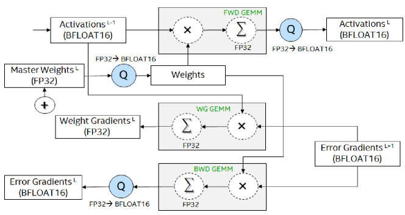

# BFLOAT16 の研究 — 深層学習訓練のための半精度形式

> 原典: [[translations/2019-bfloat16]] ・ `raw/papers/A Study of BFLOAT16 for Deep Learning Training.md`
> 著者: Kalamkar ら（Intel Labs / Facebook / IIIT Hyderabad）
> 2019 年（arXiv:1905.12322）

## 一言まとめ

**「BF16 は範囲に振った 16 ビット形式であり、だから loss scaling が要らない」——今日ほぼ自明のように扱われるこの主張を、5 つの応用領域で実証した論文**である。本 wiki がこれまで二次資料の権威で書いてきた記述の**原典**にあたる。

## 背景と問題意識

2019 年当時、半精度による訓練の候補は 3 つあった——**FP16**・**16 ビット整数**・**BFLOAT16** である。いずれも 16 ビットの入力オペランドと 32 ビットのアキュムレータを持つ。しかし本論文が指摘するとおり、**訓練方法論と広範な実験結果が公開されていたのは最初の 2 つだけだった**。BFLOAT16 はもともと深層学習訓練のために構想された形式であったにもかかわらず、である。

BFLOAT16 の出自も興味深い。もとは DistBelief と TensorFlow において、**分散訓練で計算ノード間の通信量を減らすための「低精度の格納形式」**として導入されたものだった。それが動的範囲の広さと小さいフットプリントゆえに、訓練の加速に特化した数値形式へ転じた——ただし主に Google のエコシステム内で、である。

本論文はこの空白を埋める。**Intel と Facebook の共著**という顔ぶれからも分かるとおり、BF16 を「Google の中の話」から業界標準の候補へ押し出す狙いがある。

### なぜ loss scaling が問題なのか

初学者向けに補っておく。**FP16 は指数部が 5 ビットしかなく、表現できる最小の正規化数が約 $6.1\times10^{-5}$ である。** 逆伝播で流れる誤差勾配はこれより小さくなることが普通にあり、そのままではアンダーフローしてゼロになる。

**loss scaling**（損失のスケーリング）は、損失に大きな定数を掛けてから逆伝播することで、勾配全体を FP16 が表現できる範囲へ押し上げる技法である。更新の直前に同じ定数で割り戻す。単純なフィードフォワードのネットワークなら定数を 1 つ選ぶだけで済むが、**再帰型ネットワークではより洗練された手法が要り、その過程は反復的でデータサイエンティストの時間と資源を相当に食う**。

**この「余計なハイパーパラメータ」を消すのが BFLOAT16 の存在理由である。**

## 提案手法

### 形式そのもの

| Data Type | (符号, 指数, 仮数) | 最大正規化数 | 最小正規化数 | 最小非正規化数 |
|---|---|---|---|---|
| FP32 | 1, 8, 23 | 3.40×10³⁸ | 1.17×10⁻³⁸ | 1.40×10⁻⁴⁵ |
| FP16 | 1, 5, **10** | 6.55×10⁴ | 6.10×10⁻⁵ | 5.96×10⁻⁸ |
| **BFLOAT16** | 1, **8**, **7** | **3.38×10³⁸** | **1.17×10⁻³⁸** | N/A |

要点は 2 つに尽きる。**指数部が FP32 と同じ 8 ビットなので動的範囲が一致し**、**仮数部を 23 → 7 に削っただけ**という構造である。だから FP32 との相互変換が「下位 16 ビットを捨てる／ゼロで埋める」だけで済む——これが実装上の大きな利点になる。

副産物として、**FMA（積和演算）の中核を 8 ビットの乗算器で構築でき、面積と電力を大きく節約しながら FP32 の完全な動的範囲を保てる**。形式の選択がチップ設計に直結する例である。

### 混合精度のデータフロー

<figure>

<figcaption>図1: BFLOAT16 で DNN を訓練するときの混合精度のデータフロー。GEMM は BFLOAT16 の入力を取り FP32 へ蓄積し、Q（Quantlib）がその出力を BFLOAT16 へ戻す。Master Weights のみ FP32 で保たれる。</figcaption>
</figure>

規律は明快である。

- **GEMM は BFLOAT16 入力 → FP32 蓄積。** 出力は Quantlib で BFLOAT16 へ戻して次の層へ渡す。
- **非 GEMM の演算（BatchNorm・ReLU・tanh・sigmoid）も BFLOAT16 入力を受ける。** 中間テンソルのために高精度へ逃げない。
- **バイアスは常に FP32。**
- **重み更新は FP32 のマスターコピーで行う。**

現代の FP8/FP4 の論文（→ [[summaries/2023-fp8-lm]], [[summaries/2025-nvfp4-pretraining]]）が繰り返す「**master weight は高精度に保つ**」という原則が、既にここに現れている。

### Quantlib — ハードウェアがない時代のエミュレーション

BF16 のハードウェアがまだ無かったので、著者らは **FP32 の下位 16 ビットをゼロ化し、それらのビットに基づいて RNE（Round to Nearest Even, 最近接偶数丸め）を行う**ライブラリ Quantlib を作り、IntelCaffe・Caffe2・Neon・TensorFlow の 4 つのフレームワークに組み込んだ。テンソルは FP32 の器のままなので既存の FP32 ライブラリが動き、**数値的な挙動だけが BF16 になる**。

## 実験結果と知見

**5 領域・8 モデル**をカバーしており、これが「包括的な実証研究」を名乗る根拠である。

| 領域 | モデル | 結果 |
|---|---|---|
| 画像分類 | AlexNet | FP32 57.4/80.7% に対し **57.2/80.1%** |
| 画像分類 | ResNet-50 | FP32 74.7/92.0% に対し **同一**、最終 top-1 **75.7%** |
| 音声認識 | DeepSpeech2 | ベースラインに追随 |
| 機械翻訳 | GNMT | De→En **29.3 = 29.3**、Vi→En **17.1 → 18.3**（改善） |
| 生成 | DC-GAN | Inception 1.97 → **2.06** |
| 生成 | SR-GAN | PSNR 26.1749 → 26.1415 |
| 推薦 | Deep & Cross | log loss **0.44372 = 0.44372** |
| 推薦 | DNN Recommender | log loss **0.12520 = 0.12520** |

**すべてハイパーパラメータの変更なし**である。これが本論文の主張の全体であり、精度の数字そのものより「調整が要らない」ことのほうが売りになっている。

### 実務的に効く 2 つの細部

1. **推薦システムでは丸め方式が効く。** 最近接丸めなら FP32 と完全一致するのに対し、**直接切り捨てでは約 0.02% 劣化する**（0.44372 → 0.44393）。論文は「**log loss で 0.001 の劣化は実務上受け入れがたい**」と明記しており、0.02% はぎりぎりの水準である。「16 ビットに落とす」だけでなく「どう丸めるか」が結果を分ける。
2. **RNN は数値範囲の要求が厳しい。** 論文自身が「RNN はより厳しい数値的範囲の要求を持ち、半精度に敏感」と書いており、FP16 で loss scaling が最も面倒になるのもここである。BF16 がそこを素通りできるのが実利になる。

### エミュレーションを超えて

4.5 節が地味に重要である。著者らは **AVX512BF16 命令セット拡張**で ResNet-50 を実際に訓練し、**top-1 75.62%** を得ている。「エミュレーションだから信用できない」という批判への先回りであり、同時に**この論文が Intel のハードウェアロードマップの一部**であることを示している。

## 限界・批判的視点

- **すべてエミュレーションである**（4.5 節の一部を除く）。ビット精度は保証されているが、実ハードウェアでの数値以外の挙動（性能・電力）は検証されていない。
- **Transformer が対象に入っていない。** 2019 年の論文なので当然だが、評価は CNN・RNN・GAN・推薦システムに限られる。**LLM で BF16 が標準になった根拠は本論文にはない**——それは後年の Bloom や Gopher の実地の経験（FP16 だと 100B 超で発散する）から来ている（→ [[summaries/2023-fp8-lm]] の関連研究節）。
- **利害関係がある。** Intel Labs が主導で、AVX512BF16 という自社の命令セットの正当化を兼ねている。結論自体は後年広く追認されたが、比較対象の選び方（FP16 の loss scaling の面倒さを強調する）にはその色がある。
- **仮数 7 ビットの代償を定量していない。** BF16 は FP16 より丸め誤差が大きいはずだが、本論文はその点を測っていない。この非対称性を実測したのは後年の二次資料である（→ [[summaries/2025-llm-quantization-explained]] が 1000 テンソルで比較）。
- **「16 ビットで十分」の根拠は引用に依存している。** 冒頭で「数多くの研究が 16 ビットで十分と示してきた」と述べるが、なぜ 8 ビット仮数で足りるのかの理論的説明はない。

## 実装・運用上の示唆

1. **形式の選択は「ビット数」でなく「指数と仮数の配分」で見る。** BF16 と FP16 は同じ 16 ビットだが、動的範囲と精度のどちらを取るかが正反対である。この見方は FP8 の E4M3/E5M2 の使い分け、NVFP4 の E2M1 ＋ E4M3 スケールにまでそのまま続く。
2. **「ハイパーパラメータが増えない」は一級の設計目標である。** BF16 の勝因は精度ではなく、**loss scaling という調整項目を消したこと**にある。低精度化の提案を評価するときは、精度の表だけでなく「運用者が新たに調整すべきものが増えたか」を見る。
3. **master weight は高精度に保つ。** 2019 年に確立されたこの規律は、FP8 でも FP4 でも生き残っている。
4. **丸め方式を明示する。** RNE か切り捨てかで結果が変わる領域がある（推薦システム）。低精度化の実装では丸めモードを設定として記録する。
5. **エミュレーションで先に検証する。** ハードウェアが無くても、ビット精度のエミュレーションで数値的な挙動は確かめられる。NVFP4 の論文も同様に、アルゴリズムの検証と実行時効率を明確に切り分けている。

## 用語と略称

- **BFLOAT16 / BF16** = Brain Floating Point 16-bit（指数 8 ビット・仮数 7 ビットの半精度形式。FP32 と同じ動的範囲を持つ）
- **FP32 / FP16** = IEEE 754 の単精度／半精度浮動小数点
- **loss scaling**（損失のスケーリング）= 逆伝播前に損失へ定数を掛けて勾配を表現可能な範囲へ押し上げる技法。FP16 訓練に必須で、BF16 では不要
- **GEMM** = General Matrix Multiply（一般行列積。深層学習の計算量の大半を占める）
- **FMA** = Fused Multiply-Add（積和演算。計算の中核プリミティブ）
- **RNE** = Round to Nearest Even（最近接偶数丸め。同距離のときは偶数側へ丸める方式で、統計的な偏りが出にくい）
- **master weight**（マスター重み）= オプティマイザが保持する高精度の重みのコピー。更新の累積誤差を防ぐ
- **subnormal**（非正規化数）= 最小正規化数より小さい値を、精度を落として表現する仕組み。BF16 は持たない
- **動的範囲（dynamic range）** = 表現できる最大値と最小値の比。指数ビット数で決まる
- **AVX512BF16** = Intel の BF16 用命令セット拡張
- **VNNI** = Vector Neural Network Instructions（Intel のニューラルネットワーク向けベクトル命令）
- **SOTA** = State Of The Art（最先端）

## 関連ページ

- [[low-precision-training]] — 本論文が起点となる概念ページ。BF16 → FP8 → FP4 の系譜
- [[model-quantization]] — 推論・配布側の量子化。BF16 と FP16 の違いの記述は本論文が原典
- [[summaries/2023-fp8-lm]] — 4 年後の続き。BF16 を「今や標準」と扱ったうえで FP8 へ進む
- [[summaries/2025-nvfp4-pretraining]] — さらに 2 年後の FP4。master weight を高精度に保つ規律は本論文から続いている
- [[summaries/2024-deepseek-v3]] — BF16 比の相対 loss 誤差で FP8 訓練を評価している。BF16 が基準線として機能している例
- [[transformer-architecture]] — BF16 と FP16 の違いが訓練の安定性に効く話
