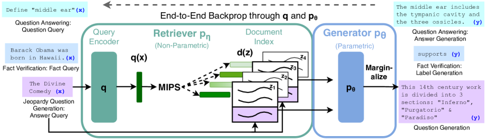

# Retrieval-Augmented Generation for Knowledge-Intensive NLP Tasks

> 原典: [[translations/2020-rag]] ・ `raw/papers/Retrieval-Augmented Generation for Knowledge-Intensive NLP Tasks.md`（ar5iv クリップ, arXiv:2005.11401）
> 著者・年・会議: Patrick Lewis ほか（Facebook AI Research / UCL / NYU）・2020・NeurIPS 2020

## 一言まとめ

**RAG という語の出生証明書**。モデルの重み（パラメトリック記憶）と、Wikipedia 2100 万チャンクの密ベクトル索引（非パラメトリック記憶）を、**検索文書を潜在変数として周辺化する単一の確率モデル**に結合し、end-to-end でファインチューニングした論文。幻覚の減少・知識の即時更新（索引の差し替え）・出所の検査可能性という、今日まで続く RAG の 3 大セールスポイントをすべてこの一本が実証している。GPT-3 と同年（2020）、[[summaries/2022-react]] の 2 年前——「幻覚は外部知識への接地で抑える」という発想の原点である。

## 背景と問題意識

事前学習済み言語モデルが「パラメータの中に事実知識を蓄えている」ことは分かってきたが、その暗黙的な知識ベースには 3 つの構造的欠陥があった: **更新できない**（世界が変わっても再訓練が要る）、**出所を示せない**（なぜその答えかを検査できない）、**幻覚する**。検索ベースのハイブリッドはこの解決策になり得たが、当時の先行研究（REALM・ORQA）は抽出型 QA——検索文書からスパンを抜き出す——に限られていた。本論文の問いは「検索を**生成**（seq2seq）に、しかも汎用のレシピとして組み込めるか」。

## 提案手法

<figure>

<figcaption>図1（再掲）: RAG の構成。クエリ x を Query Encoder が埋め込み、MIPS（最大内積探索）で Document Index から top-K 文書 z を検索、Generator（BART）が x と z に条件づけて生成し、文書にわたって周辺化する。q と pθ を通して end-to-end に誤差逆伝播する。</figcaption>
</figure>

- **検索器 = DPR**（Dense Passage Retriever）: BERT の bi-encoder（クエリ用と文書用）で埋め込み、内積の大きい文書を FAISS の近似最大内積探索で引く。この文書索引が**非パラメトリック記憶**。
- **生成器 = BART-large**（400M）: 入力と検索文書を連結して生成。重みが**パラメトリック記憶**。
- **潜在変数としての文書**: どの文書を使うべきかの教師信号なしで、目的系列の尤度だけから検索まで学習する。周辺化の単位で 2 変種——**RAG-Sequence**（系列全体で同一文書）と **RAG-Token**（トークンごとに別文書。複数文書の内容を 1 つの答えに合成できる）。
- 訓練では文書エンコーダと索引は凍結し、クエリエンコーダと生成器だけを更新（索引の再構築コストを回避する実務的判断）。

## 実験結果と知見

- **オープンドメイン QA で SOTA**（NQ 44.5 / WQ 45.5 / CT 52.2）。しかも抽出型に対する生成型の勝利で、「答えを逐語的に含まない文書もヒントとして寄与できる」「**正解がどの検索文書にもない場合でも 11.8% 正答**（抽出型なら 0%）」という生成ならではの利点を示した。
- **幻覚の定量的な減少**: Jeopardy 質問生成の人手評価で、RAG がより事実的 42.7% vs BART 7.1%。パラメトリックと非パラメトリックの**協働**の分析も美しい——文書の事後分布は書名の最初のトークンで立ち上がり、その後は平坦化する（検索が引き金を引き、続きはモデル内部の知識が補完する）。
- **index hot-swapping**: 2016 年版と 2018 年版の Wikipedia 索引を差し替えるだけで、その年の世界指導者への正答率が 70%/68%（不一致だと 4〜12%）。**再訓練ゼロでの知識更新**の最初の明快な実証で、今日の「ドキュメントを差し替えれば済む」という RAG 運用の原型。
- **retrieval collapse**（付録 H）: 物語生成のようなタスクでは、検索器が**入力を無視して同じ文書ばかり返すよう崩壊**し、生成器も文書を無視するようになる。RAG が効くのは知識集約的タスクであって万能ではない、という境界条件の最初の記録。
- **BM25 が勝つこともある**: エンティティ中心の FEVER では単語重なりの BM25 が密検索を上回る。「密検索が常に正義」ではない。
- 文書数の効果: 増やすと RAG-Sequence は単調改善、RAG-Token は 10 文書でピーク。訓練可能パラメータ 626M で T5-11B（closed-book）を圧倒——**知識はパラメータで持つより索引で持つ方が安い**。

## 限界・批判的視点

- **2020 年の規模の話**である: 生成器は BART 400M、比較対象は T5-11B。数値は歴史的記録として読む。現代の実務では、微分可能な周辺化ごと訓練する原典型より、**推論時に検索結果をプロンプトへ注入する in-context 型**が主流になった（長コンテキスト LLM の登場でファインチューニング不要になったため）——ただし「検索の質が上限」「知識は索引で更新」という本論文の教訓はそのまま生きている。
- **検索の質への依存**: collapse の他にも、DPR の初期化自体が NQ/TQA の検索教師信号に依存しており、「完全に教師なし」ではない。
- 知識源（Wikipedia）のバイアス・不完全性は Broader Impact で著者ら自身が明記。検索で接地しても、**索引が誤っていれば誤りに接地する**。
- 出典表示（provenance）は「検査できる」ことと「引用として正確に示す」ことの間に距離があり、後者は後続の課題として残った。
- エージェント文脈では、RAG は**単発の検索**であり、「検索→読んで→再検索」という反復は扱わない。それは 2 年後に [[summaries/2022-react]] がループとして解く。

## 実装・運用上の示唆

- **知識は差し替え可能な場所に置く**: パラメータに焼き込むより索引に置く。更新は hot-swap、監査は文書を読む——この設計原則は現代の RAG・エージェントのナレッジベース設計にそのまま通用する。
- **collapse の監視**: 検索結果が入力によらず似通ってきたら、それは検索が死んでいるサイン。RAG 系パイプラインのヘルスチェック項目の原点。
- **検索器の選択はタスク依存**: エンティティ中心なら語彙一致（BM25）が強いことがある。密検索一択にしない。
- 複数文書の合成が要る出力（Jeopardy の 2 事実型）にはトークン単位の混合（RAG-Token 的な設計）が効く、という粒度の教訓。

## 用語と略称

- **RAG** = Retrieval-Augmented Generation（検索拡張生成。本論文が命名）
- **パラメトリック / 非パラメトリック記憶** = モデルの重みに埋め込まれた知識／外部の検索可能な知識（本論文では文書索引）
- **DPR** = Dense Passage Retriever（BERT bi-encoder による密ベクトル検索器）
- **bi-encoder / cross-encoder** = クエリと文書を別々に埋め込む方式／連結して 1 つのモデルで採点する方式（後者は再ランキング用）
- **MIPS** = Maximum Inner Product Search（最大内積探索。FAISS で近似）
- **FAISS** = Facebook AI Similarity Search（近似最近傍探索ライブラリ）
- **BM25** = 単語の重なりに基づく古典的検索スコア
- **周辺化（marginalization）** = 潜在変数（ここでは検索文書）について確率を足し合わせること
- **index hot-swapping** = 文書索引の差し替えによる知識更新
- **retrieval collapse** = 検索器が入力を無視して固定文書を返すようになる学習の失敗
- **BART / T5 / REALM / ORQA** = seq2seq 事前学習モデル×2／検索つきマスク言語モデル×2（当時の関連手法）
- **NQ / TQA / WQ / CT / MS-MARCO / FEVER** = オープンドメイン QA×4／抽象的 QA／事実検証のベンチマーク
- **EM / Bleu / Rouge-L / Q-BLEU** = 完全一致／生成品質の n-gram 指標／エンティティ重み付き BLEU

## 関連ページ

- [[retrieval-augmented-generation]] — 本原典が主要根拠となる概念ページ
- [[summaries/2022-react]] — 同じ「幻覚を接地で抑える」目的を、訓練でなくループ内のツール呼び出しで実現した 2 年後の対
- [[tool-use-and-function-calling]] — 検索ツール利用の体系化としての RAG
- [[agent-memory]] — 非パラメトリック記憶・hot-swap は外部記憶設計の原型
- [[reasoning-and-planning]] — 内部知識と外部検索のルーティングという論点の源流
- [[translations/2020-rag]] — 全文翻訳
