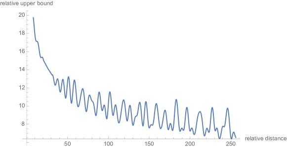
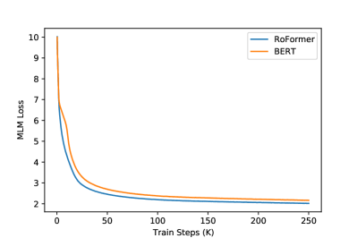
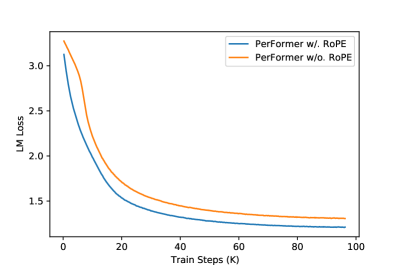

# RoFormer: 回転位置埋め込みによる強化トランスフォーマ

> 原典: [[translations/2021-roformer]] ・ `raw/papers/RoFormer_ Enhanced Transformer with Rotary Position Embedding.md`
> 著者: Jianlin Su, Yu Lu, Shengfeng Pan, Ahmed Murtadha, Bo Wen, Yunfeng Liu（Zhuiyi Technology、深圳）
> 2021-04 arXiv 初出 / 2024 Neurocomputing 掲載

## 一言まとめ

**query と key を、その位置に比例した角度だけ回転させる**——それだけで attention の内積が相対位置 $m-n$ にしか依存しなくなる、という位置符号化 **RoPE（Rotary Position Embedding, 回転位置埋め込み）** を提案した論文。手法を設計したのではなく、「内積が相対位置のみの関数であってほしい」という要求を**関数方程式として立てて解いた**点が本論文の性格である。論文自身の実験は弱いが、RoPE は 2023 年以降のほぼすべての主要 LLM（Large Language Model, 大規模言語モデル）の既定の位置符号化になった。

## 背景と問題意識

### なぜ位置符号化が要るのか

トランスフォーマの self-attention（自己注意, 系列内の各トークンが他のすべてのトークンとの類似度を計算して情報を集める機構）は、**トークンの順序を見ていない**。入力を並べ替えても、出力は同じ並べ替えを受けるだけで中身は変わらない（本論文が引く [^6] の指摘）。RNN が時間方向の再帰で順序を自然に持ち、CNN が受容野で局所順序を持つのに対し、attention は集合演算なのである。だから位置情報は**外から注入する**しかない。

先行研究は大きく 2 系統に分かれていた。

- **絶対位置埋め込み**: 位置 $i$ ごとにベクトル $\boldsymbol{p}_i$ を用意し、単語埋め込みに**足す**。$f(\boldsymbol{x}_i, i) = \boldsymbol{W}(\boldsymbol{x}_i + \boldsymbol{p}_i)$。$\boldsymbol{p}_i$ を学習させる方式（BERT・GPT 系）と、正弦・余弦で生成する方式（Transformer 原論文）がある。
- **相対位置埋め込み**: 位置の絶対値でなく**差** $m-n$ を符号化する。$\boldsymbol{q}_m^\top \boldsymbol{k}_n$ を $(\boldsymbol{x}+\boldsymbol{p})$ で展開すると 4 項に分解でき（本論文の式 (6)）、その項をどう置き換えるかで Shaw ら・Transformer-XL・T5・DeBERTa などの変種が生まれた。

### 本論文が突いた共通の弱点

本論文の観察はこうである。**この 2 系統は結局すべて「位置情報を文脈表現に加算する」形に帰着し、そのために線形 attention と両立しない**。

なぜ両立しないのか。**linear attention**（線形 attention, $\exp(\boldsymbol{q}^\top\boldsymbol{k})$ を $\phi(\boldsymbol{q})^\top\varphi(\boldsymbol{k})$ という分解可能な形に置き換え、行列積の結合法則で $O(N^2)$ を $O(N)$ に落とす手法）は、$\boldsymbol{q}$ 側と $\boldsymbol{k}$ 側を**別々に**計算してから積を取れることに依存している。ところが相対位置の加算項——たとえば $\boldsymbol{x}_m^\top \boldsymbol{W}_q^\top \boldsymbol{W}_k \tilde{\boldsymbol{p}}_{m-n}$——は $m$ と $n$ の**両方**を同時に含む項であり、$q$ 側・$k$ 側に分けて書けない。分解できないなら結合法則が使えず、$O(N)$ 化が壊れる。

つまり、当時「二次計算量からの脱出路」と目されていた linear attention 系（→ [[transformer-architecture]] の attention 系譜）に、**相対位置符号化を載せる方法が無かった**。ここが本論文の出発点である。

## 提案手法 — 設計ではなく導出

### 要求を方程式として立てる

本論文は手法を先に思いつくのではなく、**満たしてほしい性質を式で書く**ところから始める。

$$\langle f_q(\boldsymbol{x}_m, m),\ f_k(\boldsymbol{x}_n, n)\rangle = g(\boldsymbol{x}_m, \boldsymbol{x}_n, m-n)$$

左辺は「位置 $m$ の query と位置 $n$ の key の内積」。右辺は「2 つの単語埋め込みと**相対位置だけ**の関数」。この等式を満たす $f_q, f_k$ は何か、という**関数方程式**である。加えて初期条件 $f_q(\boldsymbol{x}, 0) = \boldsymbol{W}_q \boldsymbol{x}$（位置 0 では素の線形変換に戻る）を課す。

### 2 次元で解く

$d=2$ に限れば、2 次元ベクトルは複素数と同一視できる。任意の複素数は $R e^{i\Theta}$（動径 × 位相）に分解できるので、$f_q, f_k, g$ をすべてこの極形式で書き直すと、方程式は**動径についての式と位相についての式に分離**する。あとは代入するだけである。

1. **$m=n$ を代入する**。すると右辺の相対位置が 0 になり、初期条件と突き合わせられる。ここから**動径部分は位置に依存しない**（$R_q(\boldsymbol{x}_q, m) = \|\boldsymbol{q}\|$、つまり回転してもノルムは変わらない）ことと、**位相のずれ $\Theta_f(\boldsymbol{x},m) - \theta$ は単語埋め込みに依存せず位置 $m$ だけの関数**であることが出る。この関数を $\phi(m)$ と呼ぶ。
2. **$n = m+1$ を代入する**。すると $\phi(m+1) - \phi(m)$ が $m$ に無関係な定数になる。**隣り合う位置での位相の増分が一定**、すなわち $\phi(m)$ は**等差数列**である。
3. 等差数列なら $\phi(m) = m\theta + \gamma$。定数 $\gamma$ は自由に選べるので $0$ と置く。

結論は $f_q(\boldsymbol{x}_m, m) = (\boldsymbol{W}_q \boldsymbol{x}_m)\,e^{im\theta}$。複素数の $e^{im\theta}$ 倍は、実 2 次元では**角度 $m\theta$ の回転**である。**位置に比例した角度だけ回せ**、というのが要求から一意に出てくる答えだった。

内積は $\operatorname{Re}[(\boldsymbol{W}_q\boldsymbol{x}_m)(\boldsymbol{W}_k\boldsymbol{x}_n)^* e^{i(m-n)\theta}]$ となり、確かに位置は差の形でしか現れない。回転の合成が角度の**引き算**を作る、という初等的な事実がすべてを担っている。

### $d$ 次元への一般化

$d$ 次元は $d/2$ 個の 2 次元平面に分け、平面ごとに別々の角速度 $\theta_i$ で回す。内積は平面ごとの内積の和なので、線形性でそのまま合成できる。行列で書けば $2\times2$ の回転ブロックを対角に並べたブロック対角行列 $\boldsymbol{R}^d_{\Theta,m}$ になる:

$$f_{\{q,k\}}(\boldsymbol{x}_m, m) = \boldsymbol{R}^d_{\Theta,m}\boldsymbol{W}_{\{q,k\}}\boldsymbol{x}_m,\qquad \Theta = \{\theta_i = 10000^{-2(i-1)/d}\}$$

角速度 $\theta_i$ は Transformer 原論文の正弦位置符号化と**同じ周波数列**を流用している。低次元の平面は速く回り（近距離を細かく区別する）、高次元の平面はほとんど回らない（遠距離まで滑らかに変化する）。$10000$ という底が、後年 **base 周波数**として長コンテキスト拡張の主要な調整つまみになる（後述）。

<figure>

<figcaption>図1: RoPE の実装。上段は d=2 の場合——ベクトル (x₁, x₂) を、その位置 m と固定の角速度 θ₁ の積 mθ₁ だけ回転させる。下段は d 次元への一般化で、query / key を 2 次元ずつのペアに区切り、ペア i ごとに角速度 θᵢ、トークンごとに位置 1, 2, 3, ... を掛けた角度で回転させる。（[[summaries/2021-roformer]] より引用）</figcaption>
</figure>

self-attention に入れると

$$\boldsymbol{q}_m^\top \boldsymbol{k}_n = \boldsymbol{x}_m^\top \boldsymbol{W}_q^\top\, \boldsymbol{R}^d_{\Theta,\,n-m}\, \boldsymbol{W}_k \boldsymbol{x}_n,\qquad \boldsymbol{R}^d_{\Theta,n-m} = (\boldsymbol{R}^d_{\Theta,m})^\top \boldsymbol{R}^d_{\Theta,n}$$

となる。**query と key に別々に絶対位置を掛けたのに、内積には相対位置だけが残る**。これが RoPE の全体像である。

### 加法から乗法へ

本論文が繰り返し強調するのは、先行研究がすべて**加法的**（$\boldsymbol{x} + \boldsymbol{p}$、あるいは attention スコアに $+b_{i,j}$）なのに対し、RoPE は**乗法的**だという点である。この違いには具体的な帰結が 3 つある。

- **回転行列は直交行列**である（$\boldsymbol{R}^\top \boldsymbol{R} = I$）。ノルムを変えないので、位置符号化がベクトルの大きさを歪めない。論文はこれを「符号化過程の安定性」と呼ぶ。
- **linear attention と組める**。ノルムを保つということは $\phi(\boldsymbol{q}), \varphi(\boldsymbol{k})$ の非負性や大きさを壊さないということで、$\boldsymbol{R}_m\phi(\boldsymbol{q}_m)$ と $\boldsymbol{R}_n\varphi(\boldsymbol{k}_n)$ をそれぞれ**独立に**計算できる。加法的な相対位置項が $q$/$k$ に分離できなかったのと対照的である。冒頭の問題意識がここで回収される。
- **学習パラメータがゼロ**である。$\boldsymbol{R}$ は位置から決定的に計算される。学習可能な位置埋め込み表のように「最大長 $L$」の上限を持たない。

### 実装 — 行列は作らない

$\boldsymbol{R}^d_{\Theta,m}$ は $d \times d$ だが非ゼロ要素は $2d$ 個しかない。素直に行列積を書くと無駄なので、論文は §3.4.2 で**要素ごとの積 2 回と加算 1 回**で済む形を与える:

$$\boldsymbol{R}^d_{\Theta,m}\boldsymbol{x} = \boldsymbol{x} \otimes \begin{pmatrix}\cos m\theta_1 \\ \cos m\theta_1 \\ \cos m\theta_2 \\ \vdots\end{pmatrix} + \begin{pmatrix}-x_2 \\ x_1 \\ -x_4 \\ \vdots\end{pmatrix} \otimes \begin{pmatrix}\sin m\theta_1 \\ \sin m\theta_1 \\ \sin m\theta_2 \\ \vdots\end{pmatrix}$$

第 2 項は「隣接ペアを入れ替えて片方の符号を反転する」だけの操作である。**演算量はほぼゼロで、コストは実質メモリ帯域だけ**——この性質が後年の高速カーネルにとって重要になる。[[summaries/2024-flashattention-3]] が FP8 量子化の前処理（ブロック量子化・非干渉化処理）を「直前の rotary embedding（メモリ帯域律速）へ融合できる」と書けるのは、RoPE がこの軽さだからである。

### 長距離減衰

$\theta_i$ を上の周波数列に取ると、内積の上界が相対距離とともに減衰する。論文の証明は**アーベル変換**（Abel transformation, 総和の部分積分に相当する変形）で内積を $\sum S_{i+1}(h_{i+1}-h_i)$ の形に書き換え、$|S_i|$ の平均が距離とともに減ることを数値的に示す、というものである。

<figure>

<figcaption>図2: RoPE の長距離減衰。横軸が相対距離、縦軸が内積の相対的な上界。振動しながら、相対距離 250 に至るまで単調に減衰していく。「遠いトークン同士は結びつきが弱くあってほしい」という直観に合致する。（[[summaries/2021-roformer]] より引用）</figcaption>
</figure>

ただしこれは**上界**の減衰であって、内積そのものが必ず減衰することの証明ではない。この点は後述の限界で扱う。

## 実験結果と知見

すべて **V100 × 4 のクラウドサーバ 2 台**で実行された。2021 年時点の、大企業ではない研究室規模の実験である。

| 実験 | 設定 | 結果 |
|---|---|---|
| 機械翻訳 | WMT 2014 英独、fairseq、Transformer-base 比 | BLEU **27.3 → 27.5**（+0.2） |
| 事前学習 | BookCorpus + Wikipedia、bert-base-uncased の正弦符号化を RoPE に置換、100k ステップ | MLM 損失の収束が BERT より速い（図3 左） |
| GLUE | 上記事前学習モデルを 6 タスクでファインチューニング | 3 勝 3 敗（下記） |
| linear attention | Enwik8、12 層 char-based PerFormer、RoPE の有無 | 収束が速く損失も低い（図3 右） |
| 中国語長文 | WoBERT の絶対位置を RoPE に置換、34GB で事前学習、CAIL2019-SCM | 512 打ち切りでは同等、**1024 では WoBERT を絶対 1.5% 上回る** |

<figure>

<figcaption>図3（左）: 事前学習の MLM 損失。RoFormer（青）が BERT（橙）より一貫して下を通る。（[[summaries/2021-roformer]] より引用）</figcaption>
</figure>

<figure>

<figcaption>図3（右）: PerFormer（linear attention）に RoPE を入れた場合（青）と入れない場合（橙）の LM 損失。冒頭の問題意識——「線形 attention に相対位置を載せられない」——への直接の応答にあたる実験。（[[summaries/2021-roformer]] より引用）</figcaption>
</figure>

**中国語の長文実験が本論文でいちばん示唆的**である。事前学習を最大系列長 128〜1536 の 6 段階で切り替え（表4）、系列長の上界を上げるほど正解率が上がることを示している。下流の CAIL2019-SCM（中国最高人民法院の判例三つ組の類似判定、大半が 512 文字超）では、打ち切り 512 では既存手法と横並びなのに、**1024 に伸ばすと差がつく**。「長い入力でこそ効く」という主張の唯一の直接証拠である。

## 限界・批判的視点

### 報告が選択的である

GLUE の表 2 を並べ替えるとこうなる。

| タスク | BERT | RoFormer | 差 |
|---|---|---|---|
| QQP (F1) | 71.2 | 86.4 | **+15.2** |
| STS-B (spearman) | 85.8 | 87.0 | +1.2 |
| MRPC (F1) | 88.9 | 89.5 | +0.6 |
| QNLI (acc) | 90.5 | 88.0 | **−2.5** |
| SST-2 (acc) | 93.5 | 90.7 | **−2.8** |
| MNLI-m/mm (acc) | 84.6/83.4 | 80.2/79.8 | **−4.4/−3.6** |

本文は「6 つのうち 3 つで BERT を有意に上回り、その改善は相当なものである」としか書かず、**残り 3 つで負けていることに一切触れない**。しかも負け幅（最大 −4.4）は勝ち幅（QQP を除けば最大 +1.2）より大きい。

さらに **QQP の +15.2 は単独で疑わしい**。BERT-base の QQP F1 は通常 88〜91 前後で報告されるので、ベースライン側の 71.2 が異常に低い。この 1 タスクを除くと「3 勝 3 敗、平均では負け」になる。実験の主張としては**成立していない**と読むべきである。

翻訳の +0.2 BLEU も、単一シードで信頼区間の記載がなく、有意差とは言えない。

### 著者自身が説明を放棄している

§4.5.5 の限界節は率直である。**「なぜ他の位置符号化より速く収束するのか、徹底した説明を欠いている」「長文で優れた性能を示すが、この点についても忠実な説明を思いつけていない」**。手法の導出は厳密なのに、**なぜ効くのかは分かっていない**。この正直さは評価に値するが、同時に本論文の実証部分の弱さでもある。

### 外挿（extrapolation）を一度も検証していない

現在 RoPE が最も強く結びつけられている性質——**訓練時より長い系列への外挿**——を、本論文は**評価していない**。中国語実験の 1024 は「1536 まで含めて事前学習した」モデルの評価であって、訓練長を超えた入力を与えたわけではない。「系列長の柔軟性」は**構造上の性質**（位置埋め込み表を持たないので任意の $m$ を計算できる）として主張されているだけで、実際に外挿が効くかは示されていない。

そして実際、素の RoPE は訓練長を大きく超えると急速に劣化することが後年知られる。それを埋めたのが **Position Interpolation**（位置内挿）や **NTK-aware scaling**、**YaRN** といった後続手法で、本 wiki では [[summaries/2024-deepseek-v3]]（4K → 32K → 128K の 2 段階拡張）や Kimi 系（[[summaries/2026-kimi-k2.5]]）にその実務適用が記録されている。**RoPE の長コンテキスト適性は、本論文が示したものではなく、後から発見・工作されたもの**である。

### 長距離減衰の証明は上界の証明である

§3.4.3 が示すのは $\big|\sum \boldsymbol{q}_{[2i:2i+1]}\boldsymbol{k}^*_{[2i:2i+1]}e^{i(m-n)\theta_i}\big| \le (\max_i|h_{i+1}-h_i|)\sum_i |S_{i+1}|$ という**上界**であり、その上界を成す $\frac{1}{d/2}\sum|S_i|$ が減衰することを図 2 で数値的に確認している。上界が減衰しても内積が減衰する保証はなく、$\max_i |h_{i+1}-h_i|$（$\boldsymbol{q},\boldsymbol{k}$ の内容に依存する項）は距離と無関係に大きくなりうる。**「遠いほど弱くなる傾向がある」以上のことは言えていない**。

### 原典内の表記の揺れ

- $\theta_i$ の定義が式 (15) では $10000^{-2(i-1)/d}$（$i$ は 1 始まり）、§3.3 と §3.4.3 では $10000^{-2i/d}$ と食い違う。添字の起点の違いで、実装上は同じものを指していると読める。
- §3.1 の式 (11) は $g(\cdot,\cdot,m-n)$、§3.4.1 の式 (21) は $g(\cdot,\cdot,n-m)$。符号が逆である。
- 本文は事前学習を「100k ステップ」と書くが、図 3 左の横軸は 250K まで伸びている。
- 式 (16) の $\boldsymbol{x}^\intercal$（$\boldsymbol{x}_m^\intercal$ の誤記）、式 (32) の $\boldsymbol{W}_q\boldsymbol{x}_n$（$\boldsymbol{W}_q\boldsymbol{x}_m$ の誤記）など。

いずれも本質を損なわないが、査読前の arXiv 版の粗さとして記録しておく。

## なぜ RoPE は標準になったのか

**本論文の実験は RoPE の普及をほとんど説明しない**。GLUE は 3 勝 3 敗、BLEU は +0.2、外挿は未検証である。それでも RoPE は 2023 年以降、LLaMA・Qwen・DeepSeek・Kimi・Gemma を含むほぼすべての主要モデルの既定になった。理由は論文が測ったものではなく、**構造そのものが持つ運用上の性質**にある。

1. **追加のパラメータもメモリも要らない**。学習可能な位置埋め込み表（最大長 $L$ × 次元 $d$）が不要で、attention スコアに足す相対バイアス行列（$N \times N$）も不要である。相対位置符号化の利点を、絶対位置符号化のコストで得ている。
2. **トークンごとに閉じている**。$\boldsymbol{q}_m$ の回転は $m$ だけで決まり、$n$ を知る必要がない。だから **KV cache と素直に両立する**——key を回転済みの形でキャッシュしておけば、後から来るどのクエリに対してもそのまま使える。attention スコアに $(m,n)$ 依存の項を足す方式（T5 の相対バイアス等）はこの単純さを持たない。
3. **カーネル融合に乗る**。演算はブロック対角回転だけで、実質メモリ帯域律速である。FlashAttention 系の実装は RoPE を attention カーネルの前段に融合でき（→ [[llm-inference-optimization]]）、追加コストがほぼ消える。
4. **後から調整できるつまみが 1 個ある**。角速度の底 $10000$ を変えるだけで有効な位置解像度が変わる。これが **Position Interpolation / NTK-aware / YaRN** の土台になり、**長コンテキスト化を「再訓練」から「短いファインチューニング」に引き下げた**。学習済みの位置埋め込み表ではこれはできない——表に無い位置は補間するしかなく、その補間に意味がある保証がない。
5. **部分適用ができる**。次元の一部だけ回す、という設計が自然に書ける。Gemma 4 の **p-RoPE**（次元の $p=0.25$ にのみ回転を適用）や DeepSeek-V4 の**部分 RoPE** はこの自由度を使っている（→ [[transformer-architecture]]）。

つまり RoPE が勝ったのは**精度ではなく、システムとしての扱いやすさ**である。本 wiki の他所で繰り返し出る教訓——[[summaries/2022-flashattention]] の「FLOPs でなく IO を見よ」、[[summaries/2021-switch-transformers]] の「top-1 で足りる（削除による実用化）」——と同じ形をしている。

### 乗法であることの代償

ただし乗法性は無料ではない。**RoPE は attention の中に位置依存の行列を挟み込むので、$q$ 側と $k$ 側の行列を事前に畳んでおく最適化を壊す**。

これが具体的に効いたのが DeepSeek の **MLA**（Multi-head Latent Attention）である（→ [[summaries/2025-deepseek-series]]）。MLA は key/value を低ランク潜在ベクトル $\boldsymbol{c}^{KV}$ に圧縮し、生成時はそれだけをキャッシュする。RoPE が無ければ、key の復元行列 $\boldsymbol{W}^{UK}$ は query 側の行列に吸収してしまえるので、潜在ベクトルから key を実体化する必要すらない。ところが RoPE を挟むと間に $\boldsymbol{R}^d_{\Theta,n-m}$ が入り、**これは位置に依存するので固定行列に畳めない**。DeepSeek がやむなく採った解が、**RoPE を担う専用の小さな key $\boldsymbol{k}^R_t$ を分離してキャッシュする**（decoupled RoPE key）という設計である。「乗法だから相対位置がタダで手に入る」ことの裏返しとして、「乗法だから行列を畳めない」というコストが、5 年後の KV cache 圧縮設計に直接現れている。

### 直交行列という共通の道具

面白い対比がある。[[summaries/2024-flashattention-3]] の**非干渉化処理**（incoherent processing）は、$\boldsymbol{Q}$ と $\boldsymbol{K}$ に**同じ**ランダム直交行列 $\boldsymbol{M}$ を掛ける。$\boldsymbol{M}\boldsymbol{M}^\top = I$ なので内積は**変わらない**——外れ値をならしつつ出力を保存するのが目的である。RoPE は $\boldsymbol{q}$ と $\boldsymbol{k}$ に**異なる**直交行列 $\boldsymbol{R}_m, \boldsymbol{R}_n$ を掛ける。内積は変わるが、**変わり方が $n-m$ だけで決まる**。

同じ「直交行列を挿入する」という道具が、片方では**不変性**のため、もう片方では**制御された依存性**のために使われている。しかも両者は実装上、同じカーネルの同じ場所（attention 直前）で融合される。この直交変換という道具は本 wiki で何度も現れており（[[model-quantization]] の外れ値対策、NVFP4 の Random Hadamard 変換 → [[low-precision-training]]）、**「不変量を保ちながら座標系だけ変える」という操作が LLM の実装技術の共通語彙**になっていることが分かる。

## 実装・運用上の示唆

- **位置符号化は attention の前段に置く軽い前処理**として実装する。回転行列は作らず、$\cos m\theta_i, \sin m\theta_i$ のテーブルと隣接ペアの入れ替えで書く。コストはメモリ帯域なので、可能なら attention カーネルへ融合する。
- **key は回転済みでキャッシュする**。位置 $n$ の回転は $n$ だけで決まるので、キャッシュ時に一度掛ければよい。
- **base 周波数（10000）はハイパーパラメータだと思っておく**。長コンテキストに伸ばすときに最初に触る場所である。
- **手法の善し悪しは「導出の美しさ」では決まらない**。本論文は導出が厳密で実験が弱かったが普及した。逆のパターン（実験が強くて構造が扱いにくい）は消えていく。設計を評価するときは、**その手法がシステムの他の部分（KV cache・カーネル・分散・量子化）と何を約束し、何を壊すか**を見るのが実務的である。
- **論文の「3 勝」報告は表を自分で並べ替えて確認する**。本論文の GLUE は良い教訓である。

## 用語と略称

- **LLM** = Large Language Model（大規模言語モデル）
- **RoPE** = Rotary Position Embedding（回転位置埋め込み）。本論文の提案手法
- **RoFormer** = RoPE を組み込んだトランスフォーマの呼称
- **PLM** = Pre-trained Language Model（事前学習済み言語モデル）
- **MLM** = Masked Language Modeling（マスク言語モデリング, 入力の一部を隠して当てさせる事前学習目的）
- **BLEU** = 機械翻訳の自動評価指標。参照訳との n-gram 一致度
- **GLUE** = General Language Understanding Evaluation。自然言語理解の 9 タスク集合
- **BPE** = Byte Pair Encoding（頻出する文字対を順次併合して語彙を作るトークン化）
- **linear attention** = softmax を分解可能な特徴写像で近似し、計算量を $O(N^2)$ から $O(N)$ に落とす attention の変種
- **PerFormer** = ランダム特徴で softmax を近似する linear attention の一種
- **KV cache** = Key-Value cache。生成済みトークンの key/value を保存して再計算を避ける機構
- **MLA** = Multi-head Latent Attention。KV を低ランク潜在に圧縮する DeepSeek の attention
- **YaRN** = Yet another RoPE extensioN。RoPE の周波数を補間してコンテキスト長を拡張する手法
- **CAIL2019-SCM** = Chinese AI and Law 2019 Similar Case Matching。中国語の長文判例類似判定データセット

## 関連ページ

- [[positional-encoding]] — 本論文が属する概念ページ（絶対 → 相対 → RoPE → 拡張の系譜）
- [[transformer-architecture]] — 位置符号化が組み込まれる器
- [[llm-inference-optimization]] — RoPE のカーネル融合と KV cache への影響
- [[context-engineering]] — 長コンテキストの使い方の側
- [[summaries/2022-flashattention]] — 「FLOPs でなく IO」という同型の教訓
- [[summaries/2024-flashattention-3]] — 直交行列を「不変性のために」使う対照例
- [[summaries/2025-deepseek-series]] — MLA と decoupled RoPE key
- [[summaries/2024-deepseek-v3]] — YaRN による 4K → 128K のコンテキスト拡張
- [[summaries/2026-gemma-4]] — p-RoPE（部分適用）
- [[summaries/2026-deepseek-v4]] — 部分 RoPE と KV の混合精度格納
