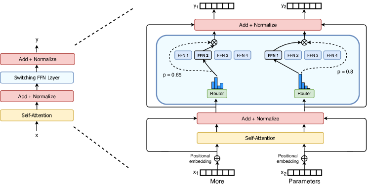
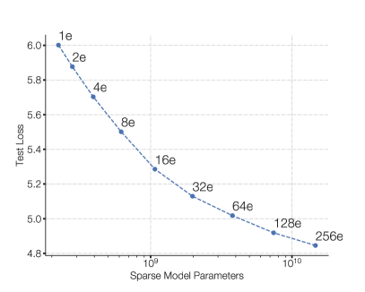
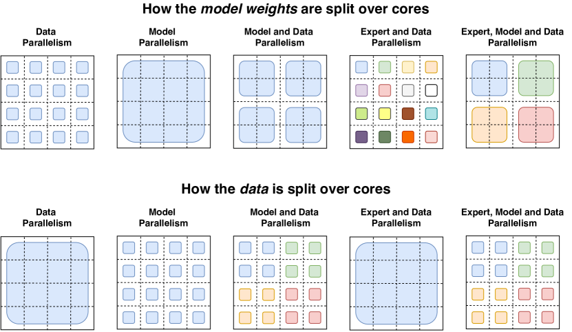

# Switch Transformers（Fedus, Zoph, Shazeer / Google, 2021）

> 原典: [[translations/2021-switch-transformers]] ・ `raw/papers/Switch Transformers_ Scaling to Trillion Parameter Models with Simple and Efficient Sparsity.md`
> 著者・年・出典: William Fedus\*, Barret Zoph\*, Noam Shazeer（Google Brain）・2021・JMLR 23 (2022), arXiv:2101.03961

## 一言まとめ

MoE（Mixture-of-Experts, FFN をエキスパート群＋ルータで置き換える疎な構造）を**徹底的に単純化して実用化を決めた**歴史的原典。「ルーティングは top-1 で十分」という通念への反証・selective precision・小初期化・微分可能な負荷分散損失という「実装レシピ」一式を確立し、**同一計算資源で T5-Base 比 7 倍の事前学習高速化**と史上初の**1.6 兆パラメータモデル（Switch-C, 2048 エキスパート）**を実証した。wiki 内では [[summaries/2023-moe-explained]]（本論文の入門解説）がすでに要点を紹介済みで、本 ingest はその**一次資料**——K2 のスパース性スケーリング則・K2.5/V4 の MoE 設計へ続く系譜の起点——にあたる。

## 背景と問題意識

スケーリング則（Kaplan et al. 2020）は「大きいモデルほどサンプル効率が高い」ことを示したが、密なモデルではパラメータを増やすと計算も比例して増える。MoE はこの結びつきを断つ「条件付き計算」の実装形として Shazeer ら（2017）が LSTM 時代に実証済みだったが、**(1) 複雑さ（top-k ルーティング・複数の補助損失）、(2) 通信コスト、(3) 訓練の不安定性**の三重苦で普及していなかった。本論文の問いはシンプルで、「**総計算（FLOPs）と独立に、パラメータ数それ自体を第四のスケーリング軸にできるか**」。答えとして、MoE の構成要素を一つずつ削り、密行列積向けハードウェア（TPU/GPU）で効率よく動く最小構成を組み立てた。

## 提案手法 / 主張

### Switch 層 — 「top-1 で十分」という反通念

<figure>

<figcaption>図2（再掲）: Switch Transformer エンコーダブロック。FFN をエキスパート群で置き換え、ルータが各トークンを 1 つのエキスパートへ送り、出力にゲート値を掛ける。</figcaption>
</figure>

Shazeer ら（2017）は「ルータに非自明な勾配を流すには k>1 のエキスパート比較が必要」と推測していた。Switch はこれに反して **k=1（各トークンを 1 エキスパートのみへ）**とし、(1) ルータ計算の削減、(2) エキスパート容量の半減以下、(3) 通信の削減と実装の単純化を同時に得る——しかも品質は top-2 の MoE と同等以上（表1: 同一ハードで Switch-Base が MoE-Base を速度・品質とも上回る）。ゲート値 $p_i(x)$ を出力に掛けることで k=1 でも微分可能性は保たれる、という洞察が鍵。

### capacity factor と token dropping

TPU はテンソル形状の静的宣言を要求するため、各エキスパートの処理枠は **expert capacity = (バッチのトークン数 / エキスパート数) × capacity factor** で固定される。あふれたトークン（dropped tokens）は**残差接続で素通し**。CF は 1.0〜1.25 の低い値がむしろ良く（バッファ＝無駄な計算とメモリだから）、負荷分散損失が効いていればドロップ率は典型的に 1% 未満に収まる。

### 訓練を安定させる実装レシピ

1. **selective precision**: bfloat16 のまま訓練すると発散する（表2: −3.780 で diverged）が、**ルータ関数の内部だけ float32** にすれば bfloat16 と同速度で float32 の安定性が得られる。dispatch/combine テンソルは関数末尾で bfloat16 に戻すため、高価な float32 の all-to-all 通信は発生しない——「どこを高精度にすべきか」をモジュール境界で切った最初期の実例。
2. **小さい初期化**: 切断正規分布のスケール s を標準の 1.0 から **0.1 へ 10 分の 1**に。品質の平均が劇的に改善し、実行間分散が 0.68→0.01 に縮む。223M から 1T 超まで同じ方式で通用。
3. **expert dropout**: 少データのファインチューニングでは過学習しやすい（パラメータが密ベースラインの数十倍あるため）。全層の dropout 増は逆効果で、**非エキスパート層 0.1・エキスパート層 0.4** の使い分けが最良。
4. **微分可能な負荷分散損失**: $\text{loss}=\alpha N\sum_i f_i P_i$（$f_i$=エキスパート i へ行ったトークン割合、$P_i$=ルータ確率の割合、$\alpha=10^{-2}$）。一様分布で最小になる単一の補助損失に、Shazeer らの 2 本立て（負荷＋重要度）を単純化した。
5. **input jitter**: ルータの探索には乗法的ジッタノイズが経験的に最良（付録 C。softmax サンプリングは大幅悪化）。

### スケーリング特性 — パラメータは第四の軸

<figure>

<figcaption>図1 左（再掲）: エキスパートを増やす（＝疎にする）ほど、同一 FLOPs でテスト損失が一貫して下がる。</figcaption>
</figure>

FLOPs/トークンを固定してエキスパート数を 2→256 に増やすと、テスト損失は一貫して改善し（図4）、**サンプル効率も単調に向上**する。実時間でも Switch-Base 64e は **T5-Base の 7 分の 1 の時間**で同品質に到達し、3.5 倍の FLOPs を使う T5-Large に対してさえ 2.5 倍速い。頂点の **Switch-C（1.571T パラメータ・2048 エキスパート・モデル並列なし）**は T5-XXL（11B・FLOPs 7 倍）に対し固定パープレキシティへの到達で 4 倍速——「規模はパラメータで買い、計算は疎で節約する」の最初の兆スケール実証である。興味深いことに **Switch-C は訓練不安定ゼロ、FLOPs が 10 倍近い Switch-XXL の方が不安定**——不安定性はパラメータ数でなく FLOPs/トークンに相関するという観察も残した。

### 蒸留と多言語

- **蒸留**: 非エキスパート重みでの学生初期化＋教師確率 0.25/正解 0.75 の混合損失で、**パラメータ 1/20 に圧縮しながらスパースの品質利得の約 30% を保持**（99% 圧縮でも 28%）。「訓練は疎で速く、配布は密で安く」の定跡の出典。
- **多言語**: mC4 の 101 言語すべてで mT5-Base を改善、平均 5 倍・91% の言語で 4 倍以上の高速化——エキスパートの容量がマルチタスク干渉を吸収することの初期の証拠。

### 並列化の体系（§5）

<figure>

<figcaption>図9（再掲）: データ並列・モデル並列・エキスパート並列（とその組み合わせ）での重み・データの分割。MoE サービング解説の定番図の原典。</figcaption>
</figure>

data / model / expert parallelism を「重みの分割」と「データの分割」の 2 軸で統一的に整理した。データ並列は通信ゼロ（勾配集約まで）、モデル並列は分割次元の総和のたびに all-reduce、エキスパート並列は **all-to-all** でトークンをエキスパートの居るコアへ送る。3 者の結合では FLOPs・通信・コアあたりメモリの均衡が複雑になり「最良のマッピングは経験的に決まる」——この整理と課題提起が、後の MegaMoE（[[summaries/2026-deepseek-v4]]）のような通信・計算融合カーネルへ続く出発点である。付録 F に Mesh TensorFlow の擬似コード 3 本（負荷分散損失・ルータ・Switch 層）を完全公開。

### 否定的結果の公開

- **attention への Switch 適用**（付録 A）: 品質は上がるが bfloat16 で発散——今後の課題として見送り。
- **No-Token-Left-Behind**（付録 B）: あふれたトークンを第 2 候補へ再ルーティングしても**利益なし**。「トークンとエキスパートの学習された関連を崩すと逆効果」という解釈は、ルーティングの意味論への初期の洞察。

## 実験結果と知見

- **対 MoE**（表1, 128e・32 コア TPUv3）: Switch-Base は CF 1.0 で 1000 ex/sec と最速、品質閾値到達も 62.8 時間で最短（MoE-Base は 80 時間前後）。
- **対 密モデル**: T5-Base→Switch-Base で SuperGLUE 75.1→79.5・Winogrande 66.6→73.3・TriviaQA 24.5→30.7（表5）。例外は ARC で密が勝つ。
- **兆スケール**（表9）: Switch-XXL（395B, FLOP=T5-XXL）は 50 万ステップで T5-XXL を Neg. Log Perp. 0.087 上回る。ANLI で当時 SOTA（49.4→65.7）、closed-book QA 3 種すべてで T5-XXL 超え。ただし SuperGLUE 等の推論系では**上流の優位が下流に完全には翻訳されない**（付録 E——「パープレキシティが同じでも FLOPs/トークンが少ないモデルは微調整で不利」という未解明の依存を正直に報告）。
- **小規模でも有効**（付録 D）: 2〜8 エキスパートでも T5-Base を改善——「スーパーコンピュータ不要」を明示。

## 限界・批判的視点

- **2021 年の設計であること**: encoder-decoder の T5 系・マスク言語モデリング前提で、shared experts（全トークン処理の共有エキスパート）や細粒度分割はまだない。この後継が DeepSeekMoE 系（共有 1＋細粒度多数、[[summaries/2026-deepseek-v4]] は共有 1＋384 中 6 活性）と K2 のスパース性スケーリング則（[[summaries/2025-kimi-k2]]: 総エキスパート数を増やすほど FLOPs 効率が上がる——本論文の「エキスパート増は逓減」という観察を細粒度化で更新）である。ルーティングも本論文の「学習されたルータ一択」から、V4 の Hash routing（初期層は学習なし）のような使い分けへ分化した。
- **エキスパートの利得は 256 で逓減**と本論文自身が認めており、これが §5 の「補完的スケーリング（d_ff・モデル並列）」の動機。後年の細粒度化はこの逓減の外側に道を見つけた形。
- **微調整の不安定・上流下流ギャップ**は本論文時点で未解決と明記され、[[summaries/2023-moe-explained]] が整理した「疎モデルは小タスクで過学習・instruction tuning とは好相性」という後続知見につながる。
- **速度比較は実装込み**: 7 倍速の主張は TPU＋Mesh TF の静的形状前提であり、脚注で「速度はアルゴリズムと実装の両方の関数」と自己注記している。

## 実装・運用上の示唆

- **MoE を組むならこの論文の既定値から**: top-1・CF 1.0〜1.25・α=1e-2 の負荷分散損失・ルータのみ float32・0.1x 初期化・expert dropout 0.4。ここから外す変更（top-k 増・CF 増）はコスト増に見合う根拠を持って行う。
- **「単純化してからスケール」**: 本論文の成功は機構の追加ではなく削除（top-k→top-1・補助損失 2 本→1 本）から来た。NTLB の失敗（凝った再ルーティングが効かない）も同じ教訓の裏面。
- **付録 F の擬似コードは MoE 実装の最短の教科書**: dispatch/combine テンソルの構成・cumsum による容量制御・all-to-all の位置が 3 関数で完結に読める（翻訳に全文収録）。
- **蒸留の使い所**: 疎で事前学習した利得を密に 3 割持ち帰れる——エッジ配布とサービング簡素化の橋として、Gemma 4 の QAT（[[summaries/2026-gemma-4]]）と並ぶ選択肢。

## 用語と略称

- **MoE** = Mixture-of-Experts ／ **Switch 層**（k=1 ルーティングの MoE 層）／ **FFN** = Feed-Forward Network
- **ルータ / ゲート値**（トークンの送り先を決める学習された線形層とその softmax 確率）／ **top-k ルーティング**（上位 k エキスパートへ送る）
- **expert capacity / capacity factor**（エキスパートあたりの処理トークン枠とその倍率）／ **dropped tokens**（枠あふれで素通しされるトークン）
- **負荷分散損失（auxiliary load balancing loss）**（α·N·Σfᵢ·Pᵢ。一様ルーティングで最小）
- **selective precision**（ルータ内部のみ float32 にする混合精度）／ **bfloat16 / float32**（16/32 ビット浮動小数点形式）
- **expert dropout**（エキスパート層のみ高い dropout を課すファインチューニング正則化）／ **input jitter**（ルータ入力への乗法ノイズ）
- **data / model / expert parallelism**（データ・重み・エキスパートの分割軸 → [[llm-inference-optimization]]）／ **all-reduce / all-to-all**（集約通信／全対全通信）
- **Mesh TensorFlow (MTF)**（名前付き次元でテンソルを分割する分散訓練ライブラリ）／ **SPMD** = Single Program Multiple Data
- **No-Token-Left-Behind (NTLB)**（あふれトークンの反復再ルーティング。効かなかった否定的結果）
- **T5 / mT5 / C4 / mC4**（ベースラインの encoder-decoder モデル群とその事前学習コーパス）／ **GEGLU**（FFN の変種）
- **蒸留（distillation）**（教師の出力分布で学生を訓練する圧縮法）／ **Neg. Log Perp.**（負の対数パープレキシティ。高いほど良い）
- **SuperGLUE / SQuAD / TriviaQA / ANLI / Winogrande**（下流評価ベンチマーク）

## 関連ページ

- [[transformer-architecture]] — MoE 節の一次資料（top-1・負荷分散・安定化レシピ）
- [[llm-inference-optimization]] — expert parallelism・蒸留・selective precision の出典
- [[summaries/2023-moe-explained]] — 本論文を中心に据えた入門解説（2 年後の整理）
- [[summaries/2025-kimi-k2]] — スパース性スケーリング則（本論文の「エキスパート数の逓減」を細粒度化で更新）
- [[summaries/2026-deepseek-v4]] — DeepSeekMoE 系の現在形（共有＋細粒度・Hash routing・MegaMoE）
- [[summaries/2026-gemma-4]] — 「訓練は大きく・配布は小さく」のもう一つの解（QAT）
- [[summaries/2026-gpt2-to-kimi3]] — アーキテクチャ系譜の中での MoE の位置
