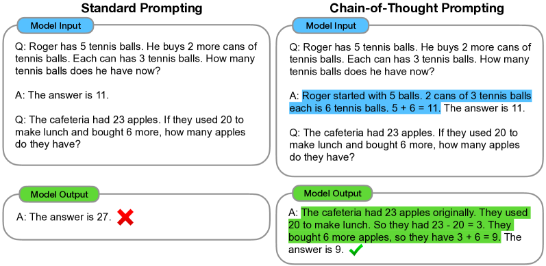

# Chain-of-Thought Prompting Elicits Reasoning in Large Language Models

> 原典: [[translations/2022-chain-of-thought]] ・ `raw/papers/Chain-of-Thought Prompting Elicits Reasoning in Large Language Models.md`（ar5iv クリップ, arXiv:2201.11903）
> 著者・年・会議: Jason Wei ほか（Google Research, Brain Team）・2022・NeurIPS 2022

## 一言まとめ

few-shot プロンプトの例示を「⟨入力, **思考連鎖**, 出力⟩」の 3 つ組にする——つまり**答えの前に途中の推論を書いた見本を見せる**——だけで、大規模言語モデルの推論能力が劇的に向上することを示した論文。ファインチューニングは一切なし。この CoT（Chain-of-Thought, 思考連鎖）は、[[reasoning-and-planning]] の出発点であり、ReAct の thought（[[summaries/2022-react]]）をはじめ現在のエージェントの「考えてから動く」設計すべての祖形である。

## 背景と問題意識

2022 年当時、2 つのアプローチがそれぞれ行き詰まっていた。

- **根拠つき訓練**: 自然言語の途中経過（rationale）を出力するようモデルを訓練・ファインチューニングする方法は有効だったが、高品質な根拠を大量に作るコストが法外だった。
- **few-shot プロンプティング**: GPT-3 が広めた「入力→出力の見本を数個見せる」方法は訓練不要で汎用的だったが、**推論を要するタスクではほぼ効かず、モデルを大きくしても改善しない**（スケーリング曲線が平坦）ことが知られていた。

CoT はこの 2 つを「見本の中に推論を書く」ことで合流させる。追加の訓練データも勾配更新も不要のまま、根拠つき訓練の利点だけを持ち込んだ。

## 提案手法

<figure>

<figcaption>図1（再掲）: 左が標準プロンプティング（見本は Q→A のみ。モデルは「The answer is 27.」と直答して誤る）、右が CoT プロンプティング（見本の A に推論を書く。モデルも推論を生成してから答え、正解する）。</figcaption>
</figure>

やることはこれだけである: few-shot の各例示の答えの前に、人が手書きした**段階的な推論**（8 例示分。プロンプトエンジニアリングなし）を挟む。すると十分大きなモデルは、テスト問題に対しても自分で思考連鎖を生成してから答えるようになる。著者らが挙げる利点は 4 つ——(1) 多段問題を中間ステップに**分解**でき、難しい問題に多くの計算（＝中間トークン）を配分できる、(2) 推論過程が**解釈可能な窓**になりデバッグできる、(3) 言語で解けるタスクなら原理上何にでも適用できる、(4) 既製モデルにプロンプトを与えるだけで引き出せる。(1) は後の [[test-time-compute]]（推論時計算のスケーリング）、(2) はエージェントの trajectory デバッグ（[[agent-observability]]）の萌芽と読める。

## 実験結果と知見

- **創発性（emergence）が最重要の発見**。CoT の効果はモデル規模の外挿から予測できない: **10B 未満ではむしろ有害**（流暢だが非論理的な連鎖を生成）で、**〜100B 級で初めて急伸**する。GSM8K（小学校水準の数学文章題）で PaLM 540B は標準 17.9% → CoT **56.9%**（+39）、Codex は 19.7% → **63.1%**（+43.4）。8 例示のプロンプトだけで、検証器つきファインチューニング済み GPT-3 の SOTA（55%）を超えた。
- **効くのは「難しい・多段・平坦」なタスク**。1 ステップで解ける問題（MAWPS の SingleOp 等）では改善ほぼゼロ〜マイナス。著者ら自身が適用判断の 3 条件（多段推論を要する／大モデル／スケーリング曲線が平坦）として整理している。
- **アブレーションが本質を切り分けた**: (a) **式のみ**出力→GSM8K では効かない（意味論の翻訳に自然言語が要る）、(b) **ドット列で計算量だけ**増やす→効かない、(c) **答えの後に**推論→効かない。つまり「トークンを余分に使う」でも「知識を活性化する」でもなく、**答えの前に自然言語で逐次推論すること自体**が効いている。
- **頑健性**: 別のアノテータ 3 名・ML 素人（クラウドワーカー）の連鎖・別の例示・順序・例示数を変えても優位は維持。ただし分散はあり（コイン投げでアノテータ間 99.6% vs 71.4%）、プロンプトエンジニアリングが決定的なタスクも存在する。
- **常識・記号推論にも汎化**: StrategyQA で SOTA 超え（75.6%）、Sports Understanding で人間愛好家超え（95.4%）。**SayCan（ロボット行動計画）でも +11 ポイント**——CoT がエージェントの計画に効く最初期の証拠。記号推論では、例示より長い入力への **OOD 長さ汎化**を可能にした（末尾文字連結 2 語→4 語: 標準 0% / CoT 63%）。
- **正答の中身の検査**: 正答 50 例中、推論が偶然正しいだけの例は 2。誤答 50 例の 46% は軽微な誤り（計算ミス 8%・記号対応 16%・1 ステップ欠落 22%）で、外部計算機の後付けだけでもスコアが上がる（→ ツールで補うという [[tool-use-and-function-calling]] 的発想の萌芽）。62B→540B のスケールで意味理解・ステップ欠落系の誤りの大半が消えた。

## 限界・批判的視点

- **「推論しているのか」は未回答**と著者ら自身が明言。思考連鎖は人間の思考の模倣であり、モデル内部の計算の説明である保証はない（後続研究では、生成された連鎖が実際の答えの根拠と乖離しうる「不忠実性」も報告される）。
- **正しい推論経路の保証がない**。もっともらしい誤った連鎖でも答えは出る——この幻覚・誤り伝播の問題こそ、外部接地で対処する [[summaries/2022-react]] の直接の出発点になった。多肢選択・二値タスクでは「誤った推論で正答」がずっと起きやすいという指摘も、[[agent-evaluation]] 的に重要（最終正答率は推論品質の代理として不完全）。
- **創発の閾値がコスト問題**を生む: 当時は 100B 級モデルでしか効かず、実運用には高価だった。「小さいモデルで推論を引き出す」は将来課題とされた（後に蒸留・推論特化訓練で大きく前進する領域）。
- モデル間で利得が完全には転移しない（GPT-3 の CSQA/StrategyQA では効かず）。プロンプトの再現性はモデル依存。
- 評価は 2022 年時点の LaMDA / GPT-3 / PaLM / UL2 / Codex。数値は歴史的記録として読むべきで、現行モデルでは多くのベンチが飽和している。

## 実装・運用上の示唆

- **「答える前に考えさせる」は最小コストで最大効果の介入**——ただし条件（多段・大モデル・平坦な曲線）を満たすタスクに限る。簡単なタスクに CoT を足すのはトークンの無駄。
- 連鎖の**言語スタイルは重要でない**（アノテータ非依存）が、**書けるかどうか**が決定的なタスクもある（リスト逆順の逸話）。まず 8 例示・エンジニアリングなしから始めるのが原典流。
- 計算だけ外部ツールに逃がす「CoT ＋外部計算機」は今日のツール併用推論の原型。連鎖中の式を eval に渡すだけで数ポイント上がる。
- 多数決（self-consistency）でさらに改善できることを本文が既に予告している（Wang et al. の CoT-SC。[[summaries/2022-react]] のフォールバック相手）。

## 用語と略称

- **CoT** = Chain-of-Thought（思考連鎖。答えの前に生成する中間推論ステップの列）
- **few-shot プロンプティング / 例示（exemplar）** = 訓練なしで、入出力の見本数個をプロンプトに置いてタスクを教える方法
- **創発的能力（emergent ability）** = 小規模モデルの性能の外挿からは予測できず、ある規模を超えて初めて現れる能力
- **標準プロンプティング** = 見本が Q→A のみ（推論なし）のベースライン
- **OOD** = Out-of-Distribution / Out-of-Domain（ここでは例示より長い入力への汎化）
- **GSM8K / SVAMP / ASDiv / AQuA / MAWPS** = 数学文章題ベンチマーク群
- **CSQA / StrategyQA / Date / Sports / SayCan** = 常識推論ベンチマーク群（SayCan はロボット行動計画）
- **LaMDA / PaLM / UL2 / Codex** = Google の対話・汎用・エンコーダデコーダ LLM と OpenAI のコード特化 LLM（いずれも 2022 年当時）
- **rationale** = 答えに至る根拠・途中経過の自然言語記述

## 関連ページ

- [[reasoning-and-planning]] — CoT が属する概念。本原典で「原典未 ingest」の注記が解消
- [[summaries/2022-react]] — CoT の幻覚・非接地問題への直接の回答（thought + 行動）
- [[test-time-compute]] — 「難しい問題に中間トークンで計算を配分する」発想の後継（未作成）
- [[tool-use-and-function-calling]] — CoT ＋外部計算機はツール併用推論の原型
- [[translations/2022-chain-of-thought]] — 全文翻訳
