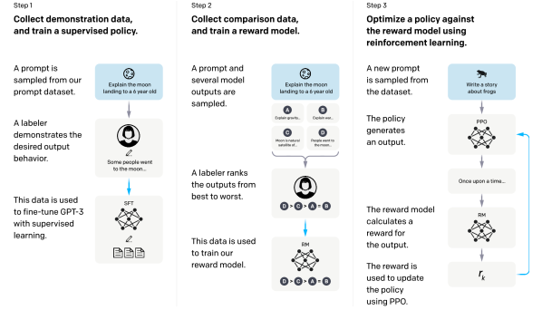
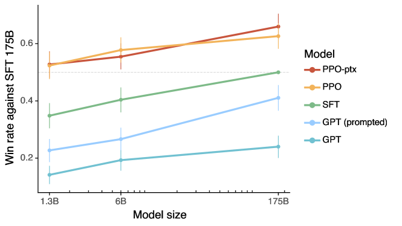

# InstructGPT — 人間のフィードバックで指示に従うよう言語モデルを訓練する

> 原典: [[translations/2022-instructgpt]] ・ `raw/papers/Training language models to follow instructions with human feedback.md`
> 著者・年・会議: Ouyang, Wu, Jiang, Almeida, Wainwright, Mishkin, ... Christiano, Leike, Lowe（OpenAI）/ 2022 / arXiv:2203.02155（NeurIPS 2022）
> 補足: 本 wiki の翻訳はユーザー指示により**本文 §1〜5 のみ**を対象としている。本ページで付録由来の数値に触れる箇所は「付録より」と明示した。

## 一言まとめ

GPT-3 を「デモンストレーションで SFT → 人間の順位づけで報酬モデル → PPO で最適化」の 3 段で仕上げ、**13 億パラメータの InstructGPT が 1750 億の GPT-3 より人間に好まれる**（パラメータ 100 分の 1）ことを示した論文。RLHF（Reinforcement Learning from Human Feedback, 人間のフィードバックからの強化学習）を汎用の指示追従に初めて大規模適用した一次資料であり、ChatGPT の直接の前身にあたる。

## 背景と問題意識

事前学習の目的関数——「ウェブページの次のトークンを当てる」——は、「ユーザーの指示に有用かつ安全に従う」という我々が本当に望むことと**違う**。論文はこれを「言語モデリングの目的は **misaligned（ミスアライン）である**」と表現した。モデルを大きくしてもこのズレは埋まらない。むしろ大きくなるほど、事実の捏造・有害な出力・指示の無視が実害を伴うようになる。

そこで整合の目標を、[^5]（Askell et al.）の語彙を借りて **HHH** に定める:

- **helpful（有用）** — ユーザーがタスクを解くのを助ける
- **honest（誠実）** — 情報を捏造せず、ユーザーを誤解させない
- **harmless（無害）** — 人や環境に身体的・心理的・社会的な害を及ぼさない

ただし論文自身が honesty の測定不能性を率直に認めている点は重要である。「純粋な生成モデルで honesty をどう測るかは明らかでない。これはモデルの実際の出力を、正しい出力についてのモデルの『信念』と比較することを要するが、モデルは巨大なブラックボックスなので信念を推測できない」。そこで代理として**真実性（truthfulness）**——世界についての言明が真か——を測る。測れないものを測れるものに置き換えた、という自覚がある。この「測定可能な代理指標へ落とす」動きは、後の [[agent-evaluation]] の全体的な作法（judge のルーブリック化、終了状態評価）の先取りでもある。

この論文の直前の解説にあたるのが [[summaries/2022-rlhf-illustrated]]（Hugging Face, 2022-12）で、そちらは本論文を含む当時の実践を一般向けに図解したものである。**本ページは同じパイプラインの一次資料**にあたる。

## 提案手法 — 3 段パイプラインと 2 つの目的関数

<figure>

<figcaption>図1（再掲, 原典の Figure 2）: 手法の 3 ステップ。(1) 教師ありファインチューニング（SFT）、(2) 報酬モデル（RM）の訓練、(3) その報酬モデルに対する PPO による強化学習。青い矢印はそのデータがモデルの訓練に使われることを示す。ステップ 2 のボックス A〜D はモデルからのサンプルで、ラベラーが順位づけする。</figcaption>
</figure>

### ステップ 1: SFT（教師ありファインチューニング）

ラベラーが望ましい応答を**書き下ろし**、それで GPT-3 をファインチューニングする。訓練データは約 12.7k プロンプト（付録 Table 6 より: ラベラー作成 11,295 ＋ 顧客 1,430）。

実務的に面白いのは訓練の作法である。**検証損失は 1 エポックで過学習するが、16 エポックまで訓練を続けたほうが RM スコアも人間の選好評価も良くなる**。モデル選択は検証損失ではなく RM スコアで行う。「検証損失が悪化しても本当に欲しい指標が上がるなら訓練を続ける」という判断は、現在の post-training でも繰り返し現れる。

### ステップ 2: 報酬モデル（RM）

SFT モデルから最終の unembedding 層を外し、プロンプトと応答を受け取ってスカラー報酬を返すモデルにする。**6B のみを使う**——175B の RM は訓練が不安定で、RL 中の価値関数として使うのに適さなかったからである（生成側は 175B なので、報酬モデルのほうが小さい）。

データ収集の工夫が 2 つある。第一に、ラベラーには 2 択ではなく **$K=4$〜9 個の応答をまとめて順位づけ**させる。これで 1 プロンプトあたり $\binom{K}{2}$ 個の比較が得られる。第二に、それらを**シャッフルせず 1 バッチ要素として**訓練する。単純にシャッフルして混ぜると、同じ完了が最大 $K-1$ 回の勾配更新に使われることになり、**データを 1 巡しただけで過学習した**（付録の脚注より）。バッチ化すると、$K$ 個の完了に対し RM の順伝播が 1 回で済むので計算効率も上がる。損失は比較のクロスエントロピー:

$$\operatorname{loss}(\theta) = -\frac{1}{\binom{K}{2}} E_{(x,y_w,y_l)\sim D}\left[\log \sigma\left(r_\theta(x,y_w) - r_\theta(x,y_l)\right)\right]$$

RM の損失は報酬の平行移動に対して不変なので、RL の前に**ラベラーのデモンストレーションの平均スコアが 0 になるよう**バイアスで正規化する。

訓練プロンプトは約 33.2k（付録 Table 6 より: ラベラー 6,623 ＋ 顧客 26,584）。順位づけペアの数はプロンプト数より 1 桁多い。

### ステップ 3: PPO / PPO-ptx

環境は**バンディット環境**である——ランダムな顧客プロンプトを提示し、応答を受け取り、報酬モデルが決めた報酬を返してエピソード終了。多ターンではない。価値関数は RM から初期化する。目的関数:

$$\operatorname{objective}(\phi) = E_{(x,y)\sim D_{\pi_\phi^{\mathrm{RL}}}}\left[r_\theta(x,y) - \beta\log\frac{\pi_\phi^{\mathrm{RL}}(y\mid x)}{\pi^{\mathrm{SFT}}(y\mid x)}\right] + \gamma E_{x\sim D_{\text{pretrain}}}\left[\log \pi_\phi^{\mathrm{RL}}(x)\right]$$

第 1 項が報酬から**トークンごとの KL ペナルティ**（係数 $\beta$）を引いたもの。参照は事前学習モデルではなく **SFT モデル**である点に注意（[[summaries/2022-rlhf-illustrated]] の説明では「初期モデル」と抽象化されていた箇所が、ここでは具体的に SFT モデルと明示される）。第 2 項が**事前学習分布の対数尤度**（係数 $\gamma$）で、これを混ぜたものが **PPO-ptx**、$\gamma=0$ が素の **PPO**。論文で「InstructGPT」と言えば PPO-ptx を指す。この第 2 項こそがアラインメント税への処方箋である（後述）。

PPO の訓練プロンプトは 31,144（人間ラベルなし・顧客のみ）。

### データはどこから来たか

プロンプトは主に **OpenAI API の Playground に送信された実プロンプト**である（本番利用のデータは使っていない）。用途分布は生成 45.6%・オープン QA 12.4%・ブレインストーミング 11.2% と、**生成的なタスクが大半**で、分類や QA は合わせて 2 割弱。この分布が後述の「公開 NLP データセットは実利用を反映しない」という結論を導く。

ブートストラップのため、最初期はラベラー自身に 3 種類（Plain / Few-shot / User-based）のプロンプトを書いてもらった。訓練・検証・テストの分割は**ユーザー ID 単位**で行い、PII（個人識別情報）はフィルタしている。

## 実験結果と知見

### 人間の選好: 1.3B が 175B に勝つ

<figure>

<figcaption>図2（再掲, 原典の Figure 1）: API プロンプト分布での人間評価。175B SFT モデルに対する勝率。InstructGPT（PPO-ptx）と事前学習ミックスなしの PPO が GPT-3 系を大きく上回り、1.3B PPO-ptx の出力が 175B GPT-3 より好まれる。エラーバーは 95% 信頼区間。</figcaption>
</figure>

- **175B InstructGPT vs 175B GPT-3: 85 ± 3% で好まれる**。few-shot プロンプトを与えた GPT-3 相手でも 71 ± 4%。
- **1.3B InstructGPT の出力が 175B GPT-3 より好まれる**——同じアーキテクチャで、違いは人間データによるファインチューニングだけ。**パラメータ 100 分の 1 で勝つ**。
- メタデータ軸でも改善: カスタマーアシスタントとしてより適切、明示的な制約（「2 段落以内で」）により従う、指示に完全に従い損ねることが減る、クローズドドメインで**幻覚が 41% → 21%**。
- **汎化の証拠**: 訓練データを一切作っていない held-out ラベラーもほぼ同じ割合で InstructGPT を好む。報酬モデル側でも 5 分割交差検証で、未見グループの選好予測精度 69.6 ± 0.9%（自グループは 72.4 ± 0.4%）と、低下はわずか。

### 公開 NLP データセットは実利用を反映しない

FLAN・T0（公開 NLP タスクを指示形式にした大規模データ集）で 175B GPT-3 をファインチューニングしたものと比較すると、**InstructGPT の勝率 73.4 ± 2% に対し FLAN 29.8 ± 2%・T0 26.8 ± 2%**。FLAN/T0 は SFT ベースラインにすら及ばない。理由は 2 つ挙げられている: (1) 公開データセットは自動指標で測りやすいタスク（分類・QA）に偏るが、それは API 利用の約 18% にすぎず、オープンエンドな生成とブレインストーミングが約 57% を占める。(2) 実世界のユーザーが使いたい種類の入力について、高い多様性を得るのが難しい。

**「ベンチマークで測れるもの」と「ユーザーが実際に使うもの」がずれている**という指摘であり、[[agent-evaluation]] が現在も抱えている問題の最も早い明確な提示のひとつである。

### 真実性・有害性・バイアス — 一様ではない改善

- **真実性**: TruthfulQA で真実かつ有益な回答をおよそ 2 倍の頻度で生成。指示しなくても既定でそうなる。「わからなければ *I have no comment* と答えよ」というプロンプトを与えると、PPO モデルは**自信をもって嘘をつくより、真実だが無益な側に誤る**。
- **有害性**: 「敬意ある出力を」と指示された場合、GPT-3 より約 25% 有害性が低い。**ただしその指示を外すと優位性は消える**。
- **バイアス**: **改善しない**。Winogender / CrowS-Pairs でエントロピー（高いほど偏りが小さい）を測ると PPO-ptx は GPT-3 と同程度で、しかも**敬意をもって振る舞うよう指示するとエントロピーが下がる＝バイアスが上がる**。論文の解釈は「指示されたモデルは、出力がステレオタイプ的かどうかにかかわらず、自分の出力についてより確信的になるように見える」。**整合訓練が「自信」を高め、それが偏りの強化として現れる**という、現在も生きている警告である。

### 決定的に重要な負の結果: 指示されれば有害になる

> 有害な出力を生成するよう明示的にプロンプトされた場合、**InstructGPT の出力は GPT-3 のものよりはるかに有害である**。

同じことが §5.3 でも「おそらく我々のモデルの最大の限界」として繰り返される——**たとえ現実世界で害につながりうるとしても、モデルはユーザーの指示に従ってしまう**。最大限に偏るよう指示すれば、同サイズの GPT-3 より有害な出力を出す。

これは事故ではなく**設計の帰結**である。論文は §3.4 でこう明記している——「**訓練中、我々はユーザーへの有用性を優先する**（そうしないためには困難な設計判断が必要になり、我々はそれを将来の課題とする）。**しかし最終的な評価では、ラベラーに真実性と無害性を優先するよう依頼した**」。つまり**報酬を作るときの優先順位（helpful 優先）と、評価するときの優先順位（truthful/harmless 優先）が逆になっている**。指示追従の能力そのものを報酬で強化した以上、指示が有害な方向を向けばその能力はそのまま有害性に転化する。

この構造は、後に [[summaries/2024-llm-security-privacy-survey]] が **competing objectives**（「常に指示に従う」報酬と無害性の報酬の衝突を突くジェイルブレイクの失敗モード）として一般化するものの、**一次資料における自己申告**にあたる → [[agent-safety-and-guardrails]]。

## アラインメント税（alignment tax）

本論文が導入し、以後の整合研究の共通語彙になった概念。

**定義**: RLHF によるファインチューニングは、API プロンプト分布での有用性を上げる一方で、**特定の公開 NLP データセットでの性能を下げる**（SQuAD, DROP, HellaSwag, WMT 2015 仏→英翻訳）。この性能低下が「整合させるための追加コスト」＝アラインメント税である。

**なぜ問題か**: 論文の論理が鋭い。「税が高い技法は採用されないかもしれない。**将来の高性能な AI システムが人間の意図に整合しないままでいる動機を生まないようにするには、アラインメント税の低い整合技法が必要である**」。つまりアラインメント税は、個々のモデルの性能問題であると同時に、**エコシステム全体で「整合させない」ほうが得になってしまう誘因の問題**である。

**処方箋**: PPO の勾配に**事前学習分布の対数尤度を上げる勾配を混ぜる**（PPO-ptx, 上記目的関数の第 2 項）。これで全データセットの低下が軽減され、HellaSwag では GPT-3 を上回りさえする。ただし DROP・SQuADv2・翻訳では依然として GPT-3 に及ばず、完全解決ではない。

**重要な比較**: 「単に KL 係数 $\beta$ を大きくする」という素朴な代案より、事前学習ミックスのほうが良い。KL 係数を上げると検証報酬が大きく減り、DROP・SQuAD では完全に回復しない。**KL ペナルティは「参照モデルに引き戻す」という汎用の綱であり、失われた特定の能力を狙って戻す道具ではない**——という区別は、現在の post-training の正則化設計にもそのまま通じる。

**コストの実測**（§5.1）: 175B SFT の訓練が 4.9 ペタフロップス/s-日、175B PPO-ptx が 60 ペタフロップス/s-日。対して GPT-3 の事前学習は 3,640 ペタフロップス/s-日。すなわち **RLHF の計算コストは事前学習の約 1.6%**。それでいて「モデルサイズを 100 倍にするより有用性の改善が大きい」。論文の結論は、当時としては挑発的である——**「既存モデルの整合への投資を増やすほうが、より大きなモデルを訓練するより費用対効果が高い」**。

## 誰に整合させているのか（§5.2）

「human preferences」「human values」という言い方が曖昧に使われがちなことに対し、論文は**自分たちが実際に整合させた相手を 4 層に分解**して名指しする。これが本論文で最も誠実な部分である。

1. **訓練ラベラー**。約 40 名の契約者（Upwork / Scale AI 経由）。主に米国または東南アジアに住む英語話者。**互いに 27% 程度は意見が食い違う**（一致率 72.6 ± 1.5%）。
2. **研究者自身**、ひいては OpenAI という組織。ラベリング指示を書いたのも、エッジケースの質問に答えたのも研究者である。「異なる指示集合とインターフェース設計が、収集されるデータと最終的なモデル挙動に与える効果については、さらなる研究が必要」。
3. **API の顧客**。訓練プロンプトは顧客が送ったものなので、暗黙に「顧客が価値があると考えるもの」に整合している。ここで論文は鋭い例を出す——顧客は「ユーザーが自社プラットフォームに費やす時間を最大化する」モデルを望むかもしれないが、それは**エンドユーザーが望むものとは限らない**。しかもラベラーは、そのプロンプトがどんな文脈で使われるかを知る手立てを持たない。
4. **その顧客層の偏り**。API のユーザーは待機リストから選ばれており、**その待機リストの最初の種は OpenAI の従業員だった**——最終的な集団は自社のネットワークに偏る。

結論も踏み込んでいる: 「問題は整合のプロセスをより参加型にすることだけではない。**すべての人の選好に同時に整合したシステム、あるいは誰もがそのトレードオフを支持するようなシステムを訓練することは不可能である**」。前進の道として「特定集団の選好で条件付けられるモデル」を挙げつつ、それでも社会全体への影響は残ると留保する。

**ラベラーの実像**（付録 B より、翻訳には未収録）。選抜は 4 基準——(1) 機微な発話のフラグ付けにおける研究者との一致、(2) 順位づけの一致、(3) 機微なプロンプトへのデモンストレーションの質（1-7 リッカート）、(4) 「どの話題・文化集団について機微な発話を識別できると感じるか」の自己申告（法的理由で属性を条件に雇用できないため、この形を取った）。ソフトな足切りは一致率 75%・デモンストレーションスコア 6/7。任意の匿名調査に回答した 19 名の属性は、東南アジア系 52.6%（フィリピン 22%・バングラデシュ 22%・米国 17%）、**25〜34 歳が 47.4%・18〜34 歳で 73.7%**、学士以上 89.4%。「人間の選好」と呼ばれているものの実体が、**特定の若年・高学歴・英語話者の小集団**であることが数字で開示されている。

## 限界・批判的視点

論文自身が挙げるもの:

- **ラベラー集団の非代表性**。約 40 名は「デプロイされたモデルを使い影響を受ける人々の全域を代表しているとは到底言えない」。データはほぼ全体が英語。
- **コスト制約による品質の妥協**。**ほとんどの比較は 1 名の契約者しかラベル付けしていない**。複数回ラベル付ければ意見の割れる領域を特定できるはずだが、していない。しかも「意見が分かれる場合、**平均的なラベラーの選好に整合させることが望ましいとは限らない**」（少数派集団に不釣り合いに影響するテキストでは、その集団のラベラーを重く重み付けしたい）。
- **モデルは完全に整合も安全もしていない**。有害・偏った出力、事実の捏造、明示的プロンプトなしの性的・暴力的内容の生成が残る。
- **比較は整合信号として最効率とは限らない**。応答をラベラーに編集させる、自然言語の批評を書かせる、といった代替を挙げている（後者は [[summaries/2025-kimi-k2]] の Self-Critique Rubric Reward、[[summaries/2026-deepseek-v4]] の GRM につながる方向）。

読む側から加える視点:

- **歯切れの悪さは報酬設計の副産物である**。InstructGPT が単純な質問に「唯一の答えはありません」と長々答えてしまう傾向について、論文は原因を自己申告している——「**我々がラベラーに認識的謙虚さ（epistemic humility）を報いるよう指示している**ため、ラベラーは歯切れの悪い出力に報い、それが報酬モデルに拾われる」。ルーブリックの一文が出力の性格を決めるという因果が、一次資料で明示されている稀な例である。後の [[summaries/2026-harness-design]] が「採点基準の文言は出力を直接方向づける（『美術館品質』という語が視覚的収束を招いた）」と記録したのと同じ現象であり、**評価基準は中立な物差しではなくプロンプトである**。逆に [[summaries/2025-kimi-k2]] は「ヘッジ禁止・決定的回答への選好」という真逆の規範を採用して**曖昧な場面での過剰な自信**という真逆の副作用を得ており、両者を並べると「どちらに倒しても副作用が出る」ことがわかる。
- **評価の一部は著者自身が後から取り下げている**。謝辞に「自動 TruthfulQA 指標が PPO モデルの改善を過大評価していたことを指摘してくれた Owain Evans と Stephanie Lin に感謝する」とある。自動指標の妥当性検証が事後になった実例であり、[[agent-evaluation]] の「judge・自動指標は使う前に人手と突き合わせて検証せよ」という規律の裏付けになる。
- **バンディット環境である**。1 プロンプト＝1 応答＝1 エピソードであり、多ターンの相互作用もツール使用もない。ここで作られた「指示に従う」能力がそのままエージェントの土台になったのは事実だが（[[summaries/2022-react]] の GPT-3 > PaLM）、**エージェント能力そのものはこの訓練の対象ではなかった**。ツール利用・多ターン・長ホライズンの RL は [[summaries/2025-kimi-k2]] 以降の課題として残される。
- **3 年半の経過による陳腐化**。報酬モデル＋PPO という構成自体が、その後 GRPO（critic の排除, [[summaries/2024-deepseekmath]]）・RLVR（人間の選好を検証器に置換, [[summaries/2025-deepseek-r1]]）・DPO（報酬モデルと RL ループの排除, 本 wiki 未 ingest）に置き換わっている。対応関係は [[summaries/2022-rlhf-illustrated]] の「この記事の賞味期限」節に表で整理済み。一方、**アラインメント税と「誰に整合させるのか」は置き換わっていない**——むしろ検証可能報酬の時代になっても、検証器が書けない領域では同じ問いがそのまま残る。

## 実装・運用上の示唆

- **順位づけはまとめて取り、まとめて 1 バッチにする**。ペアを個別に扱ってシャッフルすると 1 エポックで過学習する。比較データを集める設計では、収集単位とバッチ単位を一致させる。
- **報酬モデルは生成モデルより小さくてよい（というより、大きいと不安定）**。175B RM は訓練が不安定で価値関数に使えず、6B を採用した。判定側の規模は生成側と揃える必要がない。
- **検証損失ではなく本当に欲しい指標でモデル選択する**。SFT は検証損失が 1 エポックで悪化しても 16 エポック回したほうが RM スコアと人間評価が上がる。
- **正則化の道具を目的別に使い分ける**。「特定タスクの性能が落ちた」への対処として KL 係数を上げるのは筋が悪い（報酬全体を潰す）。落ちた能力に対応するデータを目的関数に足す（PPO-ptx）ほうが効く。
- **ルーブリックの一文が出力の性格になる**。「認識的謙虚さに報いよ」と書けば歯切れの悪いモデルが、「ヘッジするな」と書けば過信するモデルができる。評価基準を書くときは、それが**プロンプトとして働く**ことを前提に副作用まで設計する。
- **整合の安さを予算配分の根拠にできる**。事前学習比 1.6% の計算量で、モデルサイズ 100 倍分を超える有用性の改善が得られた。同種の判断——ベースモデルを大きくするか、後段（整合・ハーネス・コンテキスト設計）に投資するか——は現在も繰り返し現れる（→ [[agent-frameworks]]）。
- **「誰の選好か」を設計文書に書く**。本論文の §5.2 は、整合の対象を 4 層（ラベラー／研究者／顧客／顧客層の偏り）に分解して名指しする書式そのものが再利用可能である。自前で選好データを集めるなら、この 4 つは必ず埋まる欄になる。

## 用語と略称

- **RLHF** = Reinforcement Learning from Human Feedback（人間のフィードバックからの強化学習）。人間の選好を学習した報酬モデルを報酬にして LM を強化学習で仕上げる。
- **SFT** = Supervised Fine-Tuning（教師ありファインチューニング）。人間が書いた模範応答で行う通常の教師あり学習。
- **RM** = Reward Model（報酬モデル）。テキストを受けてスカラー報酬を返す。preference model（選好モデル）とも。
- **PPO** = Proximal Policy Optimization（近位方策最適化）。on-policy・信頼領域型の方策勾配法。
- **PPO-ptx** = PPO に事前学習分布の対数尤度の勾配（pretraining mix）を混ぜた変種。アラインメント税の緩和策。本論文の「InstructGPT」はこれを指す。
- **alignment tax（アラインメント税）** = 整合させることの代償として生じる、他タスクでの性能低下。税が高いと「整合させないほうが得」という誘因が生まれる。
- **HHH** = helpful, honest, and harmless（有用・誠実・無害）。本論文が採用した整合の判定基準。
- **KL ダイバージェンス** = 2 つの確率分布の隔たりを測る量。ここでは RL 方策と **SFT モデル**のトークン分布のずれを罰する。
- **バンディット環境** = 1 回の行動で報酬が返りエピソードが終わる、状態遷移のない強化学習の設定。本論文の RL はこれ（多ターンではない）。
- **on-policy** = 現在の方策自身が生成したデータだけで更新する方式。
- **PII** = Personally Identifiable Information（個人識別情報）。
- **epistemic humility（認識的謙虚さ）** = 確信がないことを認める態度。ラベラーへの指示に含まれ、過剰なヘッジの原因になった。
- **TruthfulQA / RealToxicityPrompts / Winogender / CrowS-Pairs** = それぞれ真実性・有害性・性別バイアス・ステレオタイプの評価データセット。
- **FLAN / T0** = 公開 NLP タスクを指示形式に整えた大規模なファインチューニング用データ集。本論文の比較対象。
- **ペタフロップス/s-日** = 1 ペタ FLOP/s の計算を 1 日続けた分の計算量。訓練コストの単位。

## 関連ページ

- [[reinforcement-learning-from-human-feedback]] — 本ページの主な受け皿。古典的 RLHF の一次資料として 2022 節の根拠になる
- [[agent-safety-and-guardrails]] — 「誰に整合させているのか」と、指示追従が有害性に転化する構造
- [[agent-evaluation]] — 「ベンチマークは実利用を反映しない」「自動指標を人手で検証せよ」の一次的な提示
- [[summaries/2022-rlhf-illustrated]] — 同じパイプラインの一般向け解説（本論文の 1 年後）。陳腐化の対応表もそちら
- [[summaries/2024-deepseekmath]] — PPO の critic を排して GRPO へ
- [[summaries/2025-deepseek-r1]] — 人間の選好を検証可能報酬に置き換える
- [[summaries/2025-kimi-k2]] — 選好報酬の現代形（自己批評ルーブリック）と、真逆のルーブリックが生む真逆の副作用
- [[summaries/2024-llm-security-privacy-survey]] — competing objectives としての一般化
- [[summaries/2026-harness-design]] — 「採点基準の文言が出力を方向づける」の再発見
- [[summaries/2022-react]] — 指示追従訓練済みモデルがエージェントとして強い、という下流の観察
