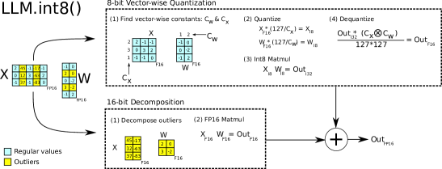
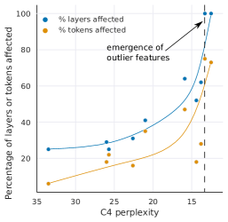

# LLM.int8(): 大規模トランスフォーマーのための 8 ビット行列積

> 原典: [[translations/2022-llm-int8]] ・ `raw/papers/LLM.int8()_ 8-bit Matrix Multiplication for Transformers at Scale.md`
> 著者: Tim Dettmers, Mike Lewis, Younes Belkada, Luke Zettlemoyer
> 年・会議: 2022・NeurIPS 2022（arXiv:2208.07339）

## 一言まとめ

**175B のモデルを性能劣化ゼロで INT8 にした初の手法**。だが本論文の価値の半分は量子化技法そのものではなく、その過程で発見した**創発現象**——67 億パラメータで相転移が起き、たった 6 次元の特徴が model の予測を支配するようになる——の記述にある。

## 背景と問題意識

2022 年時点で、8 ビット量子化は 3.5 億パラメータ未満のモデルでしか研究されておらず、しかも性能を劣化させ、訓練後の追加調整を要していた。**数十億パラメータ規模の量子化は未解決**だった。

なぜ難しいのか。**テンソルごとに 1 つのスケール係数を使うと、たった 1 つの外れ値が他のすべての値の量子化精度を下げる**からである。量子化の範囲が外れ値に引き伸ばされ、大半の量子化ビンが空になり、小さい値がゼロへ潰れて情報が消滅する。

本論文の枠組みは「特定のモデルでどれだけうまくいくか」ではなく「**スケールするにつれてどう振る舞うかの傾向**」を問う。これが本論文の設計を貫いており、後述の創発の発見につながる。

## 提案手法

LLM.int8() は 2 つの部品からなる。

### (1) vector-wise 量子化

行列積を**独立な内積の列**と見なす。隠れ状態 $\mathbf{X}\in\mathbb{R}^{b\times h}$ の**各行**に、重み $\mathbf{W}\in\mathbb{R}^{h\times o}$ の**各列**に、それぞれ別のスケール係数を持たせる。逆量子化は外積 $\mathbf{c}_x \otimes \mathbf{c}_w$ で一括して行える。

> **注**: これは **absmax** ベースであり、NormalFloat ではない。またブロック単位でもない——本論文はブロック量子化を「一つの方法」として引き合いに出したうえで、行／列単位の vector-wise を採る。この 2 点は二次資料でしばしば誤って伝えられているので、[[model-quantization]] に訂正を置いた。

### (2) 混合精度分解——これが中核

vector-wise でも 6.7B を超えると破綻する。理由が明快である——**vector-wise は隠れ状態の各「行」（系列次元）をスケールするが、外れ値は「列」（特徴次元）に生じる**。軸が直交しているので原理的に対処できない。

そこで、大きさが閾値 $\alpha = 6.0$ を超える外れ値を含む特徴次元の集合 $O$ を分離し、

$$\mathbf{C}_{f16}\approx\sum_{h\in O}\mathbf{X}_{f16}^{h}\mathbf{W}_{f16}^{h}+\mathbf{S}_{f16}\cdot\sum_{h\notin O}\mathbf{X}_{i8}^{h}\mathbf{W}_{i8}^{h}$$

と分解する。**外れ値の次元だけ 16 ビットで、残り 99.9% を 8 ビットで**計算する。13B までのモデルで $|O| \leq 7$ なので、追加メモリは約 0.1% にすぎない。

<figure>

<figcaption>図2（再掲）: LLM.int8() の模式図。入力と重みが「大きな大きさの特徴」の部分行列とそれ以外へ分解され、前者は 16 ビット、後者は 8 ビットで乗算されて、最後に 16 ビットで合流する。</figcaption>
</figure>

## 実験結果と知見

### 量子化の結果

C4 パープレキシティ（低いほど良い）で、**スケールしたときの傾向**を見るのが本論文の読み方である。

| 手法 | 125M | 1.3B | 2.7B | 6.7B | 13B |
|---|---|---|---|---|---|
| 32-bit Float | 25.65 | 15.91 | 14.43 | 13.30 | **12.45** |
| Int8 absmax | 87.76 | 16.55 | 15.11 | 14.59 | **19.08** ← 悪化 |
| Int8 absmax vector-wise | 35.84 | 16.82 | 14.98 | 14.13 | **16.48** ← 悪化 |
| Int8 zeropoint vector-wise | 25.72 | 15.94 | 14.36 | 13.38 | 13.47 |
| **LLM.int8()** | 25.83 | 15.93 | 14.44 | 13.24 | **12.45** ← 完全一致 |

**13B の 8 ビットが 6.7B の 8 ビットより悪い**——スケールすると良くなるはずのものが逆転する。この非単調性が「破綻」の可視化である。LLM.int8() だけが 32 ビットに一致し続ける。zeroshot でも 125M〜175B にわたって 16 ビットの性能を保つ。

### 創発する外れ値——本論文のもう一つの本体

§4 は量子化を離れて、**なぜ破綻するのか**を記述的に分析する。ここが最も引用価値が高い。

- **相転移は 6B〜6.7B の間で突然起こる。** 影響される層が 65% → 100%、系列次元が 35% → 75% へ跳ぶ。この跳躍が量子化の破綻と**同時に**起こる。
- **外れ値は極端に集中している。** 6.7B・系列長 2048 で 1 系列あたり**約 15 万個**の外れ値が生じるが、それらは**わずか 6 個の隠れ次元**に集中する。全特徴の約 0.1%。
- **その 0.1% がモデルを支配している。** 外れ値の次元をゼロにすると **top-1 attention softmax 確率が 40% → 20%**、検証パープレキシティが **600〜1000% 悪化**する。**ランダムな 7 次元**を同じように消すと、確率の減少は 0.02〜0.3%、パープレキシティの悪化は 0.1%。3 桁以上の差である。
- **外れ値はほぼ片側**（正だけか負だけか）である。だから非対称量子化である zeropoint が効く。混合精度分解を入れるとその優位が消えるのは、**残った特徴が対称になったから**という説明が付く。

そして最も深い知見:

<figure>

<figcaption>図3(b)（再掲）: C4 パープレキシティを横軸に取ると、外れ値に影響される層と系列次元の割合は滑らかな指数曲線として現れる。パラメータ数を横軸に取った (a) の「突然の相転移」とは印象が正反対になる。</figcaption>
</figure>

**パラメータ数で測ると突然だが、パープレキシティで測ると滑らかである。** そして外れ値の数は**パープレキシティに対して厳密に単調**だが、モデルサイズに対しては非単調である。著者らの結論は「**相転移を決めるのはモデルサイズでなくパープレキシティ**」であり、そこから「**小さなモデルの指数的傾向を研究すれば、相転移が起こる前に創発を予測できるかもしれない**」という含意が出る。創発を「規模の閾値」でなく「損失の関数」として捉え直す提案である。

### 速度——正直な数字

本論文は**メモリが主眼で速度は副次的**であり、そのことを隠していない。

| GPT-3 サイズ | Small(768) | 2.7B(2560) | 6.7B(4096) | 13B(5140) | 175B(12288) |
|---|---|---|---|---|---|
| Int8（オーバーヘッドなし） | 0.99x | 1.63x | 1.67x | 2.13x | 2.29x |
| **LLM.int8()（実測）** | **0.14x** | **0.64x** | **0.86x** | 1.22x | 1.81x |

**モデル次元 4096 以下では FP16 より遅い**。混合精度分解を加えると 6.7B でもまだ 0.86x である。BLOOM-176B のエンドツーエンドでは 8 台の A100 で bfloat16 の 239ms/token に対し LLM.int8() が 253ms——**わずかに遅いが、4 台や 3 台の GPU に収まる**ところに価値がある。

本論文の実質的な貢献は「速い」ではなく「**これまで載らなかったモデルが載る**」ことである。8×RTX 3090（24GB）で OPT-175B/BLOOM が動く、というアクセシビリティの表が §6 に置かれている。

## 限界・批判的視点

著者ら自身が 4 つ挙げている。

1. **Int8 のみ。FP8 は研究していない**（当時の GPU/TPU が未対応）。
2. **175B までしか検証していない。** さらに大きい規模では追加の創発的性質が手法を壊すかもしれない。
3. **attention 関数自体は 8 ビット化していない。** パラメータを持たないので必須でなかったが、初期的な探究では追加の手法が要ることが分かったという。
4. **推論のみ。訓練・ファインチューニングは扱っていない。** 付録 E/F の初期実験は示唆的で、**8 ビットの FFN 層は劣化を招かないが、attention の線形射影を 8 ビットにすると劣化する**（NMT では BLEU 28.9 → unstable、混合精度分解を 2% 入れて 28.0）。

加えて読む側で補うべき点:

5. **速度の主張は注意して読む。** 「175B 相当の大きな行列積で約 2 倍速い」は本文にあるが、**実運用のモデルサイズ帯（〜6.7B）ではむしろ遅い**という事実が並記されている。この点は翌年 [[summaries/2022-smoothquant]] が「LLM.int8() は FP16 より遅い」と正面から批判する形で引き継がれる。
6. **混合精度分解はハードウェアに優しくない。** 疎な列を抜き出して別の行列積にするので、GEMM カーネルの規則的な流れが崩れる。これも SmoothQuant の主要な批判点になった。
7. **閾値 $\alpha=6.0$ は経験的**である。125M モデルで単一の外れ値だけが検出されるよう逆算した閾値であり、原理から導かれたものではない。
8. **創発の分析は記述的で、機構の説明ではない。** なぜ 6 次元なのか、なぜその次元なのかは答えていない（関連研究では LayerNorm やトークン頻度分布との関係が指摘されている）。

## 実装・運用上の示唆

- **量子化の失敗は「軸の不一致」として診断できる。** vector-wise が効かないのは精度が足りないからではなく、**スケーリングの軸（行＝系列）と外れ値の軸（列＝特徴）が直交している**からである。量子化手法を選ぶとき、その手法がどの軸をスケールし、自分のモデルの外れ値がどの軸に出るかを突き合わせるのが最初の一歩になる。
- **「0.1% が支配する」構造は設計に効く。** 外れ値が疎かつ体系的（＝どの次元かが安定）だからこそ分離が成立する。これは [[summaries/2022-smoothquant]] の「外れ値は固定チャネルに持続的に現れる」と同じ観察であり、**チャネル／ブロック単位の対処が効く理由の根拠**である（→ [[model-quantization]] の外れ値対処の 4 系統）。
- **メモリと速度を分けて評価する。** 本論文は「メモリ半減・性能劣化ゼロ」を達成しつつ「小さいモデルでは遅くなる」ことを同じ論文の中で報告している。**量子化の採否は、自分の目的がメモリなのか速度なのかを先に決めてから判断する**（→ [[model-quantization]] の「量子化＝高速化ではない」）。
- **創発の予測可能性という含意。** 「パープレキシティで測れば滑らか」という発見は、量子化以外にも一般化しうる方法論的示唆である——**創発的な振る舞いを規模でなく損失の関数として追えば、小さなモデルで先に検出できるかもしれない**。

## 用語と略称

- **absmax 量子化** = テンソルの絶対最大値でスケールする対称量子化。$[-127,127]$ へ写す
- **zeropoint 量子化** = ゼロ点でずらす非対称量子化。ReLU 出力のような片側分布で全ビット範囲を使える
- **vector-wise 量子化** = 行列積を独立な内積の列と見なし、行と列に別々のスケール係数を持たせる手法
- **混合精度分解（mixed-precision decomposition）** = 外れ値の特徴次元だけを 16 ビットの行列積へ分離し、残りを 8 ビットで計算する
- **創発的な外れ値特徴（emergent outlier features）** = 規模とともに現れる、他より桁違いに大きい少数の特徴次元
- **相転移（phase shift）** = 6B〜6.7B の間で外れ値が全層・全系列次元へ一斉に広がる現象
- **C4** = Common Crawl の部分集合。本論文で言語モデリングのパープレキシティ評価に使う
- **top-1 softmax 確率** = attention の最大の重み。外れ値を消すと 40% → 20% へ落ちる
- **OPT / BLOOM / GPT-J / FSEQ** = 評価に用いた公開モデル群（FSEQ は fairseq で訓練された Meta AI のモデル）
- **nuQmm / ZeroQuant** = 並行研究。より細かい group-wise 量子化を用いるが、カスタム CUDA カーネルを要する

## 関連ページ

- [[model-quantization]] — 本論文が主要な根拠となる概念ページ。二次資料の誤り（「NF8」やブロック量子化との混同）の訂正もここにある
- [[summaries/2022-smoothquant]] — 本論文を名指しで批判し、混合精度分解のハードウェア効率の悪さを数字で示した後続研究
- [[summaries/2023-qlora]] — 同じ Tim Dettmers による続き。本論文が「推論のみ、訓練は未解決」と残した部分に答える
- [[transformer-architecture]] — 創発的な外れ値は規模に伴うアーキテクチャの性質でもある
- [[llm-inference-optimization]] — メモリと速度が別の目的関数であることの実例
- [[summaries/2024-deepseek-v3]] — FP8 訓練における細粒度量子化。本論文が「訓練は今後の課題」とした領域の後年の答え
