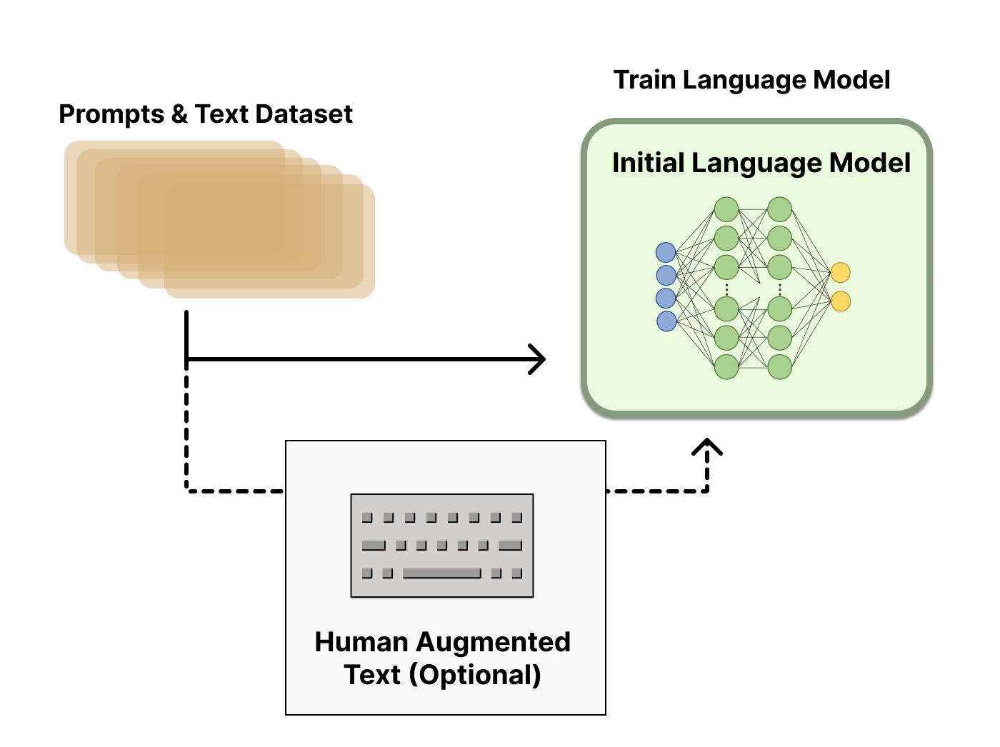
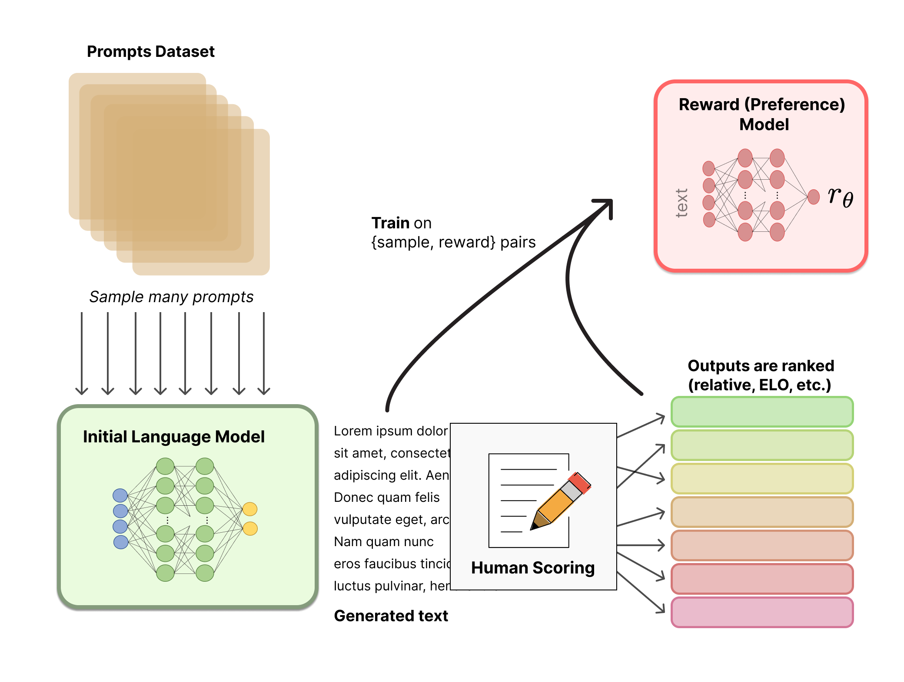

# 図解 RLHF — 人間の選好を報酬に変える 3 段パイプライン

> 原典: [[translations/2022-rlhf-illustrated]] ・ `raw/articles/Illustrating Reinforcement Learning from Human Feedback (RLHF).md`
> 著者・年・媒体: Nathan Lambert, Louis Castricato, Leandro von Werra, Alex Havrilla / 2022 年 12 月 9 日 / Hugging Face Blog

## 一言まとめ

ChatGPT 公開の直後に書かれた、**RLHF（Reinforcement Learning from Human Feedback, 人間のフィードバックからの強化学習）の標準的な解説記事**。「事前学習 → 報酬モデルの訓練 → PPO による微調整」という 3 段パイプラインを図解で分解し、なぜ人間に点数ではなく**順位**を付けさせるのか、なぜ報酬に **KL ペナルティ**が要るのか、といった設計の理由まで降りて説明する。新規の研究成果はなく、当時の実践の**教科書的な整理**である点に価値がある。

## 背景と問題意識

出発点は評価の問題である。言語モデルは次トークン予測の損失（交差エントロピー）で訓練されるが、「良いテキスト」は主観的で文脈依存であり——創作なら創造性、説明文なら真実性、コードなら実行可能性——**その良さを捉える損失関数を書き下すことができない**。代替として BLEU や ROUGE のような自動指標が使われてきたが、これらは生成文を参照文とルールで比較するだけなので、やはり人間の好みを測れない。

そこで記事はこう問う——**人間のフィードバックを「指標」としてだけでなく「損失」として使えないか**。これが RLHF の発想である。

この問題設定は、この wiki の [[agent-evaluation]] の系譜の出発点でもある。「参照文との自動照合では品質を測れない → 人間の選好を直接測る → その人間評価が高すぎるので LLM に代行させる」という流れの最初の一歩が本記事の時点にあたり、後の LLM-as-a-judge（[[summaries/2025-masft]] の o1 ジャッジ、[[summaries/2025-multi-agent-research-system]] の単一ジャッジ設計）も、Chatbot Arena の Elo（[[summaries/2026-gemma-4]] の主評価）も、ここで導入された「人間の相対比較を数値に落とす」道具立ての直系の子孫である。

エージェントの文脈でこの記事が効いてくるのは、**なぜ現代のモデルが指示に従うのか**の製造工程を与えるからである。[[summaries/2022-react]] が観察した「指示追従の訓練を受けたモデルほどエージェントとして強い」（GPT-3 > PaLM）という事実の裏側にあるのが、まさにこのパイプラインである。

## 提案手法 / 主張 — 3 段パイプライン

### ステップ 1: 言語モデルの事前学習

古典的な事前学習目的で訓練済みのモデルから始める。当時の実例として、OpenAI は InstructGPT に GPT-3 の小型版を、Anthropic は 1000 万〜520 億パラメータ、DeepMind は 2800 億の Gopher を使った。

任意で追加の微調整を挟んでよい（OpenAI は「望ましい」人間生成テキストで、Anthropic は自社の **HHH 基準（helpful, honest, and harmless, 有用・誠実・無害）**に関する文脈手がかりで元モデルを蒸留した）が、必須ではない。**核心は「多様な指示にうまく応答するモデル」を用意すること**だとされる。

記事はここで最初の率直な留保を置く——「RLHF の出発点としてどのモデルが最良かに明確な答えはない。**RLHF 訓練の設計空間はまだ徹底的に探索されていない**」。これは記事全体を貫くテーマとして繰り返される。

<figure>

<figcaption>図1（再掲, 原典の図2）: ステップ 1。プロンプトとテキストのデータセットから初期言語モデルを訓練する。人間が拡張したテキストによる追加微調整は破線＝任意。</figcaption>
</figure>

### ステップ 2: 報酬モデルの訓練 — なぜ点数でなく順位なのか

**報酬モデル（RM, reward model。選好モデル (preference model) とも）**は、テキスト列を受け取って**スカラーの報酬**を返すモデルである。スカラーであることが決定的に重要で、そうでないと既存の RL アルゴリズムに接続できない。

データの作り方はこうである。プロンプト集合をサンプリング（Anthropic は Amazon Mechanical Turk のチャットツール、OpenAI は GPT API に実際に送られたユーザープロンプト）→ 初期 LM に通してテキストを生成 → **人間のアノテータがその出力を順位づけする**。

ここが本記事で最も実務的に有益な箇所である。素朴には「各テキストに 1〜10 点を付けさせればよい」と思えるが、**それは実際にはうまくいかない**。人間ごとに価値基準が違うため、スコアが較正されずノイズだらけになるからだ。そこで**順位づけ（ranking）**を使う——同一プロンプトに対する 2 モデルの出力を一対一で比較させ、**Elo**（チェスと同じ相対レーティング系）で相対順位に集約し、最後にスカラー報酬へ正規化する。「絶対評価は当てにならないが相対比較は安定する」という、人間評価一般に通じる原則の応用である。

もうひとつの観察: 成功している RLHF システムでは、**報酬モデルのサイズが生成モデルに対してまちまち**である（OpenAI は 175B の LM に 6B の RM、Anthropic は双方 10B〜52B、DeepMind は双方 70B の Chinchilla）。記事の直感的解釈は「テキストを生成するのに必要な容量と同程度の、テキストを理解する容量が選好モデルにも要るのだろう」というものである。

<figure>

<figcaption>図2（再掲, 原典の図3）: ステップ 2。多数のプロンプトを初期 LM に通し、生成テキストを人間が採点・順位づけする。その {サンプル, 報酬} ペアで報酬（選好）モデルを訓練する。出力はスカラー r_θ。</figcaption>
</figure>

### ステップ 3: PPO による微調整 — RL 問題としての定式化

初期 LM の**コピー**を、方策勾配法である **PPO（Proximal Policy Optimization, 近位方策最適化）**で微調整する。定式化は次のとおり:

| RL の要素 | 言語モデルでの中身 |
| --- | --- |
| 方策（policy） | プロンプトを受けてテキスト（＝トークン上の確率分布）を返す LM |
| 行動空間（action space） | 語彙の全トークン（当時で約 5 万） |
| 観測空間（observation space） | 取りうる入力トークン列の分布（次元はおよそ「語彙サイズ ^ 入力長」） |
| 報酬関数（reward function） | 選好モデルのスコア ＋ 方策のずれへの制約 |

報酬の式が本記事の中心である。プロンプト $x$ に対して現在の方策が生成したテキスト $y$ を選好モデルに通してスカラー $r_\theta$ を得る。同時に、RL 方策のトークンごとの確率分布を**初期モデル**のそれと比較し、両者の **KL ダイバージェンス（Kullback–Leibler divergence, 2 つの確率分布の隔たりを測る量）**をスケールしたペナルティ $r_{\text{KL}}$ を計算する。最終的な報酬は:

$$r = r_{\theta} - \lambda r_{\text{KL}}$$

**なぜ KL ペナルティが要るのか**——記事の説明が明快である。これがないと、最適化は「**意味をなさない出鱈目でありながら報酬モデルを騙して高い報酬を得る**テキスト」を生成し始めうる。これは今日 **reward hacking**（報酬の抜け穴を突く学習）と呼ばれる現象の、最も早い一般向けの記述のひとつであり、この wiki が後の原典で追いかけている論点——[[summaries/2025-deepseek-r1]] がニューラル報酬モデルを意図的に避けた理由、[[summaries/2025-cot-faithfulness]] がハックの言語化率 <2% を実測した対象——の出発点にあたる。**報酬モデルを置いた瞬間にハックの対象が生まれる**という構造は、この時点ですでに認識されていた。

更新則は PPO のパラメータ更新である。PPO は **on-policy**（現在のバッチのプロンプト–生成ペアだけで更新する）かつ**信頼領域（trust region）型**——勾配に制約を課して更新ステップが学習を不安定にしないようにする——のアルゴリズムで、**すでに枯れていたことがそのまま採用理由になった**と記事は述べる。「RLHF のための中核的な RL の進歩の多くは、馴染みのあるアルゴリズムでこれほど大きなモデルをどう更新するかを解明することだった」という一文は、当時の実態をよく表している。

<figure>

<figcaption>図3（再掲, 原典の図4）: ステップ 3 の全体図。RL 方策の出力が報酬モデルでスカラー化され、KL ペナルティ項 −λ_KL·D_KL(π_PPO ‖ π_base) を加えたものが PPO の更新に送られる。初期モデルは訓練中に更新されない。</figcaption>
</figure>

**任意の第 4 段: Iterated Online RLHF**。RL 方策の更新に合わせてユーザーに新旧出力を比較させ続け、報酬モデルと方策を交互に更新していく形式。Anthropic の HH 論文（arXiv:2204.05862）が論じている。当時ほとんど実装例が語られなかったのは、**この種のデータ収集は熱心なユーザー基盤を持つ対話エージェントでしか成立しない**からだ、と記事は指摘する。データ収集ループを製品として持てるかどうかが訓練手法の選択肢を決める、という現代的な論点がすでに現れている。

## この記事の賞味期限 — 2022 年 12 月から何が変わったか

本記事は 3 年半以上前のものであり、**パイプラインの骨格は今も有効だが、その中身のほとんどは入れ替わっている**。この wiki の他の原典と突き合わせると、変化は以下のように整理できる。

| 本記事の記述（2022-12 時点） | その後（2026-08-01 時点） |
| --- | --- |
| RL 最適化器は事実上 PPO 一択。「PPO は古いアルゴリズムだが、他の手法が利点をもたらせない構造的理由はない」と将来の変化を予告 | 予告どおり入れ替わった。**GRPO**（[[summaries/2024-deepseekmath]], 2024）が PPO の **critic（価値関数モデル）を丸ごと排除**——同一問題への G 個のサンプルの報酬をグループ内で標準化して advantage にする。PPO の 4 モデル構成（policy／critic／reward／reference）が重すぎたことへの直接の回答であり、本記事が「馴染みのアルゴリズムで巨大モデルをどう更新するか」と呼んだ問題の解決である。**DPO**（Direct Preference Optimization, 2023。この wiki には原典未 ingest）は、報酬モデルと RL ループ自体を消して選好データから直接最適化する方向に進んだ |
| 報酬は人間の選好から得るもの | **RLVR**（Reinforcement Learning with Verifiable Rewards, 検証可能報酬による強化学習）が並び立った。[[summaries/2025-deepseek-r1]] は**ルールベース報酬 2 種だけ**（答え合わせ＋書式）で大規模 RL を回し、長い思考と自己検証の**創発**を示した。人間のアノテーションが要らないので、本記事が最大の障壁として挙げたコスト問題を回避する。現在は「検証できるタスクはルール報酬・できないタスクは選好報酬」の分業が実際の姿である |
| 「汎用 LM 向けの大規模 RLHF データセットは Anthropic の hh-rlhf が唯一」「約 5 万件の選好サンプル」「大学の研究室には高い」 | 陳腐化。オープンな選好データセットは多数存在し、加えて RLVR は選好データそのものを不要にした。「人間の選好データが律速」という前提自体が崩れている |
| 主要な OSS は **TRL / TRLX / RL4LMs** の 3 本柱。TRLX は「近く 2000 億パラメータまで対応予定」 | エコシステムは **TRL に一本化**した。2026-08-01 時点で GitHub の最終コミットを確認したところ、**TRLX は 2024-01・RL4LMs は 2024-03 で更新が止まっている**（いずれもアーカイブ宣言はされていない）のに対し、**TRL は同日にコミットがあり約 19,000 stars と活発**。TRL は記事執筆時の `lvwerra/trl` から `huggingface/trl` へ移り、PPO 専用ツールではなく DPO・GRPO を含む事後訓練の総合ライブラリになった |
| 「10B や 100B+ のモデル全体の微調整は法外に高価なのでパラメータの一部を凍結する（LoRA 等を参照）」 | これは**予算制約下の作法**であって普遍則ではない。記事のコメント欄でも指摘されているとおり、大手ラボは base モデルの微調整・RL 段でパラメータを凍結しない運用が一般的で、凍結は [[parameter-efficient-fine-tuning]]（PEFT / LoRA）を使う側の事情である。図中の "Parameters Frozen\*" の注記は当時の実装事情を反映したものとして読むべき |
| 「Iterated Online RLHF は複雑で未解決の研究課題」 | 反復的な報酬モデル更新は標準装備に近づいた。[[summaries/2024-deepseekmath]] は iterative GRPO（リプレイ機構つきで報酬モデルも更新）を定式化し、[[summaries/2025-kimi-k2]] は critic を RLVR の検証可能信号で継続更新する**閉ループの critic 洗練**を実装している |
| 報酬モデルは生成モデルとは別のモデル | 「別モデル」という前提自体が緩んだ。[[summaries/2025-kimi-k2]] の Self-Critique Rubric Reward は**モデル自身が critic を兼ね**、[[summaries/2026-deepseek-v4]] は GRM（Generative Reward Model）を **actor 自身に兼ねさせる**。ただし発想としては、本記事の「選好モデルには生成と同程度の理解容量が要るはず」という直感の延長線上にある |

**逆に、変わっていないもの**もはっきりしている。(1) 「良さの損失関数は書けないので、比較から報酬を作る」という枠組みそのもの。(2) スカラー報酬への還元。(3) 参照モデルからの乖離に KL 型のペナルティを課す発想（GRPO も形を変えて——報酬に混ぜず損失側に不偏推定量として——KL 正則化を保っている）。(4) 報酬モデルを置けば reward hacking が生じるという構造。(5) 「絶対スコアより相対比較」の原則。

## 限界・批判的視点

記事自身が挙げる限界（当時の視点）:

- **人間のアノテーションが律速**。訓練ループの外にいる人間作業者を直接組み込む必要があり、質の高い人間生成テキストはパートタイム雇用が要るほど高い。選好ラベル（約 5 万件）はまだしも安いが、大学の研究室には手が届かない。
- **アノテータの不一致**。人間はしばしば意見を異にし、**正解（ground truth）が存在しないまま**訓練データに相当な分散が持ち込まれる。これは後の LLM-as-a-judge 時代に「ジャッジの信頼性を人手との Cohen's κ で検証してから使う」という規律（[[agent-evaluation]]）として引き継がれる論点である。
- **完成の定義が存在しない**。本質的に人間的な問題領域で動く以上、モデルが「完成した」と呼べる明確な最終ラインは決して存在しない。
- **設計空間が未探索**。どのベースモデルを使うか、何パラメータを凍結するか、探索と活用のバランスをどう取るか——いずれも当時は文書化されていなかった。

読む側から加えるべき批判的視点:

- **これは解説記事であって研究ではない**。新しい実験も測定もなく、主張の裏付けは他社の公開論文の要約である。数値（モデルサイズ、5 万サンプル等）はすべて 2022 年当時の他者の報告であり、本記事による検証はない。
- **RLHF の構造的な穴には踏み込んでいない**。本記事は RLHF を「人間の価値へ整合させる手段」として肯定的に描くが、この整合には後に体系化された穴がある——[[summaries/2024-llm-security-privacy-survey]] が整理するジェイルブレイクの 2 失敗モード、すなわち **competing objectives**（「常に指示に従う」報酬と無害性の報酬が衝突する。報酬設計の中に矛盾が埋め込まれている）と **mismatched generalization**（安全訓練データの分布外では安全挙動が汎化しない）である。どちらも「事後に安全性を付ける」アプローチの限界であり、本記事の枠組みの内側に最初から存在していた → [[agent-safety-and-guardrails]]。
- **KL ペナルティは reward hacking の対症療法にすぎない**。記事は KL 項を「出鱈目テキストで報酬モデルを騙すのを防ぐ」ものとして紹介するが、これは方策を初期モデルの近傍に留めるだけで、報酬モデルの穴そのものは塞がない。ハックが「もっともらしいテキスト」の形で起きれば KL 項は無力である。後の [[summaries/2025-deepseek-r1]] がニューラル報酬モデルを避けてルールベース検証器を選んだのは、この限界に対する構造的な回答だった。
- **「モデルは有害・不正確な出力をしうる」で止まっている**。本記事の想定は文章生成であり、ツールを持って外部世界に副作用を及ぼすエージェント（→ [[agent-safety-and-guardrails]]）の脅威モデルは視野に入っていない。RLHF で作られた指示追従能力が、そのままエージェントの行動能力になるという含意は 2022 年時点では書かれていない。

### 補足: 最後の図をめぐる読者の疑問（KL ペナルティの計算）

原典のコメント欄では、図4 直後の技術的注記——「RL 方策がテキストを生成し、**そのテキストが初期モデルに入力されて** KL ペナルティ用の相対確率が算出される」——に対して、「プロンプトを両モデルに与えて分布同士を比べるほうが自然では」という疑問が複数投げられている。

記事の注記のほうが正しい。KL ペナルティは**方策が実際にサンプルしたトークン列の上で**推定されるので、参照モデルには**その同じトークン列**に対する対数確率を計算させる必要がある。プロンプトだけを両モデルに与えて分布を比べると、得られるのは最初の 1 トークン位置での差でしかなく、生成された系列全体のずれは測れない。図が「両モデルがそれぞれ別の応答を生成している」ように見えるのは図解上の都合であり、著者が注記でわざわざ打ち消しているのはそのためである（初期モデルは訓練中に一切更新されない参照点にすぎない）。初学者が最も引っかかりやすい箇所なので、ここは押さえておく価値がある。

## 実装・運用上の示唆

- **人間に絶対スコアを付けさせない**。較正されずノイズになる。ペアワイズ比較 → Elo/順位 → スカラー化の順で設計する。これは RLHF に限らず、LLM アプリの品質評価一般に効く原則である（[[agent-evaluation]] の Arena・LLM-as-a-judge の設計にそのまま引き継がれている）。
- **参照モデルからの乖離を必ず罰する**。報酬モデルを置くなら、その穴を突かれる前提で KL 型の制約をセットにする。
- **報酬モデルは生成モデルと同程度の理解容量を要する**という経験則は、判定側を安いモデルで済ませようとする現代の設計（LLM-as-a-judge を小型モデルで回す等）への警告として今も読める。
- **データ収集ループを持てるかが手法の選択肢を決める**。Iterated Online RLHF が当時ほとんど実装されなかったのは、アルゴリズムの問題ではなく「継続的に選好を集められる製品を持っているか」の問題だった。
- **今から実装するなら**、本記事のパイプラインをそのまま組むのではなく、まず「そのタスクに検証器が書けるか」を問う（書けるなら RLVR / GRPO → [[summaries/2025-deepseek-r1]], [[summaries/2024-deepseekmath]]）。書けない場合にのみ選好報酬に戻り、そのときも実装は TRL を起点にする（TRLX / RL4LMs は 2024 年で更新が止まっている）。

## 用語と略称

- **RLHF** = Reinforcement Learning from Human Feedback（人間のフィードバックからの強化学習）。人間の選好を学習した報酬モデルを報酬にして LLM を強化学習で仕上げる事後訓練。
- **RLVR** = Reinforcement Learning with Verifiable Rewards（検証可能報酬による強化学習）。正誤を機械判定できる報酬を使う。RLHF の対概念。
- **LM / LLM** = Language Model / Large Language Model（言語モデル／大規模言語モデル）。
- **RM** = Reward Model（報酬モデル）。テキストを受け取ってスカラーの報酬を返すモデル。preference model（選好モデル）とも。
- **PPO** = Proximal Policy Optimization（近位方策最適化）。方策勾配法のひとつ。信頼領域型で on-policy。
- **A2C** = （synchronous）Advantage Actor-Critic。DeepMind が Gopher の RLHF で使った別系統のアルゴリズム。
- **GRPO** = Group Relative Policy Optimization。PPO の critic をグループ相対の advantage で置き換えたもの（→ [[reinforcement-learning-from-human-feedback]]）。
- **DPO** = Direct Preference Optimization。報酬モデルと RL ループを介さず選好データから直接最適化する手法（本 wiki には原典未 ingest）。
- **KL ダイバージェンス** = Kullback–Leibler divergence。2 つの確率分布の隔たりを測る量。ここでは RL 方策と初期モデルのトークン分布のずれを罰するのに使う。
- **on-policy** = 現在の方策自身が生成したデータだけで更新する方式。過去のデータを再利用する off-policy と対になる。
- **trust region**（信頼領域） = 更新ステップの大きさに制約を課し、学習を壊さない範囲に留める最適化の考え方。
- **policy / action space / observation space** = 方策／行動空間／観測空間。RL の基本要素。LM ではそれぞれ「モデル本体」「語彙の全トークン」「入力トークン列の分布」に対応する。
- **Elo** = チェス由来の相対レーティング系。一対一比較の勝敗から相対的な強さを推定する。
- **HHH** = helpful, honest, and harmless（有用・誠実・無害）。Anthropic のアシスタント設計基準。
- **hh-rlhf** = Anthropic が公開した helpful/harmless の選好データセット。
- **PMP** = Preference Model Pretraining。報酬モデル初期化のための Anthropic の専用事前学習手法。
- **ILQL** = Implicit Language Q-Learning。オフライン RL 系のアルゴリズム。
- **NLPO** = Natural Language Policy Optimization。RL4LMs 論文が PPO の代替として提案。
- **PEFT / LoRA** = Parameter-Efficient Fine-Tuning / Low-Rank Adaptation。少数パラメータのみ更新する微調整（→ [[parameter-efficient-fine-tuning]]）。
- **reward hacking** = 報酬関数・報酬モデルの抜け穴を突いて、本来の目的を達成せずに高い報酬を得る学習。
- **BLEU / ROUGE** = 生成文を参照文とルールで照合する古典的な自動評価指標。
- **TRL / TRLX / RL4LMs** = 当時の主要な RLHF 実装ライブラリ。現在活発なのは TRL のみ。

## 関連ページ

- [[reinforcement-learning-from-human-feedback]] — 本ページの主な受け皿。古典的 RLHF から GRPO・RLVR・OPD までの系譜
- [[agent-evaluation]] — 「自動指標では測れない → 人間の選好 → LLM-as-a-judge」の系譜の起点
- [[agent-safety-and-guardrails]] — HHH 基準・hh-rlhf・レッドチーミングの出所と、RLHF による整合の構造的な穴
- [[summaries/2024-deepseekmath]] — PPO の critic を排した GRPO（本記事が予告した「他のアルゴリズム」の実体）
- [[summaries/2025-deepseek-r1]] — 報酬の出どころを人間から検証器へ移した RLVR
- [[summaries/2025-kimi-k2]] — 検証可能報酬と自己批評ルーブリックの joint RL（選好モデルの現代形）
- [[summaries/2024-llm-security-privacy-survey]] — RLHF による安全訓練の 2 つの失敗モード
- [[summaries/2022-react]] — 指示追従訓練済みモデルがエージェントとして強い、という観察

> 補足: 記事末尾で言及されている拡張講義の録画は https://www.youtube.com/watch?v=2MBJOuVq380 で公開されている（本文の図表ではないため翻訳側には収録していない）。
