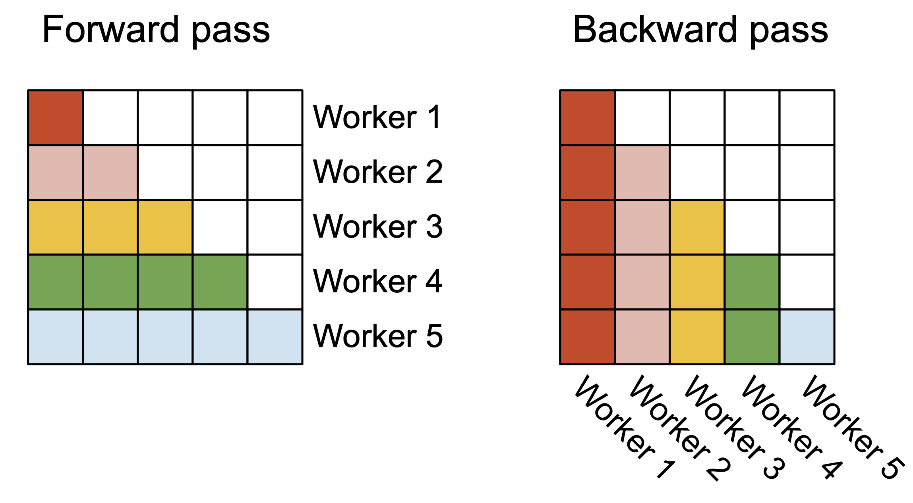
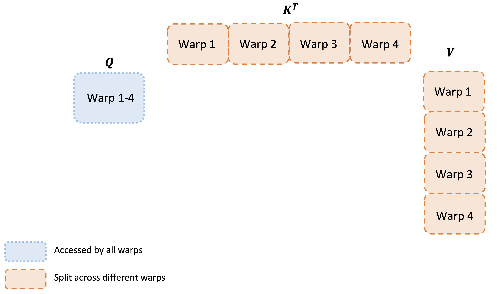
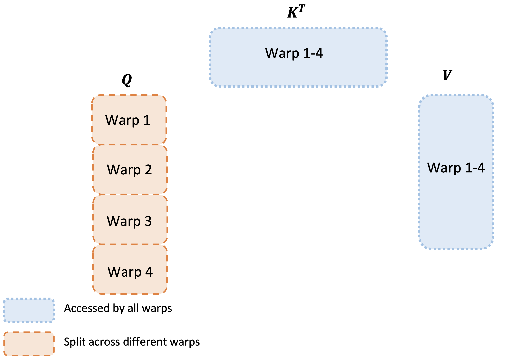

# FlashAttention-2: より良い並列性と仕事の分割によるさらに高速な attention

> 原典: [[translations/2023-flashattention-2]] ・ `raw/papers/FlashAttention-2_ Faster Attention with Better Parallelism and Work Partitioning.md`
> 著者: Tri Dao（Princeton / Stanford）
> 年: 2023-07（arXiv:2307.08691。付録のない短い technical report）

## 一言まとめ

**IO を直しても、まだ理論ピークの 25〜40% しか出ていなかった**——[[summaries/2022-flashattention]] の続編で、今度は GPU 上での**仕事の割り振り方**（どのスレッドブロックに何を任せるか、warp 間でどう分業するか）だけを直して、もう 2 倍を取った論文。アルゴリズムの漸近計算量も出力も一切変えていない。

## 背景と問題意識

前作 FlashAttention は「attention が遅いのはメモリの往復が律速だから」と特定し、それを直して 2〜4 倍を得た。さらに **IO 計算量の下界まで示し、「どの厳密 attention もこれを漸近的に上回れない」と証明していた**。

では終わりかというと、そうではなかった。本論文の出発点は次の観測である——**FlashAttention は A100 の理論最大 FLOPs/s の 25〜40% にしか達していない**（forward で 30〜50%、backward に至っては 25〜35%）。同じ GPU で最適化された **GEMM（GEneral Matrix Multiply, 汎用行列積ルーチン）は 80〜90% に達する**。つまり attention は、行列積という同種の仕事と比べて依然として 2 倍以上の余地を残していた。

**この 2 つの主張は矛盾しない**が、そこが本論文の教訓の核心なので明示しておく価値がある。前作の最適性は「**HBM アクセス回数**の漸近オーダー」についての主張であって、(a) 定数倍については何も言っていないし、(b) そもそも**演算ユニットをどれだけ遊ばせずに回せているか**という別軸を測っていない。「メモリ往復が律速」を直すと、次は「演算器が空いている」が律速になる。

なぜ演算器が空くのか。GPU の実行モデルを 3 段で押さえておく。

- **スレッドブロック** — カーネルを実行するスレッドの束。**SM（Streaming Multiprocessor, GPU の演算ユニットの単位。A100 に 108 個）**に割り当てられる。ブロック数が SM 数より十分多くないと SM が遊ぶ。この「GPU 資源がどれだけ使われているか」の割合を **occupancy（占有率）**と呼ぶ。
- **warp** — スレッドブロックの中の 32 スレッドの班。warp 内は高速な shuffle 命令で通信できるが、**warp どうしは共有メモリ（SRAM）を経由してしか通信できない**。
- 前作 FlashAttention は **batch × ヘッド数**だけで並列化していた。長いコンテキストを扱うときはメモリの都合でバッチが小さくなるので、この積が 108 を下回り、**SM が遊ぶ**。

## 提案手法

3 つの独立した改善からなる。いずれも出力を変えない。

### (1) non-matmul FLOPs を減らす — FLOPs は互いに換算できない

これが本論文で最も一般性のある指摘である。A100 の理論最大スループットは:

| 演算 | スループット |
|---|---|
| FP16/BF16 の行列積（Tensor Core） | **312 TFLOPs/s** |
| non-matmul の FP32 | **19.5 TFLOPs/s** |

**non-matmul の 1 FLOP は matmul の 1 FLOP より 16 倍高い。** FLOPs を数えるとき我々は暗黙に「1 FLOP は 1 FLOP」と思っているが、専用ユニットを持つ現代の GPU ではそれが成り立たない。したがって non-matmul FLOPs が総 FLOPs のごく一部でも、実行時間では支配的になりうる。

FlashAttention の online softmax は、ブロックを 1 つ処理するたびに出力を $\mathrm{diag}(\ell)^{-1}$ で割り直していた——これは行列積でない除算である。FlashAttention-2 の対処は 2 つ:

- **毎ブロックのスケーリングをやめる。** スケールしていない $\tilde{\mathbf{O}}$ を持ち回り、**ループの最後に 1 回だけ** $\mathrm{diag}(\ell^{(\mathrm{last})})^{-1}$ を掛ける。
- **統計量を 2 本から 1 本に。** backward 用に最大値 $m$ と指数和 $\ell$ の両方を保存する代わりに、**logsumexp $L = m + \log(\ell)$ の 1 本だけ**を保存する。

どちらも数学的には恒等変形であり、これだけで出力は変わらない。

### (2) 系列長方向にも並列化する — occupancy を上げる

batch × ヘッド数に加えて、**系列長の次元でも並列化する**。forward pass では外側ループ（行ブロック）が完全に独立（embarrassingly parallel, 互いに通信不要なほど並列）なので、そのまま別々のスレッドブロックに撒ける。backward pass は $\mathbf{dQ}$ の更新だけが列ブロック間で共有されるので、そこは **atomic add**（複数スレッドが競合せず加算できる不可分操作）で処理する。

副産物としてループの順序が入れ替わる（外側が行ブロック、内側が列ブロック。前作は逆）。**論文はこの入れ替えと系列長並列を、Phil Tillet の Triton 実装が先に提案・実装していたと明記している。** これは wiki 的に重要な接続点なので後述する。

<figure>

<figcaption>図2（再掲）: forward pass（左）では各ワーカ（スレッドブロック）が attention 行列の行ブロックを、backward pass（右）では列ブロックを担当する。因果マスクの三角形が見えるとおり、ワーカごとに仕事量が違う。</figcaption>
</figure>

### (3) warp 間の分業を変える — "split-K" をやめる

スレッドブロックの中でも仕事を分ける必要がある。前作は $\mathbf{K}$ と $\mathbf{V}$ を 4 つの warp に分割し、$\mathbf{Q}$ を全 warp から見えるようにしていた（**split-K 方式**）。すると各 warp は $\mathbf{Q}\mathbf{K}^{\top}$ の一部しか持たないので、**中間結果を共有メモリに書き出し → 同期 → 足し合わせ**という往復が必要になる。

FlashAttention-2 は**これをそっくり裏返す**——$\mathbf{Q}$ を 4 つの warp に分割し、$\mathbf{K}$ と $\mathbf{V}$ を全 warp から見えるようにする。すると各 warp は自分の担当行についての出力を最後まで自力で計算でき、**warp 間の通信が完全に消える**。

<figure>

<figcaption>図3(a)（再掲）: FlashAttention。Q が全 warp からアクセスされ（点線）、Kᵀ と V が warp 1〜4 に分割される（破線）。各 warp が部分和しか持てないので共有メモリ経由の集約が要る。</figcaption>
</figure>

<figure>

<figcaption>図3(b)（再掲）: FlashAttention-2。点線と破線が入れ替わっている——Q が warp 1〜4 に分割され、Kᵀ と V が全 warp から見える。この 1 枚の裏返しが warp 間通信を消す。</figcaption>
</figure>

### そのほか

- **因果マスクの扱い。** 自己回帰言語モデルでは $\mathbf{S}$ の上三角を $-\infty$ にする。ブロック単位で動いているので、**列インデックスが全て行インデックスより大きいブロック（長系列ではおよそ半分）は計算ごとスキップできる**。マスクなしと比べて 1.7〜1.8 倍。さらに、マスク適用が必要なのは各行につき 1 ブロックだけで済む。
- **MQA / GQA 対応。** MQA（Multi-Query Attention, 複数の query ヘッドが同じ key/value ヘッドを共有し KV cache を削る手法）と GQA（Grouped-Query Attention, その中間でヘッドをグループ単位で共有する手法）を、**key/value を実体として複製せず、ヘッドへのインデックス操作だけ**で扱う。backward では暗黙に複製されたヘッドにまたがって $\mathbf{dK},\mathbf{dV}$ を合計する。
- **ブロックサイズ。** $\{64,128\}\times\{64,128\}$ の 4 通りから、ヘッド次元とデバイスの共有メモリ量に応じて**手動で**選ぶ。大きすぎるとレジスタスピル（レジスタに収まらない値がメモリへ退避され激遅になる現象）が起きるか、そもそもカーネルが起動しない。

## 実験結果と知見

**attention 単体**（A100 80GB SXM4、トークン総数 16k 固定で系列長 512〜16k）:

| 比較対象 | FlashAttention-2 の優位 |
|---|---|
| FlashAttention | **1.7〜3.0 倍** |
| FlashAttention（Triton 版） | 1.3〜2.5 倍（forward 1.3〜1.5 倍、backward 約 2 倍） |
| FlashAttention（xformers の cutlass 実装） | 約 2 倍 |
| PyTorch 標準実装 | **3〜10 倍** |

到達点は **230 TFLOPs/s = A100 理論ピークの 73%**（forward）、backward は 63%、全体で 50〜73%。前作の 25〜40% から見れば約 2 倍で、GEMM の 80〜90% にかなり近づいた。

**エンドツーエンド訓練**（8×A100 80GB SXM）:

| モデル | FlashAttention なし | FlashAttention | FlashAttention-2 |
|---|---|---|---|
| GPT3-1.3B 2k | 142 | 189 | 196 TFLOPs/s |
| GPT3-1.3B 8k | 72 | 170 | **220** |
| GPT3-2.7B 2k | 149 | 189 | 205 |
| GPT3-2.7B 8k | **80** | 175 | **225** |

**MFU（Model FLOPs Utilization, モデルの理論必要 FLOPs をデバイスのピーク FLOPs で割った利用率）72%** に到達。この表で見るべきは**コンテキスト長を伸ばしたときの落ち方**である。FlashAttention なしでは 2k → 8k で 149 → 80 とほぼ半減するのに、FlashAttention-2 では 205 → 225 と**むしろ上がっている**。長いコンテキストがペナルティでなくなった。著者の言い方では「**以前 8k コンテキストのモデルを訓練していたのと同じ価格で 16k を訓練できる**」。

**H100 では、専用機能（TMA、第 4 世代 Tensor Core）を一切使わずに 335 TFLOPs/s**。同じコードをそのまま動かしただけで、著者は新命令を使えばさらに 1.5〜2 倍と見込んでいる。

## 限界・批判的視点

1. **ブロックサイズは手動チューニング。** 選択肢が 4 通りしかないので手でやったと著者自身が書き、自動チューニングを今後の課題としている。つまり**新しいヘッド次元やデバイスが出るたびに人手が要る**。
2. **H100 の新機能を使っていない。** 335 TFLOPs/s は「移植しただけ」の数字で、本領は未発揮。ここは後の FlashAttention-3（[[summaries/2024-flashattention-3]], 2024）が引き取る領域である——そして未発揮の度合いは大きく、**H100 での利用率は 35%** だったことが後に判明する。
3. **前作の限界がそのまま残っている。** CUDA を手書きする必要があること、GPU 世代間の移植性、マルチ GPU の IO が解析に入っていないこと——本論文はどれも解いていない。§5 は AMD GPU・FP8・コンパイラ研究者との協働を「今後」として並べている。
4. **証明を省いている。** 正しさについて「証明は前作とほぼ同じなので省略する」とだけ書かれている。実際にアルゴリズムは変わっている（スケーリングのタイミング、保存する統計量）ので、厳密には自明な系ではない。査読済み論文というより**technical report として読むべき文書**である（付録がなく、全体で前作の 4 割ほどの分量）。
5. **本文の相互参照に誤りがある。** §4.2 の「1.3 倍」の比較対象が FlashAttention-2 自身になっている（FlashAttention の誤り）。原ページでも同じ。
6. **測定条件は 2023 年の A100/H100。** 倍率をそのまま現在に持ち込まない。とくに occupancy の議論は SM 数とバッチサイズの比に依存するので、**デバイスと運用条件が変われば効き方が変わる**。

## 実装・運用上の示唆

- **FLOPs は互いに換算できない。** 「1 FLOP は 1 FLOP」という暗黙の前提は、専用行列積ユニットを持つ現代の GPU では成り立たない（matmul と non-matmul で 16 倍）。**性能見積もりで FLOPs を数えるなら、どの種類の FLOP かまで数える**必要がある。これは [[llm-inference-optimization]] の「FLOPs ≠ wall-clock」をもう一段進めた主張である。
- **ボトルネックは一度直すと次のものが現れる。** IO を直したら occupancy と warp 間通信が出てきた。**「最適である」という証明は、その証明が測っている軸についてのみ最適**であって、系全体の最適性ではない。前作の IO 下界と本作の「ピークの 25〜40%」が両立するのは、そういう理由である。最適性の主張を読むときは**何について最適なのかを必ず確認する**。
- **下流の実装が上流の論文へ還流することがある。** ループ順序の入れ替えと系列長並列は Phil Tillet の Triton 実装が先で、論文がそれを明記して取り込んでいる。前作 FlashAttention は限界として「CUDA を手書きするしかない、高レベル言語からコンパイルできる仕組みが要る」と書いていたが、**その仕組み（Triton）が実際に作られ、そこでの発見が本家のカーネルへ戻ってきた**という筋になっている。「実装の成熟度が律速する」という [[llm-inference-optimization]] のテーマの、珍しく綺麗な実例である。
- **長いコンテキストの経済性は 2 段で改善した。** 前作が「長い窓を現実的にした」なら、本作は「**長い窓のペナルティを消した**」（2k → 8k で MFU が落ちない）。エージェント実務では長い trajectory・大量のツール定義・多ターンの履歴がすべてコンテキスト長に効くので、この 2 段が今日の前提を作っている。ただし例によって、**載せられることと使いこなせることは別**である（[[summaries/2023-lost-in-the-middle]]）。
- **MQA/GQA を「データを複製せずインデックスで扱う」**のは、カーネルを書く側の一般的な作法として覚えておく価値がある。KV cache 削減の手法（→ [[transformer-architecture]] の MLA など）を実装に落とすとき、素朴に複製すると削減した分を実装で取り戻してしまう。

## 用語と略称

- **GEMM** = GEneral Matrix Multiply（汎用行列積ルーチン。GPU で最も最適化が進んだ演算で、理論ピークの 80〜90% が出る）
- **matmul / non-matmul FLOPs** = 行列積による演算とそれ以外の演算。A100 では前者 312 TFLOPs/s に対し後者 19.5 TFLOPs/s で、**1 FLOP あたり 16 倍の価格差**がある
- **SM** = Streaming Multiprocessor（GPU の演算ユニットの単位。A100 に 108 個）
- **thread block / warp** = スレッドブロック（SM に割り当てられるスレッドの束）／warp（その中の 32 スレッドの班。warp 内は高速通信、warp 間は共有メモリ経由）
- **occupancy** = 占有率（GPU 資源がどれだけ使われているかの割合。並列度が SM 数に足りないと下がる）
- **split-K** = 縮約次元 K で仕事を分割し、部分和を後で集約する方式。集約に共有メモリの往復が要る
- **embarrassingly parallel** = 互いに通信を必要としないほど完全に並列な計算
- **atomic add** = 複数スレッドが競合せずに加算できる不可分操作
- **register spilling** = レジスタスピル（レジスタに収まらない値がメモリへ退避され大幅に遅くなる現象）
- **logsumexp** = $\log\sum e^{x_i}$。ここでは $L = m + \log(\ell)$ として最大値と指数和を 1 本にまとめる用途
- **MFU** = Model FLOPs Utilization（モデルの理論必要 FLOPs ÷ デバイスのピーク FLOPs。訓練効率の実務指標）
- **MQA / GQA** = Multi-Query Attention / Grouped-Query Attention（複数の query ヘッドが key/value ヘッドを共有し KV cache を削る手法とその中間形）
- **TMA** = Tensor Memory Accelerator（H100 の非同期データ転送機構）
- **Triton** = GPU カーネルを Python 風の高レベル言語で書ける OpenAI のコンパイラ

## 関連ページ

- [[summaries/2022-flashattention]] — 直接の前作。IO を律速と特定した側。本論文はその「次の壁」の話
- [[summaries/2024-flashattention-3]] — 直接の続編。H100 では本論文が 35% しか出ず、Hopper の非同期実行と FP8 を前提に設計し直した
- [[llm-inference-optimization]] — 本論文が主要な根拠となる概念ページ（占有率と仕事の割り振り、FLOPs の非等価性）
- [[transformer-architecture]] — MQA/GQA と KV cache 削減の系譜、および exact attention の位置づけ
- [[summaries/2023-lost-in-the-middle]] — 長い窓が安くなっても使いこなせるとは限らない、という対の論点
- [[summaries/2026-gpt2-to-kimi3]] — カーネル実装の成熟度が新アーキテクチャの速度を決めるという同じ主題
- [[summaries/2026-llm-optimization-guide]] — 本番サービングの実務側。MFU やスループット指標の運用
- [[summaries/2024-deepseek-v3]] — FP8 訓練・DualPipe と同じ「ハードウェアに合わせて実装を設計し直す」路線
