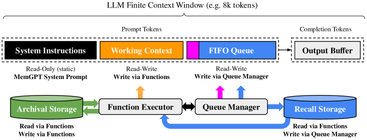
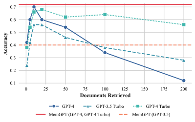

# MemGPT: Towards LLMs as Operating Systems（Packer et al., 2023）

> 原典: [[translations/2023-memgpt]] ・ `raw/papers/MemGPT_ Towards LLMs as Operating Systems.md`
> 著者・年・会議: Charles Packer ほか（UC Berkeley）・2023（arXiv:2310.08560）・ICML 2024

## 一言まとめ

LLM（Large Language Model, 大規模言語モデル）のコンテキストウィンドウ（モデルが一度に読める最大トークン数）を OS の**物理メモリ**に見立て、仮想メモリのページングに倣って **LLM 自身が function calling で自分の記憶を階層間で出し入れする**「virtual context management」を提案した論文。エージェントの長期記憶（[[agent-memory]]）と、コンテキストに何を積むかの設計（[[context-engineering]]）の両方で、後のエージェント設計の語彙——working context・archival memory・recursive summary——を定義した出発点である。

## 背景と問題意識

コンテキストウィンドウは有限で、単純に延ばすには self-attention の計算が二次関数的に増える。しかも当時すでに「延ばしても中間の情報の想起が落ちる」（lost in the middle, Liu et al. 2023）ことが知られていた。つまり「長い会話・長い文書」を扱うのに、コンテキスト長のスケーリングだけに頼るのは筋が悪い。

著者らの着眼は OS の**仮想メモリ**とのアナロジーである。OS は、物理メモリとディスクの間でデータをページング（必要なページだけメモリに載せ、あふれたらディスクに退避）することで、実メモリより大きな「無限のメモリ」の錯覚をアプリケーションに与える。同じことを LLM でやればよい——コンテキスト＝物理メモリ、外部ストレージ＝ディスク、そして**ページングの判断を LLM 自身にやらせる**。これを可能にしたのが、当時成熟しつつあった function calling（モデルが JSON スキーマに沿った引数で関数を呼ぶ仕組み → [[tool-use-and-function-calling]]）である。

## 提案手法 / 主張

<figure>

<figcaption>図3（再掲）: MemGPT の構成。main context（system instructions・working context・FIFO queue）と external context（archival / recall ストレージ）の 2 層を、function executor と queue manager が仲介する。LLM の出力は function call として解釈され、request_heartbeat=true で推論を連鎖できる。</figcaption>
</figure>

### メモリ階層

- **main context**（＝プロンプトトークン。物理メモリに相当）は 3 分割される:
  - **system instructions**（読み取り専用）— 制御フローとメモリ関数の使い方の説明
  - **working context**（読み書き可）— ユーザーの事実・好み・ペルソナなど「常に見えているべき要点」を書き溜める固定サイズのテキストブロック。書き込みは function call 経由のみ
  - **FIFO queue** — 会話・システムメッセージ・関数入出力の流動履歴。先頭には追い出し済みメッセージの**再帰的要約（recursive summary）**が常駐する
- **external context**（ディスクに相当）は 2 種類:
  - **recall storage** — 全メッセージ履歴の DB（自動で全部書き込まれる）
  - **archival storage** — 任意長テキストの読み書き DB（文書分析では文書コーパス置き場。実装は PostgreSQL + pgvector のベクトル検索）

### 自己管理の仕組み

- **queue manager** がトークン数を監視し、コンテキストの 70% で「**memory pressure 警告**」をシステムメッセージとして挿入 →LLM は重要情報を working context / archival に退避する猶予を得る。100% でキューをフラッシュし（例: 50% 分を追い出し）、recursive summary を更新する。追い出されたメッセージも recall storage には残り、検索で呼び戻せる。
- **function executor** が LLM の出力をパースして関数を実行し、結果（ランタイムエラー含む）をフィードバックする。検索はコンテキストをあふれさせないよう**ページネーション**付き。
- **function chaining**: 関数呼び出しに `request_heartbeat=true` を付けると、実行後すぐ次の推論が走る（付けなければ yield して次の外部イベントまで停止）。これにより「検索 → 次ページ → 照合 → 回答」の多段処理が可能になる。
- **イベント駆動**: ユーザーメッセージだけでなく、システム警告・ログイン通知・定時イベントも推論のトリガーになる——エージェントが「促されずに」動ける設計。

エージェント設計として見ると、**ツールの作用先が外部世界ではなく自分自身のコンテキスト**である点が新しい。ReAct（[[summaries/2022-react]]）のツールが Wikipedia という外界に向いていたのに対し、MemGPT のツールは自分の記憶の編集・検索に向いている。

## 実験結果と知見

**会話エージェント**（Multi-Session Chat データセットを拡張）:

**表**: Deep Memory Retrieval（過去セッションの詳細を問う一貫性テスト）

| 構成 | 正解率 | ROUGE-L (R) |
| --- | --- | --- |
| GPT-4 単体（要約のみ参照） | 32.1% | 0.296 |
| GPT-4 + MemGPT | **92.5%** | 0.814 |
| GPT-4 Turbo + MemGPT | **93.4%** | 0.827 |

会話オープナー（過去の知識で会話を切り出す関与テスト）でも、MemGPT は人間の手書きオープナーの類似度スコアを上回った。鍵は working context への情報保存。

**文書分析**:

<figure>

<figcaption>図5（再掲）: 文書 QA の性能。固定コンテキストのベースライン（GPT-4 等）は取り出し文書数が増えると切り詰めにより劣化する一方、MemGPT（水平線）は文書数に影響されない。</figcaption>
</figure>

- **document QA**（NaturalQuestions-Open + Wikipedia 2000 万記事の埋め込み）: 固定コンテキストのベースラインは「retriever の top-K に正解が入っているか」で性能が頭打ちになるが、MemGPT は archival storage への**ページング検索で retriever を何度でも呼べる**ため、コンテキスト長の増加に性能が影響されない（図 5 の平坦な線）。
- **nested KV 検索**（値がまたキーになる多段ルックアップ。著者らが新設）: GPT-4 単体はネスト 3 段で正解率 0% に落ちるが、**GPT-4 + MemGPT はネスト数に不変**。マルチホップの照合能力を実証した。
- 重要な条件: MemGPT の性能は**基盤モデルの function calling 能力に強く依存**する。GPT-3.5 では大きく劣化し、興味深いことに GPT-4 Turbo よりも GPT-4 の方が nested KV では良かった。

## 限界・批判的視点

- **数値は 2023 年時点の歴史的記録**: 基盤モデル（GPT-3.5/4、8k〜128k コンテキスト）も比較手法も当時のもの。現在は 200k〜1M 級のコンテキストが普通になり、「まずコンテキストに入れる」で済む範囲は大きく広がった。ただし「どれだけ延びても有限であり、長くなると想起が劣化する」という前提自体は現在も成立しており（[[summaries/2025-multi-agent-research-system]] も 200k での切り詰めを前提に計画を外部メモリへ保存する）、設計原理としての価値は残る。
- **検索の打ち切り**: MemGPT は理論上ページングで retriever の全ランキングに到達できるが、実際にはデータベースを使い尽くす前に検索をやめてしまう挙動が観察されている——「いつ検索をやめるか」の判断は未解決で、これは現在のエージェントにも残る課題。
- **プロンプト再現性**: 付録のプロンプトは「簡潔さのため編集済み」と明記されており、完全な再現にはリポジトリ参照が必要。挙動がシステムプロンプトの書き方に強く依存する種類のシステムである。
- **自己管理の危うさ**: 記憶の取捨選択をモデル自身に委ねるため、重要情報を退避し損ねれば静かに忘れる。修正機構は memory pressure 警告というヒントのみで、忘却の検出・監査の仕組みはない。

## 実装・運用上の示唆

- **「常に見えているべき情報」と「流れてよい履歴」を分ける**（working context vs FIFO queue）。この分離は現在のエージェント設計（システムプロンプト内のメモリブロック＋会話履歴）の原型。
- **あふれる前に警告する**: 容量の 70% で警告 → 退避の猶予、100% でフラッシュ＋再帰的要約、という 2 段階は、コンテキスト管理の実装パターンとしてそのまま使える。
- **検索はページネーション前提で**: 一度に top-K を詰め込むのでなく、少しずつ引いて足りなければ次ページ——コンテキスト予算と検索網羅性の両立策。
- **エラーをモデルに返す**: 関数実行のランタイムエラーをそのままフィードバックして適応させる設計は、[[summaries/2025-multi-agent-research-system]] の「ツール障害をモデルに伝える」運用と同じ思想の先行例。
- 本論文の実装は後に **Letta**（旧 MemGPT 社）としてオープンソースのエージェントフレームワークに発展した（→ [[agent-frameworks]] の文脈。概説）。

## 用語と略称

- **LLM** = Large Language Model（大規模言語モデル）
- **virtual context management**（仮想コンテキスト管理, OS の仮想メモリに倣いコンテキストを階層管理する本論文の提案概念）
- **main context / external context**（コンテキスト内＝プロンプトトークン／コンテキスト外の外部ストレージ）
- **working context**（読み書き可能な要点メモ領域）・**FIFO queue**（先入れ先出しの履歴キュー）
- **recall storage / archival storage**（全メッセージ履歴 DB／任意テキストの読み書き DB)
- **recursive summary**（再帰的要約, 追い出した履歴を要約に畳み込み続ける仕組み）
- **memory pressure**（メモリ逼迫警告, 容量閾値超過時のシステムメッセージ）
- **function calling / function chaining**（構造化された関数呼び出し／heartbeat フラグによる連鎖実行）
- **pagination**（ページネーション, 検索結果を分割して少しずつコンテキストへ入れる方式）
- **DMR** = Deep Memory Retrieval（過去会話の詳細想起を測る本論文の新タスク）
- **MSC** = Multi-Session Chat（複数セッションの対話データセット）
- **nested KV** = nested Key-Value retrieval（値がキーを兼ねる多段ルックアップタスク）
- **UUID** = Universally Unique Identifier（128 ビットの一意識別子）
- **ROUGE-L (R)**（最長共通部分列に基づく再現率指標）
- **HNSW** = Hierarchical Navigable Small World（近似最近傍検索のインデックス）
- **lost in the middle**（長文脈の中間にある情報の想起が落ちる現象）

## 関連ページ

- [[summaries/2024-graphrag]] — 索引を事前に階層要約しておく別解。MemGPT が読み出し側の反復で top-K の上限を破るのに対し、こちらは索引側を作り直す

- [[agent-memory]] — 本論文が代表手法として詳述される概念ページ
- [[context-engineering]] — main context の 3 分割・recursive summary はコンテキスト積載設計の原型
- [[tool-use-and-function-calling]] — 自分のコンテキストに作用する「内向きのツール」という新カテゴリ
- [[retrieval-augmented-generation]] — 固定 top-K の静的検索を、エージェント自身のページング検索で破る中間形態
- [[summaries/2025-multi-agent-research-system]] — 計画の外部メモリ保存・フェーズ要約など、本設計の本番実装形（2025）
- [[summaries/2023-reflexion]] — 同時期の「エピソード記憶に反省を蓄える」記憶設計との対比
- [[agent-loop]] — イベント駆動制御・ヒュリスティックでない yield の設計はループ制御の変種
