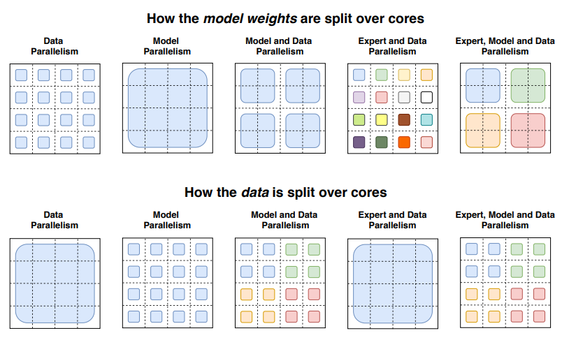

# Mixture of Experts Explained（Hugging Face, 2023）

> 原典: [[translations/2023-moe-explained]] ・ `raw/articles/Mixture of Experts Explained.md`
> 著者・年・出典: Omar Sanseviero ほか（Hugging Face）・2023-12-11・Hugging Face Blog

## 一言まとめ

Mixtral 8x7B の公開を機に書かれた **MoE（Mixture-of-Experts）の定番入門解説**。仕組み（疎な MoE 層＋ルータ）・1991 年からの歴史・訓練の急所（負荷分散）・ファインチューニングの落とし穴・サービング技法までを一気通貫で整理し、MoE の本質的な非対称——**事前学習と推論 FLOPs は安い、しかし VRAM は総パラメータ分必要**——を初学者向けに説明する。wiki 内では、K2/K3・DeepSeek-V3 の MoE 採用（[[summaries/2025-kimi-k2]]・[[summaries/2026-gpt2-to-kimi3]]）を理解するための**前提知識の土台**にあたる。

## 背景と問題意識

固定された計算予算では「大きいモデルを短く訓練する」方が有利だが、密（dense）なモデルではパラメータを増やすほど計算も比例して増える。この結びつきを断つのが**条件付き計算**——入力ごとにネットワークの一部だけを走らせる——であり、その transformer での実装形が MoE である。2023 年末、Mistral の Mixtral 8x7B が「Llama 2 70B 超・推論はるかに高速」を示してオープンコミュニティの主役になったタイミングで、Hugging Face が仕組みと落とし穴を体系的に解説したのが本記事である。

## 提案手法 / 主張

### 仕組み — 疎な MoE 層とルータ

<figure>

<figcaption>図（再掲・Switch Transformers 論文）: MoE 層。FFN をエキスパート群で置換し、ルータがトークンごとに送り先を決める。</figcaption>
</figure>

transformer の **FFN 層をエキスパート群（各自が FFN）で置き換え**、学習された**ルータ**（ゲートネットワーク）がトークンごとに top-k のエキスパートを選ぶ。attention 等は全トークンで共有されるため、**Mixtral 8x7B の実体は「メモリ 47B・推論 FLOPs 12B 相当」**（8×7B=56B ではない。FFN 以外は共有だから）——**パラメータ数と計算量の分離**が MoE 経済性の本質である。

### 歴史 — 1991 年から Mixtral まで

| 年 | 里程標 | 貢献 |
| --- | --- | --- |
| 1991 | Adaptive Mixture of Local Experts | エキスパート＋ゲートの原型（アンサンブル的） |
| 2013-15 | 層としての MoE／条件付き計算 | 深いネットワークの**構成要素**へ |
| 2017 | Shazeer ら（137B LSTM） | **スパース性**の導入・Noisy Top-k Gating |
| 2020 | GShard | transformer への適用（1 つおきの FFN を top-2 MoE 化）・**expert capacity**・ランダムルーティング |
| 2021-22 | Switch Transformers | **top-1 で十分**（品質維持・通信減）・1.6T/2048 エキスパート・T5-XXL 比 4 倍の事前学習速度・selective precision |
| 2022 | ST-MoE | **router z-loss**・エキスパート専門化の分析 |
| 2023 | Mixtral 8x7B | オープン MoE の実用品質の実証 |

### 訓練の急所 — 負荷分散の 3 点セット

放置するとルータは少数の人気エキスパートに収束する（選ばれたエキスパートほど速く育ち、さらに選ばれる自己強化）。対策は: (1) **auxiliary loss**（全エキスパートへ均等な重要度を促す）、(2) **router z-loss**（ゲートに入る大きなロジットへのペナルティ。指数関数の丸め誤差を抑え、品質を落とさず安定化）、(3) **expert capacity**（エキスパートあたり処理トークン数の上限。あふれたトークンは残差接続で素通しか破棄。テンソル形状が静的コンパイルされるため必須）。もうひとつの実務知見が **selective precision**——エキスパートは bfloat16 でよいが、**ルータは指数関数を含むため高精度必須**。

### 知見 — 専門化・ファインチューニング

- **エキスパートは「トークン群・浅い概念」に専門化する**（句読点エキスパート・固有名詞エキスパート等）。直観に反し、多言語訓練でも**言語別のエキスパートは生まれない**（負荷分散が阻む）。デコーダ側の専門化は弱い。
- **疎モデルは過学習しやすい**: 同一の事前学習パープレキシティでも、推論の重いタスク（SuperGLUE）では密モデルに劣り、知識の重いタスク（TriviaQA）では逆に強い。小タスクで劣化・大タスクで良好。
- **MoE 層だけ凍結してもほぼ性能維持**（パラメータの 80% が MoE 層にあるのに）——ファインチューニングの高速化・省メモリ策として有効。ハイパーパラメータも密と異なる（小バッチ・高学習率が効く）。
- **instruction tuning との相性が良い**: Flan-MoE の素の MoE に対する改善幅は、Flan-T5 の T5 に対する改善幅より大きい——単一タスク FT で崩れやすい MoE が、多タスクの指示チューニングでは密モデル以上に化ける。

### サービング — 「Making MoEs go brrr」

<figure>

<figcaption>図（再掲・Switch Transformers 論文）: データ並列・モデル並列・エキスパート並列でのモデルとデータの分割の違い。</figcaption>
</figure>

**expert parallelism**（エキスパートを別ワーカーに配置し、トークンを目的エキスパートのいるワーカーへ all-to-all で送る）が基本形。capacity factor は品質と通信コストのトレードオフで **top-2・CF 1.25・コアあたり 1 エキスパート**が出発点（評価時に CF を下げて計算削減も可）。パラメータ数を減らす技法として、**密モデルへの蒸留**（疎の利得の 30〜40% を保持）・文/タスク単位ルーティングによるサブネット抽出・エキスパートのマージ。訓練側では **Megablocks**（MoE 層をブロック疎行列積として表現し、トークンドロップなしで不均衡な割り当てに対応）、**QMoE**（1 ビット未満への量子化で 1.6T モデルを 3.2TB→160GB）。

## 実験結果と知見

解説記事のため独自実験はないが、引用される定量値: Switch Transformers の**事前学習 4 倍速**（対 T5-XXL）、GLaM の **GPT-3 品質を 1/3 のエネルギーで**、蒸留での**疎の利得 30-40% 保持**、QMoE の **3.2TB→160GB**、エキスパート数の利得は **256〜512 で逓減**。使い分けの指針は明快——**高スループット・多マシンなら疎、低スループット・低 VRAM なら密**。「疎と密のパラメータ数は直接比較できない」という注意も重要。

## 限界・批判的視点

- **2023 年末時点のスナップショット**: 以後の標準になった **shared experts**（全トークンを処理する共有エキスパート＋選択エキスパートの併用。DeepSeek-V3 や K2/K3 世代の定石 → [[summaries/2025-kimi-k2]] の 1 共有＋8/384 選択、[[summaries/2026-gpt2-to-kimi3]] の 2 共有＋16/896）や、細粒度エキスパート分割・スパース性スケーリング則（K2 のスパース性 48）はカバー外。本記事の「256〜512 で逓減」という知見は、その後の細粒度化（384〜896 エキスパート）でアップデートされている。
- **引用値は各論文の転記**であり、記事自身の検証はない。Mixtral の「Llama 2 70B 超」も Mistral 発表の引用。
- **エージェント文脈は射程外**: MoE のルーティングがツール呼び出しや長い trajectory の一貫性に与える影響（トークン列の分布が変わるとルーティングも変わる）は未検討の領域。

## 実装・運用上の示唆

- **MoE を選ぶ判断は「VRAM に総パラメータが載るか」から**: FLOPs の安さに惹かれる前に、47B 分のメモリ（Mixtral の場合）を確保できるかを見る——[[llm-inference-optimization]] のメモリ律速の議論と直結。
- **ファインチューニングは疎特有の作法で**: 高 dropout（疎層のみ）・小バッチ・高学習率・MoE 層凍結の検討・可能なら多タスク instruction tuning を先に。
- **ルータ周りは高精度・安定化を優先**: bfloat16 化するならエキスパートまで、ルータは full precision＋z-loss。
- **蒸留は「MoE で速く事前学習 → 密で安く配る」の橋**: 訓練時の疎の利点と配布時の密の扱いやすさを両取りする定跡。

## 用語と略称

- **MoE** = Mixture-of-Experts（FFN をエキスパート群＋ルータで置き換える疎な構造）／ **FFN** = Feed-Forward Network
- **ルータ / ゲートネットワーク**（トークンの送り先エキスパートを決める学習された小ネットワーク）／ **top-k ルーティング**（上位 k エキスパートに送る。Switch は k=1）
- **Noisy Top-k Gating**（ノイズを加えてから top-k を取るゲート。負荷分散のため）
- **auxiliary loss**（負荷分散の補助損失）／ **router z-loss**（ゲート入力ロジットの大きさへのペナルティ）／ **expert capacity / capacity factor**（エキスパートあたり処理トークン上限とその係数）
- **条件付き計算**（入力ごとにネットワークの一部だけを実行する考え方）／ **スパース性**（全パラメータのうち実際に使う割合が小さいこと）
- **expert parallelism**（エキスパートを別デバイスに置く並列化）／ **all-to-all**（全デバイス間の相互通信）
- **selective precision**（ルータのみ高精度にする混合精度戦略）
- **蒸留（distillation）**／ **Megablocks**（ブロック疎行列積によるドロップなし MoE カーネル）／ **QMoE**（1 ビット未満の MoE 量子化）
- **Mixtral 8x7B / Switch Transformers / GShard / GLaM / ST-MoE**（本記事が辿る代表モデル・論文）
- **VRAM**（GPU メモリ）／ **FLOPs**（浮動小数点演算数）／ **LLM** = Large Language Model

## 関連ページ

- [[summaries/2021-switch-transformers]] — 本記事が解説の中心に据える論文の一次資料（top-1・selective precision・蒸留の出典）
- [[transformer-architecture]] — MoE 節の土台となる根拠原典（仕組み・歴史・訓練の急所）
- [[llm-inference-optimization]] — VRAM/FLOPs 分離・expert parallelism・capacity factor・蒸留のサービング側
- [[summaries/2025-kimi-k2]] — 本記事の 2 年後: shared experts・スパース性 48・スケーリング則の実践
- [[summaries/2026-gpt2-to-kimi3]] — さらに後継: 潜在空間 MoE（K3）を含む系譜
- [[summaries/2025-deepseek-r1]] — MoE 基盤（V3）の上に推論能力を載せた例
