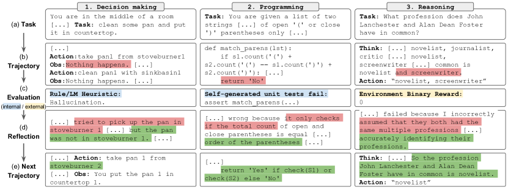
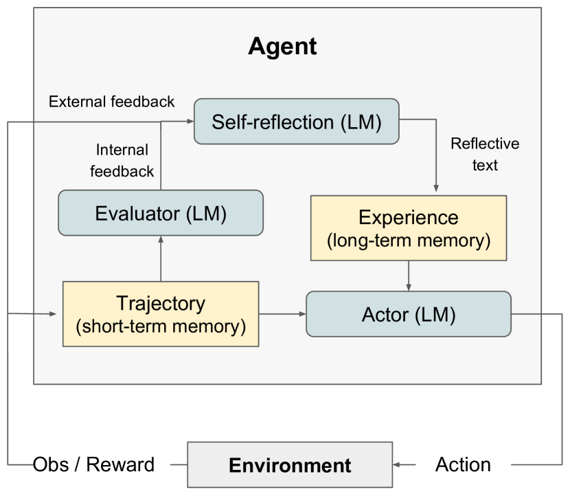

# Reflexion: Language Agents with Verbal Reinforcement Learning

> 原典: [[translations/2023-reflexion]] ・ `raw/papers/Reflexion_ Language Agents with Verbal Reinforcement Learning.md`（ar5iv クリップ, arXiv:2303.11366）
> 著者・年・会議: Noah Shinn ほか（Northeastern / MIT / Princeton）・2023・NeurIPS 2023

## 一言まとめ

**勾配の代わりに言葉で強化する**。環境からの「成功/失敗」程度の貧しい報酬を、LLM 自身に**言語の自己反省文へ増幅**させてエピソード記憶に蓄え、次の試行のコンテキストに注入することで、**重みを一切更新せずに試行間で学習する**エージェントを作った論文。著者らはこの反省文を「意味論的な勾配信号（'semantic' gradient）」と呼ぶ。HumanEval pass@1 91%（当時の GPT-4 単体 80% 超え）が看板の数字だが、本当の貢献は「失敗からの学習」をエージェントの標準部品にしたこと。筆頭著者陣に ReAct の Yao・Narasimhan が入っており、[[summaries/2022-chain-of-thought]] → [[summaries/2022-react]] に続く**推論系譜の第 3 幕**にあたる。

## 背景と問題意識

ReAct・SayCan・Toolformer などで「LLM ＋ツール＋ループ」のエージェントは動くようになったが、**失敗しても次の試行に活かせない**という問題が残っていた。従来の強化学習（RL, 報酬を最大化するよう方策を更新する枠組み）で直そうにも、巨大 LLM の重み更新は計算コストが法外で、スカラー報酬は「どこで間違えたか」（信用割当問題, credit assignment）を伝えるには情報が貧しすぎる。実際、本論文の実測でも、ReAct や CoT は temperature 0.7 で**何度リトライしても初回に失敗したタスクを 1 問も解けなかった**——単なる再試行は学習ではない。

## 提案手法

<figure>

<figcaption>図1（再掲）: 3 ドメイン（意思決定・プログラミング・推論）に共通する流れ。(a) タスク → (b) 軌跡（失敗）→ (c) 評価（ヒューリスティクス／自己テスト／環境報酬）→ (d) 反省（赤: 誤りの特定、緑: 次の方針）→ (e) 次の軌跡（成功）。</figcaption>
</figure>

<figure>

<figcaption>図2（再掲）: Reflexion の構成。Actor(LM) が環境と行動/観測のループを回し、Evaluator(LM) が trajectory（短期記憶）を採点、Self-reflection(LM) が内省文を生成して Experience（長期記憶）へ蓄積。Actor は次の試行で両記憶に条件づけられる。</figcaption>
</figure>

**方策 = LLM のパラメータ ＋ 記憶**、と再定義したのが核心。θ = {Mₐ, mem} で、学習で更新されるのは mem（テキスト）だけ。

- **Actor（Mₐ）**: 行動を生成する LLM。中身は [[summaries/2022-react]] の ReAct や [[summaries/2022-chain-of-thought]] の CoT をそのまま使う——つまり Reflexion は既存エージェントの**外側に被せる学習レイヤー**である。
- **Evaluator（Mₑ）**: 軌跡を採点する。タスクにより (a) 完全一致（EM）、(b) 手書きヒューリスティクス（AlfWorld では「同一行動×同一応答が 3 回超」または「30 行動超」で失敗と判定——実質的な**ループ検出器**）、(c) LLM 判定、(d) **自己生成した単体テスト**（プログラミング。CoT で生成し AST で構文検証、最大 6 本）。
- **Self-Reflection（Mₛᵣ）**: 軌跡＋報酬から「どこで・なぜ失敗し・次はどうするか」を一人称の文章にする。例——「デスクランプを先に探すべきだった。次の試行では desk 1 に行き…」。
- **記憶**: 軌跡＝短期記憶、反省文＝長期記憶（上限 Ω は 1〜3 件のスライディングウィンドウ。コンテキスト長の制約による）。

停止条件は「Evaluator が合格を出す」または最大試行数。全体は Algorithm 1 の while ループ（翻訳に復元済み）。

## 実験結果と知見

| タスク | 結果 |
| --- | --- |
| AlfWorld（家庭内タスク 134 件） | ReAct 単体は試行 6〜7 で頭打ち（幻覚率 22% で収束）→ +Reflexion で 12 試行かけて **130/134**（+22 ポイント） |
| HotPotQA（QA 100 問） | ベースラインはリトライで 1 問も改善せず → +Reflexion で **+20 ポイント**。EPM（直近軌跡だけ見せる）アブレーションとの差 +8 が「反省文の言語化」自体の寄与 |
| HumanEval Python | pass@1 **91.0**（GPT-4 単体 80.1）。MBPP Python のみ負け（77.1 vs 80.1） |
| LeetcodeHard（新設） | 15.0 vs GPT-4 の 7.5。**GPT-4 の学習カットオフ後の問題だけ**で構成した汚染対策ベンチ |

- **アブレーションが「盲目的リトライ無効」を示した**（HumanEval Rust 最難 50 問）: テスト生成なし=52%（ベースライン 60% を下回る——終了判定を失い有害な編集を重ねる）、自己反省なし=60%（改善ゼロ——エラーは見えても修正に翻訳されない）、両方あり=68%。**誤りの特定と修正の間の橋渡しに、言語化された反省が必要**。
- **MBPP Python の敗因分析が秀逸**: 自己テストの偽陽性率（テスト全合格なのに解が誤り）が HumanEval 1.4% に対し MBPP 16.3%。**偽陰性は回復可能（反省でテスト側を疑える）だが、偽陽性は誤答を確信して早期提出する即死**——自己評価型エージェント全般に効く非対称性の指摘（→ [[agent-evaluation]]）。
- **自己修正は創発能力**（付録 A）: starchat-beta では Reflexion の効果が完全にゼロ（0.26→0.26）。GPT-4 > GPT-3.5 の順で効果が大きく、CoT の創発性（[[summaries/2022-chain-of-thought]]）と同型の「強いモデルでしか効かない」性質を持つ。
- **WebShop では失敗**（付録 B.1）: 4 試行で改善の兆しなしと自己申告。反省は**局所解からの脱出＝多様な探索**を生めない。この誠実な負の結果は、後の [[summaries/2025-masft]] の「戦術的修正の限界」を 2 年先取りしている。

## 限界・批判的視点

- **自己評価能力への依存**が根本制約。Evaluator が LLM や自己テストのとき、その誤り（特に偽陽性）がそのまま学習を汚染する。成功の形式的保証もない。
- **探索の欠如**: 反省は「同じ山をより上手に登る」ことはできるが「別の山に移る」ことができない（WebShop）。局所解問題は自然言語版の方策最適化にも引き継がれる。
- 記憶は上限 1〜3 件のスライディングウィンドウで、長期運用での記憶管理（何を残し何を捨てるか）は未解決——著者ら自身がベクトル DB 等への拡張を将来課題とする（→ `agent-memory` の中心課題）。
- 評価は GPT-3/3.5/4 世代・100 問規模のサブセットが中心で、数値の再現はモデルバージョンに強く依存する。なお「自己修正がどこまで本物か」は後続研究で論争が続く領域であり（内在的な自己修正は過大評価との報告もある）、本論文の主張は**外部の実行結果・報酬と組んだ場合**の有効性として読むのが安全。
- 生成コードを検証なしに実行するため、隔離環境が前提（§8 で著者ら自身が警告）——[[agent-safety-and-guardrails]] の sandboxing がここでも必須になる。

## 実装・運用上の示唆

- **失敗ループの検出は雑なヒューリスティクスで足りる**: 「同一行動×3 回 or 30 ステップ超」だけで AlfWorld の幻覚・空回りをほぼ捕捉。ループ検出→反省→リセットの 3 点セットは今日のエージェントにそのまま移植できる。
- **反省文の質が学習の質**。ただの履歴（EPM）より一人称の因果分析（「〜だから失敗した。次は〜する」）が +8 ポイント。反省プロンプトには「原因」と「次の具体的行動」の両方を書かせる。
- **自己テストは偽陽性を最小化する方向に倒す**。テストが弱いくらいなら厳しすぎる方がまし、という FP/FN 非対称の教訓。
- Reflexion は既存の Actor（ReAct 等）に**後付けできるラッパー**である点が実装上の美点。[[summaries/2024-building-effective-agents]] の evaluator-optimizer パターンは、この構成の実務版と読める。

## 用語と略称

- **Reflexion** = 本論文の手法名（reflection のもじり）
- **verbal reinforcement (learning)** = 報酬を言語的な反省文に増幅して学習信号にする枠組み
- **self-reflection（自己内省・自己反省）** = 失敗の原因と次の方針を言語で生成すること
- **Actor / Evaluator / Self-Reflection モデル**（Mₐ/Mₑ/Mₛᵣ） = 行動生成／採点／反省生成を担う 3 つの LLM 役割
- **credit assignment（信用割当）** = 結果の成否をどの行動に帰するかという RL の古典的問題
- **episodic memory / EPM** = エピソード（試行）単位の記憶／直近軌跡のみを見せるアブレーション条件
- **EM** = Exact Match（完全一致採点）
- **pass@1** = 1 回の生成で正解する率（リトライなしの指標。自己テストのみで反復する Reflexion は正解テストを見ないためこの報告資格を保つ）
- **TP/FN/FP/TN** = 自己テスト合否×解の正否の 4 象限（FP＝テスト合格なのに解が誤り、が最も危険）
- **AST** = Abstract Syntax Tree（抽象構文木。テストの構文検証に使用)
- **AlfWorld / HotPotQA / HumanEval / MBPP / LeetcodeHardGym / WebShop** = 家庭内タスク／マルチホップ QA／コード生成×2／本論文新設の難問コーディング／模擬 EC のベンチマーク
- **MultiPL-E** = Python ベンチマークを 18 言語へ翻訳するコンパイラ群（Rust 実験に使用）

## 関連ページ

- [[summaries/2026-ai-scientist]] — 自己評価の偽陽性／偽陰性という論点が、生成論文の自動査読で再び現れる

- [[self-reflection]] — 本原典が主要根拠となる概念ページ
- [[summaries/2022-react]] — Actor として使用。反復ループ・幻覚への直接の後続回答
- [[summaries/2022-chain-of-thought]] — もう一方の Actor。創発性の同型パターン
- [[agent-loop]] — episode 内ループの外側に「試行間の改善ループ」を重ねた形
- [[agent-evaluation]] — 自己生成テストの FP/FN 分析・汚染対策ベンチ設計
- [[summaries/2024-building-effective-agents]] — evaluator-optimizer パターンの実務版
- [[agent-memory]] — 反省文のエピソード記憶蓄積は長期記憶設計の初期例
- [[reasoning-and-planning]] — 「行動の後に振り返る」推論の拡張形として参照される
- [[test-time-compute]] — 試行間ループ＝外付けのテスト時計算という位置づけ
- [[translations/2023-reflexion]] — 全文翻訳
