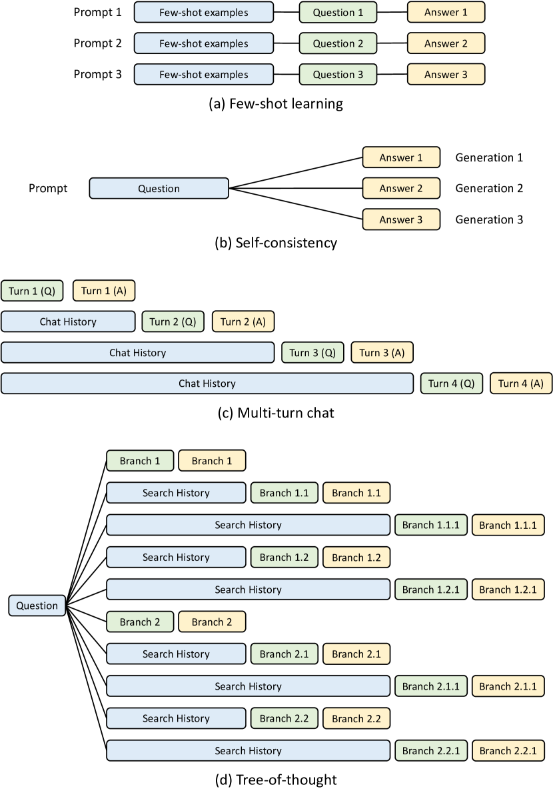
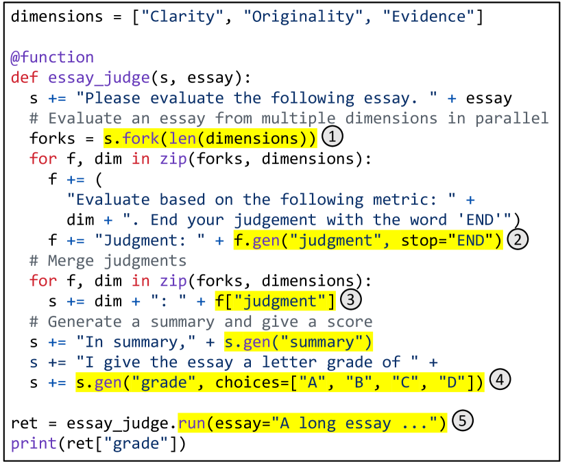
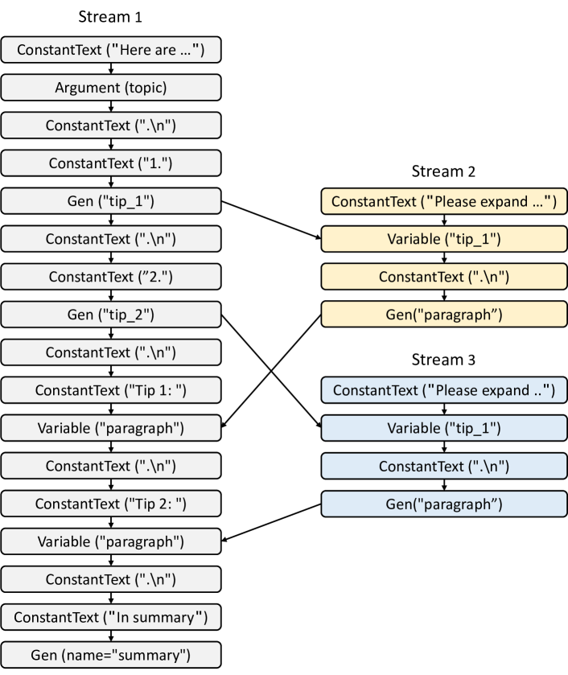
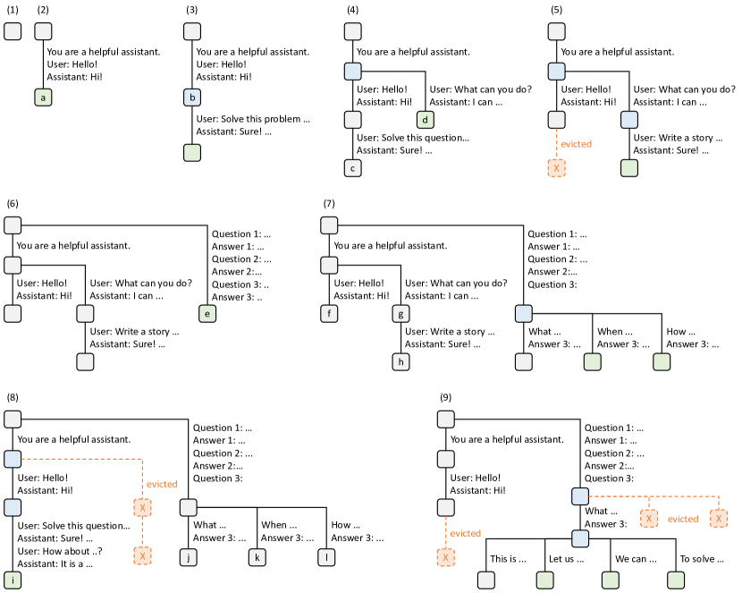

# SGLang — 言語とランタイムを協調設計する

> 原典: [[translations/2023-sglang]] ・ `raw/papers/Efficiently Programming Large Language Models using SGLang.md`
> 著者: Zheng, Yin, Xie ら（Stanford / UC Berkeley / 上海交通大学 / Texas A&M）
> 2023 年（arXiv:2312.07104。v1 のタイトル。後に "SGLang: Efficient Execution of Structured Language Model Programs" へ改題）

## 一言まとめ

**「フロントエンドの言語とバックエンドの推論エンジンが別々に進化しているせいで、最適化の機会が落ちている」と診断し、両方を一緒に設計した論文**である。ランタイム側の貢献 **RadixAttention**（KV キャッシュを radix tree で自動再利用する）が有名だが、**論文の半分は言語処理系**——DSL・インタプリタ・コンパイラ——であり、**GPT-4 にコンパイラ最適化をさせる**という異色の試みまで含む。**ReAct エージェントで vLLM 比スループット 5.6 倍・レイテンシ 13%**。

## 背景と問題意識

論文の診断が本 wiki にとって重要である。

> **フロントエンドとバックエンドの技術はどちらも急速に進歩しているが、別々の軌道で進化している。フロントエンドは LLM の推論の過程をほとんど意識せず、バックエンドはしばしばアプリケーションの構造を認識できず複数の呼び出しにまたがる最適化ができない。**

- **フロントエンド**（LangChain・LMQL・Guidance・DSPy）は「主眼がフロントエンドの設計にあるため、しばしばランタイムの性能が犠牲になる」。
- **バックエンド**（TensorRT-LLM・TGI・Orca・vLLM）は「設計が依然として伝統的な**単一生成呼び出し**のインターフェースに根ざしている」。OpenAI の Completion API のように、プロンプトを処理して応答を**ステートレスに**返す。

**この分断が本論文の敵である。** そして敵の正体は、LLM の使われ方が変わったことにある——**単純なターン制のチャットから、LLM のプログラム的利用へ**。多段の計画・推論・環境との相互作用、ツール利用、few-shot・自己一貫性・skeleton-of-thought・tree-of-thought。**これらはいずれも複数の、しばしば依存し合う生成呼び出しを要し、制御フローが LLM の出力に依存しうる。**

### 逃している機会の一覧

§2.3 が最適化の機会を 5 つに整理している（**この箇条書きはクリップで丸ごと失われていたので原ページから復元した**）。

| 機会 | 内容 |
|---|---|
| **Caching** | 連鎖した呼び出しにまたがって計算済み KV キャッシュを再利用する。**ただし無料でも自明でもない**（追加の記憶域とより複雑なメモリ管理が要る） |
| **Batching** | decode はメモリ律速なのでバッチサイズを増やすとスループットが大きく伸びる |
| **Sharing** | 単一プロンプトから複数出力、現在状態からの fork。**基本的な prefix 共有は vLLM で調査済みだが、不規則な木構造の共有のような高度なパターンもある** |
| **Parallelism** | 依存グラフから独立な呼び出しを同定して並列実行する（**プログラム内並列性**） |
| **Compilation** | 完全なプログラムを最適化された IR へコンパイルする。**ユーザーのテストケースに基づいてプロンプト自体を自動調整**することさえ考えられる |

そして結論——**「既存システムのいずれも、それら（Figure 2 の 4 つの共有パターン）すべてを自動的に扱うことはできない」**。

<figure>

<figcaption>図2: KV キャッシュ共有の例。青が共有可能なプロンプト部分、緑が共有不可能な部分、黄がモデルの出力。共有可能な要素には few-shot 学習の例、自己一貫性における質問、多ターンチャットの会話履歴、tree-of-thought の探索履歴が含まれる。</figcaption>
</figure>

## 提案手法

### 前半 — 言語・インタプリタ・コンパイラ

<figure>

<figcaption>図1: SGLang による多次元エッセイ判定器。branch-solve-merge のプロンプト技法を用い、fork で並列に複数の判定を生成してから統合する。強調部分が SGLang API。</figcaption>
</figure>

**SGLang は Python に埋め込まれた DSL**で、プリミティブは 5 つしかない。

| プリミティブ | 役割 |
|---|---|
| `gen` | LLM の生成を呼ぶ |
| `select` | 選択肢の一覧から最も確率の高いものを選ばせる |
| `+=` / `extend` | 現在のプロンプトを拡張する |
| **`fork`** | プロンプトの状態を分岐させる |
| **`join`** | 分岐した状態を再結合する |

**`fork` / `join` が SGLang の独自性である**（Table 1 で LMQL・Guidance との差として明示されている）。

**インタプリタの設計が綺麗である。プロンプトを非同期のストリームとして扱う。** プリミティブの実行はストリームへの投入であり**ノンブロッキング**なので、Python 側は生成の完了を待たずに進める。論文の比喩がそのまま分かりやすい——**「CUDA のカーネルを CUDA のストリームへ非同期に起動するのに似ている」**。結果を取得するときだけブロックする。これで**プログラム内並列性と同期が自動的に管理される**。

**コンパイラ**はプログラムをトレースして計算グラフへ落とす。IR ノードは ConstantText・Argument・Gen・Select・Variable・Fork・GetForkItem・Join。依存には**ストリーム内依存**（`+=` の順序）と**ストリーム間依存**（別ストリームの変数を取得するときの同期）がある。

<figure>

<figcaption>図5: 図4 のプログラムに対応する計算グラフ。3 つのストリームが 3 つの関数呼び出しに対応する。</figcaption>
</figure>

### GPT-4 にコンパイラ最適化をさせる

**本論文で最も異色な部分である。**

最適化そのものは単純で、**グラフのノードを並べ替えて定数 prefix を長くする**（コード移動）。例——「Here is a question + {question}. Please act as a math expert...」を「Please act as a math expert... Here is a question + {question}.」へ変えると、共有可能な prefix が伸びる。

**なぜ GPT-4 に頼るのかの理由が本質的である。**

> **この最適化が興味深いのは、SGLang には自然言語の指示が含まれるため、伝統的なプログラム解析では達成できないからである。**

並べ替えが意味論を保つかどうかは、**プロンプトの自然言語としての意味を理解しないと判定できない**。だから GPT-4 に SGLang の IR の概念を few-shot で教えて並べ替えさせる。

結果は **15 テンプレート中 12 件成功、共有可能 prefix の長さが平均 +60 トークン**。失敗の原因も具体的である——**「積極的すぎて、順序の変更が元の意味論を変える場合であってもすべての定数を前へ持ってきてしまう」**。著者自身が「この種の最適化を信頼できるものにするにはさらなる作業が必要」と書いている。

もう 1 つの最適化 **プリフェッチの注釈**は、長いプロンプトを CPU にキャッシュしておき、コンパイラがプリフェッチノードを挿入する。**4k の prefix で最初のトークンのレイテンシが 1 秒 → 0.2 秒（80% 削減）**。

### 後半 — RadixAttention

<figure>

<figcaption>図6: LRU 退避を伴う RadixAttention の 9 時点にわたる動作。2 つのチャットセッション、few-shot 学習のバッチ、自己一貫性サンプリングに応じて radix tree が分割・共有・退避されていく。緑が新規、青がアクセスされたキャッシュ、赤が退避されたノード。</figcaption>
</figure>

**既存システムでは、リクエストの KV キャッシュは処理の完了後に破棄される。** RadixAttention はそれを捨てず、**トークン列をキー・KV キャッシュのテンソルを値とする写像を radix tree で管理する**。

- **radix tree** は trie と違って**辺に可変長の列をラベル付けできる**ので空間効率が良い
- **LRU で葉ノードを再帰的に退避**する
- **実行中のバッチが使っているノードは退避できない**ので、各ノードが**参照カウンタ**を持つ
- 木の構造は **CPU 上**に置く
- **continuous batching や paged attention と互換**である

**キャッシュを意識したスケジューリング**（Algorithm 1）が組で必要になる。**先着順のままだと、大量のリクエストが来たときにスケジューラが切り替えを起こしてキャッシュのスラッシングが起きる。** だから**一致した prefix の長さでリクエストを並べ替える**。

## 実験結果と知見

### エージェントが本 wiki にとっての目玉

| ベンチマーク | 結果（対 vLLM） |
|---|---|
| **ReAct エージェント（HotpotQA）** | **スループット 5.6 倍・レイテンシ 13%** |
| generative agents（ゲーム） | スループットもレイテンシも **30% 改善** |
| 13B / 33B での ReAct | **同様に約 5 倍** |

**ReAct が最も効く理由が明示されている。**

> この改善は主に、**エージェントが現在の状態（思考・行動・観測）を続く LLM 呼び出しのためのプロンプトへ追記していく過程**に由来する。

**これは本 wiki が [[llm-serving-systems]] に書いた「安定した接頭辞、変動する末尾」という構造そのもので、一次の数字が付いた。**

generative agents の 30% にとどまる理由も明快である——**ゲームロジックの一貫性のため 1 シミュレーションあたり 1 回の LLM 呼び出ししか許されない**ので、連鎖がない。ただしそこでも**タイムスタンプに基づいて異なる速度で変化する複数の引数を含む複雑な prefix 再利用パターンを、ランタイムが自動的に検出できる**と報告している。

### その他のベンチマーク

- **few-shot**: MMLU **4.4 倍**、HellaSwag **2 倍**、GSM-8K **4.5 倍**
- **推論**: multi-chain reasoning・tree-of-thought でスループットとレイテンシの双方が改善。ただし**ゼロショット設定は共有可能な prefix が短いので改善幅は小さい**
- **長文書**: **1.2 倍と 2.9 倍**。24GB の GPU に 7B/fp16 で 15K トークンしか載らないので**バッチサイズ 1**——レイテンシ改善＝スループット改善
- **LLaVA を M2 Ultra + llama.cpp で**: **1.7 倍**。統合は**約 400 行**
- **生産性**: OpenAI API 206 行 → SGLang 91 行（**55% 削減**）

### アブレーション

「**No Cache**」が全ベンチマークで最も悪化する。「**No Radix Tree**」（木でなくリスト）はメモリとコピーのオーバーヘッドが増える。「**No Extend Kernel**」は長文脈で特に劣化する。

**オーバーヘッドの実測が説得的である**——典型的な場面で**順伝播 17.6 秒に対し木の演算 0.07 秒**、キャッシュヒットゼロのトレースでも**わずか 0.5%**。

## 限界・批判的視点

- **コンパイラがデータ依存の制御フローに対応していない**（著者が §7 で明記）。**エージェントの制御フローは定義上 LLM の出力に依存する**ので、**本論文が冒頭で掲げた用途にコンパイラが使えない**という緊張がある。エージェントの評価はインタプリタ側の成果である。
- **文法制約付きデコーディングを実装していない**（§7）。[[llm-serving-systems]] が構造的デコーディングの根拠として引く SGLang の compressed-FSM は**本論文より後**の仕事である。
- **トークン化の境界で artifact が出る**（token healing 未実装）。
- **GPT-4 によるコンパイラ最適化は 15 中 12 件**であり、失敗は意味論を壊す。**「元の計算を厳密には保存しない」積極的な最適化**だと著者自身が分類している。本番で自動適用するには早い。
- **ベースラインの状態に依存する結果が多い。** Guidance と LMQL は**バッチサイズ 1 しか支えない**ので、スループット比較は不利が大きい。vLLM v0.2.2 との比較も、**vLLM 側が prefix 共有を持たない**時点のものである。
- **長文書の実験で「計算を変える」最適化を使っている。** parallel-context window は文書同士を attend させないので**厳密には別の計算**である。「我々のベンチマークでは精度に悪影響を与えなかった」とあるが、一般に成り立つ保証はない。
- **ほとんどの実験が 7B・A10G 単体**。13B/33B は ReAct のみ。
- **arXiv v1 である。** 後に改題され内容も変わっているので、**本ページの記述は 2023 年 12 月時点のもの**として読む必要がある（RadixAttention 自体はその後 SGLang の中核として発展した）。

## 実装・運用上の示唆

1. **プロンプトを非同期ストリームとして扱う。** `fork`/`join` で並列性を宣言し、取得時にだけブロックする設計は、エージェントの並列サブタスクにそのまま使える型である。**ユーザーがスレッドプールを書かなくてよくなる**のが実利である。
2. **プロンプトの並べ替えが直接コストになる。** 定数部分を前へ、可変部分を後ろへ——これは [[llm-serving-systems]] と [[context-engineering]] の規律と同じことを、**コンパイラ最適化として自動化した**ものである。手で書く場合も同じ原則が効く。
3. **キャッシュだけでなくスケジューリングも要る。** RadixAttention だけでは、大量のリクエストが来たときにスラッシングする。**キャッシュ機構と、それを活かすスケジューリング方針は組で設計する。**
4. **「自動的に扱えるか」を機能の評価軸にする。** 本論文が vLLM に対して立てた差は速度でなく**自動性**だった（vLLM の prefix 共有は手動設定を要し、公開コードでは動かなかった）。**手動で設定すれば同じことができる、は同じではない。**
5. **オーバーヘッドを測って示す。** 「木の保持は 0.5%」という一文が、RadixAttention を採用可能にしている。**新しいデータ構造を持ち込むときは、その維持コストを別途測る。**
6. **自然言語を含むプログラムには、従来のプログラム解析が効かない。** これは SGLang 固有の話ではなく、**プロンプトを含むコードベース全般に当てはまる**観察である。

## 用語と略称

- **SGLang** = Structured Generation Language。LLM プログラミングのための Python 埋め込み DSL
- **SGVM** = SGLang のカスタムサービングエンジン（ランタイム）
- **DSL** = Domain-Specific Language（ドメイン固有言語）
- **RadixAttention** = KV キャッシュを radix tree で管理し、複数の生成呼び出しにまたがって自動再利用する技法
- **radix tree（基数木）** = trie の空間効率の良い変種。辺に可変長の列をラベル付けできる
- **LRU** = Least Recently Used（最後に使われてから最も時間が経ったものを退避する方針）
- **IR** = Intermediate Representation（中間表現）
- **プログラム内並列性（intra-program parallelism）** = 1 つのプログラム内の独立な生成呼び出しを並列に実行すること
- **cache thrashing（キャッシュのスラッシング）** = スケジューラがリクエスト間で切り替えを繰り返し、キャッシュが有効に働かない状態
- **code movement（コード移動）** = 計算グラフのノードを並べ替える古典的なコンパイラ最適化
- **token healing** = プロンプトと生成の境界でのトークン化の不整合を直す技法
- **branch-solve-merge / skeleton-of-thought / tree-of-thought / self-consistency** = 複数の生成呼び出しを組み合わせる高度なプロンプト技法（→ [[reasoning-and-planning]]）
- **ReAct** = 思考と行動を交互に行うエージェントの枠組み（→ [[summaries/2022-react]]）
- **parallel-context window** = 複数文書を並列に符号化し、互いに attend させずに KV キャッシュを連結する技法
- **LMQL / Guidance / DSPy / LangChain** = 既存の LLM プログラミングシステム（→ [[llm-programming-systems]]）

## 関連ページ

- [[llm-programming-systems]] — 本論文の前半（言語・インタプリタ・コンパイラ）が根拠となる概念ページ
- [[llm-serving-systems]] — 本論文の後半（RadixAttention・キャッシュを意識したスケジューリング）が根拠となる概念ページ
- [[summaries/2023-pagedattention]] — 本論文が「単一の生成呼び出しについてのみ最適化する」と評する vLLM の原典。**prefix 共有が手動で、公開コードでは動かなかった**という指摘も本論文による
- [[summaries/2022-react]] — 本論文が 5.6 倍の高速化を示したエージェントの枠組み
- [[reasoning-and-planning]] — tree-of-thought・self-consistency・skeleton-of-thought といった、本論文が対象とするプロンプト技法
- [[llm-agents]] — 「LLM のプログラム的利用」というパラダイム転換の受け皿
- [[context-engineering]] — 定数を前・可変を後ろというプロンプト設計。本論文はそれをコンパイラ最適化として自動化した
- [[agent-frameworks]] — LangChain・DSPy といった上位層のフレームワーク
- [[summaries/2025-llm-serving-techniques]] — RadixAttention を二次資料として紹介した記事
