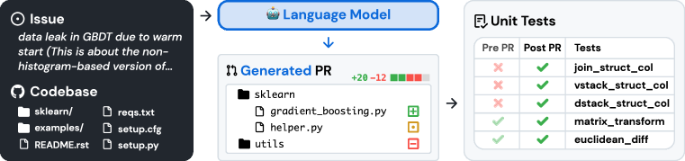

# SWE-bench — 検索の recall を上げたら、性能が下がった

> 原典: [[translations/2023-swe-bench]] ・ `raw/papers/SWE-bench_ Can Language Models Resolve Real-World GitHub Issues_.md`
> 著者・年・会議: Carlos E. Jimenez\*, John Yang\* ほか（Princeton University / Princeton Language and Intelligence / University of Chicago）/ ICLR 2024 / arXiv:2310.06770

## 一言まとめ

**実際の GitHub イシューとそれを解決したプルリクエストの対**から 2,294 件のタスクを自動収集し、**リポジトリ自身の単体テストで実行ベースに採点する**ベンチマークを作った論文。当時の最良モデルが**編集すべきファイルを教えてもらってなお 4.8% しか解けない**という結果とともに、**文脈を増やすと検索の recall は上がるのに解決率は下がる**という、この分野で繰り返し再発見されることになる現象を最初に測っている。

## 背景と問題意識 — なぜ HumanEval では足りないのか

2023 年当時、コード生成のベンチマークは飽和しつつあった。当時の最良手法は **HumanEval の 94.4% を解いていた**。しかし HumanEval のような既存のベンチマークは、**大部分が数行で解ける自己完結した問題**である——関数を 1 つ書けば終わり、周囲のコードベースは存在しない。

著者らの観察は素直である。**実世界のソフトウェア工学はそうではない。**バグを直すことは、大きなリポジトリを渡り歩き、異なるファイルの関数間の相互作用を理解し、込み入ったコードの中の小さな誤りを見つけることを伴う。

良いベンチマークの条件は 2 つあって、しばしば衝突する——**タスクは既存モデルを行き詰まらせるほど難しく、かつ予測が検証しやすくなければならない**。コーディングが魅力的なのは、**単体テストを走らせれば検証が機械的に済む**からである。SWE-bench はこの性質を保ったまま、問題の側を実世界へ引き上げた。

<figure>

<figcaption>図1（再掲, 原典の Figure 1）: 左に Issue（テキスト）とコードベース、中央に言語モデルが生成する PR（変更されるファイルと差分）、右に単体テスト。Pre PR では失敗し Post PR では成功するテスト（fail-to-pass）が、そのイシューが解決されたかの判定になる。</figcaption>
</figure>

## 提案手法 — ベンチマークを「作る」のではなく「収穫する」

設計の核は、**問題を人手で作らず、既に存在する開発の営みから収穫する**ことにある。

### 3 段階のフィルタ

**段階 I: 収集。** 2023 年 8 月時点でダウンロード数上位 5,000 の PyPI ライブラリから**上位 100 パッケージ**を取り、ライセンスが自由な利用を許すものを検証して、GitHub API で全 PR を集める。人気リポジトリを選ぶのは、**よく保守され、貢献ガイドラインが明確で、テストカバレッジが良い傾向がある**から。**約 93,000 件の PR** が集まる。

**段階 II: 属性フィルタ。** **(1) Merged であること**、**(2) イシューを解決すること**（タイトル・本文・コミットメッセージから "fixes #24" のような参照を走査）、**(3) 新しいテストを導入すること**（テスト関連のキーワードを含むファイルパスを編集している）。ここで **11,407 件**へ。

**段階 III: 実行フィルタ。** 各候補について**テストパッチだけを当てた状態（解の適用前）と、解も当てた状態（適用後）で、それぞれテストを走らせてログを取る**。そして **fail から pass へ状態が変わるテスト（fail-to-pass）が 1 つ以上ない候補を捨てる**。インストールや実行時エラーになるものも捨てる。**このステップだけで候補の約半分が消える**。最終的に **2,294 件**。

**93,139 → 11,407 → 2,294。**この漏斗の数字が Table 10 に公開されているのが誠実である。

### 設計上の細かい判断が効いている

- **問題記述には、PR の最初のコミットより前のコメントしか含めない。** 解の詳細の漏洩を避けるためである。
- **解で初めて導入された関数やクラスを呼ぶテストを持つインスタンスは除外する。** そうした名前の付け方は恣意的で問題記述に書かれていないので、**人間の開発者にとっても解決不可能なタスクになりうる**から。
- **`ImportError` と `AttributeError` が解適用前のログに出るインスタンスを除外する。** 依存関係の命名に起因する、自明かつ対処不能な誤りを避ける。
- **リポジトリの「ミラー」を作る。** 元リポジトリの履歴は著者らの制御外で変わりうるので、`base_commit` が消えてタスクが使えなくなることを防ぐ。ミラーは**コミットハッシュ・履歴・ブランチ・タグを保持する**（スターやイシューは保持しない）。
- **実行環境はリリースバージョン単位で作る。** インスタンス単位は手作業が膨大、リポジトリ単位は粗すぎて古い版と両立しない。**リリースバージョンが依存関係の要求を捉える良い代理**だった、という粒度の選択が明記されている。
- **`FAIL_TO_PASS` に加えて `PASS_TO_PASS` も記録する。** 前者はイシューが解決されたかを、**後者は既存の振る舞いが壊れていないか**を見る。中央値で **51 個**の pass-to-pass テストが走る。

**採点は「`FAIL_TO_PASS` と `PASS_TO_PASS` のすべてが通ったら解決」**という二値である。パッチが適用できなければ自動的に 0 点（ただし**不要な文脈行を除いてヘッダを再計算する自動修復を 1 回だけ試みる**）。

### 継続的に更新できる

収集の過程がほぼ全自動なので、**任意の Python リポジトリへ拡張でき、任意のモデルの訓練日より後に作られた PR から新しいインスタンスを作れる**。著者らはこれを**時間的な頑健性**と呼ぶ。汚染対策がベンチマークの設計そのものに埋め込まれている。

## 実験結果と知見

### 絶対水準 — 「最も単純なイシューしか解けない」

| Model | BM25 % Resolved | "Oracle" % Resolved |
| --- | --- | --- |
| ChatGPT-3.5 | 0.20 | 0.52 |
| **Claude 2** | **1.96** | **4.80** |
| GPT-4\* | 0.00 | 1.74 |
| SWE-Llama 7b | 0.70 | 3.00 |
| SWE-Llama 13b | 0.70 | 4.00 |

「オラクル」検索とは、**参照解が実際に編集したファイルだけを文脈として与える**設定である。著者らは自らこれを「現実的ではない」と書く——実際のエンジニアはどのファイルを直すべきか事前には知らないからである。**その反則的に有利な設定でさえ Claude 2 は 4.8%**、BM25 で普通に検索させると **1.96%** に落ちる。

### 最も重要な知見 — recall が上がって性能が下がる

BM25 の最大文脈を広げると、オラクルのファイルに対する **recall は素直に改善する**。ところが**解決率は逆に下がる**。

| 最大文脈 | BM25 recall（平均） | Claude 2 の解決率 |
| --- | --- | --- |
| 13k | 29.58 | **1.96** |
| 27k | 44.41 | 1.87 |
| 50k | 51.06 | 1.22 |

著者らの説明は端的である——**モデルは「トークンの海の中で問題のあるコードを位置特定すること」に単に無効である**。正しいファイルが文脈に入る確率が上がっても、それ以上に**気を散らすコードが増える害のほうが勝つ**。

裏返しの実験がさらに効く。オラクル設定で、**PR が実際に編集した行の前後 ±15 行を除いてファイルを畳む**（"Oracle"-collapsed）と、**Claude 2 は 4.8 → 5.9、GPT-4 は 1.3 → 3.4 へ上がる**。**同じ情報を含みながら、無関係な部分を削るだけで性能が上がる。**

この結果は 2 つの方向へ延びる。ひとつは [[context-engineering]] の中心命題（**注意は予算であり、無関係な文脈は課金される**）の 2023 年時点での実測であり、著者ら自身も **lost in the middle**（Liu et al. 2023）を引いて説明している。もうひとつは [[retrieval-augmented-generation]] への警告で、**検索指標の改善がタスク成果の改善を意味しない**——recall を最適化しても、下流が壊れることがある。

### 汚染を日付で検査する

PR の作成年で分けた結果（Table 7）は、**2023 年の前後でほとんど差がない**（Claude 2: 4.87 → 4.23、SWE-Llama 13b: 2.95 → 3.46）。著者らはこれを有望と読む——**モデルがそのコードベースの何らかの版に触れていたとしても、単に「より新しい版を出力する」ことでカンニングしているわけではなさそう**だからである。ベンチマーク汚染を**除外ではなく層別で見る**やり方の初期例になっている。

### その他の知見

- **パッチ生成のほうがファイル全体の再生成より易しい。** Claude 2 は patch 形式で 4.8%、ファイル全体を書き直させると **2.2%**。入力長を統制しても 7.8% 対 3.9%。
- **モデルは gold より短く単純な編集を書く。** 適用に成功したモデルのパッチは平均 19.6〜30.1 行、gold は 44.1 行（全 gold なら 74.5 行）。**ほぼ単一ファイルしか触らない**（1.0〜1.1 ファイル 対 gold の 1.7）。
- **成績が同じでも、解けている問題が違う。** オラクル設定で Claude 2 は 110 件、SWE-Llama 13b は 91 件を解くが、**Claude 2 は SWE-Llama が解いた問題の 42% しか解けていない**。単一のスカラーがモデルの能力を代表しないことの実例。
- **ファインチューニングは文脈の分布シフトに脆い。** SWE-Llama はオラクル文脈で訓練されたため、**BM25 文脈では極端に性能が落ちる**（3.00 → 0.70）。オラクルでは「文脈のファイルはすべて編集対象」だが BM25 ではそうでない、という前提の違いが効く。
- **イシューに画像が含まれることがある。** matplotlib の 32%・seaborn の 10%（全体では 2%）。**マルチモーダルな理解か外部ツールが要る**小さいが無視できない部分集合。
- **パッチが適用できない率が高い。** GPT-4 はオラクル設定で生成 472 件中**適用成功 150 件**、うち **68.7% が自動修復を要した**。SWE-Llama は適用率が高く修復率が低い（19.4〜29.7%）——**ファインチューニングは整形式のパッチ生成に効く**。

### SWE-Llama

**37 の別リポジトリ**（評価と互いに素）から **19,000 件**を集めた `SWE-bench-train` で、CodeLlama-Python 7b/13b を **LoRA（$r=16$, $\alpha=16$、attention 副層の q/k/v/o 射影のみ）**で微調整。30,000 トークン超の系列を除いて実効 10,000 件。**7b は A100 4 台で 20 時間、13b は 8 台で 47 時間。**既製の CodeLlama は「**プレースホルダの応答や無関係なコードを出力する**」ため、比較可能な状態にするだけで微調整が必要だった、という当時のオープンモデルの状況が記録されている。

## 限界・批判的視点

- **数値は完全に陳腐化している。** 2023 年当時の最良が 4.8%。翌年の [[summaries/2024-swe-agent]] が 12.47% へ、その後さらに大きく伸びた。**この論文から今も生きているのは、ベンチマークの設計と、文脈・汚染・評価についての方法論的な知見**であって、モデルの成績ではない。
- **Python のみ・12 リポジトリのみ。** 著者らが限界節の筆頭に挙げている。言語やドメインの偏りがそのまま残る。
- **「オラクル」設定は反則である**ことを著者ら自身が明記している。ただし**それでも包括的ではない**——編集されたファイルだけでは、コードの未知の部分と相互作用したときの振る舞いを理解するのに必要な文脈を含まないかもしれない。
- **ベースラインは意図的に素朴である。** 著者らは「**最も単純で率直なアプローチのベースラインを確立することを狙っており**、将来の方法論を同種のアプローチへ制約する意図はない」と書き、**エージェントベースのアプローチに期待している**と明言する。実際その 7 か月後に同じグループが SWE-agent を出す。**この論文の低い数値を「LM にはできない」と読むのは誤読**である。
- **実行ベースの評価だけでは不十分**だと著者ら自身が述べている——「LM の自動コード生成は、人間が書いた解と比べて**包括性・効率・可読性においてしばしば劣りうる**」。テストが通ることは正しさの必要条件であって十分条件ではない。付録 F の Table 24 は「**誤った解だが既存の振る舞いは保つ**」例として、この境界を具体的に示している。
- **`hints_text` は収集されているが実験では使われていない。** PR の最初のコミットより前のコメント（人間の作業者へ向けた擬似コードや示唆を含みうる）がデータに入っているので、**これを使えば数字は変わる**。ベンチマークを引用するときは、どの設定かを明示しないと比較にならない。
- **GPT-4 は予算の制約で 25% の部分集合でしか評価されていない。** 表に注記があるが、他モデルと同列に並んでいるので読み飛ばしやすい。

## 実装・運用上の示唆

- **ベンチマークは作るより収穫する。** 既存の開発の営み（イシュー・PR・テスト）には**正解と検証器が最初から付いている**。人手で問題を作る労力を、フィルタの設計に振り替える。
- **漏斗の数字を公開する。** 93,139 → 11,407 → 2,294 が出ていることで、何がどう選ばれたかを読者が判断できる。
- **「解けないタスク」を能動的に除外する。** 解で初めて命名された関数を呼ぶテスト、依存関係の命名に起因するエラー——**人間にも解けない問題を残すとベンチマークの上限が下がる**。
- **回帰テストを評価に組み込む。** `FAIL_TO_PASS` だけでなく `PASS_TO_PASS` を見る設計は、「直したが壊した」を捕まえる。エージェント評価一般に転用できる型。
- **文脈は多いほど良いと仮定しない。** 検索の recall を上げる前に、**その recall 改善が下流の成果に伝わるかを測る**。無関係な部分を畳むだけで性能が上がることがある。
- **汚染は除外でなく層別でも見られる。** 作成日で分けて成績を比べるのは、データを捨てずに汚染の有無を検査する安価な方法である。
- **単一のスカラーで能力を代表させない。** 同じ解決率でも解いている問題が重ならないなら、それは別の能力である。

## 用語と略称

- **LM / LLM** = Language Model / Large Language Model（言語モデル／大規模言語モデル）
- **PR** = Pull Request（プルリクエスト。コード変更の提案）
- **patch / diff** = 行ベースのテキストへの変更を指定する形式。`+` が追加、`-` が削除
- **hunk** = パッチ内の連続した変更のかたまり
- **gold patch** = そのイシューを実際に解決した人間の解（参照解）
- **fail-to-pass テスト** = 解の適用前は失敗し、適用後に成功するテスト。**イシューが解決されたか**を測る
- **pass-to-pass テスト** = 適用前後とも成功するテスト。**既存の振る舞いが壊れていないか**を測る
- **% Resolved / pass@1** = fail-to-pass と pass-to-pass のすべてが通ったインスタンスの割合
- **% Apply** = 生成されたパッチが（自動修復を含めて）適用に成功した割合
- **BM25** = 単語の重なりに基づく古典的な疎検索のスコアリング
- **疎検索 / 密検索** = 単語の一致に基づく検索 / 埋め込みベクトルの近さに基づく検索。本論文は**キーとクエリが非常に長く、自然言語のクエリでコードを引く**設定ゆえ密検索は不適と判断した
- **「オラクル」検索** = 参照解が実際に編集したファイルだけを文脈に与える、反則的に有利な設定
- **"Oracle"-collapsed** = オラクルのファイルのうち、実際に編集された行の ±15 行以外を畳んだ設定
- **recall（再現率）** = ここでは、検索がオラクルのファイルをどれだけ拾えたかの割合
- **LoRA** = Low-Rank Adaptation（少数パラメータのみ更新する微調整）
- **CodeLlama** = Meta のコード特化 Llama。本論文の時点で長文脈を扱えた数少ないオープンモデル
- **conda env** = Python の仮想環境。ここではリリースバージョンごとの実行文脈として使う
- **lost in the middle** = 長いコンテキストの中ほどの情報がモデルに使われにくくなる現象（Liu et al., 2023）

## 関連ページ

- [[agent-evaluation]] — 本ページの主な接続先。ベンチマークの設計・実行ベース評価・汚染の検査
- [[coding-agents]] — SWE-bench が主戦場になった領域
- [[context-engineering]] — 「文脈を増やすと悪化する」の実測
- [[retrieval-augmented-generation]] — 検索指標の改善と成果の改善が乖離する反例
- [[summaries/2024-swe-agent]] — 本論文の 7 か月後、同じグループが「エージェントベースのアプローチ」への期待に自ら答えた仕事
- [[summaries/2023-reflexion]] — 汚染対策としての LeetcodeHardGym（カットオフ後の問題だけで組む）との対比
