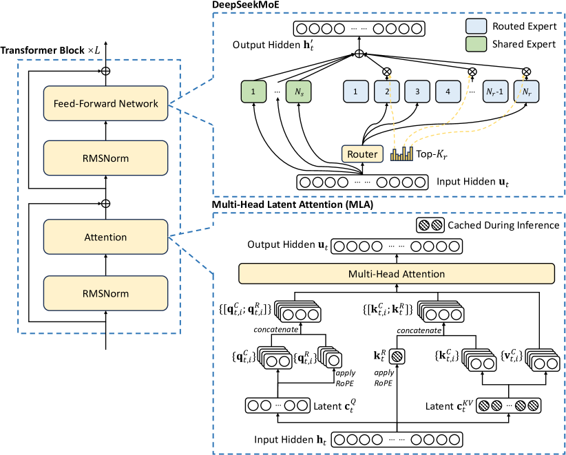

# DeepSeek-V3 — 671B を $5.576M で、loss spike ゼロで訓練する

> 原典: [[translations/2024-deepseek-v3]] ・ `raw/papers/DeepSeek-V3 Technical Report.md`
> 著者・年: DeepSeek-AI / 2024 年 12 月 / arXiv:2412.19437

## 一言まとめ

総 671B・活性 37B の MoE（Mixture of Experts, 専門家混合）モデルを **278.8 万 H800 GPU 時間（約 $5.576M）**で、**回復不能な loss spike もロールバックもゼロ**で訓練しきったテクニカルレポート。中核の貢献は 3 つ——**補助損失を使わない負荷分散**、**マルチトークン予測（MTP）**、そして**極大規模での FP8 訓練の初の成功例**。

## 背景と位置づけ — wiki の 2 原典の「あいだ」

本 wiki にとってこの論文は、**既に持っている 2 つの原典の中間**を埋める。[[summaries/2025-deepseek-r1]] は **DeepSeek-V3-Base の上に**構築された推論モデルであり、[[summaries/2026-deepseek-v4]] は全編で V3／V3.2 と比較しながら書かれている（CSA/HCA は MLA の後継、OPD は mixed RL の置換）。

しかも依存は一方向ではない。**V3 の事後訓練は R1 から推論能力を蒸留している**——R1 が V3-Base から作られ、その R1 が V3-Chat の推論を強化する、という相互参照の関係になっている。R1 の要約が「ベースモデルは V3」と一行で済ませていた部分の中身がここにある。

## 主張 — アーキテクチャの 3 つの選択

<figure>

<figcaption>図1（再掲, 原典の Figure 2）: DeepSeek-V3 の基本アーキテクチャ。attention 側が MLA（key/value を潜在ベクトルへ圧縮し、生成時にキャッシュするのはその潜在ベクトルと RoPE 用の分離された key だけ）、FFN 側が DeepSeekMoE（細粒度の routed エキスパート＋共有エキスパート）。</figcaption>
</figure>

### (1) MLA — KV キャッシュを潜在ベクトルへ畳む

**Multi-head Latent Attention**。key と value を**低ランクの潜在ベクトル $\mathbf{c}_t^{KV}$ に結合圧縮**し、生成時にキャッシュするのは**その潜在ベクトルと、RoPE を担う分離された key $\mathbf{k}_t^R$ の 2 つだけ**にする（V3 では KV 圧縮次元 $d_c=512$、ヘッド数 128 × ヘッド次元 128 に対して）。標準的な MHA に匹敵する性能を保ちながら KV キャッシュを大幅に削減する。query 側も低ランク圧縮して訓練時の活性化メモリを減らす。

これは [[transformer-architecture]] の「固定容量メモリと追い出しポリシー」の系譜における、**追い出さずに圧縮する**側の代表例である。後継の DeepSeek-V4（[[summaries/2026-deepseek-v4]]）はこれを CSA/HCA——圧縮に加えて**スパース選択**——へ発展させた。

### (2) 補助損失を使わない負荷分散 — この論文で最も転用可能な部分

MoE の負荷が偏るとルーティング崩壊を招き、エキスパート並列では計算効率も落ちる。従来の解は**補助損失**だが、**補助損失が大きすぎるとモデル性能を損なう**。V3 の解はこうである:

- エキスパートごとに**バイアス項 $b_i$** を持ち、$s_{i,t}+b_i$ で top-K を決める。
- **バイアスはルーティングの判定にのみ使う**。FFN 出力に掛けるゲート値は元の親和度 $s_{i,t}$ から取るので、**勾配経路にバイアスは入らない**。
- 各訓練ステップの終わりに、過負荷のエキスパートは $b_i$ を $\gamma$ 減らし、低負荷なら $\gamma$ 増やす（V3 では最初の 14.3T トークンで $\gamma=0.001$、最後の 500B で 0.0）。
- 補助損失は完全にゼロではなく、**単一系列内の極端な偏りを防ぐための系列単位の均衡損失を、極めて小さい係数で**残す。

アブレーション（表5）では、小規模（15.7B/1.33T トークン）・大規模（228.7B/578B トークン）の両方で、補助損失のみのベースラインより大半のベンチマークで上回った。

**ただし §4.5.3 の分析のほうが本質的である**。著者らは「補助損失が悪い」とは言っていない——**違いは均衡させる範囲（バッチ単位か系列単位か）にある**。系列単位の制約は各系列にドメイン内の均衡を強制するので、エキスパートがドメインに特化するのを妨げる。それを確かめるために**バッチ単位の補助損失**を設計して比較したところ、検証損失は次のようになった:

| 手法 | 1B MoE | 3B MoE |
| --- | --- | --- |
| 系列単位の補助損失 | 2.258 | 2.085 |
| 補助損失なし（バイアス項） | **2.253** | **2.080** |
| **バッチ単位の補助損失** | **2.253** | **2.080** |

**バッチ単位の補助損失は、補助損失なしと同じ性能に達する**。つまり効いているのは「補助損失を消したこと」ではなく「**均衡の粒度を系列からバッチへ緩めたこと**」である。

その帰結として**エキスパートの専門化が強く出る**ことも実測されている（Figure 9 と付録 C の全 27 層の負荷図）。Pile テストセットの 3 ドメインで、補助損失なしのモデルのほうが相対エキスパート負荷の偏りがドメインごとに明瞭になる。

バッチ単位の緩和には代償もあり、著者らは 2 つ挙げている: **(a) 特定の系列や小さなバッチ内での不均衡**（大規模なエキスパート並列＋データ並列で各マイクロバッチが大きいので自然に対処される）、**(b) 推論時のドメインシフトに起因する不均衡**（後述の冗長エキスパートで対処）。

加えて **ノード制限ルーティング**（各トークンが送られるノードを最大 $M=4$ に制限）と、**トークンを落とさない**（訓練・推論とも token dropping ゼロ）。

### (3) マルチトークン予測（MTP）

各位置で**複数の未来トークン**を予測させる訓練目的。先行研究が独立ヘッドで並列に予測するのに対し、V3 は**逐次的に予測して各深さで完全な因果連鎖を保つ**。V3 の深さは $D=1$（次トークン＋1 個）。

2 つの効き方が主張されている: 訓練信号を**濃くする**ことでデータ効率が上がり、モデルが未来のトークンのために表現を**事前に計画**できる。アブレーション（表4）は大半のベンチマークで改善を示し、**推論時には MTP モジュールを破棄できるので推論コストは同一**である点が重要（比較が公平になる）。

破棄せずに使う道もあり、**投機的デコードに転用**すると **2 番目トークンの受理率 85〜90%・TPS 1.8 倍**。

## インフラ — 「安く訓練できた」の中身

**FP8 混合精度訓練**が中心で、著者らは**極大規模での有効性を初めて検証した**と主張する。要点:

- GEMM の 3 つ（Fprop・Dgrad・Wgrad）を FP8 で実行。一方で**埋め込み・出力ヘッド・MoE のゲーティング・正規化・attention は元の精度**（BF16/FP32）に留める——ゲーティングを高精度に保つのは [[mixture-of-experts]] の「ルータは指数関数を含むので高精度必須」と一致する。
- **細粒度量子化**: 活性は 1×128 のタイル単位、重みは 128×128 のブロック単位でスケール。テンソル単位のスケーリングが活性の外れ値に脆いことへの対処で、**小さなグループ内で実質的に指数ビットを共有する**ため、全テンソルで E4M3（仮数部を優先）を使える。
- **累積精度の問題を実測で暴いた**: H800 の Tensor Core の FP8 GEMM は**仮数部の積の上位 14 ビットしか使わない**。$K=4096$ で最大約 2% の相対誤差。対処は $N_C=128$ 要素ごとに **CUDA Core へ昇格させて FP32 累積**すること。
- **オンライン量子化**（履歴からの遅延量子化でなくタイル/ブロックごとにその場で最大絶対値を計算）。
- 結果として **BF16 比の相対 loss 誤差は一貫して 0.25% 未満**（付録 B.1）。
- 付録 B.2 の否定的結果も価値が高い——**活性の勾配をブロック単位で量子化すると 16B モデルが約 300B トークンで発散する**。Dgrad は精度に極めて敏感で、活性の勾配はトークン間で高度に不均衡（トークン相関の外れ値）だから、というのが著者らの推測。

**DualPipe**: ノード間エキスパート並列で計算対通信が約 1:1 になる問題に対し、順伝播・逆伝播チャンクの対の内側で計算と通信を重ねる双方向パイプライン。チャンクを attention / all-to-all dispatch / MLP / all-to-all combine に分け、逆伝播はさらに「入力に対する」「重みに対する」へ割る。**通信カーネルは MoE のゲーティングとネットワークトポロジーと協調設計**されており、NVLink（160 GB/s）が IB（50 GB/s）の約 3.2 倍であることから**各トークンを最大 4 ノードに制限**し、IB→NVLink の 2 段転送を重ね合わせる。**わずか 20 SM（132 中）で IB と NVLink の帯域を使い切る**。

**推論デプロイ**は prefill と decode を分離する。prefill は 4 ノード 32 GPU（EP32）、decode は **40 ノード 320 GPU（EP320）で各 GPU がエキスパート 1 個**。負荷分散には**冗長エキスパート**——オンラインの統計から高負荷エキスパートを検出し、**10 分ごとに**複製配置を調整する（prefill で 32 個）。decode では**共有エキスパートを routed の 1 つとして扱い**、常に選ばれる高負荷エキスパートと見なす。decode のボトルネックは計算でなく**メモリアクセス**（エキスパートあたり 256 トークン程度）なので、dispatch+MoE+combine には少数の SM しか割かない → [[llm-inference-optimization]]。

**§3.5 のハードウェア設計への提言**は、モデル側から見えたハードの限界の記録として読める: 通信タスクを SM からオフロードする補助プロセッサ（20/132 SM を通信に取られている）、IB と NVLink を統一したインターフェース、Tensor Core の FP8 累積精度の引き上げ（**32 個の FP8 積の正確な FP32 累積には最低 34 ビット必要**なのに 14 ビットしか使われていない）、タイル/ブロック単位量子化の native 対応、FP8 キャストと TMA アクセスの融合（HBM の読み書きを往復させない。near-memory computing なら**オフチップアクセス約 50% 削減**）、転置 GEMM。

## 事後訓練 — R1 からの蒸留と自己報酬

**SFT は 150 万インスタンス**。推論データの作り方が独特で、内部の R1 が生成したデータは正確だが**過剰思考・書式の悪さ・長すぎ**という問題を抱えるため、ドメイン別の**エキスパートモデル**（SFT+RL で訓練）をデータ生成器にする。各インスタンスについて `<problem, original response>` と `<system prompt, problem, R1 response>` の 2 種類の SFT サンプルを作り、システムプロンプトは**反省と検証の機構を含む応答**へ誘導するよう設計する。RL フェーズで高温サンプリングを使うと、**明示的なシステムプロンプトがなくても R1 のパターンが取り込まれる**ようになり、最後に棄却サンプリングで高品質な SFT データを精選する。

**RL は GRPO**（[[summaries/2024-deepseekmath]] の手法）で、報酬は 2 系統: **ルールベース RM**（答え合わせ・コンパイラ。「操作や悪用に耐性がある」ので可能な限りこちらを使う）と**モデルベース RM**（V3 の SFT チェックポイントから訓練。**最終報酬だけでなく報酬に至る思考連鎖も含む選好データ**で訓練して reward hacking を緩和）。

**自己報酬**では constitutional AI の方法を採り、**V3 自身の投票評価をフィードバック源**にする。RewardBench で V3 は GPT-4o-0806・Claude-3.5-Sonnet-1022 の最良版と同等（平均 87.0、maj@6 で 89.6）で、判定者として使うだけの水準にあることを先に示してから自己フィードバックに使う、という順序になっている → [[agent-evaluation]]。

**R1 蒸留のアブレーション**（表9、DeepSeek-V2.5 上で実施）: LiveCodeBench-CoT の Pass@1 が 31.1 → 37.4、MATH-500 が 74.6 → 83.2。ただし**平均応答長も増える**（MATH-500 で 769 → 1510 トークン）。「性能と生成長のトレードオフ」を明示し、V3 では最適な設定を選んだと述べている。

## 主な数値

- **671B 総 / 37B 活性**、61 層、隠れ 7168、**1 共有 + 256 routed エキスパート（8 個活性）**、最初の 3 層以外の FFN を MoE 化
- 14.8T トークン、最大系列長 4K で事前学習 → YaRN で **4K → 32K → 128K**（各 1000 ステップ）
- **1 兆トークンあたり 18 万 H800 GPU 時間** = 2048 GPU で 3.7 日。事前学習 2 ヶ月未満
- MMLU 88.5 / MMLU-Pro 75.9 / GPQA 59.1、**MATH-500 で o1-preview 超え**、**Arena-Hard で 86% 超（85% を超えた初のオープンソースモデル）**
- Qwen2.5 72B に対し**活性化パラメータ半分**で、LLaMA-3.1 405B に対し**活性化パラメータ 1/11** で優位

## 限界・批判的視点

- **著者ら自身が挙げる限界はデプロイに集中している**。効率的な推論のための**推奨デプロイ単位が大きく**（decode で 320 GPU）、小規模チームには負担になる。これは「オープンウェイトだが実質的に動かせる主体が限られる」という、オープンソース性の実効的な制約である。
- **訓練コストの $5.576M は「公式訓練のみ」**であり、著者らも明記するとおり**アーキテクチャ・アルゴリズム・データに関する事前の研究とアブレーションのコストを含まない**。この数字が「671B モデルは $5.6M で作れる」という形で流通するのは、原典の但し書きを落とした引用にあたる。
- **評価はすべて内製フレームワーク**。比較対象（Qwen2.5 72B、LLaMA-3.1 405B）も自前で再評価しており、設定を揃えたと述べているが外部再現ではない。同レポートは §6 で「固定されたベンチマーク集合の最適化へ傾く傾向を防ぐ、より多次元的な評価手法」を今後の課題に挙げており、自覚はある。
- **補助損失なしの優位は「補助損失が悪い」ではない**。§4.5.3 が示すとおり、バッチ単位の補助損失は同等に達する。「aux-loss-free が勝った」という粗い引用は、著者ら自身の分析より弱い主張になってしまう。
- **ハードウェア提言は 2024 年末時点のもの**。Blackwell の microscaling 対応は同レポート自身が言及しており、累積精度・タイル単位量子化の要望はその後のハードウェア世代で部分的に満たされている可能性が高い。**「H800 世代の制約への対処」として読むべき**節である。
- **R1 蒸留の応答長増加**は本 wiki の他の原典と接続する論点でもある。[[summaries/2026-kimi-k2.5]] の Toggle（トークン効率 RL、出力 −25〜30%）や [[summaries/2025-kimi-k2]] の予算制御は、まさにこの「推論能力を入れると長くなる」問題への後続の回答にあたる。

## 実装・運用上の示唆

- **負荷分散は「損失で押さえる」以外の選択肢がある**。バイアス項を毎ステップ増減させる方式は、勾配経路を汚さずに済むうえ実装も軽い。ただし本質は**均衡の粒度**なので、バッチ単位で均衡させられるなら補助損失でも同等に到達できる。
- **MoE の精度設計は「どこを高精度に残すか」の問題**。V3 の答えは埋め込み・出力ヘッド・**ゲーティング**・正規化・attention。ルータを低精度にしないのは MoE 一般の教訓として持ち帰れる。
- **推論の負荷分散はデプロイ側の仕事でもある**。冗長エキスパートを 10 分周期で再配置する運用は、訓練時のバッチ単位均衡が推論時のドメインシフトで崩れることへの直接の対処である。
- **投機的デコードは MTP の副産物として得られる**。訓練目的として MTP を入れておけば、推論時に破棄も転用も選べる。
- **ジャッジとして使う前に、ジャッジとしての性能を測る**。V3 は RewardBench で GPT-4o/Claude と同等であることを示してから自己フィードバックに使っている。[[agent-evaluation]] の「judge を検証してから使う」規律の実例。

## 用語と略称

- **MoE** = Mixture of Experts（専門家混合）。入力ごとに一部のエキスパートだけを活性化する疎な構造 → [[mixture-of-experts]]。
- **MLA** = Multi-head Latent Attention。key/value を低ランクの潜在ベクトルへ圧縮し、キャッシュ量を削減する attention。
- **MTP** = Multi-Token Prediction（マルチトークン予測）。各位置で複数の未来トークンを予測する訓練目的。
- **auxiliary-loss-free load balancing** = 補助損失の代わりにエキスパートごとのバイアス項を毎ステップ増減させる負荷分散。
- **routing collapse（ルーティング崩壊）** = 少数のエキスパートに入力が集中する MoE の失敗モード。
- **DualPipe** = 順伝播・逆伝播チャンクの対の内側で計算と通信を重ね合わせる双方向パイプライン並列。
- **EP / PP / DP / TP / SP** = Expert / Pipeline / Data / Tensor / Sequence Parallelism（各種の並列化）。
- **FP8 / BF16 / E4M3 / E5M2** = 低精度の浮動小数点形式。E4M3 は指数部 4 ビット・仮数部 3 ビット。
- **GEMM** = General Matrix Multiply（一般行列積）。Fprop / Dgrad / Wgrad は順伝播・活性の逆伝播・重みの逆伝播。
- **SM** = Streaming Multiprocessor（GPU の計算ユニット）。
- **IB / NVLink** = InfiniBand（ノード間）/ NVLink（ノード内）の相互接続。
- **all-to-all** = MoE でトークンを担当エキスパートへ配る通信パターン。
- **冗長エキスパート（redundant experts）** = 高負荷エキスパートを複製して配置し、推論時の負荷を均す運用。
- **YaRN** = RoPE の内挿によりコンテキスト長を拡張する手法。
- **GRPO** = Group Relative Policy Optimization。critic を排しグループ相対の advantage を使う RL → [[reinforcement-learning-from-human-feedback]]。
- **FIM / PSM** = Fill-in-Middle / Prefix-Suffix-Middle。中間テキストを予測させる訓練データの構造化。
- **TPS** = Tokens Per Second（毎秒トークン数）。

## 関連ページ

- [[summaries/2025-deepseek-series]] — 本レポートを含む DeepSeek 4 本の二次解説。V2 由来の MLA/DeepSeekMoE の前史が補える一方、V3 の MLA について原典にない記述があるので照合節を参照

- [[mixture-of-experts]] — 本ページの主な受け皿。補助損失を使わない負荷分散・ノード制限ルーティング・エキスパート専門化の実測
- [[transformer-architecture]] — MLA（KV を潜在ベクトルへ圧縮する attention）
- [[llm-inference-optimization]] — FP8 訓練・DualPipe・prefill/decode 分離・冗長エキスパート・ハードウェア提言
- [[model-quantization]] — 本レポートの細粒度量子化を、外れ値への 4 系統の対処の一つとして位置づけるページ
- [[summaries/2024-flashattention-3]] — 同じ 2024 年に FP8 の外れ値問題へ別の答えを出した仕事。本レポートが**スケールの粒度を細かくする**（活性 1×128 タイル・重み 128×128 ブロック）のに対し、あちらは加えて**直交回転で分布そのものをならす**（incoherent processing）。適用層も訓練 vs attention カーネルで対照的
- [[reinforcement-learning-from-human-feedback]] — GRPO・ルール／モデルベース RM・R1 からの蒸留・自己報酬
- [[summaries/2025-deepseek-r1]] — 本モデルの Base の上に作られた推論モデル（そして V3 の事後訓練が蒸留元にした相手）
- [[summaries/2026-deepseek-v4]] — 後継。MLA → CSA/HCA、mixed RL → OPD
- [[summaries/2024-deepseekmath]] — GRPO の一次資料
- [[summaries/2025-moe-survey]] / [[summaries/2021-switch-transformers]] — MoE の設計空間と、補助損失で押さえる側の原典
