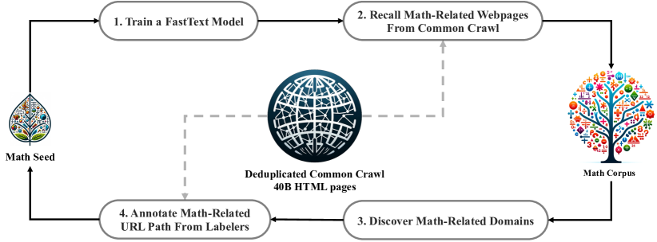
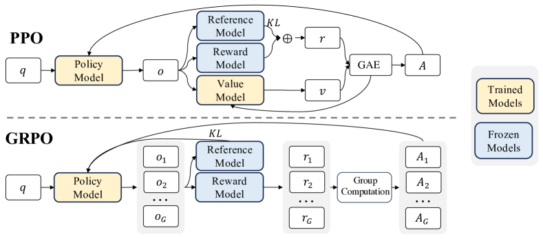
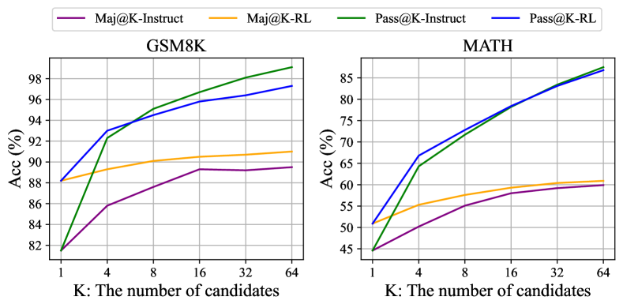

# DeepSeekMath（Shao et al. / DeepSeek-AI, 2024）

> 原典: [[translations/2024-deepseekmath]] ・ `raw/papers/DeepSeekMath_ Pushing the Limits of Mathematical Reasoning in Open Language Models.md`
> 著者・年・出典: Zhihong Shao, Peiyi Wang, Qihao Zhu ほか（DeepSeek-AI／清華大学／北京大学）・2024-02・arXiv:2402.03300

## 一言まとめ

**GRPO（Group Relative Policy Optimization）の発明論文**。数学特化の 7B モデルで「データ選択パイプライン（Common Crawl から 120B 数学トークン）＋コード基盤からの継続事前学習＋GRPO」の 3 段を組み、外部ツールなしの MATH 51.7% という当時のオープン SOTA を **77 倍小さいモデル**（対 Minerva 540B）で達成した。wiki が繰り返し参照してきた GRPO（[[summaries/2025-deepseek-r1]]・[[summaries/2026-sakana-fugu]]・[[summaries/2026-deepseek-v4]]）の一次資料であると同時に、**「RL は Maj@K を上げるが Pass@K を上げない＝分布の尖鋭化」**という、RL の効果の解釈を方向づけた観察の出典でもある。DeepSeek 推論系譜（Math → R1 → V4）の起点。

## 背景と問題意識

2024 年初頭、数学推論は GPT-4/Gemini-Ultra とオープンモデルの差が最も大きい領域だった。先行するオープンの数学特化モデル（Minerva・Llemma 等）は (1) 英語中心の限られたコーパス（arXiv・教科書偏重）と (2) PPO（Proximal Policy Optimization——policy／value（critic）／reward／reference の **4 モデル**を回す actor-critic 型 RL）の重さという 2 つの制約を抱えていた。特に PPO の価値モデルは方策と同サイズの別モデルであり、メモリを倍近く食ううえ、LLM では**報酬が最終トークンにしか付かない**ため「トークンごとの価値」を正確に学習させること自体が難しい。本論文はデータとアルゴリズムの両面からこの制約を外しにいった。

## 提案手法 / 主張

### 1. データ: fastText 反復パイプラインで Common Crawl から 120B トークン

<figure>

<figcaption>図2（再掲）: Common Crawl から数学 Web ページを収集する反復パイプライン。分類器の回収 → ドメイン発見 → 人手アノテーション → 種コーパス拡充 → 再訓練を 4 周する。</figcaption>
</figure>

種コーパス（OpenWebMath）で fastText 分類器（軽量なテキスト分類器）を訓練 → Common Crawl から数学ページを回収 → **回収率 10% 超のドメインを数学関連と判定し、その中の数学 URL を人手アノテーション** → 種に加えて分類器を再訓練、という反復を 4 周（98% 飽和で打ち切り）。結果は **120B トークン**（Minerva の使った数学 Web の約 7 倍・OpenWebMath の 9 倍）で、多言語（英中）を含む。ベンチマーク汚染は 10-gram 完全一致で除去。1.3B での対照実験（表1）では、同じ 150B トークン訓練で既存コーパス（MathPile・OpenWebMath・Proof-Pile-2）を全ベンチで圧倒し、**「Web には高品質な数学データが眠っており、採掘パイプラインが決定打」**を実証した。この「分類器×人手×反復」の設計は他ドメイン（コード等）にも適用可能と明記されており、後の DeepSeek 系データ構築（→ [[summaries/2026-deepseek-v4]]）の原型といえる。

### 2. 基盤: コードモデルからの継続事前学習

DeepSeekMath-Base 7B は汎用 LLM でなく **DeepSeek-Coder-Base-v1.5 7B から**500B トークン継続訓練される（数学 56%＋コード 20% を維持）。§5.1 の対照実験が根拠で、**コード訓練 → 数学訓練の 2 段構成は、一般テキスト → 数学より、ツールなし CoT でもツールあり（Python 実行）でも良い**——「コード訓練は推論を改善するか」という長年の問いへの、数学ドメインでの肯定的な部分回答である。逆に **arXiv 論文のみの訓練は全ベンチで効果なし〜悪化**という否定的結果も併記される（MathPile・ArXiv-RedPajama の両方で。ただし他データとの混合や大規模での効果は未検証と自己限定）。

### 3. GRPO — critic を「グループ内の相対比較」で置き換える

<figure>

<figcaption>図4（再掲）: PPO（上）と GRPO（下）。PPO は Policy と同規模の Value Model を訓練して advantage を作るが、GRPO は同一問題の G 個のサンプルへの報酬から Group Computation で advantage を作る——訓練対象（黄色）が Policy だけになる。</figcaption>
</figure>

仕組みを初学者向けに書き下すと:

1. 同じ問題 $q$ について G 個（本論文では 64 個）の解答をサンプルする。
2. 報酬モデルが各解答に点をつける。
3. **advantage（この解答をどれだけ強化すべきかの係数）を「グループ平均からの偏差 ÷ グループ標準偏差」で計算**する: $\hat{A}_i = (r_i - \text{mean}(\mathbf{r}))/\text{std}(\mathbf{r})$。つまり「同じ問題の他の答えと比べて良かったか」だけを見る。
4. PPO と同じクリップ付き目的関数で方策を更新する。KL 正則化は報酬に混ぜず**損失に直接**（不偏推定量で）加える。

これで価値モデルが丸ごと不要になり（メモリ・計算の大幅削減）、しかも「同一問題内の比較」という形が、**もともと比較データで訓練される報酬モデルの性質と整合**する。変種として outcome supervision（解答末尾のみ報酬）・process supervision（ステップごと報酬を後続和で配分）・iterative GRPO（方策の進化に合わせ報酬モデルもリプレイ付きで更新）を定式化。実測では GRPO > Online RFT、GRPO+プロセス監督 > GRPO+成果監督、反復 RL は初回の伸びが最大。

### 4. 統一パラダイム — 「すべての手法はデータソース×報酬関数×勾配係数」

§5.2.1 は SFT・RFT・DPO・Online RFT・PPO・GRPO を単一の勾配式

$$
\nabla_\theta\mathcal{J} = \mathbb{E}_{(q,o)\sim\mathcal{D}}\Big[\tfrac{1}{|o|}\textstyle\sum_t GC(q,o,t)\,\nabla_\theta\log\pi_\theta(o_t|q,o_{<t})\Big]
$$

に統合する（付録 A.1 に全導出）。違いは **(1) データをどこからサンプルするか**（人手データ／SFT モデル＝オフライン／実時間方策＝オンライン）、**(2) 報酬の源**（人間選択／ルール／報酬モデル）、**(3) 勾配係数 GC**（SFT=1、RFT=正解なら 1、GRPO=グループ相対 advantage）だけ——「アルゴリズム選びとは、この 3 つの設計変数選びである」という整理は、事後学習手法の乱立を見通す地図として今も有効である。実験からの教訓は 2 つ: **オンラインはオフラインに後半で勝つ**（方策が SFT モデルから離れるほど実時間サンプリングが効く）、**正解を一様に強化するだけ（RFT）より、報酬の大きさで強化・ペナルティを変える（GRPO）方が効く**。

### 5. 「RL はなぜ効くか」— Maj@K は上がるが Pass@K は上がらない

<figure>

<figcaption>図7（再掲）: SFT（Instruct）と RL の Maj@K / Pass@K。RL は Maj@K（多数決の正解率）を押し上げるが、Pass@K（K 本中 1 本でも正解が出る率）はほぼ重なる。</figcaption>
</figure>

RL 後のモデルは Top1・多数決（Maj@K）では明確に良くなるのに、**K 本サンプルしてどれか 1 本でも正解する率（Pass@K）は変わらない**。つまりこの設定の RL は、モデルが「出せる」解の集合を広げたのではなく、**正しい解を上位に引き当てる確率を尖らせた**（出力分布の頑健化）——「根本能力の強化ではない」という率直な自己分析である。著者ら自身が原因候補（指示チューニング由来の問題のみ・素朴な nucleus sampling）と処方箋（分布外プロンプト・木探索型サンプリング・頑健な報酬・汎化する報酬モデル）まで §5.2.3 に書いており、この「尖鋭化 vs 能力獲得」という問いはその後の RLVR 研究（→ [[summaries/2025-deepseek-r1]]）を貫く論点になった。

## 実験結果と知見

- **Base 7B**（表2）: GSM8K 64.2%・MATH 36.2%——オープンのベースモデル全てを 10pt 超上回り、**Minerva 540B（58.8/33.6）超え**。中国語（CMATH 71.7%）は多言語コーパスの効果で圧倒的。数学訓練は MMLU 49.1→54.9・BBH 55.2→59.5 と**一般推論にも波及**（表4）。
- **Instruct 7B**: CoT で MATH 46.8%——全オープンと Inflection-2/Gemini Pro 超え。ツール統合（Python 実行）なら MATH 57.4%。
- **RL 7B**（GRPO, 144K 問・問題あたり 64 サンプル）: GSM8K 82.9→**88.2%**・MATH 46.8→**51.7%**（オープン初の 50% 超）。訓練データにない CMATH・MGSM-zh もドメイン外で改善。self-consistency 64 なら MATH 60.9%。
- **実務コスト情報**: GRPO の設定（学習率 1e-6・KL 係数 0.04・最大長 1024・探索ごとに 1 更新）が完全開示されており、再現の起点になる。

## 限界・批判的視点

- **幾何・定理証明の弱さ**: 予行で三角形・楕円の問題を扱えず、データ選択バイアスの可能性を自認。few-shot 能力も GPT-4 に劣る（few-shot でゼロショットと同等——モデル規模の制約）。
- **Pass@K が上がらない問題は本論文では未解決**: 提示されたのは診断と方向であり、解決は後続へ。1 年後の [[summaries/2025-deepseek-r1]] は同じ GRPO を「ベースモデルから・ルール報酬のみ・より大規模」で回して長考・自己検証の**創発**を報告する——「尖鋭化に過ぎない」（Math, SFT 済み 7B・短出力）と「創発する」（R1, ベース 671B・長出力可）のギャップは、初期方策・出力長の上限・報酬の質・規模のどれが効いたのかという未解決の読み合わせ問題であり、両論文をセットで読む価値がここにある。
- **報酬モデル依存**: 本論文の GRPO はニューラル報酬モデル（Math-Shepherd 系）を使っており、自ら指摘するとおり PRM800K でさえ約 20% の誤アノテーションがある。R1 が最終的に**ルールベース検証器のみ**へ振り切る伏線。
- **2024 年初頭の比較対象**: 表5 のクローズドモデル（GPT-4・Gemini Ultra 等）のスコアは当時の公表値であり、現世代とは比較できない（歴史的記録として読む）。

## 実装・運用上の示唆

- **GRPO を使うときの原典既定値**: G=64・KL 係数 0.04・学習率 1e-6・探索ごと 1 更新・KL は損失側に不偏推定量で。advantage の正規化（mean/std）が「グループ内に正解と不正解が混在する」ことを前提にする点に注意——全滅／全正解の問題では勾配が立たないため、問題難易度の分布設計が実質のハイパーパラメータになる。
- **RL の効果測定は Pass@K も見る**: Top1 だけ見ると「能力が上がった」と誤読する。Pass@K が動いていなければ、それは分布の尖鋭化であり、[[test-time-compute]] の並列サンプリング＋検証器で代替可能な利得かもしれない。
- **ドメインコーパスは「採掘」で作る**: 既製データセットの結合より、分類器×人手アノテーションの反復で Web から掘る方が量・質・多言語性で勝った。種→回収→ドメイン発見→再訓練のループはそのまま流用できる設計図。
- **事前学習の配合**: 数学（56%）にコード（20%）を混ぜ続けることで、前身のコーディング能力を維持しながら数学を積む——継続事前学習での破滅的忘却対策の実例。

## 用語と略称

- **LLM** = Large Language Model ／ **SFT** = Supervised Fine-Tuning（教師ありファインチューニング）
- **PPO** = Proximal Policy Optimization（クリップ付き代理目的関数の actor-critic 型 RL。policy/value/reward/reference の 4 モデル構成）／ **GAE** = Generalized Advantage Estimation（価値関数を使う advantage 推定）
- **GRPO** = Group Relative Policy Optimization（critic を廃し、同一問題の G サンプルの報酬の平均・標準偏差から advantage を計算する PPO 変種。本論文が発明）
- **advantage（アドバンテージ）**（その行動を平均よりどれだけ強化すべきかの係数）／ **critic / value model**（状態の価値を推定する補助モデル）／ **reference model**（KL 正則化の基準となる固定モデル）
- **RFT / Online RFT** = (Online) Rejection Sampling Fine-Tuning（正解した自己生成解のみで再訓練。Online は実時間方策からサンプル）
- **DPO** = Direct Preference Optimization（選好ペアから直接最適化する手法）／ **勾配係数（GC）**（統一パラダイムで各手法を区別する、トークン対数尤度勾配への重み）
- **outcome / process supervision**（解答末尾のみ報酬／ステップごと報酬）／ **PRM** = Process Reward Model（→ PRM800K はその人手データセット）
- **Maj@K / Pass@K**（K サンプルの多数決正解率／K 本中 1 本でも正解する率 → [[test-time-compute]]）／ **self-consistency**（多数決による集約）
- **CoT / PoT** = Chain-of-Thought / Program-of-Thought（思考をテキストで書く／実行可能コードで書いて実行結果を答えとする推論）／ **ツール統合推論**（自然言語推論と Python 実行を交互に行う形式）
- **fastText**（軽量な教師ありテキスト分類器）／ **Common Crawl**（Web アーカイブ）／ **OpenWebMath / MathPile / Proof-Pile-2**（先行する数学コーパス）
- **GSM8K / MATH / CMATH / miniF2F**（小学校文章題／競技数学／中国語数学／形式数学のベンチマーク）／ **Isabelle / Sledgehammer**（証明支援系とその自動証明ツール）
- **Minerva / Llemma / ToRA / WizardMath**（同時代の数学特化モデル群）

## 関連ページ

- [[reinforcement-learning-from-human-feedback]] — GRPO の一次資料・統一パラダイム・「RL は分布の尖鋭化」
- [[test-time-compute]] — Pass@K 不変の含意（並列スケーリングの上限は RL では動かない）
- [[reasoning-and-planning]] — コード訓練→数学推論の転移・PoT
- [[summaries/2025-deepseek-r1]] — 直系の後継（同じ GRPO をベースモデル×ルール報酬×大規模で回した 1 年後）
- [[summaries/2026-deepseek-v4]] — GRPO は V4 のスペシャリスト訓練でも現役（系譜の現在地）
- [[summaries/2026-sakana-fugu]] — GRPO をオーケストレーション訓練に転用した応用例
- [[summaries/2025-kimi-k2]] — 検証可能報酬＋自己批評という同時代の別解
- [[summaries/2022-chain-of-thought]] — CoT/self-consistency の原典（本論文の推論形式の土台）

