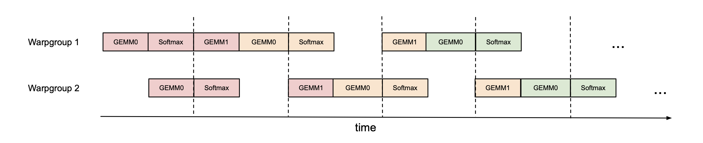

# FlashAttention-3: 非同期性と低精度による高速かつ正確な attention

> 原典: [[translations/2024-flashattention-3]] ・ `raw/papers/FlashAttention-3_ Fast and Accurate Attention with Asynchrony and Low-precision.md`
> 著者: Jay Shah, Ganesh Bikshandi, Ying Zhang, Vijay Thakkar, Pradeep Ramani, Tri Dao（Jay Shah と Ganesh Bikshandi は equal contribution）
> 年: 2024-07（arXiv:2407.08608）

## 一言まとめ

**世代が変わって、また振り出しに戻った。** A100 で理論ピークの 73% まで詰めた [[summaries/2023-flashattention-2]] は、H100 では **35%** しか出ていなかった。本論文は Hopper 固有の 2 つの新機能——**非同期実行**（データ移動と行列積が別ユニットで独立に走る）と **FP8**——を前提にカーネルを設計し直し、FP16 で 740 TFLOPs/s（75%）、FP8 で 1.2 PFLOPs/s 近くまで戻した。

## 背景と問題意識

三部作の読み方として、各作が**別の律速**を扱っていることを押さえるのが早い。

| | 律速は何だったか | 対処 | 到達点 |
|---|---|---|---|
| [[summaries/2022-flashattention]]（2022, A100） | HBM ⇄ SRAM の**メモリ往復** | tiling ＋ recomputation ＋ カーネル融合 | 標準実装比 2〜4 倍 |
| [[summaries/2023-flashattention-2]]（2023, A100） | **占有率**と warp 間の分業 | 系列長並列・split-K 廃止・non-matmul 削減 | ピークの 73% |
| **本論文**（2024, H100） | **同期モデルそのもの**と精度 | warp-specialization・GEMM/softmax の重畳・FP8 | ピークの 75%、FP8 で約 1.2 PFLOPs/s |

前作の限界節は「H100 の新機能（TMA、第 4 世代 Tensor Core）を使っていないので本領は未発揮」と書いていた。本論文はその請求書である。ただし数字を見ると、**未発揮の度合いは思ったより大きかった**——A100 で 73% だったものが H100 では 35%、同じ GPU 上の GEMM（GEneral Matrix Multiply, 汎用行列積ルーチン）の 80〜90% と比べて半分以下である。

原因は 2 つに分かれる。1 つは実装レベルで、Hopper 固有の命令を使わず Ampere 向けの命令のままだったこと。もう 1 つがより根本的で、**FlashAttention-2 のアルゴリズムは「単純化された同期モデル」に従っており、非同期性と低精度を設計に組み込んでいない**。

**非同期性**とは何か。GPU の高速化は、重要な演算を専用ハードウェアユニットに切り出す方向で進んできた。Hopper では行列積が **Tensor Core**（WGMMA 命令経由）、GMEM ⇄ SMEM のデータ転送が **TMA**（Tensor Memory Accelerator）という専用ユニットで動き、これらは論理演算や整数・浮動小数点計算をする通常の CUDA コアから**分離されて非同期に走る**。同期モデルで書かれたカーネルは、この並行性を使い切れない。

**低精度**も同じ流れにある。FP16（2017, Pascal）→ BF16（2020, Ampere）→ FP8（Hopper）→ FP4（Blackwell）と、同じ電力・チップ面積で 2 倍・4 倍のスループットを得る手段として定着してきた。

技術的な難しさは、この 2 つがどちらも attention と相性が悪いことにある。非同期性を活かすには**行列積と softmax を重ねたい**が、一方が他方の出力に依存している。低精度を使うには**量子化誤差**、とくに LLM の外れ値特徴（outlier features）に対処しなければならない。

## 提案手法

3 つの改善からなる。いずれも出力の数学は変えない。

### (1) producer-consumer の非同期化（warp-specialization）

GPU のスレッド階層は スレッド → **warp**（32 スレッド）→ **warpgroup**（連続する 4 warp）→ スレッドブロック（CTA）→ グリッド、と積み上がる。従来はすべての warp が同じ仕事の流れをこなしていたが、本論文は CTA 内の warp を役割で分ける:

- **producer warp** — TMA でデータをひたすら運ぶ。レジスタは `setmaxnreg` で**手放す**（TMA の発行にはスレッド 1 本で足りる）。
- **consumer warp** — WGMMA で計算だけする。producer が手放したレジスタを**受け取る**。

両者は $s$ 段の**循環 SMEM バッファ**とバリア同期で繋がる。producer は最初の $s$ 回は待たずに走れるので、メモリ遅延が計算の陰に隠れる。

### (2) softmax を GEMM の陰に隠す

これが本論文で最も一般性のある観察につながる。H100 SXM5 の理論ピークは:

| 演算 | スループット |
|---|---|
| FP16 行列積（Tensor Core） | **989 TFLOPS** |
| 指数関数など特殊関数（multi-function unit） | **3.9 TFLOPS** |

**256 分の 1** である。ヘッド次元 128 の forward pass では行列積の FLOPS が指数関数の 512 倍あるので、割り算すると**指数関数だけで行列積と同程度、およそ 50% のサイクルを食いうる**。しかも FP8 にすると行列積のスループットは倍になるのに**指数関数は変わらない**ので、事態は悪化する。

指数関数は Tensor Core とは別のユニットで動くのだから、理想的には Tensor Core が行列積している間に走ってほしい。対処は 2 段階:

- **pingpong スケジューリング（warpgroup 間）** — `bar.sync` を使って warpgroup 1 の GEMM を warpgroup 2 より先にスケジュールさせる。すると warpgroup 2 が GEMM している間に warpgroup 1 が softmax できる。次に役割が入れ替わる。ヘッド次元 128・系列長 8192 の FP16 forward で **570 → 620〜640 TFLOPS**。
- **2 段 GEMM-softmax パイプライン（warpgroup 内）** — 反復 $j$ の 2 番目の WGMMA を、反復 $j+1$ の softmax と重ねる。WGMMA を「コミットするが待たない」で発行しておくのが要点。

<figure>

<figcaption>図1（再掲）: pingpong スケジューリング。上下 2 本の warpgroup で GEMM と Softmax の帯が互い違いに並んでおり、一方が GEMM を回している間に他方が Softmax を回している。同じ色が同じ反復を表す。</figcaption>
</figure>

正直な但し書きも 2 つある。**コンパイラ（NVCC）が命令を並べ替えてしまう**ので、擬似コードどおりの順序は保証されない（付録 B.2 で SASS を読んで期待どおりであることを確認している）。また 2 段パイプラインは $\mathbf{S}_{\mathrm{next}}$ を余分にレジスタへ置くので、スレッドブロックあたり $B_r \times B_c \times \text{sizeof(float)}$ の**レジスタ圧**が増え、大きいブロックサイズを使いたいという別の最適化と衝突する。3 段版はさらにレジスタを食い、**2 段版より遅くなった**（付録 B.3）。

### (3) FP8 — レイアウトと精度の 2 つの壁

**レイアウトの壁。** FP8 の WGMMA は k-major（内側次元で連続）のオペランドしか受け付けない。ところが $\mathbf{Q},\mathbf{K},\mathbf{V}$ は通常ヘッド次元で連続に与えられるので、$\mathbf{V}$ は系列長方向に連続でなければならない。前処理で転置すると推論のようなメモリ律速の場面で無駄が大きいので、著者らは **LDSM/STSM 命令によるカーネル内転置**を選ぶ。さらに、**FP8 では第 1 の WGMMA の FP32 累算器の配置と、第 2 の WGMMA のオペランド A の配置が違う**（FP16 では一致していた）。これが本論文の Figure 3 / Figure 4 の対比で、並べると一目瞭然である:

| | col 0 | 1 | 2 | 3 | 4 | 5 | 6 | 7 |
|---|---|---|---|---|---|---|---|---|
| **図3** FP32 累算器（row 0） | T0{d0,d1} | T1{d0,d1} | T2{d0,d1} | T3{d0,d1} | T0{d4,d5} | T1{d4,d5} | T2{d4,d5} | T3{d4,d5} |
| **図4** FP8 オペランド A（row 0） | T0{a0,a1} | T0{a2,a3} | T1{a0,a1} | T1{a2,a3} | T2{a0,a1} | T2{a2,a3} | T3{a0,a1} | T3{a2,a3} |

累算器は「スレッドが 2 列おきに交代」、オペランドは「スレッドが 4 列を占有」——所有の粒度が違う。そこで byte permute 命令で `{d0 d1 d4 d5 d2 d3 d6 d7}` の順に置換し、8 バイトごとに複製する。論理的には $\mathbf{P}$ タイルの列を並べ替えることになるので、カーネル内転置が $\mathbf{V}$ タイルの**対応する行置換**を書き出すよう手配して辻褄を合わせる。

**精度の壁。** FP8（e4m3）は仮数部 3 ビット・指数部 4 ビットしかない。加えて大規模モデルは他より桁違いに大きい外れ値を持つ。テンソルごとに 1 スカラーの per-tensor スケーリングだと、外れ値がスケールを支配して他の値の分解能が潰れる。対処は 2 つ:

1. **ブロック量子化（block quantization）** — テンソル単位でなく $B_r \times d$ / $B_c \times d$ の**ブロックごとに 1 スカラー**を持つ。FlashAttention はもともとブロック単位で動くので、$\mathbf{S}$ の各ブロックをスケールし直すのが**計算コストゼロ**で済む。量子化自体も直前の rotary embedding（メモリ帯域律速）に融合できる。
2. **非干渉化処理（incoherent processing）** — $\mathbf{Q}$ と $\mathbf{K}$ の**両方に同じランダム直交行列 $\mathbf{M}$ を掛けてから**量子化する。$\mathbf{M}\mathbf{M}^\top = I$ なので $(\mathbf{Q}\mathbf{M})(\mathbf{K}\mathbf{M})^\top = \mathbf{Q}\mathbf{K}^\top$ となり、**attention の出力は変わらない**。一方で $\mathbf{Q}\mathbf{M}$ の各要素は元の要素のランダムな和になるので、**外れ値が広く薄くならされる**。$\mathbf{M}$ は $\pm 1$ のランダム対角行列と Hadamard 行列の積に取り、$O(d^2)$ でなく $O(d\log d)$ で掛けられる。これも rotary embedding に融合できる。

この 2 つ目は QuIP / QuIP# という量子化の研究から借りてきたもので、**出力を変えずに数値的性質だけを改善する**という点で、FlashAttention 系列の「数学は変えない」という一貫した姿勢の延長にある。

## 実験結果と知見

**速度**（H100 80GB SXM5、トークン総数 16k 固定、系列長 512〜16k）:

| 比較対象 | FlashAttention-3 の優位 |
|---|---|
| FlashAttention-2 | forward **1.5〜2.0 倍**、backward **1.5〜1.75 倍** |
| FlashAttention-2（Triton 版、H100 命令を使う） | 1.5 倍 |
| PyTorch 標準実装 | 3〜16 倍 |
| cuDNN（NVIDIA のクローズドソース実装） | 中〜長系列（1k 以上）で**上回る** |

到達点は **FP16 で 740 TFLOPs/s = H100 理論ピークの 75%**、**FP8 で 1.2 PFLOPs/s 近く**。

**アブレーション**（非因果 FP16、batch 4 / seqlen 8448 / 16 heads / hdim 128）:

| 構成 | 時間 | TFLOPs/s |
|---|---|---|
| FlashAttention-3（両方あり） | 3.538 ms | **661** |
| GEMM-softmax パイプラインなし（warp-specialization のみ） | 4.021 ms | 582 |
| warp-specialization なし（パイプラインのみ） | 4.105 ms | 570 |

どちらか一方だけでは 570〜582 で、**両方揃って 661**。二つの改善が独立に効いているというより、噛み合って初めて効いていることが読める。

**数値誤差。** $\mathcal{N}(0,1)+\mathcal{N}(0,100)\cdot\mathrm{Bernoulli}(0.001)$（0.1% の要素に標準偏差 10 の外れ値を足す）という合成分布で FP64 参照実装と比較した RMSE:

| FP16 | Baseline | FlashAttention-2 | FlashAttention-3 |
|---|---|---|---|
| RMSE | 3.2e-4 | 1.9e-4 | 1.9e-4 |

| FP8 | Baseline（per-tensor） | FlashAttention-3 | ブロック量子化なし | 非干渉化処理なし |
|---|---|---|---|---|
| RMSE | 2.4e-2 | **9.1e-3** | 9.3e-3 | 2.4e-2 |

FP16 では FlashAttention-2/3 とも標準実装比 1.7 分の 1（中間の softmax を FP32 で保つため）。FP8 では **2.6 分の 1**。ただしアブレーション列をよく見ると、**効いているのはほぼ非干渉化処理だけ**である——ブロック量子化を外しても 9.1e-3 → 9.3e-3 とほぼ変わらないのに、非干渉化処理を外すとベースラインと同じ 2.4e-2 に戻る。論文は 2 つを並列に提示しているが、この設定での寄与は非対称だと読むべきである。

## 限界・批判的視点

1. **FP8 が cuDNN と「competitive」という主張には条件がつく。** 脚注 2 が明示している——**ヘッド次元 64 では勝つが、128 と 256 では因果マスクなしで互角、ありでは負ける**。本文だけ読むと見落とす種類の但し書きで、しかもこの脚注は今回のクリップから欠落していた。
2. **FP8 版には persistent kernel と負荷分散が入っていない**（脚注 10）。著者ら自身が、短い系列長と因果マスクの場合に FP8 の cuDNN に劣る理由の一部だと認めている。つまり FP8 の数字は**実装が未完成な状態のもの**である。
3. **精度の検証は合成データのみ。** 外れ値を模した人工分布での RMSE であって、**実際の訓練や推論での品質劣化は測っていない**。著者らも限界として「大規模訓練における低精度 attention の影響を理解すること」を今後の課題に挙げている。FP8 attention を本番の訓練に使ってよいかは、この論文からは言えない。
4. **推論向けの最適化は未着手**（限界節の筆頭）。エージェント実務でむしろ効くのは推論側なので、ここは注意して読む。
5. **3 段パイプラインは失敗している。** レジスタ圧のために 2 段版より遅い。加えて「コンパイラがなぜこう並べ替えるのか明らかでない」と正直に書かれている。**高レベルの設計意図とコンパイラの挙動の間に依然ギャップがある**という、この層の仕事の現実がよく出ている。
6. **Hopper 固有性が高い。** 脚注 1 は「十分に堅牢な非同期実行と低精度の能力を持つ任意の GPU アーキテクチャで有効」と一般性を主張するが、実際に検証されているのは H100 のみで、記述の大半は WGMMA・TMA・`setmaxnreg`・LDSM/STSM という Hopper の具体的な命令に依存している。**前 2 作より移植性の主張は弱い**と見るべきである。
7. **測定は 2024 年 5 月時点**（CUDA 12.3 / cuDNN 9.1.1 / CUTLASS 3.5 / FlashAttention 2.5.8）。比較対象のライブラリはその後も改善しているので、相対倍率はそのまま持ち込めない。

## 実装・運用上の示唆

- **「最適化し切った」は世代の関数である。** A100 で 73% まで詰めたコードが H100 では 35% だった。ハードウェアが変わると、**前の世代で正しかった設計判断（同期モデル前提、FP16 前提）が新しい世代のボトルネックになる**。性能の数字を読むときは必ずデバイス世代とセットで見る必要がある。
- **FLOPs の非等価性はさらに極端になっている。** [[summaries/2023-flashattention-2]] が挙げた matmul と non-matmul の 16 倍差は、H100 の行列積 989 TFLOPS 対 特殊関数 3.9 TFLOPS で **256 倍**まで開いた。しかも FP8 にすると分子だけが倍になる。**低精度化を進めるほど、softmax のような非行列積演算が相対的に重くなる**——これは今後の設計にそのまま効く方向性である。
- **出力を変えずに数値的性質を変える手はある。** 非干渉化処理（$\mathbf{Q},\mathbf{K}$ に同じ直交行列を掛ける）は、恒等変換でありながら量子化誤差を桁で減らす。量子化を検討するときは、スケールの粒度を細かくする方向（ブロック量子化）だけでなく、**分布そのものをならす方向**も選択肢に入れるとよい。
- **アブレーション表の非対称性を自分で読む。** 上述のとおり、FP8 の精度改善はほぼ非干渉化処理が担っている。論文が 2 つの技法を並べて提示していても、寄与が同等とは限らない。
- **エージェント実務への含意。** 本論文は §1 で「長いホライズンを持つエージェントのワークフロー」を長コンテキストの動機として明示的に挙げている。三部作を通じて、長い trajectory・大量のツール定義・多ターン履歴をコンテキストに載せる経済性が段階的に改善されてきた。ただし本作の利得は**訓練寄り**であり、推論最適化は明示的に今後の課題として残されている点は割り引いて読む必要がある。そして例によって、載せられることと使いこなせることは別である（[[summaries/2023-lost-in-the-middle]]）。

## 用語と略称

- **TMA** = Tensor Memory Accelerator（Hopper の GMEM ⇄ SMEM 非同期データ転送専用ユニット）
- **WGMMA** = WarpGroup Matrix Multiply-Accumulate（warpgroup 全体で発行する Hopper の非同期行列積命令。入力を共有メモリから直接取れる）
- **warp / warpgroup** = 32 スレッドの班／連続する 4 warp（128 スレッド）
- **CTA** = Cooperative Thread Array（スレッドブロック。同じ SM 上に協調スケジュールされる）
- **GMEM / SMEM / RMEM** = グローバルメモリ（＝HBM）／共有メモリ（オンチップ、プログラマ管理）／レジスタファイル
- **warp-specialization** = warp を producer（データ移動）と consumer（計算）の役割へ分ける設計
- **pingpong scheduling** = 2 つの warpgroup が GEMM と softmax を交互に担当し互いの陰に隠す方式
- **GEMM** = GEneral Matrix Multiply（汎用行列積ルーチン。H100 で理論ピークの 80〜90% が出る基準）
- **`setmaxnreg`** = warpgroup 間でレジスタを動的に再配分する Hopper の命令
- **LDSM / STSM** = `ldmatrix` / `stmatrix`（warp が協調して SMEM ⇄ RMEM を 128 バイト粒度でコピーし、その際に転置もできる命令）
- **SASS** = NVIDIA GPU の実際の機械語（PTX より下の層。コンパイラの並べ替えを確認するために読む）
- **k-major / mn-major** = 行列オペランドが内側の K 次元で連続か、外側の M/N 次元で連続か。FP8 WGMMA は k-major のみ受け付ける
- **FP8 (e4m3)** = 指数部 4 ビット・仮数部 3 ビットの 8 ビット浮動小数点形式
- **block quantization** = テンソル単位でなくブロック単位にスケール係数を持つ量子化
- **incoherent processing** = 非干渉化処理（Q と K に同じランダム直交行列を掛け、出力を変えずに外れ値をならす手法。QuIP / QuIP# 由来）
- **register spilling** = レジスタスピル（レジスタに収まらない値がメモリへ退避され大幅に遅くなる現象）
- **wave quantization** = 仕事の総数が SM 数で割り切れないために最後の「波」で SM が遊ぶ現象（本論文は系列長を 132 の倍数に取って回避）
- **RMSE** = Root Mean Squared Error（二乗平均平方根誤差）
- **MQA / GQA** = Multi-Query / Grouped-Query Attention（query ヘッドが key/value ヘッドを共有し KV cache を削る手法）

## 関連ページ

- [[summaries/2023-flashattention-2]] — 直接の前作。A100 でピークの 73% まで詰めたが、H100 では 35% だった
- [[summaries/2022-flashattention]] — 三部作の起点。IO を律速と特定した側
- [[llm-inference-optimization]] — 本論文が根拠となる概念ページ（非同期化・低精度・FLOPs の非等価性）
- [[summaries/2024-deepseek-v3]] — FP8 を極大規模の**訓練**で通した側。外れ値への答え方が対照的（細粒度量子化 vs 直交回転）
- [[transformer-architecture]] — MQA/GQA・MLA といった KV cache 削減の系譜。本論文の付録 A はそれらが「$\mathbf{Q},\mathbf{K},\mathbf{V}$ の得られ方を変えるだけで中核の計算は変えない」ため、attention 本体の改善が等しく恩恵をもたらすと整理している
- [[summaries/2023-lost-in-the-middle]] — 長い窓が安くなっても使いこなせるとは限らない、という対の論点
- [[summaries/2026-gpt2-to-kimi3]] — カーネル実装の成熟度が新アーキテクチャの速度を決めるという同じ主題
