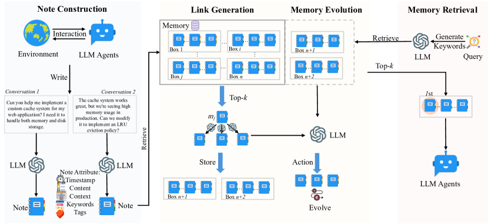

# A-Mem: Agentic Memory for LLM Agents（Xu et al., 2025）

> 原典: [[translations/2025-a-mem]] ・ `raw/papers/A-Mem_ Agentic Memory for LLM Agents.md`
> 著者・年・出典: Wujiang Xu ほか（Rutgers University / Ant Group）・2025・arXiv:2502.12110

## 一言まとめ

エージェントの記憶を「決められた場所に書いて検索で読む」固定構造から解放し、**Zettelkasten（ツェッテルカステン, 原子的なメモを相互リンクさせて知識網を育てるノート術）に倣って、記憶自身が属性を持ち・リンクを張り・後から書き換わる**——という動的な記憶システム A-Mem を提案した論文。新しい記憶の到着が既存記憶の更新（memory evolution）をトリガーする設計により、長期会話ベンチマーク LoCoMo の multi-hop 質問で既存手法の 2 倍超の性能を、**MemGPT の約 1/10 のトークン消費**で達成した。

## 背景と問題意識

エージェントの記憶システム（→ [[agent-memory]]）は、これまで**開発者が構造と操作を事前に決める**設計だった。どこに何を保存し、いつ検索するかはワークフローに固定され、MemGPT（[[summaries/2023-memgpt]]）の階層構造も、グラフ DB を使う Mem0 のスキーマも、この「事前定義」の枠内にある。固定構造は予測可能で運用しやすい反面、**新しい種類の知識に出会ったとき、既存の枠に押し込むことしかできない**——エージェントが新奇な数学の解法を学んでも、事前設定された分類とリンクの中でしか整理できない。

著者らの答えは、人間の知識管理法である Zettelkasten の移植である: 知識を**原子的なノート**に分け、ノート間に**柔軟なリンク**を張り、ネットワークを**有機的に育てる**。この「育てる」判断を LLM（Large Language Model, 大規模言語モデル）自身にやらせるのが agentic memory の意味であり、記憶の**保存・組織化の側に agency（エージェント性）を持ち込む**点で、検索の側に agency を持ち込む agentic RAG（いつ・何を検索するかをモデルが決める）と区別される——この境界の整理自体が本論文の概念的な貢献のひとつ（→ [[retrieval-augmented-generation]]）。

## 提案手法 / 主張

<figure>

<figcaption>図2（再掲）: A-Mem のアーキテクチャ。ノート構築（属性付きノート化）→ リンク生成（top-k 検索 + LLM の接続判断）→ 記憶進化（近傍記憶の書き換え）→ 記憶検索（キーワード分解 + top-k）。関連する記憶は「box」として緩やかに束ねられ、1 つの記憶が複数の box に同時に属せる。</figcaption>
</figure>

パイプラインは 4 段で、すべて LLM の判断＋埋め込み検索の組み合わせで動く:

1. **ノート構築（Note Construction）**: 相互作用ごとに、原文 $c_i$・タイムスタンプ $t_i$ に加えて、LLM が生成する**キーワード $K_i$・タグ $G_i$・文脈的説明 $X_i$** を持つ構造化ノートを作る。全テキストを連結して埋め込みベクトル $e_i$ も計算する（エンコーダは all-MiniLM-L6-v2）。Zettelkasten の**原子性**（1 ノート = 1 知識単位）に従う。
2. **リンク生成（Link Generation）**: 新ノートの埋め込みで既存記憶を top-k 検索し（粗いフィルタ）、その候補に対して **LLM が「接続すべきか」を判断**してリンク集合 $L_i$ を更新する（細かい判断）。埋め込み類似度だけでは見えない因果関係・概念的つながりを LLM が拾う、という分業。
3. **記憶進化（Memory Evolution）**: ここが最大の新規性。新ノートの到着を引き金に、**近傍の既存記憶の文脈・キーワード・タグを LLM が書き換える**。記憶は書いたら終わりではなく、後から来た経験によって「高次のパターン」へ再解釈され続ける。
4. **検索（Retrieval）**: クエリを同じエンコーダで埋め込み、コサイン類似度の top-k をプロンプトに注入する（k は基本 10、GPT 系では 40〜50）。

MemGPT との対比で言えば、MemGPT が「**どこに置くか**」（階層間のページング）を自己管理するのに対し、A-Mem は「**どう意味づけ、どう繋ぐか**」（ノートの属性とリンク構造）を自己管理する。付録 C に 3 つのプロンプトテンプレート（$P_{s1}$〜$P_{s3}$）が公開されており、記憶進化の実装は「strengthen / update_neighbor を JSON で返させる」だけの簡潔なものである。

## 実験結果と知見

- **ベンチマーク**: LoCoMo（最大 35 セッション・平均 9K トークンの長期会話、7,512 QA ペア。single-hop / multi-hop / temporal / open-domain / adversarial の 5 カテゴリ）。6 つの基盤モデル（GPT-4o/4o-mini, Qwen2.5-1.5b/3b, Llama3.2-1b/3b）× 6 指標で、全履歴注入（LoCoMo）・ReadAgent・MemoryBank・MemGPT と比較。
- **multi-hop で圧勝**: GPT-4o-mini で F1 45.85 vs MemGPT 25.52・全履歴 18.41（2 倍超）。セッションをまたいで情報を繋ぐ問題で、リンク構造が効く。非 GPT の小型モデルでは全カテゴリで全ベースラインを上回り、平均ランキング 1.0〜1.2。
- **トークン効率**: 1 問あたり**約 1,200〜2,500 トークン**。全履歴を注入する LoCoMo 方式や MemGPT の**約 16,900 トークンの 1/7〜1/14**で上記性能を出す——「賢く選んで少しだけ入れる」方が「全部入れる」より強い、という [[context-engineering]] 的な実証。
- **アブレーション**: リンク生成と記憶進化を両方外すと大幅劣化（Single Hop F1 27.02 → 9.65）。リンク生成が土台で、記憶進化がそれをさらに引き上げる（w/o ME 21.35 → full 27.02）補完関係。
- **k の逓減**: 検索数 k を増やすと性能は上がるが頭打ちになり、時に低下する——文脈の豊かさとノイズのトレードオフ（[[retrieval-augmented-generation]] の「文書数を増やせば単調に良くなるとは限らない」と同型）。
- **t-SNE 可視化**: A-Mem の記憶埋め込みはベースラインより明確なクラスタを形成し、進化・リンク機構が構造を作っていることを視覚的にも確認。

## 限界・批判的視点

- **評価が長期会話 QA に限られる**: LoCoMo は「過去の会話を思い出して答える」タスクであり、エージェントの作業記憶（計画・成果物・ツール履歴）への一般化は未検証。[[summaries/2025-multi-agent-research-system]] が扱う本番運用の記憶（計画の永続化・フェーズ要約）とは記憶の種類が異なる。
- **記憶進化の危うさ**: 既存記憶を LLM が書き換える設計は、再解釈による整理と引き換えに、**誤った書き換えで過去が静かに改変される**リスクを持つ（原典も「組織化の品質は基盤 LLM の能力に依存する」と自認）。進化の監査・巻き戻しの仕組みは論文の範囲外で、[[agent-memory]] の「忘却と監査」の論点がそのまま当てはまる。書き換えのたびに LLM 呼び出しが走る**書き込みコスト**も、読み出しトークンの節約と別勘定で評価が要る（原典は書き込み側のコストを報告していない）。
- **ベースラインの公平性**: MemGPT のトークン長 16,900 は「全履歴を保持し続けた」設定の数字であり、MemGPT 本来の要約・退避機構をどこまで活かした比較かは読み取れない。ランキング太字の位置づけ（GPT 系の Open Domain / Adversarial では全履歴や MemGPT が勝つ）も、A-Mem が万能ではないことを示す。
- **プロンプト依存の再現性**: 中核の 3 プロンプトは公開されているが、記憶進化の挙動（strengthen / merge / prune の判断）はモデルとプロンプトの書き方に敏感で、異なる LLM では異なる記憶網に育つ。

## 実装・運用上の示唆

- **保存時に意味づけを済ませる**: 生ログをそのまま溜めず、書き込み時に LLM でキーワード・タグ・文脈説明を付与しておくと、検索が「原文の字面一致」から「意味の一致」に変わる。埋め込みは属性込みの連結テキストから作るのがミソ。
- **粗い検索 + 細かい LLM 判断の 2 段構え**: 全記憶を LLM に見せるのは高価すぎ、埋め込みだけでは接続の質が低い。top-k で絞ってから LLM に判断させる分業は、リンク生成に限らず記憶操作全般の基本形。
- **記憶の書き換えは強力だが、履歴の完全保存とセットで**: MemGPT の recall storage のような「元データは消さない」保険なしに進化型記憶を運用するのは危険。
- **top-k は小さく始める**: k=10 で小型モデルは SOTA に達しており、増やす前に「注入した記憶が本当に読まれているか」を疑う方が先。

## 用語と略称

- **agentic memory**（エージェント的メモリ, 記憶の保存・組織化・進化の判断を LLM 自身が行う記憶システム）
- **Zettelkasten**（ツェッテルカステン, 原子的なメモと相互リンクで知識網を育てるニクラス・ルーマン由来のノート術）
- **note construction / link generation / memory evolution**（ノート構築／リンク生成／記憶進化——A-Mem の 3 つの中核操作）
- **LLM** = Large Language Model（大規模言語モデル）
- **RAG** = Retrieval-Augmented Generation（検索拡張生成）／ **agentic RAG**(いつ・何を検索するかをモデルが決める検索側の自律化)
- **LoCoMo**（最大 35 セッションの長期会話ベンチマーク。multi-hop・temporal 等 5 カテゴリ）
- **multi-hop**（複数の情報源をまたいで繋がないと答えられない質問形式）
- **F1 / BLEU-1 / ROUGE-L / ROUGE-2 / METEOR / SBERT Similarity**（QA 評価指標: 精度と再現率の調和平均／ユニグラム精度／最長共通部分列／バイグラム重複／同義語考慮の整列／文埋め込みのコサイン類似度）
- **t-SNE**（高次元埋め込みを 2 次元に可視化する次元削減法）
- **top-k 検索**（類似度上位 k 件のみを取り出す検索方式）
- **MemGPT / MemoryBank / ReadAgent**（比較対象の記憶システム: OS 型階層記憶／忘却曲線ベース更新／ページ要約と参照）

## 関連ページ

- [[agent-memory]] — A-Mem が代表手法として詳述される概念ページ。MemGPT（配置の自己管理）との対比
- [[retrieval-augmented-generation]] — agentic RAG（検索の自律化）と agentic memory（保存・進化の自律化）の境界
- [[context-engineering]] — 「全部入れる 16,900 トークン vs 選んで入れる 1,200 トークン」の実証
- [[summaries/2023-memgpt]] — 直接の先行・比較対象となった OS 型階層記憶
- [[summaries/2025-multi-agent-research-system]] — 本番運用側の記憶パターン（計画永続化・フェーズ要約）との相補
