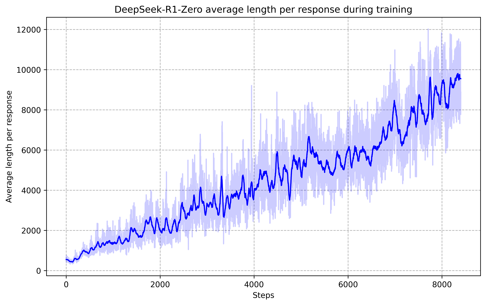

# DeepSeek-R1: Incentivizing Reasoning Capability in LLMs via Reinforcement Learning

> 原典: [[translations/2025-deepseek-r1]] ・ `raw/papers/DeepSeek-R1_ Incentivizing Reasoning Capability in LLMs via Reinforcement Learning.md`（ar5iv クリップ, arXiv:2501.12948）
> 著者・年: DeepSeek-AI・2025

## 一言まとめ

**「教えるな、報酬を与えよ」**。SFT（教師ありファインチューニング）を一切挟まず、ベースモデルに**正誤と書式だけのルールベース報酬で大規模強化学習（RLVR）**をかけると、長い思考・自己検証・reflection が**誰にも教えられずに創発**することを示した論文（DeepSeek-R1-Zero）。AIME 2024 は 15.6% → 71.0% に跳ね、o1 に匹敵する推論モデルが**オープンな手順で作れる**ことを初めて公開実証した。wiki の推論系譜で言えば、CoT（プロンプトで思考を引き出す）→ Reflexion（プロンプトで反省を組み込む）→ **R1（報酬から思考も反省も育てる）**という段の切り替わりにあたる。

## 背景と問題意識

OpenAI o1（2024）は「推論過程を長くする推論時スケーリング」で数学・コードの成績を劇的に上げたが、**作り方は非公開**だった。コミュニティはプロセス報酬モデル（PRM）・MCTS などで再現を試みたが、いずれも届かず。また従来の常識では、RL の前に大量の教師あり推論データ（人が書いた CoT）が必要とされていた——その収集コストが最大のボトルネックだった。本論文の問いは単純で過激:「**教師データなしで、報酬だけで推論は育つか？**」

## 提案手法

### R1-Zero: 純粋 RL

- **ベース**: DeepSeek-V3-Base（MoE, 総 671B・活性 37B）
- **アルゴリズム**: **GRPO**（Group Relative Policy Optimization）——価値関数（critic）モデルを持たず、同じ質問に対する G 個のサンプル群の**報酬の平均・標準偏差から advantage を計算**する。critic が方策と同サイズになる PPO 系のコスト問題を回避。**[[summaries/2026-sakana-fugu]] の Fugu-Ultra が使うのと同じ目的関数**であり、wiki 内で「モデルの推論を育てる側」と「オーケストレーションを育てる側」が同じ道具で繋がる。
- **報酬**: ルールベース 2 種のみ——正確性（数学は boxed 回答の照合、コードはテスト実行）＋書式（`<think></think>` に思考を入れる）。**ニューラル報酬モデルは意図的に不採用**——大規模 RL では reward hacking（報酬モデルの穴を突く学習）に陥るから。
- **テンプレートも極小**: 「まず考えてから答えよ」という構造だけ指定し、**内省の義務づけや解法の推奨は一切書かない**——創発を汚さないための設計。

### 創発した現象

<figure>

<figcaption>図3（再掲）: 訓練中の平均応答長。約 500 トークンから 1 万トークン超まで、外部から一切指示されずに単調増加——「難しい問題には長く考える」という test-time compute の使い方を、モデルが報酬から自力で発見した。</figcaption>
</figure>

- **思考長の自然な増加**（上図）と、それに伴う **reflection・代替解法の探索の自発的出現**。
- **「aha moment」**: 中間チェックポイントが数式変形の途中で "**Wait, wait. Wait. That's an aha moment I can flag here.**" と書いて手順の再評価を始めた記録（Table 3）。[[self-reflection]] の挙動——Reflexion がプロンプト工学で外付けしたもの——が、**報酬だけから内生する**ことを示す象徴的な瞬間。

### R1: 実用化の 4 段パイプライン

R1-Zero は可読性が低く言語が混在する（中英混合など）。そこで (1) 数千件の長 CoT で**コールドスタート SFT** → (2) 推論指向 RL（＋言語一貫性報酬。性能は僅かに落ちるが可読性を優先）→ (3) RL チェックポイントから**棄却サンプリング**で 60 万件＋汎用 20 万件の SFT → (4) 全シナリオ RL（推論はルール報酬、汎用は選好報酬モデル。helpfulness は要約のみ・harmlessness は思考含む全体を評価）。

### 蒸留

R1 が生成した 80 万サンプルで Qwen/Llama の 1.5B〜70B を **SFT だけ**でファインチューニング（RL なし）。

## 実験結果と知見

| 指標 | R1-Zero | R1 | 参考 |
| --- | --- | --- | --- |
| AIME 2024 pass@1 | 71.0（cons@64 で 86.7） | **79.8** | o1-1217: 79.2 |
| MATH-500 | 95.9 | **97.3** | o1-1217: 96.4 |
| GPQA Diamond | 73.3 | 71.5 | o1-1217: 75.7 |
| Codeforces rating | 1444 | 2029（人間の 96.3% 超） | o1-1217: 2061 |
| SWE-bench Verified | - | 49.2 | o1-1217: 48.9 |

- **蒸留 > 小型 RL** が明確（Table 6）: 同じ Qwen-32B に対し、1 万ステップの大規模 RL 直当て（47.0）より **R1 からの蒸留（72.6）が圧勝**。「推論パターンの発見には大きなベースモデルが要り、発見済みパターンの転写は安い」——蒸留 7B が GPT-4o を、32B/70B が o1-mini を上回る。
- **失敗談 2 件が実務的に貴重**（§4.2）: **PRM** はステップ定義・中間正誤判定・reward hacking の三重苦でオーバーヘッドに見合わず、**MCTS** はトークン生成の指数的探索空間と細粒度価値モデルの訓練困難で自己改善ループが回らなかった。[[reasoning-and-planning]] の探索系（ToT 的方向）に対する、スケール時の実務的反証。
- **評価プロトコルの教訓**: 長出力の推論モデルは貪欲デコードだと反復が増えて不安定 → temperature 0.6 で k 個サンプリングし pass@1 を平均で推定（→ [[agent-evaluation]]）。
- **few-shot が逆効果**: R1 は few-shot プロンプトで一貫して性能が落ちる。**ゼロショットで問題を直接書け**という推奨は、CoT 論文（[[summaries/2022-chain-of-thought]]）が確立した「8 例示を見せる」作法の世代交代を告げる。
- コスト面: 出力上限 32,768 トークン。思考の長さがそのまま推論コストになる。

## 限界・批判的視点

- **エージェント能力は弱い**と自己申告: function calling・マルチターン・JSON 出力は DeepSeek-V3 に劣り、SWE 系も「RL 訓練データ不足で伸びていない」。**「推論が強い」と「エージェントとして使える」は別物**であり、[[tool-use-and-function-calling]]・[[agent-loop]] の能力は長 CoT と独立に訓練が要ることを示す実例。
- **検証可能な報酬に依存**する枠組みなので、正誤が機械判定できないオープンエンドなタスク（執筆・対話）は結局、選好報酬モデル（RLHF 側）に戻る——RLVR の適用範囲の輪郭がここにある。
- 言語混在・プロンプト敏感性・安全性 RL 後の過剰拒否（中国語 SimpleQA で V3 以下）と、実用の粗さが残る。
- ベンチマーク比較の一部（o1-1217）は API アクセス困難のため**公式報告値の引き写し**。汚染への言及もない（AIME 2024・LiveCodeBench の期間指定である程度緩和されてはいる）。
- 「aha moment」の解釈には注意——擬人的な語りの出現は事実だが、それが人間的な「気づき」かはこの論文の射程外。CoT の忠実性問題（[[summaries/2022-chain-of-thought]] の限界節）は思考が RL 由来になっても消えない。

## 実装・運用上の示唆

- **検証器が書ける領域なら RLVR が最強の教師**: テスト・照合器・コンパイラがあるタスク（数学・コード）では、人手の CoT アノテーションより「正誤報酬＋GRPO」が安くて強い。逆に言えば、**検証器の設計＝訓練設計**である。
- **reward hacking 回避の第一手はルールベース報酬**。ニューラル報酬モデルは便利だがスケールさせると突かれる——[[agent-evaluation]] の「judge の信頼性を先に検証せよ」と同根の教訓。
- **小型モデルが欲しければ蒸留**。RL を小型に直当てするのは計算の無駄になりやすい。
- 推論モデルを使う側の作法: **few-shot をやめ、ゼロショットで問題と出力形式を直接書く**。

## 用語と略称

- **RLVR** = Reinforcement Learning with Verifiable Rewards（正誤を機械判定できる報酬による強化学習。本論文が代表例）
- **SFT** = Supervised Fine-Tuning（教師ありファインチューニング）
- **GRPO** = Group Relative Policy Optimization（critic なしでグループ内相対報酬から advantage を作る RL。DeepSeekMath 由来）
- **PPO / critic** = Proximal Policy Optimization／価値推定モデル（GRPO が排した従来部品）
- **PRM** = Process Reward Model（推論の途中ステップに報酬を与えるモデル。本論文では不採用）
- **MCTS** = Monte Carlo Tree Search（モンテカルロ木探索）
- **reward hacking** = 報酬関数の欠陥を突いて見かけの報酬だけ最大化する現象
- **コールドスタート** = RL 開始前に少量データで初期化する SFT
- **棄却サンプリング（rejection sampling）** = 複数生成から正解のみ残してデータ化する手法
- **蒸留（distillation）** = 大モデルの出力で小モデルを訓練すること
- **cons@64** = 64 サンプルの多数決による正答率（CoT-SC と同じ発想）
- **MoE** = Mixture of Experts（入力ごとに一部の専門家サブネットだけ使う構造。V3/R1 は総 671B・活性 37B）
- **AIME / MATH-500 / GPQA / LiveCodeBench / Codeforces / SWE-bench Verified / Aider** = 数学競技・数学・院試科学・競技プログラミング×2・実リポジトリ修正・コード編集のベンチマーク
- **o1 / QwQ** = OpenAI と Qwen の推論モデル（比較対象）

## 関連ページ

- [[reinforcement-learning-from-human-feedback]] — 本原典が主要根拠となる概念ページ（RLHF/RLVR/GRPO）
- [[reasoning-and-planning]] — 長 CoT の獲得経路がプロンプトから報酬へ移った転換点。PRM/MCTS の失敗談も
- [[self-reflection]] — reflection の創発（外付け → 内生）
- [[agent-evaluation]] — pass@1 推定プロトコル・reward hacking
- [[summaries/2026-sakana-fugu]] — 同じ GRPO でオーケストレーションを訓練した後続
- [[translations/2025-deepseek-r1]] — 全文翻訳
