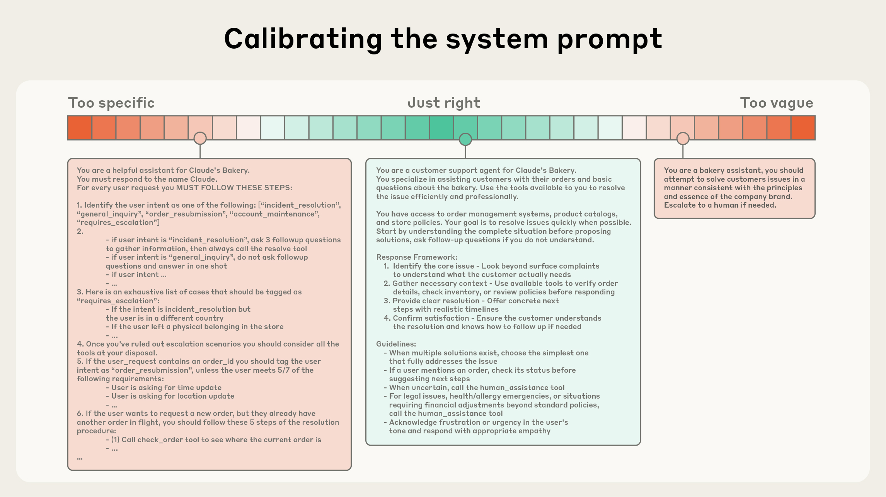

# 効果的なコンテキストエンジニアリング — 注意予算という制約

> 原典: [[translations/2025-effective-context-engineering]] ・ `raw/articles/Effective context engineering for AI agents.md`
> 著者・年・媒体: Anthropic Applied AI チーム（Prithvi Rajasekaran, Ethan Dixon, Carly Ryan, Jeremy Hadfield）/ 2025 年 9 月 29 日 / Anthropic Engineering Blog

## 一言まとめ

**コンテキストエンジニアリング**という営みを、Anthropic が「プロンプトエンジニアリングの自然な発展形」として定式化した記事。中心にあるのは**注意予算（attention budget）**という制約——コンテキストは限界効用が逓減する有限資源なので、良い設計とは「**望ましい結果の尤度を最大化する、可能な限り最小の高信号なトークンの集合を見つけること**」に尽きる、という一本の原理から、システムプロンプト・ツール・例示・取得戦略・長時間タスクの技法までを導く。

## 背景と問題意識

プロンプトエンジニアリングは「指示文の書き方」の技術だった。しかし多ターン・長時間で動くエージェントでは、**システム指示・ツール定義・MCP（Model Context Protocol, ツールやデータソースをモデルに接続する標準プロトコル）経由の外部データ・メッセージ履歴を含むコンテキスト状態の全体**を管理しなければならない。しかも**ループの中で動くエージェントは、次のターンで関連しうるデータを自分で生成し続ける**ので、この管理は一度きりでなく毎推論ごとに発生する。

<figure>

<figcaption>図1（再掲, 原典の 1 枚目）: 左は単一ターンのプロンプトエンジニアリング（システムプロンプト＋ユーザーメッセージ → 応答）。右はエージェントのコンテキストエンジニアリングで、与えうるコンテキストの候補群（複数の Doc・Tool・メモリファイル・包括的な指示・ドメイン知識・履歴）から**精選（Curation）**を経てウィンドウが構成され、出力がツール呼び出しなら実行結果が履歴へ戻って次の精選の入力になる、という循環。</figcaption>
</figure>

本 wiki にとって、この記事は**概念ページ [[context-engineering]] の主題そのものを命名した出典**にあたる。同ページはこれまで、MemGPT・Manus・Anthropic の本番運用報告・ハーネス連作といった派生的な原典から組み上げられていた。また [[summaries/2026-harness-design]] と [[summaries/2026-managed-agents]] の双方がこの記事を参照している。

## 主張 — 注意予算という一本の原理

### なぜ「全部入れる」が効かないのか（機構の説明）

needle-in-a-haystack（干し草の山から針を探す）型のベンチマーク研究が明らかにしたのが **context rot（コンテキストの腐敗）**である——**コンテキスト内のトークン数が増えるほど、そこから正確に想起する能力は低下する**（Chroma の研究）。劣化の緩急はモデルによるが、**すべてのモデルに現れる**。

重要なのは、記事がこれを「そういう現象がある」で終わらせず**アーキテクチャから説明している**点である。

1. **$n^2$ の対関係**: transformer（arXiv:1706.03762）は全トークンが全トークンに注意を向けられるので、$n$ トークンで $n^2$ の対関係が生じる。コンテキスト長が増えるとこの関係を捉える能力が薄く引き伸ばされ、**コンテキストのサイズと注意の集中の間に自然な緊張**が生まれる。
2. **訓練分布の偏り**: モデルは訓練データから注意パターンを獲得するが、そこでは短い系列のほうが一般的である。つまり**コンテキスト全体にわたる依存関係については経験が乏しく、専用のパラメータも少ない**。
3. **位置符号化の内挿**（arXiv:2306.15595）は長い系列を扱えるようにするが、**トークン位置の理解に劣化を伴う**。

結論の言い方が実務的で有用である——これらが生むのは**「明確な崖ではなく性能の勾配」**。長いコンテキストでもモデルは高い能力を保つが、情報検索と長距離推論の精度は相対的に落ちる。ゆえにコンテキストは**限界効用が逓減する有限資源**として扱うべきで、人間の限られたワーキングメモリと同じく LLM にも**注意予算**があり、**新しいトークンはこの予算を消費する**。

### 指導原理

> 望ましい結果の尤度を最大化する、**可能な限り最小の高信号（high-signal）なトークンの集合**を見つけること。

以下はすべてこの原理の各論である。

### コンテキストの解剖学

**システムプロンプト — 「適切な高度（right altitude）」**。2 つの失敗モードの間のゴルディロックス・ゾーンを狙う。一方の極端は、厳密な挙動を引き出そうとして**複雑で脆いロジックをハードコード**すること（脆弱で保守が地獄になる）。もう一方の極端は、**漠然とした高水準の指針**で具体的な信号を与えず、共有文脈があると誤って想定すること。最適解は「挙動を導けるだけ具体的、かつ強いヒューリスティクスを与えられるだけ柔軟」。

<figure>

<figcaption>図2（再掲, 原典の 2 枚目）: システムプロンプトの校正。「Too specific（具体的すぎる）」＝ ユーザー意図を 5 分類して if-else を延々と書き下したもの、「Just right（ちょうどよい）」＝ 役割・利用可能なツール・4 段の応答フレームワーク・判断の指針を簡潔に述べたもの、「Too vague（漠然としすぎ）」＝「ブランドの原則と本質に沿って課題を解決せよ」だけのもの、をスペクトル上に配置している。プロンプト全文は翻訳側に転記した。</figcaption>
</figure>

補足の 2 点も実務的である。プロンプトは `<background_information>` / `<instructions>` / `## Tool guidance` のような節に区切るとよいが、**モデルが高機能になるにつれ書式の重要性は低下しつつある**。そして「最小」は「短い」ではない——**期待する挙動を完全に描き出す最小の情報集合**であって、必要な情報は最初に与える。進め方は「最良のモデルで最小プロンプトから始め、初期テストで見つかった失敗モードに応じて指示と例を足す」。

**ツール — 実行可能な最小集合**。最頻の失敗モードは**ツール集合の肥大化**で、機能が広く重なりすぎると「どれを使うべきか」の判断点が曖昧になる。判定基準が明快で覚えやすい:

> **人間のエンジニアが、ある状況でどのツールを使うべきかを断言できないなら、AI エージェントにそれ以上を期待することはできない。**

**例示 — 網羅ではなく規範**。few-shot は引き続き推奨だが、チームはしばしば**エッジケースの羅列**をプロンプトに詰め込む。推奨されるのは逆で、期待挙動を効果的に描き出す**多様で規範的（canonical）な例の集合**を精選すること。「LLM にとって、例は千の言葉に値する絵である」。

### just-in-time 取得と段階的開示

エージェントの定義について、記事は Simon Willison の簡潔な定義に寄せている——**「LLM がループの中で自律的にツールを使うこと」**。

そのうえで取得戦略の転換を述べる。今日多くのアプリは**埋め込みベースの推論前検索**で重要なコンテキストを先に集めるが、エージェント的アプローチへの移行につれ、これを「**just in time（ジャストインタイム）**」戦略で補強する例が増えている。関連データを事前処理するのでなく、**軽量な識別子（ファイルパス・保存済みクエリ・Web リンク）だけを保持し、実行時にツールで動的に読み込む**。Claude Code は大規模データベースの分析で、的を絞ったクエリを書き、結果を保存し、`head` / `tail` で**全体をコンテキストに載せずに**大量データを扱う。記事の比喩は分かりやすい——人間もコーパス全体を記憶せず、ファイルシステム・受信箱・ブックマークという外部の索引を作って必要時に引く。

2 つの副次的な利点が挙げられる。ひとつは**メタデータが挙動の信号になる**こと: `tests` フォルダの `test_utils.py` と `src/core_logic/` の同名ファイルは目的が違う、階層・命名規約・タイムスタンプがすべて手がかりになる。もうひとつが **progressive disclosure（段階的開示）**——エージェントが探索を通じて関連コンテキストを漸進的に発見し、**理解を層ごとに組み立てながら、ワーキングメモリには必要なものだけを保つ**。

トレードオフも明記されている。**実行時の探索は事前計算された取得より遅い**。さらに、適切なツールとヒューリスティクスがなければ、エージェントはツールを誤用し、行き止まりを追い、鍵となる情報を見落として**コンテキストを浪費する**。

そこで**ハイブリッド**——一部を事前取得し、残りはエージェントの裁量で探索——が現実解になる。Claude Code がその実例で、`CLAUDE.md` は素朴に事前投入する一方、`glob` / `grep` でジャストインタイムに取得することで**陳腐化した索引や複雑な構文木の問題を回避**する。ハイブリッドは法務・財務のように内容の動的さが低い領域により適するとされる。

### 長時間タスクの 3 手法

前提の置き方が重要である——**より大きなコンテキストウィンドウを待つのは策にならない**。当面、あらゆるサイズのウィンドウがコンテキスト汚染と情報の関連性の問題を免れないからである。

**(1) Compaction（圧縮）**。限界に近づいた会話を要約し、その要約で新しいウィンドウを初期化し直す。「第一のレバー」と位置づけられる。Claude Code の実装では、**アーキテクチャ上の決定・未解決のバグ・実装の詳細を保持し、冗長なツール出力やメッセージを破棄**して、圧縮済みコンテキスト＋**直近アクセスした 5 ファイル**で継続する。

チューニングの手順が具体的で、そのまま使える: **複雑なエージェントのトレース上でプロンプトを調整し、まず再現率（recall）を最大化して関連情報を取りこぼさないことを確認してから、余計な内容を削って適合率（precision）を上げる方向へ反復する**。そして「最も安全で最も軽い形の compaction」として挙げられるのが**ツール結果の消去**——「あるツールが履歴の深いところで呼ばれた後、エージェントが生の結果を再び見る必要がなぜあるだろうか」。

**(2) 構造化されたノート取り（structured note-taking）＝ エージェント的記憶**。ウィンドウの外側にノートを永続化し、後で引き戻す。Claude Code の to-do リスト、自作エージェントの `NOTES.md` のような単純なパターンで、**何十回ものツール呼び出しの間に失われるはずのコンテキストと依存関係**を維持できる。

印象的な事例が **Claude によるポケモンのプレイ**である。何千ものゲームステップにわたって「直近 1,234 ステップの間、1 番道路で訓練しており、ピカチュウは目標の 10 レベルに向けて 8 レベル上がった」といった集計を維持する。**記憶の構造については何もプロンプトされていない**のに、探索済み地域の地図・解除した実績・相手別の有効な技といった戦略ノートを自ら作る。コンテキストのリセット後は自分のノートを読んで数時間の作業を継続する。

**(3) サブエージェントのアーキテクチャ**。専門化されたサブエージェントが**きれいなコンテキストウィンドウ**で焦点の絞られたタスクを扱い、メインエージェントは高水準の計画で調整する。数字が有用で、**各サブエージェントは何万トークン以上を使って探索しうるが、返すのは 1,000〜2,000 トークンに蒸留した要約だけ**。詳細な検索コンテキストはサブエージェント内に隔離され、リードは統合と分析に集中する。

**使い分けの基準**も明示されている:

| 手法 | 適する状況 |
| --- | --- |
| Compaction | 広範なやり取りを要し、会話の流れを保ちたいタスク |
| ノート取り | 明確なマイルストーンを伴う反復的な開発 |
| マルチエージェント | 並列の探索が見合うだけの複雑な研究・分析 |

## 限界・批判的視点

- **定量的な結果が一切ない**。ベンチマークもアブレーションも A/B もなく、主張はすべて自社の運用経験と設計判断の記述である。唯一の具体的な数字は「サブエージェントの要約 1,000〜2,000 トークン」「直近 5 ファイル」「ポケモンの 1,234 ステップ」で、いずれも設計値・逸話であって測定結果ではない。**指針として読む価値は高いが、根拠として引くときは「Anthropic の実務経験」以上に強く扱わない**のが安全である。
- **context rot は外部研究への参照**であり、本記事自身の測定ではない（Chroma の研究、本 wiki には未 ingest）。機構の説明（$n^2$・訓練分布・位置内挿）も定性的で、どの要因がどれだけ効くかは示されない。
- **記事自身が「この助言は陳腐化する」と書いている**。「より賢いモデルほど規定的なエンジニアリングを必要としなくなる」「エージェント設計は人間による精選を漸進的に減らす方向へ進む」。これは [[summaries/2026-harness-design]] の「ハーネスの部品はモデル能力への仮定である」、[[summaries/2026-managed-agents]] の「仮定は陳腐化する」と同じ主題であり、**この記事の各論（プロンプトの書式、ツールの絞り込み、compaction の必要性）は、後続 2 記事の枠組みで言えば剥がされる候補**にあたる。実際、1 年後の [[summaries/2026-harness-design]] は context anxiety 対策の部品がモデル世代交代で不要になった実例を記録している。
- **compaction の危険性の扱いが Manus より甘い**。記事は「過度に積極的な compaction は、重要性が後で判明する微妙なコンテキストを失わせうる」と述べるに留まるが、[[summaries/2025-manus-context-engineering]] は同じ問題に対し「**どの観測が 10 ステップ後に効くか予測できない以上、圧縮は復元可能（restorable）な形に限定せよ**」——URL やパスを残して本文だけ落とす——という、より鋭い設計規律を出している。「recall を最大化してから precision」という手順は良いが、それでも不可逆であることは変わらない。
- **just-in-time のコストが「遅い」としか言われない**。探索が増えればツール呼び出しとその結果がコンテキストを消費するので、注意予算の観点では**トークンコストも増えうる**はずだが、そこは論じられていない。ハイブリッドの境界をどう決めるかも「タスクに依存する」以上の指針はない。
- **製品導線が混じる**。メモリツールと Claude Developer Platform の機能（ツール結果の消去）への言及は、記述であると同時に宣伝でもある。なお**原典側で「Sonnet 4.5 のローンチ」のリンク先がこの記事自身の URL になっている**（原ページで確認済み。クリップ不良ではない）。

## 実装・運用上の示唆

- **「最小の高信号なトークン集合」を設計の合言葉にする**。判断に迷ったとき、「このトークンは注意予算を払うに値するか」で切れる。
- **ツールの数を絞る判定に、人間基準を使う**。「自分がどのツールを使うか断言できないなら、エージェントにもできない」。ツールセットのレビューにそのまま持ち込める。
- **compaction プロンプトは recall → precision の順で調整する**。いきなり簡潔さを狙うと、後で効く情報を落とす。まず全部拾えていることを確認してから削る。
- **最も安全な圧縮から始める**。ツール結果の消去は情報の意味を壊さずにトークンを大きく減らせる。要約による圧縮はその後。
- **JIT を採るなら、メタデータが読める構造を先に作る**。命名規約・ディレクトリ階層・タイムスタンプが信号として機能するのは、それらが一貫している場合だけである。エージェント向けのリポジトリ整備は、そのままコンテキスト設計になる。
- **サブエージェントは「探索は広く、返却は狭く」で設計する**。数万トークン使って 1,000〜2,000 トークンを返す、という比率が目安になる。返却が長いなら分業の利点が消えている。
- **例示は網羅でなく代表を選ぶ**。エッジケースを足し続けるのは、注意予算を払ってプロンプトを脆くする行為である。

## 用語と略称

- **context engineering（コンテキストエンジニアリング）** = LLM の推論中に、最適なトークン（情報）の集合を精選し維持する戦略の総称。プロンプト以外の経路で入る情報もすべて含む。
- **prompt engineering（プロンプトエンジニアリング）** = 最適な結果を得るために LLM への指示を書き、組み立てる方法。コンテキストエンジニアリングはその発展形と位置づけられる。
- **attention budget（注意予算）** = 大量のコンテキストを解釈するときにモデルが引き出す有限の資源。新しいトークンごとに消費される。
- **context rot（コンテキストの腐敗）** = コンテキスト内のトークン数が増えるほど、そこからの正確な想起能力が低下する現象。
- **needle-in-a-haystack** = 長いコンテキストの中に埋めた特定情報を想起できるかを測るベンチマークの型。
- **right altitude（適切な高度）** = システムプロンプトの具体性の水準。ハードコードされた if-else と漠然とした指針の間のゴルディロックス・ゾーン。
- **just-in-time（ジャストインタイム）取得** = 事前にデータを集めず、軽量な識別子だけ持って実行時にツールで動的に読み込む戦略。
- **progressive disclosure（段階的開示）** = エージェントが探索を通じて関連コンテキストを漸進的に発見していくこと。
- **compaction（圧縮）** = 限界に近づいた会話を要約し、その要約で新しいコンテキストウィンドウを初期化し直す実践。
- **structured note-taking（構造化されたノート取り）／agentic memory** = ウィンドウ外の記憶にノートを永続化し、後で引き戻す技法。
- **context pollution（コンテキストの汚染）** = 無関係・陳腐化した情報がウィンドウに溜まって判断を劣化させること。
- **MCP** = Model Context Protocol（ツールやデータソースをモデルに接続する標準プロトコル）。
- **LLM** = Large Language Model（大規模言語モデル）。
- **recall / precision（再現率／適合率）** = 拾うべきものをどれだけ拾えたか／拾ったもののうちどれだけが妥当か。compaction プロンプトの調整順序に使われる。

## 関連ページ

- [[summaries/2023-lost-in-the-middle]] — context rot として定式化された現象の一次資料（2023, 位置の U 字と reader の飽和）

- [[context-engineering]] — 本ページの主な受け皿。この記事が同ページの主題を命名した出典にあたる
- [[retrieval-augmented-generation]] — 埋め込みによる推論前検索から just-in-time の実行時取得へ、という取得戦略の転換
- [[agent-memory]] — 構造化されたノート取りとメモリツール（ウィンドウ外への永続化）
- [[tool-use-and-function-calling]] — ツール集合の肥大化という最頻の失敗モードと、その判定基準
- [[multi-agent-systems]] — サブエージェントによるコンテキスト隔離と、1,000〜2,000 トークンへの蒸留
- [[coding-agents]] — Claude Code のハイブリッド戦略（CLAUDE.md 事前投入＋glob/grep の JIT）
- [[summaries/2025-manus-context-engineering]] — 同じ問題への製品側の回答。復元可能な圧縮という、より鋭い規律
- [[summaries/2025-multi-agent-research-system]] — サブエージェント分業の本番運用報告
- [[summaries/2026-harness-design]] / [[summaries/2026-managed-agents]] — この記事を参照する後続作。本記事の各論を「陳腐化しうる仮定」として扱う枠組み
- [[summaries/2023-memgpt]] — ウィンドウ外の記憶を階層管理する研究側の原型
