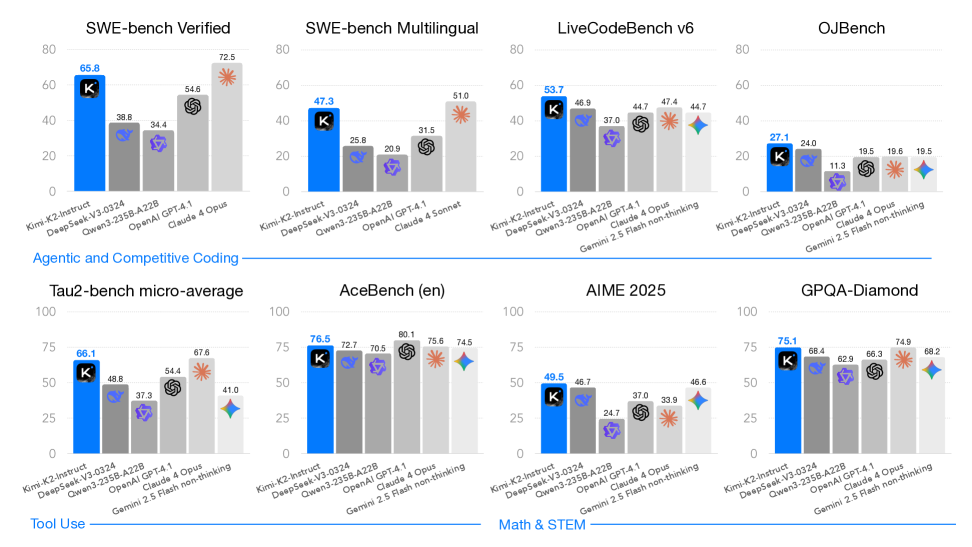
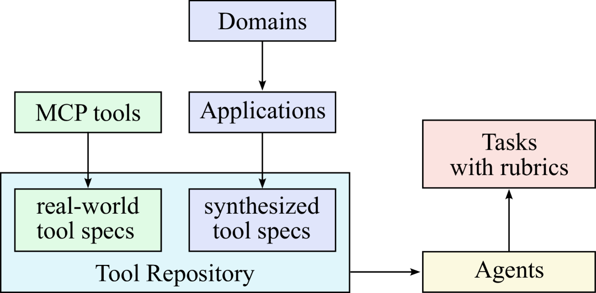

# Kimi K2: Open Agentic Intelligence（Kimi Team, 2025）

> 原典: [[translations/2025-kimi-k2]] ・ `raw/papers/Kimi K2_ Open Agentic Intelligence.md`
> 著者・年・出典: Kimi Team（Moonshot AI）・2025 年 7 月・arXiv:2507.20534

## 一言まとめ

**「エージェント的知能」を明示的な設計目標に据えた**、1.04T パラメータ（活性化 32B）のオープンウェイト MoE モデルのテクニカルレポート。3 本柱は (1) 15.5T トークンを loss spike ゼロで走り切った **MuonClip オプティマイザ**、(2) 2 万超の合成ツール＋3000 超の実 MCP ツールで数万件の tool-use trajectory を作る**大規模エージェント的データ合成パイプライン**、(3) 検証可能報酬の Gym と**自己批評ルーブリック報酬**を統合した joint RL。**非思考（長考なし）のまま** SWE-bench Verified 65.8・τ²-Bench 66.1 を達成し、「エージェント能力は長い CoT ではなくデータと RL の設計で作れる」ことを示した。

## 背景と問題意識

エージェント的能力（多段推論・長期計画・ツール利用）は**自然データにほとんど存在しない**。Web を事前学習してもツール呼び出しの軌跡は学べず、実環境での収集はコスト・プライバシー・スケールの壁がある。一方、事前学習側では高品質データの枯渇により「トークンあたりの学習信号（トークン効率）」が新しいスケーリング係数になりつつある。K2 はこの両面——**事前学習のトークン効率**と**事後学習のエージェント的データ不足**——を、オプティマイザ・データ合成・RL 設計の 3 点で同時に攻める。R1（[[summaries/2025-deepseek-r1]]）が「長考の創発」で推論を解いたのに対し、K2 は**思考を伸ばさずに**エージェント能力を仕込む対照的な設計である。

<figure>

<figcaption>図1（再掲）: Kimi K2 の主要結果。全モデル非思考設定での比較。エージェント系（SWE-bench・Tau2・ACEBench）でオープンソース首位、Claude 4 に肉薄。</figcaption>
</figure>

## 提案手法 / 主張

### 事前学習 — トークン効率のためのスタック

- **MuonClip**: トークン効率の高い Muon オプティマイザは attention ロジット爆発（>1000）を起こしやすい。**QK-Clip**——ヘッドごとの max logit が閾値 τ を超えたら query/key の射影重みを更新後に再スケール——で抑え、15.5T トークンを **loss spike ゼロ**で完走。QK-Clip は必要なときだけ働き（初期 70k ステップで 12.7% のヘッドが発火）、安定後は自己不活性化する（付録 D/E に品質無劣化の検証と Muon が爆発しやすい理由の SVD 分析）。
- **言い換え（rephrasing）による合成データ**: 高品質テキストを多エポック反復する代わりに、**スタイル・視点を変えて言い換えたものを 1 回ずつ学ぶ**（10 回言い換え×1 エポック > 原文×10 エポック、SimpleQA 23.76→28.94）。数学は「学習ノート」スタイルへ書き直し。
- **アーキテクチャ**: DeepSeek-V3 系の MLA + 超疎 MoE。**スパース性スケーリング則**（FLOPs 固定で総エキスパートを増やすほど loss が下がる）に基づき 384 エキスパート・スパース性 48 を採用。**attention ヘッドは 128→64 に半減**——128k 系列で推論 FLOPs +83% に対し検証 loss 改善は 0.5〜1.2% しかないため。**エージェント用途の長コンテキスト推論効率を優先してアーキテクチャを決めた**という点が重要（→ [[transformer-architecture]]・[[llm-inference-optimization]]）。

### 事後学習 (1) — エージェント的データ合成パイプライン

<figure>

<figcaption>図8(a)（再掲）: ツール仕様（実 MCP ツール＋ドメイン進化による合成ツール）→ エージェント → ルーブリック付きタスクの合成フロー。</figcaption>
</figure>

ツール利用を教えるための合成は 3 段: **ツール仕様**（GitHub から実 MCP ツール 3000+ を取得＋ドメイン階層の進化で合成ツール 20,000+ を生成。t-SNE で相補的なカバレッジを確認）→ **エージェントとタスク**（システムプロンプト×ツールの組み合わせで数千のエージェント、各タスクに**成功基準を規定するルーブリック**を付与）→ **多ターン trajectory**（LLM ユーザーペルソナ＋**状態を保持するツールシミュレータ**（≒world model）が成功・部分失敗・エッジケースを確率的に生成）。LLM ジャッジがルーブリックで採点し合格 trajectory だけを残す＝**大規模な棄却サンプリング**。コーディング等の真正性が重要な領域は**実行サンドボックス**（Kubernetes 上で 1 万超の並行インスタンス、テスト合格率が ground truth）で補完するハイブリッド。

### 事後学習 (2) — 検証可能報酬 + 自己批評ルーブリック報酬の joint RL

- **Verifiable Rewards Gym**: 数学/STEM/論理（適度な難易度を SFT モデルの pass@k で選別）・複雑な指示追従（コード検証＋LLM ジャッジ＋**虚偽の遵守主張を検出する hack-check 層**）・忠実性（文レベルの忠実性ジャッジ）・コーディング（GitHub の PR/issue から実行可能環境を構築）・安全性（攻撃/対象/ジャッジの 3 モデルによる jailbreak 進化）。
- **Self-Critique Rubric Reward**: 検証できないオープンエンド領域では、**K2 自身が critic となり、ルーブリック（コア価値＋reward hacking 排除の規範＋人間注釈）に照らしてペアワイズ評価**する。鍵は**閉ループ**——critic は RLVR の検証可能な信号で継続的に更新され、客観的な性能が主観的判断へ蒸留される。「検証可能なタスクで鍛えた評価力を、検証不能なタスクの報酬に転移する」設計。
- **RL アルゴリズムの追加 3 点**: **予算制御**（タスク種別ごとの最大トークン予算、超過は切り詰め＋ペナルティ——overthinking への訓練時対策）、**PTX loss**（高品質データの忘却防止）、**温度減衰**（探索→活用）。
- **RL インフラ**: 訓練/推論エンジン同居、checkpoint engine による **1T モデルのパラメータ更新 30 秒未満**、長い trajectory を止める partial rollout、Gym 風統一インターフェース。

## 実験結果と知見

| 領域 | スコア（非思考） | 比較 |
| --- | --- | --- |
| SWE-bench Verified | **65.8**（複数試行 71.6） | Claude 4 Sonnet 複数試行 80.2 に肉薄、オープン首位 |
| SWE-bench Multilingual | **47.3** | Claude 4 Sonnet 51.0 |
| τ²-Bench | **66.1** | DeepSeek-V3 48.8 / Qwen3 37.3 |
| ACEBench (En) | **76.5** | GPT-4.1 80.1 に接近 |
| LiveCodeBench v6 / OJBench | 53.7 / 27.1 | 全モデル首位 |
| AIME 2025 / GPQA-Diamond | 49.5 / 75.1 | 非思考ベースライン中最良 |
| LMSYS Arena | オープンソース 1 位・全体 5 位 | 3,000+ ブラインド投票 |

**実務コストの読みどころ**: すべて**非思考・出力 8192 トークン上限**（SWE-bench Agentless のみ 16384）での数字であり、推論モデルの長考コストなしにこの水準に達している。TerminalBench はハーネス依存が顕著（Terminus 25.0 → 社内フレームワーク 30.0）で、[[agent-evaluation]] の「ハーネス差がスコアを左右する」の追加実例。

## 限界・批判的視点

- **自己申告のテクニカルレポート**: 比較は自社実施だが、ベースラインを統一的に非思考モードで再評価している点は良心的（\* 付きは公表値の転記と明示）。それでも [[agent-evaluation]] の provider-reported の留保は適用される。
- **原典自身が認める弱点**: 難しい推論や曖昧なツール定義で**過剰トークン生成**（切り詰め・不完全なツール呼び出し）、不要なツール有効化での性能低下、ワンショットでのソフトウェア構築はエージェントフレームワーク併用より弱い。
- **自己批評報酬の危うさ**: critic を RLVR 信号で接地する設計は巧妙だが、モデルが自分の出力を評価する構図は原理的に reward hacking と相性が悪い（規範的ルーブリックで対処しているのは自覚の証左）。付録 F.3 は**率直な自己開示**として貴重——ヘッジ表現の禁止と決定的な回答への選好が、**曖昧な場面でも過剰に自信のある応答を生む**副作用を明記している。[[summaries/2025-cot-faithfulness]] の「確信的な不忠実」と併せて読むべき論点。
- **シミュレータの忠実度**: 合成 trajectory の大半は LLM シミュレータ産で、実世界の分布とのギャップは実行サンドボックスでの補完に依存する。シミュレータ自体の検証は示されていない。

## 実装・運用上の示唆

- **ツール利用は「教材を合成して教える」もの**: MCP の実ツール仕様を種に、ドメイン進化で合成ツールを増やし、ルーブリック付きタスク＋シミュレータ＋ジャッジで棄却サンプリングする——tool-use 能力を上げたいときの再現可能なレシピ（→ [[tool-use-and-function-calling]]）。
- **ツール宣言は TypeScript が短い**: JSON スキーマより簡潔にツールの型と制約を表現でき、トークンも節約になる（付録 B）。**enforcer**（制約付きデコーディング）でツール呼び出しの書式エラーを構造的に防ぐのも実装の定跡。
- **トークン予算を報酬に入れる**: RL 中の最大トークン予算＋超過ペナルティは、overthinking への訓練時対策として簡潔で効く（→ [[test-time-compute]] の適応的配分の訓練版）。
- **評価は非思考で揃える**: テスト時計算の利得を分離するため全モデルを非思考モードで統一する K2 の評価プロトコルは、モデル比較の設計として参考になる。

## 用語と略称

- **MoE** = Mixture-of-Experts（トークンごとに一部のエキスパートのみ活性化する疎な構造）／ **MLA** = Multi-head Latent Attention（潜在圧縮つき attention）
- **Muon / MuonClip / QK-Clip**（トークン効率の高いオプティマイザ／QK-Clip を統合した改良版／attention ロジット爆発を防ぐ重み再スケール機構）
- **loss spike**（訓練 loss の突発的な跳ね。不安定性の兆候）／ **スパース性**（総エキスパート数 ÷ 活性化エキスパート数）
- **トークン効率**（トークンあたりの学習信号。データ枯渇時代のスケーリング係数）／ **rephrasing**（言い換えによるデータ増強）
- **MCP** = Model Context Protocol（ツール接続の標準プロトコル。実ツール仕様の供給源として利用）
- **RLVR** = Reinforcement Learning with Verifiable Rewards（検証可能報酬の強化学習）／ **Self-Critique Rubric Reward**（モデル自身がルーブリックで自己出力をペアワイズ評価する報酬）
- **PTX loss**（高品質データの忘却を防ぐ補助損失）／ **partial rollout**（長い trajectory を一時停止し次反復で再開する技法）
- **checkpoint engine**（訓練→推論エンジンへのパラメータ再シャーディングを担う分散コンポーネント）
- **enforcer**（ツール呼び出しの書式をスキーマに強制する制約付きデコーディング）
- **non-thinking**（非思考。長い思考連鎖を出力しない設定）／ **Avg@k / Pass@k / best-of-N**（評価指標）
- **τ²-Bench / ACEBench / SWE-bench / TerminalBench / PaperBench**（エージェント・SWE 系ベンチマーク）
- **WSD / YaRN**（学習率スケジュール／コンテキスト拡張手法）／ **PP / EP / ZeRO-1**（パイプライン／エキスパート／データ並列）
- **LLM** = Large Language Model（大規模言語モデル）

## 関連ページ

- [[tool-use-and-function-calling]] — エージェント的データ合成・TypeScript ツール宣言・enforcer の根拠原典
- [[reinforcement-learning-from-human-feedback]] — RLVR Gym＋自己批評ルーブリックの joint RL・閉ループ critic
- [[transformer-architecture]] — スパース性スケーリング則・エージェント推論効率優先のヘッド数決定
- [[test-time-compute]] — 非思考でのエージェント SOTA・予算制御という対照的な設計点
- [[agent-evaluation]] — 非思考統一プロトコル・ハーネス差の実例
- [[summaries/2025-deepseek-r1]] — 長考の創発（R1）vs 非思考のエージェント化（K2）という対
- [[summaries/2026-gpt2-to-kimi3]] — K2 の後継 K3 を含むアーキテクチャ系譜の解説
