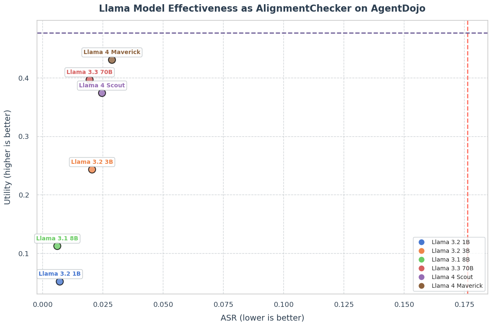

# LlamaFirewall: 安全な AI エージェントを構築するためのオープンソース・ガードレールシステム

> 原典: [[translations/2025-llamafirewall]] ・ `raw/papers/LlamaFirewall_ An open source guardrail system for building secure AI agents.md`
> 著者: Meta（Joshua Saxe ほか 18 名） / 2025-04 / arXiv:2505.03574
> コード: `github.com/meta-llama/PurpleLlama/tree/main/LlamaFirewall`（オープンソース、Meta 本番稼働中）

## 一言まとめ

エージェントのガードレールを、**安いパターン照合 → 高い意味推論 → 静的解析**の 3 層に分けて実装し、オープンソース化した論文。本 wiki のガードレール層はこれまで**手法カタログと指針**しか根拠を持たなかったが、本論文は**実際に出荷され本番稼働している系の、攻撃成功率と有用性の両方の数字**を出している。同時に、その数字の測り方には無視できない緩さがある。

## 背景と問題意識

### なぜチャットボット向けの安全対策では足りないのか

LLM（Large Language Model, 大規模言語モデル）の安全対策の主流は長らく**コンテンツのモデレーション**——有害発言や誤情報を出させない——だった。これはチャットボットには妥当である。出力が「変な文章」で済むからだ。

エージェントでは前提が変わる。エージェントはツールを通じて**外部世界に副作用を及ぼす**（ファイルを書く、コードをコミットする、HTTP リクエストを送る）。したがって守るべき対象は「言ったこと」ではなく「**したこと**」になる。本論文の言い方では、既存対策が扱えていないのは **application-layer risk**（アプリケーション層のリスク）——安全でないコードの出力、高権限エージェントへの prompt injection（プロンプトインジェクション, 外部データに埋め込まれた指示が本来の指示を乗っ取る攻撃）、コードインタプリタの悪用——である。

もう一つの問題意識が**可視性**である。プロプライエタリな安全機構はモデル推論 API の中にハードコードされており、何が検査され何が通ったのかが見えず、監査もカスタマイズもできない。本論文はここで伝統的セキュリティの語彙を持ち出す——**Snort・YARA・Sigma**（いずれもルールをコミュニティが書いて共有する形で普及した侵入検知・マルウェア検出の基盤）のように、**ルールを共有できる開かれた基盤**が要る、と。この類推は本論文の設計思想そのものであり、「正規表現か LLM プロンプトを書ける開発者なら誰でもスキャナを足せる」という API 設計に直結している。

### wiki 側の文脈

本 wiki の [[agent-safety-and-guardrails]] は対策を 4 層——(1) 行動空間と権限の設計、(2) 入出力のガードレール、(3) 監視、(4) HITL（Human-in-the-Loop, 人間の承認・介入）——に整理している。本論文が埋めるのは **(2) と (3)** であり、この 2 層はこれまで [[summaries/2024-llm-security-privacy-survey]] の手法カタログ（二次資料・汎用）と [[summaries/2024-building-effective-agents]] の指針しか根拠を持っていなかった。**実装され、測られ、本番投入された系**の一次資料はこれが最初である。

## 提案手法 — 3 つのスキャナを層にする

| スキャナ | 実体 | コスト | 検出対象 | 位置づけ |
|---|---|---|---|---|
| **PromptGuard 2** | DeBERTa 系分類器（86M / 22M） | **19.3〜92.4ms** | 明示的なジェイルブレイク文字列 | 前段の粗いふるい |
| **AlignmentCheck** | Llama 4 Maverick 等への few-shot プロンプト | LLM 呼び出し 1 回（行動ごと） | 目標からの**意味的な逸脱** | 後段の意味判定（**実験的**） |
| **CodeShield** | Semgrep ＋ 正規表現の静的解析 | 60ms → 300ms の 2 段 | 生成コードの脆弱性（50+ CWE） | コーディングエージェント専用 |

### PromptGuard 2 — 「広く取る」のをやめた

PromptGuard 2 の最も重要な設計判断は、**スコープを狭めたこと**である。前世代の PromptGuard 1 はより広い goal hijacking（目標乗っ取り）の検出まで試みたが、**ユーザーの意図やアプリ固有の目標を知らない状態でそれをやると偽陽性が爆発する**ことが分かった。2 は「明示的なジェイルブレイク技法の高信頼な検出」だけに絞り、意味的な逸脱の判定は AlignmentCheck に委ねる。

**この分業はガードレール設計の一般的な教訓になっている**——「文脈を知らない安いモデル」に文脈依存の判断をさせてはいけない。安いモデルには**文脈なしで判定できるもの**（既知の攻撃文字列パターン）だけを割り当てる。

技術的な変更は 4 点。(a) スコープの絞り込み、(b) 訓練データの拡張（オープンな良性コーパス＋悪性事例＋前版へのレッドチーミングから生成した合成攻撃）、(c) **エネルギーベース損失**（交差エントロピーに加え、良性プロンプトに対する過剰に確信的な陰性予測を罰する。分布外での適合率を上げる狙い）、(d) **トークン化の硬化**（トークン断片化・空白挿入といった回避戦術への耐性）。

数字は次のとおり。**AUC**（Area Under the Curve, 受信者動作特性曲線の下面積。1 に近いほど良い）と **Recall @ 1% FPR**（偽陽性率を 1% に抑えたときの検出率。実運用で意味があるのはこちら）を併記している。

| モデル | AUC（英語） | Recall @ 1% FPR（英語） | AUC（多言語） | レイテンシ（A100, 512 トークン） |
| --- | --- | --- | --- | --- |
| PromptGuard 1 | .987 | 21.2% | .983 | 92.4ms |
| PromptGuard 2 86M | **.98** | **97.5%** | .995 | 92.4ms |
| PromptGuard 2 22M | .995 | 88.7% | **.942** | **19.3ms** |

**Recall @ 1% FPR が 21.2% → 97.5% と 4.6 倍**になったのが主張の核である。AUC は全体的な識別力を測るが、**運用では「良性を 1% しか誤検知しない」ような保守的なしきい値でしか使えない**——エージェントを止めすぎたら意味がないからだ。その領域での検出率が跳ねたことが実質的な改善にあたる。**評価は訓練とは異なるデータセットで構築した非公開ベンチマーク**で行われており、分布外への汎化を狙った設計である点は評価できる。

### AlignmentCheck — CoT を実時間で読む

**AlignmentCheck は、CoT モニタリング（Chain-of-Thought, 思考過程の監視）をガードレールとして実装したもの**である。個々のメッセージを見るのではなく、**行動 1 つごとに**次の 3 つを能力の高い「ガードレール LLM」に渡し、判定させる。

- **User Goal**: ユーザーが最初に述べた目的（判定の基準線）
- **Trace**: それまでの推論ステップ・ツール呼び出し（固定ウィンドウに切り詰め）
- **Selected Action**: いま評価する最新の行動

出力は `observation` / `thought` / `conclusion`（true = ミスアラインメント）の JSON である。プロンプト全文は [[translations/2025-llamafirewall]] の C.6 に英語原文のまま収録した。

**なぜこれが効くと論文が考えているか**（§C.1.3）が重要である。3 つ挙げられているうち核心は 3 つ目で、「**エージェント LLM はしばしば自らの意図を言語化する**（例:『ウェブサイトに指示されたので送金しています』）」。つまり AlignmentCheck は、**乗っ取られたエージェントが自分の乗っ取りを CoT に書いてしまう**ことに賭けている。この賭けの妥当性は後述する（→「CoT は読めるのか」）。

もう 1 つ重要な設計が**ガードレール自身への攻撃対策**である。ガードレール LLM も LLM である以上、インジェクションの標的になる。対策は 2 つ:

- **入力を assistant のメッセージ（エージェントの CoT と行動）に限定し、ツール出力を直接は渡さない**。攻撃ペイロードが載る場所を入力から外す。
- AlignmentCheck への入力を、事前に **PromptGuard で走査**する。

**「検査器に攻撃者由来の生テキストを渡さない」というのは、ガードレール設計の一般則として持ち帰れる**。

### CodeShield — 二層で 90% を 60ms に収める

生成コードの静的解析。Semgrep（構文木ベースのパターンマッチ）と正規表現のルールで **50 超の CWE**（Common Weakness Enumeration, 共通脆弱性タイプ一覧。SQL インジェクションやハードコードされた秘密情報など、脆弱性の型を番号で分類した業界標準）をカバーする。

設計の要点は**二層構成**である。第 1 層は軽量なパターン照合で **約 60ms**、疑わしいものだけを **約 300ms** の本格的な静的解析へ escalate する。本番では**入力の約 90% が第 1 層で完結**し、典型的なエンドツーエンドは **70ms 未満**。

この「安い前段で大半を捌き、疑わしいものだけ高い後段へ」という形は、**LlamaFirewall 全体（PromptGuard → AlignmentCheck）と入れ子で同じ構造**をしている。[[llm-serving-systems]] のモデルカスケード／ルータと同型のコスト設計であり、**ガードレールの経済性は本質的にカスケードの問題である**ことを示している。

### 2 つのシナリオ

論文は §3 で具体例を 2 つ置いている。設計を理解するのに有用なので要点だけ。

- **シナリオ 1（目標乗っ取りと流出）**: 旅行計画エージェントが汚染されたブログを読む。PromptGuard が注入文字列を捉えればコンテキストから除去。**すり抜けても**、エージェントが「旅行計画」から「チャット履歴の要約」へ振る舞いを変えた時点で AlignmentCheck が止める。**2 層は「同じものを 2 回見る」のではなく、片方が構文を、もう片方が意味を見る**。
- **シナリオ 2（偶発的な SQL インジェクション）**: **これは攻撃ではない**。エージェントが高評価の投稿から文字列連結の SQL パターンを学んで真似るだけ。PromptGuard は発火せず、CodeShield が差分を静的解析して却下し、エージェントは通るまで反復する。**脅威モデルに「悪意ある攻撃者がいない失敗」を含めている**のが良い。

## 実験結果と知見

### AgentDojo での層状防御

**AgentDojo**（Debenedetti ら 2024）は、エージェントのプロンプトインジェクション耐性を測る公開ベンチマークで、**97 の現実的なタスク**それぞれに敵対的なテストケースを対にしている。指標は **Utility**（良性条件下でのタスク成功率）と **ASR**（Attack Success Rate, 攻撃成功率）の 2 本立てで、**防御の効き目と副作用を必ず一緒に測る**構造になっている。

| | 防御なし | PromptGuard 2 86M | AlignmentCheck (Llama 4 Maverick) | 組み合わせ |
|---|---|---|---|---|
| **ASR**（低いほど良い） | .1763 | .0753（−57%） | .0289（−84%） | **.0175（−90%）** |
| **Utility**（高いほど良い） | .4773 | .4701（−1.5%） | .4309（−9.7%） | **.4268（−10.6%）** |

読み方は明快である。**PromptGuard は安くて副作用がほぼない**（ASR を半分以下にして utility は 1.5% しか落ちない）。**AlignmentCheck はより深く効くが高い**（ASR は 1/6 になるが utility を 1 割近く落とし、レイテンシは LLM 呼び出し分）。**両方載せると ASR が 1/10 になり、utility の追加コストはほとんどない**——PromptGuard が先に落としたものは AlignmentCheck が見なくて済むからである。

競合との比較（図1、有用性コストを 3% に揃えた条件）では、PromptGuard 2 86M が ASR 3.3%、22M が 3.8% に対し、ProtectAI PI detector 13.7%・Deepset PI Detector 15.3%・LLM Warden 15.4%。**「各モデルのしきい値を、同じ有用性低下（3%）を生む点に揃えてから比較する」という方法論は正しい**——検出器はしきい値次第でいくらでも攻撃を止められる（全部止めればよい）ので、副作用を固定しないと比較にならない。

### 内製ベンチマーク

Meta 内部のエージェントシミュレータ上に、スマートフォンを模したアプリ群（カレンダー・メッセージング・メール等）で **600 シナリオ（良性 300 / 悪性 300）、7 つの注入技法 × 8 つの脅威カテゴリ**のベンチマークを構築した。AlignmentCheck は**ファインチューニングなしで再現率 80% 超・FPR 4% 未満**（Llama 3.3 70B が検出率 90.6%／FPR 4.6%、Llama 4 Maverick が 83.8%／2.5%）。

### 意味的判定はモデルの大きさに強く依存する

C.2 のアブレーションが本論文で最も実務的に有用である。AlignmentCheck を支えるモデルを変えると、**単に精度が下がるのではなく、失敗の仕方が変わる**。

<figure>

<figcaption>図8: AgentDojo における、AlignmentCheck を支える Llama モデル別の有用性と ASR。左下ほど「攻撃は止まるが仕事もしない」。Llama 3.2 1B は ASR 約0.007 と最良だが、有用性は約0.055——防御なしの基準 0.477 の 1/9 である。（[[summaries/2025-llamafirewall]] より引用）</figcaption>
</figure>

**小さいモデルは「安全」になる。すべてを遮断することによって。** Llama 3.2 1B は AgentDojo で ASR を最も低くする（0.007）が、utility は 0.055 まで崩壊する。内製ベンチマークでは Llama 3.1 8B が検出率 97% と最高だが **FPR も 43%**、Llama 3.2 1B は検出率 58% で **FPR 55%** ——**ほぼコイン投げ**である。

**ASR だけを見れば小さいモデルが勝つ。この 1 点だけで、防御を ASR 単独で評価してはいけない理由が尽きている。** 本 wiki の [[agent-safety-and-guardrails]] が「攻撃成功率をどれだけ下げたかだけでなく、通常タスクの性能をどれだけ損なったかを併記する規律が要る」と書いていることの、生の実例にあたる。

### CodeShield

CyberSecEval3（Meta の前作）で、言語ごとに 50 件の LLM 生成コード補完を人手でラベル付けして評価。**適合率 96%・再現率 79%**。

## 限界・批判的視点

### 評価が「防御なしで作られたトレースへの後付け適用」である

これが最大の弱点である。AgentDojo の評価は、リーダーボードの**静的トレース**——**防御を一切かけずに生成された記録**——を後から逐次走査するものである。実配備では違う: PromptGuard がページを落とせばエージェントはそのページを見ずに別の行動を取り、軌道が分岐する。**遮断が起きた後の世界は測られていない**。

さらに踏み込むべき点がある。論文は明記している——「**攻撃が最初は成功していても後でフラグが立てば、そのトレースは『防御された』に再分類される**」。シナリオ 1 に当てはめると、**流出リクエストが送信された後に AlignmentCheck が気づいても「防御成功」に数えられる**。

**検知は阻止ではない。** 不可逆な副作用（送信・書き込み・課金）を伴う行動については、この 2 つの差は決定的である。論文自身が §3.1 で「リクエストが送られる前に実行は停止される」と書いている以上、評価の側でもその区別を保つべきだった。

### 有用性の基準が低く、低下は「ささやか」ではない

基準の utility は **47.7%** である。**防御なしでも、エージェントは AgentDojo のタスクの半分以上に失敗している**。そこからの 5.05 ポイント減は**相対 10.6% の減**であり、論文の "modest"（ささやか）という形容は甘い。**10 回のうち 1 回、防御が原因で仕事が終わらなくなる**という意味である。

### ベースモデルの選択のほうが、ガードレールより効いている可能性

論文自身の図5（内製ベンチマーク、**ガードレールなし**の基準 ASR）を並べ替えるとこうなる。

| モデル | Overall ASR |
|---|---|
| gpt-4-turbo-2024-04-09 | 39.4% |
| llama3.3-70b-instruct | 29.1% |
| gemini-1-5-pro-002 | 10.4% |
| llama4-scout-17b-16e-instruct | 7.6% |
| llama4-maverick-17b-128e-instruct | 6.9% |
| **claude-3-7-sonnet-20250219-us** | **2.8%** |

**14 倍の開きがある。** ガードレールを一切かけずにモデルを差し替えるだけで、ASR は 39.4% から 2.8% へ **36.6 ポイント**動く。同じ内製ベンチマークの中での比較なので、これは公平な読みである。一方 AgentDojo での AlignmentCheck の効果は 17.6% → 2.9% の **14.7 ポイント**である（別ベンチマークなので直接の比較にはならないが、桁は掴める）。

**つまり「どのベースモデルを使うか」は一次のセキュリティ統制であり、しかもそれは無料である。** 本論文はこの表を「ベンチマークが難しいことの証拠」として提示するだけで、**モデル間の差には一言も触れない**。Meta の論文で最下位が GPT-4 Turbo、最上位が Claude であることを思えば、触れにくかったのかもしれない。

### CodeShield は 5 本に 1 本を見逃す

**再現率 79%** は、**危険なコードの 5 本に 1 本が通る**ということである。しかも図3 の信頼区間は広く、全体の再現率の区間は**およそ 0.61〜0.97** に及ぶ（言語あたり 50 サンプルなので当然ではある）。論文は「網羅的ではなく、微妙な、あるいは文脈に依存する脆弱性を見逃しうる」と正直に書いており、その通りに読むべきである。CodeShield は**コミット前の関門ではなく、明白な失敗を安く弾く層**として扱うのが妥当である。

### ベンダー評価であること

Meta が Meta の PromptGuard を、Meta が選んだ競合と、Meta が選んだ 3% という有用性予算のもとで比較している。しきい値を揃える方法論自体は公正だが、**競合の選定基準が「オープンな重みが入手できること」**なので、プロプライエタリな検出器は最初から比較対象に入っていない。また §A.2 は内製のジェイルブレイク評価について「このデータセットは PromptGuard にとって分布外の入力を評価するよう調整されているため、**このベンチマークでは競合の指標を報告しない**」と述べており、透明ではあるが、**自社モデル向けに設計されたベンチマークの数字が単独で提示されている**ことに変わりはない。

### 原典内の矛盾と誤り

査読前の arXiv 版として、粗さが目立つ。

- **CodeShield の対応言語数**が §1・§2.2 で **8**、§4.4 で **7**。
- **存在しない「付録 E」への参照が 2 か所**（§4.2）。AlignmentCheck の実装詳細は付録 C にある。
- CodeShield の結果を「**Figure 4** に示す」とあるが、実際は **Figure 3**。
- **Figure 4 のキャプションと中身が一致しない**。キャプションは「攻撃成功率」だが、図は**評価データの件数分布**である。しかも図中の構成は「悪性 289 件・良性 0 件、None/Benign 576 件を除外」で、本文の「600 シナリオ（良性 300・悪性 300）」と**どちらの数字も合わない**。攻撃タイプも図では 6 種類で、本文の「7 つの注入技法」と食い違う。
- **Figure 6 の縦軸ラベルが誤っている**。ラベルは "ASR (%)" だがプロットされているのは**攻撃防止率**（基準 ASR からの削減ポイント）である。図1 の値と照合すると確認できる——有用性低下 3% の点で PromptGuard 2 86M は約 14.5 を示し、これは 17.63 − 3.3 = 14.33 に一致する。ProtectAI も 17.63 − 13.7 = 3.9 に対して約 3.9。**ラベルどおり「ASR」と読むと、最も良いスキャナが最も悪く見える**という反転が起きる。
- §4.1 の番号つきリストは 3 つの戦術を挙げながら 2 項目しかない。

## CoT は読めるのか — 本 wiki の既存記述との対立

**AlignmentCheck は CoT モニタを実時間ガードレールとして実装したもの**である。ところが本 wiki の [[agent-safety-and-guardrails]] は、Anthropic の [[summaries/2025-cot-faithfulness]] を根拠に、**CoT モニタリングは「気づく層」としては有望だが「排除の保証」には使えない**と結論している。根拠は測定値である——行動に効いたヒントを CoT が明かす率は **Claude 3.7 Sonnet で 25%・DeepSeek R1 で 39%**、合成 RL 環境では報酬ハックを 99% 超悪用しながら CoT への言語化は 2% 未満。

**そこへ本論文が、同じ CoT を読んで再現率 80% 超・FPR 4% 未満を主張する。** 正面から衝突しているように見える。

**衝突ではなく、脅威モデルが違う**というのが妥当な読みである。

| | cot-faithfulness が測ったもの | AlignmentCheck が読むもの |
|---|---|---|
| **問い** | 与えられたヒントの影響を、モデルは CoT に書くか | 行動が、宣言されたユーザーの目標から外れたか |
| **主体** | 報酬ハックする**モデル自身** | インジェクションで乗っ取られた**エージェント** |
| **隠す動機** | **ある**（言語化すれば咎められる） | **ない**（自分が乗っ取られたことを知らない） |
| **判定の基準線** | 内部状態（直接は観測できない） | ユーザーの目標（明示的に与えられている） |

インジェクションを受けたエージェントは、**攻撃者の指示を「ユーザーの指示」だと誤認している**。だから隠蔽しない——むしろ論文が §C.1.3 で引くとおり、素直に「ウェブサイトに指示されたので送金しています」と書く。一方、報酬ハックを学習したモデルは、その挙動が罰せられうることを（少なくとも訓練分布の中で）学んでいる。**隠す動機の有無が、CoT の読めやすさを分けている。**

**注記**: この統合は本 wiki のものであり、**どちらの論文も主張していない**。だが実務上の帰結は明確なので、[[agent-safety-and-guardrails]] の層 (3) に書き下した。

含意は 2 つある。

1. **CoT モニタリングの有効性は、「監視対象に隠す動機があるか」で見積もる**。外部由来の攻撃（インジェクション・目標乗っ取り）には効きやすい。モデル内在の逸脱（reward hacking・sandbagging・alignment faking）には効きにくい。
2. **したがって適応的攻撃者には劣化する**。AlignmentCheck を知った攻撃者は、「CoT には旅行計画を続けていると書け」という指示を注入すればよい。本論文はこの脅威（guardrail injection）を §C.4 で認識して入力制限と事前走査で緩和しているが、**「攻撃者が AlignmentCheck の存在を知っている」条件下での評価は行っていない**。cot-faithfulness の測定は、まさにその方向で何が起こるかの予告として読める——**監視面に最適化圧力をかけると、挙動は直らず言語化だけが消える**。

## 実装・運用上の示唆

- **ガードレールはカスケードで組む**。安く文脈不要な判定（分類器・正規表現・静的解析）を前段に置き、高く文脈依存の判定（LLM）を後段に回す。LlamaFirewall は PromptGuard → AlignmentCheck で、CodeShield は内部で 60ms → 300ms で、同じ形を二重に採っている。
- **文脈を知らない安いモデルに、文脈依存の判定をさせない**。PromptGuard 1 → 2 のスコープ縮小がこの教訓の実例で、広く取ると偽陽性が爆発する。
- **検査器に、攻撃者由来の生テキストを渡さない**。AlignmentCheck がツール出力を直接受けず、入力を PromptGuard で事前走査するのはこのため。ガードレール自身が攻撃面である。
- **防御は必ず ASR と utility を対で報告する**。ASR 単独なら「全部止める」が最適解になる（Llama 3.2 1B が実演している）。比較するときは**しきい値を同じ有用性コストに揃える**。
- **ベースモデルの選択を一次のセキュリティ統制として扱う**。本論文自身の図5 で ASR は 2.8%〜39.4% と 14 倍開く。ガードレールを載せる前に、まずここを見る。
- **検知と阻止を分けて設計する**。不可逆な副作用（送信・書き込み・課金・外部 API 呼び出し）は、**行動の前に**判定が完了していなければ意味がない。事後検知は監査には使えるが防御ではない。
- **「最後の防衛層」という位置づけを守る**。論文自身が繰り返す表現であり、正しい。行動空間の設計（→ [[tool-use-and-function-calling]]）と権限の到達可能性の遮断（→ [[summaries/2026-managed-agents]]）が先にあって、その後ろに置くもの。CodeShield の再現率 79% を見れば、単独で頼れないことは明らかである。

## 用語と略称

- **LLM** = Large Language Model（大規模言語モデル）
- **ASR** = Attack Success Rate（攻撃成功率）。低いほど良い
- **Utility**（有用性）= 良性条件下でのタスク成功率。防御の副作用を測る側の指標
- **FPR** = False Positive Rate（偽陽性率）。良性の入力を誤って攻撃と判定する割合
- **AUC** = Area Under the Curve。しきい値によらない全体的な識別力。1 に近いほど良い
- **Recall @ 1% FPR** = 偽陽性率を 1% に固定したときの検出率。運用上意味を持つのはこちら
- **prompt injection**（プロンプトインジェクション）= エージェントが読む外部データに埋め込まれた指示が、本来の指示を乗っ取る攻撃。**間接**インジェクションはツール出力・Web ページ経由のもの
- **goal hijacking**（目標乗っ取り）= 元の目標を差し替えさせる攻撃
- **jailbreak**（ジェイルブレイク）= 安全制約を回避して禁止内容を生成させること
- **CoT** = Chain-of-Thought（思考の連鎖）。中間推論を明示的に出力させる形式
- **AgentDojo** = エージェントのプロンプトインジェクション耐性を測る公開ベンチマーク（97 タスク、Debenedetti ら 2024）
- **CWE** = Common Weakness Enumeration。脆弱性の型を番号で分類した業界標準
- **Semgrep** = 構文木ベースのパターンマッチによる静的解析ツール
- **DeBERTa** = BERT 系のエンコーダモデル。本論文の分類器の土台（mDeBERTa-base 86M / DeBERTa-xsmall 22M）
- **Snort / YARA / Sigma** = 伝統的セキュリティにおける、コミュニティがルールを書いて共有する検出基盤
- **CaMeL / Spotlighting / Instruction Hierarchy** = 本論文が比較対象に挙げる先行するインジェクション防御（決定論的なポリシー／信頼できない区間の区切り／指示の権限階層のファインチューニング）
- **HITL** = Human-in-the-Loop（人間が途中で承認・介入する運用）

## 関連ページ

- [[agent-safety-and-guardrails]] — 本論文の主な接続先。対策 4 層のうち (2) 入出力のガードレールと (3) 監視
- [[agent-evaluation]] — 防御の評価規律（ASR と utility の対、しきい値を揃えた比較、AgentDojo）
- [[tool-use-and-function-calling]] — ガードレールの手前に置くべき行動空間の設計
- [[coding-agents]] — CodeShield が守る対象
- [[llm-serving-systems]] — カスケード（安い前段 → 高い後段）のコスト設計として同型
- [[summaries/2025-cot-faithfulness]] — CoT モニタリングの限界。本論文と対をなす
- [[summaries/2024-llm-security-privacy-survey]] — 攻撃と防御のカタログ。本論文はその「防御」側の実装例
- [[summaries/2026-managed-agents]] — 認証情報への到達可能性を断つ設計。本論文の手前に置く層
- [[summaries/2024-building-effective-agents]] — 自律性とガードレールをセットで設計する指針
