# LLM Serving を支える技術

> 原典: `raw/articles/LLM Servingを支える技術.md`（**日本語記事のため翻訳ファイルは作成していない**）
> 著者: 釜堀（ワシントン大学 / Kotoba Technologies。専門は機械学習システム）
> Zenn（Kotoba Technologies）, 2025-07-21

## 一言まとめ

**vLLM や SGLang のような serving system の中で実際に何が起きているのかを、機械学習システム研究者が体系的に棚卸しした記事**である。バッチ推論と KV キャッシュ管理という 2 つの土台から始め、「実装の工夫」「アルゴリズムの工夫」「モデルアーキテクチャの工夫」「分散処理」の 4 軸で個々の技術を配置する。**本 wiki のサービング側の記述が箇条書き数行しかなかったところに、一次の設計論理を入れる**位置づけになる。

## 背景と問題意識

本 wiki には推論最適化の原典が多数ある——FlashAttention 三部作、量子化の 6 本、DeepSeek 系。だがそれらはいずれも**「1 回の前向き計算をどう速くするか」**の話である。

**serving system が解いているのは別の問題**である——**1 台（あるいは数百台）の GPU で、入出力長がばらばらな多数のクライアントを同時に捌く**こと。これは OS に近い問題で、資源の多重化・スケジューリング・断片化・SLO の話になる。本記事はその層を正面から扱う。

## 提案手法 / 主張

### 出発点 — なぜバッチングが第一戦略なのか

本 wiki は「continuous batching でトークン単価 −85%」といった数字を二次資料から引いてきたが、**なぜバッチングがそこまで効くのか**の論理は入っていなかった。記事は Roofline モデルで説明する。

<figure>

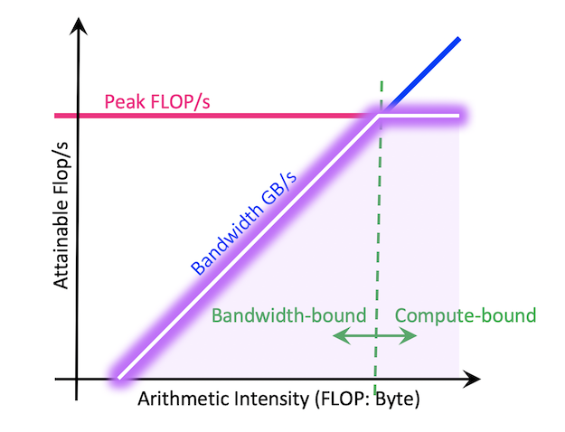

<figcaption>図1: Roofline モデル。横軸が演算密度（1 回のデータアクセスあたり何回計算するか）、縦軸が達成可能な計算効率（FLOPS）。左側の斜面が memory-bound、右側の平坦部が compute-bound の領域。出典: NERSC のドキュメント（記事が引用）。</figcaption>
</figure>

**decode フェーズの線形層は、極端に memory-bound である。** hidden size を $d$、重みを $d \times n$ とすると、リクエスト 1 件の decode は $1 \times d$ と $d \times n$ の行列積になる。

- メモリアクセス量: $d + dn$
- 計算量: $dn$
- **演算密度: $dn/(d+dn) = n/(1+n) \approx 1$**（$n$ は通常数千以上）

演算密度が 1 ということは、**1 個データを読むごとに 1 回しか計算しない**。GPU は 1 回のメモリアクセスあたり数百回の演算ができる設計なので、これは圧倒的にメモリ帯域の無駄遣いである。

ここが決定的である。**リクエストを 2 件にすると演算密度は約 2 になり、FLOPS も約 2 倍になる。** 計算量が 2 倍になったのに計算効率も 2 倍になるので、**所要時間はほぼ変わらない**——つまり**リクエストを 1 件から 2 件に増やすのは時間的にタダ**である。

memory-bound の領域にいる限りこれが続くので、**バッチサイズを上げ続けるのが serving の基本戦略**になる。現代の GPU と LLM の組み合わせでは **バッチサイズ数百でようやく compute-bound** になり、そこまで上げることがシステムの目標になる。

> なお **prefill は 1 リクエストでも複数トークンを同時処理するので compute-bound になりうる**。記事は「LLM の文脈ではバッチサイズ＝合計トークン数と考えるとシンプル」と整理している。

### Continuous Batching — 空いたスロットを待たせない

<figure>

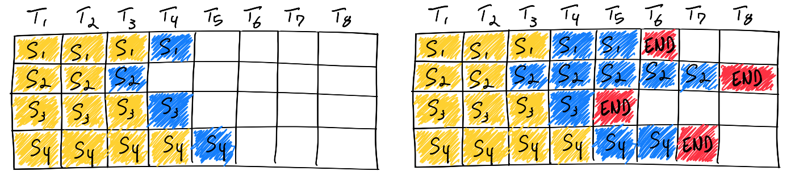

<figcaption>図2: 素朴なバッチ推論。黄がプロンプト（prefill）のトークン、青が生成（decode）のトークン、赤が終了トークン。S3 は 2 サイクル目で終わっているのに、最も長い S2 が終わる 6 サイクル目まで、そのスロットは空のまま無駄になる。出典: Anyscale のブログ（記事が引用）。</figcaption>
</figure>

<figure>

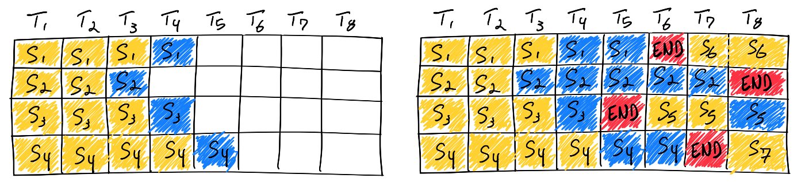

<figcaption>図3: Continuous batching。バッチ内の全リクエストの完了を待たず、空きが出た時点で新しいリクエスト（S5 など）を割り当てる。入出力長がばらついても GPU 利用率を高く保てる。出典: Anyscale のブログ（記事が引用）。</figcaption>
</figure>

**LLM 推論の特徴は、リクエストごとに何トークン出力するかが事前に分からないこと**である。素朴な実装だと、バッチ内で最も長いリクエストが終わるまで他のスロットが遊ぶ。continuous batching（in-flight batching とも）は、**終わったスロットに即座に次を入れる**。

### KV キャッシュ管理 — バッチサイズを上げるための障壁

バッチサイズを上げたいが、**KV キャッシュのメモリ消費**が壁になる。しかも入出力長が事前に分からないので、**リクエストごとにどれだけ確保すべきかが決まらない**。

記事の見積もりが具体的である。**Llama 2 7B** で 1 トークンあたりの KV キャッシュは

```
32 (layer) × 4096 (hidden size) × 2 (K/V) × 2 (byte/param) = 512 KB
```

最大コンテキスト長 4096 なので、**素朴に最大長ぶん確保すると 1 リクエストあたり 2GB**。80GB の H100 でも、モデル重み 14GB を引いて **同時に 32 リクエスト程度**しか載らない。最近のモデルはコンテキスト長が数十万なので、この実装は非現実的である。

#### PagedAttention

<figure>

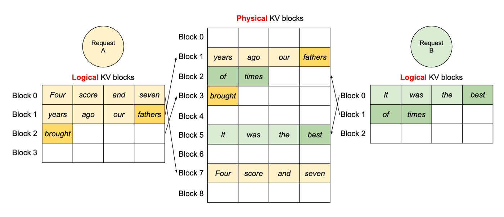

<figcaption>図4: PagedAttention。KV キャッシュを論理ブロックと物理ブロックに分ける。リクエスト A からは連続に見えるが、実際には物理ブロック 1・7・3 にばらばらに置かれている。リクエスト終了時にブロックが解放され、断片化が起きない。出典: vLLM 論文 arXiv:2309.06180（記事が引用）。</figcaption>
</figure>

**古典的な OS のページングをそのまま KV キャッシュへ持ち込んだ**のが vLLM の PagedAttention である。固定サイズの物理ブロックを事前に用意し、仮想アドレスから物理アドレスへ変換する。**断片化が起きないので、バッチサイズを限界まで上げられる。**

#### Prefix キャッシュと RadixAttention

もう 1 つの性質——**KV キャッシュの prefix は再利用できる**。LLM は causal attention を使うので依存関係が過去→未来にしかなく、**プロンプトの prefix が共通なら対応する KV キャッシュも同じ**になる。

<figure>

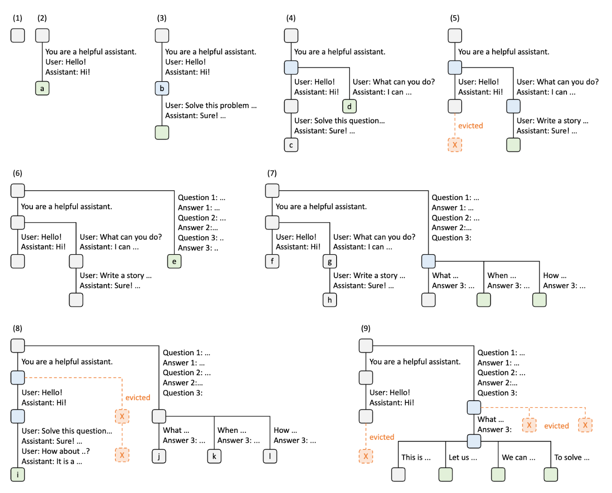

<figcaption>図5: RadixAttention。KV キャッシュの再利用関係を radix tree（基数木）として整理し、LRU エビクションで GPU メモリを管理する。出典: SGLang 論文 arXiv:2312.07104（記事が引用）。</figcaption>
</figure>

効くのは **システムプロンプトを使う場合・長い文章に複数の質問をする場合・チャットボットの多ターン会話**である。prefill の計算量と KV キャッシュのメモリの**両方**が減る。SGLang の **RadixAttention** はこれを radix tree として整理し、LRU エビクションを実装した。

> **エージェントにとってはここが特に重要である。** 多ターンの trajectory は定義上「共通 prefix ＋ 少しずつ伸びる末尾」なので、prefix キャッシュが最もよく効く形をしている（→ [[context-engineering]]）。

### 実装の工夫 — GPU の外側も速くする

#### CUDA カーネル

**カーネル融合**は複数のカーネルを 1 つにまとめ、起動オーバーヘッドと中間結果のメモリ往復を消す。「行列積 → ReLU」を別々のカーネルでやると、ReLU は要素ごとの単純な計算なのに全データを読み書きすることになる。

**FlashAttention はトランスフォーマにおける最も重要なカーネル融合**である（→ [[summaries/2022-flashattention]]）。**FlashInfer** は FlashAttention と PagedAttention を実装した高性能カーネルライブラリで、多くの serving system が attention のバックエンドに使っている。KV キャッシュを **CSR 形式の疎行列**として表現し、`plan` 関数で実行プラン（コア間のロードバランシングを考慮）を作ってから `run` する 2 段構えである。

<figure>

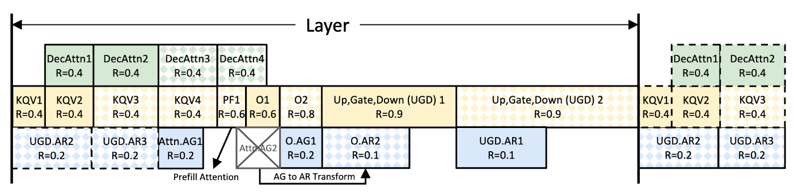

<figcaption>図6: NanoFlow。1 つのバッチをさらに小さく分割し、memory-bound な計算（decode の attention）・compute-bound な計算（prefill の attention、線形層）・GPU 間通信を重ね合わせる。出典: arXiv:2408.12757（記事が引用）。</figcaption>
</figure>

**NanoFlow** の着想が面白い。**同じバッチの中に memory-bound な仕事と compute-bound な仕事が混在している**ので、それらを重ね合わせればハードウェアの限界近くまで使い切れる、というものである。

**Multi-LoRA**（Punica・S-LoRA）は、LoRA の追加パラメータが元モデルの数 % しかないことを利用して、**1 つのベースモデルに複数の LoRA を載せ、リクエストごとに切り替える**。ユーザーごとにチューニングされたモデルを 1 台のサーバから提供できる（→ [[parameter-efficient-fine-tuning]]）。

#### CPU オーバーヘッドの最適化

**GPU をいくら速くしても、CPU 側が遅ければ全体は速くならない。** 特にモデルが小さい場合、Python のスケジューリング処理がボトルネックになる。

<figure>

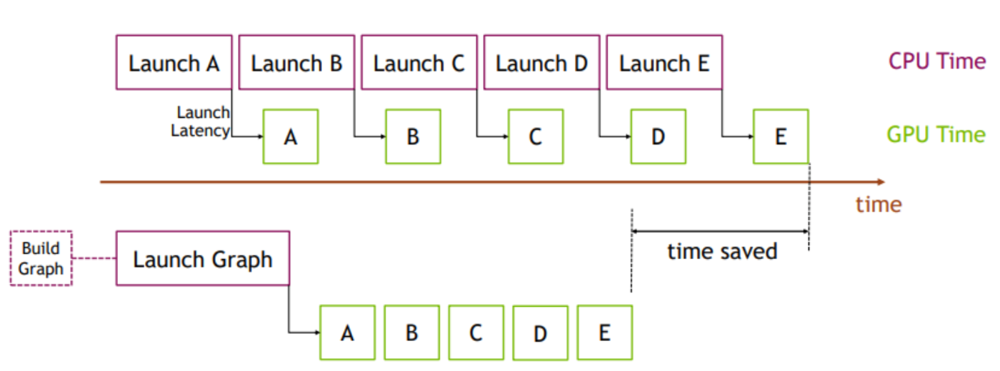

<figcaption>図7: CUDA Graph。多数のカーネル起動やメモリ転送を「グラフ」として事前に記述し、以降は 1 回の操作でまとめて実行する。カーネル起動と Python 由来のオーバーヘッドを大幅に削減できる。出典: PyTorch のブログ（記事が引用）。</figcaption>
</figure>

**CUDA Graph の制約が実務的である。入出力のバッファサイズが一定でなければならない。** LLM serving では attention 層の入出力トークン数がサイクルごとに変わるので、そのままでは使えない。vLLM の V1 アーキテクチャは **attention と attention の間の部分だけをグラフ化**し、起動時に `[1, 2, 4, 8, ...]` のバッチサイズのグラフを用意して実行時にパディングする、という回避を採る。

<figure>

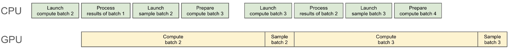

<figcaption>図8: 非同期スケジューリング。CPU のスケジューラを GPU と非同期に動かし、GPU が i サイクル目を計算している間に CPU が i+1 サイクル目を準備する。1 トークン余計に生成する代わりに、CPU のスケジューリングがクリティカルパスから外れる。出典: SGLang のブログ（記事が引用）。</figcaption>
</figure>

**トレードオフの立て方が綺麗である。** リクエストが i サイクル目で終了トークンを出しても、CPU がそれを知るのは i+1 サイクル目の途中なので、**1 トークン余分に生成してしまう**。その代わりスケジューリングがクリティカルパスから外れ、**全体としては速くなる**。

さらに実運用では、**トークナイザを走らせる部分とモデル推論の部分を別プロセスに分け、ZeroMQ のような IPC でつなぐ**。

#### スケジューリング — SLO の 2 指標

記事は serving の SLO（Service Level Objective）を 2 つに整理する。

- **TTFT（Time To First Token）**: リクエストから最初のトークンまで。**prefill フェーズに対応**。
- **TPOT（Time Per Output Token）**: 2 トークン目以降 1 個あたりの平均時間。**decode フェーズに対応**。

**両立が難しいのが要点である。** 入力の非常に長いリクエストが来たとき、素朴に到着順で処理すると、**そのユーザーの prefill が他のユーザーの TPOT を壊す**。

<figure>

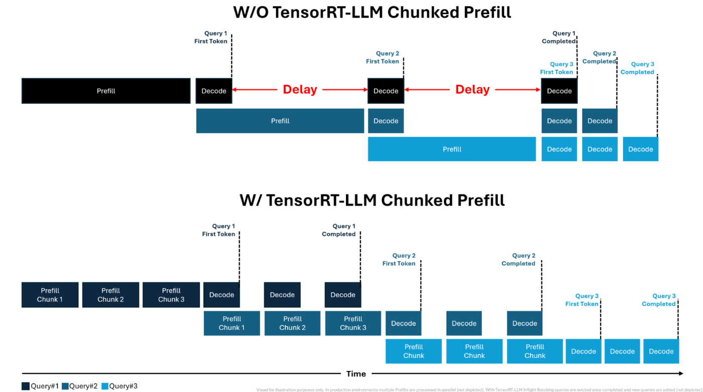

<figcaption>図9: Chunked Prefill。長い入力の prefill を分割し、1 サイクルで処理するトークン数に上限を設ける。他リクエストの decode を chunk された prefill に相乗り（ピギーバック）させることで TPOT を抑える。出典: NVIDIA の TensorRT-LLM ブログ（記事が引用）。</figcaption>
</figure>

<figure>

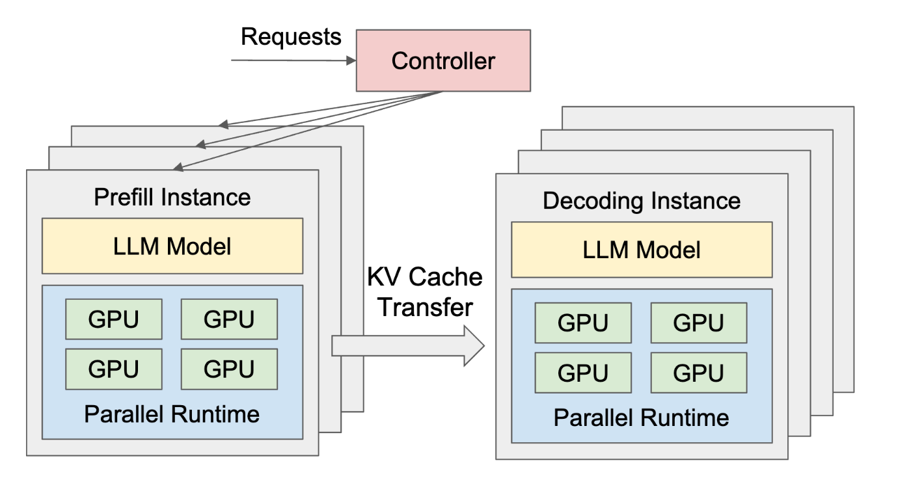

<figcaption>図10: Prefill と Decode の分離（disaggregation）。prefill 用の GPU でプロンプトを処理し、計算した KV キャッシュを decode 用の GPU へ送る。TTFT と TPOT を独立に最適化でき、それぞれのサーバを独立にスケールできる。出典: arXiv:2401.09670（記事が引用）。</figcaption>
</figure>

### アルゴリズムの工夫 — モデルの計算を「サボる」

ここまでは**モデル本来の計算を保ったまま**速くする話だったが、計算を簡略化する路線もある。

#### 量子化 — Roofline で見ると 2 種類の違いが分かる

<figure>

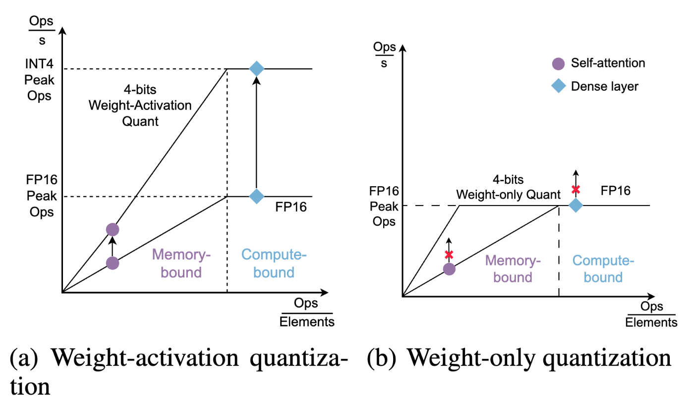

<figcaption>図11: 量子化の 2 系統を Roofline モデルで説明したもの。(a) weight-activation quantization は低ビットで計算するので達成可能な FLOPS の上限そのものが上がり（INT4 Peak Ops）、compute-bound の領域でも効く。(b) weight-only quantization は重みが小さくなって演算密度が上がるだけなので、memory-bound の領域でしか効かない（紫の self-attention は動かず、青の dense layer も上限に頭打ち）。出典: Atom 論文 arXiv:2310.19102（記事が引用）。</figcaption>
</figure>

**これは本 wiki が [[model-quantization]] に立てた「重みのみか、重みと活性か」の軸を、Roofline 図で直接示したものである。**

- **weight-only（GPTQ・AWQ・GGUF）**: 重みが小さくなり**演算密度が上がる**ので memory-bound では効く。だが **serving system が大きなバッチで動かすときは効果が限られる**（もっとも、重みのメモリが減る分バッチサイズを増やせるという別の効果はある）。
- **weight-activation（LLM.int8()・SmoothQuant・Atom）**: 低ビットで行列積するので **Tensor Core が使え、達成可能な FLOPS の上限そのものが上がる**。compute-bound な大バッチでもスループットが上がる。

**「ローカル LLM なら weight-only、serving なら weight-activation」**という実務の線引きが、Roofline 図から直接読める。

#### KV キャッシュとパラメータのスパース化

**StreamingLLM** が代表例である。全部のキャッシュを持つと（Dense Attention）メモリが増え、直近 N トークンだけ持つと（Window Attention）精度が大きく落ちる。**系列の最初の数トークンの KV キャッシュだけは常に保持する**ことで、メモリを一定に保ったまま半永久的に生成を続けられる。

根拠となるヒューリスティクスが示唆的である——**文頭のトークンは人間的には意味がなくても、LLM 的には attention スコアが高くなる**ことが多い。ほかに H2O・Quest・SeerAttention があり、**DeepSeek の NSA** はこれらの知見をまとめてモデルごと訓練している。

パラメータ側では **Wanda**（重みと対応する活性の積の絶対値が小さいものを枝刈り）などがある。

#### 投機的デコーディングと構造的デコーディング

<figure>

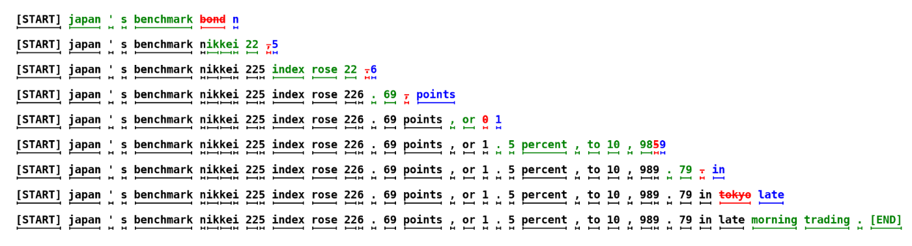

<figcaption>図12: 投機的デコーディング。緑がドラフトモデルの提案でターゲットモデルに採用されたトークン、赤が却下されたトークン、青がターゲットモデルが代わりに生成したトークン。1 行がターゲットモデルの 1 サイクル。約 40 トークンの生成にターゲットモデルは 9 回しか回っていない。出典: arXiv:2211.17192（記事が引用）。</figcaption>
</figure>

**serving system の視点からの但し書きが重要である。** 投機的デコーディングは**ユーザーが体験する TPOT は下げるが、却下されたドラフトの計算は無駄になるので、全体のスループットは必ずしも上がらない**。個人の体感とシステム全体の効率が一致しない例である。

<figure>

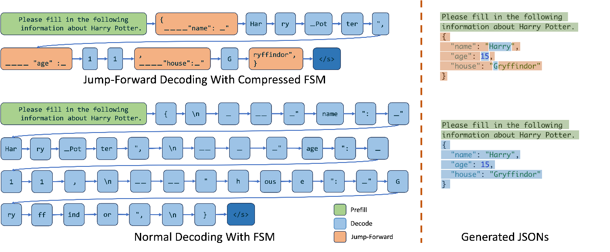

<figcaption>図13: 構造的デコーディングによる高速化。オレンジのトークンは制約によって一意に定まるため LLM に予測させる必要がない。JSON のキー（"name" など）は順序が決まっていれば一意、寮の名前も valid なリストを指定しておけば「G」が出た時点で Gryffindor に確定する。1 トークンずつ生成する場合（図の下半分）と比べて推論サイクル数が大幅に減る。出典: LMSYS のブログ（記事が引用）。</figcaption>
</figure>

**構造的デコーディングが「正しさの機能」でなく「高速化」でもある、という指摘が本記事で最も面白い部分の一つである。** 出力形式を正規表現や文脈自由文法で制約すると、**次のトークンが一意に確定する箇所では LLM を呼ぶ必要がない**。ツール呼び出しの JSON のように構造の決まった出力では、これが効く（→ [[tool-use-and-function-calling]]）。

### モデルアーキテクチャの工夫

**MQA / GQA / MLA** は 1 トークンあたりの KV キャッシュを減らす。クエリヘッド 32・KV ヘッド 8 の GQA なら **MHA の 4 分の 1**、すなわち**バッチサイズを 4 倍にできる**。

記事が引く NanoFlow 論文の指摘が鋭い——**一般的な入出力長のもとでは、GQA の有無によって memory-bound か compute-bound かが切り替わる**。アーキテクチャの選択が、システムがどちらの領域で動くかを決めてしまう。

**SWA（Sliding Window Attention）** は過去 N トークンだけを見る構成で、Mistral 7B が代表例。最近は**レイヤごとにグローバル attention と SWA を混ぜる**構成が増えている（Gemma 3・Apple Intelligence・Command A）。**Mamba などの SSM も、必要なキャッシュサイズが固定という点では SWA の類似**と捉えられる。

こうした多様なキャッシュ形式に対して、**Jenga** は PagedAttention を一般化し、SWA や SSM のキャッシュも包括的に扱うシステムを提案している。

### 分散処理

推論でも 3D 並列が使われるが、**訓練とは効き方が違う**。

| 並列化 | メモリ | スループット | レイテンシ | 通信 |
|---|---|---|---|---|
| **DP**（データ並列） | 減らない | 台数に比例 | **下がらない** | 不要 |
| **PP**（パイプライン並列） | 減る | 上がる | **下がらない** | レイヤ間の活性のみ |
| **TP**（テンソル並列） | 減る | 上がる | **下がる** | All-Reduce が必要で多い |

**訓練との違いとして、PP では backward がないのでパイプラインのバブルが基本発生しない**という指摘がある。MoE では **EP（エキスパート並列）** も必須になるが、All-to-All の通信コストとロードバランシングが課題になる。

実務では組み合わせる——**ノード間は PP でノード内は TP**、**MoE なら attention 層は DP で MoE 層は EP** といった具合である。

**serving system は RL 訓練の内部でも使われている。** 強化学習では LLM に複数の文章を生成させて報酬を与えるので、**訓練システムであっても推論性能が要る**。OpenRLHF・verl・SkyRL はいずれも内部で vLLM を使っている（→ [[reinforcement-learning-from-human-feedback]]）。

### DeepSeek の推論インフラ

記事は最後に、DeepSeek が 2025 年 2 月に公開した推論システムを「**serving system における金字塔的存在**」として詳述する。

<figure>

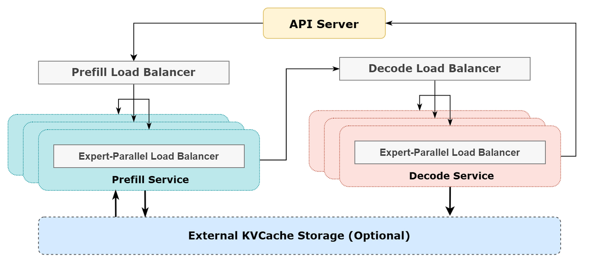

<figcaption>図14: DeepSeek-V3/R1 の推論システム構成。prefill と decode が分離され、それぞれ異なる並列度（prefill は DP32 と EP32、decode は DP144 と EP144）とロードバランサを持つ。出典: DeepSeek の open-infra-index（記事が引用）。</figcaption>
</figure>

**なぜこの構成になるのかの説明が説得的である。** 総パラメータ 685B、エキスパート 256 個のうちトークンあたり 8 個しか使わない極端にスパースなモデルなので、効率を上げるには**バッチサイズを非常に大きくする必要があり、メモリの観点から大きな EP が要る**。エキスパート層は EP、それ以外（共有エキスパートを含む）は DP。

**prefill と decode で並列度が違う理由**も明快である——prefill はスループット最大化が目的だが、decode はレイテンシ制約でバッチサイズを上げきれない。**decode 側を大きな並列度にすることで GPU あたりのエキスパート数を減らしてレイテンシを下げ、reasoning モデルのように decode トークン数が非常に多いケースに必要なメモリも確保する。**

<figure>

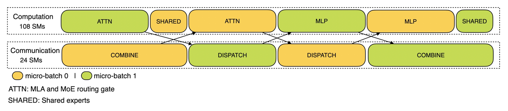

<figcaption>図15: DeepSeek の prefill 側の計算パイプライン。1 つのバッチを 2 つのミニバッチに分割し、片方が計算している間にもう片方がデータ転送（dispatch と combine）を行う。バッチサイズが大きく転送のオーバーヘッドも大きいため、通信用に一部の GPU コア（SM）が割り当てられている。出典: DeepSeek の profile-data（記事が引用）。</figcaption>
</figure>

<figure>

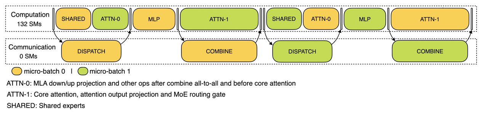

<figcaption>図16: DeepSeek の decode 側の計算パイプライン。prefill よりバッチサイズが小さく転送のオーバーヘッドも小さい。KV キャッシュアクセスが増えて attention と MLP の時間比率も変わるため、attention を 2 つに分割しパイプライン構成を一部変えている。出典: DeepSeek の profile-data（記事が引用）。</figcaption>
</figure>

**ロードバランシングの目標が prefill と decode で違う**という細部も実務的である。

- **prefill**: 「合計トークン数」と「attention の計算時間」を一定に
- **decode**: 「KV キャッシュの使用量」と「リクエスト数（バッチサイズ）」を一定に

エキスパート側では、使用頻度の統計をもとに**よく使われるエキスパートを複数 GPU に複製し、階層的にロードバランシングする**（EPLB）。

## 限界・批判的視点

- **査読なしの企業ブログ記事である。** ただし著者は当該分野の研究者であり、記述はほぼすべて一次文献（arXiv・公式ブログ・OSS）へのリンクを伴っている。本 wiki の他の二次資料（Medium の個人ブログ等）と比べて**出典の追跡可能性は格段に高い**。
- **数値がほとんどない。** 「continuous batching でどれだけ速くなるか」「chunked prefill で TPOT がどれだけ改善するか」といった定量値は示されない。**技術の地図であって、ベンチマークではない。** 定量値は別の資料で補う必要がある（→ [[summaries/2026-llm-optimization-guide]]）。
- **KV キャッシュの見積もりは古いモデルで行われている。** Llama 2 7B は GQA を持たないので計算が単純になるという理由で選ばれており、著者も脚注で断っている。GQA 以降のモデルでは数字が変わる。
- **トレードオフが「速くなる」側に寄っている。** 各技法の精度への影響——KV キャッシュのスパース化で何が失われるか、量子化で何が壊れるか——はほとんど扱われない。StreamingLLM の「文頭のトークンは attention スコアが高い」も**ヒューリスティクスであって理論ではない**と記事自身が書いている。
- **2025 年 7 月時点である。** vLLM の V1 アーキテクチャ、SGLang の非同期スケジューラ、DeepSeek の公開インフラといった具体的な実装への言及が多く、**この層は半年で変わる**。
- **エージェント固有の観点はない。** 多ターンの trajectory・ツール呼び出しの往復・並列サブエージェントといった負荷パターンが serving にどう効くかは扱われていない（prefix キャッシュの説明が最も近い）。

## 実装・運用上の示唆

1. **「なぜ効くのか」を Roofline で説明できるようにする。** バッチング・量子化・GQA のいずれも、**演算密度をどちらへ動かすか**で説明できる。個別の技法を暗記するより、この 1 枚の図に位置づけるほうが応用が利く。
2. **スループットとレイテンシは別の目的関数である。** 投機的デコーディングは TPOT を下げるがスループットは上げない。TP はレイテンシを下げるが DP と PP は下げない。**どちらを最適化しているのかを明示する。**
3. **SLO を TTFT と TPOT の 2 つで持つ。** そして「両方を同時に満たせなくなる状況」——長い入力のリクエストが他のユーザーの TPOT を壊す——を先に想定して、chunked prefill か P/D 分離のどちらを採るか決める。
4. **1 トークン余分に出す代わりにクリティカルパスを短くする、という発想を持つ。** 非同期スケジューリングの設計は、**「厳密さを少し捨てて構造的なボトルネックを外す」**という一般的なパターンの良い実例である。
5. **prefix キャッシュはエージェントで最も効く。** 多ターンの trajectory は「共通 prefix ＋ 伸びる末尾」なので、システムプロンプトと会話履歴の再利用が直接コストに効く。**プロンプトの可変部分を先頭に置かない**という設計規律がここから出る（→ [[context-engineering]]）。
6. **アーキテクチャの選択が動作領域を決める。** GQA の有無で memory-bound か compute-bound かが切り替わる、という NanoFlow の指摘は、モデル選定が serving 設計の前提条件になることを意味する。

## 用語と略称

- **serving（サービング）** = 訓練済みモデルを本番で推論に使えるようにすること。本記事では「多数のクライアントに LLM 推論を提供するシステム」を serving system と呼ぶ
- **Roofline モデル** = 横軸に演算密度、縦軸に達成可能な計算効率（FLOPS）を取り、ハードウェアの上限を可視化するモデル
- **演算密度（arithmetic intensity）** = 1 回のデータアクセスあたりの演算回数。memory-bound か compute-bound かを決める
- **memory-bound / compute-bound** = メモリ帯域が律速か、演算器が律速か
- **prefill / decode** = プロンプト全体を一括処理する相 / 1 トークンずつ生成する相
- **continuous batching / in-flight batching** = バッチ内に空きが出るたび新しいリクエストを割り当てる方式
- **TTFT / TPOT** = Time To First Token / Time Per Output Token。serving の 2 大 SLO
- **SLO** = Service Level Objective（サービス水準目標）
- **PagedAttention** = OS のページングを KV キャッシュに応用し、断片化を防ぐ方式（vLLM）
- **RadixAttention** = KV キャッシュの再利用関係を radix tree で管理する方式（SGLang）
- **prefix キャッシュ** = プロンプトの共通接頭辞に対応する KV キャッシュの再利用
- **カーネル融合（kernel fusion）** = 複数の GPU カーネルを 1 つにまとめ、起動オーバーヘッドと中間結果のメモリ往復を消す最適化
- **CUDA Graph** = 多数のカーネル起動を「グラフ」として事前記述し、1 回の操作でまとめて実行する仕組み
- **chunked prefill** = 長い prefill を分割し、1 サイクルの処理トークン数に上限を設けるスケジューリング
- **P/D disaggregation** = prefill と decode を別々の GPU で実行する構成
- **DP / PP / TP / EP** = Data / Pipeline / Tensor / Expert Parallelism
- **All-Reduce / All-to-All** = 集合通信の型。TP は前者、MoE の EP は後者を要する
- **SM** = Streaming Multiprocessor（NVIDIA GPU の演算ユニット）
- **CSR 形式** = Compressed Sparse Row（疎行列の圧縮表現）
- **LRU エビクション** = Least Recently Used。最後に使われてから最も時間が経ったものを追い出すキャッシュ方針
- **SSM** = State Space Model（Mamba など。キャッシュサイズが固定）
- **MQA / GQA / MLA** = Multi-Query / Grouped-Query / Multi-head Latent Attention
- **SWA** = Sliding Window Attention
- **IPC** = Inter-Process Communication（プロセス間通信）

## 関連ページ

- [[llm-serving-systems]] — 本記事が主要な根拠となる概念ページ
- [[llm-inference-optimization]] — 「1 回の前向き計算を速くする」側。本記事は「多数のクライアントを多重化する」側を扱う
- [[model-quantization]] — weight-only と weight-activation の区別。本記事の Roofline 図がその根拠を視覚的に示している
- [[summaries/2025-understanding-llm-serving]] — 同じ主題をビジネス寄りに扱った記事。ルーティング／カスケードとツールスタックを補う
- [[summaries/2022-flashattention]] — 本記事が「最も重要なカーネル融合」と呼ぶもの
- [[summaries/2024-deepseek-v3]] — 本記事が最後に詳述する推論インフラのモデル側
- [[summaries/2026-llm-optimization-guide]] — 定量値（continuous batching −85%、PagedAttention −55% 等）を持つ二次資料。本記事はその論理側を補う
- [[context-engineering]] — prefix キャッシュがエージェントの多ターン trajectory で効く接点
- [[tool-use-and-function-calling]] — 構造的デコーディングが「正しさ」だけでなく「高速化」でもあるという接点
- [[reinforcement-learning-from-human-feedback]] — RL 訓練の内部で serving system が使われる接点
- [[mixture-of-experts]] — EP とエキスパートのロードバランシング
