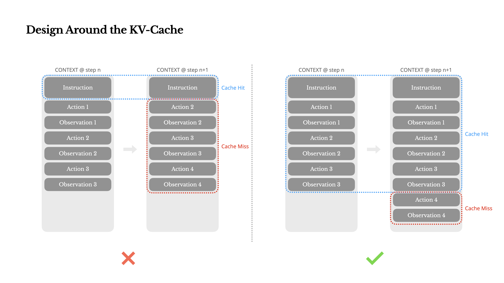

# Manus のコンテキストエンジニアリング — 本番エージェントの 6 原則

> 原典: [[translations/2025-manus-context-engineering]] ・ `raw/articles/Context Engineering for AI Agents_ Lessons from Building Manus.md`
> 著者・年: Yichao 'Peak' Ji（Manus AI 共同創業者・Chief Scientist）・2025-07（Manus 公式ブログ）

## 一言まとめ

汎用エージェント製品 Manus を「フレームワークを 4 回作り直し、数百万ユーザーで検証」して得た、**本番エージェントのコンテキスト設計 6 原則**を開示した実務記事。「モデルを訓練せずフロンティアモデルの文脈内学習に賭ける」という製品戦略の下で、KV cache（Key-Value cache, 生成済みトークンの中間状態を再利用する高速化機構）ヒット率を最重要指標に据えた点が独自で、**コンテキスト設計と推論経済（コスト・レイテンシ）を 1 つの問題として扱う**視点をコミュニティに広めた文章である。

## 背景と問題意識

Manus の創業時の選択は「オープンソース基盤で end-to-end の agentic モデルを訓練する」か「フロンティアモデルの in-context learning（文脈内学習, 文脈内の例示・指示から学ぶ能力）の上に構築する」か。著者は BERT 時代（タスクごとに数週間のファインチューニング）と、自前モデルが GPT-3 の登場で一夜にして無意味になった前スタートアップの経験から、後者——**コンテキストエンジニアリング**——に賭けた。「モデルの進歩が上げ潮なら、製品は船でありたい。海底に突き立った柱ではなく」。改善の出荷が数週間から数時間になる代わりに、コンテキスト設計は「実験科学」となり、アーキテクチャ探索と経験則の手作業（自嘲的に *Stochastic Graduate Descent* と呼ぶ）でフレームワークを 4 回書き直した。その到達点（局所最適）の共有が本稿である。

## 6 原則

1. **KV キャッシュを中心に設計する。** エージェントは「行動を選ぶ→実行→観測を追記」を繰り返すため、コンテキストは毎ステップ伸びる一方、出力（関数呼び出し）は短い——Manus の実測で**入力:出力 = 100:1**。同一プレフィックスは KV cache が効き、Claude Sonnet ではキャッシュ済み入力 $0.30/MTok vs 未キャッシュ $3/MTok と **10 倍差**。したがって (a) プレフィックスを安定に保つ（システムプロンプト冒頭の秒精度タイムスタンプは禁物）、(b) コンテキストは**追記専用**にし、シリアライズを決定的に保つ（JSON のキー順が非決定だと静かにキャッシュが壊れる）、(c) 必要ならキャッシュブレークポイントを明示する。→ [[llm-inference-optimization]]
2. **削除するな、マスクせよ（Mask, Don't Remove）。** MCP（Model Context Protocol, ツールをモデルに接続する標準プロトコル）の流行でツールは爆発し、「重武装したエージェントはより愚かになる」。だが RAG 的にツールを動的に出し入れすると、(a) ツール定義はコンテキスト前方にあるため以降の KV cache が全滅し、(b) 過去の行動が「もう存在しないツール」を参照してスキーマ違反や幻覚を招く。Manus の解は**状態機械＋ロジットマスク**: 定義は残したまま、デコーディング時に選択可能な行動をトークンロジットで制御する（response prefill の Auto/Required/Specified の 3 モード）。ツール名に `browser_`・`shell_` のような**一貫したプレフィックス**を付けておけば、状態を持つロジットプロセッサなしでグループ単位の制約ができる。→ [[tool-use-and-function-calling]]
3. **ファイルシステムを究極のコンテキストとして使う。** 巨大な観測・128K でも足りない実タスク・長文脈の性能劣化とコストに対し、切り詰め・要約のような**不可逆圧縮は「どの観測が 10 ステップ後に効くか予測できない」以上、常にリスク**。Manus はファイルシステムを「無制限・永続・エージェント自身が操作できる」外部化メモリとして扱い、圧縮は**復元可能**な形に限る——Web ページ本文は URL を残して落とす、文書はパスを残して省く。SSM（State Space Model, 状態空間モデル）がファイルベース記憶を習得すれば Neural Turing Machine の真の後継になりうる、という展望も添える。→ [[agent-memory]]・[[context-engineering]]
4. **復唱（recitation）で注意を操作する。** Manus の典型タスクは平均 **50 ツール呼び出し**。長いループでは目標を見失いやすい。todo.md を作って**絶えず書き直す**ことで、グローバルな計画をコンテキスト末尾＝モデルの直近の注意範囲へ押し込み続け、lost-in-the-middle（長文脈の中間の想起劣化）を回避する。アーキテクチャ変更なしに「自然言語で自分の注意をバイアスする」仕掛け。
5. **誤りをコンテキストに残せ。** 失敗のトレースを消してリトライするのは「証拠を消す」ことであり、モデルは適応できなくなる。失敗した行動とスタックトレースを残すと、モデルは暗黙に事前分布を更新して同じ誤りを繰り返しにくくなる。**エラー回復こそ真の agentic な振る舞いの最も明瞭な指標**なのに、理想条件のタスク成功だけを測る学術ベンチマークでは過小評価されている、という批判つき。→ [[self-reflection]]・[[agent-evaluation]]
6. **few-shot の轍にはまるな。** モデルは模倣者であり、似た行動–観測ペアが並ぶと（20 件の履歴書レビューのような反復タスクで）そのリズムに囚われて漂流・過剰一般化・幻覚に至る。対策は**構造化された変動**——シリアライズテンプレート・言い回し・順序・フォーマットに制御されたノイズを入れ、パターンの惰性を断つ。

<figure>

<figcaption>図1（再掲）: KV キャッシュを中心に設計する。過去ステップを変更するとキャッシュが全滅（左・×）、追記専用ならプレフィックス全体がヒット（右・✓）。</figcaption>
</figure>

## 実務コストの数字

この記事の価値は具体的な数字にある: 入力:出力トークン比 100:1、キャッシュ有無で単価 10 倍差、1 タスク平均 50 ツール呼び出し。これらは「エージェントの経済はコンテキスト設計で決まる」ことの直接の証拠であり、[[summaries/2025-multi-agent-research-system]] の「チャット比 15 倍のトークン」と並ぶ、エージェントのトークン経済の基礎データになっている。

## 既存 wiki との接続

- **[[context-engineering]] の実務側の原点。** この記事（2025-07）は「context engineering」という語を実務標準にした文章の 1 つで、この wiki の同概念ページが扱う論点の多く——復元可能な参照渡し・切り詰めへの警戒・積載の設計——を製品の言葉で先取りしている。MemGPT（[[summaries/2023-memgpt]]）が研究側から「LLM 自身による記憶管理」を定式化したのに対し、Manus は本番製品側から「ファイルシステム＝究極のコンテキスト」に到達した——後の Anthropic ハーネス連作（[[summaries/2025-effective-harnesses]] の構造化 artifact・[[summaries/2026-harness-design]]）や Meta-Harness（[[summaries/2026-meta-harness]] の「ファイルシステム経由の全履歴アクセス」）と同じ結論に独立に達している点は、この設計の頑健さの傍証といえる。
- **復唱 ≒ 計画の外部化。** todo.md の絶え間ない書き直しは、[[summaries/2025-effective-harnesses]] の feature list JSON・進捗ログ、[[summaries/2025-multi-agent-research-system]] の「計画を最初に外部メモリへ保存」と同型の解であり、[[agent-memory]] の「計画・要点の外部化」パターンの最初期の製品実装記録。
- **「誤りを残す」は [[summaries/2023-reflexion]] の実務版。** Reflexion が反省文の生成として形式化した「失敗からの文脈内学習」を、Manus は「トレースを消さない」という最小介入で得ている。
- **ロジットマスクによる行動制約**は [[tool-use-and-function-calling]] の constrained decoding の実務手筋で、後の DSML（[[summaries/2026-deepseek-v4]]）のようなツール呼び出し形式の設計と同じ問題圏。
- **KV cache 中心の設計**は、[[llm-inference-optimization]]（prefill/decode の 2 相・キャッシュ経済）をアプリケーション層から見た姿。「推論最適化はインフラの仕事」ではなく「コンテキストの形が単価を決める」という接続を示した。

## 限界・批判的視点

- **単一製品の経験則**であり、対照実験や数値比較はない（著者自身「普遍の真理ではなく我々に機能したパターン」と明言）。「動的ツールロードは避けよ」等は Manus のアーキテクチャ（単一ループ・巨大ツール空間）に条件づけられ、例えばサブエージェント分割（[[multi-agent-systems]]）でツール空間自体を分けられる設計では前提が変わる。
- **2025-07 時点の記述**。KV cache の単価・プロバイダのキャッシュ仕様・MCP の成熟度は変化が速い。また「few-shot が轍になる」は、推論モデル世代で few-shot が有害になる観察（[[summaries/2025-deepseek-r1]]）と响き合うが、モデル依存の程度は未検証。
- ファイルシステム外部化は**サンドボックスの存在が前提**（Manus は VM サンドボックスを持つ）。ブラウザのみ・API のみのエージェントには別の永続層が要る。prompt injection 面の議論はない（ファイル・Web 由来の内容をコンテキストに戻す設計は攻撃面でもある → [[agent-safety-and-guardrails]]）。
- なお Manus は本記事の後、2025 年後半に Meta による買収が発表された（原ページのバナーより）。製品の帰属・アーキテクチャは記事時点と変わりうる。

## 実装・運用上の示唆

- **最初に測るべきは正答率でなく KV cache ヒット率**——コスト・レイテンシの支配項であり、設計の癖（タイムスタンプ・非決定シリアライズ・ツール定義の変更）が即座に現れる。
- **「消す・変える」より「残す・足す・隠す」**: コンテキストは追記専用、ツールはマスク、圧縮は復元可能な参照渡し、失敗トレースは保持。この 4 つは同じ原理（不可逆な変更はキャッシュか情報のどちらかを壊す）の応用形。
- ツール命名はプレフィックス規約（`browser_`/`shell_`）で**設計時に**制約可能性を仕込む。
- 反復タスクではテンプレートに意図的な揺らぎを入れる。

## 用語と略称

- **KV cache** = Key-Value cache（生成済みトークンの注意の中間状態（K/V）を保存・再利用し、prefill を省く機構）／ **TTFT** = Time To First Token（最初のトークンまでの遅延）
- **prefill / decode** = 入力の一括処理相／逐次生成相 → [[llm-inference-optimization]]
- **in-context learning（ICL）** = 文脈内学習／ **few-shot prompting** = 少数例示
- **MCP** = Model Context Protocol（ツール・データソースをモデルに接続する標準プロトコル）
- **constrained decoding / logit masking** = 出力語彙を制約するデコーディング／特定トークンの確率（ロジット）を封じる・強制する操作
- **response prefill** = アシスタント応答の冒頭を固定してモデルに続きを書かせる機能（Auto/Required/Specified の 3 モード）
- **state machine** = 状態機械（状態と遷移規則でツール可用性を管理）
- **lost-in-the-middle** = 長文脈の中間部の想起劣化 → [[context-engineering]]
- **SSM** = State Space Model（状態空間モデル。固定サイズ状態で系列を処理する Transformer 代替）／ **Neural Turing Machine** = 外部メモリを読み書きするニューラル機構（2014）
- **SGD（本稿の用法）** = "Stochastic Graduate Descent"（確率的大学院生降下法——手作業の試行錯誤の自嘲。本来の SGD＝確率的勾配降下法のもじり）
- **Manus** = 本稿の対象である汎用 AI エージェント製品（VM サンドボックス内でツールを駆動）

## 関連ページ

- [[context-engineering]] — 本稿の主題。実務 6 原則の受け皿
- [[agent-memory]] — ファイルシステム外部化・復唱（計画の外部化）
- [[tool-use-and-function-calling]] — ロジットマスク・ツール命名規約
- [[llm-inference-optimization]] — KV cache 経済のインフラ側
- [[agent-loop]] — 「行動→観測→追記」ループの実務形
- [[summaries/2023-memgpt]] / [[summaries/2025-effective-harnesses]] / [[summaries/2026-meta-harness]] — 「ファイルシステム＝外部記憶」への独立の収束
