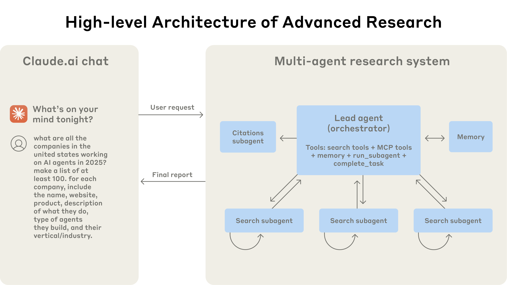

# How we built our multi-agent research system（Anthropic, 2025）

> 原典: [[translations/2025-multi-agent-research-system]] ・ `raw/articles/How we built our multi-agent research system.md`
> 著者・年・出典: Jeremy Hadfield, Barry Zhang, Kenneth Lien, Florian Scholz, Jeremy Fox, Daniel Ford（Anthropic）・2025 年 6 月・Anthropic Engineering Blog

## 一言まとめ

Claude の Research 機能——リードエージェントが並列サブエージェント群に検索を委任する orchestrator-worker 型マルチエージェントシステム——を**プロトタイプから本番稼働まで持っていった経験談**であり、アーキテクチャの効果（単一エージェント比 +90.2%）とコスト（チャット比 15 倍のトークン）、プロンプト設計 8 原則、評価手法、本番運用の落とし穴までを一次情報として公開した希少な記録である。

## 背景と問題意識

[[summaries/2024-building-effective-agents]]（同じ Anthropic, 2024）が「workflow と agent の区別」「まず単純に」という**設計の一般論**を示したのに対し、本記事はその半年後、実際に自社製品（Research 機能）として**マルチエージェントシステムを本番投入した具体的な顛末**を扱う。リサーチという仕事は、必要なステップを事前に予測できないオープンエンドな問題であり、固定パイプラインでは扱えない——発見に応じて方向転換する自律性が要る。一方で、複数エージェントの協調は評価・信頼性・デバッグのすべてに新しい難しさを持ち込む。研究論文（例: [[summaries/2025-masft]] の失敗分類）が指摘してきた MAS（Multi-Agent System, マルチエージェントシステム）の課題を、**実務側がどう乗り越えたか**の報告として読める。

## 提案手法 / 主張

### アーキテクチャ: orchestrator-worker ＋ 引用専門エージェント

<figure>

<figcaption>図1（再掲）: Research 機能の全体構成。リードエージェント（オーケストレータ）が検索ツール・MCP ツール・memory・run_subagent・complete_task を持ち、並列の検索サブエージェント群と引用専門の Citations サブエージェントを従える。</figcaption>
</figure>

- **LeadResearcher（リードエージェント）**: クエリを分析して戦略を立て、サブタスクに分解して 3〜5 体のサブエージェントを並列に生成する。結果を統合し、「さらに調査が要るか」を判断してループする。
- **Memory（外部メモリ）**: リードエージェントは最初に立てた**計画を Memory に保存**する。コンテキストウィンドウが 200k トークンを超えると切り詰められるため、計画を外部に永続化しておくことが重要（→ `[[context-engineering]]` 的な教訓）。
- **検索サブエージェント**: それぞれ固有のコンテキストウィンドウ・ツール・プロンプトを持ち、Web 検索と interleaved thinking（ツール結果のたびに挟む思考）で情報を評価・凝縮してリードに返す「知的なフィルタ」。検索の本質は**圧縮**であり、並列のコンテキスト分離がそれを可能にする。
- **CitationAgent**: リサーチループを抜けた後、文書とレポートを突き合わせて**引用の挿入位置を特定する専門エージェント**。主張の出典帰属を構成的に保証する。

<figure>

<figcaption>図2（再掲）: プロセス図。計画の Memory 保存 → サブエージェント並列生成 → 統合 → 「More research needed?」の判断ループ → CitationAgent による引用挿入、という全ワークフロー。</figcaption>
</figure>

従来の RAG（Retrieval-Augmented Generation, 検索で外部知識を注入して生成する手法）が**静的検索**（クエリに類似したチャンクを一度取って生成）なのに対し、この構成は**動的な多段検索**——見つけたものに適応しながら検索を重ねる——である点が対比されている（→ [[retrieval-augmented-generation]]）。

### なぜ効くか: トークンをスケールさせる仕組み

- 内部評価（幅優先のリサーチ課題）で、**Opus 4 リード＋Sonnet 4 サブエージェント構成が単一 Opus 4 を 90.2% 上回った**。
- BrowseComp（見つけにくい情報を突き止めるブラウジング評価）の分析では、**性能分散の 80% をトークン使用量が説明**し、ツール呼び出し回数・モデル選択を合わせると 95% に達する。つまりマルチエージェントの効果の正体は、**別々のコンテキストウィンドウで並列に「考える容量」を追加し、単一エージェントの限界を超えてトークンを使えるようにすること**にある。
- ただしモデル選択は乗数として効く: Sonnet 3.7 のトークン予算を 2 倍にするより、Sonnet 4 に上げる方が性能向上が大きい。

### プロンプト設計 8 原則

初期エージェントは「単純なクエリに 50 体のサブエージェントを生成」「存在しない情報源を際限なく探す」等の失敗をした。その改善レバーはプロンプトであり、教訓は 8 つに整理されている:

1. **エージェントの身になって考える** — Console 上で同一プロンプト・ツールの模擬実行を観察し、正確なメンタルモデルを作る。
2. **委任の仕方を教える** — サブタスクには目的・出力形式・ツール指定・境界が必要。曖昧な指示（「半導体不足を調べよ」）は誤解と重複作業を生む。
3. **労力をクエリの複雑さにスケールさせる** — 単純な事実確認は 1 体・3〜10 ツール呼び出し、比較は 2〜4 体、複雑な調査は 10 体超、と明示的な規則を埋め込む。
4. **ツール設計が決定的** — 悪いツール説明はエージェントを完全に誤った道へ送る。「まず全ツールを確認」「専門ツール優先」等のヒューリスティクスを与える。
5. **エージェント自身に改善させる** — 欠陥のある MCP（Model Context Protocol, ツール接続の標準プロトコル）ツールを試してツール説明文を書き直す「ツールテスト用エージェント」により、後続エージェントのタスク完了時間が **40% 減**。
6. **広く始めて絞り込む** — 長すぎる specific なクエリでなく、短く広いクエリから漸進的に絞る。
7. **思考プロセスを導く** — extended thinking を計画用スクラッチパッドに、サブエージェントには interleaved thinking で結果評価とクエリ洗練をさせる。
8. **並列ツール呼び出し** — サブエージェント 3〜5 体の並列生成 × 各エージェント 3+ ツールの並列呼び出しで、複雑クエリの所要時間を**最大 90% 削減**。

### 評価手法

- **少数サンプルで直ちに始める**: 初期は効果量が大きい（プロンプト微調整で成功率 30%→80%）ので、実利用を代表する**約 20 クエリ**で十分変化が見える。「数百件の評価ができるまで待つ」のは誤り。
- **LLM-as-a-judge**: 事実正確性・引用正確性・網羅性・情報源品質・ツール効率のルーブリックで採点。**項目別に複数ジャッジを立てるより、単一 LLM 呼び出し・単一プロンプトで 0.0〜1.0 スコア＋合否を出させる方が一貫し人間の判断と整合**した。
- **人間の評価は自動化の見逃しを拾う**: 人間のテスターだけが「SEO コンテンツファームを権威ある学術 PDF より優先する」バイアスに気づき、情報源品質ヒューリスティクスの追加につながった。
- 付録の追加知見: 状態を変更するエージェントは**終了状態評価**（過程でなく最終状態を判定、チェックポイント分割）が有効。

### 本番運用の課題

- **エージェントは状態を持ち、エラーが複利で効く**: 最初からやり直さず**エラー地点から再開**できる仕組み＋「ツールが失敗している」とモデルに伝えて適応させる緩和策＋リトライ・チェックポイントの決定論的セーフガード。
- **デバッグ**: 実行ごとに非決定的なので、会話内容は見ずに**意思決定パターンと相互作用構造をトレース**する可観測性を構築。
- **デプロイ**: 稼働中のエージェントを壊さないよう **rainbow deployment**（新旧バージョン並走で漸進切り替え）。
- **同期実行のボトルネック**: 現状はサブエージェント群の完了を待つ同期設計で、リードが途中で操縦できない・全体が 1 体待ちでブロックされる。非同期化は並列性を上げるが結果調整・状態一貫性・エラー伝播が難題（今後の課題として明示）。
- 付録: 長い会話は**フェーズ要約→外部メモリ→新サブエージェントへの引き継ぎ**で管理。サブエージェントの成果物は**ファイルシステムに直接保存して参照だけをリードに渡す**と「伝言ゲーム」による情報劣化とトークン浪費を防げる。

## 実験結果と知見（実務コストの数字）

| 項目 | 数値 |
| --- | --- |
| マルチエージェント vs 単一エージェント（内部評価） | **+90.2%** |
| BrowseComp 性能分散の説明要因 | トークン量 80%、＋ツール呼び出し数・モデル選択で 95% |
| トークン消費 | エージェント ≈ チャットの 4 倍、マルチエージェント ≈ **15 倍** |
| ツール説明の自己改善 | タスク完了時間 **−40%** |
| 並列化（サブエージェント＋ツール） | 調査時間 **最大 −90%** |
| 評価の出発点 | 約 20 クエリ |

経済性の含意が明快で、**15 倍のトークンコストを正当化できる高価値タスクにのみ適する**。逆に、全エージェントが同じコンテキストを共有すべきタスクや依存関係の密なタスク（多くのコーディングタスク）は不向きと明言している——[[summaries/2024-building-effective-agents]] の「まず単純に」と整合する、適用条件の率直な線引きである。

## 限界・批判的視点

- **内部評価の詳細が非公開**: 90.2% の内部リサーチ評価はタスク構成・採点方法が公開されておらず、第三者が検証できない。自社製品のブログという性質上、成功側に光が当たっている。
- **同期実行・重複作業など既知の弱点は自認**: リードがサブエージェントを操縦できない構造は、[[summaries/2025-masft]] の失敗分類でいう inter-agent misalignment（エージェント間の不整合）系の失敗（重複作業・仕様逸脱）を許す設計であり、実際に「2 体が同じ調査を重複して行う」事例が記事中でも語られている。
- **プロンプトによる統制の限界**: 8 原則の多くは「プロンプトにヒューリスティクスを書く」対処であり、[[summaries/2026-sakana-fugu]] のような**学習されたオーケストレーション**と対照的。スケーリング規則（1 体 / 2〜4 体 / 10 体超）も手書きの規則である。
- **再現性**: Claude 4 世代・社内ツール群・Console 環境に依存した記録であり、数値（90.2%, 40%, 90%）は構成が違えば移らない。

## 実装・運用上の示唆

- **計画は最初に外部メモリへ**。200k コンテキストの切り詰めで計画を失うのが最悪の失敗——長時間エージェントの第一歩は「計画の永続化」。
- **委任プロンプトには目的・出力形式・ツール・境界の 4 点を必ず書く**。曖昧な一行指示は重複と抜けを量産する。
- **労力のスケーリング規則を明文化してプロンプトに埋め込む**（単純=1 体 3〜10 呼び出し…）。エージェントは自分では労力を見積もれない。
- **評価は 20 クエリから今日始める**。ジャッジは単一プロンプト・単一呼び出しで十分どころかその方が良い。
- **サブエージェントの成果物はファイル等に直接永続化し、参照渡しにする**（伝言ゲーム防止）。
- **エラー地点から再開できる設計＋ツール障害をモデルに伝えて適応させる**、の 2 段構えを最初から仕込む。

## 用語と略称

- **MAS** = Multi-Agent System（マルチエージェントシステム, 複数の LLM エージェントが協働するシステム）
- **LLM** = Large Language Model（大規模言語モデル）
- **orchestrator-worker**（オーケストレータ・ワーカー構成, 統括役が作業役に委任するパターン）
- **RAG** = Retrieval-Augmented Generation（検索拡張生成, 検索した外部知識を根拠に生成する手法）
- **MCP** = Model Context Protocol（ツール・データソースをモデルに接続する標準プロトコル）
- **LLM-as-a-judge**（LLM に出力を採点させる評価手法）
- **BrowseComp**（OpenAI のブラウジング評価, 見つけにくい情報の探索能力を測る）
- **extended thinking / interleaved thinking**（可視の思考トークンを出す拡張思考モード／ツール結果の合間に挟む思考）
- **rainbow deployment**（新旧バージョンを並走させ徐々にトラフィックを移すデプロイ手法）
- **Clio**（Anthropic の利用パターン分析システム, プライバシーを保った会話クラスタリング）

## 関連ページ

- [[multi-agent-systems]] — orchestrator-worker の本番実例としてこの記事を詳述
- [[agent-evaluation]] — 20 クエリから始める評価・単一ジャッジ・終了状態評価の根拠
- [[tool-use-and-function-calling]] — ツール説明の品質と自己改善エージェント
- [[retrieval-augmented-generation]] — 静的 RAG と動的多段検索の対比
- [[summaries/2024-building-effective-agents]] — 同じ Anthropic による設計一般論（本記事はその本番実践編）
- [[summaries/2025-masft]] — 本記事が実務で対処した失敗モードの研究側の分類
- [[summaries/2026-sakana-fugu]] — プロンプトによる統制 vs 学習されたオーケストレーションの対照
- [[agent-memory]] — 計画の外部メモリ保存・成果物の参照渡しパターンの根拠
- [[agent-safety-and-guardrails]] — 会話内容を見ないトレーシング・rainbow deployment の運用実例
- [[llm-inference-optimization]] — 並列サブエージェント・並列ツール呼び出しのスループット前提
- [[test-time-compute]] — 「性能分散の 80% はトークン量」＝並列スケーリングの実測根拠
