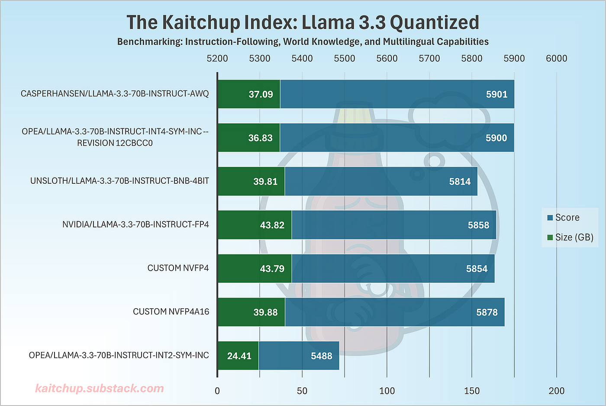
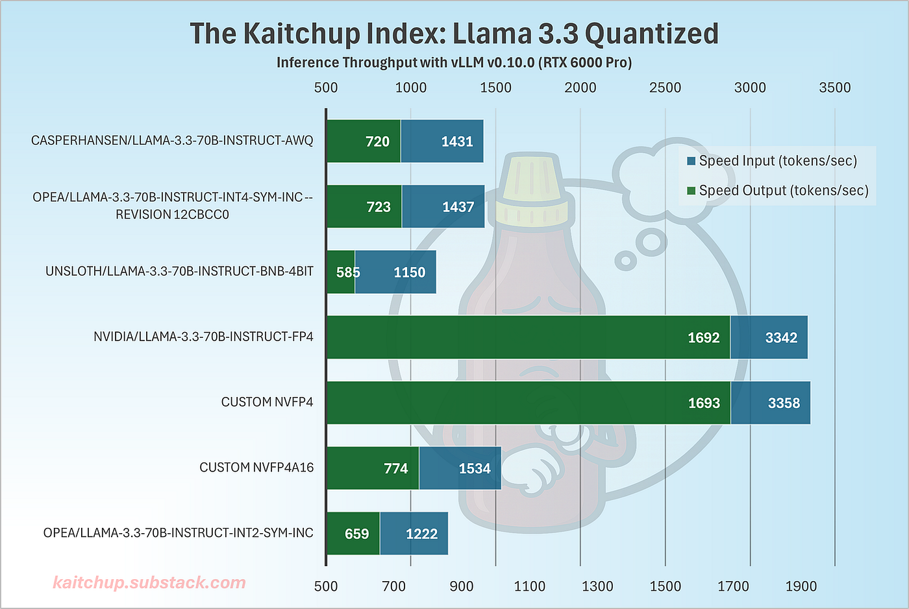

# NVFP4 を推論側で実測する — 精度でなく速度が勝ち筋

> 原典: [[translations/2025-nvfp4-inference]] ・ `raw/articles/NVFP4_ Same Accuracy with 2.3x Higher Throughput for 4-Bit LLMs.md`
> 著者: Benjamin Marie（The Kaitchup）・Medium, 2025-08-28

## 一言まとめ

**NVIDIA が FP8 としか比べていない NVFP4 を、AWQ・AutoRound・bitsandbytes という実際の競合と並べて実測した記事**である。結論は NVIDIA の宣伝とはややずれる——**精度では AWQ/AutoRound がわずかに上、サイズは NVFP4 が約 7GB 大きい**。NVFP4 の勝ち筋は**速度だけ**（INT4 比 2.35 倍）で、しかも**活性も量子化しないとその速度は出ない**。

## 背景と問題意識

[[summaries/2025-nvfp4-pretraining]] は NVFP4 を**訓練**で使った論文だった。本記事は同じ形式を**推論**で使う話であり、著者は実務家の立場から素直な問いを立てる——**「NVIDIA は NVFP4 を FP8 としか比較していない。既に広く使われている AWQ・bitsandbytes・AutoRound と比べたらどうなのか」**。

これは正当な問いである。推論の 4 ビット量子化には既に確立した選択肢があり（→ [[summaries/2023-awq]], [[summaries/2022-gptq]]）、FP8 は実務ではあまり使われていない。**FP8 だけを比較対象にすると、NVFP4 は実際より良く見える。**

## 提案手法 / 主張

### NVFP4 の仕組み（記事による説明）

訓練論文と同じ内容だが、記事は**二重スケーリング（dual-scaling）** という呼び方で整理している。

1. **マイクロブロックのスケーリング**（局所）: 16 個の値ごとに **E4M3 の FP8 スケール**を共有。MXFP4 のような 2 の冪でなく**小数のスケーリング（1.5 倍・2.5 倍など）ができる**のが要点。
2. **テンソル水準のスケーリング**（大域）: テンソル全体に **FP32 のスケール**。

記事はここから**実務家にとって決定的な数字**を出す。**NVFP4 は値あたり平均約 4.5 ビット**になる——4 ビットの値 ＋ 16 個ごとの FP8 スケール ＋ テンソルごとの FP32 スケール。**これはブロックサイズ 128 を使う標準的な INT4 より多い。** この一文が、後で出てくる「7GB 大きい」の説明になっている。

### NVFP4 と NVFP4A16 — 記事の最重要の区別

`llm-compressor` には 2 つの方式がある。

| 方式 | 量子化するもの | 逆量子化 | 速度 |
|---|---|---|---|
| **NVFP4** | 重み **＋ 活性** | **不要**（Tensor Core が直接扱う） | 速い |
| **NVFP4A16** | 重みのみ | **実行時に必要** | INT4 とほぼ同じ |

**これが記事の中心的な発見である。** Blackwell の Tensor Core が NVFP4 を直接扱えるのは**重みと活性の双方が NVFP4 のとき**だけ。重みだけ量子化する NVFP4A16 では、INT4 と同じく実行時に 16 ビットへ戻す必要があり、**NVFP4 の恩恵がほぼ消える**。

## 実験結果と知見

Llama-3.3-70B を The Kaitchup Index（指示追従・世界知識・多言語）で評価。RTX 6000 Pro（94GB）・vLLM v0.10.0。

<figure>

<figcaption>図1: 精度スコアとモデルサイズ。青がスコア、緑が GB。</figcaption>
</figure>

| モデル | スコア | サイズ (GB) |
|---|---|---|
| AWQ (casperhansen) | **5901** | 37.09 |
| AutoRound INT4 (OPEA) | 5900 | **36.83** |
| bitsandbytes 4bit | 5814 | 39.81 |
| **NVIDIA 公式 FP4** | 5858 | **43.82** |
| 独自 NVFP4 | 5854 | 43.79 |
| 独自 NVFP4A16 | 5878 | 39.88 |
| AutoRound INT2 | 5488 | 24.41 |

**2 つのことが読める。**

1. **精度では AWQ と AutoRound がわずかに上**（5901/5900 対 5858/5854）。NVFP4 は活性も量子化しているのにこの差で済んでいる、という読み方もできる。
2. **NVFP4 は約 7GB 大きい**（43.82 対 36.83）。理由は明快で、**グループサイズが 16 対 128 なので、格納すべきスケールが 8 倍になる**。NVFP4 のスケールが FP8 と低ビットであることが多少相殺している。

<figure>

<figcaption>図2: vLLM v0.10.0 での推論スループット（RTX 6000 Pro）。青が入力、緑が出力（tokens/sec）。</figcaption>
</figure>

| モデル | 入力 (tok/s) | 出力 (tok/s) |
|---|---|---|
| AWQ | 1431 | 720 |
| AutoRound INT4 | 1437 | 723 |
| bitsandbytes 4bit | 1150 | 585 |
| **NVIDIA 公式 FP4** | **3342** | **1692** |
| 独自 NVFP4 | 3358 | 1693 |
| **独自 NVFP4A16** | **1534** | **774** |

**ここで差が開く。** NVFP4 は INT4 の **2.35 倍**（1693 対 723）。一方 **NVFP4A16 は 774 tok/s で、INT4 の 723 とほぼ同じ**——重みだけの量子化では速度が出ないことが数字で確認されている。

### 運用上のつまずき（記事の実用的価値の大半）

- **FlashInfer がクラッシュする。** vLLM が既定で有効化するサンプリング高速化ライブラリが NVFP4 モデルで落ちる。著者は `pip uninstall flashinfer-python` で回避しており、「**修正されればさらに速くなる可能性がある**」と述べている。
- **`pip install vllm` が Blackwell 向けに正しく入らない。** ソースからのコンパイルが必要で、具体的なコマンド列が記事に載っている。
- **量子化は 1 GPU で済む。** Llama-3.3-70B は非量子化なら 80GB × 2 が要るが、量子化には RTX 6000 Pro 1 台と十分な CPU RAM があればよい（モデル全体を GPU に載せる必要がない）。
- **較正は 512 サンプル・系列長 2048 以上。** 128 まで下げても大差なく、1024 を超えると利得は無視できる。**ただし系列長 2048 未満は推奨しない**（長コンテキスト推論の較正が不十分になる）。

## 限界・批判的視点

- **査読なしの個人ブログである。** 実験は 1 モデル（Llama-3.3-70B）・1 GPU（RTX 6000 Pro）・1 ベンチマーク群のみ。**分散や反復の報告がない。**
- **著者自身が最大の限界を認めている。** 「**Llama 3.3 のような大きなモデルでは 4 ビット量子化が既に完全精度に非常に近い**ので、劇的な精度差は期待していなかった。実際の差は 100 億パラメータ未満のより小さなモデルでより明らかになるかもしれない」。**つまりこの比較は、差が出にくい条件で行われている。**
- **MXFP4 と比較できていない。** LLM Compressor が MXFP4 を支援していないため。著者は「**NVFP4 が今日利用できる真に最良の FP4 量子化の手法なのかどうかは評価できなかった**」と明記している。訓練側の論文（[[summaries/2025-nvfp4-pretraining]]）が NVFP4 > MXFP4 を示しているが、**推論側では未検証**である。
- **「The Kaitchup Index」の中身が説明されていない。** スコアが 5488〜5901 という尺度で示されるが、何をどう合成した指標なのかは記事内で定義されていない。**絶対値の解釈ができない。**
- **NVIDIA 公式 FP4 と独自 NVFP4 の差（5858 対 5854）が何に由来するか不明。** 著者は「公式のものと似ていると想定される」と書いているだけで、較正データや設定の違いは検証していない。
- **ハードウェアが限定的。** Blackwell 世代（RTX 6000 Pro）でしか動かない。**Hopper 以前では動作しないと予想する**と著者も書いており、適用範囲は狭い。
- **記事の見出し「2.3x Higher Throughput」の分母が INT4 である。** FP16 比ではない。見出しだけを読むと誤解しうる。

## 実装・運用上の示唆

1. **比較対象を自分で選び直す。** NVIDIA が FP8 としか比較していないところに AWQ/AutoRound を並べた、というのが本記事の一番の貢献である。**ベンダの比較表は、そのベンダにとって都合の良い比較対象で構成されている**と考えて、実務で使う候補を自分で足す。
2. **weight-only と weight+activation の区別が速度を決める。** これは [[model-quantization]] の「重みのみか、重みと活性か」で立てた軸そのものである。**NVFP4A16 が INT4 と同速という事実は、その軸の最も鮮明な実例**になっている——同じ形式・同じハードウェアで、活性を量子化するかしないかだけで 2.2 倍違う。
3. **圧縮率と速度を混同しない。** NVFP4 は 4 ビットなのに INT4 より**大きい**（グループサイズ 16 のスケールの分）。「ビット数が小さい＝小さい」ではない。
4. **推論スタックの成熟度を評価に含める。** FlashInfer が落ちる、pip が正しく入らない——新しい形式の実務コストはこの種の摩擦に出る。**「速い」という数字は、その摩擦を越えた後の話である。**
5. **較正の系列長は本番のコンテキスト長に合わせる。** 「2048 未満は推奨しない」という助言は、[[model-quantization]] の「較正データの分布を本番に合わせる」の系列長版である。

## 訓練側の論文と読み合わせる

同じ NVFP4 について、**訓練側（NVIDIA）と推論側（実務家）で像が違う**のが本 wiki にとっての価値である。

| | 訓練（[[summaries/2025-nvfp4-pretraining]]） | 推論（本記事） |
|---|---|---|
| **比較対象** | FP8、MXFP4 | AWQ、AutoRound、bitsandbytes |
| **精度の結論** | FP8 とほぼ一致（62.58 対 62.62） | AWQ/AutoRound にわずかに劣る |
| **速度** | **測っていない**（論文が明記） | **測っている**（INT4 比 2.35 倍） |
| **サイズ** | 論点でない | **INT4 より 7GB 大きい** |
| **MXFP4 との比較** | NVFP4 が優位（36% 少ないトークン） | **できなかった**（LLM Compressor 未対応） |

**訓練論文が「速度は測っていない」と明記し、本記事が速度を測っている**——この 2 本は互いの空白を埋める関係にある。ただし訓練と推論では NVFP4 の使われ方が違う（訓練では線形層の 84% のみ、活性・勾配も量子化。推論では重みと活性）ので、**数字を直接つなげてはいけない**。

## 用語と略称

- **NVFP4** = NVIDIA の 4 ビット浮動小数点形式（E2M1 の値 ＋ 16 要素ごとの E4M3 スケール ＋ テンソルごとの FP32 スケール）
- **NVFP4A16** = 重みのみを NVFP4 で量子化し、活性は 16 ビットに保つ方式。`A16` は "Activations 16-bit" の意
- **E2M1 / E4M3** = 指数 2・仮数 1 / 指数 4・仮数 3 の浮動小数点構成
- **MXFP4** = Microscaling FP4（32 要素ブロック・2 の冪のスケール）。GPT-OSS のモデルで使われている
- **AWQ** = Activation-aware Weight Quantization（→ [[summaries/2023-awq]]）
- **AutoRound** = Intel の訓練後量子化手法
- **bitsandbytes** = NF4 / LLM.int8() を提供するライブラリ（→ [[summaries/2022-llm-int8]]）
- **llm-compressor** = vLLM プロジェクトの量子化ツール
- **vLLM** = PagedAttention を核とする LLM サービングエンジン
- **FlashInfer** = vLLM のサンプリングを高速化するライブラリ
- **calibration dataset（較正データセット）** = 量子化前に活性の統計を測るための少数サンプル
- **group size（グループサイズ）** = 1 つのスケール係数を共有する要素数。小さいほど精度が上がるがメタデータが増える
- **Blackwell** = NVIDIA の GPU アーキテクチャ世代（GB200/GB300、RTX 6000 Pro など）
- **QLoRA** = 量子化したベースモデルの上で LoRA アダプタを訓練する手法（→ [[summaries/2023-qlora]]）

## 関連ページ

- [[model-quantization]] — 本記事が属する概念ページ。「重みのみか、重みと活性か」の実例として本記事の測定が使える
- [[summaries/2025-nvfp4-pretraining]] — 同じ形式の訓練側。本記事と読み合わせると像が補完される
- [[summaries/2023-awq]] — 本記事の比較で精度首位に立つ手法
- [[summaries/2022-llm-int8]] — bitsandbytes の 8 ビット側の原典
- [[summaries/2023-qlora]] — 記事末尾が言及する QLoRA。NVFP4 での QLoRA はまだフレームワークが支援していない
- [[low-precision-training]] — 訓練側の系譜。本記事は推論側なので対比の位置にある
- [[llm-inference-optimization]] — vLLM・スループット・サービングの文脈
