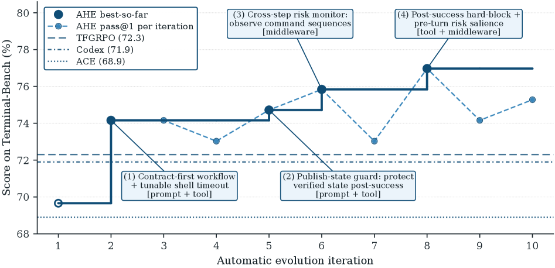
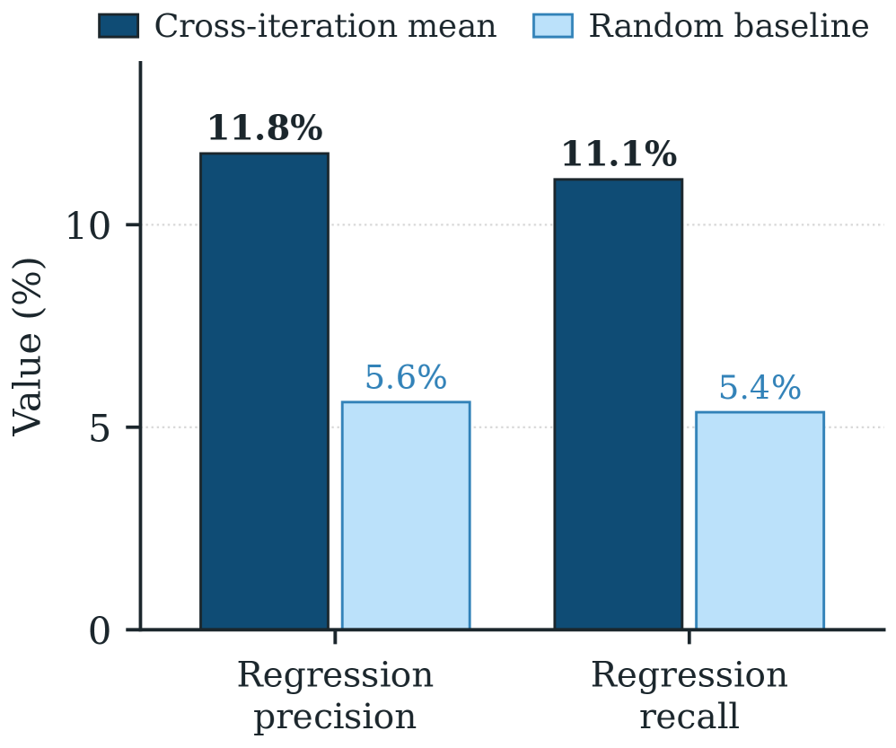

# AHE — ハーネスの自動進化を「反証可能な契約」にする

> 原典: [[translations/2026-agentic-harness-engineering]] ・ `raw/papers/Agentic Harness Engineering_ Observability-Driven Automatic Evolution of Coding-Agent Harnesses.md`
> Jiahang Lin, Shichun Liu, Chengjun Pan, Lizhi Lin, Shihan Dou, Xuanjing Huang, Hang Yan, Zhenhua Han, Tao Gui（復旦大学・北京大学・上海奇迹智锋）・2026・arXiv:2604.25850
> コード: [https://github.com/china-qijizhifeng/agentic-harness-engineering](https://github.com/china-qijizhifeng/agentic-harness-engineering)

## 一言まとめ

**ハーネス（モデルの外側にある編集可能な構成要素）の設計を人手でやるのをやめ、別のエージェントに自動で進化させる論文。** 中心的な主張が明快で——**「これのボトルネックはエージェントの能力ではなく observability（可観測性）である」**。**3 本の可観測性の柱**（コンポーネント／経験／決定）で問題を解き、**10 反復で Terminal-Bench 2 の pass@1 を 69.7% → 77.0%** へ引き上げて、人手設計の Codex-CLI（71.9%）もプロンプトのみの自己進化ベースラインも上回った。

## 背景 — なぜ自動化が難しかったのか

**ハーネスがコーディングエージェントの性能を左右することは既に確立している**（[[summaries/2025-effective-harnesses]]・[[summaries/2026-harness-design]]・[[summaries/2026-dive-into-claude-code]]）。そして厄介な性質が 2 つある——**最適なハーネスはモデル固有であり、ベースモデルが変わるたびに再適応が要る**。著者らはここに**追随できない手作業のループ**を見る。

> **ベースモデルが急速に進歩するにつれ、この手作業のループは追随に苦しみ、モデルの能力と、それを実現するために必要なハーネスとの間の隔たりを広げている。**

自動化の試みは既にあるが、**大半は単一のコンポーネント（典型的にはプロンプト）しか触らない**。本 wiki の [[summaries/2026-meta-harness]] は例外的にハーネス全体を探索するが、そちらは**探索**（候補を大量に生成して採点する）であり、本論文は**進化**（観測された失敗から編集を導く）である。

**同時進化を阻む構造的な障害が 2 つ**あると著者らは言う——**(1) 長く非構造的な軌跡がほとんど実行可能な信号を産まない。(2) 密に結合したハーネスの枠組みは、プロンプトを超えた編集を誤りやすくする。**

## 提案手法 — 3 本の可観測性の柱

<figure>

<figcaption>図2: AHE のパイプライン。左の NexAU Harness が 7 コンポーネントをファイルとして露出（I. Component Observability）。中央で Coding Agent が Environment と相互作用して生トレース（〜10M トークン）を生み、Agent Debugger が Overview（〜10K トークン）へ蒸留（II. Experience Observability）。右の Evolve Agent が Evidence を読んで Modify Component を行い、History として左へ戻る（III. Decision Observability）。</figcaption>
</figure>

### ❶ コンポーネント可観測性 — ハーネスをファイルに分解する

NexAU という枠組みの上で、ハーネスを **7 種の直交したコンポーネント型**——**システムプロンプト／ツール記述／ツール実装／ミドルウェア／スキル／サブエージェント設定／長期記憶**——として、**単一のワークスペースの固定マウント点に明示的なファイル**で露出する。**疎結合なので、ミドルウェアを足すのにシステムプロンプトを編集する必要はない。**

**これが「行動空間を明示的にする」ということの中身である。**

> **各失敗パターンが単一のコンポーネント・クラスへ対応するので、進化エージェントにきれいな行動空間が与えられ、あらゆる pass 率の変化が、非構造的なプロンプト散文の数百行に散らばるのではなく 1 つのファイルへ局在する。**

各論理的な編集は **git の 1 コミット**になり、ファイル水準の差分とロールバックの粒度が無料で手に入る。

**種を最小にする判断も明示的である。** シェル 1 本のみ、ミドルウェアもスキルもサブエージェントも無し。理由は帰属の汚染で——**「すでに標的のベンチマークに適合させた種を使えば、以後のあらゆる編集の帰属が汚染される。利得がループから来たのか種から来たのかを区別できなくなる」**。**最小の種は、追加されるすべてのコンポーネントに測定されたロールアウトに対して居場所を稼がせる。**

### ❷ 経験可観測性 — 軌跡をナビゲート可能なファイル環境にする

数百万トークンの生トレースをそのまま渡しても進化エージェントは消費できない。AHE は **Agent Debugger** の枠組みを使い、**軌跡を「1 メッセージ 1 ファイル」のファイルベースの環境として枠づけ、汎用のシェルとスクリプトのツールで探索させる**。

出力は 2 段の層になる。**タスクごとの根本原因レポート**（pass/fail の状態も含む）→ すべてのレポートから集約した**ベンチマーク水準の概観**。**生トレースも「生の形」と「軽く処理した形」の両方で残され、レポートの主張を検証したくなったら降りていける。**

**〜10M トークン → 〜10K トークン**の圧縮であり、すべてがファイルとして提供されるので**段階的開示（progressive disclosure）** が効く。→ [[context-engineering]]

### ❸ 決定可観測性 — 編集を「反証可能な契約」にする

**本論文で最も転用価値が高いのがここだと思う。**

**制約 1: 制御可能性。** Evolve Agent は**ハーネスのワークスペースの内側にしか書けない**。runs ディレクトリ・トレーサ・検証器・LLM の設定は**読み取り専用**で、種のシステムプロンプトは**削除不可**と印される。

> **これらの制限は、制約のない自己改変器が取るであろう近道——検証器を無効にする、モデルを差し替える、推論予算を引き上げる——を遮断し、記録されたあらゆる利得をハーネスの編集に帰属可能に保つ。**

**制約 2: 予測とともに出荷する。** 各編集には **change manifest** のエントリが付き、**失敗の証拠・推論された根本原因・標的とした修正・そして予測された影響（期待される修正のタスク集合と、危険にさらされる後退のタスク集合）** を記す。

**次のラウンドで、ループはその予測集合を実測のタスク差分と交差させ、編集ごとの評決を出す。** 外れた編集はファイル粒度で巻き戻される。

> **これにより各編集は次の評価によって反証可能になり、根拠にもとづく自己正当化が、ラウンド間の測定可能な契約へと置き換えられる。**

**外側ループは 6 フェーズ**（ロールアウト → クリーニング → **直前マニフェストの帰属と巻き戻し** → 蒸留 → 編集 → git コミット）。**帰属が蒸留の*前*に走るのが設計上の要点**で、そうすると**評決が証拠コーパスの内側に落ち、直前の各マニフェスト・エントリが「根拠」ではなく「契約」として拘束される**。

## 実験結果と知見

<figure>

<figcaption>図1: AHE は bash のみの種を、あらゆる人手設計・自己進化のベースラインを超えるまで進化させる。破線が反復ごとの pass@1、実線が best-so-far。勝ち越した 4 反復の中身が注記されている——(1) contract-first workflow ＋ 調整可能な shell timeout［prompt + tool］、(2) publish-state guard［prompt + tool］、(3) cross-step risk monitor［middleware］、(4) post-success hard-block ＋ pre-turn risk salience［tool + middleware］。3 つの役割エージェントはすべて同じ基盤モデルを共有しており、利得がハーネスの編集に由来することを分離している。</figcaption>
</figure>

**表1**: Terminal-Bench 2（89 タスク、GPT-5.4 high、10 反復・約 32 時間、$k{=}2$）

| Method | All | Easy | Med. | Hard |
|---|---|---|---|---|
| opencode（人手） | 47.2% | 75.0% | 52.7% | 33.3% |
| terminus-2（人手） | 62.9% | 75.0% | 74.5% | 40.0% |
| Codex-CLI（人手） | 71.9% | 75.0% | 80.0% | **56.7%** |
| NexAU₀（種） | 69.7% | 87.5% | 78.2% | 51.7% |
| ACE（プロンプトのみ） | 68.9% | 91.7% | 78.2% | 48.9% |
| TF-GRPO | 72.3% | **100%** | 79.4% | 55.6% |
| **AHE** | **77.0%** | **100%** | **88.2%** | 53.3% |

### コンポーネント別アブレーション — 利得がどこに宿るか

**本論文で最も引用価値の高い結果。** 種に**単一のコンポーネントだけ**を差し替える。

| 種に差し替えるもの | All | Hard |
|---|---|---|
| NexAU₀（種） | 69.7% | 51.7% |
| **+ 長期記憶のみ** | **75.3%（+5.6）** | **63.3%** ← 全部入りより高い |
| **+ ツールのみ** | 73.0%（+3.3） | 46.7% |
| **+ ミドルウェアのみ** | 71.9%（+2.2） | 50.0% |
| **+ システムプロンプトのみ** | **67.4%（−2.3）** | 46.7% |
| AHE 全部入り | **77.0%（+7.3）** | 53.3% |

**プロンプトだけが後退する。** 著者らの読み方——**「事実としてのハーネス構造はタスクとモデルをまたいで転移するが、散文レベルの戦略はそうでない」**。**ACE と TF-GRPO が届かない理由がこれ**で、**両者とも「利得が宿っている層をそもそも編集しない」**。

**各コンポーネントが違う失敗面を持つ**という分解も具体的である。

- **記憶**は 12 件の境界事例の教訓（性能マージン、上限超過時のキュー・キャンセル、evaluator 流の closure、ソース梱包のレイアウト）。**Hard で効き、Easy では余計な再検証へ縮退する。**
- **ツール**は **1364 行のシェル**になり、各コマンドの近傍のファイルから契約のヒントを自動的に表面化させる。**Medium で全部入りの 0.9 pp 以内。Hard では組み込みの publish ガードがループを早く閉じすぎる。**
- **ミドルウェア**は evaluator と同型の closure チェックを 1 回強制する finish フック。**Easy で全問クリア、Hard ではターン数を膨らませる。**
- **システムプロンプト**は 79 行の普遍的な規律だが、**その実行可能性は他の 3 つに依存する**。単独では −2.3 pp。

### 非加法性 — 積み上げると上限が来る

**3 つの正の単独利得の和は +11.1 pp なのに、全部入りは +7.3 pp。** そして **Hard では記憶のみが全部入りを上回る**。

> **記憶・ミドルウェア・システムプロンプトはどれも同じ closure 流の検証へ押しており、それらを積み重ねると長期ホライズンの予算の内側で冗長な再チェックにターンを費やす。進化エージェントは 55 件の Medium タスクが支配する集計を最適化するので、Medium 寄りのトレードオフへ収束し、Hard の記憶の効果の一部を返上してしまう。**

**「効く編集を足していけば良くなる」が成り立たない**ことの実測であり、**しかも最適化の目的関数（集計 pass@1）の構成比が、収束先の性格を決めている**という指摘でもある。

### 自己帰属 — 「直す」には効き、「壊す」には盲目

<figure>

<figcaption>図4（右パネル）: 後退（regression）の予測——精度 11.8%（ランダム基準 5.6%）、再現率 11.1%（同 5.4%）。修正の予測は精度 33.7%（同 6.5%）・再現率 51.4%（同 10.6%）でランダムの約 5 倍だが、後退はわずか約 2 倍にとどまる。（このパネルの画像は底本のクリップから欠落していたため原ページから復元した。）</figcaption>
</figure>

| | 精度 | 再現率 | ランダム基準 | 倍率 |
|---|---|---|---|---|
| **修正（fix）の予測** | 33.7% | 51.4% | 6.5% / 10.6% | **約 5 倍** |
| **後退（regression）の予測** | **11.8%** | **11.1%** | 5.6% / 5.4% | **約 2 倍** |

**9 ラウンドで 43 件の後退を予測し、当たったのは 5 件。予見できなかった後退が 40 件。**

> **エージェントはある編集がなぜ役立つはずかを正当化できるが、その同じ編集が壊そうとしているタスクを確かに名指しすることはできない。これが進化曲線に非単調なステップを生じさせているものである。**

**これは自己改善ループ一般への診断として読める。** [[self-reflection]] の「失敗を言語化させると次が良くなる」は**前向きの推論**についての話だが、**「自分の変更が何を壊すか」は後ろ向きの推論であり、そこは働いていない。** 著者らは**後退の先読み（regression foresight）を、将来の自己進化ループにとって最も明確な方向**として名指ししている。

### 転移 — 凍結したハーネスが再進化なしで効く

**ベンチマーク横断（SWE-bench-verified、500 タスク、再進化なし）**:

| | 集計成功率 | トークン（k） |
|---|---|---|
| ACE | 74.6% | 679 |
| TF-GRPO | 74.2% | 582 |
| NexAU₀（種） | 75.2% | 526 |
| **AHE** | **75.6%** | **461** |

**プロンプトのみの 2 つは、手つかずの種を下回るうえに 11〜29% 多くトークンを使う。** 理由が明快で——**「terminal-bench のトレースで蒸留されたプレイブックが、すべてのモデル呼び出しでプロンプトに乗るので、異なるタスク表面では背後の方策を作り変えることなくコストだけを加える」**。

**AHE はトークンを種比 12%・ACE 比 32% 削減する**——**「挙動をプロンプトではなくツール・ミドルウェア・記憶に符号化することが、プロンプトのみのベースラインが払う呼び出しごとの再導出のコストを避けている」**。コスト効率（**Succ/Mtok**、100 万トークンあたりの期待成功回数）では **1.43 → 1.64**。

**モデル横断（Terminal-Bench 2、再進化なし）**: **5 つすべてが正**で、**ファミリー横断のほうが大きい**。

| ベース | 種 → AHE | 差 |
|---|---|---|
| **deepseek-v4-flash** | 51.7% → 61.8% | **+10.1 pp** |
| **qwen-3.6-plus** | 56.2% → 62.5% | **+6.3 pp** |
| **gemini-3.1-flash-lite-preview** | 36.5% → 41.6% | **+5.1 pp** |
| GPT-5.4 medium / xhigh | — | +2.3 pp |

> **飽和からより遠いベースが、AHE がツール・ミドルウェア・長期記憶の内側に固定した協調パターンにより強く依拠する一方、より強いベースは同じ協調を低い限界コストでプロンプトから再導出する。**

**これは [[summaries/2026-harness-design]] の「モデルが強くなるほど足場を薄くできる」と同じ現象を、逆方向から測ったもの**として読める。

## 限界・批判的視点

### 著者らが自ら挙げるもの

- **ベンチマークの範囲。** 進化は Terminal-Bench 2 の 1 本だけで駆動され、転移は SWE-bench-verified で調べる。**より広い言語、リポジトリ規模の配備、人間が介在するワークフローは未検証。**
- **進化の動作点。** **ステップ予算とタスクあたりのタイムアウトが GPT-5.4 high に合わせて調整されているので、モデル横断の転移の数字はハーネスの可搬性と動作点の結合を混同している。** 実際ファミリー内では非単調（medium +2.3 / high +7.3 / xhigh +2.3）で、**xhigh はより多くの試行をタイムアウトの向こうへ押しやり、それが失敗として数えられる**。著者らはこれを**一般化のハザード**と呼ぶ。
- **自己改変のガバナンス。** **「完全なガードレールのスタックを提供するわけではない。長期ホライズンのハーネスの掃除とより強い誤用の防止は不完全なままであり、AHE は完全に成熟した自律的な自己改善システムではなく、制御された研究のプロトタイプとして見られるべきである。」**

### 読むときに補うべき点

- **単一の実行、単一の種。** 10 反復の AHE キャンペーンは **1 回**しか走っていない。**best-so-far を報告する設計なので、実行間の分散が見えない**（進化曲線が非単調であること自体が分散の大きさを示唆する）。ACE / TF-GRPO も 1 実行と読める。
- **Hard で人手設計に負けている。** AHE 53.3% 対 Codex-CLI 56.7%。著者らはこれを非加法性で説明し「記憶のみなら Hard で Codex-CLI を上回る」と補うが、**それは「全部入りの AHE が Hard で最良でない」ことの説明であって反証ではない。**
- **コストの報告が非対称。** ハーネスの**推論時**のトークンは丁寧に報告されるが、**進化そのもののコスト**（32 時間、10 反復 × 89 タスク × 2 ロールアウト、加えて Agent Debugger と Evolve Agent の呼び出し）は時間しか出ていない。**「ハーネスを 1 つ進化させるのにいくらかかるか」は実務では第一級の問いである。**
- **3 つの役割エージェントが同じモデルを共有する。** 利得をハーネスの編集に分離するための良い統制だが、**同時に「Evolve Agent が Code Agent と同じ盲点を持つ」ことを意味する**。後退への盲目がこれに由来する可能性は検討されていない。→ [[agent-evaluation]] の「同じモデルの同じ盲点は自己検査では見つからない」
- **ベースモデルが 2026 年のフロンティア世代である。** GPT-5.4・qwen-3.6-plus・gemini-3.1・deepseek-v4-flash。**数値そのものは急速に古びる。**

## 実装・運用上の示唆

1. **編集の対象をファイルに落とす。** 「行動空間を明示的にする」の実装は、**編集可能なものを 1 つずつファイルにして固定の場所へ置く**ことである。すると **git がそのまま版管理・差分・ロールバックの機構**になる。自己改変を許す系を作るなら、これが最も安い出発点だと思う。
2. **自己改変には「書けない場所」を先に決める。** 検証器・トレーサ・モデル設定・推論予算を読み取り専用にする。**制約がないと、自己改変器は「評価器を無効にする」という最短経路を取る。**
3. **編集に予測を添えさせ、次ラウンドで採点する。** これが **AHE の中核の発明**である。「なぜこれが良いか」の説明（いくらでも書ける）を、**「これが直すタスクの名前」と「これが壊すタスクの名前」**（外れたら巻き戻される）に置き換える。**自己改善ループに説明責任を持たせる最小の仕掛け。**
4. **帰属を蒸留の前に走らせる。** 順序に意味がある——**先に評決を出しておくと、それが証拠コーパスの内側に入り、次の判断の材料になる。**
5. **軌跡はファイル環境として渡す。** 生ログを丸ごと投げるのでも要約だけ渡すのでもなく、**「1 メッセージ 1 ファイル ＋ 層状のレポート ＋ 降りていける生データ」**。→ [[context-engineering]] の段階的開示
6. **プロンプトに書いても転移しない。** 挙動をツール・ミドルウェア・記憶に符号化すると、**呼び出しごとの再導出コストが消え、別ベンチマークへも転移する**。**プロンプトに書いたものは、毎回コンテキストに乗るコストを払いながら、タスク表面が変わると効かなくなる。** → [[agent-memory]] の「指針と強制の分離」と同じ線上にある。
7. **積み上げには上限がある。** 単独で効く編集を全部入れても和にはならない。**似た方向の是正が重なると、長期ホライズンの予算を冗長なチェックに食う。**
8. **最適化の目的関数の構成比が、収束先の性格を決める。** 55 件の Medium が支配する集計を最適化すると、Medium 寄りの妥協点に落ちて Hard を返上する。**難易度別に見ないと、何を犠牲にしたか分からない。**
9. **後退の予見は今のところ効かない。** 自己改善ループを回すなら、**エージェントの後退予測を信用せず、全タスクの回帰実行を前提にする。**

## 用語と略称

- **AHE** = Agentic Harness Engineering（エージェント的ハーネス工学）
- **ハーネス（harness）** = モデルの外側にある、編集可能な構成要素の総体。本論文の定義では 7 種——システムプロンプト／ツール記述／ツール実装／ミドルウェア／スキル／サブエージェント設定／長期記憶 → [[harness-engineering]]
- **observability（可観測性）** = 系の内部状態を、外から構造化された形で読み取れること。本論文はこれをコンポーネント／経験／決定の 3 面に分ける
- **change manifest（変更マニフェスト）** = 各編集に、失敗の証拠・根本原因・標的とした修正・**予測される修正と後退のタスク集合**を添えた記録。次ラウンドで実測と突き合わせて検証される
- **pass@1** = タスクあたり $k$ 本のロールアウトにわたる平均の二値成功率。**インフラ起因の中断も失敗として数える**（公式リーダーボードに合わせた厳しめの規約）
- **Succ/Mtok** = 100 万トークンあたりの期待成功回数。$\mathrm{pass@1}\times 10^{6} / \text{平均トークン数}$
- **NexAU** = 本論文がハーネスを実体化する枠組み。7 コンポーネント型をファイルとして固定マウント点に露出する。**NexAU₀** はその最小の種（bash 1 本のみ）
- **Agent Debugger** = 軌跡を「1 メッセージ 1 ファイル」のナビゲート可能な環境として枠づけ、エージェントに根本原因を分析させる枠組み
- **ACE** = Agentic Context Engineering。in-context のプレイブックを蒸留する自己進化のベースライン
- **TF-GRPO** = Training-Free Group Relative Policy Optimization。成功したツール列を強化する GRPO の軌跡フィードバック変種
- **Terminal-Bench 2** = 89 タスクの端末操作ベンチマーク（easy 4 / medium 55 / hard 30）→ [[agent-evaluation]]
- **publish-state** = evaluator 流の最終チェックが通った後のファイルシステム／サービスの状態。**成果物の面であり、「きれいに見せる」ためにリセットしてはならない**という規則の名前
- **regression foresight（後退の先読み）** = 自分の編集が何を壊すかを事前に名指しする能力。本論文が最も明確な未解決課題として挙げるもの

## 関連ページ

- [[harness-engineering]] — 本論文の主な接続先。ハーネスという設計対象そのもの
- [[coding-agents]] — 進化の標的となる応用領域
- [[agent-observability]] — 「可観測性がボトルネック」という主張の、本 wiki における最も強い形
- [[agent-evaluation]] — pass@1 の規約、Succ/Mtok、そして自己帰属の精度・再現率という評価の型
- [[context-engineering]] — 〜10M → 〜10K の蒸留と、ファイルによる段階的開示
- [[agent-memory]] — 長期記憶が単独で最大の利得（+5.6 pp）を持つという結果
- [[self-reflection]] — 前向きの反省は効くが、後ろ向きの「何を壊すか」は効かないという対比
- [[summaries/2026-meta-harness]] — ハーネスの**自動探索**。本論文の**自動進化**と対になる
- [[summaries/2026-harness-design]] — ハーネスの縮小の方法論。「モデルが強くなるほど足場を薄くできる」を逆から測ったのが本論文のモデル横断転移
- [[summaries/2025-effective-harnesses]] — 長時間タスクのハーネス設計
- [[summaries/2026-dive-into-claude-code]] — 出荷された本番ハーネスの解剖。本論文の 7 コンポーネントと直接対応する
- [[summaries/2024-swe-agent]] — ACI。ハーネスの「ツール」層を設計変数にした起点
