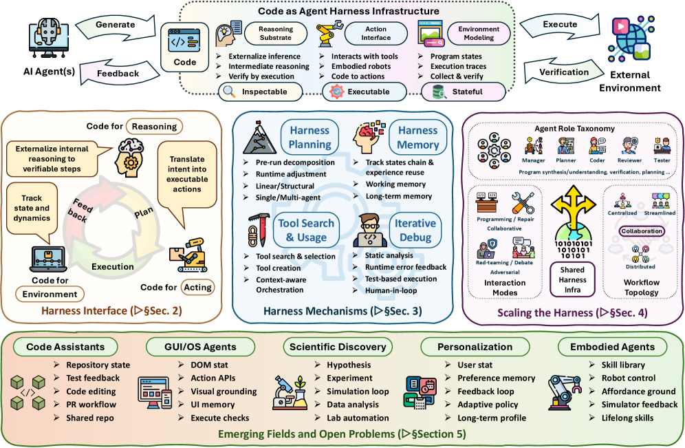
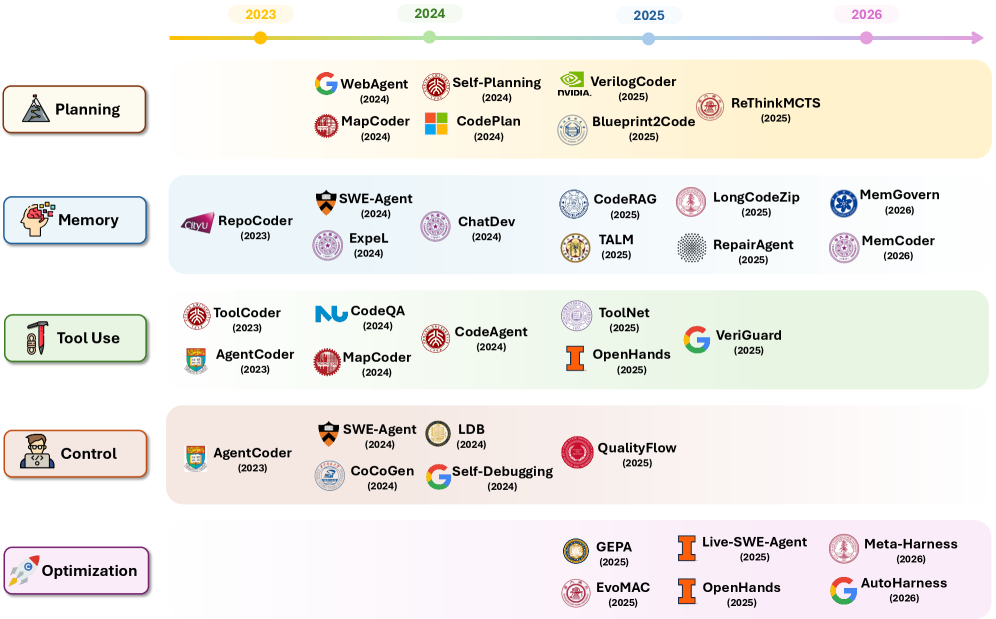
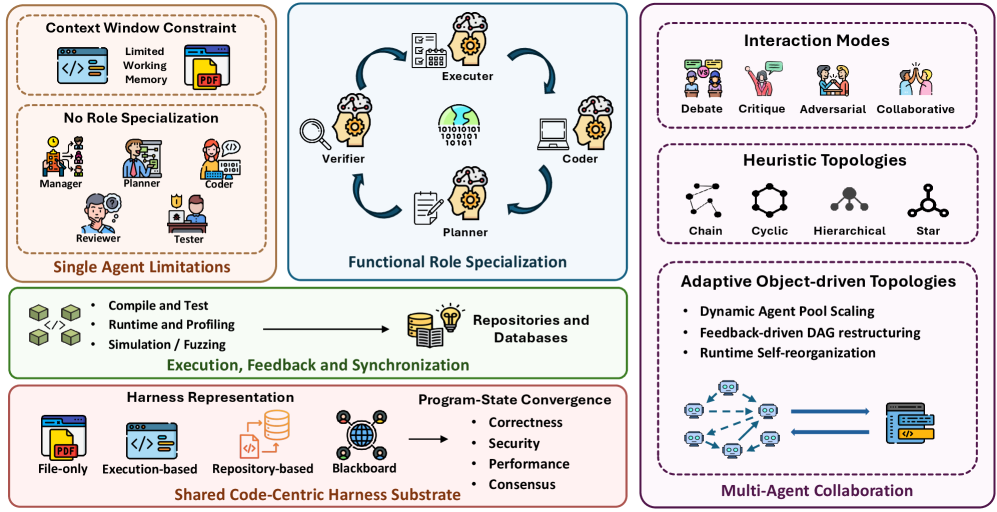
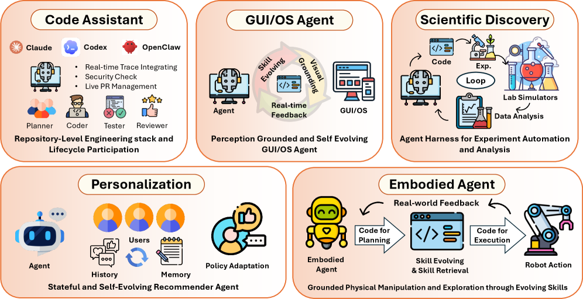

# Code as Agent Harness — 実行可能・検証可能・状態を持つエージェント系へ向けて

> 原典: [[translations/2026-code-as-agent-harness]] ・ `raw/papers/Code as Agent Harness ◆ Toward Executable, Verifiable, and Stateful Agent Systems ◆.md`
> 著者: Xuying Ning, Katherine Tieu, Dongqi Fu, Tianxin Wei, Zihao Li, Yuanchen Bei ほか全 42 名（University of Illinois Urbana-Champaign / Meta / Stanford University）
> 出典: arXiv:2605.18747（2026）・[GitHub リポジトリ](https://github.com/YennNing/Awesome-Code-as-Agent-Harness-Papers)

## 一言まとめ

**「コードは LLM が生成する成果物である」という見方を捨て、「コードは LLM エージェントが推論し・行動し・環境を表現し・状態を保存するための*運用基盤*である」という見方（code as agent harness）へ組み替えた、2026 年時点の大規模サーベイ。** ハーネス・インターフェース（§2）→ ハーネス機構（§3）→ ハーネスのスケーリング（§4）→ 応用と未解決問題（§5）の 4 層で 11 の表と 12 の図にわたり文献を整理し、**マルチエージェント系の中心的な欠落として「形式的で永続的な共有プログラム状態の表現がない」ことを名指しする立場表明**を含む。

## 背景と問題意識

[[harness-engineering]] のページで追ってきたとおり、2026 年前半にかけて「モデルの周りのソフトウェア層＝**agent harness**（エージェント・ハーネス）が性能を左右する」という認識が一気に広がった。しかしそれまでの議論は **Claude Code や Codex のような個別の系の解剖**（[[summaries/2026-dive-into-claude-code]]）か、**ハーネスの自動改善の手法**（[[summaries/2026-agentic-harness-engineering]]）に偏っており、「ハーネスを構成する材料そのものは何か」を横断的に整理した文献はなかった。

本サーベイの出発点は、**コードがエージェント系の中で果たす役割が既に「出力」から「基盤」へ移り終えている**という観察である。program-aided reasoning（[[reasoning-and-planning]] の PAL / PoT）はコードを推論の外部化に、Voyager のスキルライブラリはコードを行動の永続化に、SWE-bench 的な環境はリポジトリ・テスト・実行トレースを環境の表現に使っている。**バラバラに見えるこれらは、すべて「コードを実行可能・検査可能・状態を持つ媒体として使う」という 1 つの動きの断面である**——というのが本論文の枠づけである。

### 3 要素の区別（本サーベイの立脚点）

本サーベイが最初に置く区別は、長期実行のエージェント系を構成する **3 つの要素**である。ここが以降の整理の軸になる。

| 要素 | 中身 | 研究の状況 |
| --- | --- | --- |
| **model-internal capabilities**（モデル内在の能力） | 推論・知覚・計画・シミュレーション・評価 | 基盤モデル研究の主戦場 |
| **system-provided harness infrastructure**（系が提供するハーネス・インフラ） | 事前定義されたツール・API・サンドボックス・記憶系・検証器・権限境界・テレメトリ・ワークフロー | **ハーネス工学の主たる焦点** |
| **agent-initiated code artifacts**（エージェント発のコード成果物） | エージェントが実行ループの中で自ら書き・実行し・観測し・改訂し・永続化し・共有するコードオブジェクト（回帰テスト・一時的なツール・DSL プログラム・実行可能なワークフロー・再利用可能なスキル・中間的なプログラム状態） | **相対的に未探索**——本サーベイが焦点を当てる場所 |

3 番目の要素が本サーベイのオリジナリティで、**「人間が設計した固定のハーネス」と「エージェント自身が実行時に書き足すハーネス」を分けた**点が新しい。[[summaries/2026-agentic-harness-engineering]]（AHE）が扱ったのは 2 番目の要素をメタエージェントが書き換える話であり、本サーベイはそれを 3 番目の要素とつなげて 1 つの絵に収めている。

### 範囲の境界（scope boundary）

「コード」を比喩に薄めないための線引きも明示されている。**コードとは実行可能あるいは機械検査可能な成果物**——プログラム・スクリプト・形式仕様・証明スクリプト・API スキーマ・ツール定義・テスト・リポジトリ・シミュレータ・設定ファイル・実行系が生成／消費するトレースやログ——である。**生の知覚・物理状態・人間の意図・モデル内在の潜在的推論はコードではない。** これらはコードを通じて感知・推定・直列化・検証されうるが、コードのインターフェースそのものと混同してはならない、と釘を刺している。サーベイでこの種の境界を先に切るのは珍しく、後半のマルチモーダル論（§5.2.6）でこの線が効いてくる。

## 提案手法 / 主張

<figure>

<figcaption>図1（再掲）: code as agent harness の分類。ハーネス・インターフェース（§2）→ ハーネス機構（§3）→ ハーネスのスケーリング（§4）→ 応用と未解決問題（§5）の 4 層構成。</figcaption>
</figure>

### 層 1: ハーネス・インターフェース（§2）— コードが「入口」になる 3 つの役割

コードがハーネス・インターフェースとして機能する理由を、**実行可能（executable）／検査可能（inspectable）／状態を持つ（stateful）** の 3 性質に還元する。それぞれが「ハーネスがモデルの意図を検証できる／失敗を診断して戻せる／履歴がステップ間で失われない」に対応する。

- **Code for reasoning（推論のためのコード）** — PAL / Program-of-Thoughts のような**プログラムに委譲された推論**、Lean・Isabelle・Coq を使う**形式検証と記号推論**（DeepSeek-Prover-V2、Kimina-Prover、Goedel-Prover-V2、そして Lean4 でエージェントのワークフロー自体を検証する Lean4Agent）、実行トレースを報酬に変える**反復的なコード接地推論**の 3 型。
- **Code for acting（行動のためのコード）** — 接地されたスキル選択、プログラム的な方策生成、**生涯学習するコードベースのエージェント**（Voyager 系）の 3 型。
- **Code for environment modeling（環境モデリングのためのコード）** — 構造化された世界表現、実行トレースによる世界モデリング、コードに接地された評価環境、**検証可能な環境の構築**の 4 型。

### 層 2: ハーネス機構（§3）— 5 つの制御面

<figure>

<figcaption>図4（再掲）: エージェントのハーネス機構のロードマップ。計画・記憶・ツール使用・PEV 制御・ハーネス最適化の 5 カテゴリ。</figcaption>
</figure>

ここが本サーベイの本体で、**[[agent-loop]] の構成要素をハーネスの語彙で書き直した**部分にあたる。

1. **計画（§3.1）** — 線形分解 / 構造に接地 / 探索にもとづく / **オーケストレーションにもとづく**の 4 型。最後の型では、計画は事前の成果物ではなく「失敗がどう検出され・解釈され・後続の行動へルーティングされるか」から**創発する性質**として扱われる。Natural-Language Agent Harnesses（役割・段階・契約・アダプタ・状態の規約を編集可能な自然言語として書き、Intelligent Harness Runtime が実行する）を最も一般的な定式化として挙げる。
2. **記憶とコンテキスト工学（§3.2）** — 作業／意味／経験／長期／マルチエージェントの 5 記憶に、横断的な機構として**コンテキストの圧縮と状態の退避**（context compaction and state offloading）を加える。「どの観測が能動的コンテキストに残り、どれが要約へ圧縮され、どれが検索ハンドル付きで外部ストレージへ退避されるか」を決めるのがハーネスの仕事だ、という整理は [[context-engineering]] の主張とそのまま重なる。
3. **ツール使用（§3.3）** — 機能指向 / 環境相互作用 / 検証駆動 / ワークフロー・オーケストレーションの 4 型。**「モデルがツールを呼べるか」はもはや課題ではなく、「ハーネスがツール使用を安全で・監査可能で・長期ホライズンに有用にできるか」が課題である**と言い切る。ライフサイクル・フック（使用前に引数を検証し危険なコマンドを遮断、使用後に出力をサニタイズし記憶を更新）を境界の精緻化として位置づける。
4. **Plan–Execute–Verify（PEV）ループによるハーネス制御（§3.4）** — 本サーベイの最も有用な造語。**デバッグを「事後の訂正の段階」ではなく「実行可能なプログラム状態に対する制御」として捉え直す**枠組みで、ハーネスは**サイバネティックな統治者（cybernetic governor）**として働く。
5. **エージェント的ハーネス工学（§3.5）** — 深いテレメトリ → 進化エージェント → 統治されたハーネスの変異。詳細は [[summaries/2026-agentic-harness-engineering]] と重なるので後述。

#### PEV ループの中身（§3.4）

| フェーズ | ハーネスの仕事 | キーワード |
| --- | --- | --- |
| **Plan** | 要求を**次の状態遷移についての明示的な契約**へ変える。関連ファイル・期待される不変条件・検証コマンド・巻き戻し地点・危険な操作を特定する | 契約の形成（contract formation）。AGENTS.md 形式の指針・MCP サーバーのレジストリ・型付きツールのスキーマが、行動空間を**実行前に**検査可能にする |
| **Execute** | 隔離されたファイルシステム・シェル・ランタイム・資源境界の中で計画を有界な状態遷移として実現する。**読み取り専用 / サンドボックス編集 / 完全アクセス**の 3 層に権限を分ける | サンドボックス化と権限づけ。完全アクセス層（ネットワーク・資格情報・配備・パッケージ公開・Git 履歴の変更）は**必須の HITL ゲート**で守る |
| **Verify** | linter・パーサ・コンパイラ・型検査器・テスト・静的解析器・fuzzer・ランタイムモニタ・CI という**決定論的センサ**で新しい状態を検査する | **自然言語の批評はセンサの出力を*置き換える*のではなく*解釈する*べきである**。終了はモデルの確信ではなく検証によって統治される |

この 3 分割は、[[agent-safety-and-guardrails]] の権限設計と [[agent-evaluation]] の検証設計を、1 本のループの中の 2 つのフェーズとして接続している点に価値がある。

### 層 3: ハーネスのスケーリング（§4）— マルチエージェントと「中心的な隙間」

<figure>

<figcaption>図10（再掲）: コードの上のマルチエージェント・オーケストレーションによるハーネスのスケーリング。単一エージェントのコンテキスト・特化・自己訂正の限界に、役割特化・共有基盤・実行フィードバック・適応的トポロジで対処する。</figcaption>
</figure>

単一エージェントの限界を **(1) コンテキストウィンドウ、(2) 特化の要求、(3) 独立した協調・検証チャネルの欠如**の 3 点に整理したうえで、ChatDev / MetaGPT / MAGIS / HyperAgent / L2MAC / EvoMAC / SEW など 20 以上の系を、**役割の特化・相互作用モード・ワークフローのトポロジ・実行フィードバック・収束**の 5 軸で分解する（表 9〜11）。詳細は [[multi-agent-systems]] 側に移した。ここでは本サーベイ最大の主張だけを引く。

#### 立場表明: 共有ハーネス基盤の 4 水準と "The Central Gap"

「これらのエージェントが住まう基盤とは何か」に対して、既存の系が共有状態を表現する**形式化の 4 水準**を区別する。

| 水準 | 何を共有基盤とみなすか | 代表系 | 限界 |
| --- | --- | --- | --- |
| **暗黙／ファイルのみ** | 現在のコードファイル（群）。共有状態は各呼び出しで会話履歴から**暗黙に再構成される** | ChatDev, MetaGPT, FlowGen, MapCoder, CodeCoR, SEW, CodePori | エージェントの信念が真の状態から乖離しても**系にとって不可視**で検出も訂正もできない |
| **リポジトリにもとづく** | ディレクトリ構造・依存グラフ・呼び出し階層・版履歴を持つナビゲート可能なリポジトリ | MAGIS, HyperAgent, Lingma SWE-GPT, SyncMind | 静的な構造しか見えない |
| **実行にもとづく** | コードが「どう見えるか」ではなく「**何をするか**」——コンパイル可否・テスト・fuzzer の発見・速度・仕様との一致 | AgentCoder, AutoSafeCoder, QualityFlow, MACRO, EvoMAC, CANDOR, MAGE | 動的な振る舞いしか見えない |
| **黒板／共有状態** | すべてのエージェントが読み書きする明示的で大域的なデータ構造 | Self-Collaboration, **L2MAC**, GameGPT, Cogito | 権威と一貫性の問題を新たに作る |

**中心的な隙間（The Central Gap）**——「文献の大多数は暗黙／ファイルのみのカテゴリに位置し、共有ハーネス基盤の形式的なモデルを一切欠いている。**プログラムはマルチエージェントの諸領域の中で唯一、*実行される*成果物であり、形式的な共有基盤を錨づけできる客観的で非言語的な信号を生む。にもかかわらず、ほとんどの系はこの性質をアーキテクチャの水準で活用できていない。**」

### 層 4: 応用 5 領域と未解決問題（§5）

<figure>

<figcaption>図12（再掲）: コーディングアシスタント・GUI/OS エージェント・科学的発見・パーソナライゼーション・身体化エージェントという 5 領域にまたがる code as agent harness。</figcaption>
</figure>

## 応用 5 領域

本 wiki では **[[coding-agents]] と [[computer-use-agents]] は既存の概念ページ**で扱い、**身体化エージェント・科学的発見・パーソナライゼーションは概念ページを作らず本要約に留める**（→ [限界・批判的視点](#限界批判的視点)のデータギャップ）。

### (1) コーディングアシスタント（§5.1.1）

- **リポジトリ中心のワークスペース**——「関連ファイルをプロンプトに置く問題」ではなく「**大きく進化するコードベースの上にタスク固有の作業ビューを構築する問題**」。
- **実行可能な開発ハーネス**——Claude Code（ツール媒介のループ＋権限・フック・記憶・サブエージェント）、Codex / Copilot coding agents（管理されたクラウド／GitHub ネイティブのワークスペース、サンドボックス・ブランチ・承認・監査可能な PR 出力）、DeepAgents（計画・FS 状態・コンテキスト管理・コード実行・サブエージェント委譲を再利用可能な部品として露出）。[[model-context-protocol]] がこれらを標準化する層として位置づけられる。
- **潜在状態としての開発者の意図**——「機能するパッチ」と「メンテナが受け入れるパッチ」は違う。近年これは生成コードの ***organicity*（有機性）** と呼ばれ、アーキテクチャ・コーディングスタイル・内部 API 再利用への整合を指す。さらに **SWE-bench の「解決済み」イシューの一部は、真の意図推論ではなくイシュー本文への解の漏洩に依存している**という分析（Aleithan et al.）を引く。
- **蒸留面としてのハーネス（2026 年の決定的な展開）**——**本番のハーネスが次世代モデルの支配的な訓練データ源になりつつある**。Cursor Composer は実使用トレース上の継続的オンライン強化学習で訓練され、codex-1 / GPT-5-Codex / GPT-5.1-Codex-Max は Codex のハーネスのループを映す長期ホライズンの多ターン相互作用で明示的に訓練される。**「エージェント」と「エージェントを取り巻くハーネス」の境界が、それ自体として学習可能な面になりつつある。**
- **本番の数字**——Alibaba Cloud の LingmaAgent は社内イシューの **16.9% を完全自律で、43.3% を人手介入つきで**解決したと報告。
- **失敗帰属の未熟さ**——「なぜマルチエージェント系は失敗するのか」・Who&When・AgenTracer・AgentDebug の各研究が報告する**ステップ水準の帰属精度は最良で 14〜53%**。本番ハーネスは原理的なデバッグに必要な構造化トレースを欠いている。

### (2) GUI/OS エージェント（§5.1.2）

**「最も文字どおりの意味でのプログラム世界」**——観測はすべて実行可能なコード（HTML/CSS/レイアウト XML/アクセシビリティ API/フレームバッファ）のレンダリング出力であり、行動はすべて別のコードへの呼び出し（DOM イベント / adb シェル / キーストローク / Playwright スクリプト）である。POMDP $\langle\mathcal{S},\mathcal{A},\mathcal{O},T,R\rangle$ として定式化したうえで、**遷移関数 $T$ は学習されるのではなく*実行される*** 点を強調する。**方策 $\pi(a|h)$ は、履歴に条件づけられて次の実行可能なコード断片を発する「プログラム合成器」であり、環境がインタプリタである。** 詳細は [[computer-use-agents]] へ。

### (3) 自律的な身体化エージェント（§5.1.3）

- **静かに失敗する物理制約**——ロボットは作業空間の外側の物体を掴もうとしても明示的な失敗信号を出さない。**これが正しさの負担をランタイムから「行動生成の時点」へ移す。**
- **コードは接地インターフェースであり同時に安全境界でもある**——前者は高水準の意図を身体性を尊重するコマンドへ翻訳する（プリミティブなスキル呼び出し・合成された Python 制御方策・ビヘイビアツリー）。後者は実行時に許容される行動を制約する。
- **層状ハーネス**——基盤モデル（意味層: 目標解釈・分解・アフォーダンス推論・スキル選択・再計画）／コードと古典的ロボティクス（許容可能性の境界: 型付きロボット API・運動プランナ・検査とリプレイとバージョン管理）／知覚モデルと状態推定器（構造化状態への変換）／物理系と低水準コントローラ（運動学・衝突回避・接触力・安定性）。
- **身体化された記憶としてのスキルライブラリ**——「行動を検証可能にするのと同じ実行可能な形式が、それを保存可能で再利用可能にもする」。**§3.2 の他の記憶と決定的に違うのは、スキルがエージェントの*読む*ものではなく*再実行する*ものである点。** Voyager が開拓し、卓上操作・人間による訂正・視覚接地の再計画・継続学習へ広がり、GUI 領域（UI-Voyager）へも渡った。課題は**スキルの生成からライブラリの統治へ**（忘却・抽象・接地の整合）移った。

### (4) 科学的発見（§5.1.4）

**科学的方法そのものが「仮説 → 設計 → 実行 → 観測 → 改訂」の閉ループであり、その各遷移がますますプログラムで媒介される。** 仮説は微分方程式や生成モデルとして、実験プロトコルは XDL や Opentrons スクリプトとして、装置は Python API で、分析は Jupyter で。

具体的な到達点として引かれる数字が印象的である。

- **A-Lab**（バークレー）——58 個の目標リストから **41 個の新規無機化合物を 17 日間の連続運転で合成**。
- **Virtual Lab**——LLM の PI エージェントと配下の科学者エージェントが **92 個の SARS-CoV-2 ナノボディを設計、うち 2 個が JN.1 と KP.3 変異株への結合を検証**。数日間の模擬会議で。
- **Coscientist**——単一の英語プロンプトから、Emerald Cloud Lab と社内の液体ハンドリング系で **Suzuki / Sonogashira カップリングを自律的に計画・実行・分析**。
- **AlphaProof**——各「推論ステップ」を **Lean のタクティク**として表現し、証明支援系が検証してから状態を遷移させる。
- **MLE-bench**——最良の足場（o1-preview + AIDE 木探索）で **75 の Kaggle コンペのうち 16.9% が銅メダル水準**。
- **Chemputer / XDL**——文献に発表された任意の合成をハードウェア非依存の XDL へパースし、**（化学にとっての LLVM IR のように）任意の準拠ロボット・プラットフォームへコンパイルする**。

**「自律実験室では、エージェントの方策がコードであり、実験室がランタイムであり、出版の記録がログである。」** 本 wiki の [[summaries/2026-ai-scientist]] はこの領域の代表例にあたる（本サーベイも AI Scientist v1/v2 を中核事例として引いている）。

### (5) エージェントのパーソナライゼーション（§5.1.5）

他の 4 領域と決定的に違うのは、**環境がソフトウェアの系であるだけでなく、意図・満足・長期目標が部分的にしか観測されない「人間のユーザー」でもある**点。

- **編集可能な成果物としての選好状態**——ユーザーは真の関心ではなく便宜でクリックし、嫌いだからではなくタイミングでスキップし、セッションをまたいで目標を変える。**構造化された選好記憶なら、ユーザーが自然言語で保存された選好を訂正でき、系は次の推薦の前に状態を更新できる**（不透明な埋め込みのみの記憶にはできない）。
- **未解決課題**——**(a) 選好の接地**: テストに依拠できるコーディングアシスタントや、UI 状態を検査できる GUI エージェントと違い、**真のユーザー満足についての信頼できるオラクルが存在しない**。クリックやエンゲージメントは過度に最適化すると誤解を招くか有害ですらある。**(b) プライバシーと統治**: 長期ユーザーモデルは機微な行動パターンを含みうる。**(c) 多ステークホルダー性**: プラットフォームはエンゲージメント、クリエイターは露出、ユーザーは福祉や自律性を求める。**単一の報酬関数への縮約は利害の衝突を覆い隠す。**

## 実験結果と知見

サーベイなので独自の実験はないが、**文献横断で抽出された経験的パターン**が実質的な貢献になっている。特に §4.4 の 7 つのパターンが有用である。

1. **暗黙のハーネス状態という制約**——「暗黙の状態表現への依存は、スケーラビリティ上の便宜ではなく、**系の脆さの技術的な根**である」。
2. **コードに媒介されたチャネルは協調のボトルネックを取り除かない**——ファイル・API・diff・テスト・ログ・スキーマ・黒板はいずれも**部分的なチャネル**で、忠実度・遅延・範囲をトレードオフする。「テストは意味論を合否へ圧縮し、要約は詳細を犠牲にして文脈を節約し、ログは接地されているがノイズ混じりで、共有黒板は永続性を改善する一方で権威と一貫性の問題を作る」。**中心的な設計問題は「コードが存在するか」ではなく「どの成果物が権威を持つか・どう圧縮されるか・チャネル間の衝突をどう解決するか」。**
3. **実行フィードバックは言語的推論と形式的推論の橋**——ただし驚くべき発見が図式を複雑にする。**Self-Collaboration と QualityFlow は、LLM が模擬した実行が、実際にコードを走らせずに結果を予測するのに 98% 超の適合率・再現率を達成できることを示している**（QualityFlow の *Imagined Execution*: LLM が Python インタプリタを段階的に模擬し、MBPP で 98%+ を達成しつつ可視テストからのラベル漏洩を回避）。**実行フィードバックの価値は失敗モードにわたって一様ではない**——ランタイムのクラッシュ・資源枯渇・境界条件・性能後退のような「言語的模擬が構造的に想像できないコーナーケース」に優れるが、多くの訂正可能なバグには模擬推論で足りる。**成熟したハーネスは、言語的推論を高速経路とし、必要な失敗モードにのみ実行を検証オラクルとして委譲するだろう。**
4. **共有ハーネスの 2 つの補完的表現**——リポジトリ・ビュー（構造）と実行ビュー（振る舞い）は概念的に直交するが、**どの系も両者を単一の基盤へ統一していない**。「どの構成要素が遅いか」（呼び出しグラフ＋プロファイリング）や「このリファクタリングは外部が依存する API を壊すか」（静的解析＋動的テスト）に答えるには両方が要る。
5. **トポロジの複雑さはハーネス状態の形式性と*逆相関*する**——最も明確な形式的基盤（永続ファイルストア＋明示的コンテキスト・スケジューリング）を持つ **L2MAC は単純な逐次連鎖**で足りるのに対し、暗黙状態の EvoMAC / SEW は動的 DAG・ワークフロー変異・エージェントプール・スケーリングという手の込んだ適応的トポロジを発達させる。**トポロジの複雑さは部分的には「症状」である。**
6. **文脈管理は暗黙の共有状態が払う「税」である**——L2MAC の Control Unit、MetaGPT の publish-subscribe プール、SoA のプール・スケーリング、Cogito の 3 層記憶は**すべて同じ背後の問題への応答**（どのコンテキストウィンドウにも収まらない大きさのコードハーネスに、首尾一貫したビューをどう与えるか）。成熟した基盤があれば、これらばらばらの解は「オンデマンドで問い合わせ可能な状態表現」へ統一できる。
7. **エージェントの特化は共有状態指標の重要性を高める**——役割が増えるほど、計画エージェントが古いスナップショットで分解し、実行エージェントが別の版でテストし、検証エージェントのフィードバックが的を外す危険が増す。**役割の増殖は工学上の選択ではなく、成熟した共有ハーネスを開発するための「強制関数」である。**

### 収束（convergence）の 6 パターンと最大の欠落

| パターン | 判定基準 | 代表系 |
| --- | --- | --- |
| **正しさ（テストでゲート）** | 全テスト通過 | AgentCoder, L2MAC, SyncMind, CANDOR |
| **セキュリティ** | CWE の指摘ゼロ かつ fuzzer のクラッシュゼロ | AutoSafeCoder |
| **性能** | ユーザー定義のランタイム・メモリ閾値を満たす | MACRO |
| **スコアにもとづく** | 品質スコアの最大値が閾値に達する／最良候補を選ぶ | MAGE, CodeCoR, Trae Agent |
| **合意** | 複数レビュアーの多数決 | CANDOR（3 Panelist）, QualityFlow（**問題の 75〜84% が初回生成で収束**） |
| **暗黙** | **固定回数の段／反復の後、客観的な品質基準なしで終了** | ChatDev, MetaGPT, Self-Collaboration, EvoMAC |

**最後の「暗黙の収束」が文献で最も普及しており、この分野の最も重大な隙間である。** そしてそれは形式的な共有基盤の欠如の直接の帰結である——**プログラム状態の客観的な表現がなければ、系は収束のための原理的な基準を持ちようがない。**

## 限界・批判的視点

- **サーベイであり、主張の多くは検証されていない設計指針である。** 「共有ハーネス基盤を作るべきだ」という立場表明（§4.3）は説得的だが、**それを実装して既存系を上回った証拠は本論文にはない**。4 水準の分類も、系を並べて「大多数が最下層にいる」と示すところまでで、上位水準への移行が実際に性能を上げるかは未検証である。トポロジ複雑さとハーネス形式性の逆相関（パターン 5）も、系の観察からの帰納であって統制された比較ではない。
- **arXiv プレプリントであり査読を経ていない。** 42 名の著者による大規模サーベイで、引用は 2026 年のプレプリント（AutoHarness, Meta-Harness, AHE, Natural-Language Agent Harnesses など）に多く依存する。**これらの多くは本 wiki でも「参照されているが原典未取得」の状態**であり、記述の裏取りは要約の水準に留まる。
- **「実行フィードバックの優位」を自ら掘り崩している。** 98%+ の Imagined Execution の結果（パターン 3）は、本サーベイの中心的な売り——「コードは実行できるからこそ客観的なオラクルを提供する」——に対する内在的な反例である。著者らはこれを「失敗モードごとに価値が異なる」と穏当に着地させているが、**もし言語的模擬で大半が済むなら、実行基盤への投資の正当化はコーナーケースの被覆に絞られる**。この論点は本サーベイでは開かれたままで、[[agent-evaluation]] 側の検討課題として残る。
- **応用領域の粒度が不均一。** コーディングアシスタント（§5.1.1）と GUI/OS（§5.1.2）は本文の分類と密に接続されているが、パーソナライゼーション（§5.1.5）は「code as harness」との結びつきが弱く、**「構造化された選好状態はコードで表現できる」という一般論に留まっている**。身体化エージェントも同様に、コードの役割（接地インターフェース／安全境界／スキルライブラリ）自体は明快だが、他領域のような定量的な到達点の提示がない。
- **本 wiki 側のデータギャップ**——本サーベイが依拠する主要な原典のうち、**身体化エージェント（Voyager, SayCan, Code as Policies）と科学的発見（ChemCrow, Coscientist, Virtual Lab, Biomni, AlphaEvolve）は 1 件も取得していない**。[[summaries/2026-ai-scientist]] が科学領域の唯一の足がかりである。これらの領域は本サーベイの記述に依存した「又聞き」の状態なので、**概念ページを新設せず本要約に留めた**（原典が入った時点で `embodied-agents` / `research-agents` 系の概念ページ新設を検討する）。

## 実装・運用上の示唆

1. **共有状態を「形式的に表現するか、暗黙のままにするか」を最初に決める。** 本サーベイの最も実用的な教訓は**パターン 5（トポロジの複雑さは症状である）**。マルチエージェント構成が複雑化しているなら、まず疑うべきはトポロジ設計ではなく「共有状態が暗黙だから複雑さで補償している」可能性。**永続的で問い合わせ可能な状態表現を 1 つ置くだけで、協調プロトコルが単純化しうる。**
2. **収束条件を明示的に設計する。** 「N 回反復したら終わり」は**文献で最も普及しているが最も原理を欠く**やり方である。テストゲート／セキュリティ／性能／スコア／合意のいずれかに接地させ、接地できないなら「なぜ接地できないか」を設計上の負債として記録する。
3. **PEV の 3 フェーズを分けて責務を割り当てる。** 計画フェーズで**変更の契約**（読むファイル・書くファイル・不変条件・検証コマンド・巻き戻し地点・危険操作）を書き出す。実行フェーズで**権限を 3 層に分ける**。検証フェーズで**決定論的センサを主・LLM の批評を従**に置く。
4. **検証器に「何を検証しないか」を宣言させる。** §5.2.2 の *evidence bundle*（実行した検査・保存した仮定・未テストの領域・残存するリスク）は、そのままログの設計指針になる。**検証器が弱ければ、エージェントは誤った信号に対して最適化することを学ぶ。**
5. **HITL を「割り込み」ではなく「耐久的なハーネス状態」として設計する。** 各承認・拒否・方針例外・レビュアー訂正が、権限規則・エスカレーション方針・検証基準・将来の記憶検索を**更新**すべき。承認は監査可能な状態遷移として記録する（何が提案され・どんな証拠が示され・どんなリスクが浮上し・誰が承認し・責任境界がどう変わったか）。→ [[agent-safety-and-guardrails]]
6. **ハーネスの変更に *change contract* を付ける。** どの構成要素を変えるか・どの失敗モードを狙うか・どんな改善を予測するか・どの不変条件を保つか・何が反証しうるか・どうロールバックするか。**目標は「頻繁に変わるハーネス」ではなく「変更を正当化できるときにのみ変わるハーネス」。** → [[harness-engineering]]
7. **ハーネス水準の指標を測る。** 最終タスクの成功率だけでは、基盤モデルの能力・ハーネスの質・ツールの信頼性・フィードバックの情報量・環境の難しさが**混同される**。軌跡効率・検証の強さ・回復能力・状態の一貫性・安全性の遵守・再生可能性の 6 次元を併記する。→ [[agent-evaluation]]

## 用語と略称

- **agent harness（エージェント・ハーネス）** — ツール・API・サンドボックス・記憶・検証器・権限境界・実行ループ・フィードバックチャネルで LLM を取り囲み、状態を持たないモデルを長期実行のタスクをこなせるエージェントへ変えるソフトウェア層。
- **PEV loop（Plan–Execute–Verify ループ）** — 意図の外部化（契約の形成）→ サンドボックス化され権限づけられた実行 → 決定論的センサによる検証、という統治された状態遷移のループ。本サーベイの造語。
- **shared harness substrate（共有ハーネス基盤）** — マルチエージェント系でエージェントが集団的に働きかける、成果物・実行文脈・品質信号の集合。形式化の 4 水準（暗黙／リポジトリ／実行／黒板）がある。
- **agent-initiated code artifacts（エージェント発のコード成果物）** — エージェントが実行ループの中で自ら書き・実行し・改訂し・永続化するコードオブジェクト（回帰テスト・一時ツール・DSL プログラム・スキル）。人間が事前に設計した harness infrastructure と対をなす。
- **state divergence（状態の乖離）** — エージェントの内的な信念状態 $B_k$ が、真のプログラム状態 $S_k$ から乖離すること。SyncMind が形式的に定義し $|B_k - S_k|$ で測る。
- **organicity（有機性）** — 生成コードがリポジトリのアーキテクチャ・コーディングスタイル・内部 API 再利用に整合している度合い。テストを通ることとは別の受理条件。
- **evidence bundle（証拠バンドル）** — 受理された行動に添える、実行した検査・保存した仮定・未テストの領域・残存リスクの記録。
- **change contract（変更契約）** — ハーネスの変更に添える、変更対象・標的の失敗モード・予測される改善・保つべき不変条件・反証手段・ロールバック手順の記述。
- **LLM** = Large Language Model（大規模言語モデル）／**MAS** = Multi-Agent System（マルチエージェント系）／**MCP** = [[model-context-protocol]]（Model Context Protocol）／**HITL** = Human-in-the-Loop（人間介在）／**POMDP** = Partially Observable Markov Decision Process（部分観測マルコフ決定過程）／**AHE** = Agentic Harness Engineering／**SDL** = Self-Driving Laboratory（自律実験室）／**CWE** = Common Weakness Enumeration（ソフトウェア脆弱性の分類体系）／**AST** = Abstract Syntax Tree（抽象構文木）／**VLA** = Vision-Language-Action model（視覚・言語・行動を単一モデルで扱うモデル）／**SDLC** = Software Development Life Cycle（ソフトウェア開発ライフサイクル）／**DAG** = Directed Acyclic Graph（有向非巡回グラフ）

## 関連ページ

- [[harness-engineering]] — 本サーベイの主たる家。3 要素の区別・PEV ループ・変更契約の一般化を移設した
- [[multi-agent-systems]] — 共有ハーネス基盤の 4 水準と The Central Gap、6 つの収束パターン、トポロジ複雑さの逆相関
- [[agent-evaluation]] — ハーネス水準の指標 6 次元とオラクルの適切性
- [[agent-safety-and-guardrails]] — 耐久的なハーネス状態としての HITL、多層の権限モデル
- [[coding-agents]] — コーディングアシスタントの応用（§5.1.1）
- [[computer-use-agents]] — GUI/OS エージェントの応用（§5.1.2）
- [[agent-loop]] ・ [[context-engineering]] ・ [[agent-memory]] ・ [[tool-use-and-function-calling]] ・ [[reasoning-and-planning]] — §2・§3 の各機構
- [[summaries/2026-agentic-harness-engineering]] — 本サーベイが §3.5 で 3 系統の 1 つとして引く AHE
- [[summaries/2026-dive-into-claude-code]] — 本サーベイが §5.1.1 で本番ハーネスの代表例として引く Claude Code の解剖
- [[summaries/2026-ai-scientist]] — §5.1.4 の科学的発見エージェントの代表例
- [[summaries/2025-multi-agent-research-system]] — orchestrator-worker 型の共有状態設計の実例
