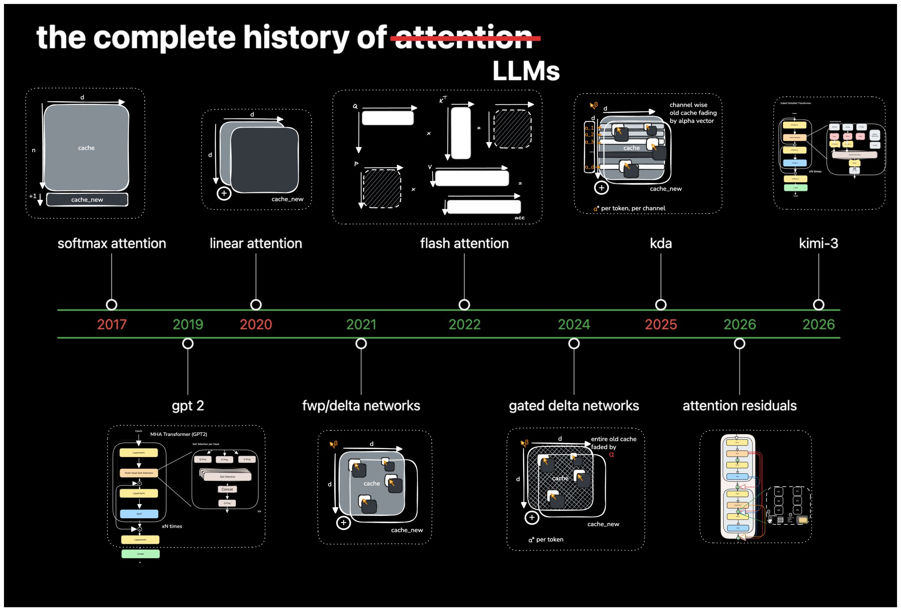
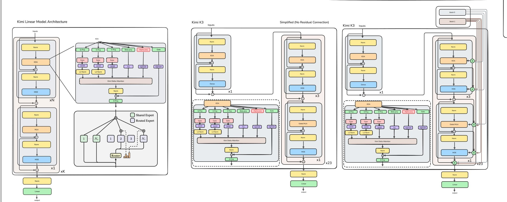

# From GPT2 to Kimi3, Explained（ali, 2026）

> 原典: [[translations/2026-gpt2-to-kimi3]] ・ `raw/articles/22580_ From GPT2 to Kimi3, Explained.md`
> 著者・年・出典: ali（@waterloo_intern）・2026・X 記事

## 一言まとめ

GPT-2（2019, 124M）から Kimi K3（2026, 2.8T——**22,580 倍**）までのアーキテクチャ進化を、各段の実装コード付きで辿る解説記事。貫く視点はひとつ:「**固定容量の連想メモリには追い出しポリシーが要る**」——KV cache の無限成長を固定状態に畳む（linear attention）と情報が干渉し、干渉を防ぐには選択的な上書き（delta rule）・減衰（ゲート）・ルーティング（MoE）・選択的読み出し（attention）という**学習された選択**が必要になる。スケーリングは「容量をどこに足すか」の設計だ、という読み解きである。

## 背景と問題意識

「LLM は 7 年でただ大きくなっただけなのか？」という問いが出発点。答えは否で、各世代は先行アーキテクチャの**具体的な限界**を解いてきた。その限界の根はすべて同じ場所——**推論時の記憶（KV cache／状態）をどう持つか**——にある。decoder-only モデルは過去トークンの key/value を蓄えて再計算を避ける（KV cache）が、これは系列長 O(N) で成長し、**メモリ帯域のボトルネック**になる（→ [[llm-inference-optimization]]）。かといって固定サイズに畳めば、書いたものが干渉して取り出せなくなる。この振り子の往復が、アーキテクチャ進化の主旋律である。

<figure>

<figcaption>図2（再掲）: 2017 softmax attention から 2026 Kimi-3 までのタイムライン。GPT-2 → linear attention → FWP/delta networks → flash attention → gated delta networks → KDA → attention residuals。</figcaption>
</figure>

## 提案手法 / 主張 — 系譜の各段が解いた限界

| 段階 | 何を解いたか | 代償・次の限界 |
| --- | --- | --- |
| **GPT-2**（decoder-only + KV cache） | 過去トークンの射影の再計算を回避 | cache が O(N) 成長 → メモリ帯域律速 |
| **Linear attention**（ELU+1 特徴写像） | K,V を固定 D×D 状態に畳み、デコードを O(1) に | 特徴写像は softmax の劣化近似。加算だけの書き込みは**容量超過で干渉**（Schlag の overcapacity 論） |
| **DeltaNet**（delta rule） | key で古い値を読み出し**差分だけ書く**選択的上書き。Householder 遷移行列の再パラメータ化で**チャンク並列訓練**（C=64/128 がテンソルコアに合う） | 置き換え先のある連想しか忘れられない——一括の忘却ができない |
| **Gated DeltaNet**（Mamba-2 型ゲート） | データ依存スカラー α で状態全体を減衰（α=1 で純 delta rule、α=0 で全消去） | 減衰が一様——連想ごとの重要度差を無視 |
| **KDA / Kimi Linear** | **チャネル別の細粒度減衰**＋MLA 層のインターリーブ＋MoE。「full attention 超え・デコード 6 倍」を主張 | 固定状態は本質的に情報を捨てる——完全検索は別立てが要る |
| **Kimi K3** | KDA 3 : MLA 1 の 23×4 層マクロサイクル。**固定状態の再帰記憶（KDA）＋周期的な完全 softmax 検索（MLA）＋疎な容量（潜在 MoE, 898 エキスパート）＋深さ方向の選択的アクセス（AttnRes）** | —（現行世代） |

<figure>

<figcaption>図1（再掲）: Kimi Linear と Kimi K3 のアーキテクチャ。KDA ブロック（β/α 射影・ゲート付き）と MLA・MoE 層の構成、右端は AttnRes 付き。</figcaption>
</figure>

**K3 の構成詳細**: 898 エキスパート（共有 2 が全トークンを処理、残り 896 から各トークンに 16 をルータが選択）、エキスパートは圧縮潜在空間で動作（FLOPs ほぼ半減）、SiTU 活性化（SiLU 置き換え）、12 層ごとの blockwise AttnRes（23×4 層で 8 ブロック）。AttnRes は「各層への入力＝全先行層出力の等重み和」という残差の限界（残差の希釈・後段の出力肥大）を、**学習された query で先行層出力を選択的に読む**ことで解く——深さ方向にも attention を張る、という一貫した設計である。

## 実験結果と知見（実務コストの数字）

解説記事のため独自実験はないが、実務的な数字が随所に拾える:

- **Kimi Linear のデコードスループット最大 6 倍**（対 full attention。ただし自己申告の管理下比較）
- **チャンクサイズの教訓**: C=1 が FLOPs 最小だが wall-clock 最小ではない——テンソルコアに乗る C=64/128 が速い。**FLOPs と実効速度は別物**
- **SiTU は融合カーネルなしで約 3 倍遅**——活性化関数ひとつでもカーネル実装が律速する
- **AttnRes は +2% レイテンシで 1.25 倍の計算優位**＋残差希釈の緩和

## 限界・批判的視点

- **X 記事・査読なし**: 著者の学習ログ（worklog）であり、一次情報は各論文（Katharopoulos の linear attention、Schlag の FWP、Yang らの DeltaNet 並列化、Gated DeltaNet、Kimi Linear/K3 のテクニカルレポート）。式・コードは説明用の簡略版で、正確な定義は原論文に依る。
- **「full attention 超え」は自己申告**: Kimi Linear の中心主張は開発元の管理下比較であり、[[agent-evaluation]] の「provider-reported はそれ単独では根拠にならない」がそのまま当てはまる。ハイブリッド比率（KDA:MLA=3:1）がどのタスク分布で成立する均衡なのかも未検証。
- **X はログイン壁で原文照合不可**: 本 ingest では内部整合性チェックで欠落なしと判断したが、ar5iv 系のような機械的照合はできていない。
- **エージェント的評価の不在**: 長い trajectory・ツール呼び出し・複数ターンでの固定状態アーキテクチャの挙動（「どの連想が減衰されるか」がエージェントの長期一貫性に与える影響）は記事の射程外で、未解決の実務論点。

## 実装・運用上の示唆

- **「容量をどこに足すか」で読む**: パラメータ増は目的でなく手段。チャネル別減衰・共有/選択エキスパート・AttnRes は、いずれも特定の機能（忘却の粒度・条件付き容量・深さ方向の検索）のための容量追加である。モデル選定・アーキテクチャ理解の際の読み筋になる。
- **エージェント実務への含意**: 長コンテキストの API コストとレイテンシは KV cache の物理に由来する。固定状態ハイブリッド（K3 型）の普及は、長い trajectory を持つエージェントの**デコード単価とコンテキスト上限の常識を変える**方向に働く——[[context-engineering]] の「有限性」制約の物理的背景。
- **カーネルまで見る**: 新しい活性化・attention 変種の導入は、融合カーネルの有無で 3 倍の速度差が出る。論文の FLOPs 比較だけでなく実装成熟度を確認する。

## 用語と略称

- **decoder-only**（デコーダのみ構成, 自己回帰生成に特化したトランスフォーマー）／ **LM head**（隠れ状態を語彙ロジットへ写像する出力層）
- **KV cache** = Key-Value cache（過去トークンの key/value を保存して再計算を避ける機構。O(N) 成長）
- **HBM** = High Bandwidth Memory（GPU の主記憶。ここへの読み書きがデコードを律速）
- **linear attention**（特徴写像で積を再結合可能にし、状態を固定 D×D に畳む attention）／ **ELU+1**（特徴写像の例）
- **FWP** = Fast Weight Programmers（高速重みプログラマ, 状態行列を「書き換わる重み」と見る系譜）
- **delta rule**（古い値を読み出し差分だけ書く更新規則）／ **Householder 遷移行列**（並列化を可能にする再パラメータ化）
- **Mamba / Mamba-2**（状態空間モデル系のアーキテクチャ。一様減衰ゲートの出所）
- **KDA** = Kimi Delta Attention（チャネル別細粒度減衰の delta attention）
- **MLA** = Multi-head Latent Attention（潜在圧縮を伴う完全 attention。DeepSeek 系）／ **Gated MLA**（出力を入力由来のゲートで要素積）
- **MoE** = Mixture-of-Experts（トークンごとに一部のエキスパートだけを使う疎な構造）／ **潜在空間 MoE**（圧縮空間でエキスパートを動かす変種）
- **AttnRes** = Attention Residuals（先行層出力への学習された選択的アクセス）／ **残差の希釈**（等重み和で古い情報が薄まる現象）
- **SiLU / SiTU**（活性化関数。SiTU は tanh 併用の K3 の変種）／ **LoRA** = Low-Rank Adaptation（低ランク行列による効率的な射影）
- **prefill / decode**（プロンプト一括処理の相／1 トークンずつの生成の相）
- **FLOPs**（浮動小数点演算数）／ **テンソルコア・UMMA**（GPU の行列積ユニットとその命令）
- **LLM** = Large Language Model（大規模言語モデル）

## 関連ページ

- [[transformer-architecture]] — 本記事が主根拠となる概念ページ（attention の系譜・MoE・残差）
- [[llm-inference-optimization]] — KV cache・メモリ帯域・カーネル融合の側
- [[summaries/2022-flashattention]] — 本記事の「O(N²) の枠づけには惑わされた」という自己訂正の一次資料
- [[agent-memory]] — 「固定容量メモリ＋選択的上書き・減衰」の同型問題を外側で解く系譜
- [[context-engineering]] — 有限ウィンドウという制約の物理的根拠
- [[summaries/2025-long-cot-survey]] — 推論時のトークン量を増やす側（本記事はそれを速く捌く側の基盤）
