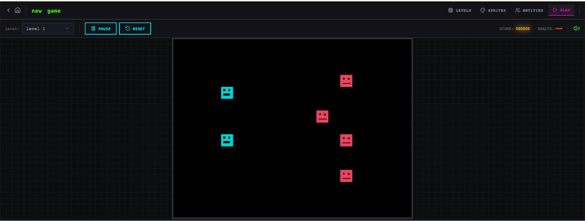

# Harness design for long-running application development（Anthropic Labs, 2026）

> 原典: [[translations/2026-harness-design]] ・ `raw/articles/Harness design for long-running application development.md`
> 著者・年・出典: Prithvi Rajasekaran（Anthropic Labs）・2026・Anthropic Engineering Blog

## 一言まとめ

[[summaries/2025-effective-harnesses]] の直接の続編。前作の initializer/coding ハーネスが天井に達したのを受け、**GAN（Generative Adversarial Network, 生成器と識別器を競わせる訓練枠組み）に着想を得た generator / evaluator の分離**を導入し、最終的に **planner / generator / evaluator の 3 エージェント**で一文プロンプトから数時間の自律フルスタック開発（solo は動かないゲームを作り、ハーネスは動くゲームを作った）を実現した実務記事。同時にこの記事の最大の価値は**ハーネスの縮小の記録**にある——「**ハーネスの各部品は『モデルが単独でできないこと』への仮定であり、モデルの改善で陳腐化する**」という原則のもと、Opus 4.5→4.6 で context reset とスプリント構造を実際に剥がしてみせた。

## 背景と問題意識

前作のハーネス（環境の足場＋1 機能ずつ＋構造化引き継ぎ）でも、複雑なタスクでは 2 つの失敗が残った:

1. **一貫性の喪失と「context anxiety（コンテキスト不安）」**: 文脈が埋まるとまとまりを失うだけでなく、一部のモデル（Sonnet 4.5 が顕著）は**自分の文脈限界が近いと感じると早々に仕事を畳み始める**。compaction（履歴のその場要約）では治らない——連続性は保つが「まっさらな状態」を与えないため、不安が持ち越される。対策は **context reset**（文脈を完全にクリアして新しいエージェントを起動＋構造化引き継ぎ）だが、オーケストレーションの複雑さ・トークン・レイテンシのコストがかかる。
2. **自己評価の甘さ**: 自分の仕事の評価を求めると、人間には明らかに凡庸でも**自信を持って称賛**する。デザインのような検証不能な主観タスクで特に顕著だが、検証可能なタスクでも判断は甘い。

## 提案手法 / 主張

### generator / evaluator の分離 — 「懐疑的な他者」は作れるが「自己批判」は作りにくい

鍵の観察: 分離しただけでは甘さは消えない（evaluator も LLM 生成物に寛大な LLM である）。しかし**独立した evaluator を懐疑的にチューニングすることは、generator を自己批判的にすることよりはるかに扱いやすい**。そして外部フィードバックが存在すれば、generator はそれに向かって反復できる。[[self-reflection]] が扱う自己反省の構造的な限界と、その実務的な回避策の証言である。

### 主観を採点可能にする（frontend design 実験）

「美しいか?」は答えられないが「**我々のデザイン原則に従っているか?**」は採点できる。4 基準（Design quality / Originality / Craft / Functionality）を両エージェントに与え、**Claude が元々弱い Design・Originality を重く**重み付け、「AI slop」パターン（白カード上の紫グラデ等）を明示減点。evaluator は詳細なスコア内訳つき **few-shot 例で校正**（判断のドリフト防止——[[agent-evaluation]] の LLM-as-judge 校正と同じ規律）。evaluator は Playwright MCP で**ライブページを自分で操作・スクリーンショットしてから**採点し、5〜15 イテレーション・最大 4 時間で回す。知見の粒:

- **基準の文言が出力の性格を直接形づくる**——「最良のデザインは美術館品質」という語が視覚的収束を招いた。採点基準はプロンプトであり、中立な物差しではない。
- スコアは概ね改善するが単調ではなく、**中間イテレーションの方が好ましいことも定期的にある**。
- 10 回目のイテレーションで方針を全破棄して 3D 空間ギャラリーへ跳んだ例——単発生成では見ない創造的飛躍が、批評への応答として出る。

### 3 エージェント構成（フルスタック版）

- **Planner**: 1〜4 文のプロンプトを完全なプロダクト仕様へ拡張（例: 一文 → 16 機能・10 スプリント）。**成果物レベルで制約し、技術詳細は指定しない**——粒度の細かい技術指定を誤ると誤りが下流へ連鎖するため、「何を作るか」で縛り「どう作るか」は作業中に見つけさせる。
- **Generator**: スプリント単位で 1 機能ずつ（React/Vite/FastAPI/SQLite→PostgreSQL）。git 持ち。
- **Evaluator**: Playwright でユーザーのように実操作して QA。基準ごとに**硬い閾値**があり、1 つでも下回ればスプリント不合格＋詳細フィードバック。
- **sprint contract**: 各スプリント前に generator と evaluator が「このチャンクの完了とは何か」を**コードを書く前に交渉して合意**する（generator が実装案と検証方法を提案し、evaluator がレビュー）。高レベル仕様とテスト可能な実装の間を埋める儀式で、スプリント 3 だけで 27 基準の粒度。通信はすべてファイル経由。

### 「素の Claude は貧弱な QA エージェント」

evaluator の実録が率直で、初期は**正当な問題を見つけながら「大したことではない」と自分を納得させて承認**し、エッジケースを突かず表面的にテストした。チューニングは「ログを読む → 自分の判断と食い違う例を見つける → プロンプトを更新」を数ラウンド。それでも深い入れ子の機能の未発見バグ等、検証の伸びしろは残る——LLM-as-judge を製品品質の関門に使うときの実務的な出発点と限界の記録である。

### ハーネスの縮小 — 部品は「モデル能力への仮定」

<figure>

<figcaption>（再掲）solo 実行: 作成したレベルをプレイしようとして失敗——エンティティは表示されるが入力に反応しない。</figcaption>
</figure>

<figure>

<figcaption>（再掲）フルハーネス実行: 一貫した視覚的アイデンティティを持つ新規ゲーム作成画面。プレイモードも動作した。</figcaption>
</figure>

v1（Opus 4.5）の結果: solo 20 分/$9 は見た目それらしいが**ゲームが動かない**。フルハーネス 6 時間/$200 は 20 倍高いが**動く**（プレイモード成立・evaluator が配線バグを具体的に捕捉）。ただし bulky で高い。ここからの縮小の方法論が本記事の核心:

- **一気に削ると何が load-bearing（荷重を支えている）か分からなくなる**——1 部品ずつ外して影響を確認する。
- Opus 4.6 の登場で、4.5 の弱点を補っていた部品が陳腐化: **context reset は不要に**（4.6 は context anxiety をほぼ示さない。Opus 4.5 時点で既に大幅減）、**スプリント分解も不要に**（4.6 は 2 時間超を分解なしで一貫走行）。
- **planner は残存価値あり**（外すと generator は under-scope する）。**evaluator は「固定 yes/no でなく、タスクがモデルの単独信頼境界の外にあるときだけコストに見合う」**——モデルが強くなると境界が外へ動き、境界内のタスクでは evaluator は純粋なオーバーヘッドになる。
- v2（Opus 4.6, DAW 構築）: 3h50m・**$124.70 のフェーズ別内訳**（Build R1 が 2h07m/$71、QA は毎回 7〜10 分/$3〜4）。QA は「見た目は立派だが表示だけの機能」（クリップのドラッグ不可・録音がスタブ・EQ カーブなし）を 2 ラウンドで具体的に捕捉し続けた。

## 実験結果と知見

前作同様、統制されたベンチマークではなく **1 プロンプト × solo/ハーネスの比較＋実コスト表**という形式。数字はコスト設計の参考になる: solo $9/20 分 vs v1 $200/6h vs v2 $124.70/3h50m（うち QA は合計 $10 程度で、価値の大半を占める発見をしている）。「Claude は音を聴けないので DAW の音楽的品質は QA ループの外」という検証手段の限界も明記（前作の alert modal の盲点と同型）。

## 限界・批判的視点

- **N=1 の比較**: 各構成 1 プロンプトの定性比較で、統計的な評価はない。「20 倍のコストに見合うか」はタスクの価値次第で、一般化はできない。
- **チューニングの人依存**: evaluator の校正は「著者の判断と食い違う例を拾ってプロンプトを直す」個人の審美眼への蒸留であり、再現には同等の目利きが要る。基準の文言が出力を方向づける（museum quality の収束）ことは、この主観の混入が出力の多様性を狭めるリスクでもある。
- **モデル依存の記述**: context anxiety の有無・スプリント要否は Claude 系の特定世代の観察で、他モデル系列にそのまま移らない。むしろ「モデルが変わったらハーネスの仮定を検証し直せ」という本記事自身の原則が、この記事の記述にも適用される。
- **evaluator の閾値設計**: 硬い閾値＋不合格の仕組みは、閾値の置き方自体が新たなハイパーパラメータになる（記事では開示されない）。

## 実装・運用上の示唆

- **ハーネスの棚卸しをモデル更新ごとに**: 各部品に「これはモデルの何ができないことを補っているか」をラベル付けし、新モデルで 1 部品ずつ外して検証する——本記事の方法論はそのまま運用手順になる。
- **evaluator の投資判断**: 「タスクがモデルの単独信頼境界の外か」で決める。境界内なら external QA はオーバーヘッド、境界上なら最大の投資対効果。
- **主観タスクの採点可能化**: 原則を列挙 → 弱い軸を重く重み付け → few-shot で校正 → 実物を操作させて採点、の 4 手順は デザイン以外（文書品質・UX 等）にも流用できる。ただし基準の文言が出力を方向づけることを織り込み、意図しない収束を監視する。
- **contract-first の分業**: 「作る前に完了の定義に合意する」sprint contract は、人間のスクラムの輸入であると同時に、[[multi-agent-systems]] の通信プロトコル設計（何を合意してから走るか）の実装例。
- **コスト構造**: QA はビルドの 1/20 のコストで「中心機能が動かない」級の欠陥を防いだ——検証への配分はケチる場所ではない。

## 用語と略称

- **ハーネス（harness）**（エージェントを動かす外側の実行基盤）／ **load-bearing**（その部品が実際に性能を支えていること）
- **GAN** = Generative Adversarial Network（生成器と識別器を競わせる訓練枠組み。本記事はその構図の着想のみ借用）
- **generator / evaluator / planner**（生成役／採点・QA 役／仕様拡張役の 3 エージェント）
- **context anxiety**（文脈限界が近いと感じたモデルが早々に仕事を畳む挙動）／ **context reset**（文脈の完全クリア＋構造化引き継ぎで新エージェントを起動）／ **compaction**（履歴のその場要約。clean slate は与えない）
- **sprint contract**（スプリント着手前に generator と evaluator が合意する「完了の定義」）／ **under-scope**（仕様化を省いて機能の乏しい実装に落ちること）
- **AI slop**（AI 生成物にありがちな凡庸なパターンの俗称）／ **few-shot 校正**（採点例を見せて judge の判断を揃えること → [[agent-evaluation]]）
- **Playwright MCP**（ブラウザ自動化ツール Playwright を MCP 経由で提供。前作の Puppeteer と同系）／ **MCP** = Model Context Protocol
- **DAW** = Digital Audio Workstation（音楽制作ソフト）／ **Web Audio API**（ブラウザの音声処理 API）
- **Claude Agent SDK**（Anthropic のエージェント構築キット）／ **LLM** = Large Language Model

## 関連ページ

- [[summaries/2024-swe-agent]] — ACI（agent-computer interface）の原典。ハーネスを「モデルを底上げする足場」として設計する方向の出発点

- [[coding-agents]] — 本記事が第 2 の根拠原典（3 エージェント構成・ハーネス縮小の方法論）
- [[agent-evaluation]] — evaluator の懐疑チューニング・few-shot 校正・主観の採点可能化
- [[self-reflection]] — 自己評価の甘さと「分離した懐疑」による回避
- [[multi-agent-systems]] — generator/evaluator 分業・sprint contract・「evaluator は能力境界の関数」
- [[context-engineering]] — context anxiety・reset vs compaction
- [[agent-frameworks]] — 「部品＝モデル能力への仮定」・simplicity 原則の運用形
- [[summaries/2025-effective-harnesses]] — 直接の前作（本記事はその天井からの続き）
- [[summaries/2024-building-effective-agents]] — 引用されている「最も単純な解決策から」の原則の出典
- [[summaries/2025-masft]] — 検証と終了の失敗（早期承認）の研究側の対応物
