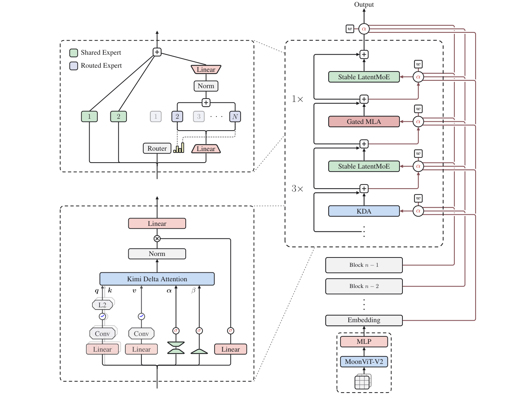
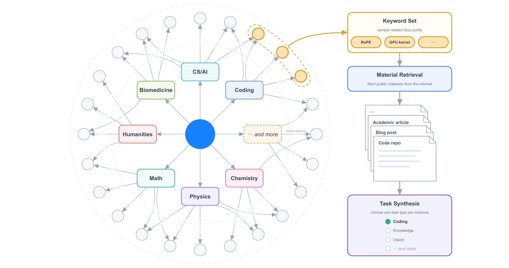
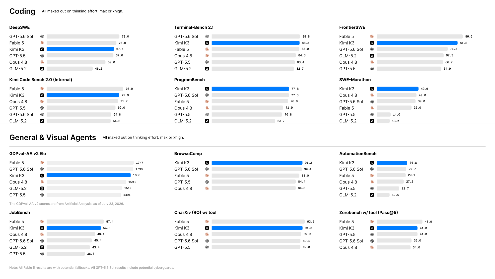

# Kimi K3: オープンフロンティアの知能

> 原典: [[translations/2026-kimi-k3]] ・ `raw/papers/Kimi K3_ Open Frontier Intelligence.md`
> 著者・年: Kimi Team（Moonshot AI）, 2026 ・ arXiv:2607.24653 ・ [モデル重み](https://huggingface.co/moonshotai/Kimi-K3)

## 一言まとめ

**世界初のオープンな 3T 級モデル**——2.8 兆パラメータ・104B アクティブ・1M コンテキストのネイティブマルチモーダル MoE。全体では最強のプロプライエタリ系（Claude Fable 5・GPT-5.6 Sol）に僅差で及ばないが、**他のオープン・プロプライエタリのモデルを一貫して上回り、コスト効率フロンティア上に位置する**。本 wiki の関心（AI エージェント）で最も新しいのは**事後学習とエージェント訓練環境**の作り込み——**ハーネスを差し替え可能なモジュールの集合として表現し、単一ハーネスへの過適合を避けながら RL する** white-box 環境、自己進化する知識グラフによるタスク合成、verify-in-the-loop の Autonomous Execution Tasks、9 個の（3 領域 × 3 努力）専門家を **MOPD（多教師オンポリシー蒸留）** で 1 モデルへ統合する 3 段階レシピ、そして **microVM サンドボックス AgentENV**（訓練・評価で計 5,100 万個生成）である。

## 背景と問題意識

本 wiki は Moonshot / DeepSeek のモデルレポートを系譜として追ってきた——**K2（[[summaries/2025-kimi-k2]]）→ K2.5（[[summaries/2026-kimi-k2.5]]）→ DeepSeek-V4（[[summaries/2026-deepseek-v4]]）→ gpt2-to-kimi3（[[summaries/2026-gpt2-to-kimi3]]）**。K3 はその直系の続きで、アーキテクチャの土台（KDA・AttnRes・Stable LatentMoE）は gpt2-to-kimi3 が既に概説している。

K3 の枠づけは **3 軸のスケーリング**である——事前学習で「より大きなモデルをより多くのデータで」という第 1 の軸に、推論モデルが確立した**推論時計算（test-time computation）** という第 2 の軸を重ね、K3 は後者を **1M コンテキストで**スケールさせることに賭ける。アーキテクチャは情報の流れを**系列長・深さ・幅**の 3 次元にわたってスケールさせる。

- **系列長** — Hybrid Attention（各ブロックで 3 KDA : 1 Gated MLA）。KDA は固定サイズの再帰状態で長系列を安価に混合し、周期的な MLA が大域的な softmax 検索を保つ。
- **深さ** — AttnRes。各層が先行するすべての層の表現に**選択的に注意を向ける**（残差ストリームを標準の加法的残差を超えて拡張）。
- **幅** — Stable LatentMoE。ルーティングエキスパートを圧縮潜在空間で動かし、通信を増やさずに容量をスケールする。

## 提案手法 / 主張

<figure>

<figcaption>図2（再掲）: Kimi K3 のアーキテクチャ。各ブロックは 3 KDA 層 ＋ 1 Gated MLA 層、各 attention 層は Stable LatentMoE FFN と対をなす。AttnRes は学習された擬似クエリ w で埋め込みと先行ブロック出力への attention 重み α を導く。入力側にネイティブ視覚経路（MoonViT-V2）。</figcaption>
</figure>

### アーキテクチャ（厚め）

**K2 → K3 の差分（Table 1 より）**: 層 61→93、総パラメータ 1.04T→2.78T、アクティブ 32.6B→104.2B、ルーティングエキスパート 384→896、トークンあたりアクティブ 8→16、共有 1→2、訓練コンテキスト 128K→1M（8×）、attention は MLA→Hybrid KDA–MLA、活性化は SwiGLU→SiTU-GLU。これらの合計で **スケーリング効率が K2 比 2.5×** に上がった（図 7）。詳細は各概念ページへ移した:

- **KDA（Kimi Delta Attention）** — delta-rule 再帰をチャネルごとの忘却ゲートで拡張。K3 の新規性は **lower-bounded decay**（負 Softplus をスケール済みシグモイドに替え、対数減衰を $(g_{\min},0)$ に有界化。$g_{\min}=-5$ で BF16 の動的範囲に収まり、全因果タイルを密な Tensor Core 行列積で計算できる）と**全ランク出力ゲート** → [[transformer-architecture]]。
- **AttnRes（Attention Residuals）** — 深さ方向の attention。K3 は 12 層 × 8 ブロックの **Block AttnRes** でメモリ・通信を $O(Ld)$→$O(Nd)$ に削減 → [[transformer-architecture]]。
- **Stable LatentMoE** — Normalized LatentMoE（集約と up-projection の間に RMSNorm を挿入して 4 連続行列積の悪条件を抑える）＋ **Quantile Balancing（QB）**（補助損失なしのバイアス更新を、固定ステップの sign 則から**マージンの分位点**へ替え、~10³ エキスパートの均衡を安定化） → [[mixture-of-experts]]。
- **その他** — SiTU-GLU（tanh ソフトキャップで SwiGLU の積を有界化）、**Per-Head Muon**（Newton–Schulz 直交化をヘッドごとに）、**NoPE**（位置符号化を持たず KDA の再帰で位置を暗黙符号化 → 1M へ直接外挿）、ネイティブ視覚（**MoonViT-V2 を一から次トークン予測で訓練**——SigLIP 初期化より安定）、**MXFP4 QAT**（エキスパート重みを MXFP4・活性化 MXFP8 で量子化を意識した訓練）、**MTP 層を EAGLE-3 ドラフトへ**（投機デコード） → [[llm-inference-optimization]]。

### 事後学習 — 3 段階（SFT → per-effort RL → MOPD）

**本 wiki で最も持ち帰る価値のある構造**である。

1. **SFT** — 領域特化した前世代 Kimi モデルで軌跡を合成し、多段検証＋人間介在注釈。XTML チャットテンプレートで直列化。SFT 段から MXFP4/MXFP8 の QAT を適用。
2. **per-effort / per-domain RL** — 個別タスクごとの専門 RL モデルを訓練するのではなく、**3 領域（汎用タスク／汎用エージェント／コーディングエージェント）× 3 努力水準（low/high/max）= 9 個のエキスパート**を訓練する。図 8 は **RL FLOPs をスケールさせるとツール呼び出しステップ数が一貫して増え、能力が包括的に向上する**ことを示す。
   - **Reasoning Effort RL** — 問題ごとに初期トークン予算 $b_0(x)$ を紐づけ、$\tau\cdot b_0(x)$ を超える軌跡は報酬を **−1** で上書き。まず max-budget を訓練し、$\tau$ をアニールして high/low を得る → [[test-time-compute]]。
   - **Agentic GRM** — 検証不能な汎用タスクはトーナメント式の二値比較。審判は**必須プロトコル**（結果を読む→ルーブリック生成→採点→スコアパッドに記録）に従い、冗長性への reward hacking は予算ベースで抑える → [[reinforcement-learning-from-human-feedback]] / [[agent-evaluation]]。
3. **MOPD（Multi-Teacher On-Policy Distillation）** — 9 個の（領域 × 努力）専門家を単一モデルへ統合。密なトークンごとの OPD 報酬 $r=\mathrm{clip}(\mathrm{sg}(\log\frac{\pi_{\text{teacher}}}{\pi_\theta}),-R_{\max},R_{\max})$ が RL フレームワークへ切れ目なく統合され、partial rollout を可能にする。**K2 の joint RL → V4 の OPD → K3 の MOPD** という「専門家 → 統合」系譜の最新形 → [[reinforcement-learning-from-human-feedback]]。

### エージェント訓練環境（→ [[agent-environments]] を新設して受けた）

<figure>

<figcaption>図9（再掲）: 知識グラフに導かれるタスク合成。階層的な DAG 知識グラフをエージェントが Web 探索で拡張し、関連ノードのキーワード集合で公開材料を検索してタスクを合成する。</figcaption>
</figure>

K3 の主張は「**RL の効果は豊かで多様で頑健に検証可能な環境に律速される**」。5 つの要素を作り込んだ。

1. **統一 white-box RL 環境** — **単一固定ハーネスで訓練するとツールスキーマ・システムプロンプト・コンテキスト管理・相互作用プロトコルへ過適合する。** そこでハーネスを**設定可能で合成可能なモジュールの集合**（ツールIF・システムプロンプト・コンテキスト管理・スキル・記憶・サブエージェント）として表現し、Kimi Code / Claude Code / Codex / OpenClaw / Hermes や新規のハーネスを具現化できる。**RL 中はタスクグループごとに異なるハーネス構成を動的に構築し、単一ハーネスの慣習でなく多様な組み合わせにモデルを晒す**（→ [[harness-engineering]] の「ハーネスを訓練時の変数にする」）。
2. **KG-guided task synthesis** — 自己進化する階層的 DAG 知識グラフをエージェントが再帰的に拡張（粗→細の有向辺、原子的になったら枝を止める）。粒度 × 網羅を制御して源材料を検索・合成。
3. **AET（Autonomous Execution Tasks）** — 初期状態＋制約付き目標＋ツール行動空間＋実行予算＋**独立検証器**。エージェントは参照軌跡なしに分解・計画・回復・終了を自律的に行い、**報酬は自己申告でなく検証器の最終状態評価に接地**（black-box システム複製の Camera Repair 等、図 10）。
4. **モックアプリ** — Gmail/Notion/Slack/Canvas を API・レート制限なしで再現し、複数シミュレート日にわたる持続的環境（1 ロールアウトで数千ツール呼び出し・数百万トークン）。
5. **AgentENV**（microVM サンドボックス） — 漸進的チェックポイント（**133ms/49ms** のチェックポイント/再開遅延）、OverlayBD でサブ秒起動、高密度。**訓練・評価を通じて 150 万イメージにわたる 5,121 万個のサンドボックスが作られた** → [[agent-safety-and-guardrails]]。

## 実験結果と知見

<figure>

<figcaption>図1（再掲）: Kimi K3 の主要結果。</figcaption>
</figure>

**全体像**: Kimi K3 は Claude Fable 5・GPT-5.6 Sol に僅差で及ばず、Claude Opus 4.8・GPT-5.5・GLM-5.2 を一貫して上回る。第三者評価では **Artificial Analysis Intelligence Index v4.1 で 580 中 4 位（57.1）**、Vals Index で 39 中 2 位、**WebDev Arena で 99 中 1 位（1,678 Elo）——このリーダーボードで首位に立った最初のオープンモデル**。

| 領域 | 代表スコア（Kimi K3, max） | 位置づけ |
| --- | --- | --- |
| Reasoning & Knowledge | GPQA Diamond **93.5**、HLE-Full 43.5/56.0、CritPt 23.4 | GPQA はフロンティア級だが**研究級（HLE/CritPt）に明確な差** |
| Coding | ProgramBench **77.8（最良）**、SWE-Marathon **42.0**（Fable 5 を 7 点上回る）、Terminal-Bench 2.1 88.3 | エージェントコーディングは強い。DeepSWE は Fable 5/Sol に次ぐ |
| Agentic | BrowseComp **91.2**、DeepSearchQA F1 **95.0**、MCPMark-Verified **94.5**、τ³-Banking **33.4** | 多くの検索・ツールスイートで SOTA |
| Vision | Math-Vision 94.3→**97.8（Python）**、OmniDocBench **91.1**、ZeroBench 23.0→41.0（Python） | Python ツールで大きく増幅 |

**内製ベンチ（表 3）が強み・弱みを公開ベンチより鋭く分ける**——最も明確な強みは**オーケストレーションと研究型のエージェンシー**（**Swarm Bench 76.3・Deep Research Bench 90.0 を明確な差で先導**）。遅れるのは Agent Behavior Bench・MIRA Bench・24/7 ClawBench 2.0・Agentic Vision Bench・KWV Bench。Webdev Bench の盲検専門家審査では Claude Opus 4.8 に対し **Overall Win−Lose +31.0%**（3D/WebGL は +59.1%）。

**コスト効率（図 13）** — Kimi Code Bench 2.0 で Claude Fable 5 の **38% のコスト**で 4.0 点差、BrowseComp で最良（91.2%）を **$2.03/タスク**（GPT-5.6 Sol の半分）。4 スイートすべてでコスト効率フロンティア上またはその近く。

**サイバーセキュリティ能力評価（2 段階）** — dual-use の能力測定として本 wiki に効く:

- **Tier 1（脆弱性発見・防御的）** — 数十の広く配備された系で数百の候補脆弱性を同定、人間レビューで**約 70% が本物と確認**、**6 プロジェクトで 16 件の未知の脆弱性**（うち Linux カーネルの遠隔 DoS プリミティブ 1 件を専門家が確認）。
- **Tier 2（エクスプロイト開発・誤用リスク）** — 36 タスク（ユーザー空間 16・カーネル 20、全タスク人間可解・**計 540 専門家時間**）で **14/36（38.9%）** を解決（GLM-5.2 の 22.2% に対して）。成功は偏在（14 のうち 10 がユーザー空間）、カーネルでは両モデルとも 3/4 を解けず。→ [[llm-red-teaming]]

**チャットテンプレート（付録 F）** — think/response/tools の**チャネル**（OpenAI Harmony 由来）、生成プレフィックスでモード選択、**typed args**（文字列は生テキスト＝コードが第一級市民）、そして **tool_choice・response_format・thinking-effort を専用構文でなく自然言語の option message として文脈に置く**（事前学習モデルが指示に従えるので低アラインメント税で拡張できる） → [[tool-use-and-function-calling]]。

## 限界・批判的視点

- **研究級タスクへの明確なギャップ。** GPQA Diamond ではフロンティアに並ぶが、**HLE-Full と CritPt では Claude Fable 5・GPT-5.6 Sol に明確に遅れる**。著者ら自身が「研究水準のタスクに差が残る」と認めている。汎用エージェント体験（Agent Behavior Bench・MIRA Bench）でも劣後しており、**「オーケストレーション・研究は強いが、細やかな長期エージェント体験は弱い」**という偏りが内製ベンチで可視化されている。
- **内製ベンチと第三者の再現性。** 主要な強みの主張（Swarm Bench・Deep Research Bench の先導）は**内製ベンチ**であり外部再現不可。ハーネス割り当てが評価をまたいで不均一（Kimi K3 は Kimi Code / Claude Code / Codex を使い分け、他モデルは Claude 系＝Claude Code・GPT 系＝Codex）で、**同一条件比較でない**。加えて Claude Fable 5 の結果は「フォールバック挙動を含む」、GPT-5.6 Sol は「潜在的 cyberguard を含む」と注記され、比較の前提が揃っていない——[[summaries/2026-kimi-k2.5]] や [[summaries/2026-deepseek-v4]] にも見られた provider-reported 問題の変奏。
- **ハーネス依存性がスコアを動かす。** 表 3 が示すとおり、同じモデルでもハーネス（Kimi Code vs Claude Code vs Codex）でスコアが変わる（例: Coding Experience は Claude Code 59.9 / Kimi Code 56.6）。K3 自身が white-box 環境で**ハーネス多様性への頑健性を訓練した**と主張する一方、評価はハーネス指定に強く依存しており、「モデルの能力」と「ハーネスの寄与」が混ざる（→ [[agent-evaluation]] のハーネス水準の指標、[[summaries/2026-code-as-agent-harness]]・[[summaries/2026-externalization]] の指摘）。
- **サイバー能力の dual-use。** Tier 1 は防御的だが Tier 2（エクスプロイト開発）は誤用リスクに直結する。**16 件の未知脆弱性の発見・38.9% のエクスプロイト成功**は、オープン重みモデルとして公開される以上、能力の両義性を伴う。論文は防御的枠づけ（再現性の実証・人間ギャップの測定）を採るが、緩和策の詳細は薄い。
- **再現性はインフラに依存する。** 1M コンテキストの agentic RL は数百 GPU の co-located システム・external KV pool・AgentENV に依存し、公開重みだけでは**この訓練体制を再現できない**。「オープンフロンティア」は重みの公開であって訓練パイプラインの完全な公開ではない。
- **参照原典の多くが未取得。** KDA/Kimi Linear [^56]・AttnRes [^59]・LatentMoE [^31]・MoonViT-V2・EAGLE-3 [^70]・MXFP4 [^102] は本 wiki に未取得で、アーキテクチャの記述は gpt2-to-kimi3 経由の又聞きを含む。

## 実装・運用上の示唆

1. **ハーネスを訓練時の変数にする。** 単一の固定ハーネスで RL するとツールスキーマ・プロンプト・コンテキスト管理へ過適合する。**ハーネスをモジュール化して構成を動的に振る**と、配備時に別のハーネス（Claude Code / Codex 等）へ載せ替えても頑健になりやすい。これは [[harness-engineering]] の「部品はモデルが単独でできないことへの仮定」を訓練側から裏返した設計。
2. **推論努力を「訓練する軸」にする。** low/high/max を別々の教師として RL し、予算超過に −1 報酬を課してから MOPD で 1 モデルへ蒸留する。プロンプトのトグルで努力を切り替える K2.5 型から、**努力ごとに最適化された方策を統合する**方向への進化 → [[test-time-compute]]。
3. **報酬を自己申告でなく独立検証器に接地する。** AET の verify-in-the-loop は、エージェントの「完了しました」を信じず、**検証器が最終環境状態を評価する**。black-box システム複製・税務監査など、検証器を多様化して環境を増やす。
4. **サンドボックスの再開性を測る。** 長期ホライズンの agentic RL では partial rollout で軌跡が複数反復にまたがるので、**チェックポイント/再開の遅延（133ms/49ms）**が第一級の指標になる。伝統的コンテナは kernel panic を起こしたので microVM を選んだ、という失敗の記録も有用 → [[agent-environments]] / [[agent-safety-and-guardrails]]。
5. **評価はハーネスを明示する。** スコアを報告するなら**どのハーネスで動かしたか**を併記する（同一モデルでもハーネスで数点動く）。コスト対スコアの散布図（図 13）は、正答率 1 位でも推論単価が数倍違えば別物であることを可視化する良い様式 → [[agent-evaluation]]。
6. **オプションを自然言語の文脈メッセージにする。** thinking-effort・tool_choice・response_format を専用トークンでなく自然言語の option message にすると、**単一テンプレートがモデル世代全体に仕え**、新オプションを最小の追加訓練で導入できる（低アラインメント税）。

## 用語と略称

- **KDA** = Kimi Delta Attention（delta-rule 再帰 ＋ チャネルごとの忘却ゲートの線形 attention。固定サイズの再帰状態で長系列を混合）
- **AttnRes** = Attention Residuals（深さ方向の attention。各層が先行全層の表現に選択的に注意）
- **MLA** = Multi-head Latent Attention（KV を低次元潜在へ圧縮する DeepSeek-V2 由来の attention）
- **NoPE** = No Position Encoding（明示的位置符号化なし。KDA の再帰で位置を暗黙符号化）
- **MoE** = Mixture of Experts（混合エキスパート）／**LatentMoE** = 潜在空間でルーティングエキスパートを動かす MoE 変種
- **QB** = Quantile Balancing（補助損失なしの MoE 負荷均衡。バイアスをマージンの分位点で更新）
- **SiTU-GLU** = Sigmoid Tanh Unit GLU（tanh ソフトキャップで SwiGLU の積を有界化した活性化）
- **Muon** = 行列パラメータ用の最適化器（Newton–Schulz 直交化）。**Per-Head Muon** はヘッドごとに直交化
- **MXFP4 / MXFP8** = マイクロスケーリングの 4/8 ビット浮動小数点形式／**QAT** = Quantization-Aware Training（量子化を意識した訓練）
- **MTP** = Multi-Token Prediction（複数トークン予測層）／**EAGLE-3** = 投機デコードのドラフトモデル手法
- **SFT** = Supervised Fine-Tuning（教師ありファインチューニング）／**RL** = Reinforcement Learning（強化学習）
- **MOPD** = Multi-Teacher On-Policy Distillation（多教師オンポリシー蒸留。専門家を 1 モデルへ統合）
- **GRM** = Generative Reward Model（生成報酬モデル）／**partial rollout** = 一部の軌跡完了で生成段を一時停止する同期 RL 方式
- **AET** = Autonomous Execution Tasks（独立検証器つきの自律実行タスク）／**KG** = Knowledge Graph（知識グラフ）
- **AgentENV** = microVM ベースの再開可能なエージェント向けサンドボックスランタイム／**MoonEP** = 完全に均衡した EP スキーム
- **EP / PP / CP** = Expert / Pipeline / Context Parallelism（エキスパート／パイプライン／コンテキスト並列）
- **XTML** = eXtensible Token Markup Language（K3 のチャットテンプレートの直列化形式）

## 関連ページ

- [[agent-environments]] — **本 ingest で新設**。white-box modular harness・KG タスク合成・AET・モック・AgentENV の主な家
- [[reinforcement-learning-from-human-feedback]] — 3 段階（SFT→per-effort RL→MOPD）・Agentic GRM・partial rollout
- [[test-time-compute]] — reasoning effort を訓練軸にする（low/high/max 教師の蒸留・予算ペナルティ）
- [[transformer-architecture]] — KDA（lower-bounded decay）・AttnRes・Gated MLA・SiTU-GLU・Per-Head Muon・NoPE
- [[mixture-of-experts]] — Stable LatentMoE・Quantile Balancing・896/16 エキスパート
- [[llm-inference-optimization]] — MXFP4 QAT・MTP→EAGLE-3 draft・KDA prefix cache・fleet scheduling
- [[agent-evaluation]] — ハーネス指定評価・コスト対スコアのフロンティア・盲検専門家審査・内製ベンチの failure-mode 追従
- [[agent-safety-and-guardrails]] — AgentENV microVM サンドボックス（V4 DSec の次の系譜）
- [[llm-red-teaming]] — 2 段階サイバー能力評価（16 zero-day・exploit dev 38.9%・4 失敗モード）
- [[tool-use-and-function-calling]] — チャットテンプレート（option messages・channels・typed args）
- [[harness-engineering]] — ハーネスを訓練時の変数にする white-box 環境の位置づけ
- [[summaries/2025-kimi-k2]] / [[summaries/2026-kimi-k2.5]] / [[summaries/2026-deepseek-v4]] / [[summaries/2026-gpt2-to-kimi3]] — 系譜の前段
