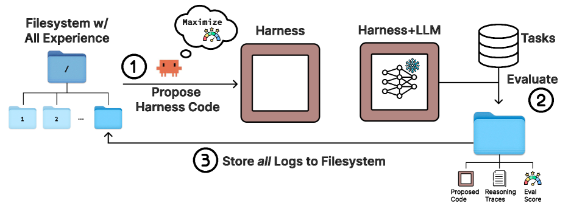
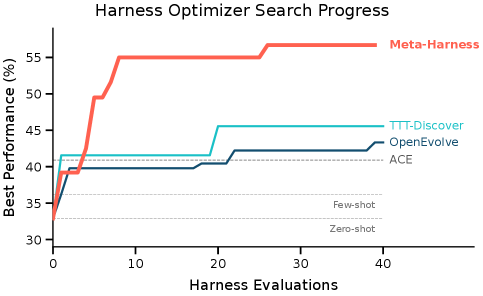

# Meta-Harness — ハーネスを最適化するハーネス

> 原典: [[translations/2026-meta-harness]] ・ `raw/papers/Meta-Harness_ End-to-End Optimization of Model Harnesses.md`
> 著者・年: Yoonho Lee, Roshen Nair, Qizheng Zhang (Stanford), Kangwook Lee (KRAFTON), Omar Khattab (MIT), Chelsea Finn (Stanford)・2026（arXiv:2603.28052）

## 一言まとめ

LLM（Large Language Model, 大規模言語モデル）システムの性能を左右する**ハーネス**（harness——何を保存し・取り出し・モデルに提示するかを決めるコード）の設計を、人手ではなく**外側ループの探索で自動化**するシステム。コーディングエージェント（Claude Code）を proposer（提案役）に据え、過去の全候補のソースコード・スコア・実行トレースを**ファイルシステム経由で無制限に検分**させて新しいハーネスコードを書かせることで、テキスト分類・数学検索推論・エージェント型コーディングの 3 領域すべてで人手設計の最先端ハーネスを上回った。

## 背景と問題意識

エージェントの実務では、モデルの重みが同じでも周囲のハーネス次第でベンチマーク性能が最大 6 倍変わる。それゆえ「ハーネスエンジニアリング」（LLM の周囲のコードを磨いてシステム全体の性能を上げる実践）が Anthropic・OpenAI・Martin Fowler のブログなどで盛んに論じられてきた——が、そのやり方は依然として手作業である: 失敗を眺め、ヒューリスティクスを調整し、少数の設計案を反復する（この「人手の系譜」の実録が [[summaries/2025-effective-harnesses]] と [[summaries/2026-harness-design]]）。

「テキスト成果物をフィードバックで反復改善する」という枠組み自体は、プロンプト自動最適化（OPRO・TextGrad・GEPA）やプログラム進化探索（AlphaEvolve/OpenEvolve）として既に存在する。本論文の診断は、**既存のテキスト最適化器はフィードバックを圧縮しすぎる**ため、ハーネス最適化に適合しない、というもの:

- **記憶がない**（memoryless）——現在の候補しか見ない
- **スカラースコアだけ**を見る——「失敗した」ことは分かるが「なぜ」が分からない
- **短いテンプレートや LLM 生成の要約**にフィードバックを制限する——診断に必要な詳細が要約時に消える

ハーネスは長いホライズンで作用する（何を記憶するかという 1 つの選択が何十ステップも先の挙動を変える）ので、下流の失敗を上流の設計判断に遡って結びつける**信用割当（credit assignment, どの行動が結果の原因かを特定する問題）**には、圧縮前の生の実行トレースが要る。代表的テキスト最適化器の 1 ステップあたり利用コンテキストは 100〜30K トークンなのに対し、ハーネス評価 1 回は最大 **1,000 万トークン**の診断情報を生む——約 3 桁の差である。

## 提案手法

<figure>

<figcaption>図2（再掲）: Meta-Harness の探索ループ。(1) エージェントが過去の全候補のコード・トレース・スコアを収めたファイルシステムを読んで新ハーネスを提案 →(2) 評価タスクで評価 →(3) 全ログを新ディレクトリとして保存、を繰り返す。</figcaption>
</figure>

外側ループは意図的に最小限で、Algorithm 1 は「集団を初期化 → proposer がファイルシステムを照会 → k 個の新ハーネスを提案 → インターフェース検証を通過したものを評価して記録 → N 回繰り返して Pareto フロンティアを返す」だけである。設計の要点は 3 つ:

1. **proposer はコーディングエージェント**（実験では Opus-4.6 の Claude Code）。生の LLM でなくエージェントである理由は、経験の総量がコンテキストウィンドウを超えるため、**何を検分するかを自分で決め**（grep・cat で選択的に読む）、編集をコードベースとの相互作用で検証する必要があるから。実測では 1 イテレーションあたり中央値 82 ファイルを読み、20 以上の過去候補を参照した（読み先の内訳はソースコード 41%・実行トレース 40%）。
2. **完全履歴をファイルシステムで公開**。評価済みハーネスごとに「ソースコード＋スコア＋実行トレース（プロンプト・ツール呼び出し・モデル出力・状態更新）」のディレクトリが積み上がる。親選択規則・突然変異オペレータ・アーカイブのような探索構造は課さない——どの過去候補から学ぶかも proposer の判断に委ねる。この「構造を課さない」選択は、コーディングエージェントが賢くなるほどシステム全体が自動的に強くなる、という将来への賭けでもある。
3. **ハーネス＝単一ファイルの Python プログラム**として探索する。コード空間の探索には自然な正則化が働く（コーディングモデルは脆いハードコードより一貫したアルゴリズムを書く傾向がある）うえ、過適合が**目視で検査できる**（怪しい if の連鎖やクラス名のハードコードはコードを読めば見える——重み空間の過適合には不可能な芸当）。

なお proposer 自身への指示は最小限のドメイン固有 **skill**（役割・ディレクトリ配置・CLI・出力形式を書いた自然言語ファイル）で与える。付録 D いわく「skill の質が探索品質の最大のレバー」であり、skill は**禁止事項と成果物の形式だけを縛り、診断のやり方は縛らない**のがコツ——この知見はこの wiki の運用（CLAUDE.md＋skill 構成）ともよく響き合う。

## 実験結果と知見

<figure>

<figcaption>図1 左（再掲）: テキスト分類でのハーネス探索の進行。横軸はハーネス評価回数、縦軸は最良性能。Meta-Harness（赤）はわずか 4 評価で TTT-Discover・OpenEvolve の最終値に並び、その後 10 ポイント以上引き離す。人手設計の ACE・few-shot・zero-shot は水平線。</figcaption>
</figure>

**テキスト分類（GPT-OSS-120B、3 データセット）**: 発見されたハーネスは精度 48.6% で、人手設計の最先端 ACE（Agentic Context Engineering, 内省的な記憶キュレーションでコンテキストを構築する手法）を **+7.7 ポイント**上回り、しかもコンテキストトークンは **11.4K vs 50.8K で約 4 分の 1**。テキスト最適化器との比較では、OpenEvolve・TTT-Discover が 60 提案かけた最終精度に**わずか 4 評価で到達**し、最終的に 10 ポイント以上引き離した。アブレーションが本論文の主張の核を直接支持する: proposer に「スコアのみ」「スコア＋LLM 要約」を渡す条件は最良 41.3 / 38.7 止まりだが、**生トレースつきの完全インターフェースは中央値 50.0・最良 56.7**——**中央値の候補ですらアブレーションの最良候補を上回る**。要約は失われた信号を回復しないどころか、診断に有用な詳細を圧縮して消すことで害にすらなる。探索で見ていない 9 つの OOD（Out-of-Distribution, 分布外）データセットでも平均 73.1% で最良（ACE 70.2%）——発見された戦略はデータセット固有の過適合ではなかった。

**検索拡張数学推論**: 50 万問超の解答済み問題コーパス（除染済み）を検索できる設定で、オリンピアード問題 250 問を探索セットにハーネスを 40 イテレーション探索。発見されたのは**字句ルーターつき 4 ルート BM25 プログラム**（組合せ論・幾何・数論・デフォルトで検索件数・重複除去・再ランキングの方策を変える。幾何だけは再ランクなしの生 BM25 が勝つ、という非自明な構造も探索が発見した）。この単一ハーネスが、**探索中に一度も見ていない 5 モデル**（GPT-5.4-nano/mini・Gemini-3.1-Flash-Lite・Gemini-3-Flash・GPT-OSS-20B）の IMO レベル 200 問で平均 **+4.7 ポイント**（対検索なし）、BM25 素朴適用も +1.3 上回った。**ハーネスがモデルをまたいで転移する**——「モデルに縛られない資産としてのハーネス」という実務上重要な性質の実証である。

**エージェント型コーディング（TerminalBench-2, 89 タスク）**: Terminus-KIRA から探索を初期化し、Opus 4.6 で **76.4%**（人手の Terminus-KIRA 74.7% を上回りリーダーボード 2 位）、Haiku 4.5 で **37.6%**（全エージェント中 1 位）。発見された修正の本体は**環境ブートストラップ**——エージェントループ開始前に 1 つの複合シェルコマンドで環境スナップショット（OS・言語・パッケージマネージャ・/app の中身）を集めて初期プロンプトに注入する、わずか 80 行の**純粋に追加的な**変更である。探索過程の記録（付録 A）が面白い: 最初の 6 イテレーションは全部ベースラインを下回ったが、proposer はトレースを読み比べて「**悪化の共通因子は構造修正ではなく、同梱していたプロンプト書き換えだ**」という交絡の診断を明示的に立て、修正を分離検証し、7 回目に「壊れやすい完了機構には触れず情報を足すだけ」の勝ち筋へ転換した。スカラー報酬だけでは絶対に書けない推論である。

**コスト**: 1 回の探索は数時間（wall-clock）で、典型的には 20 イテレーション・約 60 ハーネス評価。評価が計算のボトルネックであり、proposer 側は 1 ステップ 10M トークン級の履歴を選択検分で処理する。

## 既存 wiki との接続 — 「人手で剥がす」から「探索で発見する」へ

この論文は、直前に取り込んだ Anthropic のハーネス連作への研究側からの応答として読める。[[summaries/2026-harness-design]] の結論は「ハーネスの部品はすべて『モデルが単独でできないこと』への仮定であり、モデル更新のたびに**人手で 1 部品ずつ**外して検証する。面白い組み合わせ空間は縮まず移動し続ける」だった。Meta-Harness はまさにその**仮説生成→分離検証→部品の追加・削除のサイクル自体を外側ループに自動化**する（付録 A の交絡診断は、Anthropic が人手でやった「1 部品ずつの検証」をエージェントが自律再現した記録に他ならない）。しかも脚注 1 が率直に書くとおり、このワークフローは「**2026 年初頭のコーディングエージェント能力の大幅改善で初めて実用的になった**」——[[coding-agents]] が成熟した結果、コーディングエージェントが自分自身の実行基盤（ハーネス）を書き直せるようになった、という再帰の記録である（探索対象の TerminalBench-2 ハーネスも、proposer 自身も、どちらもコーディングエージェント）。

一方で GEPA・AlphaEvolve 系（[[agent-frameworks]] 参照）との差分は「探索するかどうか」ではなく「**フィードバックをどれだけ生のまま渡すか**」にある。この対比は [[summaries/2025-multi-agent-research-system]] の「性能分散の 80% はトークン量」や、[[context-engineering]] の参照渡しパターン（大きな成果物は履歴に貼らずファイルシステムに置いて選択的に読む）と同じ設計思想の、最適化ループへの適用と読める。Sutton の bitter lesson（探索空間がアクセス可能になれば、汎用の強いエージェントが人手設計を上回る）の、ハーネス層での実例でもある。

## 限界・批判的視点

- **TerminalBench-2 では探索と評価が同一の 89 タスク**（discovery problem として正当化し、文字列リーク監査と手動検分で過適合を確認済みとはいえ、held-out 検証がない点は他 2 領域より弱い）。逆にテキスト分類では Figure 7 が探索セット精度とテスト精度の乖離を可視化しており、**探索セットへの過適合はこの手法の常在リスク**である。
- **proposer は Claude Code（Opus-4.6）1 種のみ**。ハーネス探索の成否が proposer エージェントの能力にどれだけ依存するかは未検証（著者ら自身が future work とする）。
- 発見されたハーネスの**解釈可能性はコードが読める範囲**に留まる。4 ルート BM25 の「幾何だけ再ランクなし」のような選択がなぜ効くのかの説明は探索からは出てこない。
- 評価コスト（1 実行で約 60 回のフル評価）は、評価が高価なドメイン（長時間エージェントタスク）ほど重くなる。ForgeCode の再現不能問題が示すとおり、**リーダーボード比較は公開コード外の要素に汚染されうる**点にも注意。

## 実装・運用上の示唆

- **フィードバックは要約せず、選択的アクセスで渡す**。スカラー・要約・テンプレートで圧縮した瞬間に信用割当に必要な情報が消える。ログは機械可読（JSON）・階層的・grep しやすい命名で全部残し、読む側に選ばせる。
- **skill は「何を出すか」を縛り「どう考えるか」を縛らない**。skill の反復改善はイテレーション数や集団サイズより効いた。本実行前に 3〜5 イテレーションの短い実行で skill をデバッグする。
- **ベースラインが苦手な探索セットを小さく作る**（50〜100 例で約 50 回のフル評価が回る規模）。飽和した評価では探索が学べない。
- **高価な評価の前に軽量検証**（import・インスタンス化・小さな例での実行）を挟み、壊れた候補を数秒で弾く。評価自体は proposer にやらせず外部で自動化する。
- 純粋に**追加的（additive）な変更は、既存の挙動を壊すリスクが構造変更より小さい**——TerminalBench-2 の勝ち筋（環境ブートストラップ）はこの原則の実例。人手のハーネス改修にもそのまま使える教訓。

## 用語と略称

- **ハーネス（harness）** = 何を保存・取得・提示するかを決め、LLM を包んで動かす状態つきプログラム（ループ・ツール・コンテキスト管理・プロンプトの束）
- **LLM** = Large Language Model（大規模言語モデル）
- **proposer** = 新しいハーネス候補を提案する役。本論文ではコーディングエージェント（Claude Code）
- **外側ループ（outer loop）** = タスク実行（内側）の外側で、実行基盤そのものを提案→評価→記録で改善するループ
- **信用割当（credit assignment）** = 結果（成功・失敗）の原因をどの行動・設計判断に帰するかを特定する問題
- **実行トレース（execution trace）** = プロンプト・ツール呼び出し・モデル出力・状態更新を含む実行の生ログ
- **探索セット（search set）** = 探索中の候補評価とフィードバック生成に使うタスク部分集合。テストセットは最終評価まで隠す
- **Pareto フロンティア** = 複数目的（精度とコンテキストコスト等）でどれにも支配されない解の集合
- **ACE / MCE** = Agentic Context Engineering / Meta Context Engineering（人手設計のコンテキスト構築ハーネスの最先端）
- **GEPA / OPRO / TextGrad / AlphaEvolve / OpenEvolve / TTT-Discover** = 既存のテキスト・プログラム最適化器（それぞれ内省要約・スコア履歴・テキスト勾配・進化的探索・その OSS 版・PUCT 再利用で探索する）
- **BM25** = 語の出現頻度に基づく古典的な字句検索アルゴリズム / **TF-IDF** = 語の重要度重みづけ / **密検索（dense retrieval）** = 埋め込みベクトルの類似度による検索
- **OOD** = Out-of-Distribution（分布外。探索・訓練で見ていないデータ）
- **TerminalBench-2** = ターミナル上の長ホライズン自律タスク 89 問でエージェントを評価するベンチマーク → [[agent-evaluation]]
- **skill** = proposer に役割・配置・出力形式を与える自然言語の指示ファイル（Agent Skills 仕様）

## 関連ページ

- [[summaries/2024-swe-agent]] — 手作業で ACI を設計した原典。本論文が自動化しようとしている対象

- [[agent-frameworks]] — ハーネス層の設計論。人手設計→仮定の棚卸し→自動探索という第三段階
- [[coding-agents]] — proposer も探索対象もコーディングエージェント。再帰的な自己改善の入口
- [[context-engineering]] — 「何を保存・取得・提示するか」＝ハーネスの定義そのもの。積載設計が探索対象になった
- [[agent-evaluation]] — 探索セット vs テストの乖離監視・ハーネスのモデル間汎化という新しい評価軸
- [[summaries/2026-harness-design]] / [[summaries/2025-effective-harnesses]] — 人手ハーネスエンジニアリングの実録（本論文が自動化した対象）
- [[retrieval-augmented-generation]] — 数学検索ハーネスは「検索方策の設計」を探索で解いた事例
