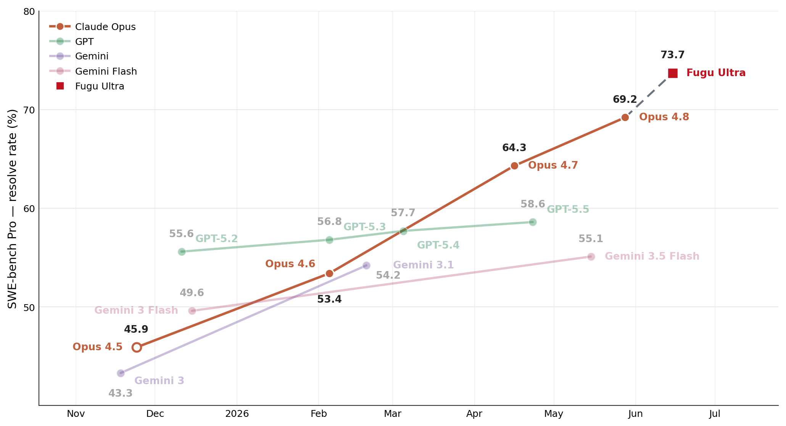
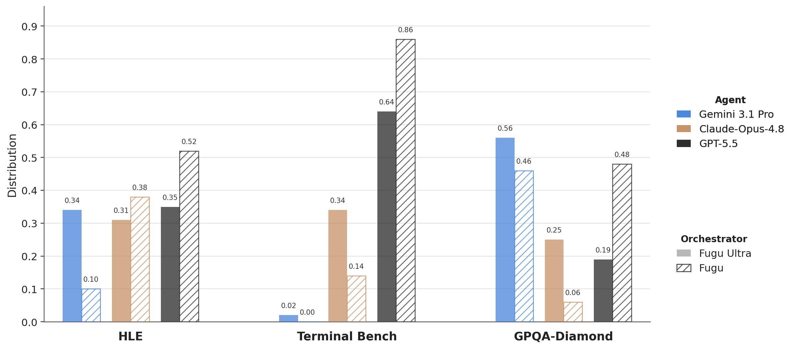

# Sakana Fugu Technical Report

> 原典: [[translations/2026-sakana-fugu]] ・ `raw/papers/Sakana Fugu Technical Report.md`（ar5iv クリップ, arXiv:2606.21228）
> 著者・年: Fugu Team, Sakana AI（Team & Project Lead: Yujin Tang）・2026

## 一言まとめ

「どのフロンティア LLM にどう働かせるか」自体を**学習で獲得したオーケストレータ**（指揮者モデル）のテクニカルレポート。Gemini-3.1-Pro / Claude-Opus-4.8 / GPT-5.5 をワーカーとして束ね、クエリごとにエージェント構成（scaffold）を動的に設計することで、SWE-Bench Pro や GPQA-Diamond など幅広いベンチマークで**個々のワーカー単体を超える**成績を出した。「オーケストレーションは、モデルを大きくするのとは別の、直交するスケーリング軸である」という主張を実証で裏づけた原典。

## 背景と問題意識

フロンティアモデルはプロバイダごとに**得意分野が分化**してきた——GPT 系は数学、Opus 系はソフトウェアエンジニアリングとセキュリティ、Gemini 系は事実想起や科学、という具合に。同時に、モデルの実力は [[summaries/2022-react]] 以来の agentic scaffold（エージェント的な足場: ツール・環境フィードバック・メモリ管理を備えた実行の枠組み）に大きく依存することも分かってきた。つまり「能力 = モデル × scaffold」である。

ならば、**複数モデルの相補的な強みを見分けて組み合わせるシステム**が次のフロンティアではないか——これが本レポートの問題意識。既存のマルチエージェント研究は、固定の議論パターン（multi-agent debate, Mixture-of-Agents）か単発のルーティング学習が主で、(1) ユーザーがワークフローを設計・運用しなければならず、(2) 協調構造が固定的、という 2 つの限界があった。Fugu は「集団を**単一モデルのインターフェース**として見せる」「オーケストレータ自体を**訓練**してクエリ適応的にする」ことでこれを超えようとする。

## 提案手法

2 つの動作点で 2 つのモデルを提供する。いずれも**ワーカーは閉源 API のブラックボックス**でよい点が、重みへのアクセスを要するモデルマージ（model merging, 複数モデルの重みを合成する手法）との決定的な違いで、著者らはこれを「モデルマージのマクロ版（挙動レベルの機能的合成）」と位置づける。

### Fugu — 低レイテンシのルーティング型（Trinity 系）

- **テキストを一切生成しない**オーケストレータ。バックボーン LM の隠れ状態に軽量な選択ヘッドを載せ、ワーカー数分のロジットを出して 1 ワーカーを選ぶだけ。自己回帰デコードを省くのでフロンティアモデル直呼び出し並みのレイテンシで済む。
- 適応は selection head ＋ **singular-value fine-tuning**（重み行列を分解し特異値スケールのみ訓練する PEFT, Parameter-Efficient Fine-Tuning の一種）で、訓練パラメータは極小。
- 訓練は 2 段階: (1) **SFT** — 全ワーカーに各問題を n 回解かせた実測報酬を softmax でソフト分布化し、それへの KL（Kullback-Leibler）ダイバージェンスを最小化（1 位ラベルの分類より情報が多い）。(2) **進化戦略 sep-CMA-ES** — Claude Code / Codex / OpenCode 由来の実世界マルチターン軌跡上で、タスク完了の終端報酬を直接最大化。勾配を使わないので、疎でノイズの多い成功信号でも安定して回る。
- マルチターンでは**ターンごとに担当ワーカーを選び直せる**。この per-step の交代が後述の「builder / debugger」戦略を生む。

### Fugu-Ultra — ワークフロー生成型（Conductor 系）

- LM が**エージェントワークフローを自然言語で出力**する: 各ステップは「サブタスク文字列＋担当ワーカー id＋access list（前ステップのどの成果を見せるか）」の 3 つ組。best-of-N・逐次チェーン・並列ツリーまで任意のトポロジーを記述できる。
- 訓練は **GRPO**（Group Relative Policy Optimization, グループ内の相対報酬で advantage を作る強化学習。KL ペナルティなし）。報酬は「パース可能なフォーマットか」→「最終出力が正解か」の 2 段階。
- **メモリ設計が新規性の核**（§3.2.2）:
  - **ワークフロー内隔離** — 各エージェントの function call 軌跡を互いに見せない。最初に環境を触ったエージェントの軌跡に後続が引きずられて多様性が死ぬ **orchestration collapse** を防ぐ。
  - **ワークフロー間共有メモリ** — 一方で過去ターンのツール呼び出し履歴は共有し、同じ探索の重複を防ぐ。「今は隔離、過去は共有」という張力の解決。
  - どのエージェントが発行した function call かを追跡し、応答を正しい発行元へ返す**呼び出しルーティング**が必要になる（単一エージェントでは自明だった前提が崩れる）。

## 実験結果と知見

**表1（原典 Table 1 の抜粋）**: 主要ベンチマーク成績。ベースラインは主にプロバイダ報告値。

| | Fugu-Ultra | Fugu | Opus 4.8 | Gemini 3.1 | GPT-5.5 |
| --- | --- | --- | --- | --- | --- |
| SWE Bench Pro | **73.7** | 59.0 | 69.2 | 54.2 | 58.6 |
| Terminal Bench 2.1 | **82.1** | 80.2 | 74.6 | 70.3 | 78.2 |
| GPQA Diamond | **95.5** | **95.5** | 92.0 | 94.3 | 93.6 |
| Humanity's Last Exam | **50.0** | 47.2 | 49.8 | 44.4 | 41.4 |
| SciCode | 58.7 | **60.1** | 53.5 | 58.9 | 56.1 |
| MRCRv2 | 93.6 | 86.6 | 87.9 | 84.9 | **94.8** |

- **世代交代級の飛躍**: SWE-Bench Pro 73.7 は次点 Opus 4.8（69.2）に +4.5。非公開の Fable 5 / Mythos Preview クラスにも一部ベンチで並ぶ・超えると主張（ただし公表値との比較）。

<figure>

<figcaption>図3（再掲）: SWE-bench Pro の resolve rate の時系列。Opus 4.5→4.6→4.7→4.8 と続く世代曲線の延長線上（点線）に Fugu-Ultra の 73.7 が乗る——オーケストレーションだけで「次の世代のモデル訓練」に相当する向上を得たという主張の根拠。</figcaption>
</figure>
- **常勝ではない**: SciCode と τ³ Banking と Long Context Reasoning では単一選択の Fugu が Fugu-Ultra を上回り、MRCRv2 では GPT-5.5 単体（94.8）が最良。多段オーケストレーションが常に得というわけではなく、**タスクにより最適な深さが違う**ことを自ら示している。
- **ルーティング分布が実力分布と一致**: Terminal Bench では GPT-5.5 に、GPQA では Gemini に集中。HLE では 3 者に分散しつつ、数学の問題は GPT へ、化学・生物は Gemini へ。オーケストレータが「誰が何に強いか」を実際に学習している証拠。

<figure>

<figcaption>図5（再掲）: タスクごとのワーカー選択分布。HLE では 3 モデルに分散（Fugu-Ultra）、Terminal Bench では GPT-5.5（0.64/0.86）、GPQA-Diamond では Gemini（0.56/0.46）に集中しており、ドメインごとの実力の事前知識と一致する。</figcaption>
</figure>
- **創発した協調戦略**（§4.4）が本レポートの読みどころ:
  - **集約役を変える debate ツリー** — トリビア問題では Gemini を、数学問題では GPT を木の根（集約者）に置く。固定の集約役を持つ Mixture-of-Agents 系は集約役の実力に律速される、という批判とセット。
  - **builder / debugger 交代** — GPT が構築し、要所で Opus がリスク列挙・検証に入る（PyPI サーバ構築で Opus が「到達性チェックは孤児プロセス由来」と看破した例など）。逆に Opus が行き詰まった調査を GPT が白紙から見直してクライアント側並行性バグを特定した例もある。
  - **専門家の呼び込み** — FEAL 暗号解読で、Opus の攻撃実装を GPT が「数学専門家」として第一原理から再導出・検証。
- **定性実験**: Karpathy の AutoResearch（LLM 訓練パイプラインの自律最適化, 123 実験×14 時間）で最良 BPB、専門家アノテーションによる古典かな消息（散らし書き）の読み順推定で NED 0.776 vs 最良フロンティア 0.642、CAD 虹彩機構生成、ルービックキューブソルバー合成（300/300, 平均 19.72 HTM ≒ 最適 20）、目隠しチェス 4 局全勝、50 週株取引 +19.4% など、広範だがいずれも例示的。
- 実務コスト: Fugu は 1 ワーカー選択なのでフロンティア直呼び出し並み、Fugu-Ultra は最大 5 ステップのワークフロー分レイテンシが増える。

## 限界・批判的視点

- **ベースラインの多くが provider-reported**（自前で再評価していない）。Fable 5 / Mythos Preview との比較も公表値やリーダーボード頼みで、評価条件が揃っている保証はない。ベンチマーク汚染（訓練データへの混入）への言及もない。
- **上限はワーカーで決まる**: Fugu 自体は問題を解かないので、ワーカーが全員失敗する問題は解けない。またワーカーが閉源 API である以上、コスト・レイテンシ・モデル更新（挙動変化）・可用性がプロバイダに従属し、**再現性はワーカーのバージョンに強く依存する**（ルーティング学習が特定バージョンの得手不得手に過学習している可能性は論じられていない）。
- 定性実験（チェス・株取引・CAD 等）は原典自身が明記する通り**代表例の提示**であり、勝率や統計的な優位の主張ではない。株取引は単一銘柄 50 週で一般化不能（脚注 2 の免責）。
- マルチエージェント化に伴う安全性（ワーカー間で prompt injection が伝播しないか、権限の分離）は本レポートの範囲外。
- 訓練データに「Claude Code / Codex 等の実利用軌跡」を使うが、その収集・ライセンスの詳細は述べられていない。

## 実装・運用上の示唆

- **ルーティングだけでも価値がある**: Fugu（単一選択）が多くのベンチで Ultra に肉薄・凌駕する。多段の協調に進む前に、まず「どのモデルに投げるか」の学習・ヒューリスティクスを整備するのが費用対効果が高い。
- **隔離と共有の設計はそのまま使える**: 並列サブエージェントに同じコンテキストを見せると先行者の軌跡に収束する（orchestration collapse）——「試行は隔離し、環境調査の結果は共有する」という Fugu-Ultra の割り切りは、multi-agent 構成を組む際の実践的な指針になる。
- **集約役は固定しない**: 「まとめ役に一番強いモデルを固定」ではなく、タスクの種類（数学か、事実知識か）で集約役を替える方が上限が上がる。
- ソフト報酬分布への KL による SFT → 進化戦略/RL で end-to-end 仕上げ、という**2 段訓練レシピ**は、検証可能な報酬があるルーティング・オーケストレーション問題に広く流用できる形。

## 用語と略称

- **オーケストレータ / ワーカー** = 指揮役のモデル／実作業を担うモデル（orchestrator-worker 構成）
- **agentic scaffold** = ツール・環境フィードバック・メモリ等でモデルを包む実行の足場
- **SOTA** = State of the Art（その時点の最高性能）
- **SFT** = Supervised Fine-Tuning（教師ありファインチューニング）
- **KL ダイバージェンス** = Kullback-Leibler divergence（分布間の乖離度。ここではソフト教師分布への近さの損失）
- **sep-CMA-ES** = separable Covariance Matrix Adaptation Evolution Strategy（対角共分散に制限した進化戦略。勾配なしでパラメータを最適化）
- **GRPO** = Group Relative Policy Optimization（グループ内の相対報酬から advantage を計算する強化学習。DeepSeekMath 由来）
- **orchestration collapse** = 先行エージェントの軌跡に後続が引きずられ、多様な貢献が失われる現象
- **access list** = ワークフロー各ステップで、前ステップのどの成果物をワーカーに見せるかの指定
- **MoA** = Mixture-of-Agents（複数エージェントの出力を固定的な集約層で統合する手法）
- **SWE-Bench Pro / Terminal Bench / LiveCodeBench (Pro) / GPQA-Diamond / HLE / SciCode / CharXiv / τ³-bench / MRCRv2** = ソフトウェア修正・端末操作・競技プログラミング・大学院レベル科学 QA・学際難問（Humanity's Last Exam）・科学計算コード・グラフ理解・対話型銀行業務・長文脈検索の各ベンチマーク
- **BPB** = bits-per-byte（言語モデルの圧縮性能指標。低いほど良い）
- **NED** = Normalized Edit Distance（正規化編集距離。読み順復元の評価に使用）
- **HTM** = Half-Turn Metric（ルービックキューブの手数の数え方）
- **ACPL** = Average Centipawn Loss(チェスの平均悪手度。低いほど正確)
- **FEN** = Forsyth–Edwards Notation（チェス局面の記法）

## 関連ページ

- [[summaries/2026-ai-scientist]] — 同じ Sakana AI の、科学研究そのものを端から端まで自動化する系

- [[multi-agent-systems]] — 本原典が主要根拠となる概念ページ
- [[agent-loop]] — ターンごとのワーカー選択は agent loop の「担当」まで学習対象にした発展形
- [[tool-use-and-function-calling]] — マルチエージェント下の function call loop（発行元追跡・共有メモリ）
- [[reasoning-and-planning]] — 計画の出力先が思考連鎖からワークフローそのものへ持ち上がった例
- [[summaries/2022-react]] — 単一エージェントの scaffold の原型。Fugu はその上の「scaffold を生成する層」
- [[agent-evaluation]] — provider-reported 比較・ベンチ汚染・ハーネス差の論点の出所
- [[agent-memory]] — ワークフロー内隔離／過去ワークフロー共有という記憶境界の設計例
- [[reinforcement-learning-from-human-feedback]] — GRPO をオーケストレーション訓練に使った応用例
- [[translations/2026-sakana-fugu]] — 全文翻訳
