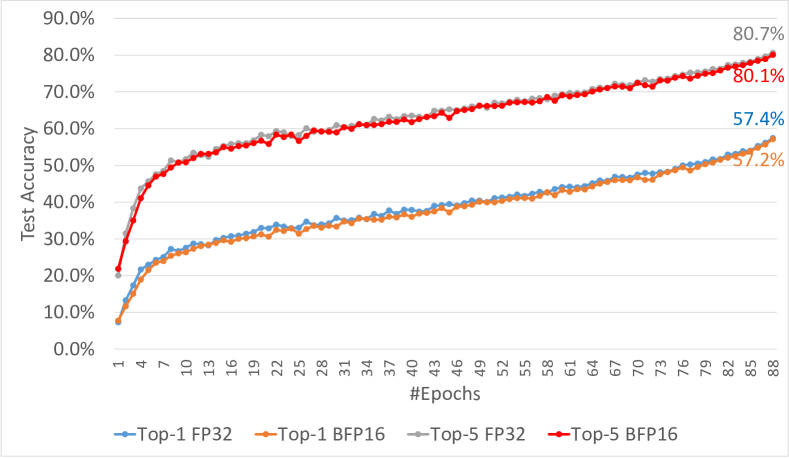
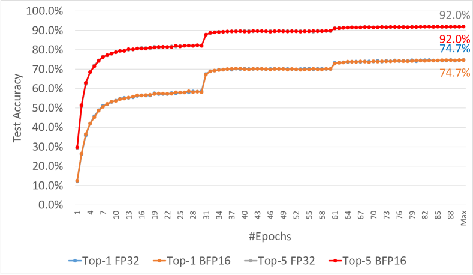
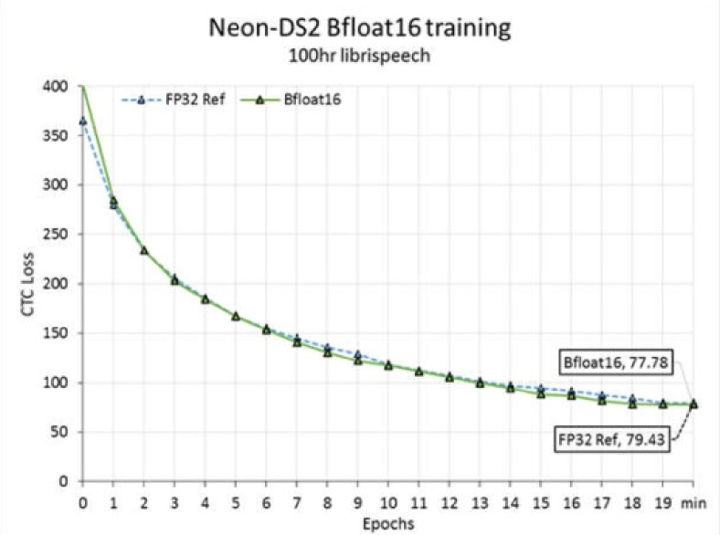
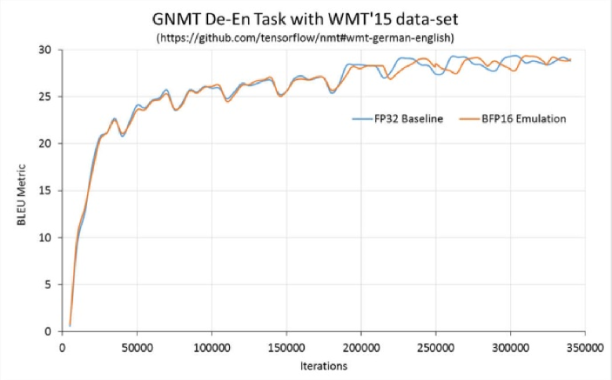
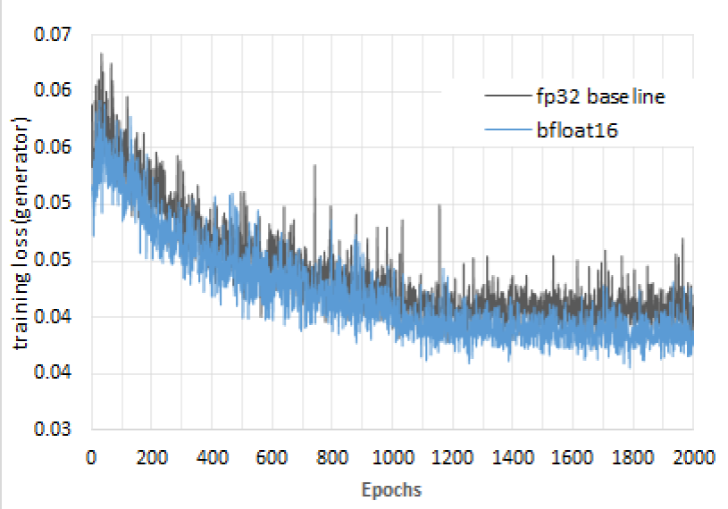
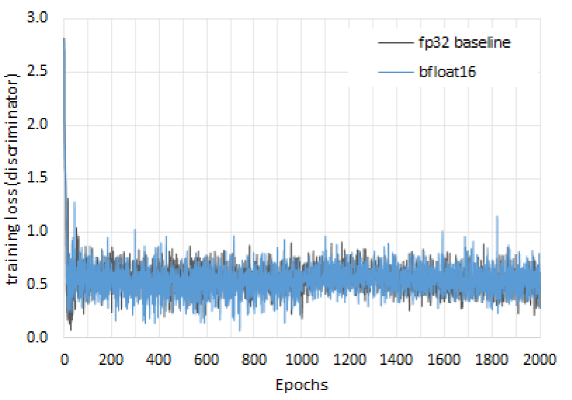

# 深層学習訓練のための BFLOAT16 の研究

> 原題: A Study of BFLOAT16 for Deep Learning Training
> 著者: Dhiraj Kalamkar（Parallel Computing Lab, Intel Labs）, Dheevatsa Mudigere（Facebook）, Naveen Mellempudi（責任著者, Intel Labs）, Dipankar Das（Intel Labs）, Kunal Banerjee（Intel Labs）, Sasikanth Avancha（Intel Labs）, Dharma Teja Vooturi（IIIT Hyderabad / Intel 在籍時の成果）, Nataraj Jammalamadaka（Lab126 Amazon / Intel 在籍時の成果）, Jianyu Huang（Facebook）, Hector Yuen（Facebook）, Jiyan Yang（Facebook）, Jongsoo Park（Facebook）, Alexander Heinecke（Intel Labs）, Evangelos Georganas（Intel Labs）, Sudarshan Srinivasan（Intel Labs）, Abhisek Kundu（Intel Labs）, Misha Smelyanskiy（Facebook）, Bharat Kaul（Intel Labs）, Pradeep Dubey（Intel Labs）
> 出典: arXiv:1905.12322（ar5iv 版）

> **訳注（クリップの状態と復元）**
> - 底本は ar5iv 版を Obsidian Web Clipper で markdown 化したもの。以下を原ページと照合して復元した。
>   1. **画像 7 枚中 3 枚が欠落**していた。Figure 2・3・4 はいずれも 2 パネル構成だが、**クリップにはどれも (a) しか残っておらず**（`x3.png`・`x5.png`・`x7.png` が欠落）、さらに **Figure 2・3・4 の本キャプションが 3 つとも消滅**して `Refer to caption` という文字列だけが残っていた。すべて原ページから復元した。
>   2. **脚注 3 件の本文が欠落**していた（マーカーのみ残存）。復元して該当箇所に訳注として挿入した。
> - **原典（ar5iv）側の変換不良**: Table 1 の指数表記が `3.401038`・`1.1710-38` のように **`×10^` の区切りを失った状態で ar5iv 自体に格納されている**（クリップ不良ではない。ar5iv の `alttext` を直接確認した）。数字列は完全に残っており、いずれも IEEE-754 の標準的な定数と一致するため、`3.40×10³⁸` のように区切りを復元して訳出した。
> - 参考文献一覧は既定どおり訳出しない。
> - 図はすべて `raw/assets/2019-bfloat16/` にローカル保存し、そのパスを参照している。

## Abstract（要旨）

本論文は、画像分類・音声認識・言語モデリング・生成ネットワーク・産業用推薦システムにわたる深層学習訓練において、**Brain Floating Point（BFLOAT16）** 半精度形式が有効であることを示す、初の包括的な実証研究を提示する。BFLOAT16 が深層学習訓練にとって魅力的である理由は 2 つある——**表現できる値の範囲が IEEE 754 浮動小数点形式（FP32）と同じ**であること、そして **FP32 との相互変換が単純**であることである。FP32 と同じ範囲を保つことは、収束のためのハイパーパラメータ調整が一切不要であることを保証するうえで重要である。たとえば IEEE 754 準拠の半精度浮動小数点（FP16）はハイパーパラメータ調整を必要とする。本論文では、混合精度訓練におけるテンソルの流れと各種の主要な演算を論じ、FP32 テンソルを BFLOAT16 へ変換する際の丸めモードといった演算の詳細に踏み込む。実験のために、Tensorflow・Caffe2・IntelCaffe・Neon において BFLOAT16 演算をエミュレートする手法を実装した。我々の結果は、BFLOAT16 テンソルを用いた深層学習訓練が、FP32 テンソルと**同じ反復回数で、かつハイパーパラメータを一切変更することなく**、各領域にわたって同一の最先端（SOTA）の結果を達成することを示している。

## 1 Introduction（はじめに）

深層学習の目覚ましい成功は、データがすぐに利用できるようになったことと、深層学習システムの計算能力の途方もない成長の上に成り立ってきた。近年、計算の成長は GEMM（General Matrix Multiply, 一般行列積）の加速に特化したアーキテクチャと、低精度計算への移行によって牽引されてきた。推論では混合精度計算が広まっており [^19] [^33] [^27] [^25]、二値／三値のオペランドから 16 ビット浮動小数点まで、異なる演算が異なる精度で実行される。同様に訓練にも混合精度の手法があり、半精度と単精度の計算を組み合わせて用いる。

大規模ニューラルネットワークの混合精度訓練の領域には、少なくとも 3 つの半精度形式がある——**FP16** [^28]、**16 ビット整数ベース** [^9]、そして **BFLOAT16** [^10] [^4] [^3] である。これらの手法はいずれも、すべての計算について 16 ビットの入力オペランドと 32 ビットのアキュムレータを持つ。3 つの形式のうち、訓練の方法論と多様なニューラルネットワークにおける実験結果が公に利用できるのは最初の 2 つだけである——**BFLOAT16 はもともと深層学習訓練のために構想されたにもかかわらず**、である。BFLOAT16 のデータ形式は、分散訓練フレームワーク DistBelief [^10] と Tensorflow [^4] の一部として、分散並列訓練の際に計算ノード間で共有される重みと活性の通信量を減らすための**低精度の格納形式**として最初に導入された1。それ以来、より広い動的範囲とより小さいフットプリントゆえに、深層学習訓練の加速に特化して狙いを定めた代替の数値形式となってきた（主に Google のエコシステム内で [^3]）。本研究では、BFLOAT16 を用いた詳細な混合精度の方法論を提示し、画像処理（GAN を含む）から音声／言語処理、推薦システムに至る多様なワークロードを訓練することで適用範囲の広さを示す。実験には、FP32 の演算が適切にビットをゼロ化することで BFLOAT16 演算の挙動をエミュレートする手法を用いる。

> 訳注（脚注 1）: この点を指摘してくれた Jeff Dean に特別の感謝を。

我々は、IntelCaffe・Caffe2・Neon・Tensorflow といった複数の深層学習フレームワークでエミュレーションを実装するために **Quantlib** と呼ぶライブラリを開発した。Quantlib が提供する機能の一つは、入力 FP32 テンソルの要素を適切に変更して BFLOAT16 の挙動をエミュレートすることである。具体的には、**FP32 要素の下位 16 ビットをゼロ化し、それらのビットに基づいて RNE（Round to Nearest Even, 最近接偶数丸め）による丸めを行う**。この変更により、テンソルは FP32 の精度を保持したまま（FP32 のハードウェアと FP32 のライブラリがそれを扱えるように）、同時に BFLOAT16 のハードウェアが与えるであろう精度と丸めをそのまま提供する。Quantlib は GEMM 演算（あるいは BFLOAT16 での実装が計画されている他の演算）の前に呼ばれ、BFLOAT16 の入力オペランドの挙動をエミュレートする。一方 GEMM の FP32 出力は、この訓練方法論の「BFLOAT16 入力、FP32 アキュムレータ」という枠組みに自然に収まる。

適切な Quantlib の呼び出しを挿入するよう改変した複数の深層学習フレームワークを用いて、我々は次のモデルについて SOTA の結果を提供する: AlexNet [^24]、ResNet-50 [^20]、DC-GAN [^32]、SR-GAN [^26]、DeepSpeech2 [^5]、GNMT [^40]、および 2 つの産業ワークロード——Deep and Cross Network と DNN Recommendation System である。また BFLOAT16・FP16・INT16 を用いた訓練方法論を定性的に比較・対照する。我々が観察するところでは、**FP16 に基づく訓練は SOTA の結果を得るために loss scaling という追加のハイパーパラメータの調整を必要とし、INT16 に基づく訓練は細粒度のブロック量子化とブロック単位のスケーリング係数の保持を必要とする**。それに対し、**BFLOAT16 の実験はすべてハイパーパラメータの変更なしに実行され、BFLOAT16 のカーネルは比較的素直に書けると期待される**。

本論文の残りは次のように構成される。2 節は文献の概観を提供し、半精度に基づく訓練の各種の試みを述べる。3 節は BFLOAT16 の形式・演算・データフローを詳細に論じる。4 節は実験結果を詳しく述べる。5 節は結論的な考察を述べる。

## 2 Related Work（関連研究）

深層学習における低精度データ型の応用は、研究においてよく探究されてきた話題である。文献によれば、さまざまな異なる縮約精度のデータ表現が調査されており、大きく 2 種類に分類できる——より標準的な浮動小数点ベースの形式 [^28] [^15] [^12] と、カスタムな固定小数点ベースの形式 [^37] [^7] [^18] [^22] [^23] である。

カスタムな固定小数点表現は、精度と範囲について別々の整数値を保持することで、精度と動的範囲の増大という双方の点で典型的な浮動小数点ベースのものより柔軟性を提供しうる。その結果、固定小数点表現は下地となる応用のより頑健で正確な訓練を提供しうる。[^37] で報告された研究は、[^39] で提案された動的スケーリング固定小数点表現を活用して、汎用 CPU ハードウェア上で最適化された浮動小数点実装より畳み込みニューラルネットワークを $4\times$ 高速化している。[^18] では著者らが深層学習に対する低精度固定小数点計算の効果についての包括的な研究を提示している。また彼らは専用ハードウェア上で 16 ビット固定小数点を用いてより小さなネットワークを訓練している。

研究者は 16 ビット未満の精度にも踏み込んでおり、そのほとんどすべてがカスタムな固定小数点方式を用いている。文献 [^7] は最大 12 ビットの演算を伴う低精度乗算を用いた動的固定小数点形式を用いる。この着想は [^8] でさらに進められ、著者らは他のすべてのテンソルと演算を完全精度に保ちながら二値の重みのみで訓練することを示している。別の拡張 [^21] は二値の活性も用いる。ただし勾配と重みは完全精度で保持される。別の関連研究 [^22] は、勾配を完全精度に保ったまま、活性と重みを 6 ビットに量子化してニューラルネットワークを訓練する。[^33] で述べられた手法は勾配を含むすべての構成要素に二値表現を用いる。しかしながら、前述の手法はいずれも**より小さなベンチマークのモデル／データセットでのみ機能することが示されており**、より大きな ImageNet データセット [^11] と分類タスク [^35] では例外なく無視できない精度低下をもたらす。[^23] の著者らは、専用ハードウェア上で深層ニューラルネットワークを実行するために特別に仕立てられた **Flexpoint** と呼ばれる固定小数点数値形式を提唱している。このデータ型は FP16 を上回り、多様なワークロードにわたって FP32 と数値的に同等であることが示されている。より一般的な動的固定小数点表現と関連する計算プリミティブが [^9] で提示されている。

浮動小数点と対比したこれら整数ベースの表現の欠点は、**共有指数の扱いとアキュムレータのオーバーフロー管理という追加のオーバーヘッド**である。Köster ら [^23] は、これらのオーバーヘッドの一部を排除するために共有指数を事前に予測するアルゴリズムを提案した。しかしこの解決策は各層で追加の統計量の収集を必要とし、それは汎用ハードウェア上では効率的に計算できない。

FP16 と FP32 を用いた混合精度訓練の方法論が [^28] で報告されている。この研究は活性・重み・勾配の格納に FP16 を用いる。順伝播と逆伝播の間の計算は FP16 のデータ型を用いる一方、結果は FP32 へ蓄積される。更新演算のために FP32 の重みのマスターコピーが保持される。著者らは深いネットワークとより大きなデータセット（ILSVRC 級の問題）を包含する広範囲の応用について、ベースラインの FP32 の結果と比べて最小限の損失で深層学習訓練を成功させている。しかしこの研究は、**FP16/FP32 混合精度訓練が SOTA に近い結果を得るには loss scaling [^15] を伴う**ことを強調している。loss scaling とは基本的に、逆伝播される勾配値を FP16 で表現できる範囲へシフトさせ、それによって精度にとって決定的な小さな大きさ（負の指数）の値を保つことを保証するものである。

**loss scaling の必要性は BFLOAT16 データ型を用いることで回避できる。** Intel アーキテクチャにおける BFLOAT16 のハードウェア数値仕様は [^1] にある。BFLOAT16 は [^42] において画像分類タスクでペタ FLOPS 規模を達成するための決定的な材料であると強調されている。[^3] で Google は、画像分類・画像分割・物体検出・機械翻訳といった各種のタスクについて、Tensorflow モデルでこのデータ型を FP32 の代わりに用いることで達成される高速化を記している。BFLOAT16 の恩恵が機械学習のパラダイムに限られないことは注目に値する。最近発表された研究 [^41] は、統計物理学の重要なモデルであるイジング模型のモンテカルロシミュレーションにこの表現を用いている。実際 [^41] の著者らは、BFLOAT16 が「**IEEE 半精度表現より良い訓練とモデル精度を提供する**」と述べている。プログラミングの容易さを犠牲にせず高い性能を提供するよう設計された Julia 言語 [^6] も、BFLOAT16 から恩恵を受けることが示されている [^13]。OpenAI もまた、BFLOAT16 を狙ったカーネルの最適化が「活発に開発中」であると述べている [^17]。

## 3 Training with Brain Floating Point（Brain Floating Point による訓練）

数多くの研究が、深層ニューラルネットワークの訓練には **16 ビットの精度で十分**であることを示してきた [^18] [^28] [^23] [^9]。研究者は、電力と性能について訓練プラットフォームを最適化するためにさまざまな数値形式を実験してきた。今日の最先端の訓練プラットフォームは、深層学習訓練のための好ましい数値形式として IEEE-754 半精度浮動小数点を選んでいる。しかし**半精度浮動小数点の狭い動的範囲は、逆伝播の際の誤差勾配を表現するのに十分でない**。これを緩和するため、訓練手法は勾配を半精度浮動小数点が支える表現可能な範囲へシフトさせる loss scaling の技法 [^28] を用いる。一部のフィードフォワードネットワークではこれは損失に定数のスケーリング係数を掛けるだけの単純な乗算として実装しやすいが、他のもの（例: 再帰型）は正しいスケーリングパラメータを決めるためにより洗練された手法を要する。この過程はしばしば反復的であり、データサイエンティストが自分のネットワークに合わせて最適化するのに相当な時間と資源の投資を要する。これらのソフトウェア上のオーバーヘッドは、新しい深層学習の応用が低精度ハードウェアの利点を活かすべく円滑に移行するうえでの障害となる。「automatic mixed precision」[^30] のようなソフトウェアツールの最近の進展は、この負担の一部をデータサイエンティストから取り除くことを狙っている。しかしこれらのツールも現在の形では限界がある。

値は**仮数 8 ビット**と **FP32 に匹敵する動的範囲**を持つ、切り詰められた完全精度浮動小数点値として表現される（Table 1）。この拡張された動的範囲は、複雑な loss scaling の手法を適用することなく、より小さな勾配値を表現できるようになり、深層学習ワークロードの BFLOAT16 ハードウェアへの移行をより容易にする。深層学習向けのハードウェアを構築するために BFLOAT16 の数値形式を採用することには、さらなる利点もある。**FMA のような中核的な計算プリミティブが 8 ビットの乗算器で構築でき**、FP32 の完全な動的範囲を保ちながら面積と電力の大幅な節約につながる。Table 1 は BFLOAT16 と他の標準的な IEEE 浮動小数点形式との比較を示す。

**表1**: BFLOAT16 の数値形式と IEEE-754 の FP32・FP16 形式との比較。（訳注: 原ページ側で指数の区切りが失われていたため、桁を復元して表記した。）

| Data Type | Bit Format (s, e, m) | Max Normal | Min Normal | Min Subnormal | Acc. Size |
| --- | --- | --- | --- | --- | --- |
| FP32 | 1, 8, 23 | 3.40×10³⁸ | 1.17×10⁻³⁸ | 1.40×10⁻⁴⁵ | float32 |
| FP16 | 1, 5, 10 | 6.55×10⁴ | 6.10×10⁻⁵ | 5.96×10⁻⁸ | float32 |
| BFLOAT16 | 1, 8, 7 | 3.38×10³⁸ | 1.17×10⁻³⁸ | N/A | float32 |

<figure>

<figcaption>図1: BFLOAT16 のデータ形式で DNN を訓練するのに用いる混合精度のデータフロー。</figcaption>
</figure>

Figure 1 は BFLOAT16 の数値形式を用いて深層ニューラルネットワークを訓練するのに用いる混合精度のデータフローを示す。GEMM 演算として表される中核的な計算カーネルは、BFLOAT16 テンソルを入力として受け取り、出力を FP32 テンソルへ蓄積する。Quantlib（Figure 1 では Q と示される）はこれらの出力テンソルを次の層へ渡す前に BFLOAT16 形式へ変更する。Quantlib はまた、順伝播のために FP32 の重みのコピーを BFLOAT16 へ変更するのにも使われる。入力に関する誤差勾配も BFLOAT16 形式である。バッチ正規化や ReLU・tanh・sigmoid といった活性化関数を含む非 GEMM の計算演算も、BFLOAT16 テンソルを入力として受け取る。**バイアスのテンソルは常に FP32 で保持される。** 重みの更新ステップ（例: SGD ソルバ内）は、モデルの精度を保つために**重みの FP32 のコピー**を用いる。

## 4 Results（結果）

BFLOAT16 の評価は、1 節で論じた Quantlib によるテンソル変更の手法を用いて、異なる応用領域とフレームワークからの前述の深層学習モデルからなる。

### 4.1 Convolution Neural Networks（畳み込みニューラルネットワーク）

畳み込みニューラルネットワーク（CNN）は主に、画像分類・物体検出・意味的分割といったコンピュータビジョンの応用に用いられてきた。CNN は、ImageNet Large Scale Visual Recognition Competition（ILSVRC）のような公開ベンチマークに主に牽引されて、学術界と産業界の双方で広範に研究されてきた。過去数年にわたって ILSVRC の競技に勝利した CNN は、確立されたベンチマークになっている。ここでは BFLOAT16 の評価のための代表的なモデルとして AlexNet（ILSVRC 2012）[^24] と ResNet-50（ILSVRC 2015）[^20] を選ぶ。（計算の大部分に寄与する）Convolution 層と InnerProduct 層に加えて、ReLU・BatchNorm・Pooling・Dropout・EltWise の各層にも BFLOAT16 のエミュレーションを用いる。これにより、中間のテンソル出力に高い精度を必要とすることなく、訓練パイプライン全体が BFLOAT16 を用いることが保証される。

#### 4.1.1 AlexNet

AlexNet については、16 ノード上でデータ並列に実行する大域ミニバッチ 1024 を 88 エポック用い、**top-1 精度 57.4%、top-5 精度 80.7%** を達成した。Figure 2 に示すとおり、我々の BFLOAT16 のエミュレーションは実際の FP32 の実行に非常に近く追随し、**top-1 精度 57.2%、top-5 精度 80.1%** を達成している。

#### 4.1.2 ResNet

我々の ResNet-50 の実験は、Nesterov モメンタム付き SGD を用いて 32 ノード上でデータ並列に実行する大域ミニバッチ 1024 で行った。最初の 5 エポックで学習率のウォームアップを行い 90 エポック訓練した。ベースラインの FP32 の実行は **top-1 精度 74.7%、top-5 精度 92.0%** を達成し、Figure 2 に示すとおり、我々の BFLOAT16 のエミュレーションはベースラインにほぼ厳密に追随して同じ top-1 と top-5 の精度を達成した。訓練中は、各エポック後に検証精度を計算するためにバッチ正規化に局所的なバッチ統計量を用いる。完全に訓練された BFLOAT16 のモデルは、大域的なサンプル統計量を用いて **top-1 テスト精度 75.7%** を達成し、ベースラインの FP32 の結果に一致した。

<figure>

<figcaption>図2(a): AlexNet。</figcaption>
</figure>

<figure>

<figcaption>図2(b): ResNet-50。図2 全体のキャプション: Imagenet-1K の訓練、CNN についての top-1 および top-5 の検証精度のプロット。（訳注: (b) の画像と図全体のキャプションはクリップで欠落していたため原ページから復元した。）</figcaption>
</figure>

### 4.2 Recurrent Neural Networks（再帰型ニューラルネットワーク）

再帰型ニューラルネットワーク（RNN）は、フィードフォワードのネットワークとは異なり、フィードバック結合ゆえに時間的な情報を捉えることができる。これらのモデルは自動音声認識（ASR）や言語処理といった応用に広く用いられてきており、それらは主に系列に基づく学習を伴う。**RNN はより厳しい数値的範囲の要求を持ち** [^28]、**半精度のデータ型に対してより敏感である**ことが観測されてきた。この種のネットワークについては、BFLOAT16 の評価のための代表的な候補として Baidu の DeepSpeech2 [^5] と Google のニューラル機械翻訳（GNMT）モデル [^40] を選ぶ。

#### 4.2.1 DeepSpeech2

Deep Speech 2（DS2）のトポロジは、2 つの畳み込み層に続いて 2048 セルの 3 つの双方向 GRU（gated recurrent unit）層、そして最後に分類器としての内積層からなる。CTC（connectionist temporal classification）損失 [^16] を計算するのに Adam オプティマイザを用いる。バッチサイズ 64、学習率 0.0005 を用いる。前述のモデルは 460 時間のコーパスからなる librispeech データセット [^31] 上で訓練される。

#### 4.2.2 Neural Machine Translation（ニューラル機械翻訳）

Google のニューラル機械翻訳（GNMT）は、再帰型ネットワークを用いた最先端のニューラル機械翻訳モデルである。言語モデリングと翻訳のために、LSTM（long short-term memory）層のスタックと注意モデルを用いる。Table 2 は、ベースラインの FP32 と BFLOAT16 のエミュレーションについて、達成された BLEU スコアの観点で翻訳精度を比較する。小さいベトナム語（VI）から英語（EN）へのモデルと、大きいドイツ語（DE）から英語（EN）へのモデルを用いる。**BFLOAT16 のエミュレーションはベースラインと同じかそれ以上の精度を達成する。** Figure 3 は BFLOAT16 のエミュレーションの実行がベースラインの FP32 の実行にどれほど近く追随するかを示す。

**表2**: WMT'16 および IWSLT'15 のデータセットにおける De→En と Vi→En の GNMT の BLEU スコア。

| Task | FP32 | BFLOAT16 |
| --- | --- | --- |
| De → En, WMT'16 | 29.3 | 29.3 |
| Vi → En, IWSLT'15 ＋ Attention | 17.1 | 18.3 |

<figure>

<figcaption>図3(a): DeepSpeech2。</figcaption>
</figure>

<figure>

<figcaption>図3(b): GNMT。図3 全体のキャプション: BFLOAT16 のデータ型を用いた RNN の訓練。（訳注: (b) の画像と図全体のキャプションはクリップで欠落していたため原ページから復元した。）</figcaption>
</figure>

### 4.3 Generative Adversarial Networks (GANs)（敵対的生成ネットワーク）

敵対的生成ネットワーク（GAN）は非常に重要なネットワークの一群になっており、任意のデータ分布を学習し模倣するのに使える。GAN は、生成器と識別器という 2 つの別々のネットワークを密に結合した形で用いることでこれを達成する。GAN は訓練の間に回帰と識別のタスクを組み合わせるため、**数値的な精度と範囲について異なる要求を持つ傾向がある**。BFLOAT16 の評価には DC-GAN [^32] と SR-GAN [^26] のモデルを考える。

#### 4.3.1 DC-GAN

DC-GAN [^32] は、以前は訓練が悪名高く難しいと知られていた GAN のアーキテクチャ設計における決定的な一歩を表す。これは生成器では ReLU 活性化を伴う分数ストライドの畳み込みからなり、一方識別器では leaky ReLU 活性化を伴う畳み込みが用いられる。バッチ正規化層は生成器と識別器の双方で用いられる。我々は DC-GAN を Caffe で実装しており、実験では畳み込み層について（生成器と識別器の双方で）すべての入力テンソル（活性・重み）が BFLOAT16 へ変換され、一方バッチ正規化層については入力の活性のみが BFLOAT16 へ変換される。他のすべてのテンソルは完全精度で保持される。

FP32 と BFLOAT16 の比較を、inception score と MS-SSIM の観点で Table 3 に示す。表から明らかなとおり、FP32 と BFLOAT16 について得られた出力は同等である。

**表3**: face データセットにおける DC-GAN についての FP32 と BFLOAT16 の比較。

| Datatype | Inception Score | MS-SSIM |
| --- | --- | --- |
| Baseline (FP32) | $1.97\pm 0.054$ | 0.262 |
| BFLOAT16 | $2.06\pm 0.055$ | 0.217 |

#### 4.3.2 SR-GAN

SR-GAN は、低解像度画像の 1 枚のショットから超解像することで写真のようにリアルな高解像度画像を生成する [^26]。低解像度画像は空間的な特徴を保ちながらノイズを最小化しつつ $4\times$ にスケールされる。出力の品質は SSIM（Structural Similarity, 構造的類似度）・MS-SSIM（multi-scale structural similarity, 多尺度の構造的類似度）・PSNR（peak signal to noise ratio, ピーク信号対雑音比）の指標を用いて測られる。トポロジは Resnet アーキテクチャに基づく「生成器」ネットワークからなり、「識別器」はそれぞれ batchnorm と LeakyReLU が続く 8 つの畳み込み層からなる。ネットワークは事前学習済みの VGG19 ネットワーク [^36] を用いた「VGG 損失」関数を用いる。

BFLOAT16 の実験では、畳み込み層のすべての入力テンソル（重み・活性）を BFLOAT16 へ変換し、一方残りの層（Batchnorm・ReLU・LeakyReLU・Eltwise）は完全精度に保った。

**表4**: DIV2K（http://www.vision.ee.ethz.ch/ntire17/ ）データセット上で BFLOAT16 を用いて訓練した SR-GAN モデル。

| Datatype | PSNR | SSIM | MS-SSIM |
| --- | --- | --- | --- |
| Baseline (FP32) | 26.1749 | 0.73753 | 0.99999 |
| BFLOAT16 | 26.1415 | 0.74079 | 0.99999 |

<figure>

<figcaption>図4(a): 生成器ネットワーク。</figcaption>
</figure>

<figure>

<figcaption>図4(b): 識別器ネットワーク。図4 全体のキャプション: BFLOAT16 を用いた SR-GAN の訓練における訓練損失。（訳注: (b) の画像と図全体のキャプションはクリップで欠落していたため原ページから復元した。）</figcaption>
</figure>

### 4.4 Industrial Scale Recommendation System（産業規模の推薦システム）

推薦システムとパーソナライゼーションのモデルは、多くの実用規模の応用にとって非常に重要である。ここでは、広告のクリック率の予測を狙う [^34]、小さな Kaggle Criteo データセット2上の Deep & Cross Network [^38] と、大きな Terabyte Criteo データセット3上の典型的な DNN 推薦システム [^43] [^29] を評価する。推薦システムのモデルの精度は log loss [^38] [^43] [^29] によって測られ、これはユーザーがいつ広告をクリックするかを予測する。**より低い log loss はより高い予測精度に翻訳される。** なお、**log loss において 0.001 の精度低下は実務上受け入れがたいとされる**点に注意されたい。

> 訳注（脚注 2）: https://www.kaggle.com/c/criteo-display-ad-challenge/data
> 訳注（脚注 3）: https://www.criteo.com/news/press-releases/2015/07/criteo-releases-industrys-largest-ever-dataset/

BFLOAT16 の実験では、順伝播と逆伝播の双方において全結合層のすべての入力テンソル（活性と重み）を BFLOAT16 へ変換する。重み更新の段階では、追加の精度低下を減らすために FP32 のマスターコピー [^28] を用いる。BFLOAT16 と FP32 の間の変換を行うときには、最近接丸めか直接切り捨てのいずれかの方式を用いる。

精度の評価結果を Table 5 に示す。見てとれるとおり、**最近接丸め方式の BFLOAT16 は FP32 のベースラインの精度とほぼ同一である**一方、**直接切り捨て方式の BFLOAT16 はごくわずかな精度低下（約 0.02%）を被る**。

**表5**: BFLOAT16 で訓練した、小さな Kaggle Criteo データセット上の Deep & Cross Network [^38] と TeraByte Criteo データセット上の DNN 推薦システム [^43] の log loss（FP32 から BFLOAT16 への変換に最近接丸めまたは直接切り捨てのいずれかを用いる）。

| Recommendation system | Baseline (FP32) | BFLOAT16 (rnd) | BFLOAT16 (trunc) |
| --- | --- | --- | --- |
| Deep & Cross Network | 0.44372 | 0.44372 | 0.44393 |
| DNN Recommender System | 0.12520 | 0.12520 | 0.12537 |

### 4.5 Beyond Emulation - Towards Bare Metal Execution（エミュレーションを超えて——ベアメタル実行へ向けて）

本節を締めくくるにあたり、我々が提示したエミュレーション戦略が**将来の Intel Xeon CPU の優れた近似である**ことを強調しておく。そこで我々は、[^14] で提示された細身の CNN 訓練フレームワーク GxM を取り上げ、すべての重要な演算子（convolution・fully-connected・batch-normalization・pooling の各層）を **AVX512BF16 命令セット拡張** [^2] を用いて実装した。したがって、すべての活性と重みのデータはメモリ上で 16 ビットのデータとしてのみ存在し、FP32 の蓄積を伴う BFLOAT16 の内積命令を支えるために特別な VNNI（vector neural network instructions）のデータレイアウトが用いられた。これらの命令の実行は、現行の AVX512 シリコン上でのビット精度のエミュレーションによって、ごくわずかな性能上の代償だけで行われた。AVX512BF16 の命令を用いて Imagenet 上で ResNet-50 を訓練したとき、我々は **top-1 精度 75.62%** を達成し、これは現行の最先端の性能に一致する。加えて、コードは既に大幅に最適化されており実戦投入の準備ができている。さらに我々は完全な BFLOAT16 の LSTM セルも実装しており、現在 Tensorflow へ統合中である。

## 5 Conclusion（結論）

本論文における我々の目標は、動的範囲が FP32 と同じであり FP32 との相互変換が素直であることを踏まえて、**BFLOAT16 を深層学習訓練のための代替の半精度形式として確立する**ことであった。我々の実証研究は、IEEE 754 半精度形式や 16 ビット整数とは異なり、**BFLOAT16 に基づく訓練がハイパーパラメータの調整やブロック量子化のための複雑なソフトウェア管理の必要を排除する**ことを示している。我々の研究はまた、BFLOAT16 が視覚・音声・言語・生成ネットワーク・推薦システムを含む応用領域にわたるテンソルの範囲をカバーできる**頑健なデータ型**であることも示している。我々は BFLOAT16 が新興の各領域にわたって産業界全体で採用されることを期待している。
