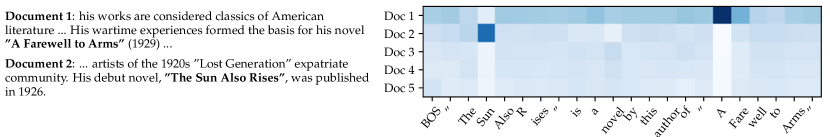
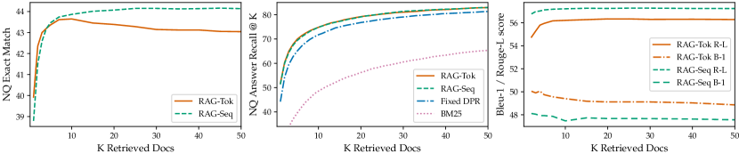
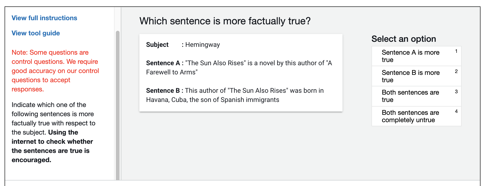

# 知識集約的な NLP タスクのための検索拡張生成

> 原題: Retrieval-Augmented Generation for Knowledge-Intensive NLP Tasks
> 著者: Patrick Lewis, Ethan Perez, Aleksandra Piktus, Fabio Petroni, Vladimir Karpukhin, Naman Goyal, Heinrich Küttler, Mike Lewis, Wen-tau Yih, Tim Rocktäschel, Sebastian Riedel, Douwe Kiela（Facebook AI Research / University College London / New York University）
> 出典: arXiv:2005.11401（NeurIPS 2020）
> 訳注: 脚注 1〜3（コード公開・Fairseq・HuggingFace Transformers の URL）はクリップから欠落していたため ar5iv から復元した。HTML テーブルの rowspan/colspan 崩れ（Table 1 の TriviaQA 2 列表記を含む）は正規化した。本文中の \[数字\] は原典の参考文献番号を示す（参考文献一覧は翻訳対象外）。

## Abstract（要旨）

大規模な事前学習済み言語モデルは、事実的知識をそのパラメータに保存することが示されており、下流の NLP タスクでファインチューニングすると最先端の結果を達成する。しかし、知識へアクセスし正確に操作する能力はなお限られており、そのため知識集約的なタスクでは、その性能はタスク特化のアーキテクチャに後れを取る。加えて、判断の出所（provenance）の提供や、世界知識の更新は、未解決の研究課題である。明示的な非パラメトリック記憶への微分可能なアクセス機構を持つ事前学習済みモデルは、これまで抽出型の下流タスクについてのみ研究されてきた。我々は、検索拡張生成（retrieval-augmented generation, RAG）——言語生成のために事前学習済みのパラメトリック記憶と非パラメトリック記憶を組み合わせるモデル——のための汎用のファインチューニング手法を探求する。パラメトリック記憶が事前学習済みの seq2seq モデルであり、非パラメトリック記憶が、事前学習済みのニューラル検索器でアクセスされる Wikipedia の密ベクトル索引である RAG モデルを導入する。2 つの RAG の定式化を比較する。一方は生成される系列全体で同じ検索文書に条件づけ、他方はトークンごとに異なる文書を使える。我々は幅広い知識集約的 NLP タスクでモデルをファインチューニング・評価し、3 つのオープンドメイン QA タスクで最先端を打ち立て、パラメトリックな seq2seq モデルと、タスク特化の検索抽出型アーキテクチャを上回る。言語生成タスクでは、RAG モデルが、最先端のパラメトリックのみの seq2seq ベースラインより、具体的・多様・事実的な言語を生成することを見出す。

## 1 Introduction（はじめに）

事前学習済みのニューラル言語モデルは、データから相当量の深い知識を学習することが示されている \[47\]。それらは、パラメータ化された暗黙的な知識ベースとして \[51\]\[52\]、外部記憶へのアクセスなしにそれを行える。この発展は刺激的だが、そのようなモデルには欠点もある: 記憶を容易に拡張・修正できず、予測への洞察を直接的に与えられず、「幻覚（hallucinations）」を生成しうる \[38\]。パラメトリック記憶と非パラメトリック（すなわち検索ベースの）記憶を組み合わせるハイブリッドモデル \[20\]\[26\]\[48\] は、これらの問題の一部に対処できる。知識を直接修正・拡張でき、アクセスされた知識を検査・解釈できるからである。マスク言語モデル \[8\] と微分可能な検索器を組み合わせて最近導入された 2 つのモデル、REALM \[20\] と ORQA \[31\] は有望な結果を示しているが、オープンドメインの抽出型質問応答しか探求していない。ここでは、ハイブリッドのパラメトリック・非パラメトリック記憶を、「NLP の主力機」すなわち系列変換（seq2seq）モデルへ持ち込む。

我々は、検索拡張生成（RAG）と呼ぶ汎用のファインチューニングのアプローチを通じて、事前学習済みのパラメトリック記憶の生成モデルに非パラメトリック記憶を付与する。パラメトリック記憶が事前学習済みの seq2seq トランスフォーマであり、非パラメトリック記憶が、事前学習済みのニューラル検索器でアクセスされる Wikipedia の密ベクトル索引である RAG モデルを構築する。これらの構成要素を、end-to-end に訓練される確率モデルとして組み合わせる（Fig. 1）。検索器（Dense Passage Retriever \[26\]、以下 DPR）が入力に条件づけられた潜在文書を提供し、seq2seq モデル（BART \[32\]）がこれらの潜在文書と入力の両方に条件づけて出力を生成する。潜在文書は top-K 近似で周辺化する。出力ごと（同じ文書がすべてのトークンに責任を持つと仮定）か、トークンごと（異なる文書が異なるトークンに責任を持つ）のいずれかである。T5 \[51\] や BART と同様、RAG は任意の seq2seq タスクでファインチューニングでき、その際に生成器と検索器が共同で学習される。

特定のタスクのためにゼロから訓練される非パラメトリック記憶でシステムを豊かにするアーキテクチャを提案する広範な先行研究がある。例えば memory networks \[64\]\[55\]、stack-augmented networks \[25\]、memory layers \[30\] である。対照的に我々は、パラメトリック記憶と非パラメトリック記憶の両方の構成要素が事前学習され、広範な知識で事前に満たされている設定を探る。決定的に重要なのは、事前学習済みのアクセス機構を使うことで、追加の訓練なしに知識へアクセスする能力が備わることである。

我々の結果は、知識集約的タスク——外部の知識源へのアクセスなしには人間でも遂行が合理的に期待できないタスク——において、パラメトリック記憶と非パラメトリック記憶を生成と組み合わせることの利点を際立たせる。我々の RAG モデルは、open Natural Questions \[29\]、WebQuestions \[3\]、CuratedTrec \[2\] で最先端の結果を達成し、TriviaQA \[24\] では特化した事前学習目的を使う最近のアプローチを大きく上回る。これらが抽出型のタスクであるにもかかわらず、制約のない生成が従来の抽出型アプローチを上回ることを見出す。知識集約的な生成については、MS-MARCO \[1\] と Jeopardy 質問生成で実験し、我々のモデルが BART ベースラインより事実的・具体的・多様な応答を生成することを見出す。FEVER \[56\] の事実検証では、強い検索の教師信号を使う最先端のパイプラインモデルの 4.3% 以内の結果を達成する。最後に、世界が変化するにつれてモデルの知識を更新するために、非パラメトリック記憶を交換できることを実証する[^fn1]。

[^fn1]: RAG の実験を実行するコードは HuggingFace Transformers ライブラリ \[66\] の一部としてオープンソース化されており、[https://github.com/huggingface/transformers/blob/master/examples/rag/](https://github.com/huggingface/transformers/blob/master/examples/rag/) で入手できる。RAG モデルの対話的デモは [https://huggingface.co/rag/](https://huggingface.co/rag/) にある。（訳注: この脚注はクリップから欠落していたため ar5iv から復元）

<figure>

<figcaption>図1: 我々のアプローチの概観。事前学習済みの検索器（Query Encoder + Document Index）を事前学習済みの seq2seq モデル（Generator）と組み合わせ、end-to-end にファインチューニングする。クエリ x に対し、最大内積探索（MIPS）で top-K の文書 zᵢ を見つける。最終予測 y については、z を潜在変数として扱い、異なる文書を与えた seq2seq の予測にわたって周辺化する。</figcaption>
</figure>

## 2 Methods（手法）

我々は RAG モデルを探求する。これは入力系列 $x$ を使ってテキスト文書 $z$ を検索し、目的系列 $y$ を生成するときの追加コンテキストとしてそれを使う。Figure 1 に示すように、我々のモデルは 2 つの構成要素を活用する: (i) クエリ $x$ を与えられてテキストパッセージ上の（top-K で切り詰めた）分布を返す、パラメータ $\eta$ を持つ検索器 $p_{\eta}(z|x)$、(ii) 直前の $i-1$ トークン $y_{1:i-1}$・元の入力 $x$・検索されたパッセージ $z$ のコンテキストに基づいて現在のトークンを生成する、$\theta$ でパラメータ化された生成器 $p_{\theta}(y_{i}|x,z,y_{1:i-1})$ である。

検索器と生成器を end-to-end に訓練するため、検索された文書を潜在変数として扱う。生成テキスト上の分布を得るために潜在文書を異なる仕方で周辺化する 2 つのモデルを提案する。一方のアプローチ *RAG-Sequence* では、モデルは同じ文書を使ってすべての目的トークンを予測する。第二のアプローチ *RAG-Token* は、異なる文書に基づいて各目的トークンを予測できる。以下では、両モデルを形式的に導入し、続いて $p_{\eta}$ と $p_{\theta}$ の構成要素、訓練と復号の手続きを述べる。

### 2.1 モデル

#### RAG-Sequence モデル

RAG-Sequence モデルは、同じ検索文書を使って完全な*系列*を生成する。技術的には、検索文書を単一の潜在変数として扱い、top-K 近似を介して周辺化することで seq2seq の確率 $p(y|x)$ を得る。具体的には、検索器で top K の文書を検索し、生成器が各文書について出力系列の確率を生成し、それらを周辺化する。

$$
p_{\text{\tiny{RAG-Sequence}}}(y|x)\;\approx\;\sum_{\mathclap{z\in\text{top-}k(p(\cdot|x))}}p_{\eta}(z|x)p_{\theta}(y|x,z)\;=\;\sum_{\mathclap{z\in\text{top-}k(p(\cdot|x))}}p_{\eta}(z|x)\prod_{i}^{N}p_{\theta}(y_{i}|x,z,y_{1:i-1})
$$

#### RAG-Token モデル

RAG-Token モデルでは、各目的*トークン*について異なる潜在文書を引き、それに応じて周辺化できる。これにより、生成器は答えを生成するときに複数の文書から内容を選べる。具体的には、検索器で top K の文書を検索し、生成器が各文書について次の出力トークンの分布を生成してから周辺化し、続く出力トークンでこの過程を繰り返す。形式的には次のように定義する:

$$
p_{\text{\tiny{RAG-Token}}}(y|x)\;\approx\;\prod_{i}^{N}\;\sum_{z\in\text{top-}k(p(\cdot|x))}p_{\eta}(z|x)p_{\theta}(y_{i}|x,z,y_{1:i-1})
$$

最後に、目的クラスを長さ 1 の目的系列と見なすことで、RAG を系列分類タスクにも使えることに注意する。この場合、RAG-Sequence と RAG-Token は等価である。

### 2.2 検索器: DPR

検索の構成要素 $p_{\eta}(z|x)$ は DPR \[26\] に基づく。DPR は bi-encoder アーキテクチャに従う:

$$
p_{\eta}(z|x)\propto\exp\left(\mathbf{d}(z)^{\top}\mathbf{q}(x)\right)\;\;\;\;\;\;\;\;\;\mathbf{d}(z)=\text{BERT}_{d}(z),\;\;\mathbf{q}(x)=\text{BERT}_{q}(x)
$$

ここで $\mathbf{d}(z)$ は BERT-BASE の*文書エンコーダ* \[8\] が生成する文書の密表現、$\mathbf{q}(x)$ は、同じく BERT-BASE に基づく*クエリエンコーダ*が生成するクエリ表現である。最も高い事前確率 $p_{\eta}(z|x)$ を持つ $k$ 個の文書 $z$ のリスト $\text{top-k}(p_{\eta}(\cdot|x))$ の計算は、最大内積探索（Maximum Inner Product Search, MIPS）問題であり、劣線形時間で近似的に解ける \[23\]。検索器の初期化と文書索引の構築には、DPR の事前学習済み bi-encoder を使う。この検索器は、TriviaQA \[24\] の質問と Natural Questions \[29\] への答えを含む文書を検索するよう訓練されたものである。文書索引を*非パラメトリック記憶*と呼ぶ。

### 2.3 生成器: BART

生成の構成要素 $p_{\theta}(y_{i}|x,z,y_{1:i-1})$ は任意のエンコーダ・デコーダでモデル化できる。我々は 400M パラメータの事前学習済み seq2seq トランスフォーマ \[58\] である BART-large \[32\] を使う。BART で生成するときに入力 $x$ を検索内容 $z$ と組み合わせるには、単純に連結する。BART はノイズ除去の目的関数と様々なノイズ関数で事前学習された。多様な生成タスク群で最先端の結果を得ており、同等サイズの T5 モデルを上回る \[32\]。以後、BART の生成器のパラメータ $\theta$ を*パラメトリック記憶*と呼ぶ。

### 2.4 訓練

どの文書を検索すべきかについて一切の直接の教師信号なしに、検索器と生成器の構成要素を共同で訓練する。入力/出力ペア $(x_{j},y_{j})$ のファインチューニング訓練コーパスを与えられ、各目的の負の周辺対数尤度 $\sum_{j}-\log p(y_{j}|x_{j})$ を、Adam \[28\] による確率的勾配降下で最小化する。訓練中に文書エンコーダ BERT$_d$ を更新することは、REALM が事前学習で行うように文書索引の定期的な更新を要するためコストが高い \[20\]。我々はこのステップが強い性能に必要だとは見出さず、文書エンコーダ（と索引）は固定し、クエリエンコーダ BERT$_q$ と BART 生成器のみをファインチューニングする。

### 2.5 復号

テスト時、RAG-Sequence と RAG-Token は $\operatorname*{arg\,max}_{y}p(y|x)$ を近似する異なる方法を要する。

#### RAG-Token

RAG-Token モデルは、遷移確率 $p^{\prime}_{\theta}(y_{i}|x,y_{1:i-1})=\sum_{z\in\text{top-}k(p(\cdot|x))}p_{\eta}(z_{i}|x)p_{\theta}(y_{i}|x,z_{i},y_{1:i-1})$ を持つ、標準的な自己回帰 seq2seq 生成器と見なせる。復号するには、$p^{\prime}_{\theta}(y_{i}|x,y_{1:i-1})$ を標準のビームデコーダに差し込めばよい。

#### RAG-Sequence

RAG-Sequence では、尤度 $p(y|x)$ が従来のトークンごとの尤度に分解されないため、単一のビームサーチでは解けない。代わりに、各文書 $z$ についてビームサーチを実行し、$p_{\theta}(y_{i}|x,z,y_{1:i-1})$ を使って各仮説をスコアリングする。これは仮説の集合 $Y$ をもたらすが、その一部はすべての文書のビームに現れていないかもしれない。仮説 $y$ の確率を推定するため、$y$ がビームに現れなかった各文書 $z$ について追加の順伝播を実行し、生成器の確率に $p_{\eta}(z|x)$ を掛けてから、周辺分布のためにビームをまたいで確率を合計する。この復号手続きを「Thorough Decoding」と呼ぶ。長い出力系列では $|Y|$ が大きくなり、多くの順伝播を要しうる。より効率的な復号のために、$x,z_{i}$ からのビームサーチで $y$ が生成されなかった場合に $p_{\theta}(y|x,z_{i})\approx 0$ とするさらなる近似ができる。これにより、候補集合 $Y$ が生成された後に追加の順伝播を実行する必要がなくなる。この復号手続きを「Fast Decoding」と呼ぶ。

## 3 Experiments（実験）

幅広い知識集約的タスクで RAG を実験する。すべての実験で、非パラメトリック知識源として単一の Wikipedia ダンプを使う。\[31\] と \[26\] に従い、2018 年 12 月のダンプを使う。各 Wikipedia 記事は互いに素な 100 語のチャンクに分割され、計 2100 万文書になる。文書エンコーダで各文書の埋め込みを計算し、高速検索のための Hierarchical Navigable Small World 近似つきの FAISS \[23\] で単一の MIPS 索引を構築する \[37\]。訓練中は各クエリについて top $k$ の文書を検索する。訓練では $k\in\{5,10\}$ を考え、テスト時の $k$ は開発データで設定する。以下、各タスクの実験の詳細を論じる。

### 3.1 オープンドメイン質問応答

オープンドメイン質問応答（QA）は重要な実世界の応用であり、知識集約的タスクの一般的なテストベッドである \[20\]。質問と答えを入力-出力のテキストペア $(x,y)$ として扱い、答えの負の対数尤度を直接最小化して RAG を訓練する。RAG を、答えが検索文書から抽出されるスパンであり、主に非パラメトリック知識に依存する、一般的な抽出型 QA のパラダイム \[5\]\[7\]\[31\]\[26\] と比較する。また、RAG と同様に答えを生成するが、検索を利用せず純粋にパラメトリック知識に依存する「Closed-Book QA」のアプローチ \[52\] とも比較する。4 つの一般的なオープンドメイン QA データセットを考える: Natural Questions（NQ）\[29\]、TriviaQA（TQA）\[24\]、WebQuestions（WQ）\[3\]、CuratedTrec（CT）\[2\] である。CT と WQ は小さいため、DPR に従い、CT と WQ のモデルを我々の NQ の RAG モデルで初期化する。先行研究 \[31\]\[26\] と同じ train/dev/test 分割を使い、完全一致（EM）スコアを報告する。TQA については、T5 \[52\] と比較するため、TQA Wiki テストセットでも評価する。

### 3.2 抽象的質問応答

RAG モデルは単純な抽出型 QA を超え、自由形式の抽象的なテキスト生成で質問に答えられる。知識集約的な設定での RAG の自然言語生成（NLG）をテストするため、MSMARCO NLG task v2.1 \[43\] を使う。このタスクは、質問、各質問について検索エンジンから取得された 10 の正解パッセージ、検索されたパッセージからアノテートされた完全文の答え、からなる。提供されたパッセージは使わず、質問と答えのみを使い、MSMARCO をオープンドメインの抽象的 QA タスクとして扱う。MSMARCO には、「What is the weather in Volcano, CA?」のように、正解パッセージへのアクセスなしには参照解答に一致する仕方で答えられない質問があるため、正解パッセージを使わない場合の性能は低くなる。Wikipedia だけでは答えられない MSMARCO の質問もあることにも注意する。ここで RAG は、合理的な応答を生成するためにパラメトリック知識に頼ることができる。

### 3.3 Jeopardy 質問生成

非 QA 設定での RAG の生成能力を評価するため、オープンドメインの質問生成を研究する。通常は短く単純な質問からなる標準的なオープンドメイン QA タスクの質問を使うのではなく、Jeopardy 質問の生成という、より要求の厳しいタスクを提案する。Jeopardy は、あるエンティティについての事実からそのエンティティを推測しようとする、独特の形式である。例えば「The World Cup」は「In 1986 Mexico scored as the first country to host this international sports competition twice.」という質問の答えである。Jeopardy の質問は正確で事実的な文であるため、答えのエンティティに条件づけて Jeopardy 質問を生成することは、挑戦的な知識集約的生成タスクを構成する。

SearchQA \[10\] の分割を使い、訓練 10 万・開発 1.4 万・テスト 2.7 万例とする。これは新しいタスクなので、比較のために BART モデルを訓練する。\[67\] に従い、SQuAD でチューニングした Q-BLEU-1 指標 \[42\] で評価する。Q-BLEU は、エンティティの一致により高い重みを置く BLEU の変種で、質問生成については標準的な指標より人間の判断との相関が高い。生成の事実性と具体性を評価するため、2 つの人手評価も行う。事実性を、信頼できる外部情報源で裏づけられるか否かと定義し、具体性を、入力と出力の高い相互依存 \[33\] と定義する。ベストプラクティスに従い、ペア比較評価を使う \[34\]。評価者には答えと 2 つの生成された質問（BART からと RAG から）が示される。その後、4 つの選択肢——質問 A が良い、質問 B が良い、両方良い、どちらも良くない——から 1 つを選ぶよう求められる。

### 3.4 事実検証

FEVER \[56\] は、自然言語の主張が Wikipedia によって支持されるか反駁されるか、あるいは判断するには情報が不十分かの分類を要求する。このタスクは、主張に関連する証拠を Wikipedia から検索し、その証拠に対して推論して、主張が真・偽・Wikipedia のみからは検証不能のいずれであるかを分類することを要する。FEVER は検索問題と、挑戦的な含意推論タスクが結合したものである。生成でなく分類を扱う RAG モデルの能力を探るための適切なテストベッドも提供する。FEVER のクラスラベル（支持・反駁・情報不足）を単一の出力トークンへ写像し、主張-クラスのペアで直接訓練する。決定的に重要なことに、FEVER への他の多くのアプローチと異なり、検索された証拠への教師信号は使わない。多くの実世界の応用では検索の教師信号は入手できず、そのような教師を必要としないモデルは、より広いタスクの範囲に適用できる。2 つの変種を探る: 標準の 3 値分類タスク（支持/反駁/情報不足）と、\[57\] で研究された 2 値（支持/反駁）タスクである。どちらもラベル精度を報告する。

## 4 Results（結果）

**表1**: オープンドメイン QA のテストスコア。TQA は、左列がオープンドメイン QA の標準テストセット、右列が TQA-Wiki テストセット。詳細は Appendix D を参照。（訳注: rowspan 崩れを正規化し、TQA を 2 列に展開）

| 種別 | モデル | NQ | TQA（標準） | TQA（Wiki） | WQ | CT |
| --- | --- | --- | --- | --- | --- | --- |
| Closed Book | T5-11B \[52\] | 34.5 | - | 50.1 | 37.4 | - |
| | T5-11B+SSM \[52\] | 36.6 | - | 60.5 | 44.7 | - |
| Open Book | REALM \[20\] | 40.4 | - | - | 40.7 | 46.8 |
| | DPR \[26\] | 41.5 | 57.9 | - | 41.1 | 50.6 |
| | RAG-Token | 44.1 | 55.2 | 66.1 | 45.5 | 50.0 |
| | RAG-Seq. | **44.5** | 56.8 | **68.0** | 45.2 | **52.2** |

**表2**: 生成と分類のテストスコア。MS-MARCO の SotA は \[4\]、FEVER-3 は \[68\]、FEVER-2 は \[57\]。* は正解コンテキスト/証拠を使用。正解アクセスなしの最良モデルに下線（訳注: 本表では太字で代替）。

| モデル | Jeopardy B-1 | Jeopardy QB-1 | MSMARCO R-L | MSMARCO B-1 | FVR3 Label Acc. | FVR2 Label Acc. |
| --- | --- | --- | --- | --- | --- | --- |
| SotA | - | - | 49.8* | 49.9* | 76.8 | 92.2* |
| BART | 15.1 | 19.7 | 38.2 | 41.6 | 64.0 | 81.1 |
| RAG-Tok. | **17.3** | **22.2** | 40.1 | 41.5 | **72.5** | **89.5** |
| RAG-Seq. | 14.7 | 21.4 | **40.8** | **44.2** | （同上） | （同上） |

### 4.1 オープンドメイン質問応答

Table 1 は、RAG の結果を最先端のモデルとともに示す。4 つのオープンドメイン QA タスクすべてで、RAG は新しい最先端を打ち立てる（TQA については T5 と比較可能な分割においてのみ）。RAG は、「closed-book」（パラメトリックのみ）アプローチの生成の柔軟性と、「open-book」検索ベースアプローチの性能を組み合わせる。REALM や T5+SSM と異なり、RAG は高価で特化した「salient span masking」の事前学習 \[20\] なしに強い結果を享受する。RAG の検索器が、Natural Questions と TriviaQA での検索教師信号を使う DPR の検索器で初期化されていることは注記に値する。RAG は、文書の再ランキングに BERT ベースの「cross-encoder」を、そして抽出型リーダーを使う DPR の QA システムと比べて遜色ない。RAG は、最先端の性能に再ランカーも抽出型リーダーも必要ないことを実証する。

答えを抽出できる場合でも、答えを生成することにはいくつかの利点がある。答えについての手がかりを含むが答えを逐語的には含まない文書も、正しい答えの生成に寄与でき、これは標準的な抽出型アプローチでは不可能であり、文書に対するより効果的な周辺化につながる。さらに、RAG は、正しい答えがどの検索文書にも存在しない場合でも正しい答えを生成でき、NQ ではそのような場合に 11.8% の精度を達成する。抽出型モデルなら 0% になるところである。

### 4.2 抽象的質問応答

Table 2 に示すように、RAG-Sequence は Open MS-MARCO NLG で BART を 2.6 Bleu ポイント・2.6 Rouge-L ポイント上回る。RAG は最先端モデルの性能に迫る。これが印象的なのは、(i) それらのモデルは参照解答の生成に必要な特定の情報を含む正解パッセージにアクセスし、(ii) 多くの質問は正解パッセージなしには答えられず、(iii) すべての質問が Wikipedia だけから答えられるわけではない、からである。Table 3 に我々のモデルが生成した答えをいくつか示す。定性的には、RAG モデルは BART より幻覚が少なく、事実的に正しいテキストをより頻繁に生成することを見出す。後で、RAG の生成が BART の生成より多様であることも示す（§4.5 参照）。

### 4.3 Jeopardy 質問生成

Table 2 は、RAG-Token が Jeopardy 質問生成で RAG-Sequence より良く、両モデルが Q-BLEU-1 で BART を上回ることを示す。5 は、BART と RAG-Token からの 452 ペアの生成に対する人手評価の結果を示す。評価者は、BART が RAG より事実的だとしたのはわずか 7.1% の場合であった一方、RAG がより事実的だとしたのは 42.7% の場合であり、さらに 17% の場合に RAG と BART の両方が事実的だとした。これは、最先端の生成モデルに対するこのタスクでの RAG の有効性を明確に実証する。評価者は、RAG の生成が大差でより具体的であるとも判断した。Table 3 は各モデルの典型的な生成を示す。

Jeopardy の質問はしばしば 2 つの別々の情報を含み、RAG-Token は複数の文書からの内容を組み合わせた応答を生成できるため、最も良い性能を発揮するのだろう。Figure 2 は例を示す。「Sun」を生成するとき、「The Sun Also Rises」に言及する文書 2 の事後確率が高い。同様に、「A Farewell to Arms」が生成されるときは文書 1 が事後分布を支配する。興味深いことに、各書名の最初のトークンが生成された後、文書の事後分布は平坦になる。この観察は、生成器が特定の文書に依存せずに書名を完成できることを示唆する。言い換えれば、モデルのパラメトリック知識が書名を完成するのに十分なのである。この仮説の証拠は、BART のみのベースラインに部分復号 "The Sun を与えることで見つかる。BART は "The Sun Also Rises" is a novel by this author of "The Sun Also Rises" と生成を完成させ、書名「The Sun Also Rises」が BART のパラメータに保存されていることを示す。同様に、BART は部分復号 "The Sun Also Rises" is a novel by this author of "A を "The Sun Also Rises" is a novel by this author of "A Farewell to Arms" と完成させる。この例は、パラメトリック記憶と非パラメトリック記憶が*協働する*様子を示している——非パラメトリックの構成要素が生成を導き、パラメトリック記憶に保存された特定の知識を引き出すのである。

<figure>

<figcaption>図2: Jeopardy 生成の入力「Hemingway」に対する、5 つの検索文書を用いた、生成される各トークンについての RAG-Token の文書事後分布 p(zᵢ | x, yᵢ, y₋ᵢ)。「A Farewell to Arms」を生成するときは文書 1 の事後確率が高く、「The Sun Also Rises」のときは文書 2 が高い。</figcaption>
</figure>

**表3**: 生成タスクの例。RAG モデルはより具体的で事実的に正確な応答を生成する。「?」は事実的に誤った応答、* は部分的に正しい応答を示す。（訳注: 生成例は原文のまま）

| タスク | 入力 | モデル | 生成 |
| --- | --- | --- | --- |
| MS-MARCO | define middle ear | BART | ? The middle ear is the part of the ear between the middle ear and the nose. |
| | | RAG-T | The middle ear is the portion of the ear internal to the eardrum. |
| | | RAG-S | The middle ear includes the tympanic cavity and the three ossicles. |
| | what currency needed in scotland | BART | The currency needed in Scotland is Pound sterling. |
| | | RAG-T | Pound is the currency needed in Scotland. |
| | | RAG-S | The currency needed in Scotland is the pound sterling. |
| Jeopardy 質問生成 | Washington | BART | ? This state has the largest number of counties in the U.S. |
| | | RAG-T | It's the only U.S. state named for a U.S. president |
| | | RAG-S | It's the state where you'll find Mount Rainier National Park |
| | The Divine Comedy | BART | * This epic poem by Dante is divided into 3 parts: the Inferno, the Purgatorio & the Purgatorio |
| | | RAG-T | Dante's "Inferno" is the first part of this epic poem |
| | | RAG-S | This 14th century work is divided into 3 sections: "Inferno", "Purgatorio" & "Paradiso" |

**表4**: Jeopardy 質問生成タスクの人手評価。

| | 事実性 | 具体性 |
| --- | --- | --- |
| BART が良い | 7.1% | 16.8% |
| RAG が良い | **42.7%** | **37.4%** |
| 両方良い | 11.7% | 11.8% |
| 両方悪い | 17.7% | 6.9% |
| 過半数なし | 20.8% | 20.1% |

**表5**: 生成タスクにおける、全トライグラムに対する相異なるトライグラムの比率。

| | MSMARCO | Jeopardy QGen |
| --- | --- | --- |
| Gold | 89.6% | 90.0% |
| BART | 70.7% | 32.4% |
| RAG-Token | 77.8% | 46.8% |
| RAG-Seq. | 83.5% | 53.8% |

### 4.4 事実検証

Table 2 は FEVER の結果を示す。3 値分類では、RAG のスコアは最先端モデルの 4.3% 以内である。それらは、ドメイン固有のアーキテクチャと相当なエンジニアリングを持ち、中間の検索教師信号で訓練された複雑なパイプラインシステムであり、RAG はそれを必要としない。2 値分類では、正解の証拠文を与えられて主張を真偽分類するよう RoBERTa \[35\] を訓練する \[57\] と比較する。RAG は、主張のみを与えられ自ら証拠を検索するにもかかわらず、このモデルの 2.7% 以内の精度を達成する。RAG が検索した文書が FEVER で正解証拠としてアノテートされた文書と対応するかも分析する。RAG が検索した top $k$ 文書と正解証拠アノテーションの間の記事タイトルの重なりを計算すると、最上位の検索文書が正解記事からのものである場合が 71%、top 10 の検索記事に正解記事が含まれる場合が 90% である。

### 4.5 追加の結果

#### 生成の多様性

Section 4.3 は、RAG モデルが Jeopardy 質問生成で BART より事実的で具体的であることを示した。多様性促進復号の最近の研究 \[33\]\[59\]\[39\] に従い、異なるモデルが生成した全 n-gram に対する相異なる n-gram の比率の計算によっても生成の多様性を調査する。Table 5 は、RAG-Sequence の生成が RAG-Token より多様で、どちらも、多様性を促進する復号を必要とせずに BART より大幅に多様であることを示す。

**表6**: 開発セットでのアブレーション。FEVER は分類タスクのため、両 RAG モデルは等価。（訳注: rowspan 崩れを正規化）

| モデル | NQ | TQA | WQ | CT | Jeopardy B-1 | Jeopardy QB-1 | MSMarco R-L | MSMarco B-1 | FVR-3 | FVR-2 |
| --- | --- | --- | --- | --- | --- | --- | --- | --- | --- | --- |
| RAG-Token-BM25 | 29.7 | 41.5 | 32.1 | 33.1 | 17.5 | 22.3 | 55.5 | 48.4 | 75.1 | 91.6 |
| RAG-Sequence-BM25 | 31.8 | 44.1 | 36.6 | 33.8 | 11.1 | 19.5 | 56.5 | 46.9 | （同上） | （同上） |
| RAG-Token-Frozen | 37.8 | 50.1 | 37.1 | 51.1 | 16.7 | 21.7 | 55.9 | 49.4 | 72.9 | 89.4 |
| RAG-Sequence-Frozen | 41.2 | 52.1 | 41.8 | 52.6 | 11.8 | 19.6 | 56.7 | 47.3 | （同上） | （同上） |
| RAG-Token | 43.5 | 54.8 | 46.5 | 51.9 | 17.9 | 22.6 | 56.2 | 49.4 | 74.5 | 90.6 |
| RAG-Sequence | 44.0 | 55.8 | 44.9 | 53.4 | 15.3 | 21.5 | 57.2 | 47.5 | （同上） | （同上） |

#### 検索のアブレーション

RAG の重要な特徴は、タスクに関連する情報を検索することを学習することである。検索メカニズムの有効性を評価するため、訓練中に検索器を凍結するアブレーションを実行する。Table 6 に示すように、学習された検索はすべてのタスクで結果を改善する。

RAG の密検索器を、単語の重なりに基づく BM25 検索器 \[53\] と比較する。ここでは、RAG の検索器を固定の BM25 システムに置き換え、$p(z|x)$ の計算時に BM25 の検索スコアをロジットとして使う。Table 6 が結果を示す。FEVER では BM25 が最も良い。FEVER の主張はエンティティ中心的で、単語の重なりに基づく検索に適しているからだろう。微分可能な検索は他のすべてのタスクで結果を改善し、特にオープンドメイン QA では決定的に重要である。

#### 索引のホットスワップ

RAG のような非パラメトリック記憶モデルの利点は、テスト時に知識を容易に更新できることである。T5 や BART のようなパラメトリックのみのモデルは、世界が変化するにつれて挙動を更新するにはさらなる訓練を要する。実証のため、2016 年 12 月の DrQA \[5\] の Wikipedia ダンプで索引を構築し、この索引を使う RAG の出力を、我々の主結果のより新しい索引（2018 年 12 月）と比較する。これらの日付の間に交代した 82 人の世界の指導者のリストを用意し、「Who is {position}?」（例: 「Who is the President of Peru?」）というテンプレートで、それぞれの索引を持つ我々の NQ RAG モデルに問い合わせる。RAG は、2016 年の指導者について 2016 年の索引を使うと 70% を正答し、2018 年の指導者について 2018 年の索引を使うと 68% を正答する。索引が不一致の場合の精度は低い（2018 年の索引で 2016 年の指導者は 12%、2016 年の索引で 2018 年の指導者は 4%）。これは、非パラメトリック記憶を置き換えるだけで RAG の世界知識を更新できることを示している。

#### より多くの文書を検索する効果

モデルは 5 または 10 の検索された潜在文書で訓練され、両者の間に有意な性能差は観察されない。テスト時に検索する文書数を調整する柔軟性があり、これは性能と実行時間に影響しうる。Figure 3（左）は、テスト時により多くの文書を検索することが RAG-Sequence のオープンドメイン QA の結果を単調に改善する一方、RAG-Token の性能は 10 文書でピークになることを示す。Figure 3（右）は、より多くの文書の検索が RAG-Token では Bleu-1 を犠牲に Rouge-L を高めるが、RAG-Sequence ではその効果があまり顕著でないことを示す。

<figure>

<figcaption>図3: 左: 検索文書数を増やしたときの NQ の性能。中央: NQ における検索の再現率。右: 検索文書数を増やしたときの MS-MARCO の Bleu-1 と Rouge-L。</figcaption>
</figure>

## 5 Related Work（関連研究）

#### 単一タスクの検索

先行研究は、個別に考えたとき、検索が様々な NLP タスクの性能を改善することを示してきた。そのようなタスクは、オープンドメイン質問応答 \[5\]\[29\]、事実検証 \[56\]、事実補完 \[48\]、長文の質問応答 \[12\]、Wikipedia 記事生成 \[36\]、対話 \[41\]\[65\]\[9\]\[13\]、翻訳 \[17\]、言語モデリング \[19\]\[27\] を含む。我々の研究は、検索を個別のタスクに組み込むこれまでの成功を統一し、単一の検索ベースのアーキテクチャが複数のタスクにわたって強い性能を達成できることを示す。

#### NLP のための汎用アーキテクチャ

NLP タスクのための汎用アーキテクチャの先行研究は、検索を使わずに大きな成功を示してきた。単一の事前学習済み言語モデルが、ファインチューニング後、GLUE ベンチマーク \[60\]\[61\] の様々な分類タスクで強い性能を達成することが示されている \[49\]\[8\]。GPT-2 \[50\] は後に、単一の左から右への事前学習済み言語モデルが、識別タスクと生成タスクの両方で強い性能を達成できることを示した。さらなる改善のため、BART \[32\] と T5 \[51\]\[52\] は、双方向の注意を活用して識別・生成タスクでより強い性能を達成する、単一の事前学習済みエンコーダ・デコーダモデルを提案する。我々の研究は、事前学習済みの生成的言語モデルを拡張する検索モジュールを学習することで、単一の統一アーキテクチャで可能なタスクの空間を広げることを目指す。

#### 学習された検索

情報検索では文書検索の学習に関する重要な研究があり、より最近では我々と同様の事前学習済みニューラル言語モデルを使う \[44\]\[26\]。いくつかの研究は、質問応答のような特定の下流タスクを支援するために、探索 \[46\]、強化学習 \[6\]\[63\]\[62\]、あるいは我々の研究のような潜在変数アプローチ \[31\]\[20\] を使って検索モジュールを最適化する。これらの成功は、異なる検索ベースのアーキテクチャと最適化手法を活用して単一タスクで強い性能を達成するが、我々は、単一の検索ベースのアーキテクチャが様々なタスクでのファインチューニングで強い性能を発揮できることを示す。

#### 記憶ベースのアーキテクチャ

我々の文書索引は、ニューラルネットワークが注意を向けるべき大きな外部記憶、すなわち memory networks \[64\]\[55\] の類似物と見なせる。並行研究 \[14\] は、我々の研究のように生テキストを検索するのではなく、入力内の各エンティティについて訓練済みの埋め込みを検索することを学習する。他の研究は、事実の埋め込みに注意を向けることで、対話モデルが事実的なテキストを生成する能力を改善する \[15\]\[13\]。我々の記憶の鍵となる特徴は、分散表現ではなく生テキストから構成されることである。これにより記憶は (i) 人間に可読であり、我々のモデルに一種の解釈可能性を与え、(ii) 人間に書き込み可能であり、文書索引を編集することでモデルの記憶を動的に更新できる。このアプローチは、知識集約的な対話でも、生成器を検索されたテキストに直接条件づけることで使われてきた。ただしそれは end-to-end に学習された検索ではなく TF-IDF で得られたものだった \[9\]。

#### 検索して編集するアプローチ

我々の手法は、retrieve-and-edit スタイルのアプローチといくらかの類似性を持つ。そこでは、与えられた入力について類似の訓練入力-出力ペアが検索され、それから編集されて最終出力が提供される。これらのアプローチは、機械翻訳 \[18\]\[22\] や意味解析 \[21\] を含む多くのドメインで成功を収めてきた。我々のアプローチにはいくつかの違いがある。検索された項目を軽く編集することよりも、検索された複数の内容から内容を集約すること、潜在的な検索を学習すること、関連する訓練ペアではなく証拠文書を検索することに重点がある。とはいえ、RAG の技法はこれらの設定でもうまく働くかもしれず、有望な将来の研究になりうる。

## 6 Discussion（議論）

本研究では、パラメトリック記憶と非パラメトリック記憶へのアクセスを持つハイブリッド生成モデルを提示した。我々の RAG モデルがオープンドメイン QA で最先端の結果を得ることを示した。人々が純粋にパラメトリックな BART より RAG の生成を好み、RAG をより事実的で具体的だと判断することを見出した。学習された検索の構成要素の徹底的な調査を行ってその有効性を検証し、モデルを再訓練することなく知識を更新するために検索索引をホットスワップできる様子を示した。将来の研究では、2 つの構成要素を、BART に似たノイズ除去目的または別の目的関数で、ゼロから共同で事前学習できるかを調査することが実り多いだろう。我々の研究は、パラメトリック記憶と非パラメトリック記憶がどう相互作用し、どう最も効果的に組み合わせるかについての新しい研究の方向を開き、幅広い NLP タスクへの適用の見込みを示している。

## Broader Impact（より広い影響）

本研究は、これまでの研究に対していくつかの正の社会的利益を提供する: 実際の事実的知識（この場合 Wikipedia）により強く接地されているという事実は、生成における「幻覚」を減らし、より事実的にし、より多くの制御と解釈可能性を提供する。RAG は、社会に直接の利益をもたらす多様なシナリオで使用されうる。例えば、医療の索引を付与してそのトピックのオープンドメインの質問をすること、あるいは人々の仕事の効率を高める手助けをすることなどである。

これらの利点には潜在的な欠点も伴う: Wikipedia も、いかなる潜在的な外部知識源も、完全に事実的でバイアスを完全に欠くことはおそらく決してない。RAG は言語モデルとして使用できるため、GPT-2 \[50\] と同様の懸念がここでも妥当である。程度は低いと論じられるとしても、ニュースやソーシャルメディアでの悪用・偽造・誤解を招くコンテンツの生成、他者へのなりすまし、スパム/フィッシングコンテンツの自動生成 \[54\] を含む。高度な言語モデルは、今後数十年で様々な職務の自動化にもつながるかもしれない \[16\]。これらのリスクを軽減するため、誤解を招くコンテンツや自動化されたスパム/フィッシングと戦うために AI システムを使用できるだろう。

## Appendix A 実装の詳細

オープンドメイン QA では、RAG-Token モデルは 15 の検索文書を使ってテストの数値を報告する。RAG-Sequence モデルは 50 の検索文書を使ってテスト結果を報告し、答えが一般に短いため Thorough Decoding のアプローチを使う。QA には貪欲復号を使う。ビームサーチが結果を改善することは見出せなかったからである。Open-MSMarco と Jeopardy 質問生成では、RAG-Token・RAG-Sequence とも 10 の検索文書でテストの数値を報告し、ベースラインとして BART-large モデルも訓練する。ビームサイズ 4 を使い、RAG-Sequence モデルには Fast Decoding のアプローチを使う。Thorough Decoding は性能を改善しなかったからである。

## Appendix B 人手評価

<figure>

<figcaption>図4: 事実性の人手評価のためのアノテーションインターフェース。「view tool guide」をクリックすると、詳細な指示と作業例のポップアウトが現れる。</figcaption>
</figure>

Figure 4 は人手評価のユーザーインターフェースを示す。画面位置によるいかなるバイアスも避けるため、どちらのモデルが文 A・文 B に対応するかは例ごとにランダムに選ばれた。アノテータはインターネットでトピックを調べることを奨励され、完全な指示のタブで詳細な指示と作業例を与えられた。アノテータの正確さを評価するため、いくつかの正解文を含めた。2 人のアノテータはこれらの例で良い成績を出さなかったため、その注釈は結果から除外された。

## Appendix C 訓練セットアップの詳細

すべての RAG モデルと BART ベースラインは Fairseq \[45\] で訓練する[^fn2]。混合精度の浮動小数点演算 \[40\] で訓練し、8 基の 32GB NVIDIA V100 GPU に訓練を分散させる。ただし訓練と推論は 1 GPU でも実行できる。FAISS での最大内積探索は CPU 上でも十分に速いことが分かったため、文書索引のベクトルは CPU に置き、Wikipedia 全体で約 100 GB の CPU メモリを要する。投稿後、コードを HuggingFace Transformers \[66\] に移植した[^fn3]。これは以前のバージョンと同等の性能を達成しつつ、よりクリーンで使いやすい実装である。このバージョンもオープンソースである。FAISS の圧縮ツールで文書索引も圧縮し、CPU メモリ要件を 36GB に削減した。RAG の実験を実行するスクリプトは [https://github.com/huggingface/transformers/blob/master/examples/rag/README.md](https://github.com/huggingface/transformers/blob/master/examples/rag/README.md) にあり、RAG モデルの対話的デモは [https://huggingface.co/rag/](https://huggingface.co/rag/) にある。

[^fn2]: https://github.com/pytorch/fairseq（訳注: この脚注はクリップから欠落していたため ar5iv から復元）
[^fn3]: https://github.com/huggingface/transformers（訳注: 同上）

## Appendix D オープンドメイン QA のさらなる詳細

オープンドメイン QA では、与えられた質問に対して複数の答えのアノテーションが利用できることが多い。これらの答えのアノテーションは、抽出型モデルの訓練で利用される。訓練データを準備するとき、通常すべての答えのアノテーションが文書内の一致を見つけるために使われるからである。RAG でも、Natural Questions と WebQuestions について、各 $(q,a)$ ペアで別々にモデルを訓練することで複数のアノテーション例を利用し、精度の小さな向上につながる。TriviaQA では、与えられた質問に多くの有効な答えがあることが多いが、その一部は絵文字や綴りの変種など、訓練の目標として適さない。TriviaQA では、クエリの top 1000 文書に現れない答え候補をフィルタする。

#### CuratedTrec の前処理

CuratedTrec の答えは正規表現の形で与えられており、これが答え生成モデルに不適だとする指摘がある \[20\]。これを克服するため、前処理のステップを使う: まず各クエリについて top 1000 文書を検索し、正規表現パターンに最も頻繁に一致する答えを教師の目標として使う。一致が見つからない場合は単純なヒューリスティクスに頼る: 正規表現の入れ子構造の中の非決定的な記号を空白で置き換え、各正規表現について可能なすべての順列を生成する。

#### TriviaQA の評価セットアップ

オープンドメイン QA コミュニティは、公開の開発データセットをテストデータセットとして使うのが通例である。QA データセットのテストデータはしばしば制限され、読解目的に充てられているからである。我々は DPR \[26\] で使われたデータセット分割を使って結果を報告する。これはオープンドメイン QA の一般的な慣行と一致する。TriviaQA では、このテストデータセットは公開の TriviaQA Web Development 分割である。\[52\] は代わりに TriviaQA の公式 Wikipedia テストセットを使った。\[14\] は \[52\] と比較するためにこの慣行に従う（\[14\] の付録参照）。両方のアプローチと公平に比較できるよう、両方のテストセットでの結果を報告する。我々の性能は、より慣行的なオープンドメインのテストセットよりも公式 Wiki テストセットを使う方がはるかに高い。これは、公式 Wiki テストセットの質問が Wikipedia から答えるのにより単純であることに起因すると考える。

## Appendix E FEVER のさらなる詳細

FEVER 分類では、\[32\] の実践に従い、まず主張を再生成し、それから最終隠れ状態の表現を使って分類し、最後に文書をまたいで周辺化してクラス確率を得る。FEVER のタスクには伝統的に 2 つのサブタスクがある。第一は主張を「支持」「反駁」「情報不足」のいずれかに分類することで、これが本文で探るタスクである。FEVER のもう一つのサブタスクは、分類予測を支持する証拠として Wikipedia から文を抽出することを含む。FEVER は我々と異なる Wikipedia ダンプを使うため、このタスクへの直接の取り組みは単純ではない。将来の研究で対処したい。

## Appendix F Null 文書の確率

REALM \[20\] と同様に、与えられた入力について有用な情報が検索できない場合をモデル化するため、RAG に「Null 文書」機構を加える実験を行った。ここでは、$k$ 文書を検索した場合、追加で空の文書を「検索」し、null 文書のロジットを予測してから $k+1$ 個の予測にわたって周辺化する。この null 文書のロジットのモデル化を、(i) null 文書の文書埋め込みの学習、(ii) 静的な学習済みバイアス項、(iii) ロジットを予測するニューラルネットワーク、で探った。これらが性能を改善することは見出せなかったため、単純さのために省略する。有用な検索文書が常に得られるとは限らない Open MS-MARCO では、検索から利益を得にくい質問についてモデルが常に特定の文書集合を検索することを学習することが観察され、null 文書機構は RAG には不要かもしれないことを示唆する。

## Appendix G パラメータ

我々の RAG モデルは、DPR の BERT-base クエリ・文書エンコーダの訓練可能パラメータ各 110M（ただし文書エンコーダは我々自身では訓練しない）と、BART-large の 406M の訓練可能パラメータを含み、計 626M の訓練可能パラメータとなる。最も性能の高い「closed-book」（パラメトリックのみ）のオープンドメイン QA モデルは 110 億の訓練可能パラメータを持つ T5-11B である。我々のモデルに最もパラメータ数が近い T5 モデルは T5-large（770M パラメータ）で、Natural Questions で 28.9 EM を達成する \[52\]。これは RAG-Sequence が達成する 44.5 を大きく下回り、ハイブリッドのパラメトリック/非パラメトリックモデルが、強いオープンドメイン QA の性能に必要な訓練可能パラメータがはるかに少ないことを示す。非パラメトリック記憶の索引は訓練可能パラメータからは構成されないが、2100 万個の 728 次元ベクトル、すなわち 153 億個の値から構成される。これらはメモリとディスクのフットプリントを管理するため、8 ビット浮動小数点精度で容易に保存できる。

## Appendix H 検索の崩壊

予備実験では、物語生成 \[11\] のような一部のタスクで、検索の構成要素が「崩壊（collapse）」し、入力にかかわらず同じ文書を検索することを学習してしまうことを観察した。これらの場合、検索が崩壊すると、生成器は文書を無視することを学習し、RAG モデルは BART と同等の性能になる。崩壊は、一部のタスクにおける事実的知識の要求がそれほど明示的でないこと、あるいは目的系列が長いことに起因する可能性がある。後者は検索器への情報量の少ない勾配をもたらしうる。\[46\] も、下流タスクの性能を改善するために検索の構成要素を最適化する際に、疑似的な検索結果を見出している。

## Appendix I データセットごとのインスタンス数

各データセットの訓練・開発・テストのデータ点数を Table 7 に示す。

**表7**: 使用したデータセットのインスタンス数。* このデータの非公開サブセットが評価に使われる。

| タスク | 訓練 | 開発 | テスト |
| --- | --- | --- | --- |
| Natural Questions | 79169 | 8758 | 3611 |
| TriviaQA | 78786 | 8838 | 11314 |
| WebQuestions | 3418 | 362 | 2033 |
| CuratedTrec | 635 | 134 | 635 |
| Jeopardy Question Generation | 97392 | 13714 | 26849 |
| MS-MARCO | 153726 | 12468 | 101093* |
| FEVER-3-way | 145450 | 10000 | 10000 |
| FEVER-2-way | 96966 | 6666 | 6666 |

（訳注: Table 7 の WebQuestions 以下の行は raw ファイル末尾の表から転記）
