# Switch Transformers: 単純で効率的なスパース性による兆パラメータモデルへのスケーリング

> 原題: Switch Transformers: Scaling to Trillion Parameter Models with Simple and Efficient Sparsity
> 著者: William Fedus\*, Barret Zoph\*, Noam Shazeer（Google Brain。\* は同等貢献）
> 出典: JMLR 23 (2022)・arXiv:2101.03961

> **訳注（クリップ復元について）**: 本訳は Obsidian Web Clipper によるクリップ（ar5iv 由来）を底本とし、以下の不良を ar5iv 原ページと照合して復元した。
> (1) **多パネル図の 2 枚目が 4 枚欠落**——x2（Figure 1 右）・x6（Figure 4 右）・x9（Figure 6 右）・x17（Figure 13 右）→ 全 17 枚を取得し該当 Figure に復元した。
> (2) **付録 F の Mesh TensorFlow 擬似コード 3 本（Figure 14/15/16）がコードブロックとして欠落**（クリップでは行がバラけ `␣` 混入）→ ar5iv 埋め込みのプレーンテキストから復元し、原文のままコードブロックで収録した。
> (3) **脚注 11 件の本文が欠落**（本文中に上付きマーカーのみ残存。クリップの番号は途中で重複）→ ar5iv から本文を復元し、出現順に `[^fn1]`〜`[^fn11]` として振り直した。
> (4) HTML 表 1 個（Table 7）を markdown に正規化した。
> References（参考文献一覧）と Acknowledgments（謝辞）は運用ルールに従い訳出対象から除外した。

## Abstract（要旨）

深層学習では、モデルは通常すべての入力に対して同じパラメータを再利用する。Mixture of Experts（MoE）モデルはこれに逆らい、入ってくる例ごとに*異なる*パラメータを選択する。その結果は、途方もない数のパラメータを持ちながら計算コストは一定という、疎に活性化されるモデルである。しかし、MoE のいくつかの顕著な成功にもかかわらず、複雑さ・通信コスト・訓練の不安定性によって広範な採用は妨げられてきた。我々は Switch Transformer の導入によってこれらに対処する。MoE のルーティングアルゴリズムを単純化し、通信・計算コストを削減した直観的な改良モデルを設計する。提案する訓練技法は不安定性を緩和し、大規模なスパースモデルが初めて低精度（bfloat16）形式で訓練できることを示す。T5-Base と T5-Large [^36] に基づいてモデルを設計し、同じ計算資源で最大 7 倍の事前学習速度の向上を得る。この改善は多言語設定にも及び、101 の全言語で mT5-Base 版に対する利得を測定した。最後に、「Colossal Clean Crawled Corpus」で最大 1 兆パラメータのモデルを事前学習して現在の言語モデルの規模を前進させ、T5-XXL モデルに対する 4 倍の高速化を達成する。[^fn1] [^fn2]

キーワード: mixture-of-experts, 自然言語処理, スパース性, 大規模機械学習, 分散計算

## 1 Introduction（はじめに）

大規模訓練は、柔軟で強力なニューラル言語モデルへの有効な道であり続けてきた [^35] [^25] [^4]。単純なアーキテクチャは——潤沢な計算予算・データセットサイズ・パラメータ数に支えられて——より込み入ったアルゴリズムを凌駕する [^52]。[^35] [^36] [^4] が辿ったアプローチは、密に活性化される Transformer [^55] のモデルサイズを拡大する。これは有効だが、計算量も極めて大きい [^50]。モデル規模の成功に着想を得つつ、より高い計算効率を求めて、我々は代わりに*疎に活性化される*エキスパートモデル、Switch Transformer を提案する。我々の場合、スパース性は、入ってくる例ごとにニューラルネットワークの重みの*部分集合*を活性化することに由来する。

<figure>


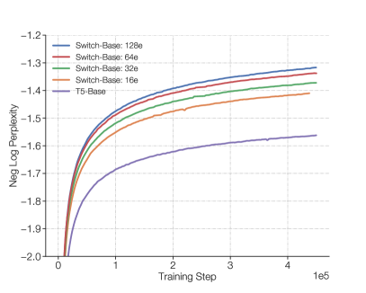

<figcaption>図1: Switch Transformer のスケーリングとサンプル効率。左: ますます疎になる（エキスパートを増やす）Switch Transformer のスケーリング特性。右: 同じ計算予算を使う T5 モデルと Switch Transformer の負の対数パープレキシティ比較。（訳注: 右パネルはクリップから欠落していたため ar5iv から復元）</figcaption>
</figure>

スパースな訓練は研究とエンジニアリングの活発な領域だが [^14] [^13]、今日でも機械学習ライブラリとハードウェアアクセラレータは密な行列積を前提としている。効率的なスパースアルゴリズムを得るため、我々は Mixture-of-Expert（MoE）パラダイム [^22] [^23] [^46] から出発し、訓練の安定性と計算上の利点が得られるようこれを単純化する。MoE モデルは機械翻訳で顕著な成功を収めてきたが [^46] [^47] [^30]、複雑さ・通信コスト・訓練の不安定性が広範な採用を妨げている。

我々はこれらの問題に対処し、さらに翻訳を超えて、このクラスのアルゴリズムが自然言語で広く価値を持つことを見出す。事前学習・ファインチューニング・マルチタスク訓練という NLP の 3 つの体制にわたる多様な自然言語タスクで、優れたスケーリングを測定する。本研究は規模に焦点を当てるが、Switch Transformer アーキテクチャがスーパーコンピュータの領域で卓越するだけでなく、計算コアが数個しかなくても有益であることも示す。さらに、我々の大規模スパースモデルは、スパースモデルの品質利得の 30% を保持したまま、小さな密バージョンへ蒸留 [^18] できる。我々の貢献は以下のとおりである:

- Mixture of Experts を単純化・改良した Switch Transformer アーキテクチャ。
- スケーリング特性と、強力にチューニングされた T5 モデル [^36] に対するベンチマーク。トークンあたり同じ FLOPS を使いながら 7 倍以上の事前学習高速化を測定した。限られた計算資源でも、わずか 2 エキスパートでも改善が成り立つことをさらに示す。
- スパースな事前学習済み・特化ファインチューニング済みモデルの、小さな密モデルへの蒸留の成功。モデルサイズを最大 99% 削減しながら、大規模スパース教師の品質利得の 30% を保持する。
- 改良された事前学習・ファインチューニング技法: (1) 低精度の bfloat16 での訓練を可能にする selective precision 訓練、(2) より多くのエキスパートへのスケーリングを可能にする初期化方式、(3) スパースモデルのファインチューニングとマルチタスク訓練を改善する、強化されたエキスパート正則化。
- 多言語データでの事前学習の恩恵の測定。101 の全言語にわたる普遍的な改善を見出し、91% の言語で mT5 ベースライン [^59] に対する 4 倍以上の高速化を得た。
- データ・モデル・エキスパート並列を効率的に組み合わせ、最大 1 兆パラメータのモデルを作ることによるニューラル言語モデルの規模の拡大。これらのモデルは、強力にチューニングされた T5-XXL ベースラインの事前学習速度を 4 倍改善する。

## 2 Switch Transformer

Switch Transformer の設計指針は、Transformer モデル [^55] のパラメータ数を、**単純かつ計算効率の良い方法で最大化する**ことである。規模の恩恵は [^25] で徹底的に研究され、モデルサイズ・データセットサイズ・計算予算とのべき乗則スケーリングが明らかにされた。重要なことに、同研究は比較的少量のデータで大きなモデルを訓練することを計算最適なアプローチとして推奨している。

これらの結果を受けて、我々は第四の軸を調査する: 例ごとの浮動小数点演算（FLOPs）を一定に保ったまま、*パラメータ数*を増やすのである。我々の仮説は、実行される総計算とは独立に、パラメータ数それ自体がスケーリングの別個に重要な軸だということである。これは、GPU や TPU のような密行列積向けに設計されたハードウェアを効率的に使う、疎に活性化されるモデルを設計することで達成する。本研究は TPU アーキテクチャに焦点を当てるが、このクラスのモデルは GPU クラスタでも同様に訓練できる。我々の分散訓練設定では、疎に活性化される層が*固有の*重みを異なるデバイスに分割する。したがって、モデルの重みはデバイス数とともに増える一方、各デバイス上のメモリと計算のフットプリントは扱いやすい範囲に保たれる。

<figure>


<figcaption>図2: Switch Transformer エンコーダブロックの図解。Transformer にある密な feed forward network（FFN）層を、スパースな Switch FFN 層（薄い青）で置き換える。この層は系列内のトークンに独立に作用する。2 つのトークン（x₁ = "More" と x₂ = "Parameters"）が 4 つの FFN エキスパートにルーティングされる様子（実線）を図示している。ルータは各トークンを独立にルーティングする。Switch FFN 層は、選ばれた FFN の出力にルータのゲート値を掛けたもの（点線）を返す。</figcaption>
</figure>

### 2.1 Simplifying Sparse Routing（スパースルーティングの単純化）

**Mixture of Expert のルーティング。** [^46] は、トークン表現 $x$ を入力に取り、$N$ 個のエキスパートの集合 $\{E_{i}(x)\}_{i=1}^{N}$ から選ばれた最良の top-$k$ エキスパートへこれをルーティングする、自然言語向けの Mixture-of-Experts（MoE）層を提案した。ルータ変数 $W_{r}$ はロジット $h(x)=W_{r}\cdot x$ を生成し、これはその層で利用可能な $N$ エキスパートにわたる softmax 分布で正規化される。エキスパート $i$ のゲート値は次で与えられる。

$$
p_{i}(x)=\frac{e^{h(x)_{i}}}{\sum_{j}^{N}e^{h(x)_{j}}}.
$$

トークン $x$ のルーティングには top-$k$ のゲート値が選択される。$\mathcal{T}$ を選ばれた top-$k$ インデックスの集合とすると、層の出力計算は、各エキスパートのトークンに対する計算をゲート値で線形に重み付けした結合になる。

$$
y=\sum_{i\in\mathcal{T}}p_{i}(x)E_{i}(x).
$$

**Switch ルーティング: Mixture-of-Experts の再考。** [^46] は、ルーティング関数に非自明な勾配を持たせるためには $k>1$ のエキスパートへのルーティングが必要だと推測した。著者らは、少なくとも 2 つのエキスパートを比較する能力なしにはルーティングの学習は機能しないだろうと直観した。[^39] はさらに top-$k$ の決定を研究し、多くのルーティング層を持つモデルでは下位層での高い $k$ 値が重要であることを見出した。これらの考えに反して、我々は**単一の**エキスパートのみにルーティングする単純化された戦略を用いる。この単純化がモデル品質を保ち、ルーティング計算を減らし、より良い性能を発揮することを示す。この $k=1$ のルーティング戦略を、以後 Switch 層と呼ぶ。MoE と Switch ルーティングのどちらでも、式 2 のゲート値 $p_{i}(x)$ がルータの微分可能性を担保することに注意されたい。

Switch 層の利点は 3 つある: (1) トークンを単一のエキスパートにしかルーティングしないため、ルータの計算が減る。(2) 各トークンが単一のエキスパートにしか送られないため、各エキスパートのバッチサイズ（エキスパート容量）を少なくとも半分にできる。[^fn3] (3) ルーティングの実装が単純化され、通信コストが減る。図3 は異なる expert capacity factor でのルーティングの例を示す。

<figure>

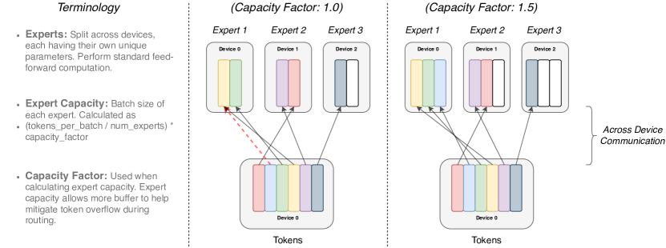

<figcaption>図3: トークンルーティングの動態の図解。各エキスパートは、capacity factor で調節された固定バッチサイズのトークンを処理する。各トークンは最も高いルータ確率を持つエキスパートにルーティングされるが、各エキスパートのバッチサイズは (total_tokens / num_experts) × capacity_factor に固定されている。トークンの割り当てが不均等だと、一部のエキスパートはあふれ（赤い点線）、それらのトークンはこの層では処理されない。より大きな capacity factor はこのあふれを緩和するが、計算・通信コストも増やす（白い空きスロットのパディングで図示）。</figcaption>
</figure>

### 2.2 Efficient Sparse Routing（効率的なスパースルーティング）

我々は Mesh-Tensorflow（MTF）[^47] を用いる。これは Tensorflow [^1] と似たセマンティクスと API を持つライブラリで、効率的な分散データ・モデル並列アーキテクチャを容易にする。物理的なコア群をプロセッサの論理メッシュへ抽象化することでこれを実現する。テンソルと計算は名前付き次元ごとにシャーディングでき、次元に沿ったモデルの分割が容易になる。我々は静的に宣言されたサイズを要求する TPU を念頭にモデルを設計する。以下では我々の分散 Switch Transformer 実装を説明する。

**分散 Switch 実装。** 我々のテンソル形状はすべてコンパイル時に静的に決まるが、訓練・推論時のルーティング決定により計算は*動的*である。このため、重要な技術的考慮事項のひとつが *expert capacity*（エキスパート容量）の設定である。エキスパート容量——各エキスパートが計算するトークン数——は、バッチ内のトークン数をエキスパート数で均等に割り、さらに *capacity factor* で拡張して設定される。

$$
\text{expert capacity}=\left(\frac{\text{tokens per batch}}{\text{number of experts}}\right)\times\text{capacity factor}.
$$

capacity factor が 1.0 より大きいと、トークンがエキスパート間で完全には均衡しない場合に備えた追加バッファが生まれる。あるエキスパートに過剰なトークンがルーティングされた場合（後に dropped tokens と呼ぶ）、計算はスキップされ、トークン表現は残差接続を通じて次の層へ直接渡される。ただし、エキスパート容量の増加には欠点もある。高い値は計算とメモリの浪費を招くからである。このトレードオフは図3 で説明している。経験的に、dropped tokens の割合を低く保つことがスパースエキスパートモデルのスケーリングに重要であることが分かった。実験全体を通じて、ドロップされるトークン数にエキスパート数への依存は見られなかった（典型的には 1% 未満）。十分に大きな係数の補助的負荷分散損失（次節）を使うことで、良好な負荷分散が保証された。これらの設計判断がモデル品質と速度に与える影響は表1 で調べる。

**微分可能な負荷分散損失。** エキスパート間の負荷の均衡を促すため、補助損失 [^46] [^47] [^30] を追加する。[^47] [^30] と同様、Switch Transformer は、負荷分散と重要度重み付けの損失を別々に持っていた [^46] の元設計を単純化する。各 Switch 層について、この補助損失は訓練中に総モデル損失へ加算される。$i=1$ から $N$ でインデックスされる $N$ 個のエキスパートと、$T$ 個のトークンを持つバッチ $\mathcal{B}$ が与えられたとき、補助損失はベクトル $f$ と $P$ のスケールされた内積として計算される。

$$
\text{loss}=\alpha\cdot N\cdot\sum_{i=1}^{N}f_{i}\cdot P_{i}
$$

ここで $f_{i}$ はエキスパート $i$ に振り分けられたトークンの割合であり、

$$
f_{i}=\frac{1}{T}\sum_{x\in\mathcal{B}}\mathbb{1}\{\text{argmax}\,p(x)=i\}
$$

$P_{i}$ はエキスパート $i$ に割り当てられたルータ確率の割合である。[^fn4]

$$
P_{i}=\frac{1}{T}\sum_{x\in\mathcal{B}}p_{i}(x).
$$

我々はトークンのバッチが $N$ エキスパートへ一様にルーティングされることを求めるので、両ベクトルの値が $1/N$ であることを望む。式 4 の補助損失は一様分布の下で最小化されるため、一様なルーティングを促す。$P$ ベクトルが微分可能なので、この目的関数も微分できる（$f$ ベクトルは微分不能）。最終的な損失にはエキスパート数 $N$ を掛ける。一様ルーティングの下では $\sum_{i=1}^{N}(f_{i}\cdot P_{i})=\sum_{i=1}^{N}(\frac{1}{N}\cdot\frac{1}{N})=\frac{1}{N}$ となるため、エキスパート数が変わっても損失を一定に保つためである。最後に、ハイパーパラメータ $\alpha$ はこれらの補助損失の乗法係数である。本研究全体を通じて $\alpha=10^{-2}$ を用いた。これは負荷分散を保証するのに十分大きく、主目的である交差エントロピーを圧倒しない程度に小さい。$\alpha$ を $10^{-1}$ から $10^{-5}$ まで 10 の累乗で掃引し、$10^{-2}$ が訓練損失に干渉せず素早く負荷を均衡させることを確認した。

### 2.3 Putting It All Together: The Switch Transformer（総まとめ）

Switch Transformer の最初のテストは、[^36] で導入された「Colossal Clean Crawled Corpus」（C4）での事前学習から始める。事前学習の目的関数にはマスク言語モデリングタスク [^54] [^12] [^9] を使い、モデルは欠けたトークンを予測するよう訓練される。[^36] で最適と定められた事前学習設定に従い、トークンの 15% をドロップアウトし、マスクされた系列を単一のセンチネルトークンで置き換える。モデルの比較には負の対数パープレキシティを記録する。[^fn5] 本論文の全表を通じて、$\uparrow$ はその指標で高い値が良いことを、$\downarrow$ はその逆を示す。本研究で調べた全モデルの比較は表9 にある。

**表1**: Switch 対 MoE のベンチマーク。Switch Transformer の MoE Transformer と T5 密ベースラインに対する、ステップあたり・時間あたりの利点を測る一対一比較。品質は負の対数パープレキシティで、また Neg. Log Perp. = −1.50 という任意に選んだ品質閾値への到達時間で測る。すべての MoE・Switch Transformer モデルは 128 エキスパートを使い、1 つおきの feed-forward 層にエキスパートを置く。Switch-Base+ では、隠れサイズを 768 から 896 へ、ヘッド数を 14 から 16 へ増やし、MoE モデルの速度に一致するまでモデルサイズを大きくした。全モデルは同量の計算（32 コア）・同一ハードウェア（TPUv3）で訓練した。なお、全モデルとも閾値 −1.50 への到達には 10 万ステップを超える事前学習を要した。† T5-Base は訓練した 10 万ステップ内でこの負の対数パープレキシティに到達しなかった。

| Model | Capacity Factor | Quality after 100k steps ($\uparrow$) (Neg. Log Perp.) | Time to Quality Threshold ($\downarrow$) (hours) | Speed ($\uparrow$) (examples/sec) |
| --- | --- | --- | --- | --- |
| T5-Base | — | -1.731 | Not achieved† | 1600 |
| T5-Large | — | -1.550 | 131.1 | 470 |
| MoE-Base | 2.0 | -1.547 | 68.7 | 840 |
| Switch-Base | 2.0 | -1.554 | 72.8 | 860 |
| MoE-Base | 1.25 | -1.559 | 80.7 | 790 |
| Switch-Base | 1.25 | -1.553 | 65.0 | 910 |
| MoE-Base | 1.0 | -1.572 | 80.1 | 860 |
| Switch-Base | 1.0 | -1.561 | 62.8 | 1000 |
| Switch-Base+ | 1.0 | -1.534 | 67.6 | 780 |

Switch Transformer と MoE Transformer の一対一比較を表1 に示す。我々の Switch Transformer モデルは「T5-Base」[^36] と FLOP を一致させている（トークンあたり同量の計算を適用する）。top-2 ルーティングを使う MoE Transformer は、各トークンに別々の FFN を 2 つ適用するため FLOPS はより大きい。全モデルは同一ハードウェアで同じステップ数だけ訓練した。なお上記の実験設定では、MoE モデルは capacity factor を 2.0 から 1.25 に下げると実際には遅くなる（840 → 790）。これは予想外である。[^fn6]

表1 から 3 つの重要な発見を強調する: (1) Switch Transformer は、速度・品質の基準で、注意深くチューニングされた密モデルと MoE Transformer の両方を上回る。固定された計算量と実時間に対して、Switch Transformer が最良の結果を達成する。(2) Switch Transformer は MoE 版より計算フットプリントが小さい。MoE Transformer の訓練速度に一致するまでサイズを増やすと、ステップあたりでもすべての MoE・密モデルを上回る。(3) Switch Transformer はより低い capacity factor（1.0, 1.25）でより良い性能を発揮する。小さなエキスパート容量は、モデルメモリが非常に希少で capacity factor をできるだけ小さくしたい大規模モデル体制のシナリオを示唆している。

### 2.4 Improved Training and Fine-Tuning Techniques（改良された訓練・ファインチューニング技法）

スパースエキスパートモデルは、素の Transformer に比べて訓練の困難をもたらしうる。これらの各層でのハードな切り替え（ルーティング）決定が不安定性の原因になりうるからである。さらに、bfloat16 [^58] のような低精度形式は、ルータの softmax 計算の問題を悪化させうる。ここでは訓練の困難と、安定でスケーラブルな訓練を達成するために我々が用いた手法を説明する。

**大規模スパースモデルの selective precision。** モデルの不安定性は効率的な bfloat16 精度での訓練を妨げ、その結果 [^30] は MoE Transformer 全体を float32 精度で訓練している。しかし我々は、モデルの局所的な部分の中でのみ*選択的に* float32 精度へキャストすることで、float32 テンソルの高価な通信コストを負うことなく安定性を達成できることを示す。この技法は、モデルの特定部分と勾配更新をより高い精度で行う現代の混合精度訓練戦略 [^31] と軌を一にする。表2 は、我々のアプローチが bfloat16 訓練とほぼ同等の速度を許しながら、float32 の訓練安定性を与えることを示している。

**表2**: selective precision。ローカルなルーティング演算を float32 にキャストし、それ以外を bfloat16 精度に保つことで、（不安定な）bfloat16 精度の訓練とほぼ同等の速度を達成しつつモデルを安定化する。32 エキスパートのモデルの訓練初期の固定ステップ後の品質と速度性能を測定した。float32 と selective precision の Switch-Base はよく似た学習動態を示した。

| Model (precision) | Quality (Neg. Log Perp.) ($\uparrow$) | Speed (Examples/sec) ($\uparrow$) |
| --- | --- | --- |
| Switch-Base (float32) | -1.718 | 1160 |
| Switch-Base (bfloat16) | -3.780 [*diverged*] | 1390 |
| Switch-Base (Selective precision) | -1.716 | 1390 |

これを達成するために、ルータの入力を float32 精度にキャストする。ルータ関数はトークンを入力に取り、エキスパート計算の選択と再結合に使われる dispatch・combine テンソルを生成する（詳細は付録のコードブロック 15 を参照）。重要なのは、float32 精度が*ルータ関数の内部でのみ*——そのデバイスにローカルな計算で——使われることである。結果として得られる dispatch・combine テンソルは関数の最後に bfloat16 精度へ再キャストされるため、高価な float32 テンソルが all-to-all 通信でブロードキャストされることはないが、float32 の高い安定性の恩恵は受けられる。

**安定性のための小さなパラメータ初期化。** 適切な初期化は深層学習の成功する訓練にとって決定的であり、Switch Transformer では特にそうであることを我々は観察した。重み行列は、平均 $\mu=0$・標準偏差 $\sigma=\sqrt{s/n}$ の切断正規分布から要素を引いて初期化する。ここで $s$ はスケールのハイパーパラメータ、$n$ は重みテンソルの入力ユニット数（fan-in）である。[^fn7]

不安定性への追加の対策として、Transformer のデフォルト初期化スケール $s=1.0$ を 10 分の 1 に減らすことを推奨する。これは我々の実験において、品質を改善し、訓練が不安定化する可能性を減らす。表3 は訓練初期のモデル品質の改善と分散の減少を測定している。

**表3**: 初期化スケールの縮小は安定性を改善する。初期化スケールを減らすと、Switch Transformer のモデル品質が向上し、訓練がより安定する。ここでは 32 エキスパートモデルの 3.5k ステップ後の品質（負の対数パープレキシティ）の平均と標準偏差を記録する（各 3 つの乱数シード）。

| Model (Initialization scale) | Average Quality (Neg. Log Perp.) | Std. Dev. of Quality (Neg. Log Perp.) |
| --- | --- | --- |
| Switch-Base (0.1x-init) | -2.72 | 0.01 |
| Switch-Base (1.0x-init) | -3.60 | 0.68 |

Neg. Log Perp. で測った平均モデル品質は劇的に改善し、実行間の分散もはるかに小さくなることが分かる。さらに、この同じ初期化方式は数桁にわたる規模のモデルで広く有効である。223M パラメータのベースラインから 1 兆パラメータを超える巨大モデルまで、同じアプローチで安定に訓練した。

**大規模スパースモデルの正則化。** 本論文は、大きなコーパスでの事前学習に続けて、要約や質問応答のような小さな下流タスクでファインチューニングするという、一般的な NLP アプローチを考える。自然に生じる問題が過学習である。多くのファインチューニングタスクは例が非常に少ないからだ。標準的な Transformer のファインチューニングでは、[^36] が各層で dropout [^49] を使って過学習を防いでいる。我々の Switch Transformer は FLOP を揃えた密ベースラインより大幅に多くのパラメータを持ち、これらの小さな下流タスクではより深刻な過学習につながりうる。

**表4**: ファインチューニングの正則化の結果。C4 データセットの 34B トークンで事前学習した Switch Transformer モデルをファインチューニングする際の dropout 率の掃引（数値は高いほど良い）。非エキスパート層には低い標準 dropout 率を、エキスパートの feed-forward 層にはずっと大きな dropout 率を使うのが最良の性能を示す。

| Model (dropout) | GLUE | CNNDM | SQuAD | SuperGLUE |
| --- | --- | --- | --- | --- |
| T5-Base (d=0.1) | 82.9 | 19.6 | 83.5 | 72.4 |
| Switch-Base (d=0.1) | 84.7 | 19.1 | 83.7 | 73.0 |
| Switch-Base (d=0.2) | 84.4 | 19.2 | 83.9 | 73.2 |
| Switch-Base (d=0.3) | 83.9 | 19.6 | 83.4 | 70.7 |
| Switch-Base (d=0.1, ed=0.4) | 85.2 | 19.6 | 83.7 | 73.0 |

そこで、ファインチューニング中のこの問題を緩和する単純な方法を提案する: エキスパート内部の dropout を増やすのである。これを *expert dropout* と名付ける。ファインチューニング中、各エキスパート層の中間の feed-forward 計算においてのみ、dropout 率を大幅に引き上げる。表4 に expert dropout プロトコルの結果を示す。全層で単純に dropout を増やすと性能はむしろ悪化する。しかし、非エキスパート層に小さめの dropout 率（0.1）を、エキスパート層にずっと大きな dropout 率（0.4）を設定すると、4 つの小さな下流タスクで性能が向上する。

## 3 Scaling Properties（スケーリング特性）

事前学習中の Switch Transformer アーキテクチャの*スケーリング特性*の研究を提示する。[^25] に従い、モデルが計算予算にもデータ量にもボトルネックされない体制を考える。データのボトルネックを避けるため、180B 超のターゲットトークンを持つ大きな C4 コーパス [^36] を使い、逓減リターンが観察されるまで訓練する。

エキスパート数は、我々のモデルをスケールさせる最も効率的な次元である。エキスパートを増やしても計算コストはほぼ固定に保たれる。モデルは選択肢のエキスパート数に関係なく、トークンごとに 1 つのエキスパートしか選ばないからである。ルータはより多くのエキスパートにわたる確率分布を計算しなければならないが、これは $O(d_{model}\times\text{num experts})$ の軽量な計算である。ここで $d_{model}$ は層間で受け渡されるトークンの埋め込み次元である。本節では、固定された計算予算の下で、ステップ基準と時間基準のスケーリング特性を考える。

### 3.1 Scaling Results on a Step-Basis（ステップ基準のスケーリング結果）

図4 は、全モデルを固定ステップ数で訓練したときの、エキスパート数に応じた一貫したスケーリングの利点を示している。明確な傾向が観察される: トークンあたりの FLOPS を固定したまま、パラメータ（エキスパート）を増やすと訓練が速くなる。左の図は、スパースモデルのパラメータとテスト損失の間の一貫したスケーリング特性（トークンあたり FLOPS 固定）を示す。これはスパースモデルパラメータという追加の軸に沿ったスケーリングの優位性を明らかにする。右の図は、密モデル 1 種と FLOP を揃えたスパース 4 種のサンプル効率を測定する。エキスパート数を増やすほどサンプル効率の高いモデルになることが分かる。我々の Switch-Base 64 エキスパートモデルは、T5-Base がステップ 45 万で達する性能をステップ 6 万で達成する——ステップ時間で 7.5 倍の高速化である。加えて、[^25] の知見と一致して、より大きなモデルの方が*サンプル効率も高い*——観測トークン数を固定すると、より速く学習する。

<figure>

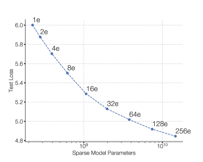


<figcaption>図4: Switch Transformer のスケーリング特性。左: エキスパート数のスケーリングによってパラメータが増えるにつれた、パープレキシティで測る品質改善。左上の点は 223M パラメータの T5-Base に対応する。左上から右下へ、エキスパート数を 2, 4, 8 と倍々にし、右下の 256 エキスパート・14.7B パラメータのモデルまで至る。全モデルが等しい計算予算を使うにもかかわらず、エキスパート数のスケーリングで一貫した改善が観察される。右: エキスパート数を掃引したステップあたりの負の対数パープレキシティ。密ベースラインは紫の線で示し、Switch-Base モデルのサンプル効率の改善が見て取れる。（訳注: 右パネルはクリップから欠落していたため ar5iv から復元）</figcaption>
</figure>

### 3.2 Scaling Results on a Time-Basis（時間基準のスケーリング結果）

図4 は、ステップ基準ではエキスパート数を増やすほど性能が一貫して改善することを示した。我々のモデルはベースラインとトークンあたりほぼ同量の FLOPS を持つが、デバイス間の追加の通信コストとルーティング機構の追加計算を負っている。したがって、ステップ基準で観察されたサンプル効率の向上が、実時間で測るより良いモデル品質に必ずしも翻訳されるとは限らない。ここで次の問いが生じる:

*固定された訓練時間と計算予算に対して、密なモデルとスパースなモデルのどちらを訓練すべきか?*

<figure>

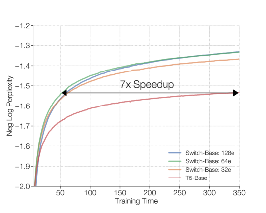

<figcaption>図5: Switch Transformer の速度優位。全モデルを 32 の TPUv3 コアで、例あたり等しい FLOPs で訓練。固定された計算量と訓練時間に対して、Switch Transformer は密な Transformer ベースラインを大幅に上回る。我々の 64 エキスパート Switch-Base モデルは、T5-Base の 7 分の 1 の時間で同じ品質に到達し、さらに改善を続ける。</figcaption>
</figure>

図5 と図6 がこの問いに答える。図5 は事前学習のモデル品質を時間の関数として測定する。固定された訓練時間と計算予算に対して、Switch Transformer は大幅なスピードアップをもたらす。この設定で、我々の Switch-Base 64 エキスパートモデルは、T5-Base が同様のパープレキシティに到達するのにかかる時間の* 7 分の 1 *で訓練できる。

### 3.3 Scaling Versus a Larger Dense Model（より大きな密モデルとのスケーリング比較）

上の分析は、計算を揃えた密モデルが Switch 版に追い越されることを示した。図6 は別のシナリオを考える: もし資源をより大きな密モデルに割り当てていたらどうなっていたか? これを今から行い、Switch-Base を次の強力なベースライン *T5-Large* と比較する。T5-Large はトークンあたり 3.5 倍の FLOPs を適用するにもかかわらず、Switch-Base の方がサンプル効率が高く、2.5 倍の高速化をもたらす。さらに、T5-Large に FLOP を揃えた新しい、より大きなスパース版 Switch-Large を設計すれば、さらなる利得が得られる。実際にそれを行い、次節で優れたスケーリングとファインチューニングを実証する。

<figure>

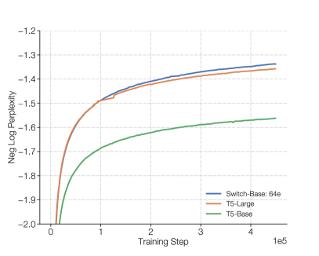

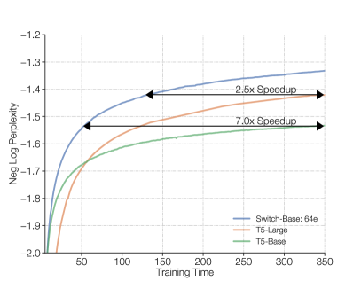

<figcaption>図6: Switch 層でスケールする場合と標準的な密モデルのスケーリングの比較。左: Switch-Base は、T5-Base と、トークンあたり 3.5 倍の FLOPS を適用する T5-Large の両方よりサンプル効率が高い。右: 前と同様、実時間基準でも Switch-Base の方が速く、T5-Large に対して 2.5 倍の高速化をもたらす。（訳注: 右パネルはクリップから欠落していたため ar5iv から復元）</figcaption>
</figure>

## 4 Downstream Results（下流タスクの結果）

第 3 節は事前学習での優れたスケーリング特性を実証した。ここからは、その利得が下流タスクでの言語学習能力の改善に翻訳されることを検証する。まず多様な NLP タスクでファインチューニングする。次に、スパースモデルのメモリフットプリントを 90% 以上削減して、小さく展開の容易な密ベースラインへ蒸留する研究を行う。最後に、マルチタスク・多言語の設定での改善を測定して本節を締めくくる。そこでは Switch Transformer が強力なマルチタスク学習器であり、101 の全言語で多言語 T5-base モデルを改善することを示す。

### 4.1 Fine-Tuning（ファインチューニング）

**ファインチューニングに使うベースラインと Switch モデル。** ベースラインは、高度にチューニングされた 223M パラメータの T5-Base と 739M パラメータの T5-Large [^36] である。どちらの版についても、はるかに多くのパラメータを持つ FLOP 一致の Switch Transformer を設計する（表9 に要約）。[^fn8] ベースラインは [^36] のものとわずかに異なる。例内のテキスト重複を除去して事前学習タスクとしての有効性を高めた、改良版 C4 コーパス [^29] で事前学習しているためである。我々のプロトコルでは、バッチあたり $2^{20}$（1,048,576）トークンで 55 万ステップ、計 576B トークンの事前学習を行う。その後、Switch 層のみ dropout 0.4・それ以外の全層は 0.1 で（表4 参照）、多様なタスク群でファインチューニングする。バッチサイズ 1M で 16k ステップのファインチューニングを行い、各タスクについて 200 ステップごとに品質を評価し、検証セットでのピーク性能を報告する。

**ファインチューニングのタスクとデータセット。** 質問応答・要約・世界に関する知識を含む、言語能力を探るタスクを選ぶ。言語ベンチマークの GLUE [^56] と SuperGLUE [^57] は、各タスクに含まれるトークン量に比例して全タスクを混合した複合ミクスチャとして扱う。これらのベンチマークは、感情分析（SST-2）、語義曖昧性解消（WIC）、文類似度（MRPC, STS-B, QQP）、自然言語推論（MNLI, QNLI, RTE, CB）、質問応答（MultiRC, RECORD, BoolQ）、照応解析（WNLI, WSC）、文完成（COPA）、文容認性（CoLA）を要するタスクから成る。記事要約の能力は CNNDM [^17] と BBC XSum [^32] データセットで測る。質問応答は SQuAD データセット [^38] と ARC Reasoning Challenge [^7] で探る。そして [^41] と同様、3 つの closed-book 質問応答データセット——Natural Questions [^27]・Web Questions [^3]・Trivia QA [^24]——でのファインチューニングによりモデルの知識を評価する。closed-book とは、補足の参照資料や文脈資料なしで問われる質問を指す。モデルの常識推論を測るために Winogrande Schema Challenge [^43] で評価する。最後に、Adversarial NLI Benchmark [^33] で自然言語推論の能力をテストする。

**表5**: ファインチューニングの結果。多様な自然言語テスト群での T5 ベースラインと Switch モデルのファインチューニング結果（検証セット。数値は高いほど良い）。FLOP 一致の Switch モデルを T5-Base・T5-Large ベースラインと比較する。検討したタスクの大半で、Switch 版の大幅な改善が見られる。両方のモデルサイズ、そして推論偏重・知識偏重の両方の言語タスクにわたって利得が観察される。

| Model | GLUE | SQuAD | SuperGLUE | Winogrande (XL) |
| --- | --- | --- | --- | --- |
| T5-Base | 84.3 | 85.5 | 75.1 | 66.6 |
| Switch-Base | 86.7 | 87.2 | 79.5 | 73.3 |
| T5-Large | 87.8 | 88.1 | 82.7 | 79.1 |
| Switch-Large | 88.5 | 88.6 | 84.7 | 83.0 |

| Model | XSum | ANLI (R3) | ARC Easy | ARC Chal. |
| --- | --- | --- | --- | --- |
| T5-Base | 18.7 | 51.8 | 56.7 | 35.5 |
| Switch-Base | 20.3 | 54.0 | 61.3 | 32.8 |
| T5-Large | 20.9 | 56.6 | 68.8 | 35.5 |
| Switch-Large | 22.3 | 58.6 | 66.0 | 35.5 |

| Model | CB Web QA | CB Natural QA | CB Trivia QA |
| --- | --- | --- | --- |
| T5-Base | 26.6 | 25.8 | 24.5 |
| Switch-Base | 27.4 | 26.8 | 30.7 |
| T5-Large | 27.7 | 27.6 | 29.5 |
| Switch-Large | 31.3 | 29.5 | 36.9 |

**ファインチューニングの指標。** 本論文全体で次の評価指標を使う: GLUE と SuperGLUE は全サブタスクの平均スコアを報告する。CNNDM と XSum には Rouge-2 指標を使う。SQuAD と closed-book タスク（Web, Natural, Trivia Questions）では、ターゲットに正確に一致した回答の割合を報告する（この指標の詳細と欠陥は [^41] を参照）。最後に、ARC Easy・ARC Challenge・ANLI・Winogrande では生成された応答の正解率を報告する。

**ファインチューニングの結果。** 多くの自然言語タスクで大幅な下流の改善が観察される。顕著な改善は SuperGLUE で、FLOP 一致の Switch 版が T5-Base・T5-Large ベースラインをそれぞれ 4.4・2 パーセントポイント上回り、Winogrande・closed-book Trivia QA・XSum でも大きな改善が見られる。[^fn9] ファインチューニングの研究で利得が観察されなかった唯一のタスクは AI2 Reasoning Challenge（ARC）データセットで、challenge データセットでは T5-Base が Switch-Base を、easy データセットでは T5-Large が Switch-Large を上回る。全体として、推論偏重・知識偏重の両方のタスクにわたる大幅な改善が観察される。これは、我々のアーキテクチャが事前学習に優れるだけでなく、ファインチューニングを介して品質改善を下流タスクへ翻訳できることを検証している。

### 4.2 Distillation（蒸留）

数十億、あるいは数兆のパラメータを持つ巨大なニューラルネットワークの展開は不便である。これを緩和するため、大規模スパースモデルを小さな密モデルへ蒸留 [^18] する研究を行う。将来の研究としては、大きなモデルをより小さな*スパース*モデルへ蒸留することも考えられる。

**蒸留の技法。** 表6 で様々な蒸留技法を調べる。これらの技法は、BERT モデルの蒸留手法を研究した [^44] に基づいている。密モデルを非エキスパートの重みで初期化するとささやかな改善が得られることが分かった。全モデルが FLOP 一致なので、非エキスパート層は同じ次元を持ち、これが可能になる。エキスパート層は通常、Transformer の FFN 層の全部または 1 つおきにしか追加されないため、多くの重みを訓練済みパラメータで初期化できる。さらに、教師確率 0.25・正解ラベル 0.75 の混合を使うと蒸留の改善が観察される。両技法を組み合わせることで、パラメータを約 1/20 にしながら、より大きなスパースモデルの品質利得の約 30% を保持できる。品質利得とは、Switch-Base（教師）と T5-Base（学生）の品質差に対する割合を指す。したがって品質利得 100% は、学生が教師の性能に並ぶことを意味する。

**表6**: 言語モデリングのための Switch Transformer の蒸留。T5-Base を Switch-Base の非エキスパート重みで初期化し、教師と正解ラベルの混合による損失を使うのが最良の性能を得る。100 倍のパラメータを持つ大規模スパースモデルの性能改善の 30% を、小さな密モデルへ蒸留できる。最後のベースラインとして、エキスパートでない重みで初期化した T5-Base を蒸留なしで普通に訓練しても改善は見られない。

| Technique | Parameters | Quality ($\uparrow$) |
| --- | --- | --- |
| T5-Base | 223M | -1.636 |
| Switch-Base | 3,800M | -1.444 |
| Distillation | 223M | (3%) -1.631 |
| + Init. non-expert weights from teacher | 223M | (20%) -1.598 |
| + 0.75 mix of hard and soft loss | 223M | (29%) -1.580 |
| Initialization Baseline (no distillation) |  |  |
| Init. non-expert weights from teacher | 223M | -1.639 |

**達成可能な圧縮率。** 表6 で述べた最良の蒸留技法を使い、多様なスパースモデルを密モデルへ蒸留する。エキスパート数を増やしながら Switch-Base 版を蒸留する。これは 1.1B から 14.7B パラメータの範囲に相当する。蒸留により、1.1B パラメータモデルの品質利得の 37% を保持しながら 82% 圧縮できる。極端な場合、モデルを 99% 圧縮しても、教師モデルの品質改善の 28% を維持できる。

**表7**: 蒸留の圧縮率。大規模スパースモデルを密ベースラインへ蒸留したときの品質を測る。ベースラインの T5-Base は −1.636 の Neg. Log Perp. 品質を持つ。右の列では、ますます大きなスパースモデルをこの同じアーキテクチャへ蒸留する。重み初期化とハード・ソフト損失の混合の組み合わせにより、スパースな教師を 95% 以上縮小しながら品質利得の 30% を保持できる。ただし、大幅に優れた・より大きな事前学習済み教師については、これらの圧縮率を達成するにはより大きな学生モデルが必要になると予想される。

|  | Dense | Sparse |  |  |  |  |
| --- | --- | --- | --- | --- | --- | --- |
| Parameters | 223M | 1.1B | 2.0B | 3.8B | 7.4B | 14.7B |
| Pre-trained Neg. Log Perp. ($\uparrow$) | -1.636 | -1.505 | -1.474 | -1.444 | -1.432 | -1.427 |
| Distilled Neg. Log Perp. ($\uparrow$) | — | -1.587 | -1.585 | -1.579 | -1.582 | -1.578 |
| Percent of Teacher Performance | — | 37% | 32% | 30% | 27% | 28% |
| Compression Percent | — | 82% | 90% | 95% | 97% | 99% |

**ファインチューニング済みモデルの蒸留。** ファインチューニング済みのスパースモデルを密モデルへ蒸留する研究で締めくくる。表8 は、SuperGLUE タスクでファインチューニングした 7.4B パラメータの Switch-Base モデルを、223M の T5-Base へ蒸留した結果を示す。事前学習の結果と同様、FLOP 一致の密な変種へ蒸留するとき、スパースモデルの利得の 30% を保持できることが分かる。ここでは考慮しなかった将来の道のひとつは、ファインチューニングタスクに使われている特定のエキスパートを調べ、それらを抽出してより良いモデル圧縮を達成することかもしれない。

**表8**: ファインチューニング済み SuperGLUE モデルの蒸留。SuperGLUE タスクでファインチューニングした Switch-Base モデルを T5-Base へ蒸留する。小さめのデータセットでは、我々の大規模スパースモデルが蒸留の効果的な教師になりうることが観察される。97% 圧縮したモデルで、ここでも教師の性能の 30% を達成している。

| Model | Parameters | FLOPS | SuperGLUE ($\uparrow$) |
| --- | --- | --- | --- |
| T5-Base | 223M | 124B | 74.6 |
| Switch-Base | 7410M | 124B | 81.3 |
| Distilled T5-Base | 223M | 124B | (30%) 76.6 |

### 4.3 Multilingual Learning（多言語学習）

下流実験の最後のセットとして、101 の異なる言語の混合で事前学習しながら、モデルの品質と速度のトレードオフを測定する。T5 の多言語拡張である mT5 [^59] の最近の仕事の上に構築しベンチマークする。mT5 で導入された、101 言語にまたがる Common Crawl データセットの多言語版（mC4）で事前学習するが、一部の言語内の文字体系の変種のため、混合は 107 タスクを含む。

<figure>

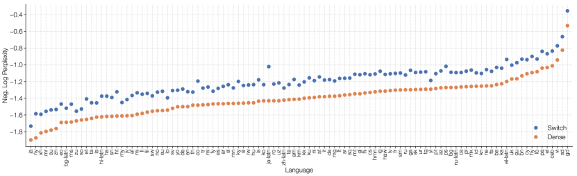

<figcaption>図7: 101 言語での多言語事前学習。101 言語のマルチタスク訓練における、密ベースラインに対する Switch T5 Base モデルの改善。Switch Transformer はマルチタスク訓練設定で非常に良く機能し、101 の全言語で改善をもたらすことが観察される。</figcaption>
</figure>

<figure>

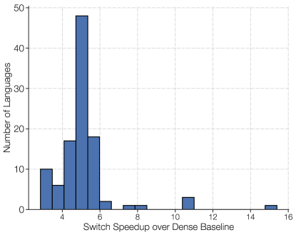

<figcaption>図8: 101 言語での多言語事前学習。各言語について、同じ品質に到達するための、FLOP 一致の T5 密ベースラインに対する Switch Transformer のステップ高速化をヒストグラムにした。101 の全言語で、mT5-Base に対する平均ステップ高速化は 5 倍であり、91% の言語で mT5-Base の最終パープレキシティへの到達に 4 倍以上の高速化を記録した。</figcaption>
</figure>

図7 では、FLOP 一致の Switch モデル mSwitch-Base の、T5 base 版 mT5-Base に対する全言語での品質改善（負の対数パープレキシティ）をプロットする。両版を 100 万ステップ事前学習した後、検討した 101 の*すべての*言語で、Switch Transformer がベースラインに対して最終的な負の対数パープレキシティを高めることが分かる。図8 では別の見方を示し、mT5-Base に対して Switch Transformer を使うことによるステップあたりの*高速化*をヒストグラムにする。[^fn10] mT5-Base に対する平均 5 倍の高速化が見られ、91% の言語が少なくとも 4 倍の高速化を達成する。これは、Switch Transformer が効果的なマルチタスク・多言語の学習器であることの証拠を示している。

## 5 Designing Models with Data, Model, and Expert-Parallelism（データ・モデル・エキスパート並列によるモデル設計）

エキスパート数を恣意的に増やすことには逓減リターンが伴う（図4）。ここでは*補完的な*スケーリング戦略を説明する。Transformer をスケールさせる一般的な方法は、$d_{model}$ や $d_{ff}$ のような次元を揃って増やすことである。これはパラメータと実行される計算の両方を増やすが、最終的にはアクセラレータあたりのメモリで制限される。アクセラレータのメモリサイズを超えたら、single program multiple data（SPMD）のモデル並列を使える。本節はデータ・モデル・エキスパート並列を組み合わせるトレードオフを研究する。

**Feed-Forward Network（FFN）層の復習。** データ・モデル・エキスパート並列が Mesh TensorFlow [^47] でどう機能するかの例として FFN 層を使い、ここで簡潔に復習する。バッチに $B$ 個のトークンがあり、各トークンの次元は $d_{model}$ とする。FFN の入力（$x$）と出力（$y$）はどちらもサイズ [$B$, $d_{model}$] で、中間（$h$）はサイズ [$B$, $d_{ff}$] である。$d_{ff}$ は通常 $d_{model}$ の数倍大きい。FFN では中間が $h=xW_{in}$、層の出力が $y=ReLU(h)W_{out}$ である。したがって $W_{in}$ と $W_{out}$ は各トークンに独立に適用され、サイズは [$d_{model}$, $d_{ff}$] と [$d_{ff}$, $d_{model}$] である。

分割の 2 つの側面——*重み*と*データのバッチ*がコア上でどう分かれるか——を説明する（図9 に図示）。利用可能な全コアを $N$ で表し、Mesh Tensorflow はこれをプロセッサの論理的多次元メッシュへ再マップできる。ここでは 2 次元の論理メッシュを作る。一方の次元はデータ並列のシャーディングの分割数（$n$）、もう一方はモデル並列のシャーディングの分割数（$m$）を表す。総コア数はデータ並列とモデル並列の両方にわたる分割数に等しくなければならない。すなわち $N=n\times m$ である。層をコア間でシャーディングするために、$B$ トークンのバッチを含むテンソルは $n$ 個のデータ並列コアにわたってシャーディングされ、各コアは $B/n$ トークンを含む。$d_{ff}$ を持つテンソルと変数は $m$ 個のモデル並列コアにわたってシャーディングされる。エキスパート層を持つ変種については、$E$ 個のエキスパートを考え、それぞれが最大 $C$ 個のトークンを処理できる。

| 記号 | 説明 |
| --- | --- |
| $B$ | バッチ内のトークン数。 |
| $N$ | 総コア数。 |
| $n$ | データ並列シャーディングの分割数。 |
| $m$ | モデル並列シャーディングの分割数。 |
| $E$ | Switch 層のエキスパート数。 |
| $C$ | エキスパート容量（各エキスパートのバッチサイズ）。 |

<figure>


<figcaption>図9: データと重みの分割戦略。点線の 4×4 の格子はそれぞれ 16 コアを表し、色付きの正方形はそのコアに置かれるデータ（モデルの重みまたはトークンのバッチ）である。各戦略についてモデルの重みとデータテンソルがどう分割されるかを図示する。1 行目: モデルの重みがコア間でどう分割されるか。この行の異なるサイズの形は、FFN 層のより大きな重み行列（例: より大きな d_ff サイズ）を表す。色付き正方形の各色は固有の重み行列を識別する。コアあたりのパラメータ数は固定だが、より大きな重み行列は各トークンにより多くの計算を適用する。2 行目: データバッチがコア間でどう分割されるか。各コアは同数のトークンを保持し、全戦略で固定のメモリ使用量を維持する。分割戦略により、各コアが同じトークンを持つか異なるトークンを持つかの性質が異なり、それを色の違いが象徴している。</figcaption>
</figure>

### 5.1 Data Parallelism（データ並列）

データ並列モデルを訓練するとき——これは分散訓練の標準である——全コアはデータ並列次元に割り当てられる。すなわち $n=N,m=1$ である。この方式には、forward・backward パス全体が終わって勾配を全コアで集約する必要が生じるまで、通信が一切不要という利点がある。これは図9 の最も左の列に対応する。

### 5.2 Model Parallelism（モデル並列）

次に、全コアをモデル並列次元だけに割り当てるシナリオを考える。すなわち $n=1,m=N$ である。今度は全コアが完全な $B$ トークンを保持しなければならず、各コアは重みの固有のスライスを含む。forward・backward パスのたびに通信コストが発生する。$d_{ff}$ 次元が分割されており総和を取る必要があるため、各コアは 2 番目の行列積 $ReLU(h)W_{out}$ を計算するためにサイズ [$B$, $d_{model}$] のテンソルを送る。一般則として、コア間で分割された次元の総和が必要になるたびに、forward・backward の両方に all-reduce 演算が追加される。これは、all-reduce が forward・backward パス全体の最後にしか起きない純粋なデータ並列と対照的である。

### 5.3 Model and Data Parallelism（モデル並列とデータ並列）

大規模モデルではモデル並列とデータ並列の混合が一般的であり、最大級の T5 モデル [^36] [^59] や GPT-3 [^4] でもそうされた。合計 $N=n\times m$ コアで、各コアは $B/n$ トークンと、重み・中間活性化の $d_{ff}/m$ を担当する。forward・backward パスで各コアはサイズ $[B/n,d_{model}]$ のテンソルを all-reduce 演算で通信する。

### 5.4 Expert and Data Parallelism（エキスパート並列とデータ並列）

次にエキスパート並列とデータ並列の分割戦略を説明する。Switch Transformer は全コアをデータ分割次元 $n$ に割り当て、これはモデルのエキスパート数にも対応する。コアごとの各トークンについて、ルータがローカルにエキスパートへの割り当てを計算する。出力はサイズ [$n$, $B/n$, $E$, $C$] の二値行列で、第 1 次元にわたって分割され、エキスパートの割り当てを決定する。この二値行列を使い、サイズ [$n$, $B/n$, $d_{model}$] の入力テンソルとの行列積で gather を行う。

$$
\text{einsum}([n,B/n,d_{model}],[n,B/n,E,C],\text{dimension}=[B/n])
$$

その結果、形状 [$n$, $E$, $C$, $d_{model}$] の最終テンソルが得られ、これは第 1 次元にわたってシャーディングされる。各コアは自分のエキスパートを持つため、$n$ 次元の代わりに $E$ 次元をシャーディングするよう、サイズ [$E$, $C$, $d_{model}$] の all-to-all 通信を行う。forward パスでは、異なるコアにある各エキスパートからトークンを同様に受け取るために、サイズ $E\times C\times d_{model}$ の bfloat16 テンソルの追加通信コストがある。エキスパート分割コードの詳細な分析は付録 F を参照。

### 5.5 Expert, Model and Data Parallelism（エキスパート・モデル・データ並列）

我々の最良のモデルの設計では、トークンあたりの FLOPS とパラメータ数のバランスを追求する。エキスパート数をスケールさせるとパラメータ数は増えるが、トークンあたりの FLOPs は変わらない。FLOPs を増やすには $d_{ff}$ 次元も増やさねばならない（これもパラメータを増やすが、より遅いペースで）。これはトレードオフを生む: $d_{ff}$ を増やすとコアあたりのメモリが尽きるため $m$ を増やす必要が生じる。しかしコア数 $N$ は固定で $N=n\times m$ なので $n$ を減らさねばならず、コアあたりのトークン数を一定に保つには、より小さなバッチサイズを使わざるを得なくなる。

モデル並列とエキスパート並列の両方を組み合わせると、トークンを正しいエキスパートへルーティングする all-to-all 通信コストと、モデル並列由来の内部 all-reduce 通信の両方が生じる。3 手法すべてを組み合わせる場合、FLOPS・通信コスト・コアあたりメモリのバランス取りはかなり複雑になり、最良のマッピングは経験的に決められる。エキスパート数が下流性能に与える影響については 5.6 節の分析も参照。

### 5.6 Towards Trillion Parameter Models（1 兆パラメータモデルへ）

エキスパート・モデル・データ並列を組み合わせ、3950 億と 1.6 兆パラメータの 2 つの大きな Switch Transformer モデルを設計する。これらのモデルが上流の言語モデル事前学習と下流のファインチューニングの両方でどう機能するかを研究する。2 つのモデルのパラメータ・系列あたり FLOPs・ハイパーパラメータは表9 に列挙する。$d_{model}$・$d_{ff}$・$d_{kv}$・ヘッド数・層数を含む Transformer の標準的なハイパーパラメータに加え、あまり一般的でない要素として $FFN_{GEGLU}$ を記載する。これは FFN 層の変種で、拡張行列を非線形に結合される 2 組の重みで置き換えるものである [^45]。

**表9**: Switch モデルの設計と事前学習性能。T5 モデルと Switch Transformer 変種のハイパーパラメータと事前学習性能を比較する。最後の 2 列は C4 データセットでの 25 万・50 万ステップ後の事前学習モデル品質を記録する。Switch-C Transformer 変種は、同じ計算予算で固定パープレキシティへの到達が T5-XXL より 4 倍速く、訓練が進むにつれてその差は拡大する。

| Model | Parameters | FLOPs/seq | $d_{model}$ | $FFN_{GEGLU}$ | $d_{ff}$ | $d_{kv}$ | Num. Heads |
| --- | --- | --- | --- | --- | --- | --- | --- |
| T5-Base | 0.2B | 124B | 768 | ✓ | 2048 | 64 | 12 |
| T5-Large | 0.7B | 425B | 1024 | ✓ | 2816 | 64 | 16 |
| T5-XXL | 11B | 6.3T | 4096 | ✓ | 10240 | 64 | 64 |
| Switch-Base | 7B | 124B | 768 | ✓ | 2048 | 64 | 12 |
| Switch-Large | 26B | 425B | 1024 | ✓ | 2816 | 64 | 16 |
| Switch-XXL | 395B | 6.3T | 4096 | ✓ | 10240 | 64 | 64 |
| Switch-C | 1571B | 890B | 2080 |  | 6144 | 64 | 32 |

| Model | Expert Freq. | Num. Layers | Num Experts | Neg. Log Perp. @250k | Neg. Log Perp. @500k |
| --- | --- | --- | --- | --- | --- |
| T5-Base | – | 12 | – | -1.599 | -1.556 |
| T5-Large | – | 24 | – | -1.402 | -1.350 |
| T5-XXL | – | 24 | – | -1.147 | -1.095 |
| Switch-Base | 1/2 | 12 | 128 | -1.370 | -1.306 |
| Switch-Large | 1/2 | 24 | 128 | -1.248 | -1.177 |
| Switch-XXL | 1/2 | 24 | 64 | -1.086 | -1.008 |
| Switch-C | 1 | 15 | 2048 | -1.096 | -1.043 |

Switch-C モデルは、5.4 節で説明したとおり、エキスパート並列のみを使い、モデル並列なしで設計されている。その結果、幅・深さ・ヘッド数などを制御するハイパーパラメータはすべて T5-XXL モデルよりずっと小さい。対照的に Switch-XXL は T5-XXL と FLOP を一致させており、ハイパーパラメータのより大きな次元を許すが、モデル並列が誘発する追加の通信コストを代償とする（詳細は 5.5 節）。

**T5-XXL とのサンプル効率比較。** 表9 の最後の 2 列に、C4 コーパスでの 25 万・50 万ステップ後の負の対数パープレキシティを記録する。25 万ステップ後、両方の Switch Transformer 変種が T5-XXL 版の負の対数パープレキシティを 0.061 以上改善することが分かる。[^fn11] 0.061 という差の重みを文脈づけるために言えば、T5-XXL モデルが 0.052 上げるには*追加で* 25 万ステップの訓練を要した。この差は訓練とともに拡大を続け、50 万ステップまでに Switch-XXL モデルは T5-XXL を 0.087 上回る。

**訓練の不安定性。** しかし、冒頭で述べたとおり、大規模スパースモデルは不安定になりえ、規模を拡大するにつれて散発的な問題に遭遇する。1.6T パラメータ・2048 エキスパートのより大きな Switch-C モデルは、訓練の不安定性をまったく示さないことが分かった。その代わり、系列あたり FLOPs が 10 倍近い Switch XXL 版は時折不安定になる。そのため、ステップ基準ではこちらの方が良いモデルであるものの、T5 [^36] の最終報告結果に合わせた 100 万ステップの完全な事前学習は行っていない。

**推論系ファインチューニングの性能。** モデル品質の予備評価として、T5-XXL モデルが使ったテキストの約半分にあたる 503B トークンで部分的に事前学習した Switch-XXL モデルを使う。このチェックポイントを使い、効率のためにマルチタスク訓練を行う。すべてのタスクを個別にファインチューニングするのでなく同時に学習する。SQuAD の検証セットの正解率は 89.7 に上がる（最先端は 91.3）。次に、SuperGLUE の平均テストスコアは 87.5 と記録される（T5 版は 89.3、最先端は 90.0 [^57]）。ANLI [^33] では、Switch XXL は従来の最先端を改善し 65.7 の正解率を得る（従来の最良は 49.4 [^60]）。Switch-XXL は上流の事前学習タスクでは最先端の Neg. Log Perp. を持つが、その利得はまだ下流の SOTA 性能へ完全には翻訳されていない。この問題は付録 E でさらに研究する。

**知識系ファインチューニングの性能。** 最後に、Salient Span Masking [^15] による追加事前学習なしで、3 つの closed-book の知識ベースタスク——Natural Questions・WebQuestions・TriviaQA——でモデルの知識の早期検証も行う。3 つすべてで、従来最先端の T5-XXL モデル（SSM なし）に対する改善が観察される。Natural Questions の exact match は従来最良の 32.8 に対し 34.4 へ、Web Questions は 37.2 に対し 41.0 へ、TriviaQA は 42.9 に対し 47.5 へ上がる。

まとめると、他モデルの半分に満たないデータで訓練したにもかかわらず、すでに同等の、時に最先端のモデル品質が得られている。現時点で Switch Transformer は、大きな上流の利得を、推論系タスクよりも知識系タスクへよく翻訳している（付録 E 参照）。大規模エキスパートモデルからより強いファインチューニング性能を引き出すことは活発な研究課題であり、事前学習のパープレキシティは将来の改善が可能であることを示している。

## 6 Related Work（関連研究）

ニューラルネットワークにおける規模の重要性は広く認識されており、いくつかのアプローチが提案されてきた。近年の研究は、モデル並列（重みやテンソルを複数コアに分割する等）を使ってモデルを数十億パラメータへスケールさせてきた [^47] [^37] [^36] [^4] [^48]。あるいは [^16] [^21] は、異なる層をデバイスに分割し、マイクロバッチを各層へ*パイプライン*するパイプライン型モデル並列を提案する。最後に、Product Key ネットワーク [^28] は、ある層への入力トークン表現に基づいて学習可能な埋め込みをルックアップすることで、ニューラルネットワークの容量をスケールさせる手法として提案された。

我々の研究は、入力に基づいて計算の決定を動的に行う*条件付き計算*を行う手法クラスの中の、特定のモデルを研究する。[^6] は、モデルの隠れ状態に現れる特定のビットパターンに基づく重みの適応的選択を提案した。[^10] は密行列積と ReLU 活性化によるエキスパート層を積み重ね、ジッタつき MNIST と単調音声で有望な結果を示した。コンピュータビジョンでは [^34] が、上流の事前学習中に意味クラスに基づいてトークンを手動でルーティングし、下流タスクに応じて使う関連エキスパートを選択する。

現代の深層学習アーキテクチャの文脈での Mixture of Experts（MoE）は、[^46] で有効性が証明された。同研究は LSTM [^19] 層の間に積まれた MoE 層を追加し、トークンはエキスパートの組み合わせへ別々にルーティングされた。これは言語モデリングと機械翻訳のベンチマークで最先端の結果をもたらした。MoE 層は Mesh Tensorflow ライブラリ [^47] によって Transformer アーキテクチャへ再導入され、そこでは MoE 層が FFN 層の代替として導入されたが、NLP の結果は伴わなかった。より最近では、機械学習インフラの進歩を通じて、XLA コンパイラを拡張した GShard [^30] が MoE Transformer を使って 100 言語にわたる機械翻訳を劇的に改善した。最後に [^11] は、モデルパラメータを重複しない言語グループに分割する、異なる決定論的 MoE 戦略を選んでいる。

Transformer の*attention パターン*における系列長次元（$L$）に沿ったスパース性は、attention の複雑性を $O(L^{2})$ から削減する成功した技法である [^5] [^8] [^51] [^26] [^61] [^2]。これは従来可能だったより長い系列の学習を可能にしてきた。本バージョンの Switch Transformer は attention のスパース性を使わないが、これらの技法は補完的であり、将来の研究として、長いコンテキストを要するタスクの学習を改善するために組み合わせられる可能性がある。

## 7 Discussion（議論）

Switch Transformer と、スパースエキスパートモデル一般について問いを立てて議論する。ここでスパース性は重みに関するものであり、attention パターンに関するものではない。

**Switch Transformer が優れているのは、単にパラメータ数が多いからではないのか?** そのとおりであり、それは設計によるものだ! 使用される総 FLOPs とは独立に、パラメータはニューラル言語モデルをスケールさせる有用な軸である。大きなモデルが優れた性能を発揮することは徹底的に示されてきた [^25]。ただし我々のモデルの場合、同じ計算資源を使いながら、よりサンプル効率が高く、より速い。

**スーパーコンピュータを使えない私にも、これは有用か?** 本研究は極めて大きなモデルに焦点を当ててきたが、エキスパートがわずか 2 つのモデルでも性能が改善し、一般に入手可能な GPU や TPU のメモリ制約に容易に収まることも分かった（詳細は付録 D）。したがって、我々の技法は小規模な設定でも有用だと考えている。

**スパースモデルは速度・精度のパレート曲線で密モデルを上回るか?** 上回る。様々なモデルサイズにわたって、スパースモデルはステップあたりでも実時間でも密モデルを上回る。我々の統制実験は、固定された計算量と時間に対してスパースモデルが密モデルを上回ることを示している。

**1 兆パラメータモデルは展開できない——モデルを縮小できるか?** モデル品質を完全には保てないが、スパースモデルを密モデルへ蒸留することで 10〜100 倍の圧縮率が達成でき、エキスパートモデルの品質利得の約 30% が得られる。

**モデル並列の密モデルではなく Switch Transformer を使う理由は?** 時間基準では、Switch Transformer はパラメータをシャーディングした密モデルよりはるかに効率的でありうる（図6）。また、この決定は排他的ではない——Switch Transformer でモデル並列を使うことは可能で、実際に使っている。トークンあたりの FLOPs を増やせるが、従来のモデル並列の速度低下を招く。

**なぜスパースモデルはまだ広く使われていないのか?** スパースモデルを試す動機は、密モデルのスケーリングの大成功（その成功の一部は [^20] が論じるとおり深層学習ハードウェアとの共適応に牽引された）によって挫かれてきた。さらに、スパースモデルは複数の問題——(1) モデルの複雑さ、(2) 訓練の難しさ、(3) 通信コスト——を抱えてきた。Switch Transformer はこれらの問題の緩和へ前進している。

## 8 Future Work（今後の課題）

本論文は、単純化されたアーキテクチャ・改良された訓練手続き・スパースモデルのスケーリングの研究を提示した。しかし、多くの将来の方向が開かれており、ここで簡潔に述べる:

1. 重要な課題は、最大級のモデルの訓練安定性のさらなる改善である。我々の安定化技法は Switch-Base・Switch-Large・Switch-C には有効だった（不安定性は観察されず）が、Switch-XXL には十分でなかった。これらのモデルの安定化へ向けた初期のステップ——安定性を高める正則化器や適応形の勾配クリッピングを含む——は踏み出しており、大規模モデル一般に有用かもしれないと考えているが、未解決のままである。
2. 一般に、事前学習品質の改善はより良い下流結果につながる（付録 E）が、時に驚くべき異常に遭遇する。例えば、C4 データセットのモデリングでは似たパープレキシティであるにもかかわらず、1.6T パラメータの Switch-C は SQuAD の exact match で 87.7 しか達成せず、より小さな Switch-XXL の 89.6 と比べて見劣りする。顕著な違いのひとつは、Switch-XXL がトークンあたり約 10 倍の FLOPS を適用することである。固有パラメータは約 4 分の 1（395B 対 1.6T）であるにもかかわらず、だ。これは、ファインチューニング品質・*トークンあたり FLOPS*・*パラメータ数*の間の、よく理解されていない依存関係を示唆している。
3. データ・モデル・エキスパート並列を混合するアーキテクチャの設計を導く、スケーリング関係の包括的な研究の実施。理想的には、ハードウェア構成（計算・メモリ・通信）の仕様が与えられれば、より迅速に最適なモデルを設計でき、逆に将来のハードウェア設計の助けにもなりうる。
4. 我々の研究は適応計算アルゴリズムの系譜に属する。我々のアプローチは常に同一で均質なエキスパートを使ったが、（より柔軟なインフラに支えられた）将来の設計は*異種の*エキスパートをサポートできるだろう。これは、より多くの計算が望まれるとき——おそらくより難しい例に対して——より大きなエキスパートへルーティングする、より柔軟な適応を可能にする。
5. Transformer の FFN 層の外側でのエキスパート層の調査。これが同様にモデル品質を改善しうる予備的証拠がある。付録 A では、Q, K, V を生成する重み行列を我々の層で置き換える形で Self-Attention 層の内部に追加し、品質改善を報告する。しかし bfloat16 形式での訓練不安定性のため、これは今後の課題として残す。
6. 新しい、そして異なるモダリティを横断する Switch Transformer の検討。これまで言語のみを考えてきたが、モデルのスパース性は新しいモダリティやマルチモーダルネットワークでも同様に利点を提供しうると考えている。

このリストは容易に延ばせるが、我々が考えている課題の種類と、有望と考える将来の方向の感触が伝われば幸いである。

## 9 Conclusion（結論）

Switch Transformer はスケーラブルで効果的な自然言語学習器である。我々は Mixture of Experts を単純化し、理解しやすく、安定に訓練でき、同等サイズの密モデルよりはるかにサンプル効率の高いアーキテクチャを生み出した。これらのモデルは、事前学習・ファインチューニング・マルチタスク訓練を含む多様な自然言語タスクと訓練体制で卓越することが分かった。これらの前進により、数千億から 1 兆パラメータのモデルの訓練が可能になり、密な T5 ベースラインに対する大幅な高速化が達成される。我々の研究がスパースモデルを有効なアーキテクチャとして動機づけ、研究者と実務家が自然言語タスク、そしてその先で、これらの柔軟なモデルを検討することを促すよう願っている。

## Appendix A Switch for Attention（attention への Switch）

[^47] [^30] は、Transformer の密な feedforward network（FFN）計算に MoE 層を追加することで MoE Transformer [^46] を設計した。同様に我々の研究も Transformer の FFN 層を置き換えたが、ここでは代替設計を簡潔に探る。Switch 層を Transformer の *Self-Attention* 層に追加するのである。そのために、図10 に見られるように、クエリ・キー・バリューを生成する訓練可能な重み行列を Switch 層で置き換える。

<figure>

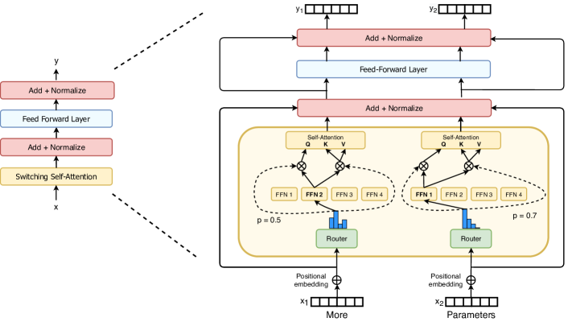

<figcaption>図10: attention 内の Switch 層。Self-Attention の Transformer ブロックに Switch 層を組み込む方法を図示する。各トークン（ここでは x₁ = "More" と x₂ = "Parameters" の 2 トークンを示す）について、一方の重み集合がクエリを生成し、もう一方の固有の重み集合が共有のキーとバリューを生成する。各エキスパートが線形演算である場合と、本研究の他の部分と同じく FFN である場合を実験した。品質改善は見られたものの、低精度数値形式と併用すると不安定になることが分かったため、今後の課題として残す。</figcaption>
</figure>

表10 は、いくつかの変種について、固定ステップ後の品質と訓練時間を記録する。改善は見られるものの、bfloat16 精度を使うとこれらの層はより不安定になることも分かったため、最終版には含めなかった。しかし、これらの層が安定に訓練できるときの予備的な肯定的結果は、将来の有望な方向を示唆していると考えている。

**表10**: Switch attention 層の結果。全モデルは 32 エキスパートで、バッチあたり 524k トークンで訓練。Experts FF は、エキスパートが Transformer の FFN を置き換える、本論文全体の標準設定。Experts FF + Attention は、エキスパートが FFN と Self-Attention 層の両方を置き換える場合。bfloat16 精度で訓練すると、attention にエキスパートを持つモデルは発散する。

| Model | Precision | Quality @100k Steps ($\uparrow$) | Quality @16H ($\uparrow$) | Speed (ex/sec) ($\uparrow$) |
| --- | --- | --- | --- | --- |
| Experts FF | float32 | -1.548 | -1.614 | 1480 |
| Expert Attention | float32 | -1.524 | -1.606 | 1330 |
| Expert Attention | bfloat16 | [diverges] | [diverges] | – |
| Experts FF + Attention | float32 | -1.513 | -1.607 | 1240 |
| Expert FF + Attention | bfloat16 | [diverges] | [diverges] | – |

## Appendix B Preventing Token Dropping with No-Token-Left-Behind（No-Token-Left-Behind によるトークンドロップの防止）

TPU アクセラレータのソフトウェア制約により、テンソルの形状は静的なサイズでなければならない。その結果、各エキスパートはトークン表現を処理する有限で固定の容量を持つ。しかしこれは、実行時に動的にトークンをルーティングする我々のモデルにとって、エキスパートへの不均等な分配が生じうるという問題を提起する。エキスパートに送られるトークン数が容量より少なければ、計算を単にパディングすればよい——ハードウェアの非効率な使い方だが、数学的には正しい。しかし、エキスパートに送られるトークン数が容量を超える場合（エキスパートのオーバーフロー）、これを扱うプロトコルが必要になる。[^30] は Mixture-of-Expert モデルを適応させ、エキスパートのオーバーフローに対して、その表現を残差接続経由で処理なしに次の層へ渡すことで対処しており、我々もそれに従っている。

トークンに計算がまったく適用されないのは非常にもったいない可能性がある、と我々は疑った。特に、あるエキスパートでオーバーフローがあるなら、別のエキスパートには余剰容量があるはずだからである。この直観から *No-Token-Left-Behind* を作った。これは、最初にオーバーフローしているエキスパートへルーティングされたトークンを反復的に再ルーティングする。図11 はこの手法の図解であり、訓練・推論中にほぼすべてのトークンがドロップされないことを保証できる。これが性能を改善し訓練をさらに安定化しうると仮説を立てたが、経験的な利益は見つからなかった。ネットワークが異なるトークンとエキスパートの間の関連をいったん学習すると、この関連が変更される（例: トークンを 2 番目に高いエキスパートへ送る）と性能が劣化しうるのではないかと疑っている。

<figure>

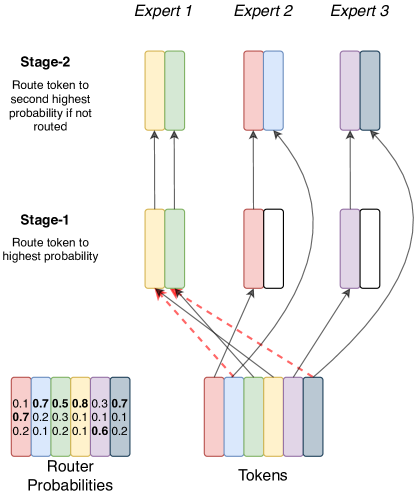

<figcaption>図11: No-Token-Left-Behind ルーティングの図。Stage 1 は Switch ルーティングと同等で、ルータの最高確率のエキスパートへトークンをルーティングする。Stage 2 では、オーバーフローした全トークンを見て、2 番目に高い確率のエキスパートへルーティングする。2 番目のエキスパートもトークンが多すぎればまだオーバーフローしうるが、これで大半のトークンがルーティングされる。この過程は反復でき、事実上すべてのトークンがドロップされないことを保証できる。</figcaption>
</figure>

## Appendix C Encouraging Exploration Across Experts（エキスパート間の探索の奨励）

各エキスパート層で、ルータはどのエキスパートにトークンを送るかを決定する。これは、トークン表現の情報を条件とした、利用可能なエキスパートにわたる離散的な決定である。入ってくるトークン表現に基づいてルータは最良のエキスパートを決定するが、別のエキスパートを選んでいたらどれだけうまくいったかという反実仮想の情報は受け取らない。強化学習と同様、古典的な探索と活用のジレンマが生じる [^53]。これらの問題は [^42] でも同様に指摘され、マルチタスク学習での成功と共に異なる形で対処された。この特定の設定は contextual bandit [^40] に最も近い。決定論的に最上位のエキスパートを常に選ぶのは活用一辺倒の戦略にあたる——我々はより良いエキスパート割り当てを求めて探索とのバランスを考える。

探索を導入するため、いくつかのアプローチを考える: 1) 決定論的すなわち argmax、2) softmax 分布からのサンプリング、3) 入力表現への input dropout、4) 入力表現への乗法的ジッタノイズ。結果としてのモデル品質への影響は表11 に報告する。本研究全体では、経験的に最良と分かった input jitter をノイズ注入に使う。

**表11**: ルータの探索戦略。エキスパート選択の異なるランダム性戦略の下での、負の対数パープレキシティで測る Switch Transformer の品質。変種間に実質的な速度差はない。

| Model | Quality (Neg. Log Perp.) ($\uparrow$) |
| --- | --- |
| Argmax | -1.471 |
| Sample softmax | -1.570 |
| Input dropout | -1.480 |
| Input jitter | -1.468 |

## Appendix D Switch Transformers in Lower Compute Regimes（より低い計算体制での Switch Transformer）

Switch Transformer は、数千コア・数兆パラメータの体制と同様、小さな規模でも有効なアーキテクチャである。我々のこれまでの実験の多くは 10B+ パラメータモデルの規模だったが、図12 に示すとおり、わずか 2 エキスパートでも FLOP 一致の対応物に対する説得力ある利得を生む。スーパーコンピュータが手元になくても、2・4・8 エキスパート（通常はコアあたり 1 エキスパートを推奨する）の Switch Transformer の訓練は T5 密ベースラインに対する確かな改善をもたらす。

<figure>

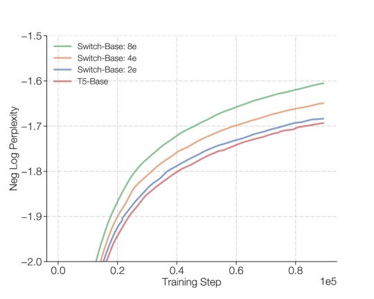

<figcaption>図12: 少数エキスパートの Switch Transformer。非常に少ないエキスパートでも、Switch Transformer はベースラインを改善する。ここでは非常に小さな規模でのスケーリング特性を示し、2・4・8 エキスパートで T5-Base モデルを改善している。</figcaption>
</figure>

## Appendix E Relation of Upstream to Downstream Model Performance（上流と下流のモデル性能の関係）

事前学習の目的関数でのモデル品質が下流タスクの結果に翻訳される保証はない。図13 は、密モデルと Switch モデルの両方について、C4 事前学習タスクでの上流モデル品質と、2 つの下流タスク指標——SuperGLUE 平均性能と TriviaQA スコア——の相関を示す。一方はモデルの推論を、もう一方は事実知識を探るため、この 2 タスクを選んだ。

<figure>

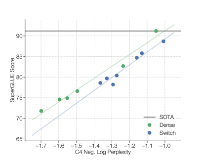

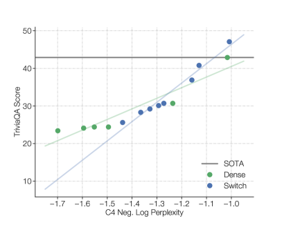

<figcaption>図13: 上流の事前学習品質と下流のモデル品質。上流性能を、推論偏重・知識偏重のベンチマークである SuperGLUE と TriviaQA（SSM なしで記録した SOTA）の下流品質と相関させる（検証セット）。ベースラインと同様、Switch モデルも上流の事前学習タスクの改善とともにスケールする。SuperGLUE では、負の対数パープレキシティと SuperGLUE 平均スコアの間に緩やかな線形関係が見られる。ただし、固定パープレキシティに対しては密モデルの方が良い性能を出すことが多く、特に大規模体制でそうである。逆に、知識偏重の TriviaQA では、Switch Transformer はより良いスケーリング関係に従うかもしれない——所与の上流パープレキシティに対して、密な対応物より良い成績を出す。これらの観察の確認には（収集に費用がかかるため今後の課題とする）さらなる統計が必要だろう。（訳注: 右パネルはクリップから欠落していたため ar5iv から復元）</figcaption>
</figure>

一貫した相関が見られ、ベースラインと Switch モデルの両方で、事前学習の改善がより良い下流結果につながることを示している。加えて、固定された上流パープレキシティに対して、小〜中規模のモデルサイズ体制では Switch と密モデルは同様の性能を発揮する。しかし最大級のモデル体制（T5-11B/T5-XXL）では、5.6 節で述べたとおり、我々の最大の Switch モデルは上流パープレキシティを SuperGLUE の下流ファインチューニングへ必ずしもうまく翻訳しない。これはスパースモデルの潜在能力を完全に実現するための、将来の調査と研究を要する。エキスパートモデルのファインチューニング動態の理解は非常に複雑で、正則化・負荷分散・ファインチューニングのハイパーパラメータに依存する。

## Appendix F Pseudo Code for Switch Transformers（Switch Transformer の擬似コード）

Mesh Tensorflow [^47] での Switch Transformer の擬似コード。以下のコードではモデル並列は使っていない（詳細は 5.4 節参照）。

（訳注: 以下 3 本の擬似コードはクリップで構造が失われていたため、ar5iv 埋め込みのプレーンテキストから復元し原文のまま収録する。）

```python
import mesh_tensorflow as mtf

def load_balance_loss(router_probs, expert_mask):
    """Calculate load-balancing loss to ensure diverse expert routing."""
    # router_probs is the probability assigned for each expert per token.
    # router_probs shape: [num_cores, tokens_per_core, num_experts]
    # expert_index contains the expert with the highest router probability in one-hot format.
    # expert_mask shape: [num_cores, tokens_per_core, num_experts]

    # For each core, get the fraction of tokens routed to each expert.
    # density_1 shape: [num_cores, num_experts]
    density_1 = mtf.reduce_mean(expert_mask, reduced_dim=tokens_per_core)

    # For each core, get fraction of probability mass assigned to each expert
    # from the router across all tokens.
    # density_1_proxy shape: [num_cores, num_experts]
    density_1_proxy = mtf.reduce_mean(router_probs, reduced_dim=tokens_per_core)

    # density_l for a single core: vector of length num_experts that sums to 1.
    # density_l_proxy for a single core: vector of length num_experts that sums to 1.
    # Want both vectors to have uniform allocation (1/num_experts) across all num_expert elements.
    # The two vectors will be pushed towards uniform allocation when the dot product is minimized.
    loss = mtf.reduce_mean(density_1_proxy * density_1) * (num_experts ^ 2)
    return loss
```

Figure 14: Mesh Tensorflow における Switch Transformer の負荷分散損失の擬似コード。

```python
import mesh_tensorflow as mtf

def router(inputs, capacity_factor):
    """Produce the combine and dispatch tensors used for sending and
    receiving tokens from their highest probability expert. """
    # Core layout is split across num_cores for all tensors and operations.
    # inputs shape: [num_cores, tokens_per_core, d_model]

    router_weights = mtf.Variable(shape=[d_model, num_experts])

    # router_logits shape: [num_cores, tokens_per_core, num_experts]
    router_logits = mtf.einsum([inputs, router_weights], reduced_dim=d_model)

    if is_training:
        # Add noise for exploration across experts.
        router_logits += mtf.random_uniform(shape=router_logits.shape, minval=1-eps, maxval=1+eps)

    # Convert input to softmax operation from bfloat16 to float32 for stability.
    router_logits = mtf.to_float32(router_logits)

    # Probabilities for each token of what expert it should be sent to.
    router_probs = mtf.softmax(router_logits, axis=-1)

    # Get the top-1 expert for each token. expert_gate is the top-1 probability
    # from the router for each token. expert_index is what expert each token
    # is going to be routed to.
    # expert_gate shape: [num_cores, tokens_per_core]
    # expert_index shape: [num_cores, tokens_per_core]
    expert_gate, expert_index = mtf.top_1(router_probs, reduced_dim=num_experts)

    # expert_mask shape: [num_cores, tokens_per_core, num_experts]
    expert_mask = mtf.one_hot(expert_index, dimension=num_experts)

    # Compute load balancing loss.
    aux_loss = load_balance_loss(router_probs, expert_mask)

    # Experts have a fixed capacity, ensure we do not exceed it. Construct
    # the batch indices, to each expert, with position_in_expert
    # make sure that not more that expert_capacity examples can be routed to
    # each expert.
    position_in_expert = mtf.cumsum(expert_mask, dimension=tokens_per_core) * expert_mask

    # Keep only tokens that fit within expert_capacity.
    expert_mask *= mtf.less(position_in_expert, expert_capacity)
    expert_mask_flat = mtf.reduce_sum(expert_mask, reduced_dim=experts_dim)

    # Mask out the experts that have overflowed the expert capacity.
    expert_gate *= expert_mask_flat

    # combine_tensor used for combining expert outputs and scaling with router probability.
    # combine_tensor shape: [num_cores, tokens_per_core, num_experts, expert_capacity]
    combine_tensor = (
        expert_gate * expert_mask_flat *
        mtf.one_hot(expert_index, dimension=num_experts) *
        mtf.one_hot(position_in_expert, dimension=expert_capacity))

    # Cast back outputs to bfloat16 for the rest of the layer.
    combine_tensor = mtf.to_bfloat16(combine_tensor)

    # Create binary dispatch tensor that is 1 if the token gets routed to the corresponding expert.
    # dispatch_tensor shape: [num_cores, tokens_per_core, num_experts, expert_capacity]
    dispatch_tensor = mtf.cast(combine_tensor, tf.bool)

    return dispatch_tensor, combine_tensor, aux_loss
```

Figure 15: Mesh Tensorflow における Switch Transformer のルータの擬似コード。

```python
import mesh_tensorflow as mtf

def switch_layer(inputs, n, capacity_factor, num_experts):
    """Distributed switch transformer feed-forward layer."""
    # num_cores (n) = total cores for training the model (scalar).
    # d_model = model hidden size (scalar).
    # num_experts = total number of experts.
    # capacity_factor = extra buffer for each expert.
    # inputs shape: [batch, seq_len, d_model]
    batch, seq_len, d_model = inputs.get_shape()

    # Each core will route tokens_per_core tokens to the correct experts.
    tokens_per_core = batch * seq_len / num_cores

    # Each expert will have shape [num_cores, expert_capacity, d_model].
    # Each core is responsible for sending expert_capacity tokens
    # to each expert.
    expert_capacity = tokens_per_core * capacity_factor / num_experts

    # Reshape to setup per core expert dispatching.
    # shape: [batch, seq_len, d_model] -> [num_cores, tokens_per_core, d_model]
    # Core layout: [n, 1, 1] -> [n, 1, 1]
    inputs = mtf.reshape(inputs, [num_cores, tokens_per_core, d_model])

    # Core Layout: [n, 1, 1] -> [n, 1, 1, 1], [n, 1, 1, 1]
    # dispatch_tensor (boolean) shape: [num_cores, tokens_per_core, num_experts, expert_capacity]
    # dispatch_tensor is used for routing tokens to the correct expert.
    # combine_tensor (float) shape: [num_cores, tokens_per_core, num_experts, expert_capacity]
    # combine_tensor used for combining expert outputs and scaling with router
    # probability.
    dispatch_tensor, combine_tensor, aux_loss = router(inputs, expert_capacity)

    # Matmul with large boolean tensor to assign tokens to the correct expert.
    # Core Layout: [n, 1, 1], -> [1, n, 1, 1]
    # expert_inputs shape: [num_experts, num_cores, expert_capacity, d_model]
    expert_inputs = mtf.einsum([inputs, dispatch_tensor], reduce_dims=[tokens_per_core])

    # All-to-All communication. Cores split across num_cores and now we want to split
    # across num_experts. This sends tokens, routed locally, to the correct expert now
    # split across different cores.
    # Core layout: [1, n, 1, 1] -> [n, 1, 1, 1]
    expert_inputs = mtf.reshape(expert_inputs, [num_experts, num_cores, expert_capacity, d_model])

    # Standard feed forward computation, where each expert will have its own
    # unique set of parameters.
    # Total unique parameters created: num_experts * (d_model * d_ff * 2).
    # expert_outputs shape: [num_experts, num_cores, expert_capacity, d_model]
    expert_outputs = feed_forward(expert_inputs)

    # All-to-All communication. Cores are currently split across the experts
    # dimension, which needs to be switched back to being split across num_cores.
    # Core Layout: [n, 1, 1, 1] -> [1, n, 1, 1]
    expert_outputs = mtf.reshape(expert_outputs, [num_experts, num_cores, expert_capacity, d_model])

    # Convert back to input shape and multiply outputs of experts by the routing probability.
    # expert_outputs shape: [num_experts, num_cores, tokens_per_core, d_model]
    # expert_outputs_combined shape: [num_cores, tokens_per_core, d_model]
    # Core Layout: [1, n, 1, 1] -> [n, 1, 1]
    expert_outputs_combined = mtf.einsum([expert_outputs, combine_tensor], reduce_dims=[tokens_per_core])

    # Remove tokens_per_core shapes used for local routing dispatching to match input shape.
    # Core Layout: [n, 1, 1] -> [n, 1, 1]
    outputs = mtf.reshape(expert_outputs_combined, [batch, seq_len, d_model])
    return outputs, aux_loss
```

Figure 16: Mesh Tensorflow における Switch Transformer 層の擬似コード。

---

[^fn1]: Switch Transformer の JAX コードと全モデルチェックポイントは https://github.com/google-research/t5x で入手可能（訳注: クリップで欠落していた脚注を ar5iv から復元。以下同）
[^fn2]: Switch Transformer の Tensorflow コードは https://github.com/tensorflow/mesh/blob/master/mesh_tensorflow/transformer/moe.py で入手可能
[^fn3]: 技術的な説明は 2.2 節を参照。
[^fn4]: 混乱の潜在的な源: $p_{i}(x)$ はトークン $x$ をエキスパート $i$ にルーティングする確率であり、$P_{i}$ はバッチ全体にわたってエキスパート $i$ に割り当てられた確率の割合である。
[^fn5]: この指標には底 $e$ の対数を使うため、単位は nats である。
[^fn6]: 速度の測定はアルゴリズムと実装の詳細の両方の関数であることに注意。Switch Transformer は MoE に比べて必要な計算を減らすが、各コアで実行される計算量が均等になる静的なテンソル形状に依存している。
[^fn7]: 平均から 2 標準偏差を超える値は再サンプルされる。
[^fn8]: FLOPS は Kaplan et al. (2020) に倣い forward パスについて計算する。
[^fn9]: 我々の T5 と Switch モデルは、公平な比較のため、例内重複を除去した改訂版 C4 データセットで、バッチあたり $2^{20}$ トークン・55 万ステップの事前学習を行った。
[^fn10]: ステップ基準の高速化は、ベースラインが要したステップ数を、mT5-Base の最終パープレキシティに到達するのに我々のモデルが要したステップ数で割った比として計算する。
[^fn11]: 報告されたこの品質差は下界であり、実際にはより大きい可能性がある。T5-XXL は、例内のテキスト重複を含み事前学習タスクとしてやさしい版の C4 で事前学習されていた。
