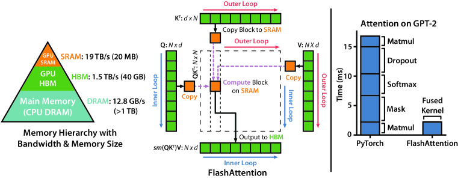
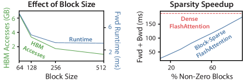
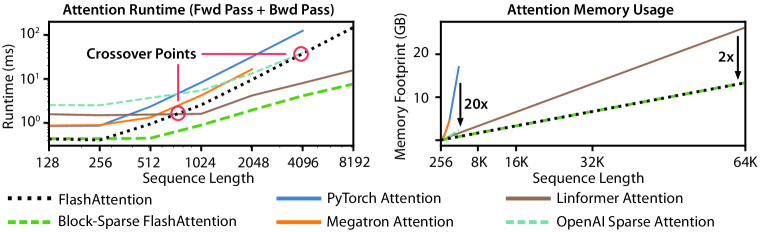
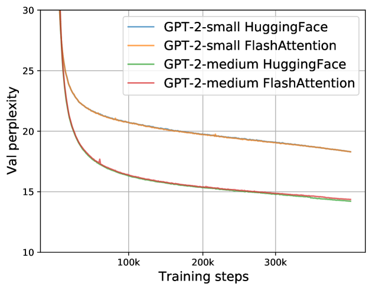
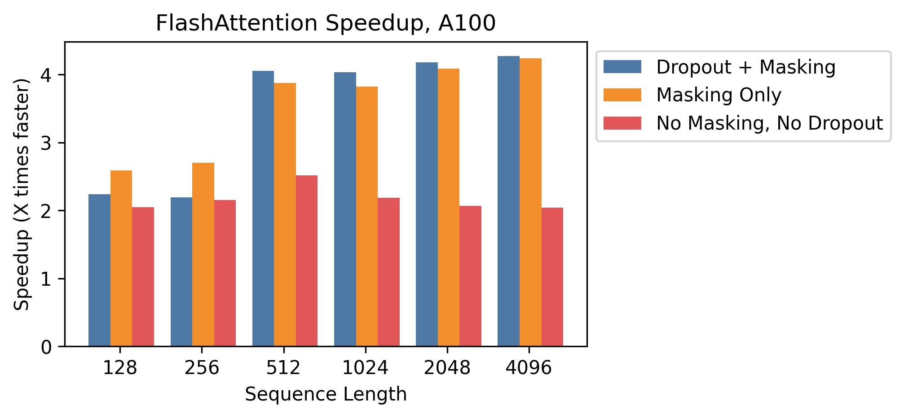
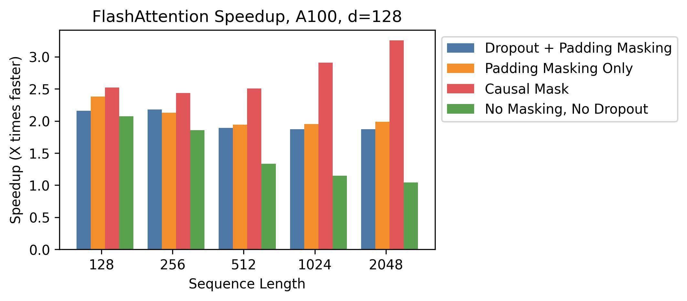
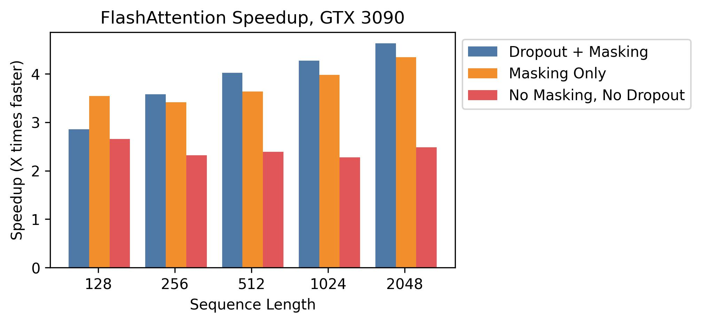
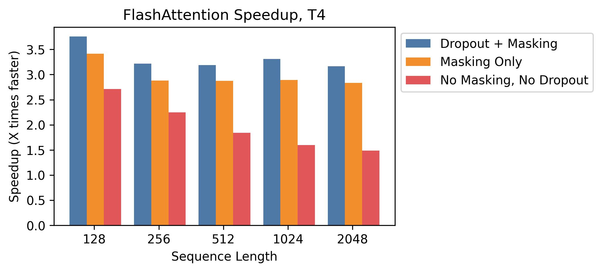
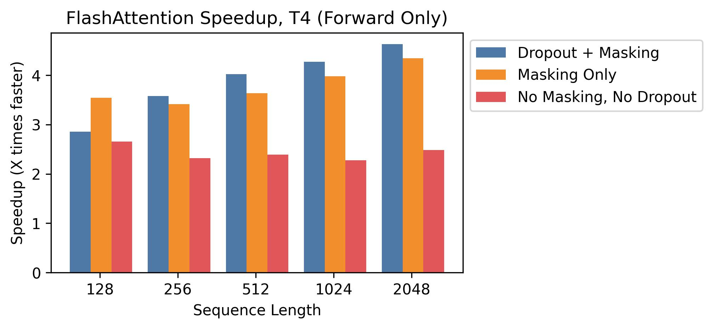

# FlashAttention: IO を意識した高速かつメモリ効率のよい厳密 attention

> 原題: FlashAttention: Fast and Memory-Efficient Exact Attention with IO-Awareness
> 著者: Tri Dao, Daniel Y. Fu, Stefano Ermon, Atri Rudra, Christopher Ré
> 所属: Department of Computer Science, Stanford University / Department of Computer Science and Engineering, University at Buffalo, SUNY
> 連絡先: {trid,danfu}@cs.stanford.edu, ermon@stanford.edu, atri@buffalo.edu, chrismre@cs.stanford.edu
> 出典: arXiv:2205.14135（NeurIPS 2022）・原典クリップ `raw/papers/FlashAttention_ Fast and Memory-Efficient Exact Attention with IO-Awareness.md`（ar5iv 版）

---

> **訳注（クリップの復元について）**
>
> 底本は ar5iv（`https://ar5iv.labs.arxiv.org/html/2205.14135`）を Obsidian Web Clipper で保存した markdown。原ページと照合し、以下を復元した。図表キャプション（Figure 1〜8・Table 1〜21・Algorithm 0〜5）はすべてクリップに残っていた。
>
> 1. **Figure 2 の左パネル（数値表）がクリップから丸ごと脱落していた**。この表は「FlashAttention は FLOPs が増えるのに速い」という本論文の中心的証拠そのものなので、ar5iv から復元して該当箇所に置いた（GFLOPs 66.6 → 75.2、HBM 読み書き 40.3 GB → 4.4 GB、実行時間 41.7 ms → 7.3 ms）。
> 2. **画像 1 枚（Figure 8 の下段パネル、T4 の forward pass のみの結果）が欠落**していた。多パネル図の 2 枚目が落ちる既知のパターン。ar5iv から取得して収録した。
> 3. **脚注 4 件の本文がすべて脱落**し、`N` マーカーだけが残っていた。ar5iv から復元し、本文中に「訳注（脚注 N）」として挿入した。
> 4. **付録 E の Table 9〜21 から太字・下線が完全に失われていた**。これらのキャプションは「最良を太字、次点を下線」と明示しているため、強調がないと表が読めない。ar5iv の HTML から強調情報を取り出して復元した（行見出し列の太字は ar5iv の見出しスタイルなので付けていない。太字・下線は「最良・次点」の意味だけを担う）。
> 5. **§B.5 の見出しが「Comparison with」で切れていた**（引用が脱落）。原ページでは「B.5 Comparison with Rabe and Staats [66]」。復元した。
> 6. **Figure 1・Figure 2 のキャプションで手法名 "FlashAttention" が複数箇所で脱落**していた（LaTeX マクロ脱落）。原ページに従って補った。
>
> 以下は**原ページ（ar5iv）の側にある不備**であり、クリップの責任ではない。原文に忠実であるためそのまま訳し、訳注を添えた。
>
> - **Algorithm 0 への参照が空欄でレンダリングされる**（「Standard attention (Algorithm ) requires…」等）。HTML のアンカーは `#alg0` を指しているので、参照先は Algorithm 0（標準的な attention の実装）で確定できる。訳では `Algorithm 0` を補い、補った箇所には印を付けた。
> - **付録 C・D の定理参照も同様に空欄**（「Proof of.」）。アンカーから参照先が確定するので、`定理 1` `定理 2` `命題 3` `命題 4` `定理 5` を補った。
> - **§4.2 の本文が「Table 6 shows that sequence length 16K outperforms…」と書いているが、その数値は Table 5 にある**。原論文の相互参照の誤り（原ページでも同じ）。訳はそのままにし、訳注で指摘した。
>
> 参考文献一覧（References）と謝辞（Acknowledgments）は既定どおり訳出していない。本文中の引用は原典クリップの脚注番号 `[^N]` をそのまま維持している。**付録は A〜E をすべて全訳した（圧縮箇所はない）**。

---

## Abstract（要旨）

トランスフォーマーは長い系列に対して遅く、メモリを大量に消費する。self-attention の時間計算量とメモリ計算量が系列長の 2 乗になるためである。近似 attention 法はこの問題に対処しようと、モデル品質とのトレードオフによって計算量を削減してきたが、しばしば wall-clock（実時間）での高速化を達成できていない。我々は、欠けている原理は attention アルゴリズムを **IO を意識したもの（IO-aware）**にすること——すなわち GPU メモリの階層間での読み書きを勘定に入れること——であると主張する。我々は **FlashAttention** を提案する。これは IO を意識した厳密 attention アルゴリズムであり、タイリング（tiling）を用いて GPU の高帯域メモリ（HBM, high bandwidth memory）とオンチップ SRAM の間のメモリ読み書き回数を削減する。我々は FlashAttention の IO 計算量を解析し、標準的な attention よりも少ない HBM アクセスしか必要としないこと、そして一定範囲の SRAM サイズに対して最適であることを示す。さらに我々は FlashAttention をブロックスパース attention へ拡張し、既存のいかなる近似 attention 法よりも高速な近似 attention アルゴリズムを得る。FlashAttention は既存のベースラインよりも速くトランスフォーマーを訓練する。BERT-large（系列長 512）では MLPerf 1.1 の訓練速度記録に対して 15% のエンドツーエンドの wall-clock 高速化、GPT-2（系列長 1K）では 3 倍の高速化、long-range arena（系列長 1K〜4K）では 2.4 倍の高速化である。FlashAttention とブロックスパース FlashAttention はトランスフォーマーにおいてより長いコンテキストを可能にし、より高品質なモデル（GPT-2 で 0.7 良いパープレキシティ、長文書分類で 6.4 ポイントの向上）と、まったく新しい能力をもたらす。すなわち Path-X チャレンジ（系列長 16K, 61.4% の精度）および Path-256（系列長 64K, 63.1% の精度）においてランダムより良い性能を達成した初のトランスフォーマーである。

## 1 Introduction（はじめに）

トランスフォーマーモデル [^82] は、自然言語処理や画像分類といった応用において最も広く使われるアーキテクチャとして台頭してきた。トランスフォーマーはより大きく [^5]、より深く [^83] なってきたが、より長いコンテキストを持たせることは依然として難しい [^80]。その中核にある self-attention モジュールが、系列長に対して 2 乗の時間計算量とメモリ計算量を持つためである。重要な問いは、attention をより高速かつメモリ効率よくすることが、長い系列に対するトランスフォーマーモデルの実行時間とメモリの課題に対処する助けになるかどうかである。

多くの近似 attention 法が、attention の計算要件とメモリ要件を削減することを目指してきた。これらの手法はスパース近似 [^51] [^74] から低ランク近似 [^84] [^50] [^12]、およびそれらの組み合わせ [^3] [^92] [^9] にまで及ぶ。これらの手法は計算要件を系列長について線形または準線形にまで削減するものの、その多くは標準的な attention に対して wall-clock の高速化を示しておらず、広く採用されるには至っていない。主な理由の一つは、それらが FLOP の削減（これは wall-clock 速度と相関するとは限らない）に注目し、メモリアクセス（IO）に由来するオーバーヘッドを無視しがちであることである。

<figure>

<figcaption>図1: 左: FlashAttention はタイリングを用いて、大きな N×N の attention 行列（点線の箱）を（相対的に）遅い GPU HBM 上に実体化することを防ぐ。外側ループ（赤い矢印）で FlashAttention は K 行列と V 行列のブロックを巡回し、それらを高速なオンチップ SRAM へロードする。各ブロックの中で Q 行列のブロックを巡回し（青い矢印）、それらを SRAM へロードし、attention 計算の出力を HBM へ書き戻す。右: GPT-2 における PyTorch 実装の attention に対する高速化。FlashAttention は大きな attention 行列を HBM へ読み書きしないため、attention 計算において 7.6 倍の高速化をもたらす。</figcaption>
</figure>

本論文で我々は、欠けている原理は attention アルゴリズムを **IO を意識したもの**にすること [^1] ——すなわち、速いメモリと遅いメモリの異なる階層に対する読み書きを注意深く勘定に入れること（例えば高速な GPU オンチップ SRAM と、相対的に遅い GPU 高帯域メモリ（HBM）[^45] の間。Figure 1 左）——であると主張する。現代の GPU では計算速度がメモリ速度を上回って伸びており [^61] [^62] [^63]、トランスフォーマーの演算の大半はメモリアクセスによってボトルネックとなっている [^43]。IO を意識したアルゴリズムは、データの読み書きが実行時間の大きな部分を占めうる同種のメモリ律速演算——データベースの結合 [^71]、画像処理 [^70]、数値線形代数 [^4]、その他 [^85] [^40]——において決定的に重要であった。しかし PyTorch や Tensorflow といった深層学習への一般的な Python インターフェースは、メモリアクセスの細かい制御を許していない。

我々は FlashAttention を提案する。これは厳密な attention を、はるかに少ないメモリアクセスで計算する新しい attention アルゴリズムである。我々の主目標は、attention 行列を HBM へ読み書きすることを避けることである。これには (i) 入力全体にアクセスせずに softmax の縮約を計算すること、(ii) 逆伝播のために大きな中間 attention 行列を保存しないこと、が必要になる。我々はこれらの課題に対処するために、確立された 2 つの技法を適用する。(i) attention の計算を再構成して入力をブロックに分割し、入力ブロックに対して複数回のパスを行うことで、softmax の縮約を漸進的に実行する（これはタイリングとしても知られる）。(ii) forward pass から softmax の正規化係数を保存しておき、backward pass においてオンチップで attention を高速に再計算する。これは HBM から中間 attention 行列を読み出すという標準的な方法よりも速い。我々は FlashAttention を CUDA で実装することでメモリアクセスの細かい制御を実現し、attention のすべての演算を 1 つの GPU カーネルへ融合する。再計算による FLOPs の増加があってもなお、我々のアルゴリズムは標準的な attention よりも**速く動作し**（GPT-2 で最大 7.6 倍 [^67]、Figure 1 右）、**より少ないメモリしか使わない**（系列長に対して線形）。これは HBM アクセスが大幅に削減されたおかげである。

我々は FlashAttention の IO 計算量 [^1] を解析し、$O(N^{2}d^{2}M^{-1})$ 回の HBM アクセスを必要とすることを証明する（ここで $d$ はヘッド次元、$M$ は SRAM のサイズである）。これは標準的な attention の $\Omega(Nd+N^{2})$ と比較される。$d$ と $M$ の典型的な値に対して、FlashAttention は標準実装と比べて何倍も少ない HBM アクセスしか必要としない（Fig. 2 に示すように最大 9 倍少ない）。さらに我々は下界を与え、**いかなる厳密 attention アルゴリズムも、すべての SRAM サイズにわたって HBM アクセス回数を漸近的に改善することはできない**ことを示す。

我々はまた、FlashAttention が近似 attention アルゴリズムの潜在能力を実現するための有用なプリミティブとして機能しうることを示す。メモリアクセスのオーバーヘッドという問題を克服することによってである。概念実証として、我々はブロックスパース FlashAttention を実装する。これは FlashAttention よりもさらに 2〜4 倍速いスパース attention アルゴリズムであり、系列長 64k までスケールする。我々は、ブロックスパース FlashAttention が FlashAttention よりもスパース率に比例した分だけ良い IO 計算量を持つことを証明する。他の演算（マルチ GPU 上の attention、カーネル回帰、ブロックスパース行列積）へのさらなる拡張については Section 5 で議論する。我々は、このプリミティブの上に構築することを容易にするために FlashAttention をオープンソースとして公開する。1

> **訳注（脚注 1）**: FlashAttention のコードは https://github.com/HazyResearch/flash-attention で利用できる。

我々は、FlashAttention がモデルの訓練を高速化し、より長いコンテキストをモデル化することによってモデル品質を改善することを実証的に検証する。また、FlashAttention とブロックスパース FlashAttention の実行時間とメモリフットプリントを、先行する attention 実装と比較してベンチマークする。

- **より高速なモデル訓練。** FlashAttention はトランスフォーマーモデルを wall-clock 時間でより速く訓練する。我々は BERT-large（系列長 512）を MLPerf 1.1 [^58] の訓練速度記録より 15% 速く、GPT-2（系列長 1K）を HuggingFace [^87] と Megatron-LM [^77] のベースライン実装より 3 倍速く、long-range arena（系列長 1K〜4K）をベースラインより 2.4 倍速く訓練する。
- **より高品質なモデル。** FlashAttention はトランスフォーマーをより長い系列へとスケールさせ、それが品質を改善し新しい能力を可能にする。我々は GPT-2 で 0.7 のパープレキシティ改善と、長文書分類 [^13] においてより長い系列をモデル化することによる 6.4 ポイントの向上を観測する。FlashAttention は、より長い系列長（16K）を使うことのみによって、困難な Path-X [^80] タスクでランダムより良い性能を達成できる初のトランスフォーマーをもたらす。ブロックスパース FlashAttention はトランスフォーマーをさらに長い系列（64K）へスケールさせ、その結果 Path-256 においてランダムより良い性能を達成できる、我々の知る限り初の系列モデルをもたらす。
- **attention のベンチマーク。** FlashAttention は 128 から 2K までの一般的な系列長にわたって標準的な attention 実装より最大 3 倍速く、64K までスケールする。系列長 512 までは、FlashAttention は既存のいかなる attention 手法よりも速くかつメモリ効率がよい。一方、系列長 1K を超えると一部の近似 attention 法（例えば Linformer）が速くなり始める。他方、ブロックスパース FlashAttention は、我々の知る限りのすべての既存の近似 attention 法より速い。

## 2 Background（背景）

我々はここで、現代のハードウェア（GPU）における一般的な深層学習演算の性能特性について背景を述べる。また、attention の標準的な実装についても説明する。

### 2.1 Hardware Performance（ハードウェア性能）

我々はここでは GPU に焦点を当てる。他のハードウェアアクセラレータにおける性能も同様である [^48] [^46]。

**GPU のメモリ階層。** GPU のメモリ階層（Fig. 1 左）は、異なるサイズと速度を持つ複数の形態のメモリから構成され、より小さいメモリほど高速である。例として、A100 GPU は帯域幅 1.5〜2.0 TB/s の HBM を 40〜80 GB 持ち、108 個のストリーミングマルチプロセッサそれぞれに帯域幅およそ 19 TB/s と推定される 192 KB のオンチップ SRAM を持つ [^45] [^44]。オンチップ SRAM は HBM より 1 桁高速だが、サイズは何桁も小さい。計算がメモリ速度に対して相対的に高速になるにつれ [^61] [^62] [^63]、演算はますますメモリ（HBM）アクセスによってボトルネックとなる。したがって高速な SRAM を活用することがより重要になる。

**実行モデル。** GPU は 1 つの演算（カーネルと呼ばれる）を実行するために膨大な数のスレッドを持つ。各カーネルは HBM からレジスタと SRAM へ入力をロードし、計算し、そして出力を HBM へ書き出す。

**性能特性。** 計算とメモリアクセスの釣り合いに応じて、演算は**計算律速（compute-bound）**か**メモリ律速（memory-bound）**のいずれかに分類できる。これは一般に *arithmetic intensity*（演算強度）[^85] ——メモリアクセスのバイト数あたりの算術演算数——によって測られる。

1. **計算律速**: 演算にかかる時間は算術演算がいくつあるかによって決まり、HBM へのアクセス時間ははるかに小さい。典型例は内側次元が大きい行列積や、チャネル数の多い畳み込みである。
2. **メモリ律速**: 演算にかかる時間はメモリアクセス回数によって決まり、計算に費やされる時間ははるかに小さい。例には他のほとんどの演算が含まれる。要素ごとの演算（例: 活性化、dropout）や縮約（例: sum, softmax, batch norm, layer norm）である。

**カーネル融合。** メモリ律速の演算を高速化する最も一般的な手法はカーネル融合である。同じ入力に対して複数の演算が適用される場合、入力を各演算ごとに複数回ロードする代わりに一度だけロードすればよい。コンパイラは多くの要素ごとの演算を自動的に融合できる [^53] [^65] [^75]。しかしモデル訓練の文脈では、中間値は逆伝播のために保存すべく依然として HBM に書き出す必要があり、素朴なカーネル融合の効果を減じてしまう。

### 2.2 Standard Attention Implementation（標準的な attention の実装）

入力系列 $\mathbf{Q},\mathbf{K},\mathbf{V}\in\mathbb{R}^{N\times d}$（$N$ は系列長、$d$ はヘッド次元）が与えられたとき、我々は attention の出力 $\mathbf{O}\in\mathbb{R}^{N\times d}$ を計算したい:

$$
\mathbf{S}=\mathbf{Q}\mathbf{K}^{\top}\in\mathbb{R}^{N\times N},\quad\mathbf{P}=\mathrm{softmax}(\mathbf{S})\in\mathbb{R}^{N\times N},\quad\mathbf{O}=\mathbf{P}\mathbf{V}\in\mathbb{R}^{N\times d},
$$

ここで $\mathrm{softmax}$ は行ごとに適用される。

標準的な attention の実装は行列 $\mathbf{S}$ と $\mathbf{P}$ を HBM 上に実体化し、これは $O(N^{2})$ のメモリを要する。しばしば $N\gg d$ である（例えば GPT2 では $N=1024$, $d=64$）。我々は標準的な attention の実装を Algorithm 0 に記述する〔訳注: 原ページではこの参照が空欄になっている。アンカーから参照先は Algorithm 0 と確定できるため補った〕。演算の一部あるいは大半がメモリ律速である（例: softmax）ため、多数のメモリアクセスは遅い wall-clock 時間へと翻訳される。

この問題は、attention 行列に適用される他の要素ごとの演算——$\mathbf{S}$ に適用されるマスクや $\mathbf{P}$ に適用される dropout など——によってさらに悪化する。その結果、いくつかの要素ごとの演算を融合しようとする試み、例えばマスクと softmax の融合 [^77] が数多く行われてきた。

Section 3.2 において我々は、標準的な attention 実装が系列長 $N$ に対して 2 乗の HBM アクセスを行うことを示す。また、標準的な attention と我々の手法（FlashAttention）の FLOPs 数と HBM アクセス数を比較する。

**Algorithm 0** 標準的な attention の実装

> **必要な入力**: HBM 上の行列 $\mathbf{Q},\mathbf{K},\mathbf{V}\in\mathbb{R}^{N\times d}$。
>
> 1. $\mathbf{Q},\mathbf{K}$ を HBM からブロック単位でロードし、$\mathbf{S}=\mathbf{Q}\mathbf{K}^{\top}$ を計算し、$\mathbf{S}$ を HBM へ書き出す。
> 2. $\mathbf{S}$ を HBM から読み出し、$\mathbf{P}=\mathrm{softmax}(\mathbf{S})$ を計算し、$\mathbf{P}$ を HBM へ書き出す。
> 3. $\mathbf{P}$ と $\mathbf{V}$ を HBM からブロック単位でロードし、$\mathbf{O}=\mathbf{P}\mathbf{V}$ を計算し、$\mathbf{O}$ を HBM へ書き出す。
> 4. $\mathbf{O}$ を返す。

## 3 FlashAttention: Algorithm, Analysis, and Extensions（FlashAttention: アルゴリズム・解析・拡張）

我々は、より少ない HBM 読み書きで、かつ逆伝播のために大きな中間行列を保存することなく、厳密な attention を計算する方法を示す。これは、メモリ効率がよく同時に wall-clock 時間でも高速な attention アルゴリズムをもたらす。我々はその IO 計算量を解析し、標準的な attention と比べてはるかに少ない HBM アクセスしか必要としないことを示す。さらに、FlashAttention をブロックスパース attention へ拡張することで、それが有用なプリミティブとして機能しうることを示す。

我々はここでは説明を簡単にするため forward pass に焦点を当てる。backward の詳細は Appendix B に含まれる。

### 3.1 An Efficient Attention Algorithm With Tiling and Recomputation（タイリングと再計算による効率的な attention アルゴリズム）

HBM 上の入力 $\mathbf{Q},\mathbf{K},\mathbf{V}\in\mathbb{R}^{N\times d}$ が与えられたとき、我々は attention の出力 $\mathbf{O}\in\mathbb{R}^{N\times d}$ を計算して HBM へ書き出すことを目指す。我々の目標は HBM アクセスの量を（$N$ について準 2 乗に）削減することである。

我々は、準 2 乗の HBM アクセスで厳密な attention を計算するという技術的課題を克服するために、確立された 2 つの技法（タイリング、再計算）を適用する。これを Algorithm 1 に記述する。主要なアイデアは、入力 $\mathbf{Q},\mathbf{K},\mathbf{V}$ をブロックへ分割し、遅い HBM から高速な SRAM へロードし、それらのブロックに関して attention 出力を計算する、というものである。各ブロックの出力を足し合わせる前に適切な正規化係数でスケールすることによって、最後には正しい結果が得られる。

**タイリング。** 我々は attention をブロック単位で計算する。softmax は $\mathbf{K}$ の列を結合してしまうため、我々は大きな softmax をスケーリングによって分解する [^60] [^51] [^66]。数値的安定性のため、ベクトル $x\in\mathbb{R}^{B}$ の softmax は次のように計算される:

$$
m(x):=\max_{i}\ \ x_{i},\quad f(x):=\begin{bmatrix}e^{x_{1}-m(x)}&\ldots&e^{x_{B}-m(x)}\end{bmatrix},\quad\ell(x):=\sum_{i}f(x)_{i},\quad\mathrm{softmax}(x):=\frac{f(x)}{\ell(x)}.
$$

ベクトル $x^{(1)},x^{(2)}\in\mathbb{R}^{B}$ に対して、連結された $x=\begin{bmatrix}x^{(1)}\ x^{(2)}\end{bmatrix}\in\mathbb{R}^{2B}$ の softmax は次のように分解できる:

$$
\displaystyle m(x)=m(\begin{bmatrix}x^{(1)}\ x^{(2)}\end{bmatrix})=\max(m(x^{(1)}),m(x^{(2)})),\quad f(x)=\begin{bmatrix}e^{m(x^{(1)})-m(x)}f(x^{(1)})&e^{m(x^{(2)})-m(x)}f(x^{(2)})\end{bmatrix},
$$
$$
\displaystyle\ell(x)=\ell(\begin{bmatrix}x^{(1)}\ x^{(2)}\end{bmatrix})=e^{m(x^{(1)})-m(x)}\ell(x^{(1)})+e^{m(x^{(2)})-m(x)}\ell(x^{(2)}),\quad\mathrm{softmax}(x)=\frac{f(x)}{\ell(x)}.
$$

したがって、いくつかの追加の統計量（$m(x),\ell(x)$）を追跡しておけば、softmax を一度に 1 ブロックずつ計算できる。2 こうして我々は入力 $\mathbf{Q},\mathbf{K},\mathbf{V}$ をブロックへ分割し（Algorithm 1 行 3）、追加の統計量とともに softmax の値を計算し（Algorithm 1 行 10）、結果を結合する（Algorithm 1 行 12）。

> **訳注（脚注 2）**: この種の集約は代数的集約（algebraic aggregation）と呼ばれる [33]。

**再計算。** 我々の目標の一つは、逆伝播のために $O(N^{2})$ の中間値を保存しないことである。backward pass は通常、$\mathbf{Q},\mathbf{K},\mathbf{V}$ に関する勾配を計算するために行列 $\mathbf{S},\mathbf{P}\in\mathbb{R}^{N\times N}$ を必要とする。しかし出力 $\mathbf{O}$ と softmax の正規化統計量 $(m,\ell)$ を保存しておけば、backward pass において SRAM 上の $\mathbf{Q},\mathbf{K},\mathbf{V}$ のブロックから attention 行列 $\mathbf{S}$ と $\mathbf{P}$ を容易に再計算できる。これは選択的な勾配チェックポインティング（gradient checkpointing）の一形態と見ることができる [^34] [^10]。勾配チェックポインティングは必要な最大メモリ量を削減するために提案されてきたが [^66]、（我々の知る限り）すべての実装は速度をメモリと引き換えにしている。対照的に、FLOPs が増えるにもかかわらず、我々の再計算は HBM アクセスの削減により backward pass を**高速化する**（Fig. 2）。完全な backward pass の記述は Appendix B にある。

**実装の詳細: カーネル融合。** タイリングによって、我々はアルゴリズムを 1 つの CUDA カーネルとして実装できる。HBM から入力をロードし、すべての計算ステップ（行列積、softmax、任意でマスクと dropout、行列積）を実行し、その結果を HBM へ書き戻す（マスクと dropout は Appendix B）。これによって入力と出力を HBM に対して繰り返し読み書きすることを避けられる。

**Algorithm 1** FlashAttention

> **必要な入力**: HBM 上の行列 $\mathbf{Q},\mathbf{K},\mathbf{V}\in\mathbb{R}^{N\times d}$、サイズ $M$ のオンチップ SRAM。
>
> 1. ブロックサイズを $B_{c}=\left\lceil\frac{M}{4d}\right\rceil,B_{r}=\min\left(\left\lceil\frac{M}{4d}\right\rceil,d\right)$ と設定する。
> 2. HBM 上で $\mathbf{O}=(0)_{N\times d}\in\mathbb{R}^{N\times d},\ell=(0)_{N}\in\mathbb{R}^{N},m=(-\infty)_{N}\in\mathbb{R}^{N}$ と初期化する。
> 3. $\mathbf{Q}$ を各サイズ $B_{r}\times d$ の $T_{r}=\left\lceil\frac{N}{B_{r}}\right\rceil$ 個のブロック $\mathbf{Q}_{1},\dots,\mathbf{Q}_{T_{r}}$ に分割し、$\mathbf{K},\mathbf{V}$ を各サイズ $B_{c}\times d$ の $T_{c}=\left\lceil\frac{N}{B_{c}}\right\rceil$ 個のブロック $\mathbf{K}_{1},\dots,\mathbf{K}_{T_{c}}$ および $\mathbf{V}_{1},\dots,\mathbf{V}_{T_{c}}$ に分割する。
> 4. $\mathbf{O}$ を各サイズ $B_{r}\times d$ の $T_{r}$ 個のブロック $\mathbf{O}_{i},\dots,\mathbf{O}_{T_{r}}$ に分割し、$\ell$ を各サイズ $B_{r}$ の $T_{r}$ 個のブロック $\ell_{i},\dots,\ell_{T_{r}}$ に、$m$ を各サイズ $B_{r}$ の $T_{r}$ 個のブロック $m_{1},\dots,m_{T_{r}}$ に分割する。
> 5. **for** $1\leq j\leq T_{c}$ **do**
> 6. &nbsp;&nbsp;&nbsp;&nbsp;$\mathbf{K}_{j},\mathbf{V}_{j}$ を HBM からオンチップ SRAM へロードする。
> 7. &nbsp;&nbsp;&nbsp;&nbsp;**for** $1\leq i\leq T_{r}$ **do**
> 8. &nbsp;&nbsp;&nbsp;&nbsp;&nbsp;&nbsp;&nbsp;&nbsp;$\mathbf{Q}_{i},\mathbf{O}_{i},\ell_{i},m_{i}$ を HBM からオンチップ SRAM へロードする。
> 9. &nbsp;&nbsp;&nbsp;&nbsp;&nbsp;&nbsp;&nbsp;&nbsp;オンチップで $\mathbf{S}_{ij}=\mathbf{Q}_{i}\mathbf{K}_{j}^{T}\in\mathbb{R}^{B_{r}\times B_{c}}$ を計算する。
> 10. &nbsp;&nbsp;&nbsp;&nbsp;&nbsp;&nbsp;&nbsp;&nbsp;オンチップで $\tilde{m}_{ij}=\mathrm{rowmax}(\mathbf{S}_{ij})\in\mathbb{R}^{B_{r}}$、$\tilde{\mathbf{P}}_{ij}=\exp(\mathbf{S}_{ij}-\tilde{m}_{ij})\in\mathbb{R}^{B_{r}\times B_{c}}$（要素ごと）、$\tilde{\ell}_{ij}=\mathrm{rowsum}(\tilde{\mathbf{P}}_{ij})\in\mathbb{R}^{B_{r}}$ を計算する。
> 11. &nbsp;&nbsp;&nbsp;&nbsp;&nbsp;&nbsp;&nbsp;&nbsp;オンチップで $m_{i}^{\mathrm{new}}=\max(m_{i},\tilde{m}_{ij})\in\mathbb{R}^{B_{r}}$、$\ell_{i}^{\mathrm{new}}=e^{m_{i}-m_{i}^{\mathrm{new}}}\ell_{i}+e^{\tilde{m}_{ij}-m_{i}^{\mathrm{new}}}\tilde{\ell}_{ij}\in\mathbb{R}^{B_{r}}$ を計算する。
> 12. &nbsp;&nbsp;&nbsp;&nbsp;&nbsp;&nbsp;&nbsp;&nbsp;$\mathbf{O}_{i}\leftarrow\mathrm{diag}(\ell_{i}^{\mathrm{new}})^{-1}(\mathrm{diag}(\ell_{i})e^{m_{i}-m_{i}^{\mathrm{new}}}\mathbf{O}_{i}+e^{\tilde{m}_{ij}-m_{i}^{\mathrm{new}}}\tilde{\mathbf{P}}_{ij}\mathbf{V}_{j})$ を HBM へ書き出す。
> 13. &nbsp;&nbsp;&nbsp;&nbsp;&nbsp;&nbsp;&nbsp;&nbsp;$\ell_{i}\leftarrow\ell_{i}^{\mathrm{new}}$、$m_{i}\leftarrow m_{i}^{\mathrm{new}}$ を HBM へ書き出す。
> 14. &nbsp;&nbsp;&nbsp;&nbsp;**end for**
> 15. **end for**
> 16. $\mathbf{O}$ を返す。

我々は FlashAttention の正しさ、実行時間、メモリ要件を示す（証明は Appendix C）。

###### 定理 1.

Algorithm 1 は $\mathbf{O}=\mathrm{softmax}(\mathbf{Q}\mathbf{K}^{\top})\mathbf{V}$ を $O(N^{2}d)$ FLOPs で返し、入力と出力を超えて $O(N)$ の追加メモリを必要とする。

### 3.2 Analysis: IO Complexity of FlashAttention（解析: FlashAttention の IO 計算量）

我々は FlashAttention の IO 計算量を解析し、標準的な attention と比べて HBM アクセスが大幅に削減されることを示す。また下界も与え、いかなる厳密 attention アルゴリズムも、すべての SRAM サイズにわたって HBM アクセスを漸近的に改善できないことを証明する。証明は Appendix C にある。

###### 定理 2.

$N$ を系列長、$d$ をヘッド次元、$M$ を $d\leq M\leq Nd$ を満たす SRAM のサイズとする。標準的な attention（Algorithm 0）は $\Theta(Nd+N^{2})$ 回の HBM アクセスを必要とし、一方 FlashAttention（Algorithm 1）は $\Theta(N^{2}d^{2}M^{-1})$ 回の HBM アクセスを必要とする。

$d$（64〜128）と $M$（およそ 100 KB）の典型的な値に対して、$d^{2}$ は $M$ より何倍も小さく、したがって FlashAttention は標準実装より何倍も少ない HBM アクセスしか必要としない。これはより速い実行とより小さいメモリフットプリントの両方をもたらし、我々は Section 4.3 でそれを検証する。

証明の主要なアイデアは、SRAM のサイズ $M$ が与えられたとき、それぞれサイズ $\Theta(M)$ の $\mathbf{K},\mathbf{V}$ のブロックをロードできる（Algorithm 1 行 6）という点である。$\mathbf{K}$ と $\mathbf{V}$ の各ブロックについて、我々は中間値を計算するために $\mathbf{Q}$ のすべてのブロックを巡回し（Algorithm 1 行 8）、結果として $\mathbf{Q}$ に対する $\Theta(NdM^{-1})$ 回のパスが生じる。各パスは $\Theta(Nd)$ 個の要素をロードし、合計で $\Theta(N^{2}d^{2}M^{-1})$ 回の HBM アクセスとなる。同様に、標準的な attention の backward pass が $\Theta(Nd+N^{2})$ 回の HBM アクセスを必要とするのに対し、FlashAttention の backward pass は $\Theta(N^{2}d^{2}M^{-1})$ 回の HBM アクセスを必要とすることを証明する（Appendix B）。

我々は下界を証明する。すなわち、厳密な attention を計算するとき、$M$（SRAM のサイズ）のすべての値にわたって HBM アクセス回数を漸近的に改善することはできない。

###### 命題 3.

$N$ を系列長、$d$ をヘッド次元、$M$ を $d\leq M\leq Nd$ を満たす SRAM のサイズとする。範囲 $[d,Nd]$ 内のすべての $M$ に対して $o(N^{2}d^{2}M^{-1})$ 回の HBM アクセスで厳密な attention を計算するアルゴリズムは存在しない。

この証明は、$M=\Theta(Nd)$ に対していかなるアルゴリズムも $\Omega(N^{2}d^{2}M^{-1})=\Omega(Nd)$ 回の HBM アクセスを行わなければならないという事実に依拠している。$M$ の部分範囲にわたるこの種の下界は、ストリーミングアルゴリズムの文献において一般的である [^88]。$M$ に関するパラメータ化計算量 [^27] の下界を証明することは、刺激的な今後の課題として残しておく。

我々は、HBM アクセス回数が attention の実行時間を決定する主要因であることを検証する。Fig. 2（左）では、FlashAttention が（backward pass での再計算のため）標準的な attention より高い FLOP 数を持つにもかかわらず、HBM アクセスがはるかに少なく、その結果はるかに速い実行時間となることが見て取れる。Fig. 2（中央）では、FlashAttention のブロックサイズ $B_{c}$ を変化させることで HBM アクセス量を変え、forward pass の実行時間を測定している。ブロックサイズが増えると（入力に対するパス回数が減るため）HBM アクセス回数は減り、実行時間も減る。十分大きいブロックサイズ（256 を超える）に対しては、実行時間は他の要因（例えば算術演算）によってボトルネックとなる。さらに、より大きなブロックサイズは小さな SRAM サイズに収まらなくなる。

**Figure 2 左**〔訳注: この表はクリップから脱落していたため ar5iv から復元した〕: GPT-2 medium（系列長 1024、ヘッド次元 64、16 ヘッド、バッチサイズ 64）における A100 GPU 上の forward + backward の実測値。

| Attention | Standard | FlashAttention |
| --- | --- | --- |
| GFLOPs | 66.6 | 75.2 |
| HBM R/W (GB) | 40.3 | 4.4 |
| Runtime (ms) | 41.7 | 7.3 |

<figure>

<figcaption>図2（中央・右）: 中央: A100 GPU 上での FlashAttention の forward 実行時間（系列長 1024、ヘッド次元 64、16 ヘッド、バッチサイズ 64）。HBM アクセスが少ないほど実行時間が速くなる——ただしある点まで。右: ブロックスパース FlashAttention の実行時間（系列長 4K）は、スパース率に比例した係数だけ FlashAttention より速い。（左パネルは上の表として復元した。）</figcaption>
</figure>

### 3.3 Extension: Block-Sparse FlashAttention（拡張: ブロックスパース FlashAttention）

我々は FlashAttention を近似 attention へ拡張する。ブロックスパース FlashAttention を提案する。その IO 計算量は FlashAttention よりもスパース率に比例した係数だけ小さい。

入力 $\mathbf{Q},\mathbf{K},\mathbf{V}\in\mathbb{R}^{N\times d}$ とマスク行列 $\tilde{\mathbf{M}}\in\{0,1\}^{N\times N}$ が与えられたとき、我々は次を計算したい:

$$
\mathbf{S}=\mathbf{Q}\mathbf{K}^{\top}\in\mathbb{R}^{N\times N},\quad\mathbf{P}=\mathrm{softmax}(\mathbf{S}\odot\vmathbb{1}_{\tilde{\mathbf{M}}})\in\mathbb{R}^{N\times N},\quad\mathbf{O}=\mathbf{P}\mathbf{V}\in\mathbb{R}^{N\times d},
$$

ここで $\tilde{\mathbf{M}}_{kl}=1$ ならば $(\mathbf{S}\odot\vmathbb{1}_{\tilde{\mathbf{M}}})_{kl}=\mathbf{S}_{kl}$ であり、$\mathbf{M}_{kl}=0$ ならば $-\infty$ である。我々は $\tilde{\mathbf{M}}$ がブロック形式を持つことを要求する。すなわち、あるブロックサイズ $B_{r},B_{c}$ に対して、すべての $k,l$ について、ある $\mathbf{M}\in\{0,1\}^{N/B_{r}\times N/B_{c}}$ を用いて $i=\lfloor k/B_{r}\rfloor,j=\lfloor l/B_{c}\rfloor$ として $\tilde{\mathbf{M}}_{k,l}=\mathbf{M}_{ij}$ となることである。

あらかじめ定義されたブロックスパース性マスク $\mathbf{M}\in\{0,1\}^{N/B_{r}\times N/B_{c}}$ が与えられれば、我々は Algorithm 1 を容易に適応させて attention 行列の非ゼロブロックのみを計算できる。アルゴリズムは Algorithm 1 と同一であり、ゼロブロックをスキップする点のみが異なる。我々は Appendix B の Algorithm 5 にアルゴリズムの記述を再掲する。

我々はブロックスパース FlashAttention の IO 計算量も解析する。

###### 命題 4.

$N$ を系列長、$d$ をヘッド次元、$M$ を $d\leq M\leq Nd$ を満たす SRAM のサイズとする。ブロックスパース FlashAttention（Algorithm 5）は $\Theta(Nd+N^{2}d^{2}M^{-1}s)$ 回の HBM アクセスを必要とする。ここで $s$ はブロックスパース性マスクにおける非ゼロブロックの割合である。

ブロックスパース性を適用することで、IO 計算量のより大きな項に対してスパース率の分だけ直接的な改善が得られることが見て取れる。大きな系列長 $N$ に対して、$s$ はしばしば $N^{-1/2}$ [^11] または $N^{-1}\log N$ [^92] [^3] [^17] と設定され、結果として $\Theta(N\sqrt{N})$ あるいは $\Theta(N\log N)$ の IO 計算量となる。下流の実験では、我々は固定バタフライスパース性パターン [^17] を用いる。これは任意のスパース性を近似できることが示されている [^16]。

Fig. 2（右）において我々は、スパース性が増えるにつれてブロックスパース FlashAttention の実行時間が比例して改善することを検証している。LRA ベンチマークでは、ブロックスパース FlashAttention は 2.8 倍の高速化を達成し、同時に標準的な attention と同等の性能を示す（Section 4）。

## 4 Experiments（実験）

我々は、トランスフォーマーモデルの訓練に FlashAttention を用いることの影響を評価する。訓練時間とモデル精度に関する 2 つの主張を検証し、attention の実行時間とメモリのベンチマークを報告する。

- **訓練速度。** FlashAttention は BERT に対する MLPerf 1.1 [^58] の速度記録を 15% 上回り、標準的なトランスフォーマーに対して GPT-2 を HuggingFace [^87] 比で最大 3 倍、Megatron [^77] 比で 1.8 倍高速化する。FlashAttention は long-range arena（LRA）ベンチマークを 2.4 倍高速化する。
- **品質。** FlashAttention はトランスフォーマーをより長い系列へスケールさせ、より高い品質をもたらす。FlashAttention はコンテキスト長 4K の GPT-2 を、Megatron がコンテキスト長 1K の GPT-2 を訓練するより速く訓練し、同時に 0.7 良いパープレキシティを達成する。より長い系列をモデル化することは、2 つの長文書分類タスクにおいて 6.4 ポイントの向上をもたらす。最後に、FlashAttention は困難な Path-X タスク（系列長 16K）においてランダムより良い性能を達成できる初のトランスフォーマーをもたらし、ブロックスパース FlashAttention は Path-256（系列長 64K）においてランダムより良い性能を達成できる、我々の知る限り初の系列モデルをもたらす。
- **attention のベンチマーク。** 我々は FlashAttention とブロックスパース FlashAttention の実行時間とメモリ性能を系列長に基づいて測定する。FlashAttention のメモリフットプリントが系列長に対して線形にスケールし、一般的な系列長（2K まで）に対して標準的な attention より最大 3 倍速いことを確認する。ブロックスパース FlashAttention の実行時間が系列長に対して線形にスケールし、既存のすべての近似 attention ベースラインより速いことを確認する。

追加の実験詳細は Appendix E にある。

### 4.1 Faster Models with FlashAttention（FlashAttention によるより高速なモデル）

##### BERT.

FlashAttention は、我々の知る限り最速の単一ノード BERT 訓練速度をもたらす。我々は BERT-large [^22] モデルを FlashAttention を用いて Wikipedia で訓練する。Table 1 は我々の訓練時間を、MLPerf 1.1 [^58] の訓練速度記録を打ち立てた Nvidia の実装と比較している。我々の実装は 15% 高速である。

**表1**: BERT-large の訓練時間。MLPerf ベンチマークが提供する同一の初期化から出発し、マスク言語モデリングにおいて目標精度 72.0% に到達するまで。8 台の A100 GPU 上で 10 回の実行を平均した。

| BERT Implementation | Training time (minutes) |
| --- | --- |
| Nvidia MLPerf 1.1 [^58] | 20.0 $\pm$ 1.5 |
| FlashAttention (ours) | 17.4 $\pm$ 1.4 |

##### GPT-2.

FlashAttention は、大規模な OpenWebtext データセット [^32] における GPT-2 [^67] の訓練時間を、広く使われている HuggingFace [^87] および Megatron-LM [^77] の実装より高速化する。Table 2 は HuggingFace と比べて最大 3 倍、Megatron-LM と比べて 1.7 倍のエンドツーエンド高速化を示している。我々はモデルの定義を変更しないため、FlashAttention は他の 2 つの実装と同じパープレキシティを達成する。Appendix E には訓練全体を通じた検証パープレキシティのプロットが含まれており、FlashAttention がベースラインと同程度に数値的に安定であり、同じ訓練/検証曲線を生成することを確認できる。

**表2**: FlashAttention を用いた GPT-2 small および medium は、Huggingface 実装と比べて最大 3 倍、Megatron-LM と比べて最大 1.7 倍の高速化を達成する。訓練時間は 8 台の A100 GPU 上で報告している。

| Model implementations | OpenWebText (ppl) | Training time (speedup) |
| --- | --- | --- |
| GPT-2 small - Huggingface [^87] | 18.2 | 9.5 days (1.0 $\times$) |
| GPT-2 small - Megatron-LM [^77] | 18.2 | 4.7 days (2.0 $\times$) |
| GPT-2 small - FlashAttention | 18.2 | 2.7 days (3.5 $\times$) |
| GPT-2 medium - Huggingface [^87] | 14.2 | 21.0 days (1.0 $\times$) |
| GPT-2 medium - Megatron-LM [^77] | 14.3 | 11.5 days (1.8 $\times$) |
| GPT-2 medium - FlashAttention | 14.3 | 6.9 days (3.0 $\times$) |

##### Long-range Arena.

我々は素のトランスフォーマー（標準実装または FlashAttention のいずれか）を long-range arena（LRA [^80]）ベンチマーク上で比較する。すべてのモデルについて精度、スループット、訓練時間を測定する。各タスクは 1024 から 4096 の間で異なる系列長を持つ。我々は [^80] と [^90] の実装および実験設定に従う。3 Table 3 は、FlashAttention が標準的な attention と比べて最大 2.4 倍の高速化を達成することを示している。ブロックスパース FlashAttention は、我々がテストしたすべての近似 attention 法より高速である。

> **訳注（脚注 3）**: LRA の精度結果はチューニング手順に大きく依存することが知られている [90]。我々が再現したベースラインは、元の比較 [80] で報告されたものより良い性能を示している。

**表3**: 標準的な attention、FlashAttention、ブロックスパース FlashAttention、および近似 attention ベースラインの Long-Range-Arena ベンチマークにおける性能。

| Models | ListOps | Text | Retrieval | Image | Pathfinder | Avg | Speedup |
| --- | --- | --- | --- | --- | --- | --- | --- |
| Transformer | 36.0 | 63.6 | 81.6 | 42.3 | 72.7 | 59.3 | \- |
| FlashAttention | 37.6 | 63.9 | 81.4 | 43.5 | 72.7 | 59.8 | 2.4 $\times$ |
| Block-sparse FlashAttention | 37.0 | 63.0 | 81.3 | 43.6 | 73.3 | 59.6 | 2.8 $\times$ |
| Linformer [^84] | 35.6 | 55.9 | 77.7 | 37.8 | 67.6 | 54.9 | 2.5 $\times$ |
| Linear Attention [^50] | 38.8 | 63.2 | 80.7 | 42.6 | 72.5 | 59.6 | 2.3 $\times$ |
| Performer [^12] | 36.8 | 63.6 | 82.2 | 42.1 | 69.9 | 58.9 | 1.8 $\times$ |
| Local Attention [^80] | 36.1 | 60.2 | 76.7 | 40.6 | 66.6 | 56.0 | 1.7 $\times$ |
| Reformer [^51] | 36.5 | 63.8 | 78.5 | 39.6 | 69.4 | 57.6 | 1.3 $\times$ |
| Smyrf [^19] | 36.1 | 64.1 | 79.0 | 39.6 | 70.5 | 57.9 | 1.7 $\times$ |

### 4.2 Better Models with Longer Sequences（より長い系列によるより良いモデル）

##### Language Modeling with Long Context.（長いコンテキストでの言語モデリング）

FlashAttention の実行時間効率とメモリ効率により、我々は GPT-2 のコンテキスト長を 4 倍に増やしつつ、なお Megatron-LM の最適化実装より速く動作させることができる。Table 4 は、FlashAttention とコンテキスト長 4K の GPT-2 が、コンテキスト長 1K の Megatron の GPT-2 より依然として 30% 速く、かつ 0.7 良いパープレキシティを達成することを示している。

**表4**: FlashAttention を用いた GPT-2 small は、Megatron-LM と比べて 4 倍大きいコンテキスト長でありながら 30% 高速で、同時に 0.7 良いパープレキシティを達成する。8 台の A100 GPU 上の訓練時間を報告している。

| Model implementations | Context length | OpenWebText (ppl) | Training time (speedup) |
| --- | --- | --- | --- |
| GPT-2 small - Megatron-LM | 1k | 18.2 | 4.7 days (1.0 $\times$) |
| GPT-2 small - FlashAttention | 1k | 18.2 | 2.7 days (1.7 $\times$) |
| GPT-2 small - FlashAttention | 2k | 17.6 | 3.0 days (1.6 $\times$) |
| GPT-2 small - FlashAttention | 4k | 17.5 | 3.6 days (1.3 $\times$) |

##### Long Document Classification.（長文書分類）

FlashAttention を用いてより長い系列でトランスフォーマーを訓練することは、MIMIC-III [^47] と ECtHR [^6] [^7] のデータセットにおける性能を改善する。MIMIC-III は集中治療室の患者退院サマリを含み、各々が複数のラベルで注釈されている。ECtHR は欧州人権裁判所の法的事案を含み、各々が違反が申し立てられた人権条約の条文に対応づけられている。これらのデータセットはいずれも非常に長い文書を含む。MIMIC における平均トークン数は 2,395 トークンで、最長の文書は 14,562 トークンを含む。一方 ECtHR における平均と最長はそれぞれ 2,197 と 49,392 である。我々は事前学習済み RoBERTa モデル [^56] の系列長を増やすことによる向上を評価する（[^3] と同様に位置埋め込みを繰り返す）。

Table 6 は、系列長 16K が MIMIC において長さ 512 を 4.3 ポイント上回ること、および長さ 8K が ECtHR において長さ 512 を 8.5 ポイント上回ることを示している。この差異は微妙な分布シフトによる可能性がある。MIMIC-III は専門的な医療文書を含むため文書長の分布シフトの影響をより受けやすい可能性がある一方、ECtHR は一般的な言語を含む。

> **訳注**: 原文は「Table 6 は…」と書いているが、ここで挙げられている数値（MIMIC で 4.3 ポイント、ECtHR で 8.5 ポイント）は次の Table 5 のものである。原論文の相互参照の誤りで、原ページでも同じ表記になっている。

**表5**: FlashAttention を用いた異なる系列長における長文書性能（micro F₁）。

|  | 512 | 1024 | 2048 | 4096 | 8192 | 16384 |
| --- | --- | --- | --- | --- | --- | --- |
| MIMIC-III [^47] | 52.8 | 50.7 | 51.7 | 54.6 | 56.4 | 57.1 |
| ECtHR [^6] | 72.2 | 74.3 | 77.1 | 78.6 | 80.7 | 79.2 |

**表6**: Path-X および Path-256 においてランダムでない性能を達成できる初のトランスフォーマーモデルを報告する。

| Model | Path-X | Path-256 |
| --- | --- | --- |
| Transformer | ✗ | ✗ |
| Linformer [^84] | ✗ | ✗ |
| Linear Attention [^50] | ✗ | ✗ |
| Performer [^12] | ✗ | ✗ |
| Local Attention [^80] | ✗ | ✗ |
| Reformer [^51] | ✗ | ✗ |
| SMYRF [^19] | ✗ | ✗ |
| FlashAttention | 61.4 | ✗ |
| Block-sparse FlashAttention | 56.0 | 63.1 |

##### Path-X and Path-256.

Path-X と Path-256 は long-range arena ベンチマークに含まれる困難なタスクであり、長いコンテキストをテストするために設計されている。タスクは、白黒の 128 × 128（あるいは 256 × 256）画像内の 2 点を結ぶ経路が存在するかを分類することであり、画像は 1 ピクセルずつトランスフォーマーへ与えられる。先行研究では、すべてのトランスフォーマーモデルがメモリ不足になるか、ランダムな性能しか達成できなかった [^80]。そのような長いコンテキストをモデル化できる代替アーキテクチャの探索が行われてきた [^37]。我々はここに、トランスフォーマーモデルが Path-X と Path-256 を解けるという初の結果を示す（Table 6）。我々はトランスフォーマーを Path-64 で事前学習し、その後、位置埋め込みを空間的に補間することで Path-X へ転移する。FlashAttention は Path-X において 61.4 の精度を達成する。さらに、ブロックスパース FlashAttention はトランスフォーマーが系列長 64K までスケールすることを可能にし、Path-256 において 63.1 の精度4 を達成する。

> **訳注（脚注 4）**: Path-256 はより長い系列を要求するが、Path-X と比べて経路が相対的に短いため、より高い精度を得ることは容易である。

### 4.3 Benchmarking Attention（attention のベンチマーク）

<figure>

<figcaption>図3: 左: forward pass + backward pass の実行時間。右: attention のメモリ使用量。</figcaption>
</figure>

我々は系列長を変化させ、FlashAttention とブロックスパース FlashAttention の実行時間とメモリ使用量を、40 GB の HBM を持つ 1 台の A100 GPU 上で、dropout とパディングマスクを伴って、種々の attention ベースラインと比較して測定する。厳密 attention、近似 attention、スパース attention のリファレンス実装と比較する。本文ではベースラインの一部を報告し、Appendix E がより多くのベースラインと完全な詳細を含む。

##### Runtime.（実行時間）

Figure 3（左）は、FlashAttention とブロックスパース FlashAttention の forward + backward pass の実行時間（ミリ秒）を、厳密・近似・スパース attention のベースラインと比較して報告している（正確な数値は Appendix E）。実行時間は系列長に対して 2 乗で増加するが、FlashAttention は厳密 attention のベースラインより大幅に速く動作し、PyTorch 実装に対して最大 3 倍速い。多くの近似/スパース attention 機構の実行時間は系列長に対して線形に増加するが、FlashAttention はメモリアクセスが少ないため、短い系列に対しては依然として近似 attention やスパース attention より速く動作する。近似 attention の実行時間は、512 から 1024 の間の系列で FlashAttention と交差し始める。他方、ブロックスパース FlashAttention は、我々の知る限りすべての厳密・スパース・近似 attention の実装より、あらゆる系列長にわたって高速である。

##### Memory Footprint.（メモリフットプリント）

Figure 3（右）は、FlashAttention とブロックスパース FlashAttention のメモリフットプリントを、種々の厳密・近似・スパース attention ベースラインと比較して示している。FlashAttention とブロックスパース FlashAttention は同じメモリフットプリントを持ち、それは系列長に対して線形に増加する。FlashAttention は厳密 attention のベースラインより最大 20 倍メモリ効率がよく、近似 attention のベースラインよりもメモリ効率がよい。Linformer を除くすべての他のアルゴリズムは 64K より前に A100 GPU 上でメモリ不足になり、FlashAttention は Linformer に対してもなお 2 倍効率がよい。

## 5 Limitations and Future Directions（限界と今後の方向）

我々は自分たちのアプローチの限界と今後の方向を議論する。関連研究は Appendix A に示す。

**CUDA へのコンパイル。** IO を意識した実装を構築する我々の現在のアプローチは、新しい attention 実装ごとに新しい CUDA カーネルを書くことを要求する。これは PyTorch よりも相当に低レベルな言語で attention アルゴリズムを書くことを要求し、多大なエンジニアリング労力を必要とする。また実装は GPU アーキテクチャ間で移植可能でない場合もある。これらの限界は、attention アルゴリズムを高レベル言語（例えば PyTorch）で書き、それを IO を意識した CUDA 実装へコンパイルする手法——画像処理における Halide [^70] のような取り組みに類似したもの——の必要性を示唆している。

**IO を意識した深層学習。** 我々は、IO を意識したアプローチが attention を超えて拡張できると考えている。attention はトランスフォーマーにおいて最もメモリ集約的な計算だが、深層ネットワークのあらゆる層が GPU HBM に触れる。我々は、この研究が追加のモジュールについても IO を意識した実装を促すことを期待する。これらの潜在的な拡張については Appendix D で議論する。

**マルチ GPU で IO を意識した手法。** 我々の IO を意識した attention の実装は、単一 GPU 上での attention 計算に対して定数倍を除いて最適である。しかし attention 計算は複数の GPU にわたって並列化しうる [^72]。複数 GPU を使うことは IO 解析にもう一つの層——GPU 間のデータ転送の勘定——を加える。我々はこの研究がこの方向の今後の研究を促すことを期待する。

## Appendix A Related Work（関連研究）

**IO を意識した実行時間最適化。** 速いメモリと遅いメモリへの読み書きを最適化するという広い概念は計算機科学において長い歴史を持ち、多くの名前で知られてきた。我々は本研究において I/O 計算量を解析する文献 [^1] と最も直接的な関連を持つが、メモリ階層という概念は根本的なものであり、多くの形で現れてきた。ワーキングセットモデル [^21] から、データ局所性 [^86]、演算強度の Roofline モデル [^85]、スケーラビリティの解析 [^59]、そして計算機アーキテクチャの標準的な教科書的取り扱い [^40] にまで及ぶ。我々は本研究が、深層学習スタックのより多くの部分にこれらのアイデアを採用するようコミュニティを促すことを期待する。

**構造化行列による効率的な ML モデル。** 行列積はほとんどの機械学習モデルの中核的な計算ボトルネックである。計算量を削減するため、より効率的な行列の集合の上で学習するアプローチが数多く存在してきた。これらの行列は*構造化行列（structured matrices）*と呼ばれ、（次元 $n\times n$ に対して）準 2 乗（$o(n^{2})$）のパラメータ数と実行時間を持つ。構造化行列の最も一般的な例はスパース行列と低ランク行列であり、加えて信号処理でよく現れる高速変換（Fourier, Chebyshev, sine/cosine, 直交多項式）がある。機械学習においてはより一般的な構造化行列のクラスがいくつか提案されてきた: Toeplitz 型 [^78]、low-displacement rank [^49]、quasi-separable [^25]。我々がブロックスパース attention に用いるバタフライパターンは、バタフライ行列 [^64] [^15] とその積が、ほぼ最適な実行時間とパラメータ数で任意の構造化行列を表現できることが示されている [^20] [^16] という事実に動機づけられている。しかし構造化行列は理論上は効率的であるにもかかわらず、FLOP 数の削減が必ずしも wall-clock 高速化へ翻訳されないため、実践上広く採用されるには至っていない。

**スパース訓練。** 我々のブロックスパース FlashAttention は、スパースモデルの訓練をより効率的にする方向への一歩と見ることができる。スパースモデルは、重み行列をスパース化することによる推論のためのモデル圧縮（プルーニング）において成功を収めてきた [^39] [^38] [^76] [^55] [^23]。モデル訓練については、宝くじ仮説（lottery tickets hypothesis）[^28] [^29] [^30] が、より大きな密なネットワークから導かれる小さな部分ネットワークの集合であって元の密なネットワークと同程度に性能を出すものが存在することを示唆している。我々のブロックスパース FlashAttention は、attention の文脈における固定された「当たりくじ」とも見ることができる。我々はスパース性パターンを訓練を通じてバタフライパターンに固定し、それが Long-range Arena のタスクにおいて（密な）FlashAttention とほぼ同程度の性能を示すことを観測している。

**効率的なトランスフォーマー。** トランスフォーマーベースのモデルは自然言語処理 [^22] とコンピュータビジョン [^24] [^91] において最も広く使われるアーキテクチャとなった。しかしその計算上のボトルネックの一つは、時間とメモリが系列長に対して 2 乗にスケールすることである。このボトルネックを克服するアプローチは数多くある。Reformer [^51] や Smyrf [^19] のようなハッシュ（すなわちスパース）による近似、Performer [^12] [^54] のような低ランク近似による近似がある。より良い精度のためにスパース近似と低ランク近似を組み合わせることもできる（例: Longformer [^3], BigBird [^92], Scatterbrain [^9], Long-short transformer [^94], Combiner [^73]）。他のアプローチとしては、系列次元に沿って圧縮して複数のトークンに一度に attend するもの [^89] [^79] [^52] [^57] がある。また、コンテキストを長くする助けとして先行する系列の状態に attend することもできる（例: Transformer-XL [^14] や Compressive Transformer [^69]）。詳細についてはサーベイ [^81] を推奨する。

より長いコンテキストをモデル化するために attention の代わりに別のモジュールを開発する研究の系統もいくつかある。HiPPO [^35] とその拡張、最も注目すべきは S4 [^36] [^37] [^31] は履歴を多項式基底へ射影し、状態空間モデルを通じて履歴の正確な再構成を可能にする。これらは CNN の強み（効率的な訓練）、RNN の強み（効率的な推論）、連続モデルの強み（サンプリングレートの変化に頑健）を組み合わせている。LambdaNetworks [^2]、AFT [^93]、FLASH [^42] は、画像分類と言語モデリングの文脈で attention を置き換えようとする他の試みである。

## Appendix B Algorithm Details（アルゴリズムの詳細）

我々はまず attention の forward pass と backward pass を導出し、それらがメモリ効率のよい方法で計算できる（系列長について 2 乗ではなく線形の追加メモリしか必要としない）ことを示す。それらは必要な追加メモリ量を削減するものの、素朴には依然として 2 乗の HBM アクセスを招き、結果として実行速度が遅くなる。我々は GPU 上で forward pass と backward pass の両方を実装し HBM アクセスを削減する FlashAttention アルゴリズムを記述する。これはより速い実行時間とより小さなメモリフットプリントの両方をもたらす。

### B.1 Memory-efficient forward pass（メモリ効率のよい forward pass）

attention をメモリ効率よくすることにおける主な課題は、$\mathbf{K}$ の列（および $\mathbf{V}$ の列）を結合してしまう softmax である。我々のアプローチは、softmax の正規化定数を別に計算することで列を分離することである。この技法 [^60] は、attention の計算が 2 乗の*追加*メモリを必要としないことを示すために文献 [^51] [^66] で使われてきた（ただし HBM アクセス回数は依然として 2 乗であり、遅い実行時間となる）。

簡単のため、我々はここでは softmax における最大値シフトのステップを省略する。Section B.3 の完全なアルゴリズムはすべてのステップを含んでいる。

入力系列 $\mathbf{Q},\mathbf{K},\mathbf{V}\in\mathbb{R}^{N\times d}$ が与えられたとき、我々は attention の出力 $\mathbf{O}\in\mathbb{R}^{N\times d}$ を計算したいことを思い出そう:

$$
\mathbf{S}=\mathbf{Q}\mathbf{K}^{\top}\in\mathbb{R}^{N\times N},\quad\mathbf{P}=\mathrm{softmax}(\mathbf{S})\in\mathbb{R}^{N\times N},\quad\mathbf{O}=\mathbf{P}\mathbf{V}\in\mathbb{R}^{N\times d}.
$$

ここで $S_{ij}=q_{i}^{T}k_{j}$ であり、$q_{i}$ と $k_{j}$ はそれぞれ $\mathbf{Q}$ と $\mathbf{K}$ の $i$ 番目と $j$ 番目の列である。softmax の正規化定数を次のように定義する:

$$
L_{i}=\sum_{j}e^{q_{i}^{T}k_{j}}.
$$

$v_{j}$ を $\mathbf{V}$ の $j$ 番目の列とすると、出力の $i$ 番目の列は次のようになる:

$$
o_{i}=P_{i:}\mathbf{V}=\sum_{j}P_{ij}v_{j}=\sum_{j}\frac{e^{q_{i}^{T}k_{j}}}{L_{i}}v_{j}.
$$

$L_{i}$ がいったん計算されれば、$\frac{e^{q_{i}^{T}k_{j}}}{L_{i}}v_{j}$ を繰り返し足し合わせることで追加メモリなしに $o_{i}$ を計算できることが見て取れる。したがって forward pass は $O(n)$ の追加メモリで計算できる:

1. 式 1 に従ってすべての $i$ について $L_{i}$ を計算する。これは $O(n)$ の追加メモリを要する。
2. 式 2 に従ってすべての $i$ について $o_{i}$ を計算する。これは $O(d)$ の追加メモリを要する。

### B.2 Memory-efficient backward pass（メモリ効率のよい backward pass）

我々は attention の backward pass を導出し、それも線形メモリで計算できることを示す。[^66] は、メモリ効率のよい forward pass に勾配チェックポインティングを適用することで backward pass を 2 乗の追加メモリなしに実行できることを示唆している。我々は代わりに backward pass を明示的に導出し、それがメモリ効率のよい方法で計算できることを示す。

スカラーの損失関数 $\phi$ があるとし、出力勾配を $\mathbf{dO}\in\mathbb{R}^{n\times d}$（$\mathbf{dO}$ は $\frac{\partial\phi}{\partial\mathbf{O}}$ を表す）とする。我々は入力勾配 $\mathbf{dQ},\mathbf{dK},\mathbf{dV}\in\mathbb{R}^{n\times d}$（$\mathbf{dQ},\mathbf{dK},\mathbf{dV}$ はそれぞれ $\frac{\partial\phi}{\partial\mathbf{Q}},\frac{\partial\phi}{\partial\mathbf{K}},\frac{\partial\phi}{\partial\mathbf{V}}$ を表す）を計算したい。

勾配 $\mathbf{dV}$ は容易に見て取れる。逆モード自動微分（すなわち連鎖律）を手で適用すると、（行列記法で）$\mathbf{dV}=\mathbf{P}^{T}\mathbf{dO}$ が得られる。したがって:

$$
dv_{j}=\sum_{i}P_{ij}do_{i}=\sum_{i}\frac{e^{q_{i}^{T}k_{j}}}{L_{i}}do_{i}.
$$

我々はすでに $L_{i}$ を計算しているので、$dv_{j}$ は繰り返し足し合わせることで追加メモリなしに計算できる。

勾配 $\mathbf{dQ}$ と $\mathbf{dK}$ は少し複雑である。我々はまず勾配 $\mathbf{dP}$ と $\mathbf{dS}$ を経由する。式 2 から $\mathbf{dP}=\mathbf{dO}\mathbf{V}^{T}$ であり、したがって:

$$
dP_{ij}=do_{i}^{T}v_{j}.
$$

$P_{i:}=\mathrm{softmax}(S_{i:})$ であることを思い出そう。$y=\mathrm{softmax}(x)$ のヤコビ行列が $\mathrm{diag}(y)-yy^{T}$ であるという事実を用いると:

$$
dS_{i:}=(\mathrm{diag}(P_{i:})-P_{i:}P_{i:}^{T})dP_{i:}=P_{i:}\circ dP_{i:}-(P_{i:}^{T}dP_{i:})P_{i:},
$$

ここで $\circ$ は要素ごとの積を表す。

次を定義する:

$$
D_{i}=P_{i:}^{T}dP_{i:}=\sum_{j}\frac{e^{q_{i}^{T}k_{j}}}{L_{i}}do_{i}^{T}v_{j}=do_{i}^{T}\sum_{j}\frac{e^{q_{i}^{\top}k_{j}}}{L_{i}}v_{j}=do_{i}^{T}o_{i},
$$

すると

$$
dS_{i:}=P_{i:}\circ dP_{i:}-D_{i}P_{i:}.
$$

ゆえに

$$
dS_{ij}=P_{ij}dP_{ij}-D_{i}P_{ij}=P_{ij}(dP_{ij}-D_{i}).
$$

これで勾配 $\mathbf{dQ}$ と $\mathbf{dK}$ を得られる。$S_{ij}=q_{i}^{T}k_{j}$ を思い出すと:

$$
dq_{i}=\sum_{j}dS_{ij}k_{j}=\sum_{j}P_{ij}(dP_{ij}-D_{i})k_{j}=\sum_{j}\frac{e^{q_{i}^{T}k_{j}}}{L_{i}}(do_{i}^{T}v_{j}-D_{i})k_{j}.
$$

同様に、

$$
dk_{j}=\sum_{i}dS_{ij}q_{i}=\sum_{i}P_{ij}(dP_{ij}-D_{i})q_{i}=\sum_{i}\frac{e^{q_{i}^{T}k_{j}}}{L_{i}}(do_{i}^{T}v_{j}-D_{i})q_{i}.
$$

したがって backward pass も $O(n)$ の追加メモリで計算できる:

1. 式 3 に従ってすべての $j$ について $dv_{j}$ を計算する。これは $O(d)$ の追加メモリを要する。
2. 式 4 に従ってすべての $i$ について $D_{i}$ を計算する。これは $O(n)$ の追加メモリを要する。
3. 式 5 に従ってすべての $i$ について $dq_{i}$ を計算する。これは $O(d)$ の追加メモリを要する。
4. 式 6 に従ってすべての $j$ について $dk_{j}$ を計算する。これは $O(d)$ の追加メモリを要する。

### B.3 FlashAttention: Forward Pass（FlashAttention: forward pass）

我々は FlashAttention の forward pass の完全な詳細を記述する。入力系列 $\mathbf{Q},\mathbf{K},\mathbf{V}\in\mathbb{R}^{N\times d}$ が与えられたとき、我々は attention の出力 $\mathbf{O}\in\mathbb{R}^{N\times d}$ を計算したい:

$$
\displaystyle\mathbf{S}=\tau\mathbf{Q}\mathbf{K}^{\top}\in\mathbb{R}^{N\times N},\quad\mathbf{S}^{\mathrm{masked}}=\textsc{mask}(S)\in\mathbb{R}^{N\times N},\quad\mathbf{P}=\mathrm{softmax}(\mathbf{S}^{\mathrm{masked}})\in\mathbb{R}^{N\times N},
$$
$$
\displaystyle\mathbf{P}^{\mathrm{dropped}}=\mathrm{dropout}(\mathbf{P},p_{\mathrm{drop}}),\quad\mathbf{O}=\mathbf{P}^{\mathrm{dropped}}\mathbf{V}\in\mathbb{R}^{N\times d},
$$

ここで $\tau\in\mathbb{R}$ は何らかの softmax スケーリング（典型的には $\frac{1}{\sqrt{d}}$）、mask は入力の一部の要素を $-\infty$ に設定し他の要素をそのままにする何らかのマスク関数（例えばバッチ内の系列が同じ長さでなくパディングされている場合の key パディングマスク）、$\mathrm{dropout}(x,p)$ は $x$ に要素ごとに dropout を適用する（すなわち各要素 $x$ について確率 $1-p$ で $\frac{x}{1-p}$ を、確率 $p$ で 0 を出力する）。

完全なアルゴリズムは Algorithm 2 にある。我々は backward pass のために出力 $\mathbf{O}$、softmax の統計量 $\ell$ と $m$、および疑似乱数生成器の状態 ${\cal R}$ を保存する。

**Algorithm 2** FlashAttention Forward Pass

> **必要な入力**: HBM 上の行列 $\mathbf{Q},\mathbf{K},\mathbf{V}\in\mathbb{R}^{N\times d}$、サイズ $M$ のオンチップ SRAM、softmax スケーリング定数 $\tau\in\mathbb{R}$、マスク関数 mask、dropout 確率 $p_{\mathrm{drop}}$。
>
> 1. 疑似乱数生成器の状態 ${\cal R}$ を初期化して HBM へ保存する。
> 2. ブロックサイズを $B_{c}=\left\lceil\frac{M}{4d}\right\rceil,B_{r}=\min\left(\left\lceil\frac{M}{4d}\right\rceil,d\right)$ と設定する。
> 3. HBM 上で $\mathbf{O}=(0)_{N\times d}\in\mathbb{R}^{N\times d},\ell=(0)_{N}\in\mathbb{R}^{N},m=(-\infty)_{N}\in\mathbb{R}^{N}$ と初期化する。
> 4. $\mathbf{Q}$ を各サイズ $B_{r}\times d$ の $T_{r}=\left\lceil\frac{N}{B_{r}}\right\rceil$ 個のブロック $\mathbf{Q}_{1},\dots,\mathbf{Q}_{T_{r}}$ に分割し、$\mathbf{K},\mathbf{V}$ を各サイズ $B_{c}\times d$ の $T_{c}=\left\lceil\frac{N}{B_{c}}\right\rceil$ 個のブロック $\mathbf{K}_{1},\dots,\mathbf{K}_{T_{c}}$ および $\mathbf{V}_{1},\dots,\mathbf{V}_{T_{c}}$ に分割する。
> 5. $\mathbf{O}$ を各サイズ $B_{r}\times d$ の $T_{r}$ 個のブロック $\mathbf{O}_{i},\dots,\mathbf{O}_{T_{r}}$ に分割し、$\ell$ を各サイズ $B_{r}$ の $T_{r}$ 個のブロック $\ell_{i},\dots,\ell_{T_{r}}$ に、$m$ を各サイズ $B_{r}$ の $T_{r}$ 個のブロック $m_{1},\dots,m_{T_{r}}$ に分割する。
> 6. **for** $1\leq j\leq T_{c}$ **do**
> 7. &nbsp;&nbsp;&nbsp;&nbsp;$\mathbf{K}_{j},\mathbf{V}_{j}$ を HBM からオンチップ SRAM へロードする。
> 8. &nbsp;&nbsp;&nbsp;&nbsp;**for** $1\leq i\leq T_{r}$ **do**
> 9. &nbsp;&nbsp;&nbsp;&nbsp;&nbsp;&nbsp;&nbsp;&nbsp;$\mathbf{Q}_{i},\mathbf{O}_{i},\ell_{i},m_{i}$ を HBM からオンチップ SRAM へロードする。
> 10. &nbsp;&nbsp;&nbsp;&nbsp;&nbsp;&nbsp;&nbsp;&nbsp;オンチップで $\mathbf{S}_{ij}=\tau\mathbf{Q}_{i}\mathbf{K}_{j}^{T}\in\mathbb{R}^{B_{r}\times B_{c}}$ を計算する。
> 11. &nbsp;&nbsp;&nbsp;&nbsp;&nbsp;&nbsp;&nbsp;&nbsp;オンチップで $\mathbf{S}_{ij}^{\mathrm{masked}}=\textsc{mask}(\mathbf{S}_{ij})$ を計算する。
> 12. &nbsp;&nbsp;&nbsp;&nbsp;&nbsp;&nbsp;&nbsp;&nbsp;オンチップで $\tilde{m}_{ij}=\mathrm{rowmax}(\mathbf{S}_{ij}^{\mathrm{masked}})\in\mathbb{R}^{B_{r}}$、$\tilde{\mathbf{P}}_{ij}=\exp(\mathbf{S}_{ij}^{\mathrm{masked}}-\tilde{m}_{ij})\in\mathbb{R}^{B_{r}\times B_{c}}$（要素ごと）、$\tilde{\ell}_{ij}=\mathrm{rowsum}(\tilde{\mathbf{P}}_{ij})\in\mathbb{R}^{B_{r}}$ を計算する。
> 13. &nbsp;&nbsp;&nbsp;&nbsp;&nbsp;&nbsp;&nbsp;&nbsp;オンチップで $m_{i}^{\mathrm{new}}=\max(m_{i},\tilde{m}_{ij})\in\mathbb{R}^{B_{r}}$、$\ell_{i}^{\mathrm{new}}=e^{m_{i}-m_{i}^{\mathrm{new}}}\ell_{i}+e^{\tilde{m}_{ij}-m_{i}^{\mathrm{new}}}\tilde{\ell}_{ij}\in\mathbb{R}^{B_{r}}$ を計算する。
> 14. &nbsp;&nbsp;&nbsp;&nbsp;&nbsp;&nbsp;&nbsp;&nbsp;オンチップで $\tilde{\mathbf{P}}_{ij}^{\mathrm{dropped}}=\mathrm{dropout}(\tilde{\mathbf{P}}_{ij},p_{\mathrm{drop}})$ を計算する。
> 15. &nbsp;&nbsp;&nbsp;&nbsp;&nbsp;&nbsp;&nbsp;&nbsp;$\mathbf{O}_{i}\leftarrow\mathrm{diag}(\ell_{i}^{\mathrm{new}})^{-1}(\mathrm{diag}(\ell_{i})e^{m_{i}-m_{i}^{\mathrm{new}}}\mathbf{O}_{i}+e^{\tilde{m}_{ij}-m_{i}^{\mathrm{new}}}\tilde{\mathbf{P}}_{ij}^{\mathrm{dropped}}\mathbf{V}_{j})$ を HBM へ書き出す。
> 16. &nbsp;&nbsp;&nbsp;&nbsp;&nbsp;&nbsp;&nbsp;&nbsp;$\ell_{i}\leftarrow\ell_{i}^{\mathrm{new}}$、$m_{i}\leftarrow m_{i}^{\mathrm{new}}$ を HBM へ書き出す。
> 17. &nbsp;&nbsp;&nbsp;&nbsp;**end for**
> 18. **end for**
> 19. $\mathbf{O},\ell,m,{\cal R}$ を返す。

### B.4 FlashAttention: Backward Pass（FlashAttention: backward pass）

我々は FlashAttention の backward pass の完全な詳細を記述する。入力系列 $\mathbf{Q},\mathbf{K},\mathbf{V}\in\mathbb{R}^{N\times d}$、出力 $\mathbf{O}\in\mathbb{R}^{N\times d}$、および出力勾配 $\mathbf{dO}$ が与えられたとき、我々は入力勾配 $\mathbf{dQ},\mathbf{dK},\mathbf{dV}\in\mathbb{R}^{N\times d}$ を計算したい。

まず完全性のため、標準的な attention の backward pass を Algorithm 3 に記述する。

**Algorithm 3** Standard Attention Backward Pass

> **必要な入力**: HBM 上の行列 $\mathbf{Q},\mathbf{K},\mathbf{V},\mathbf{dO}\in\mathbb{R}^{N\times d}$、$\mathbf{P}\in\mathbb{R}^{N\times N}$。
>
> 1. $\mathbf{P},\mathbf{dO}$ を HBM からブロック単位でロードし、$\mathbf{dV}=\mathbf{P}^{\top}\mathbf{dO}\in\mathbb{R}^{N\times d}$ を計算し、$\mathbf{dV}$ を HBM へ書き出す。
> 2. $\mathbf{dO},\mathbf{V}$ を HBM からブロック単位でロードし、$\mathbf{dP}=\mathbf{dO}\mathbf{V}^{\top}\in\mathbb{R}^{N\times N}$ を計算し、$\mathbf{dP}$ を HBM へ書き出す。
> 3. $\mathbf{P},\mathbf{dP}$ を HBM から読み出し、$dS_{ij}=P_{ij}(dP_{ij}-\sum_{l}P_{il}dP_{il})$ である $\mathbf{dS}\in\mathbb{R}^{N\times N}$ を計算し、$\mathbf{dS}$ を HBM へ書き出す。
> 4. $\mathbf{dS}$ と $\mathbf{K}$ を HBM からブロック単位でロードし、$\mathbf{dQ}=\mathbf{dS}\mathbf{K}$ を計算し、$\mathbf{dQ}$ を HBM へ書き出す。
> 5. $\mathbf{dS}$ と $\mathbf{Q}$ を HBM からブロック単位でロードし、$\mathbf{dK}=\mathbf{dS}^{\top}\mathbf{Q}$ を計算し、$\mathbf{dK}$ を HBM へ書き出す。
> 6. $\mathbf{dQ},\mathbf{dK},\mathbf{dV}$ を返す。

我々は FlashAttention の backward pass について 2 つの観察を行う:

1. forward pass からサイズ $O(N^{2})$ の dropout マスクを保存する必要はない。代わりに forward pass から疑似乱数生成器の状態を保存しておき、backward pass で dropout マスクを再生成できる。これにより $O(N)$ の追加メモリのみで済む。
2. softmax の勾配を計算するとき、我々は式 4 を用いて、サイズ $N$ の $P_{i:}$ と $dP_{i:}$ にわたって縮約することなく（それらは SRAM に収まらないかもしれない）$D_{i}=P_{i:}^{\top}dP_{i:}$ を計算する。代わりに $D_{i}=do_{i}^{\top}o_{i}$ と書き直し、サイズ $d$ のベクトル同士の内積を計算できる。

完全な FlashAttention の backward pass アルゴリズムは Algorithm 4 にある。概念的には、これは Section B.2 の導出のブロック版にすぎない。

**Algorithm 4** FlashAttention Backward Pass

> **必要な入力**: HBM 上の行列 $\mathbf{Q},\mathbf{K},\mathbf{V},\mathbf{O},\mathbf{dO}\in\mathbb{R}^{N\times d}$、HBM 上のベクトル $\ell,m\in\mathbb{R}^{N}$、サイズ $M$ のオンチップ SRAM、softmax スケーリング定数 $\tau\in\mathbb{R}$、マスク関数 mask、dropout 確率 $p_{\mathrm{drop}}$、forward pass からの疑似乱数生成器の状態 ${\cal R}$。
>
> 1. 疑似乱数生成器の状態を ${\cal R}$ に設定する。
> 2. ブロックサイズを $B_{c}=\left\lceil\frac{M}{4d}\right\rceil,B_{r}=\min\left(\left\lceil\frac{M}{4d}\right\rceil,d\right)$ と設定する。
> 3. $\mathbf{Q}$ を各サイズ $B_{r}\times d$ の $T_{r}=\left\lceil\frac{N}{B_{r}}\right\rceil$ 個のブロックに分割し、$\mathbf{K},\mathbf{V}$ を各サイズ $B_{c}\times d$ の $T_{c}=\left\lceil\frac{N}{B_{c}}\right\rceil$ 個のブロックに分割する。
> 4. $\mathbf{O}$ を各サイズ $B_{r}\times d$ の $T_{r}$ 個のブロックに、$\mathbf{dO}$ を各サイズ $B_{r}\times d$ の $T_{r}$ 個のブロックに、$\ell$ を各サイズ $B_{r}$ の $T_{r}$ 個のブロックに、$m$ を各サイズ $B_{r}$ の $T_{r}$ 個のブロックに分割する。
> 5. HBM 上で $\mathbf{dQ}=(0)_{N\times d}$ と初期化し、各サイズ $B_{r}\times d$ の $T_{r}$ 個のブロック $\mathbf{dQ}_{1},\dots,\mathbf{dQ}_{T_{r}}$ に分割する。HBM 上で $\mathbf{dK}=(0)_{N\times d},\mathbf{dV}=(0)_{N\times d}$ と初期化し、$\mathbf{dK},\mathbf{dV}$ を各サイズ $B_{c}\times d$ の $T_{c}$ 個のブロックに分割する。
> 6. **for** $1\leq j\leq T_{c}$ **do**
> 7. &nbsp;&nbsp;&nbsp;&nbsp;$\mathbf{K}_{j},\mathbf{V}_{j}$ を HBM からオンチップ SRAM へロードする。
> 8. &nbsp;&nbsp;&nbsp;&nbsp;SRAM 上で $\tilde{\mathbf{dK}}_{j}=(0)_{B_{c}\times d},\tilde{\mathbf{dV}}_{j}=(0)_{B_{c}\times d}$ と初期化する。
> 9. &nbsp;&nbsp;&nbsp;&nbsp;**for** $1\leq i\leq T_{r}$ **do**
> 10. &nbsp;&nbsp;&nbsp;&nbsp;&nbsp;&nbsp;&nbsp;&nbsp;$\mathbf{Q}_{i},\mathbf{O}_{i},\mathbf{dO}_{i},\mathbf{dQ}_{i},\ell_{i},m_{i}$ を HBM からオンチップ SRAM へロードする。
> 11. &nbsp;&nbsp;&nbsp;&nbsp;&nbsp;&nbsp;&nbsp;&nbsp;オンチップで $\mathbf{S}_{ij}=\tau\mathbf{Q}_{i}\mathbf{K}_{j}^{T}\in\mathbb{R}^{B_{r}\times B_{c}}$ を計算する。
> 12. &nbsp;&nbsp;&nbsp;&nbsp;&nbsp;&nbsp;&nbsp;&nbsp;オンチップで $\mathbf{S}_{ij}^{\mathrm{masked}}=\textsc{mask}(\mathbf{S}_{ij})$ を計算する。
> 13. &nbsp;&nbsp;&nbsp;&nbsp;&nbsp;&nbsp;&nbsp;&nbsp;オンチップで $\mathbf{P}_{ij}=\mathrm{diag}(l_{i})^{-1}\exp(\mathbf{S}_{ij}^{\mathrm{masked}}-m_{i})\in\mathbb{R}^{B_{r}\times B_{c}}$ を計算する。
> 14. &nbsp;&nbsp;&nbsp;&nbsp;&nbsp;&nbsp;&nbsp;&nbsp;オンチップで dropout マスク $\mathbf{Z}_{ij}\in\mathbb{R}^{B_{r}\times B_{c}}$ を計算する。各要素は確率 $1-p_{\mathrm{drop}}$ で値 $\frac{1}{1-p_{\mathrm{drop}}}$ を、確率 $p_{\mathrm{drop}}$ で値 0 を取る。
> 15. &nbsp;&nbsp;&nbsp;&nbsp;&nbsp;&nbsp;&nbsp;&nbsp;オンチップで $\mathbf{P}_{ij}^{\mathrm{dropped}}=\mathbf{P}_{ij}\circ\mathbf{Z}_{ij}$（要素ごとの積）を計算する。
> 16. &nbsp;&nbsp;&nbsp;&nbsp;&nbsp;&nbsp;&nbsp;&nbsp;オンチップで $\tilde{\mathbf{dV}_{j}}\leftarrow\tilde{\mathbf{dV}_{j}}+(\mathbf{P}_{ij}^{\mathrm{dropped}})^{\top}\mathbf{dO}_{i}\in\mathbb{R}^{B_{c}\times d}$ を計算する。
> 17. &nbsp;&nbsp;&nbsp;&nbsp;&nbsp;&nbsp;&nbsp;&nbsp;オンチップで $\mathbf{dP}_{ij}^{\mathrm{dropped}}=\mathbf{dO}_{i}\mathbf{V}_{j}^{\top}\in\mathbb{R}^{B_{r}\times B_{c}}$ を計算する。
> 18. &nbsp;&nbsp;&nbsp;&nbsp;&nbsp;&nbsp;&nbsp;&nbsp;オンチップで $\mathbf{dP}_{ij}=\mathbf{dP}_{ij}^{\mathrm{dropped}}\circ\mathbf{Z}_{ij}$（要素ごとの積）を計算する。
> 19. &nbsp;&nbsp;&nbsp;&nbsp;&nbsp;&nbsp;&nbsp;&nbsp;オンチップで $D_{i}=\mathrm{rowsum}(\mathbf{dO}_{i}\circ\mathbf{O}_{i})\in\mathbb{R}^{B_{r}}$ を計算する。
> 20. &nbsp;&nbsp;&nbsp;&nbsp;&nbsp;&nbsp;&nbsp;&nbsp;オンチップで $\mathbf{dS}_{ij}=\mathbf{P}_{ij}\circ(\mathbf{dP}_{ij}-D_{i})\in\mathbb{R}^{B_{r}\times B_{c}}$ を計算する。
> 21. &nbsp;&nbsp;&nbsp;&nbsp;&nbsp;&nbsp;&nbsp;&nbsp;$\mathbf{dQ}_{i}\leftarrow\mathbf{dQ}_{i}+\tau\mathbf{dS}_{ij}\mathbf{K}_{j}\in\mathbb{R}^{B_{r}\times d}$ を HBM へ書き出す。
> 22. &nbsp;&nbsp;&nbsp;&nbsp;&nbsp;&nbsp;&nbsp;&nbsp;オンチップで $\tilde{\mathbf{dK}}_{j}\leftarrow\tilde{\mathbf{dK}}_{j}+\tau\mathbf{dS}_{ij}^{\top}\mathbf{Q}_{i}\in\mathbb{R}^{B_{c}\times d}$ を計算する。
> 23. &nbsp;&nbsp;&nbsp;&nbsp;**end for**
> 24. &nbsp;&nbsp;&nbsp;&nbsp;$\mathbf{dK}_{j}\leftarrow\tilde{\mathbf{dK}_{j}},\mathbf{dV}_{j}\leftarrow\tilde{\mathbf{dV}_{j}}$ を HBM へ書き出す。
> 25. **end for**
> 26. $\mathbf{dQ},\mathbf{dK},\mathbf{dV}$ を返す。

forward pass と同様に、backward pass も $O(N^{2})$ FLOPs を実行し、入力・出力・出力勾配・入力勾配を超えて $O(N)$ の追加メモリしか必要としないことが見て取れる。

我々は forward pass（定理 2）と同様に backward pass の IO 計算量を解析する。

###### 定理 5.

$N$ を系列長、$d$ をヘッド次元、$M$ を $d\leq M\leq Nd$ を満たす SRAM のサイズとする。標準的な attention（Algorithm 0）の backward pass は $\Theta(Nd+N^{2})$ 回の HBM アクセスを必要とし、一方 FlashAttention の backward pass（Algorithm 4）は $\Theta(N^{2}d^{2}M^{-1})$ 回の HBM アクセスを必要とする。

証明は Appendix C にある。

### B.5 Comparison with Rabe and Staats [^66]（Rabe と Staats [^66] との比較）

我々はここで、FlashAttention アルゴリズムと [^66] のアルゴリズムの類似点と相違点を述べる。

概念的には、FlashAttention も [^66] も、タイリング（あるいは softmax スケーリング）という確立された技法 [^60] [^51] を用いて attention 行列のブロック上で動作する。メモリフットプリントを削減するため、両手法とも forward pass で大きな attention 行列を保存することを避け、backward pass でそれを再計算する。

第一の大きな違いは、[^66] が総メモリフットプリント（必要な GPU メモリの最大量）の削減に注目するのに対し、FlashAttention は**メモリアクセス**（メモリの読み書き回数）の削減に注目する点である。Section 2 で述べたように、メモリアクセス量が実行時間を決定する主要因である。メモリアクセスを削減することは必然的に必要な総メモリ量も削減する（例えば、ある演算が $A$ 回のメモリアクセスを招くなら、その総メモリ要件は高々 $A$ である）。その結果、FlashAttention は標準的な attention より高速（2〜4 倍）であるのに対し、[^66] は標準的な attention とほぼ同速か、やや遅い。必要な総メモリ量については、両手法とも実質的なメモリ節約をもたらす。

2 つの手法の第二の違いは、各ブロックから次のブロックへ渡す情報の要約の仕方である。[^66] は各ブロックを、その一時的な出力と softmax の正規化統計量とで要約する。forward pass の最後に、すべてのブロックの一時的な出力が統計量を使って結合され、最終的な出力を生成する。FlashAttention は代わりに、各ブロックを処理した後に出力を漸進的に更新する（Algorithm 1 行 12）ため、出力のコピーは 1 つで済む（$K$ 個のブロックに対して $K$ 個のコピーではなく）。これは FlashAttention が [^66] と比べて総メモリ要件が小さいことを意味する。

最後の大きな違いは backward pass の計算方法である。[^66] は各ブロックの attention 行列と一時的な出力を再計算するために勾配チェックポインティングを用いる。FlashAttention は代わりに backward pass を解析的に単純化する（Section B.2 と B.4）。attention 行列のみを再計算し、各ブロックの一時的な出力は再計算しない。これは backward pass のメモリ要件を削減し、高速化をもたらす。

## Appendix C Proofs（証明）

###### 定理 1 の証明.

我々はまず必要な FLOPs 数と追加メモリを数える。

支配的な FLOPs は行列積に由来する。内側ループ（Algorithm 1 行 9）において、我々は $\mathbf{Q}_{i}\in\mathbb{R}^{B_{r}\times d}$ と $\mathbf{K}_{j}\in\mathbb{R}^{B_{c}\times d}$ に対して $\mathbf{Q}_{i}\mathbf{K}_{j}^{\top}\in\mathbb{R}^{B_{r}\times B_{c}}$ を計算し、これは $O(B_{r}B_{c}d)$ FLOPs を要する。また（Algorithm 1 行 12）$\tilde{\mathbf{P}}_{ij}\in\mathbb{R}^{B_{r}\times B_{c}}$ と $\mathbf{V}_{j}\in\mathbb{R}^{B_{c}\times d}$ に対して $\tilde{\mathbf{P}}_{ij}\mathbf{V}_{j}\in\mathbb{R}^{B_{r}\times d}$ を計算し、これも $O(B_{r}B_{c}d)$ FLOPs を要する。内側ループは $T_{c}T_{r}=\left\lceil\frac{N}{B_{c}}\right\rceil\left\lceil\frac{N}{B_{r}}\right\rceil$ 回実行される。したがって FLOPs の総数は

$$
O\left(\frac{N^{2}}{B_{c}B_{r}}B_{r}B_{c}d\right)=O(N^{2}d).
$$

必要な追加メモリについては、統計量 $(\ell,m)$ を保存するために $O(N)$ のメモリが必要であることが見て取れる。

次に $0\leq j\leq T_{c}$ に対する $j$ についての帰納法によってアルゴリズムの正しさを証明する。$\mathbf{K}_{:j}\in\mathbb{R}^{jB_{c}\times d}$ を $\mathbf{K}$ の最初の $jB_{c}$ 行とし、同様に $\mathbf{V}_{:j}\in\mathbb{R}^{jB_{c}\times d}$ を $\mathbf{V}$ の最初の $jB_{c}$ 行とする。$\mathbf{S}_{:,:j}=\mathbf{Q}\mathbf{K}_{:j}^{\top}\in\mathbb{R}^{N\times jB_{c}}$、$\mathbf{P}_{:,:j}=\mathrm{softmax}(\mathbf{S}_{:,:j})\in\mathbb{R}^{N\times jB_{c}}$（softmax は行ごとに適用）とする。$m^{j},\ell^{(j)},\mathbf{O}^{(j)}$ を、外側ループ（Algorithm 1 行 5）の $j$ 回目の反復の後の HBM 上の $m,\ell,\mathbf{O}$ の値とする。（これらの $m,\ell,\mathbf{O}$ の値は外側ループの各反復の後に更新されることに注意。）我々は、外側ループの $j$ 回目の反復の後に HBM 上で次が計算されていることを示したい:

$$
m^{(j)}=\mathrm{rowmax}(\mathbf{S}_{:,:j})\in\mathbb{R}^{N},\quad\ell^{(j)}=\mathrm{rowsum}(\exp(\mathbf{S}_{:,:j}-m^{(j)}))\in\mathbb{R}^{N},\quad\mathbf{O}^{(j)}=\mathbf{P}_{:,:j}\mathbf{V}_{:j}\in\mathbb{R}^{N\times d}.
$$

我々の初期化（Algorithm 1 行 2）に基づき、この主張は $j=0$（すなわち外側ループのいかなる反復も実行される前）について真である。ある $j=0,\dots,T_{c}-1$ について主張が成り立つとする。$j+1$ についても主張が成り立つことを示したい。実際、外側ループの $(j+1)$ 回目の反復において内側ループ（Algorithm 1 行 10）で統計量を更新するとき、我々は $m^{(j+1)}=\max(m^{(j)},\tilde{m})$ と更新する。ここで $\tilde{m}\in\mathbb{R}^{N}$ は $\mathbf{S}$ の列 $jB_{c}$ から列 $(j+1)B_{c}-1$ までのスライス $\mathbf{S}_{:,j:j+1}$ の行最大値である。これは次を意味する:

$$
m^{(j+1)}=\mathrm{rowmax}(\mathbf{S}_{:,:j+1})\in\mathbb{R}^{N}.
$$

同様に、我々は次のように更新する:

$$
\ell^{(j+1)}=e^{m^{(j)}-m^{(j+1)}}\ell^{(j)}+e^{\tilde{m}-m^{(j+1)}}\tilde{\ell},
$$

ここで $\tilde{\ell}=\mathrm{rowsum}(\exp(\mathbf{S}_{:,j:j+1}-\tilde{m}))\in\mathbb{R}^{N}$ である。Section 3.1 と同じ代数的変形により、次を得る:

$$
\ell^{(j+1)}=\mathrm{rowsum}(\exp(\mathbf{S}_{:,:j+1}-m^{(j+1)}))\in\mathbb{R}^{N}.
$$

$\mathbf{V}_{j:j+1}$ を $\mathbf{V}$ の列 $jB_{c}$ から列 $(j+1)B_{c}-1$ までのスライスとすると、我々はさらに次のように更新する:

$$
\displaystyle\mathbf{O}^{(j+1)}
$$
$$
\displaystyle=\mathrm{diag}(\ell^{(j+1)})^{-1}(\mathrm{diag}(\ell^{(j)})e^{m^{(j)}-m^{(j+1)}}\mathbf{O}^{(j)}+e^{\tilde{m}-m^{(j+1)}}\exp(\mathbf{S}_{j:j+1}-\tilde{m})\mathbf{V}_{j:j+1})
$$
$$
\displaystyle=\mathrm{diag}(\ell^{(j+1)})^{-1}(\mathrm{diag}(\ell^{(j)})e^{m^{(j)}-m^{(j+1)}}\mathbf{P}_{:,:j}\mathbf{V}_{:j}+e^{-m^{(j+1)}}\exp(\mathbf{S}_{j:j+1})\mathbf{V}_{j:j+1})
$$
$$
\displaystyle=\mathrm{diag}(\ell^{(j+1)})^{-1}(\mathrm{diag}(\ell^{(j)})e^{m^{(j)}-m^{(j+1)}}\mathrm{diag}(\ell^{(j)})\exp(\mathbf{S}_{:,:j}-m^{(j)})\mathbf{V}_{:j}+e^{-m^{(j+1)}}\exp(\mathbf{S}_{j:j+1})\mathbf{V}_{j:j+1})
$$
$$
\displaystyle=\mathrm{diag}(\ell^{(j+1)})^{-1}(e^{-m^{(j+1)}}\exp(\mathbf{S}_{:,:j})\mathbf{V}_{:j}+e^{-m^{(j+1)}}\exp(\mathbf{S}_{j:j+1})\mathbf{V}_{j:j+1})
$$
$$
\displaystyle=\mathrm{diag}(\ell^{(j+1)})^{-1}(\exp(\mathbf{S}_{:,:j}-m^{(j+1)})\mathbf{V}_{:j}+\exp(\mathbf{S}_{j:j+1}-m^{(j+1)})\mathbf{V}_{j:j+1})
$$
$$
\displaystyle=\mathrm{diag}(\ell^{(j+1)})^{-1}\left(\exp\left(\begin{bmatrix}\mathbf{S}_{:,:j}&\mathbf{S}_{j:j+1}\end{bmatrix}-m^{(j+1)}\right)\right)\begin{bmatrix}\mathbf{V}_{:j}\\
\mathbf{V}_{j:j+1}\end{bmatrix}
$$
$$
\displaystyle=\mathrm{softmax}(\mathbf{S}_{:j+1})\mathbf{V}_{:j+1}.
$$

こうして主張が $j+1$ についても真であることが見て取れる。帰納法により、主張はすべての $j=0,\dots,T_{c}$ について真である。

$j=T_{c}$ のとき、HBM 上の $\mathbf{O}$ の最終的な値が $\mathrm{softmax}(\mathbf{S})\mathbf{V}=\mathrm{softmax}(\mathbf{Q}\mathbf{K}^{\top})\mathbf{V}$ であると結論できる。

∎

###### 定理 2 の証明.

我々はまず標準的な attention 実装の IO 計算量を解析する。入力 $\mathbf{Q},\mathbf{K},\mathbf{V}\in\mathbb{R}^{N\times d}$ は HBM 上に存在し、アルゴリズムの最後で出力 $\mathbf{O}\in\mathbb{R}^{N\times d}$ が HBM へ書き出される。

行列積 $\mathbf{S}=\mathbf{Q}\mathbf{K}^{\top}$ を計算する最初のステップでは、入力 $\mathbf{Q},\mathbf{K}$ が HBM から読み出され、出力 $\mathbf{S}\in\mathbb{R}^{N\times N}$ が HBM へ書き出される（Algorithm 0 行 1）。これは $\Theta(Nd+N^{2})$ 回の HBM アクセスを招く。

$\mathbf{P}=\mathrm{softmax}(\mathbf{S})$ を計算する第 2 のステップでは、入力 $\mathbf{S}$ が HBM から読み出され、出力 $\mathbf{P}$ が HBM へ書き出される（Algorithm 0 行 2）。これは $\Theta(N^{2})$ 回の HBM アクセスを招く。

$\mathbf{O}=\mathbf{P}\mathbf{V}$ を計算する最後のステップでは、入力 $\mathbf{P},\mathbf{V}$ がグローバルメモリから読み出され、出力 $\mathbf{O}$ が HBM へ書き出される（Algorithm 0 行 3）。これは $\Theta(Nd+N^{2})$ 回の HBM アクセスを招く。

全体として、標準的な attention 実装は $\Theta(Nd+N^{2})$ 回のグローバルメモリアクセスを必要とする。

次にストリーミング attention の IO 計算量を解析する。

Algorithm 1 に従うと、$\mathbf{K}$ と $\mathbf{V}$ の各要素は HBM から一度だけロードされることが見て取れる（Algorithm 1 行 6）。我々は $\mathbf{Q}$ と $\mathbf{O}$ に対して $T_{c}$ 回のパスを行い、各パスは $\mathbf{Q}$ のすべてと $\mathbf{O}$ のすべてを HBM へロードする（Algorithm 1 行 8）。したがって HBM アクセス回数は $\Theta\left(Nd+NdT_{c}\right)=\Theta(NdT_{c})$ である。

ブロックサイズ $B_{c}$ と $B_{r}$ に関する条件を導出する。サイズ $B_{c}\times d$ のブロック $\mathbf{K}_{j}$ と $\mathbf{V}_{j}$ がオンチップメモリに収まる必要があり、これは次に翻訳される:

$$
B_{c}d=O(M)\Leftrightarrow B_{c}=O\left(\frac{M}{d}\right).
$$

同様に、サイズ $B_{r}\times d$ のブロック $\mathbf{Q}_{i},\mathbf{O}_{i}$ がオンチップメモリに収まる必要があり、これは次に翻訳される:

$$
B_{r}d=O(M)\Leftrightarrow B_{r}=O\left(\frac{M}{d}\right).
$$

最後に、サイズ $B_{r}\times B_{c}$ のブロック $\mathbf{S}_{ij}$ がオンチップメモリに収まる必要があり、これは次に翻訳される:

$$
B_{r}B_{c}=O(M).
$$

したがって我々は次のように設定する:

$$
B_{c}=\Theta\left(\frac{M}{d}\right),\qquad B_{r}=\Theta\left(\min\left(\frac{M}{d},\frac{M}{B_{c}}\right)\right)=\Theta\left(\min\left(\frac{M}{d},d\right)\right).
$$

すると次を得る:

$$
T_{c}=\frac{N}{B_{c}}=\Theta\left(\frac{Nd}{M}\right).
$$

結果として、HBM アクセス回数は:

$$
\Theta\left(NdT_{c}\right)=\Theta\left(\frac{N^{2}d^{2}}{M}\right).
$$

∎

###### 命題 3 の証明.

背理法のため、すべての $M\in[d,Nd]$ に対して HBM アクセス回数が

$$
o\left(\frac{N^{2}d^{2}}{M}\right)
$$

であるような厳密 attention を計算するアルゴリズムが存在すると仮定する。

$M=\Theta(Nd)$ の領域では、これは HBM アクセス回数が次になることを意味する:

$$
o\left(\frac{N^{2}d^{2}}{Nd}\right)=o(Nd).
$$

しかし attention への入力（行列 $\mathbf{Q},\mathbf{K},\mathbf{V}$）と出力 $\mathbf{O}$ はサイズ $Nd$ を持ち、それらは最初 HBM 上にあるので、アルゴリズムが厳密な attention を計算するならば少なくとも $\Omega(Nd)$ 回の HBM アクセスを招かねばならない。これは矛盾である。∎

###### 定理 5 の証明.

attention の backward の IO 計算量は attention の forward（定理 2）の IO 計算量と非常によく似ている。ここでは証明のスケッチを与える。

我々はまず標準的な attention の backward pass の IO 計算量を解析する。入力 $\mathbf{Q},\mathbf{K},\mathbf{V},\mathbf{dO}\in\mathbb{R}^{N\times d}$ は HBM 上に存在し、アルゴリズムの最後で出力 $\mathbf{dQ},\mathbf{dK},\mathbf{dV}\in\mathbb{R}^{N\times d}$ が HBM へ書き出される。

標準的な attention の backward pass の各ステップでは、サイズ $Nd$ または $N^{2}$ の入力を HBM からロードし、サイズ $N^{2}$ または $Nd$ の出力を HBM へ書き出す必要がある。これは $\Theta(Nd+N^{2})$ 回の HBM アクセスを招く。

次に FlashAttention の backward pass の IO 計算量を解析する。

定理 2 と同様に、$\mathbf{K}$ と $\mathbf{V}$ の各要素は HBM から一度だけロードされることが見て取れる。$\mathbf{dK}$ と $\mathbf{dV}$ の各要素は HBM へ一度だけ書き出される。我々は $\mathbf{Q},\mathbf{O},\mathbf{dO}$ に対して $T_{c}$ 回のパスを行い、各パスは $\mathbf{Q},\mathbf{O},\mathbf{dO}$ のすべてを HBM へロードする。また $\mathbf{dQ}$ に対しても $T_{c}$ 回のパスを行い、各パスは $\mathbf{dQ}$ のすべてを HBM から読み書きする。したがって HBM アクセス回数は $\Theta\left(Nd+NdT_{c}\right)=\Theta(NdT_{c})$ である。

定理 2 の証明と同様に、ブロックサイズに関する制約は次である:

$$
B_{c}=\Theta\left(\frac{M}{d}\right),\qquad B_{r}=\Theta\left(\min\left(\frac{M}{d},d\right)\right).
$$

すると次を得る:

$$
T_{c}=\frac{N}{B_{c}}=\Theta\left(\frac{Nd}{M}\right).
$$

結果として、HBM アクセス回数は:

$$
\Theta\left(NdT_{c}\right)=\Theta\left(\frac{N^{2}d^{2}}{M}\right).
$$

∎

## Appendix D Extension Details（拡張の詳細）

### D.1 Block-sparse FlashAttention（ブロックスパース FlashAttention）

我々は完全なブロックスパース FlashAttention アルゴリズムを Algorithm 5 に記述する。アルゴリズムは Algorithm 2 と同一であり、ゼロブロックをスキップする点のみが異なる。

**Algorithm 5** Block-Sparse FlashAttention Forward Pass

> **必要な入力**: HBM 上の行列 $\mathbf{Q},\mathbf{K},\mathbf{V}\in\mathbb{R}^{N\times d}$、サイズ $M$ のオンチップ SRAM、softmax スケーリング定数 $\tau\in\mathbb{R}$、マスク関数 mask、dropout 確率 $p_{\mathrm{drop}}$、ブロックサイズ $B_{c}=\left\lceil\frac{M}{4d}\right\rceil,B_{r}=\min\left(\left\lceil\frac{M}{4d}\right\rceil,d\right)$、ブロックスパース性マスク $M\in\{0,1\}^{N/B_{r}\times N/B_{c}}$。
>
> 1. 疑似乱数生成器の状態 ${\cal R}$ を初期化して HBM へ保存する。
> 2. HBM 上で $\mathbf{O}=(0)_{N\times d}\in\mathbb{R}^{N\times d},\ell=(0)_{N}\in\mathbb{R}^{N},m=(-\infty)_{N}\in\mathbb{R}^{N}$ と初期化する。
> 3. $\mathbf{Q}$ を各サイズ $B_{r}\times d$ の $T_{r}=\left\lceil\frac{N}{B_{r}}\right\rceil$ 個のブロック $\mathbf{Q}_{1},\dots,\mathbf{Q}_{T_{r}}$ に分割し、$\mathbf{K},\mathbf{V}$ を各サイズ $B_{c}\times d$ の $T_{c}=\left\lceil\frac{N}{B_{c}}\right\rceil$ 個のブロック $\mathbf{K}_{1},\dots,\mathbf{K}_{T_{c}}$ および $\mathbf{V}_{1},\dots,\mathbf{V}_{T_{c}}$ に分割する。
> 4. $\mathbf{O}$ を各サイズ $B_{r}\times d$ の $T_{r}$ 個のブロック $\mathbf{O}_{i},\dots,\mathbf{O}_{T_{r}}$ に分割し、$\ell$ を各サイズ $B_{r}$ の $T_{r}$ 個のブロックに、$m$ を各サイズ $B_{r}$ の $T_{r}$ 個のブロックに分割する。
> 5. **for** $1\leq j\leq T_{c}$ **do**
> 6. &nbsp;&nbsp;&nbsp;&nbsp;$\mathbf{K}_{j},\mathbf{V}_{j}$ を HBM からオンチップ SRAM へロードする。
> 7. &nbsp;&nbsp;&nbsp;&nbsp;**for** $1\leq i\leq T_{r}$ **do**
> 8. &nbsp;&nbsp;&nbsp;&nbsp;&nbsp;&nbsp;&nbsp;&nbsp;**if** $M_{ij}\neq 0$ **then**
> 9. &nbsp;&nbsp;&nbsp;&nbsp;&nbsp;&nbsp;&nbsp;&nbsp;&nbsp;&nbsp;&nbsp;&nbsp;$\mathbf{Q}_{i},\mathbf{O}_{i},\ell_{i},m_{i}$ を HBM からオンチップ SRAM へロードする。
> 10. &nbsp;&nbsp;&nbsp;&nbsp;&nbsp;&nbsp;&nbsp;&nbsp;&nbsp;&nbsp;&nbsp;&nbsp;オンチップで $\mathbf{S}_{ij}=\tau\mathbf{Q}_{i}\mathbf{K}_{j}^{T}\in\mathbb{R}^{B_{r}\times B_{c}}$ を計算する。
> 11. &nbsp;&nbsp;&nbsp;&nbsp;&nbsp;&nbsp;&nbsp;&nbsp;&nbsp;&nbsp;&nbsp;&nbsp;オンチップで $\mathbf{S}_{ij}^{\mathrm{masked}}=\textsc{mask}(\mathbf{S}_{ij})$ を計算する。
> 12. &nbsp;&nbsp;&nbsp;&nbsp;&nbsp;&nbsp;&nbsp;&nbsp;&nbsp;&nbsp;&nbsp;&nbsp;オンチップで $\tilde{m}_{ij}=\mathrm{rowmax}(\mathbf{S}_{ij}^{\mathrm{masked}})\in\mathbb{R}^{B_{r}}$、$\tilde{\mathbf{P}}_{ij}=\exp(\mathbf{S}_{ij}^{\mathrm{masked}}-\tilde{m}_{ij})\in\mathbb{R}^{B_{r}\times B_{c}}$（要素ごと）、$\tilde{\ell}_{ij}=\mathrm{rowsum}(\tilde{\mathbf{P}}_{ij})\in\mathbb{R}^{B_{r}}$ を計算する。
> 13. &nbsp;&nbsp;&nbsp;&nbsp;&nbsp;&nbsp;&nbsp;&nbsp;&nbsp;&nbsp;&nbsp;&nbsp;オンチップで $m_{i}^{\mathrm{new}}=\max(m_{i},\tilde{m}_{ij})\in\mathbb{R}^{B_{r}}$、$\ell_{i}^{\mathrm{new}}=e^{m_{i}-m_{i}^{\mathrm{new}}}\ell_{i}+e^{\tilde{m}_{ij}-m_{i}^{\mathrm{new}}}\tilde{\ell}_{ij}\in\mathbb{R}^{B_{r}}$ を計算する。
> 14. &nbsp;&nbsp;&nbsp;&nbsp;&nbsp;&nbsp;&nbsp;&nbsp;&nbsp;&nbsp;&nbsp;&nbsp;オンチップで $\tilde{\mathbf{P}}_{ij}^{\mathrm{dropped}}=\mathrm{dropout}(\tilde{\mathbf{P}}_{ij},p_{\mathrm{drop}})$ を計算する。
> 15. &nbsp;&nbsp;&nbsp;&nbsp;&nbsp;&nbsp;&nbsp;&nbsp;&nbsp;&nbsp;&nbsp;&nbsp;$\mathbf{O}_{i}\leftarrow\mathrm{diag}(\ell_{i}^{\mathrm{new}})^{-1}(\mathrm{diag}(\ell_{i})e^{m_{i}-m_{i}^{\mathrm{new}}}\mathbf{O}_{i}+e^{\tilde{m}_{ij}-m_{i}^{\mathrm{new}}}\tilde{\mathbf{P}}_{ij}^{\mathrm{dropped}}\mathbf{V}_{j})$ を HBM へ書き出す。
> 16. &nbsp;&nbsp;&nbsp;&nbsp;&nbsp;&nbsp;&nbsp;&nbsp;&nbsp;&nbsp;&nbsp;&nbsp;$\ell_{i}\leftarrow\ell_{i}^{\mathrm{new}}$、$m_{i}\leftarrow m_{i}^{\mathrm{new}}$ を HBM へ書き出す。
> 17. &nbsp;&nbsp;&nbsp;&nbsp;&nbsp;&nbsp;&nbsp;&nbsp;**end if**
> 18. &nbsp;&nbsp;&nbsp;&nbsp;**end for**
> 19. **end for**
> 20. $\mathbf{O},\ell,m,{\cal R}$ を返す。

我々はブロックスパース FlashAttention の IO 計算量を証明する。

###### 命題 4 の証明.

証明は定理 2 の証明と非常によく似ている。ブロックスパースの場合、非ゼロブロックに対応するブロックのみをロードすればよいことに注意する。結果として、HBM アクセス回数はブロックスパース性マスクにおける非ゼロブロックの割合 $s$ 倍にスケールされる。しかし $s$ の値が小さい場合でも、結果 $\mathbf{O}\in\mathbb{R}^{N\times d}$ を書き出す必要は依然としてある。したがって HBM アクセス回数は

$$
\Theta\left(Nd+\frac{N^{2}d^{2}}{M}s\right).
$$

∎

### D.2 Potential Extensions（潜在的な拡張）

我々はここで、深層学習の訓練を高速化するための IO を意識したアプローチのいくつかの潜在的な拡張を議論する。

**マルチ GPU attention。** 大規模言語モデルは数百から数千の GPU 上で訓練され、典型的には attention 計算を同一ノード上の 4〜8 個の GPU 間で分割する [^77]。これはメモリ階層のもう一つの層を導入する。GPU SRAM と GPU HBM に加えて、他の GPU の HBM も存在するのである。非常に長い系列に対しては、同一ノード上の異なる GPU が、異なるメモリ階層の非対称性を考慮に入れて協調的に attention を計算しうる。

**スパース MLP 層。** 典型的な密な MLP 層は計算律速でありメモリ律速ではない。その効率を改善するため、スパースな重み行列を持つ MLP 層が使われうる [^17]。しかし多くのスパース MLP 層は代わりにメモリ律速となり、その高速化はしばしばスパース率に比例しない。我々は、IO を意識した実装がこの問題を緩和し、スパース性の利益を実現できると考えている。我々はこの方向における今後の研究に期待している。大規模モデルの計算要件を削減し、その wall-clock 実行時間を改善するために。

**カーネル機械学習。** FlashAttention における我々のアプローチは、$N\times N$ の attention 行列が低ランク行列 $\mathbf{Q}\mathbf{K}^{\top}$（ランク $d\ll N$）の関数であるという事実に依拠している。その結果、我々は入力 $\mathbf{Q},\mathbf{K}$ を繰り返しロードして必要な attention 行列のブロックを再計算でき、HBM アクセスを大幅に削減できる。カーネル機械学習においても同様の状況が起こる。$N\times N$ のカーネル行列 $\mathbf{K}$ の各要素 $K_{ij}$ は、2 つのデータ点 $x_{i}$ と $x_{j}$ の間の類似度を測るので、サイズ $d\ll N$ の 2 つのベクトルの関数である。KeOps ライブラリ [^26] [^8] は、メモリ読み書きの削減がカーネル演算をいかに高速化しうるかの成功例である。我々は、これが FLOPs だけでなく IO の削減により注目するカーネル法を促すことを期待する。

## Appendix E Full Experimental Results（完全な実験結果）

### E.1 BERT

我々は BERT-large を、参照実装である MLPerf 1.1 の訓練手順とハイパーパラメータに従って訓練する。特に、我々は LAMB オプティマイザを学習率 3.75e-3、バッチサイズ 448 で用い、最大 7100 ステップ訓練する。訓練は（マスク言語モデリングの）検証精度が目標の 72.0% に到達した時点で停止され、wall-clock の実行時間が測定される。我々は Apex AMP（O2 最適化レベル）を用いて FP16 精度で訓練する。

我々は自分たちの結果を、MLPerf 1.1 に提出された Nvidia による報告訓練速度と比較する（Table 1）。

我々は MLPerf 1.1 の参照実装が提供するのと同じ訓練/検証データ分割を用いる。特に、我々は Nvidia のベースラインと同じ 10000 個の検証例で評価する。

我々はモデルを 8 台の A100-80GB GPU 上で訓練する。各訓練実行は 16 分から 19 分かかり、我々は 10 回の実行の結果を平均する。

### E.2 GPT-2

我々は Huggingface transformers ライブラリおよび Nvidia の Megatron-LM リポジトリの GPT-2 [^67] の標準実装を用いる。我々は Megatron-LM リポジトリの訓練レシピに従う。

我々は実効バッチサイズ 512 を用い、利用可能な GPU メモリに収めるために勾配累積を用いる。我々は AdamW オプティマイザを、GPT-2 small には学習率 6e-4、GPT-2 medium には 1.5e-4、重み減衰 0.1 で用いる。すべてのモデルは同じハイパーパラメータで 400K ステップ訓練される。我々はすべての実装を混合精度訓練（PyTorch AMP）で実行する。

我々は Openwebtext データセットを GPT-2 BPE トークナイザとともに用いる。我々はデータセットの 0.5% をランダムに検証集合として選び、残りを訓練集合として用いる。この検証集合のランダム選択は一度だけ行われ、すべてのモデルは同じ検証集合で評価される。

我々はモデルを 8 台の A100-40GB GPU 上で訓練し、wall-clock の訓練時間を測定する。GPT-2 small の訓練は 2.7〜9.5 日かかり、GPT-2 medium の訓練は 6.9〜21.0 日かかる（Table 2）。

Fig. 4 において、我々は HuggingFace 実装または我々の FlashAttention 実装のいずれかを用いた GPT-2 small/medium の訓練全体を通じた検証パープレキシティをプロットしている。FlashAttention はベースライン実装と同じ振る舞いをし、2 つの実装の検証パープレキシティ曲線はほぼ重なることが見て取れる。

<figure>

<figcaption>図4: 2 つの実装を用いた GPT-2 small/medium の検証パープレキシティ。FlashAttention が HuggingFace のベースライン実装と同じ検証曲線をもたらすことを確認する。</figcaption>
</figure>

##### Long Document Classification.（長文書分類）

MIMIC-III と ECtHR については、我々は [^13] のハイパーパラメータに従う。

### E.3 LRA details（LRA の詳細）

我々は Long-range arena の論文 [^80]、Long-range arena のリポジトリ（https://github.com/google-research/long-range-arena）、および Nyströmformer の再現 [^90] のハイパーパラメータに従う。ベースライン手法に対して寛大であるため、5 つのタスクのいずれかについていずれかのベースラインの性能を再現できなかった場合、我々はそのタスクにおけるそのベースラインについて [^80] または [^90] のうち良い方の性能を報告する。

ハイパーパラメータのチューニング後、ほとんどすべての attention 手法は 5 つの LRA タスクすべてにおいて同程度の精度を達成する。

我々はすべての手法を混合精度訓練で実行する。ただし Performer（混合精度で安定しない）と Local Attention（実装が FP16 をサポートしていない）は除く。

全体の wallclock 時間の高速化を計算するため、我々は 5 つのタスクそれぞれの wallclock 時間高速化の幾何平均を取る。

##### Path-X

Path-X と Path-256 については、我々は long-range arena 論文 [^80] の PathFinder-32 実験のハイパーパラメータに従う。両者について、我々はまず Path-64 でモデルを事前学習する。200 エポック後のチェックポイントを取り、その位置埋め込みをアップサンプリングし（位置埋め込みを空間的にグリッド状に複製する）、1 エポックの線形ウォームアップと学習率のコサイン減衰を伴って 200 エポック下流タスクでファインチューニングする。Path-X については、（検証精度に従って）最も性能のよいチェックポイントを取り、同じウォームアップと学習率でさらに 200 エポックファインチューニングする（これは Path-X における FlashAttention の精度をおよそ 4 ポイント押し上げるが、モデルはその後過学習し始める）。

### E.4 Comparison with Apex FMHA（Apex FMHA との比較）

我々は自分たちの手法/実装を Apex FMHA（https://github.com/NVIDIA/apex/tree/master/apex/contrib/csrc/fmha）と比較する。

我々がこのプロジェクトを始めたとき、Apex FMHA は（我々の知る限り）最速の attention 実装であり、長さ高々 512 の短い系列に合わせて作られていた。実際、MLPerf 1.1 [^58] の時点で、Nvidia GPU 上で動作する BERT 訓練ベンチマークへのほぼすべての MLPerf 提出はモデルコードに FMHA を用いている。FMHA は BERT モデルを対象としているので、ヘッド次元 64 のみをサポートし、A100 GPU 上でのみ動作する。FMHA は attention の計算 $\mathrm{dropout}(\mathrm{softmax}(\textsc{mask}(\mathbf{Q}\mathbf{K}^{\top})))\mathbf{V}$ を 1 つの CUDA カーネルへ融合する。forward pass では、勾配計算に使うために attention 行列 $\mathrm{softmax}(\textsc{mask}(\mathbf{Q}\mathbf{K}^{T}))$ を HBM へ保存する。その結果、実質的なメモリ節約は得られない（ただし短い系列に対してはメモリフットプリントはしばしば主要な関心事ではない）。

我々は FMHA のコードを出発点として用い、Section 3 で述べたように長い系列に対処しメモリを節約するために 2 つの確立された技法（タイリングと再計算）を適用する。その結果、我々ははるかに長い系列（例えば長さ 64K まで）をサポートできる。またより多くのヘッド次元（16, 32, 64, 128）と、より広い GPU 種別（執筆時点のすべての Turing および Ampere GPU）をサポートする。

Table 7 において、我々は短い系列（FMHA は高々長さ 512 までしかサポートしないため）に対する FlashAttention と Apex FMHA の性能を比較する。一般に FlashAttention は forward pass では FMHA よりわずかに速く、backward pass では FMHA よりわずかに遅い。これは我々が forward pass で attention 行列を保存せず backward pass で再計算するためである。FMHA と比べて、FlashAttention の全体の実行時間は系列長 128 でおよそ 4% 遅く、系列長 256 で 8% 速く、系列長 512 で 5% 速い。

**表7**: 系列長ごとの FlashAttention と FMHA の実行時間（ms）。マスクと dropout あり、A100-SXM4-40GB GPU 上で測定。バッチサイズ 64、16 ヘッド、ヘッド次元 64（すなわち BERT-large サイズ）。

| Attention Method | 128 | 256 | 512 |
| --- | --- | --- | --- |
| Apex FMHA forward | 0.10 | 0.29 | 1.14 |
| FlashAttention forward | 0.08 | 0.22 | 0.81 |
| Apex FMHA backward | 0.17 | 0.52 | 1.81 |
| FlashAttention backward | 0.20 | 0.53 | 2.00 |
| Apex FMHA forward + backward | 0.27 | 0.81 | 2.95 |
| FlashAttention forward + backward | 0.28 | 0.75 | 2.81 |

### E.5 Speedup On Different Hardware and Configurations（異なるハードウェアと構成での高速化）

高速化は、HBM 帯域幅と SRAM サイズに応じて GPU の種類や世代の間で変わる。この節では、我々は異なる GPU と構成における FlashAttention の高速化をプロファイルする。

<figure>

<figcaption>図5: A100 における、異なる系列長での標準的な PyTorch attention に対する高速化。</figcaption>
</figure>

##### A100

Figure 5 は、A100 GPU 上でバッチサイズ 8、ヘッド次元 64、12 attention ヘッドという設定における、異なる系列長にわたる高速化を示している。我々は概して 2〜4 倍の高速化を見ており、カーネル融合のおかげで dropout とマスクを使うときにより大きな高速化を見る。

<figure>

<figcaption>図6: A100 におけるヘッド次元 128 での、異なる系列長での標準的な PyTorch attention に対する高速化。</figcaption>
</figure>

##### A100, Head Dimension 128（A100、ヘッド次元 128）

ヘッド次元を増やすと高速化も変わる。各ブロックがより多くのメモリを要求するため、SRAM に収めるにはより小さいブロックサイズを使う必要がある。Figure 6 は A100 上（バッチサイズ 16、12 ヘッド）のヘッド次元 128 での高速化を示している。我々は全体としてより小さい高速化を見る——しかし因果マスク（causal mask）を伴う場合、ブロックの半分がマスクアウトされるため、依然として大きな高速化（最大 3 倍）を見ることができる。

<figure>

<figcaption>図7: RTX 3090 における、異なる系列長での標準的な PyTorch attention に対する高速化。</figcaption>
</figure>

##### RTX 3090

Figure 7 は RTX 3090 GPU 上の高速化を示している。ここでは我々はバッチサイズ 12 と 12 attention ヘッドを用いる。RTX 3090 上ではわずかに高い高速化（2.5〜4.5 倍）を観測する。RTX 3090 のメモリ帯域幅が A100 より低い（およそ 900 GB/s 対 1.5 TB/s）ためである。

<figure>

<figcaption>図8（上段）: T4 における、異なる系列長での標準的な PyTorch attention に対する高速化。上段: forward pass + backward pass の合計。</figcaption>
</figure>

<figure>

<figcaption>図8（下段）: 下段: forward pass のみ。（訳注: この下段パネルはクリップから脱落していたため ar5iv から復元した。）</figcaption>
</figure>

##### T4

Figure 8 は T4 GPU 上の高速化を示している。T4 の SRAM は A100 より小さいため、FlashAttention においてブロックサイズをより小さくする必要がある。その結果、我々は T4 上でより小さい高速化を観測し、これは Section 3.2 の IO 計算量の解析と整合する。T4 GPU は推論によく使われるので、我々は forward pass のみの高速化も報告する。

### E.6 Full Benchmarking Results（完全なベンチマーク結果）

我々は A100 における完全なベンチマーク結果と実験詳細を報告する。

##### Baselines（ベースライン）

我々は PyTorch/HuggingFace と Megatron による厳密 attention のリファレンス実装、近似 attention、スパース attention と比較する。近似 attention については、Reformer [^51]、Local Attention [^68]、Linformer Attention [^84]、Smyrf [^19]、LongShortFormer（LSFormer）[^94] のリファレンス実装と比較する。スパース attention については、OpenAI の Block-Sparse Attention [^11]、Longformer [^3]、BigBird Attention [^92] のリファレンス実装と比較する。近似 attention とスパース attention については、圧縮率 1/8 か圧縮系列長 256 のいずれか小さい方を用いる。

##### Setup（設定）

我々は 40 GB の GPU HBM を持つ 1 台の A100 GPU を備えたマシン上で、次元 64 の 8 ヘッド、バッチサイズ 16 での attention 計算の実行時間とメモリ使用量を測定する。実験では系列長を変化させる。我々は $\mathbf{Q}$, $\mathbf{K}$, $\mathbf{V}$ にランダムベクトルを用いて attention を計算する（隠れ層からの射影は測定しない）。dropout については dropout 0.1 を用い、マスクについては全系列長と全系列長マイナス 20 の間で一様ランダムなマスク長を持つパディングマスクを用いる。実行時間を測定するため、我々は attention 呼び出しの 100 回の測定の平均を取る。メモリフットプリントは実行間で変わらないので一度だけ測定する。

我々は forward pass、backward pass、および forward + backward の合計についてタイミング結果を報告する。我々は各手法を dropout あり/なし、マスクあり/なし、あるいはその両方で測定する——ただし Block Sparse、Longformer、BigBird を除く。これらの手法は外部ライブラリのバグにより マスクありでの backward pass を正常に実行できなかったので、寛大であるためマスクなしで測定した。我々はすべての測定に FP16 を用いる。ただし実装が FP32 のみをサポートする Local Attention は除く。

各ベースラインについて、我々は GPU 上でメモリ不足になるまで系列長を増やす。ただし次の例外がある: Megatron の実装は 2048 より長い系列長をサポートしない。Block-Sparse（OpenAI）は 4096 より長い系列長をサポートしない。Longformer と BigBird は 8092 より長い系列長をサポートしない。

我々はメモリ使用量を、dropout やマスクなしの forward + backward の合計について測定する。

##### Results（結果）

Table 8 はすべての実験構成をまとめ、結果表へのポインタを含んでいる。

**表8**: 結果表へのポインタ。

| Dropout | Masking | Pass | Table |
| --- | --- | --- | --- |
| Yes | Yes | Forward | Table 9 |
| Yes | Yes | Backward | Table 10 |
| Yes | Yes | Combined | Table 11 |
| No | Yes | Forward | Table 12 |
| No | Yes | Backward | Table 13 |
| No | Yes | Combined | Table 14 |
| Yes | No | Forward | Table 15 |
| Yes | No | Backward | Table 16 |
| Yes | No | Combined | Table 17 |
| No | No | Forward | Table 18 |
| No | No | Backward | Table 19 |
| No | No | Combined | Table 20 |
| No | No | Memory Usage (Combined) | Table 21 |

> **訳注**: 以下の Table 9〜21 は、いずれも「最良を**太字**、次点を_下線_」で示している。この強調はクリップから完全に失われていたため、ar5iv の HTML から復元した。列見出しの数字は系列長、`\-` は当該系列長で実行できなかった（メモリ不足または未サポート）ことを表す。

**表9**: dropout とマスクありでの、系列長ごとの各種の厳密/近似/スパース attention 機構の forward pass 実行時間（ms）。最良を太字、次点を下線。

| Attention Method | 128 | 256 | 512 | 1024 | 2048 | 4096 | 8192 | 16384 | 32768 | 65536 |
| --- | --- | --- | --- | --- | --- | --- | --- | --- | --- | --- |
| PyTorch Attention | 0.36 | 0.34 | 0.78 | 2.54 | 9.33 | 36.33 | \- | \- | \- | \- |
| Megatron | 0.40 | 0.40 | 1.10 | 3.65 | 16.19 | \- | \- | \- | \- | \- |
| Reformer | 2.03 | 3.15 | 5.67 | 11.02 | 22.59 | 46.14 | 97.38 | 212.13 | \- | \- |
| Local Attention | 0.83 | 0.86 | 1.01 | 2.20 | 7.13 | 14.32 | 28.60 | 57.79 | 117.67 | \- |
| Linformer | 0.67 | 0.52 | 0.69 | _0.71_ | _1.65_ | _3.18_ | _6.15_ | _12.16_ | _24.17_ | _52.39_ |
| Smyrf | 2.27 | 2.34 | 3.91 | 7.44 | 14.71 | 29.22 | 58.27 | 116.41 | \- | \- |
| LSformer | 1.18 | 1.27 | 1.34 | 3.38 | 11.40 | 22.55 | 44.95 | 89.76 | 179.66 | \- |
| Block Sparse | 1.12 | 1.11 | 2.13 | 2.77 | 6.95 | 20.91 | \- | \- | \- | \- |
| Longformer | 1.22 | 1.14 | 1.08 | 1.95 | 5.72 | 12.98 | \- | \- | \- | \- |
| BigBird | 1.13 | 1.12 | 1.12 | 1.77 | 6.03 | 13.68 | \- | \- | \- | \- |
| FlashAttention | **0.04** | _0.06_ | _0.21_ | 0.82 | 2.85 | 10.41 | 41.74 | 167.19 | 670.76 | 2682.35 |
| Block-Sparse FlashAttention | _0.06_ | **0.06** | **0.06** | **0.12** | **0.44** | **0.86** | **1.70** | **3.29** | **6.55** | **13.34** |

**表10**: dropout とマスクありでの、系列長ごとの各種の厳密/近似/スパース attention 機構の backward pass 実行時間（ms）。最良を太字、次点を下線。

| Attention Method | 128 | 256 | 512 | 1024 | 2048 | 4096 | 8192 | 16384 | 32768 | 65536 |
| --- | --- | --- | --- | --- | --- | --- | --- | --- | --- | --- |
| PyTorch Attention | 0.37 | 0.49 | 1.66 | 5.81 | 22.32 | 87.67 | \- | \- | \- | \- |
| Megatron | 0.35 | 0.32 | 0.77 | 2.42 | 8.43 | \- | \- | \- | \- | \- |
| Reformer | 2.37 | 4.59 | 8.91 | 17.68 | 35.13 | 70.05 | 140.01 | \- | \- | \- |
| Local Attention | 0.55 | 0.62 | 1.49 | 4.03 | 13.78 | 27.61 | 55.20 | 110.27 | 221.40 | \- |
| Linformer | 0.89 | 0.80 | 0.81 | _0.93_ | _2.48_ | _4.75_ | _9.29_ | _18.27_ | _36.53_ | \- |
| Smyrf | 1.41 | 2.83 | 5.43 | 10.72 | 21.25 | 42.31 | 84.48 | 168.95 | \- | \- |
| LSformer | 1.75 | 1.76 | 3.01 | 7.50 | 20.07 | 39.08 | 76.39 | 150.82 | \- | \- |
| Block Sparse | 1.29 | 1.28 | 2.18 | 3.04 | 7.27 | 21.16 | \- | \- | \- | \- |
| Longformer | 1.27 | 1.31 | 1.29 | 2.04 | 5.24 | 10.74 | 25.95 | \- | \- | \- |
| BigBird | 1.33 | 1.28 | 1.32 | 1.81 | 5.55 | 11.44 | 27.45 | \- | \- | \- |
| FlashAttention | **0.30** | **0.26** | _0.68_ | 2.02 | 6.84 | 26.89 | 105.70 | 418.96 | 1666.89 | _6660.44_ |
| Block-Sparse FlashAttention | **0.30** | _0.27_ | **0.29** | **0.59** | **1.50** | **2.94** | **5.82** | **11.85** | **23.98** | **47.61** |

**表11**: dropout とマスクありでの、系列長ごとの各種の厳密/近似/スパース attention 機構の forward pass + backward pass 実行時間（ms）。最良を太字、次点を下線。

| Attention Method | 128 | 256 | 512 | 1024 | 2048 | 4096 | 8192 | 16384 | 32768 | 65536 |
| --- | --- | --- | --- | --- | --- | --- | --- | --- | --- | --- |
| PyTorch Attention | 0.84 | 0.86 | 2.35 | 8.29 | 31.75 | 124.19 | \- | \- | \- | \- |
| Megatron | 0.87 | 0.89 | 1.33 | 4.21 | 16.50 | \- | \- | \- | \- | \- |
| Reformer | 4.30 | 7.76 | 14.60 | 28.74 | 57.79 | 116.34 | 237.57 | \- | \- | \- |
| Local Attention | 1.40 | 1.60 | 2.06 | 6.06 | 20.94 | 42.01 | 84.08 | 168.48 | 339.45 | \- |
| Linformer | 1.57 | 1.49 | 1.55 | _1.60_ | _4.19_ | _8.04_ | _15.71_ | _30.92_ | _61.47_ | \- |
| Smyrf | 3.41 | 5.08 | 9.35 | 18.18 | 36.03 | 71.68 | 143.04 | 285.87 | \- | \- |
| LSformer | 3.08 | 3.10 | 4.26 | 10.90 | 31.59 | 61.72 | 121.51 | 241.18 | \- | \- |
| Block Sparse | 2.54 | 2.52 | 3.71 | 5.44 | 13.29 | 39.19 | \- | \- | \- | \- |
| Longformer | 2.47 | 2.49 | 2.51 | 3.10 | 10.39 | 22.49 | 60.44 | \- | \- | \- |
| BigBird | 2.51 | 2.49 | 2.52 | 3.40 | 10.97 | 23.89 | 63.28 | \- | \- | \- |
| FlashAttention | **0.43** | **0.41** | _0.95_ | 2.55 | 9.56 | 37.49 | 147.75 | 586.61 | 2339.11 | _9341.30_ |
| Block-Sparse FlashAttention | _0.44_ | _0.44_ | **0.45** | **0.89** | **1.95** | **4.12** | **7.64** | **16.60** | **32.73** | **64.11** |

**表12**: マスクありで dropout なしでの、系列長ごとの各種の厳密/近似/スパース attention 機構の forward pass 実行時間（ms）。最良を太字、次点を下線。

| Attention Method | 128 | 256 | 512 | 1024 | 2048 | 4096 | 8192 | 16384 | 32768 | 65536 |
| --- | --- | --- | --- | --- | --- | --- | --- | --- | --- | --- |
| PyTorch Attention | 0.30 | 0.30 | 0.63 | 1.93 | 7.08 | 27.45 | 112.90 | \- | \- | \- |
| Megatron | 0.45 | 0.41 | 0.43 | 1.52 | 5.80 | \- | \- | \- | \- | \- |
| Reformer | 1.87 | 3.00 | 5.37 | 10.43 | 21.40 | 43.83 | 92.80 | 203.24 | \- | \- |
| Local Attention | 0.70 | 0.81 | 1.02 | 2.09 | 6.64 | 13.34 | 26.77 | 54.02 | 110.11 | \- |
| Linformer | 0.63 | 0.50 | 0.67 | _0.65_ | _1.36_ | _2.60_ | _5.04_ | _9.92_ | _19.69_ | _43.47_ |
| Smyrf | 2.38 | 2.32 | 3.76 | 7.16 | 14.14 | 28.09 | 55.98 | 111.73 | \- | \- |
| LSformer | 1.22 | 1.29 | 1.44 | 3.28 | 10.99 | 21.72 | 43.29 | 86.32 | 172.76 | \- |
| Block Sparse | 0.96 | 1.04 | 1.66 | 2.16 | 5.41 | 16.15 | \- | \- | \- | \- |
| Longformer | 0.99 | 0.98 | 0.99 | 1.56 | 4.79 | 11.07 | 32.98 | \- | \- | \- |
| BigBird | 0.96 | 1.02 | 1.02 | 1.48 | 5.05 | 11.59 | 34.16 | \- | \- | \- |
| FlashAttention | **0.03** | **0.04** | _0.17_ | 0.68 | 2.28 | 8.40 | 33.55 | 134.14 | 537.50 | 2150.88 |
| Block-Sparse FlashAttention | _0.05_ | **0.04** | **0.05** | **0.11** | **0.35** | **0.68** | **1.33** | **2.54** | **5.34** | **10.73** |

**表13**: マスクありで dropout なしでの、系列長ごとの各種の厳密/近似/スパース attention 機構の backward pass 実行時間（ms）。最良を太字、次点を下線。

| Attention Method | 128 | 256 | 512 | 1024 | 2048 | 4096 | 8192 | 16384 | 32768 | 65536 |
| --- | --- | --- | --- | --- | --- | --- | --- | --- | --- | --- |
| PyTorch Attention | 0.44 | 0.46 | 1.53 | 5.33 | 20.34 | 79.87 | \- | \- | \- | \- |
| Megatron | 0.29 | 0.31 | 0.65 | 1.95 | 6.49 | \- | \- | \- | \- | \- |
| Reformer | 2.31 | 4.47 | 8.68 | 17.20 | 34.14 | 68.09 | 136.02 | \- | \- | \- |
| Local Attention | 0.51 | 0.62 | 1.30 | 3.81 | 13.33 | 26.72 | 53.41 | 106.82 | 214.15 | \- |
| Linformer | 0.76 | 0.81 | 0.94 | _0.87_ | _2.24_ | _4.25_ | _8.35_ | _16.38_ | _32.67_ | _72.11_ |
| Smyrf | 1.34 | 2.77 | 5.30 | 10.46 | 20.73 | 41.27 | 82.41 | 164.86 | \- | \- |
| LSformer | 1.66 | 1.61 | 3.09 | 7.42 | 19.68 | 38.35 | 74.92 | 147.86 | \- | \- |
| Block Sparse | 1.24 | 1.25 | 2.04 | 2.91 | 6.78 | 19.67 | \- | \- | \- | \- |
| Longformer | 1.27 | 1.23 | 1.24 | 1.85 | 4.99 | 10.21 | 24.89 | \- | \- | \- |
| BigBird | 1.43 | 1.50 | 1.44 | 1.69 | 5.25 | 10.86 | 26.26 | \- | \- | \- |
| FlashAttention | **0.21** | **0.22** | _0.62_ | 1.84 | 5.77 | 22.25 | 86.21 | 338.91 | 1343.91 | 5361.09 |
| Block-Sparse FlashAttention | _0.22_ | _0.22_ | **0.26** | **0.57** | **1.55** | **3.13** | **5.98** | **12.21** | **23.49** | **47.85** |

**表14**: マスクありで dropout なしでの、系列長ごとの各種の厳密/近似/スパース attention 機構の forward pass + backward pass 実行時間（ms）。最良を太字、次点を下線。

| Attention Method | 128 | 256 | 512 | 1024 | 2048 | 4096 | 8192 | 16384 | 32768 | 65536 |
| --- | --- | --- | --- | --- | --- | --- | --- | --- | --- | --- |
| PyTorch Attention | 0.80 | 0.81 | 2.08 | 7.23 | 27.51 | 107.58 | \- | \- | \- | \- |
| Megatron | 0.81 | 0.83 | 1.09 | 3.36 | 12.39 | \- | \- | \- | \- | \- |
| Reformer | 4.16 | 7.46 | 14.06 | 27.68 | 55.66 | 112.15 | 229.37 | \- | \- | \- |
| Local Attention | 1.39 | 1.68 | 2.08 | 5.83 | 20.04 | 40.16 | 80.44 | 161.35 | 325.11 | \- |
| Linformer | 1.51 | 1.42 | 1.56 | _1.67_ | _3.67_ | _6.99_ | _13.63_ | _26.77_ | _53.36_ | _117.56_ |
| Smyrf | 3.38 | 4.93 | 9.07 | 17.66 | 34.94 | 69.55 | 138.72 | 277.41 | \- | \- |
| LSformer | 3.08 | 3.10 | 4.26 | 10.90 | 31.59 | 61.72 | 121.51 | 241.18 | \- | \- |
| Block Sparse | 2.39 | 2.40 | 3.31 | 5.02 | 12.25 | 35.94 | \- | \- | \- | \- |
| Longformer | 2.36 | 2.34 | 2.38 | 2.94 | 9.83 | 21.35 | 58.12 | \- | \- | \- |
| BigBird | 2.35 | 2.35 | 2.37 | 3.25 | 10.36 | 22.57 | 60.63 | \- | \- | \- |
| FlashAttention | **0.32** | **0.30** | _0.83_ | 2.37 | 7.95 | 30.77 | 119.98 | 473.65 | 1883.43 | 7513.01 |
| Block-Sparse FlashAttention | _0.34_ | _0.34_ | **0.36** | **0.69** | **1.85** | **3.89** | **7.16** | **14.85** | **30.46** | **60.03** |

**表15**: dropout ありでマスクなしでの、系列長ごとの各種の厳密/近似/スパース attention 機構の forward pass 実行時間（ms）。最良を太字、次点を下線。

| Attention Method | 128 | 256 | 512 | 1024 | 2048 | 4096 | 8192 | 16384 | 32768 | 65536 |
| --- | --- | --- | --- | --- | --- | --- | --- | --- | --- | --- |
| PyTorch Attention | _0.26_ | _0.24_ | 0.57 | 1.80 | 6.56 | 25.34 | \- | \- | \- | \- |
| Megatron | 0.27 | 0.27 | 0.56 | 1.88 | 6.56 | \- | \- | \- | \- | \- |
| Reformer | 1.83 | 2.96 | 5.31 | 10.33 | 21.19 | 43.42 | 91.96 | 201.34 | \- | \- |
| Local Attention | 0.51 | 0.60 | 0.78 | 2.01 | 6.23 | 12.52 | 25.07 | 50.50 | 102.18 | \- |
| Linformer | 0.47 | 0.37 | _0.49_ | **0.52** | _1.37_ | _2.65_ | _5.12_ | _10.13_ | _20.25_ | _44.16_ |
| Smyrf | 2.12 | 2.01 | 3.15 | 5.97 | 11.83 | 23.36 | 46.48 | 92.72 | \- | \- |
| LSformer | 1.28 | 1.33 | 1.51 | 3.39 | 11.40 | 22.54 | 44.96 | 89.85 | 179.73 | \- |
| Block Sparse | 1.03 | 1.00 | 1.72 | 2.39 | 5.96 | 17.88 | \- | \- | \- | \- |
| Longformer | 1.02 | 1.03 | 1.03 | 1.73 | 5.10 | 11.63 | 34.22 | \- | \- | \- |
| BigBird | 0.99 | 1.03 | 1.01 | 1.58 | 5.36 | 12.27 | 35.56 | \- | \- | \- |
| FlashAttention | **0.10** | **0.10** | **0.22** | 0.83 | 2.81 | 10.38 | 41.63 | 167.01 | 668.74 | 2678.11 |
| Block-Sparse FlashAttention | 0.54 | 0.51 | 0.68 | _0.61_ | **0.67** | **1.10** | **1.89** | **3.71** | **7.18** | **14.41** |

**表16**: dropout ありでマスクなしでの、系列長ごとの各種の厳密/近似/スパース attention 機構の backward pass 実行時間（ms）。最良を太字、次点を下線。

| Attention Method | 128 | 256 | 512 | 1024 | 2048 | 4096 | 8192 | 16384 | 32768 | 65536 |
| --- | --- | --- | --- | --- | --- | --- | --- | --- | --- | --- |
| PyTorch Attention | 0.44 | 0.35 | 0.90 | 2.94 | 10.77 | 41.67 | \- | \- | \- | \- |
| Megatron | 0.28 | 0.33 | 0.92 | 2.94 | 10.80 | \- | \- | \- | \- | \- |
| Reformer | 2.24 | 4.34 | 8.39 | 16.62 | 33.02 | 65.77 | 131.52 | \- | \- | \- |
| Local Attention | 0.51 | 0.58 | 1.41 | 3.71 | 12.96 | 25.98 | 51.94 | 103.72 | 207.78 | \- |
| Linformer | 0.84 | 0.74 | 0.79 | _0.85_ | _2.28_ | _4.37_ | _8.66_ | _17.02_ | _33.78_ | \- |
| Smyrf | 1.27 | 2.56 | 4.90 | 9.66 | 19.16 | 38.13 | 76.17 | 152.39 | \- | \- |
| LSformer | 1.67 | 1.77 | 3.03 | 7.52 | 20.10 | 39.13 | 76.35 | 150.83 | \- | \- |
| Block Sparse | 1.27 | 1.36 | 2.15 | 3.04 | 7.27 | 21.18 | \- | \- | \- | \- |
| Longformer | 1.28 | 1.34 | 1.38 | 1.98 | 5.24 | 10.74 | 25.95 | \- | \- | \- |
| BigBird | 1.48 | 1.47 | 1.50 | 1.81 | 5.57 | 11.38 | 27.43 | \- | \- | \- |
| FlashAttention | **0.15** | _0.18_ | _0.58_ | 1.86 | 6.50 | 26.21 | 104.27 | 416.10 | 1661.92 | _6643.01_ |
| Block-Sparse FlashAttention | _0.17_ | **0.17** | **0.17** | **0.40** | **1.10** | **2.04** | **4.43** | **9.33** | **18.28** | **37.31** |

**表17**: dropout ありでマスクなしでの、系列長ごとの各種の厳密/近似/スパース attention 機構の forward pass + backward pass 実行時間（ms）。最良を太字、次点を下線。

| Attention Method | 128 | 256 | 512 | 1024 | 2048 | 4096 | 8192 | 16384 | 32768 | 65536 |
| --- | --- | --- | --- | --- | --- | --- | --- | --- | --- | --- |
| PyTorch Attention | _0.66_ | _0.67_ | 1.43 | 4.82 | 17.47 | 67.29 | \- | \- | \- | \- |
| Megatron | 0.88 | 0.90 | 1.49 | 4.73 | 17.41 | \- | \- | \- | \- | \- |
| Reformer | 4.06 | 7.28 | 13.68 | 26.98 | 54.27 | 109.39 | 223.80 | \- | \- | \- |
| Local Attention | 1.09 | 1.40 | 1.99 | 5.61 | 19.23 | 38.62 | 77.30 | 154.63 | 311.12 | \- |
| Linformer | 1.31 | 1.21 | 1.30 | _1.39_ | _3.73_ | _7.15_ | _14.05_ | _27.69_ | _55.00_ | \- |
| Smyrf | 3.00 | 4.37 | 8.05 | 15.66 | 31.04 | 61.64 | 123.04 | 245.65 | \- | \- |
| LSformer | 3.07 | 3.17 | 4.31 | 10.89 | 31.54 | 61.78 | 121.56 | 240.94 | \- | \- |
| Block Sparse | 2.54 | 2.52 | 3.71 | 5.44 | 13.29 | 39.19 | \- | \- | \- | \- |
| Longformer | 2.47 | 2.49 | 2.51 | 3.10 | 10.39 | 22.49 | 60.44 | \- | \- | \- |
| BigBird | 2.51 | 2.49 | 2.52 | 3.40 | 10.97 | 23.89 | 63.28 | \- | \- | \- |
| FlashAttention | **0.35** | **0.36** | **0.80** | 2.52 | 9.16 | 36.70 | 146.13 | 583.45 | 2332.01 | _9323.63_ |
| Block-Sparse FlashAttention | 0.91 | 0.83 | _0.94_ | **0.92** | **1.83** | **3.50** | **7.02** | **13.56** | **26.71** | **53.92** |

**表18**: dropout もマスクもなしでの、系列長ごとの各種の厳密/近似/スパース attention 機構の forward pass 実行時間（ms）。最良を太字、次点を下線。

| Attention Method | 128 | 256 | 512 | 1024 | 2048 | 4096 | 8192 | 16384 | 32768 | 65536 |
| --- | --- | --- | --- | --- | --- | --- | --- | --- | --- | --- |
| PyTorch Attention | _0.21_ | _0.22_ | 0.43 | 1.27 | 4.32 | 16.47 | 67.77 | \- | \- | \- |
| Megatron | 0.24 | 0.26 | _0.42_ | 1.33 | 4.28 | \- | \- | \- | \- | \- |
| Reformer | 1.77 | 2.82 | 5.01 | 9.74 | 20.03 | 41.11 | 87.39 | 192.40 | \- | \- |
| Local Attention | 0.48 | 0.57 | 0.80 | 1.90 | 5.76 | 11.56 | 23.13 | 46.65 | 94.74 | \- |
| Linformer | 0.46 | 0.36 | 0.45 | **0.50** | _1.09_ | _2.09_ | _4.01_ | _7.90_ | _15.70_ | _35.40_ |
| Smyrf | 1.94 | 1.96 | 3.01 | 5.69 | 11.26 | 22.23 | 44.21 | 88.22 | \- | \- |
| LSformer | 1.21 | 1.34 | 1.34 | 3.31 | 11.01 | 21.71 | 43.27 | 86.32 | 172.85 | \- |
| Block Sparse | 0.96 | 1.04 | 1.66 | 2.16 | 5.41 | 16.15 | \- | \- | \- | \- |
| Longformer | 0.99 | 0.98 | 0.99 | 1.56 | 4.79 | 11.07 | 32.98 | \- | \- | \- |
| BigBird | 0.96 | 1.02 | 1.02 | 1.48 | 5.05 | 11.59 | 34.16 | \- | \- | \- |
| FlashAttention | **0.08** | **0.09** | **0.18** | 0.68 | 2.40 | 8.42 | 33.54 | 134.03 | 535.95 | 2147.05 |
| Block-Sparse FlashAttention | 0.56 | 0.52 | 0.63 | _0.65_ | **0.61** | **0.96** | **1.69** | **3.02** | **5.69** | **11.77** |

**表19**: dropout もマスクもなしでの、系列長ごとの各種の厳密/近似/スパース attention 機構の backward pass 実行時間（ms）。最良を太字、次点を下線。

| Attention Method | 128 | 256 | 512 | 1024 | 2048 | 4096 | 8192 | 16384 | 32768 | 65536 |
| --- | --- | --- | --- | --- | --- | --- | --- | --- | --- | --- |
| PyTorch Attention | 0.26 | 0.29 | 0.78 | 2.44 | 8.82 | 33.87 | \- | \- | \- | \- |
| Megatron | 0.29 | 0.30 | 0.80 | 2.59 | 8.86 | \- | \- | \- | \- | \- |
| Reformer | 2.18 | 4.21 | 8.14 | 16.12 | 32.02 | 63.84 | 127.60 | \- | \- | \- |
| Local Attention | 0.51 | 0.64 | 1.28 | 3.60 | 12.52 | 25.08 | 50.22 | 100.23 | 200.66 | \- |
| Linformer | 0.69 | 0.76 | 0.69 | _0.80_ | _2.04_ | _3.88_ | _7.67_ | _15.04_ | _30.11_ | _63.15_ |
| Smyrf | 1.24 | 2.49 | 4.77 | 9.42 | 18.65 | 37.12 | 74.15 | 148.35 | \- | \- |
| LSformer | 1.68 | 1.61 | 3.02 | 7.40 | 19.72 | 38.27 | 74.89 | 147.99 | \- | \- |
| Block Sparse | 1.24 | 1.25 | 2.04 | 2.91 | 6.78 | 19.67 | \- | \- | \- | \- |
| Longformer | 1.27 | 1.23 | 1.24 | 1.85 | 4.99 | 10.21 | 24.89 | \- | \- | \- |
| BigBird | 1.43 | 1.50 | 1.44 | 1.69 | 5.25 | 10.86 | 26.26 | \- | \- | \- |
| FlashAttention | **0.11** | _0.16_ | _0.52_ | 1.62 | 5.45 | 21.57 | 84.75 | 336.00 | 1338.56 | 5343.19 |
| Block-Sparse FlashAttention | _0.11_ | **0.12** | **0.16** | **0.38** | **1.20** | **2.34** | **4.69** | **9.10** | **18.74** | **37.04** |

**表20**: dropout もマスクもなしでの、系列長ごとの各種の厳密/近似/スパース attention 機構の forward pass + backward pass 実行時間（ms）。最良を太字、次点を下線。

| Attention Method | 128 | 256 | 512 | 1024 | 2048 | 4096 | 8192 | 16384 | 32768 | 65536 |
| --- | --- | --- | --- | --- | --- | --- | --- | --- | --- | --- |
| PyTorch Attention | _0.67_ | 0.70 | 1.18 | 3.67 | 13.22 | 50.44 | \- | \- | \- | \- |
| Megatron | 0.74 | _0.65_ | 1.23 | 3.80 | 13.21 | \- | \- | \- | \- | \- |
| Reformer | 3.93 | 7.01 | 13.15 | 25.89 | 52.09 | 105.00 | 215.13 | \- | \- | \- |
| Local Attention | 1.09 | 1.27 | 1.99 | 5.38 | 18.32 | 36.77 | 73.67 | 147.29 | 296.35 | \- |
| Linformer | 1.31 | 1.25 | 1.30 | _1.29_ | _3.20_ | _6.10_ | _11.93_ | _23.39_ | _46.72_ | _100.52_ |
| Smyrf | 2.98 | 4.23 | 7.78 | 15.12 | 29.96 | 59.45 | 118.60 | 237.02 | \- | \- |
| LSformer | 3.03 | 3.05 | 4.26 | 10.70 | 30.77 | 60.15 | 118.33 | 234.94 | \- | \- |
| Block Sparse | 2.39 | 2.40 | 3.31 | 5.02 | 12.25 | 35.94 | \- | \- | \- | \- |
| Longformer | 2.36 | 2.34 | 2.38 | 2.94 | 9.83 | 21.35 | 58.12 | \- | \- | \- |
| BigBird | 2.35 | 2.35 | 2.37 | 3.25 | 10.36 | 22.57 | 60.63 | \- | \- | \- |
| FlashAttention | **0.31** | **0.31** | **0.73** | 2.29 | 7.64 | 30.09 | 118.50 | 470.51 | 1876.08 | 7492.85 |
| Block-Sparse FlashAttention | 0.74 | 0.77 | _0.82_ | **0.88** | **1.71** | **3.21** | **6.56** | **12.60** | **24.93** | **50.39** |

**表21**: 系列長ごとの各種の厳密/近似/スパース attention 機構のメモリ使用量（MB）。最良を太字、次点を下線。

| Attention Method | 128 | 256 | 512 | 1024 | 2048 | 4096 | 8192 | 16384 | 32768 | 65536 |
| --- | --- | --- | --- | --- | --- | --- | --- | --- | --- | --- |
| PyTorch Attention | 36 | 104 | 336 | 1184 | 4416 | 17024 | \- | \- | \- | \- |
| Megatron | 36 | 104 | 336 | 1184 | 4416 | \- | \- | \- | \- | \- |
| Reformer | 377 | 754 | 1508 | 3016 | 6033 | 12067 | 24134 | \- | \- | \- |
| Local Attention | 53 | 110 | 232 | 592 | 1696 | 3392 | 6784 | 13568 | 27136 | \- |
| Linformer | 25 | 52 | 114 | 287 | 832 | 1652 | 3292 | 6572 | 13132 | 26252 |
| Smyrf | 217 | 434 | 868 | 1737 | 3474 | 6947 | 13894 | 27788 | \- | \- |
| LSformer | 72 | 152 | 333 | 796 | 2540 | 5068 | 10125 | 20240 | \- | \- |
| Block Sparse | 33 | 82 | 228 | 408 | 910 | 2401 | \- | \- | \- | \- |
| Longformer | 30 | 61 | 124 | 277 | 681 | 1370 | 2748 | \- | \- | \- |
| BigBird | 33 | 66 | 131 | 294 | 708 | 1431 | 2872 | \- | \- | \- |
| FlashAttention | **22** | **44** | **104** | **209** | **418** | **836** | **1672** | **3344** | **6688** | **13376** |
| Block-Sparse FlashAttention | _22_ | _44_ | _104_ | _209_ | _418_ | _836_ | _1672_ | _3344_ | _6690_ | _13384_ |

