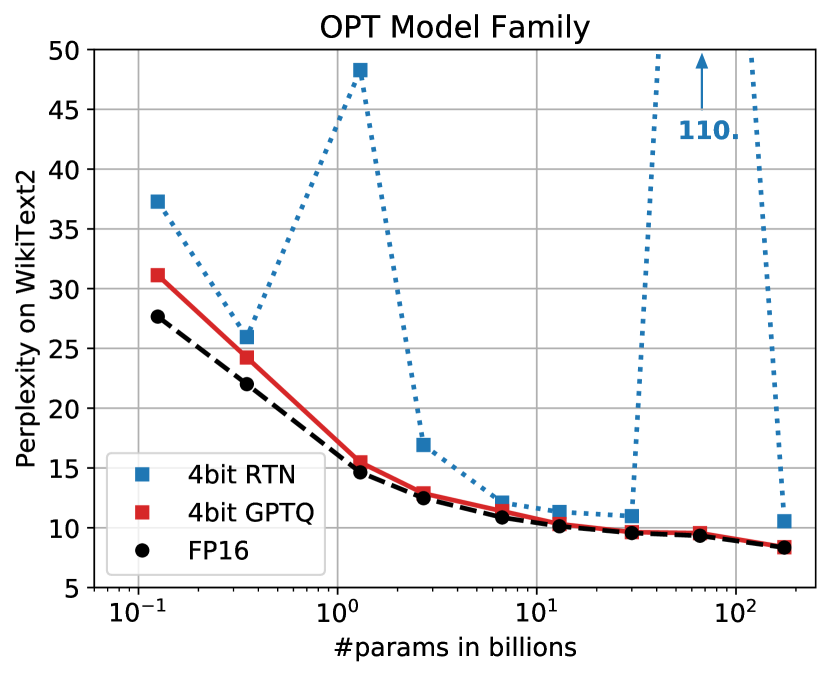
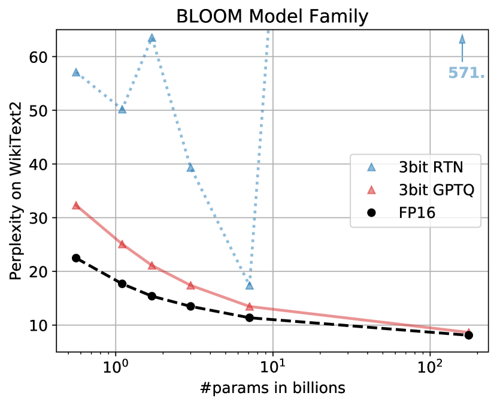
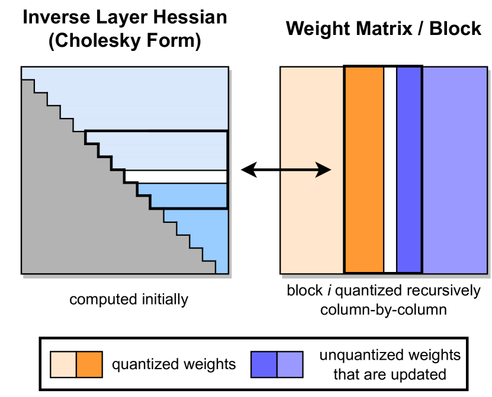
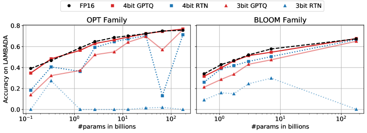
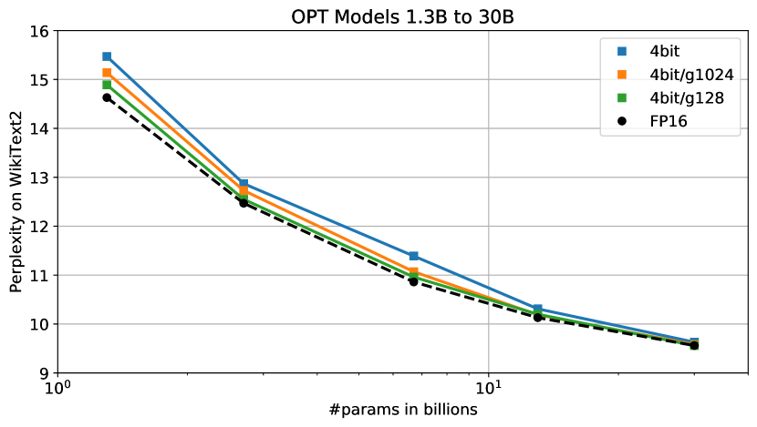

# GPTQ: 生成事前学習トランスフォーマのための正確な訓練後量子化

> 原題: GPTQ: Accurate Post-Training Quantization for Generative Pre-trained Transformers
> 著者: Elias Frantar（IST Austria）, Saleh Ashkboos（ETH Zurich）, Torsten Hoefler（ETH Zurich）, Dan Alistarh（IST Austria & NeuralMagic）
> 連絡先: elias.frantar@ist.ac.at
> 出典: arXiv:2210.17323（ar5iv 版）/ ICLR 2023

> **訳注（クリップの状態と復元、および圧縮箇所）**
> - 底本は ar5iv 版の Web Clipper クリップ。以下 3 点の不良を ar5iv 原ページと照合して復元した。
>   1. **Figure 1 の 2 枚目（`x2.png`）が欠落**していた。Figure 1 は OPT（左）と BLOOM（右）の 2 パネルからなり、クリップには左パネルしか残っていなかった。原ページから取得して復元した。
>   2. **Table 7 のデータ表が丸ごと欠落し、そのキャプションが Figure 4 の画像に付いていた**。原典では Table 7（2 ビット・グループサイズ別の結果）と Figure 4（4 ビット・グループサイズ別の図）が同じ float 内に隣接しており、クリップはこの構造を潰して **Figure 4 のキャプションを消し、Table 7 のキャプションを Figure 4 の画像へ付け替えていた**。原ページから Table 7 の数値と Figure 4 のキャプションの双方を復元し、正しい位置に戻した。
>   3. **脚注 4 件（1〜4）の本文が欠落**していた（マーカー `<sup>N</sup>` のみ残存）。原ページから復元し、該当箇所に訳注として挿入した。
> - **圧縮箇所（ユーザーの指示による唯一の省略）**: 付録 A.3・A.4 の結果表のうち、**Table 9 と Table 13 を代表として全訳で残し、Table 10・11・12 および Table 14〜22 は数値表を省いて傾向の要約に置き換えた**。これらは本文 §5 の Table 3〜6 と同じ結論（4 ビットでは RTN も健闘するが 3 ビットで RTN が崩壊し GPTQ は保つ）を別タスクで繰り返すもので、代表 2 表と最大モデルの数値を残せば内容は保持される。省略した表の具体値が必要なら原典に当たること。
> - 参考文献一覧と謝辞は既定どおり訳出しない。
> - 図はすべて `raw/assets/2022-gptq/` にローカル保存し、そのパスを参照している。

## Abstract（要旨）

GPT あるいは OPT として知られる生成事前学習トランスフォーマ（Generative Pre-trained Transformer）モデルは、複雑な言語モデリングタスクにおける画期的な性能によって他と一線を画すが、同時にその極端に高い計算・記憶コストによっても際立っている。具体的には、その巨大なサイズゆえに、大きく高精度な GPT モデルは推論であっても高性能な GPU を複数台必要としうるため、こうしたモデルの使いやすさが制限される。モデル圧縮によってこの圧力を緩和する研究が現れつつあるものの、既存の圧縮技法の適用可能性と性能は、GPT モデルの規模と複雑さによって制限されている。本論文ではこの課題に取り組み、**近似的な二次情報に基づく新しいワンショットの重み量子化手法 GPTQ** を提案する。これは高精度かつ高効率の双方を満たす。具体的には、GPTQ は 1,750 億パラメータを持つ GPT モデルを**約 4 GPU 時間で**量子化し、重みあたりのビット幅を 3 ビットまたは 4 ビットまで下げつつ、非圧縮のベースラインに対する精度劣化を無視できる程度に抑える。我々の手法は、先行提案されたワンショット量子化手法に対して圧縮率を 2 倍以上にしながら精度を保ち、生成推論のために 1,750 億パラメータのモデルを**単一の GPU 内で**初めて実行できるようにする。さらに、重みが 2 ビット、あるいは**三値（ternary）** の量子化水準まで落とされる**極端な量子化**の領域においても、本手法が依然として妥当な精度を提供できることを示す。これらの改善が FP16 に対する端から端までの推論高速化に活用できることを実験的に示す。

## 1 Introduction（はじめに）

一般に GPT あるいは OPT として知られる、トランスフォーマ [^30] ファミリの事前学習済み生成モデル [^25] [^4] [^34] は、複雑な言語モデリングタスクで画期的な性能を示し、学術的にも実用的にも巨大な関心を集めてきた。その使いやすさに対する主要な障害の一つが計算・記憶コストであり、これは既知のモデルの中で最高水準に位置する。たとえば最高性能のモデル変種、例えば GPT3-175B は 1,750 億のオーダーのパラメータを持ち、訓練には数十から数百 GPU 年を要する [^34]。事前学習済みモデル上での推論という、より単純なタスク（これが本論文の焦点である）でさえ、極めて挑戦的である——たとえば GPT3-175B のパラメータは、コンパクトな float16 形式で格納したときに 326GB（1024 の倍数で数える）のメモリを占める。これは最上位の単一 GPU の容量すら超えるため、推論は複数 GPU の展開といった、より複雑で高価な構成で行わねばならない。

こうしたオーバーヘッドを排除する標準的な手法は**モデル圧縮**であるが（例: [^12] [^10]）、驚くべきことに、こうしたモデルを推論向けに圧縮することについてはほとんど知られていない。理由の一つは、低ビット幅の量子化やモデル枝刈りのより複雑な手法が通常**モデルの再訓練**を要し、それは数十億パラメータのモデルにとって極端に高価だからである。代わりに、再訓練なしにワンショットでモデルを圧縮する**訓練後（post-training）** 手法 [^19] [^31] [^13] [^21] は非常に魅力的だろう。残念ながら、そうした手法のうちより正確な変種 [^16] [^14] [^9] は複雑であり、数十億パラメータへスケールさせるのは難しい [^33]。今日まで、GPT-175B の規模で適用されたのは最近接丸め量子化の基本的な変種 [^33] [^6] のみである。これは低い圧縮目標（例: 8 ビットの重み）ではうまく機能するが、より高い圧縮率では精度を保てない。したがって、より高い圧縮率へのワンショットの**訓練後量子化**が一般に実現可能かどうかは未解決のままである。

<figure>





<figcaption>図1: OPT モデルを 4 ビット、BLOOM モデルを 3 ビット精度へ量子化し、GPTQ を FP16 のベースラインおよび最近接丸め（RTN）[^33] [^6] と比較したもの。（訳注: 原典では左が OPT、右が BLOOM の 2 パネル構成。クリップに残っていたのは左パネルのみだったため、右パネルを原ページから復元して 2 枚並べている。）</figcaption>
</figure>

##### Contribution（貢献）

本論文では、**GPTQ** と呼ぶ新しい訓練後量子化手法を提示する。<sup>1</sup> これは数千億パラメータを持つモデル上で高々数時間で実行できるだけの効率を持ち、かつそうしたモデルを大きな精度損失なくパラメータあたり 3 または 4 ビットへ圧縮できるだけの精密さを持つ。例として、GPTQ は公開されている最大のモデルである OPT-175B と BLOOM-176B を約 4 GPU 時間で量子化でき、極めて厳しい精度指標として知られるパープレキシティの増加は最小限である。

> 訳注（脚注 1）: 「GPTQ」という名称は、OPT モデルファミリの名と、訓練後量子化（post-training quantization, PTQ）の略称を合成したものである。

さらに、モデルが要素あたり 2 ビット、あるいは**三値**へ量子化される**極端な量子化**の領域においても、我々のモデルが頑健な結果を提供できることを示す。実用面では、得られた圧縮モデルを生成タスク向けに効率よく実行できるハーネスを開発した。具体的には、圧縮した OPT-175B モデルを、単一の NVIDIA A100 GPU 上で、あるいはより費用対効果の高い NVIDIA A6000 GPU をわずか 2 台使うだけで、初めて実行できる。また、圧縮を**より高速なメモリ読み込み**に活用できる専用の GPU カーネルを実装し、A100 GPU を使う場合は $\approx 3.25\times$、A6000 GPU を使う場合は $4.5\times$ の高速化を得た。

我々の知る限り、数千億パラメータを持つ極めて正確な言語モデルが要素あたり 3〜4 ビットへ量子化できることを示したのは我々が初めてである。先行する**訓練後手法**は 8 ビットでしか精度を保てず [^33] [^6]、先行する**訓練ベース**の技法は 1〜2 桁小さいモデルしか扱ってこなかった [^32]。これらのネットワークが過剰パラメータ化されていることを思えば、この高い圧縮率は自然に見えるかもしれない。しかし、結果の詳細な分析で論じるとおり、圧縮は言語モデリングの精度（パープレキシティ）・ビット幅・元のモデルサイズの間に自明でないトレードオフを生む。

我々は、本研究がこの領域のさらなる研究を刺激し、これらのモデルをより広い層に届ける一歩となることを願う。**限界**については、**主流のアーキテクチャでは混合精度のオペランド（例: FP16 × INT4）に対するハードウェア支援が欠けているため、我々の手法は現状、実際の乗算については高速化を提供しない**。さらに、我々の現在の結果は活性の量子化を含まない——対象とする場面では活性が大きなボトルネックにならないためである。ただしこれは直交する技法によって支援できる [^33]。

## 2 Related Work（関連研究）

量子化手法は大きく 2 つのカテゴリに分かれる——訓練中の量子化と、訓練後の手法である。前者は、丸め操作に対する何らかの近似的な微分機構を用いながら、通常は大がかりな再訓練やファインチューニングの間にモデルを量子化する [^10] [^20]。対照的に、訓練後（「ワンショット」）の手法は、控えめな資源——典型的には数千のデータサンプルと数時間の計算——を用いて事前学習済みモデルを量子化する。訓練後の手法は、モデルの完全な訓練どころかファインチューニングさえ高価になりうる巨大なモデルにとって特に興味深い。本稿ではこの場面に焦点を当てる。

##### Post-training Quantization（訓練後量子化）

多くの訓練後手法は視覚モデルに焦点を当ててきた。通常、正確な手法は個々の層、あるいは連続する層の小さなブロックを量子化することで動作する（詳細は 3 節）。AdaRound 法 [^19] は罰則項を焼きなますことでデータ依存の丸めを計算し、重みが量子化水準に対応する格子点へ動くよう促す。BitSplit [^31] は残差誤差に対する二乗誤差の目的関数を用いて量子化値をビットごとに構成する。AdaQuant [^14] は straight-through 推定に基づく直接最適化を行う。BRECQ [^16] は目的関数にフィッシャー情報を導入し、単一の残差ブロック内の層を同時に最適化する。最後に Optimal Brain Quantization（OBQ）[^9] は、古典的な Optimal Brain Surgeon（OBS）の二次重み枝刈りの枠組み [^11] [^28] [^8] を量子化に適用できるよう一般化する。OBQ は量子化誤差の順に重みを 1 つずつ量子化し、常に残りの重みを調整する。これらの手法は約 1 億パラメータまでのモデルに対して数 GPU 時間で良い結果を出せるが、桁違いに大きなネットワークへスケールさせるのは難しい。

##### Large-model Quantization（大規模モデルの量子化）

BLOOM [^15] や OPT-175B [^34] のような言語モデルが最近オープンソースで公開されたことで、研究者はこうした巨大ネットワークを推論向けに圧縮する手頃な手法を開発し始めた。既存研究——ZeroQuant [^33]、LLM.int8() [^6]、nuQmm [^23]——はいずれも量子化の粒度（例: ベクトル単位）を注意深く選ぶが、**非常に大きなモデルに対して許容可能な実行時間を保つために、結局のところ重みを最近接（RTN）の量子化水準へ丸めているだけである**。ZeroQuant はさらに AdaQuant に似た層ごとの知識蒸留を提案するが、この手法を適用できる最大のモデルはわずか 13 億パラメータである。この規模でも ZeroQuant は既に約 3 時間の計算を要する。GPTQ は 100 倍大きいモデルを約 4 時間で量子化する。LLM.int8() は、少数の特徴次元における**活性の外れ値**が大きなモデルの量子化を破綻させることを観測し、それらの次元をより高い精度に保つことでこの問題を修正することを提案する。最後に nuQmm は、特定の二値符号化に基づく量子化方式に対する効率的な GPU カーネルを開発している。

この一連の研究に対し、我々は、**大幅に複雑で正確な量子化器を、大きなモデル規模で効率よく実装できる**ことを示す。具体的には、GPTQ はこれら先行技法に対して同程度の精度で圧縮量を 2 倍以上にする。

## 3 Background（背景）

##### Layer-Wise Quantization（層ごとの量子化）

高いレベルでは、我々の手法は最先端の訓練後量子化手法 [^19] [^31] [^14] [^9] の構造に従い、層ごとに量子化を行い、各層について対応する再構成問題を解く。具体的には、$\mathbf{W_{\ell}}$ を線形層 $\ell$ に対応する重みとし、$\mathbf{X}_{\ell}$ をネットワークを通した $m$ 個のデータ点に対応する層入力とする。このとき目的は、完全精度の層出力に対する二乗誤差を最小化する量子化重み行列 $\mathbf{\widehat{W}}$ を見つけることである。形式的には次のように書き直せる:

$$
\text{argmin}_{\mathbf{\widehat{W}}}\,||\mathbf{W}\mathbf{X}-\mathbf{\widehat{W}}\mathbf{X}||_{2}^{2}.
$$

さらに [^19] [^16] [^9] と同様に、$\mathbf{\widehat{W}}$ の量子化格子は処理の前に固定されており、個々の重みは [^14] [^9] のように自由に動けると仮定する。

##### Optimal Brain Quantization（最適脳量子化）

我々のアプローチは、上で定義した層ごとの量子化問題を解くために最近提案された Optimal Brain Quantization（OBQ）法 [^9] を基礎とし、それに一連の大きな修正を施すことで大規模言語モデルへスケールさせ、**3 桁を超える**計算高速化を提供する。理解を助けるため、まず元の OBQ 法を簡潔に要約する。

OBQ 法は、式 (1) が $\mathbf{W}$ の各行についての二乗誤差の和として書けるという観測から始まる。次に OBQ は各行 $\mathbf{w}$ を独立に扱い、単一の重みを量子化することで生じた誤差を補償するために常に未量子化の重みすべてを更新しながら、一度に 1 つの重みを量子化する。対応する目的関数は二次形式であり、そのヘッセ行列は $\mathbf{H}_{F}=2\mathbf{X}_{F}\mathbf{X}_{F}^{\top}$ である（ここで $F$ は残っている完全精度の重みの集合を表す）。したがって、次に量子化すべき貪欲最適な重み（$w_{q}$ と表記）と、それに対応する $F$ 中の全重みの最適な更新（$\bm{\delta}_{F}$ と表記）は次の式で与えられる。ここで $\text{quant}(w)$ は $w$ を量子化格子上の最近接値へ丸める:

$$
w_{q}=\text{argmin}_{w_{q}}\,\frac{(\text{quant}(w_{q})-w_{q})^{2}}{[\mathbf{H}_{F}^{-1}]_{qq}},\quad\bm{\delta}_{F}=-\frac{w_{q}-\text{quant}(w_{q})}{[\mathbf{H}_{F}^{-1}]_{qq}}\cdot(\mathbf{H}_{F}^{-1})_{:,q}.
$$

OBQ はこれら 2 つの式を使って、$\mathbf{w}$ のすべての重みが量子化されるまで反復的に重みを量子化する。これは、$w_{q}$ の量子化後に必要となる $\mathbf{H}$ の第 $q$ 行・列の除去を、ガウス消去法の 1 ステップによって逆行列上で直接行うことで、$\mathbf{H}^{-1}$ の高価な完全再計算を避けて効率的に実行される。すなわち、更新された逆行列は次の式で与えられる:

$$
\mathbf{H}_{-q}^{-1}=\Big{(}\mathbf{H}^{-1}-\frac{1}{[\mathbf{H}^{-1}]_{qq}}\mathbf{H}^{-1}_{:,q}\mathbf{H}^{-1}_{q,:}\Big{)}_{-p}.
$$

この手法にはベクトル化された実装が伴い、$\mathbf{W}$ の複数行を並列に扱える。最終的にこのアルゴリズムは中規模のモデルで妥当な実行時間を達成できる——たとえば ResNet-50 モデル（2,500 万パラメータ）を単一 GPU 上で約 1 時間で完全に量子化でき、これは最先端の精度を達成する他の訓練後手法とおおむね同等である [^9]。しかし、$d_{\text{row}}\times d_{\text{col}}$ の行列 $\mathbf{W}$ に対する OBQ の実行時間が入力に対して**三次**の依存 $O(d_{\text{row}}\cdot d_{\text{col}}^{3})$ を持つという事実は、数十億パラメータのモデルへの適用が極端に高価であることを意味する。

## 4 The GPTQ Algorithm（GPTQ アルゴリズム）

##### Step 1: Arbitrary Order Insight（ステップ 1: 任意順序という着眼）

前節で説明したとおり、OBQ は貪欲な順序で重みを量子化する——すなわち、現時点で追加の量子化誤差が最小になる重みを常に選ぶ。興味深いことに我々は、このかなり自然な戦略は確かに非常によく機能するように見えるものの、**任意の順序で重みを量子化する場合に対する改善は一般に小さい**こと、特に大きく重くパラメータ化された層でそうであることを見出した。おそらくこれは、個々の誤差が大きい量子化重みの数がわずかに少なくなる効果が、それらの重みが処理の終盤——補償のために調整できる未量子化の重みがわずかしか残っていない時点——で量子化されることによって打ち消されるためである。これから論じるとおり、この「**どんな固定順序でもうまくいきうる**」という着眼、特に大きなモデルでそうだという着眼は、興味深い帰結をもたらす。

<figure>



<figcaption>図2: GPTQ の量子化手続き。あるステップでは、コレスキー分解に格納された逆ヘッセ行列の情報を使って、連続する列のブロック（太字）が量子化され、残りの重み（青）はステップの最後に更新される。量子化手続きは各ブロックの内側で再帰的に適用される——白い中央の列が現在量子化されている列である。</figcaption>
</figure>

元の OBQ 法は、対応する誤差によって定義される特定の順序で $\mathbf{W}$ の行を独立に量子化する。対照的に我々は、**すべての行の重みを同じ順序で**量子化することを目指し、それが典型的には元の解と同程度の最終二乗誤差をもたらすことを示す。その結果、未量子化の重みの集合 $F$ と、同様に $\mathbf{H}_{F}^{-1}$ が、すべての行について常に同じになる（図解は Figure 2）。より詳しく言えば、後者は $\mathbf{H}_{F}$ が層の入力 $\mathbf{X}_{F}$ のみに依存し（それは全行で同じである）、いかなる重みにも依存しないという事実による。したがって、式 (3) で与えられる $\mathbf{H}_{F}^{-1}$ の更新を、重みごとに $d_{\text{row}}\cdot d_{\text{col}}$ 回ではなく、**列ごとに $d_{\text{col}}$ 回だけ**行えばよい。これは全体の実行時間を $O(d_{\text{row}}\cdot d_{\text{col}}^{3})$ から $O(\text{max}\,\{d_{\text{row}}\cdot d_{\text{col}}^{2},d_{\text{col}}^{3}\})$ へ、すなわち $\text{min}\,\{d_{\text{row}},d_{\text{col}}\}$ の係数だけ削減する。より大きなモデルでは、この差は数桁に及ぶ。しかし、このアルゴリズムを実際に非常に大きなモデルへ適用できるようになる前に、さらに 2 つの大きな問題に対処する必要がある。

##### Step 2: Lazy Batch-Updates（ステップ 2: 遅延バッチ更新）

第一に、先に述べた方式を素直に実装しても実際には速くならない。アルゴリズムの計算対メモリアクセス比が比較的低いからである。たとえば式 (3) は、潜在的に巨大な行列の全要素を、各要素あたりわずか数 FLOP を使って更新する必要がある。こうした演算は現代の GPU の膨大な計算能力を適切に活用できず、大幅に低いメモリ帯域によって律速される。

幸い、この問題は次の観測によって解決できる——**列 $i$ の最終的な丸めの決定は、まさにその列に対して行われた更新にのみ影響される**ので、より後ろの列への更新はこの時点では無関係である。これにより更新を「遅延バッチ化」してまとめることが可能になり、はるかに良い GPU 利用率を達成できる。具体的には、アルゴリズムを一度に $B=128$ 列へ適用し、更新をそれらの列と対応する $\mathbf{H}^{-1}$ の $B\times B$ ブロックに閉じ込める（Figure 2 も参照）。ブロックが完全に処理され終わったときにのみ、以下に示す式 (2) と (3) の多重重み版を使って $\mathbf{H}^{-1}$ と $\mathbf{W}$ の行列全体の大域的な更新を行う。ここで $Q$ は添字の集合を、$\mathbf{H}_{-Q}^{-1}$ は対応する行と列を除去した逆行列を表す:

$$
\bm{\delta}_{F}=-(\mathbf{w}_{Q}-\text{quant}(\mathbf{w}_{Q}))([\mathbf{H}_{F}^{-1}]_{QQ})^{-1}(\mathbf{H}_{F}^{-1})_{:,Q},
$$

$$
\mathbf{H}_{-Q}^{-1}=\Big{(}\mathbf{H}^{-1}-\mathbf{H}^{-1}_{:,Q}([\mathbf{H}^{-1}]_{QQ})^{-1}\mathbf{H}^{-1}_{Q,:}\Big{)}_{-Q}.
$$

この戦略は理論上の計算量を減らすわけではないが、メモリスループットのボトルネックには効果的に対処する。これは実際に非常に大きなモデルで 1 桁の高速化をもたらし、我々のアルゴリズムの決定的な構成要素になっている。

##### Step 3: Cholesky Reformulation（ステップ 3: コレスキーによる再定式化）

最後に対処すべき技術的問題は数値的な不正確さであり、これは既存モデルの規模では大きな問題になりうる。特に前ステップで論じたブロック更新と組み合わさるとそうである。具体的には、行列 $\mathbf{H}_{F}^{-1}$ が**不定値（indefinite）** になることが起こりうる。我々の気付いたところでは、これはアルゴリズムに残りの重みを誤った方向へ積極的に更新させ、対応する層の量子化を任意に悪くしてしまう。実際にこれが起こる確率はモデルサイズとともに増加することを観測した——具体的には、数十億パラメータより大きなモデルでは少なくとも数層でほぼ確実に起こる。主な問題は式 (5) の繰り返し適用にあるようで、特に追加の行列反転を通してさまざまな数値誤差が蓄積する。

より小さなモデルでは、減衰（dampening）——すなわち $\mathbf{H}$ の対角要素に小さな定数 $\lambda$（我々は常に対角値の平均の 1% を選ぶ）を加えること——が数値的問題を避けるのに十分に見える。しかしより大きなモデルには、より頑健で一般的なアプローチが必要である。

これに対処するため、まず次の点に注目する——重み $q$ を量子化するときの未量子化重みの集合を $F_{q}$ とすると、$\mathbf{H}_{F_{q}}^{-1}$ から必要な情報は行 $q$ だけ、より正確にはこの行の対角要素以降の要素だけである。その帰結として、これらの行すべてを、メモリ消費を大きく増やすことなく、より数値的に安定な方法で**事前計算**できる。実際、対称な $\mathbf{H}^{-1}$ に対する式 (3) による行の除去は、本質的にコレスキー分解を取ることに対応する——後者が行 $q$ を $([\mathbf{H}^{-1}_{F_{q}}]_{qq})^{1/2}$ で割るという小さな違いを除けば同じである。したがって、最先端のコレスキーカーネルを活用して、$\mathbf{H}^{-1}$ から必要になるすべての情報を前もって計算できる。穏やかな減衰と組み合わせることで、得られた手法は巨大なモデル上でも問題なく実行できるだけ頑健になる。おまけに、よく最適化されたコレスキーカーネルを使うことでさらなる高速化も得られる。アルゴリズムのコレスキー版に必要な細かい変更をすべて次に詳述する。

##### The Full Algorithm（アルゴリズム全体）

最後に、上で論じた最適化を含む GPTQ の完全な擬似コードを Algorithm 1 に示す。

**Algorithm 1** 逆ヘッセ行列 $\mathbf{H}^{-1}=(2\mathbf{X}\mathbf{X}^{\top}+\lambda\mathbf{I})^{-1}$ とブロックサイズ $B$ が与えられたときに $\mathbf{W}$ を量子化する。

```
Q ← 0_{d_row × d_col}                                  // 量子化された出力
E ← 0_{d_row × B}                                      // ブロックの量子化誤差
H^{-1} ← Cholesky(H^{-1})^T                            // 逆ヘッセ行列の情報
for i = 0, B, 2B, ... do
    for j = i, ..., i+B-1 do
        Q[:, j] ← quant(W[:, j])                       // 列を量子化する
        E[:, j-i] ← (W[:, j] - Q[:, j]) / [H^{-1}]_{jj}  // 量子化誤差
        W[:, j:(i+B)] ← W[:, j:(i+B)] - E[:, j-i] · H^{-1}[j, j:(i+B)]  // ブロック内の重みを更新
    end for
    W[:, (i+B):] ← W[:, (i+B):] - E · H^{-1}[i:(i+B), (i+B):]  // 残りの重みをすべて更新
end for
```

## 5 Experimental Validation（実験的検証）

##### Overview（概観）

実験はまず、これらの手法が妥当な実行時間を提供できる小さなモデル上で、GPTQ の精度を他の「正確だが高価な」量子化器と比較して検証することから始める。次に、非常に大きなモデルに対する GPTQ の実行時間のスケーリングを調べる。続いて、BLOOM と OPT のモデルファミリ全体に対する 3 ビット・4 ビット量子化の結果を、挑戦的な言語生成タスクにおけるパープレキシティで評価して提示する。加えて、連続する重みの小さなブロックへ粒度を落とせば、本手法が 2 ビット量子化でも安定であることを示す。このパープレキシティ分析を補完するため、得られた量子化モデルを一連の標準的なゼロショットタスクでも評価する。最後に、公開されている最大の（そして興味深い）2 つのモデル、Bloom-176B と OPT-175B に焦点を当て、複数のタスクで詳細な評価を行う。これらのモデルについては実用上の改善——推論に必要な GPU 台数の削減と、生成タスクの端から端までの高速化——も提示する。

##### Setup（設定）

GPTQ を PyTorch [^24] で実装し、BLOOM [^15] と OPT [^34] モデルファミリの HuggingFace 統合を用いた。すべてのモデル（1,750 億パラメータの変種を含む）を、**80GB のメモリを持つ単一の NVIDIA A100 GPU** を用いて量子化した。GPTQ のキャリブレーションデータは全体で、C4 データセット [^26]（ランダムにクロールされたウェブサイトからの抜粋であり、汎用的なテキストデータを表す）からの 128 個のランダムな 2048 トークン断片からなる。これは GPTQ がタスク固有のデータを一切見ないことを意味し、したがって我々の結果は実際に「ゼロショット」のままであることを強調する。[^6] と同様に、min-max 格子上での標準的な一様な行ごとの非対称量子化を行う。追加の評価詳細は付録 A.2.1 にある。

圧縮手続き全体を、完全精度モデルの実行に必要な量よりも大幅に少ない GPU メモリで実行できるようにするには、いくらか配慮が要る。具体的には、常に 6 層からなるトランスフォーマブロックを一度に 1 つだけ GPU メモリへ読み込み、層ごとのヘッセ行列を蓄積して量子化を行う。最後に、現在のブロック入力を完全に量子化されたブロックへ再び通し、次のブロックの量子化のための新しい入力を生成する。したがって量子化の過程は、完全精度モデルにおける層入力ではなく、**すでに部分的に量子化されたモデルにおける実際の層入力**の上で動作する。これは無視できる追加コストで目立った改善をもたらすことを見出した。

##### Baselines（ベースライン）

RTN と表記する主要なベースラインは、GPTQ でも使うのとまったく同じ非対称な行ごとの格子上で、すべての重みを最近接の量子化値へ丸めるものである。つまり LLM.int8() の最先端の重み量子化に正確に対応する。これは現在、非常に大きな言語モデルの量子化に関するすべての研究で選ばれている手法である [^6] [^33] [^23]——単に直接丸めるだけなので、数十億パラメータのネットワークへ実行時間がよくスケールする。さらに論じるとおり、AdaRound [^19] や BRECQ [^16] のようなより正確な手法は、本研究の主眼である数十億パラメータのモデルに対しては現状では遅すぎる。にもかかわらず、GPTQ が小さなモデルではそうした手法と競合しつつ、OPT-175B のような巨大モデルへもスケールすることを示す。

##### Quantizing Small Models（小さなモデルの量子化）

最初のアブレーション研究として、標準的な PTQ ベンチマークである ResNet18 と ResNet50 上で、[^9] と同じ設定で GPTQ の性能を最先端の訓練後量子化（PTQ）手法と比較する。Table 2（訳注: 原典の表番号どおり。本文の Table 1 に相当する内容）に見られるとおり、GPTQ は 4 ビットで同等の性能を示し、3 ビットでは最も正確な手法よりわずかに劣る。同時に、先行 PTQ 手法の中で最速の AdaQuant を大きく上回る。さらに、より小さな 2 つの言語モデル BERT-base [^7] と OPT-125M 上で、完全な貪欲 OBQ 法と比較する。結果は付録 Table 8 に示す。4 ビットでは両手法は同程度の性能を示し、3 ビットでは驚くべきことに GPTQ がわずかに良い。これはおそらく、OBQ が使う追加のヒューリスティクス（早期の外れ値の丸めなど）の一部が、視覚以外のモデルで最適な性能を出すには注意深い調整を要するためだと我々は疑っている。全体として GPTQ は、小さなモデルに対しては最先端の訓練後手法と競合しつつ、**約 1 時間ではなく 1 分未満**しか要さない。これがはるかに大きなモデルへのスケーリングを可能にする。

**表1**: 視覚モデルに対する最先端の訓練後手法との比較。

| Method | RN18 – 69.76% 4bit | 3bit | RN50 – 76.13% 4bit | 3bit |
| --- | --- | --- | --- | --- |
| AdaRound | 69.34 | 68.37 | 75.84 | 75.14 |
| AdaQuant | 68.12 | 59.21 | 74.68 | 64.98 |
| BRECQ | 69.37 | 68.47 | 75.88 | 75.32 |
| OBQ | 69.56 | 68.69 | 75.72 | 75.24 |
| GPTQ | 69.37 | 67.88 | 75.71 | 74.87 |

**表2**: 最大の OPT および BLOOM モデル 4 種の完全な量子化に対する GPTQ の実行時間。

| OPT | 13B | 30B | 66B | 175B |
| --- | --- | --- | --- | --- |
| 実行時間 | 20.9m | 44.9m | 1.6h | 4.2h |
| BLOOM | 1.7B | 3B | 7.1B | 176B |
| 実行時間 | 2.9m | 5.2m | 10.0m | 3.8h |

##### Runtime（実行時間）

次に、GPTQ によるモデル全体の量子化時間を（単一の NVIDIA A100 GPU 上で）測定する。結果を Table 2 に示す。見てのとおり GPTQ は 10〜30 億パラメータのモデルを数分で、1,750 億のものを数時間で量子化する。参考までに、straight-through に基づく手法 ZeroQuant-LKD [^33] は 13 億のモデルに対して（同じハードウェア上で）3 時間の実行時間を報告しており、これを線形に外挿すると 1,750 億のモデルには数百時間（数週間）になる。適応的丸めに基づく手法は典型的にはるかに多くの SGD ステップを用いるので、さらに高価になるだろう [^19] [^16]。

##### Language Generation（言語生成）

大規模な研究は、OPT と BLOOM のモデルファミリ全体を 3 ビット・4 ビットへ圧縮することから始める。次にそれらのモデルを、WikiText2 [^18]（Figure 1 および Tables 3, 4 を参照）、Penn Treebank（PTB）[^17]、C4 [^26]（後者 2 つは付録 A.3）を含むいくつかの言語タスクで評価する。これらパープレキシティに基づくタスクに焦点を当てるのは、モデルの量子化に特に敏感であることが知られているからである [^33]。OPT モデルにおいて、GPTQ は RTN を明確に、大きな差で上回る。たとえば 175B モデルの 4 ビットで、GPTQ はパープレキシティをわずか 0.03 しか失わないのに対し、RTN は 2.2 ポイント落ち、10 倍小さい完全精度の 13B モデルより悪い性能になる。3 ビットでは RTN が完全に崩壊するが、GPTQ は依然として妥当なパープレキシティを維持でき、特に大きなモデルでそうである。BLOOM も同様のパターンを示す——ただし手法間の差は通常やや小さく、このモデルファミリのほうが量子化しやすいのかもしれない。興味深い傾向の一つは（Figure 1 も参照）、**より大きなモデルのほうが一般に量子化しやすいように見える**ことである（OPT-66B は例外<sup>2</sup>）。圧縮が最も必要になるのはまさにそうした場合なので、これは実用上の朗報である。

> 訳注（脚注 2）: OPT-66B モデルをより詳しく調べたところ、これは**この訓練済みモデルが初期の層にかなりの割合の死んだユニット（dead units）を持つ**という事実と相関しているように見え、それが圧縮を難しくしている可能性がある。

**表3**: WikiText2 における OPT のパープレキシティ結果。

| OPT | Bits | 125M | 350M | 1.3B | 2.7B | 6.7B | 13B | 30B | 66B | 175B |
| --- | --- | --- | --- | --- | --- | --- | --- | --- | --- | --- |
| full | 16 | 27.65 | 22.00 | 14.63 | 12.47 | 10.86 | 10.13 | 9.56 | 9.34 | 8.34 |
| RTN | 4 | 37.28 | 25.94 | 48.17 | 16.92 | 12.10 | 11.32 | 10.98 | 110 | 10.54 |
| GPTQ | 4 | 31.12 | 24.24 | 15.47 | 12.87 | 11.39 | 10.31 | 9.63 | 9.55 | 8.37 |
| RTN | 3 | 1.3e3 | 64.57 | 1.3e4 | 1.6e4 | 5.8e3 | 3.4e3 | 1.6e3 | 6.1e3 | 7.3e3 |
| GPTQ | 3 | 53.85 | 33.79 | 20.97 | 16.88 | 14.86 | 11.61 | 10.27 | 14.16 | 8.68 |

**表4**: WikiText2 における BLOOM のパープレキシティ結果。

| BLOOM | Bits | 560M | 1.1B | 1.7B | 3B | 7.1B | 176B |
| --- | --- | --- | --- | --- | --- | --- | --- |
| full | 16 | 22.42 | 17.69 | 15.39 | 13.48 | 11.37 | 8.11 |
| RTN | 4 | 25.90 | 22.00 | 16.97 | 14.76 | 12.10 | 8.37 |
| GPTQ | 4 | 24.03 | 19.05 | 16.48 | 14.20 | 11.73 | 8.21 |
| RTN | 3 | 57.08 | 50.19 | 63.59 | 39.36 | 17.38 | 571 |
| GPTQ | 3 | 32.31 | 25.08 | 21.11 | 17.40 | 13.47 | 8.64 |

##### 175 Billion Parameter Models（1,750 億パラメータのモデル）

次に、公開されている最大の密なモデルである BLOOM-176B と OPT-175B を調べる。Table 5 は Wikitext-2、PTB、C4 にわたる結果をまとめている。4 ビットでは GPTQ モデルは完全精度版に対してパープレキシティが $\leq 0.25$ しか悪化しないのに対し、OPT-175B では RTN の結果との差が大きいことが観測される。3 ビットでは RTN が崩壊するが、GPTQ は依然としてほとんどのタスクで良好な性能を維持でき、**5 倍を超える圧縮に対して 0.3〜0.6 ポイントしか失わない**。GPTQ の精度は、より細かい粒度のグループ化 [^23] によってさらに改善できる——グループサイズ 1024（約 0.02 ビット追加）は平均でパープレキシティを約 0.2 改善し、グループサイズ 128（約 0.15 ビット追加）はさらに 0.1 改善して、非圧縮の精度とわずか 0.1〜0.3 の差にまで縮める。グループ化は GPTQ と非常に相性が良い——グループのパラメータを各層の量子化の過程で、常に最新の更新済みの重みを使いながら決定できるからである。

**表5**: OPT-175B と BLOOM-176B の結果まとめ。「g1024」「g128」はそれぞれサイズ 1024 と 128 のグループ化を用いた結果を表す。

| Method | Bits | OPT-175B Wiki2 | PTB | C4 | LAMB. | BLOOM-176B Wiki2 | PTB | C4 | LAMB. |
| --- | --- | --- | --- | --- | --- | --- | --- | --- | --- |
| Baseline | 16 | 8.34 | 12.01 | 10.13 | 75.59 | 8.11 | 14.59 | 11.71 | 67.40 |
| RTN | 4 | 10.54 | 14.22 | 11.61 | 71.34 | 8.37 | 15.00 | 12.04 | 66.70 |
| GPTQ | 4 | 8.37 | 12.26 | 10.28 | 76.80 | 8.21 | 14.75 | 11.81 | 67.71 |
| RTN | 3 | 7.3e3 | 8.0e3 | 4.6e3 | 0 | 571. | 107. | 598. | 0.17 |
| GPTQ | 3 | 8.68 | 12.68 | 10.67 | 76.19 | 8.64 | 15.57 | 12.27 | 65.10 |
| GPTQ | 3/g1024 | 8.45 | 12.48 | 10.47 | 77.39 | 8.35 | 15.01 | 11.98 | 67.47 |
| GPTQ | 3/g128 | 8.45 | 12.37 | 10.36 | 76.42 | 8.26 | 14.89 | 11.85 | 67.86 |

##### Practical Speedups（実用的な高速化）

最後に実用的な応用を検討する。興味深い事例として OPT-175B モデルに注目する。3 ビットへ量子化すると、このモデルは埋め込み層と出力層（これらは完全な FP16 精度に保つ）を含めて約 63GB のメモリを取る。加えて、生成タスクの一般的な最適化である全層のキーと値の完全な履歴の格納が、最大 2048 トークンに対してさらに約 9GB を消費する。したがって、量子化モデル全体を実際に単一の 80GB A100 GPU へ収めることができ、推論中に必要になった層を動的に逆量子化することで実行できる（4 ビットではモデルは完全には収まらない）。参考までに、標準的な FP16 の実行には 80GB の GPU が 5 台必要であり、最先端の 8 ビット量子化器である LLM.int8() [^6] はそうした GPU が 3 台必要である。

次に、これらのモデルの最も魅力的な応用の一つである言語生成を、レイテンシ削減を目標に検討する。メモリコストは減らすが実行時間は FP16 のベースラインと同じである LLM.int8() とは異なり、我々の量子化モデルはこの用途で大きな高速化を達成できることを示す。言語生成ではモデルが一度に 1 トークンずつ処理・出力し、OPT-175B ではこれがトークンあたり容易に数百ミリ秒に達しうる。計算が行列-ベクトル積に支配されるため、生成結果がユーザーに届く速度を上げるのは難しい。行列-行列積とは異なり、これは主にメモリ帯域によって制限される。我々はこの問題に、**必要になったときに重みを動的に逆量子化することで行列-ベクトル積を行う「量子化行列 × 完全精度ベクトル」積カーネル**を開発することで対処する。特筆すべきは、これが活性の量子化を**まったく必要としない**ことである。逆量子化は追加の計算を消費するが、カーネルがアクセスすべきメモリははるかに少なくなり、Table 6 に示すとおり大きな高速化につながる。標準的な HuggingFace-accelerate 相当の設定では通信コストが無視できるので、報告した高速化のほぼすべてが我々のカーネルによるものであることに注意されたい（詳細は付録 A.2.2）。

**表6**: 長さ 128 の系列を生成するときのトークンあたり平均レイテンシ（バッチサイズ 1）。

| GPU | FP16 | 3bit | 高速化 | GPU 削減 |
| --- | --- | --- | --- | --- |
| A6000 – 48GB | 589ms | 130ms | $4.53\times$ | $8\rightarrow 2$ |
| A100 – 80GB | 230ms | 71ms | $3.24\times$ | $5\rightarrow 1$ |

たとえば我々のカーネルを使うと、GPTQ で得た 3 ビットの OPT-175B モデルを単一の A100 上で実行したときのトークンあたり平均時間は、（5 台の GPU 上で動く）FP16 版より約 **3.25 倍**速い。NVIDIA A6000 のような、よりアクセスしやすい GPU はメモリ帯域がはるかに低いので、この戦略はいっそう効果的である——3 ビットの OPT-175B モデルを 2 台の A6000 GPU 上で実行すると、（8 台の GPU 上での）FP16 推論の 589 ミリ秒から 130 ミリ秒へ、**4.5 倍**のレイテンシ削減になる。

<figure>



<figcaption>図3: GPTQ 適用後の OPT および BLOOM モデルの精度。LAMBADA で測定。</figcaption>
</figure>

##### Zero-Shot Tasks（ゼロショットタスク）

我々の焦点は言語生成にあるが、量子化モデルの性能をいくつかの人気あるゼロショットタスク、すなわち LAMBADA [^22]、ARC（Easy と Challenge）[^3]、PIQA [^29] でも評価する。Figure 3 は LAMBADA におけるモデル性能を可視化している（Table 5 の "Lamb." の結果も参照）。以前と同様の振る舞いが観測される。目立つ点は、1) 4 ビットではモデルのスペクトル全体で量子化が「より易しく」見え、RTN でさえ比較的うまく機能すること、2) 3 ビットでは RTN が崩壊するのに対し GPTQ は依然として良好な精度を提供すること、である。追加の結果を付録 A.4 に示す。

##### Additional Tricks（追加の工夫）

ここまでの実験は素の行ごとの量子化のみに焦点を当ててきたが、**GPTQ は本質的にどんな量子化格子の選択とも両立する**ことを強調しておきたい。たとえば標準的なグループ化 [^1] [^23]——すなわち連続する $g$ 個の重みのグループに独立な量子化を適用すること——と容易に組み合わせられる。Table 5 の最後の行が示すとおり、これは 3 ビットの最大モデルに対して目立った追加精度をもたらしうる。さらに Figure 4 に可視化したとおり、4 ビット精度の中規模モデルに対する精度損失を大きく減らす。

<figure>



<figcaption>図4: 中規模の OPT モデルに対する、異なるグループサイズでの 4 ビット GPTQ。（訳注: このキャプションはクリップで消失していたため原ページから復元した。クリップではこの画像に Table 7 のキャプションが誤って付いていた。）</figcaption>
</figure>

##### Extreme Quantization（極端な量子化）

最後に、グループ化は極端な量子化——平均して要素あたり約 2 ビット——でも妥当な性能を達成することを可能にする。Table 7 は、最大のモデルをグループサイズを変えながら 2 ビットへ量子化したときの WikiText2 での結果を示す。約 2.2 ビット（グループサイズ 128。グループごとに FP16 のスケールと 2 ビットのゼロ点を使う）ではパープレキシティの増加は既に 1.5 ポイント未満であり、約 2.6 ビット（グループサイズ 32）では 0.6〜0.7 まで下がる。これは素の 3 ビットよりわずかに悪いだけであり、実用的なカーネル実装にとって興味深いかもしれない。さらにグループサイズを 8 まで下げると**三値（-1, 0, +1）** 量子化を適用でき、OPT-175B で WikiText2 PPL 9.20——1 ポイント未満の低下——を達成する。これは上記の 2 ビットの数字と比べると平均的な圧縮率では劣るが、このパターンは FPGA のようなカスタムハードウェア上で効率的に実装できるだろう。要約すると、これらの結果は、非常に大きな言語モデルの高精度な**ワンショット**圧縮を、平均して値あたり 3 ビットよりさらに低いところまで押し進める、励みになる第一歩である。

**表7**: グループサイズを変えた 2 ビット GPTQ の量子化結果。WikiText2 におけるパープレキシティ。（訳注: この数値表はクリップで丸ごと欠落していたため、原ページから復元した。）

| Model | FP16 | g128 | g64 | g32 | 3-bit |
| --- | --- | --- | --- | --- | --- |
| OPT-175B | 8.34 | 9.58 | 9.18 | 8.94 | 8.68 |
| BLOOM | 8.11 | 9.55 | 9.17 | 8.83 | 8.64 |

## 6 Summary and Limitations（まとめと限界）

我々は、真に大きな言語モデルを量子化するための近似的な二次手法 GPTQ を提示した。GPTQ は公開されている最大級のモデルのいくつかを 3 ビット・4 ビットまで正確に圧縮でき、それが大きな使いやすさの改善と、低い精度損失での端から端までの高速化につながる。我々の手法がこれらのモデルをより多くの研究者・実務者にとってアクセス可能にすることを願う。同時に、いくつかの重大な限界を強調しておく。技術面では、**我々の手法はメモリ移動の削減から高速化を得ているのであって、計算量の削減をもたらすものではない**。加えて、我々の研究は生成タスクに焦点を当てており、**活性の量子化を考慮していない**。これらは今後の研究の自然な方向であり、注意深く設計された GPU カーネルと既存の技法 [^33] [^32] によって達成できると考えている。

## 7 Ethics Statement（倫理声明）

我々の研究は、パープレキシティのような標準的な精度指標において精度損失をほとんど、あるいはまったく伴わずに、量子化によって大規模言語モデル（LLM）を圧縮する汎用的な手法を導入する。我々の手法はキャリブレーションにごく少量のランダムに選ばれたデータしか使わないため、タスク非依存である。したがって、手法の技術的詳細から直接生じる重大な倫理的含意は予見していない。ただし考慮すべき点として、我々の研究は文献で標準的な「先行する精度」指標（パープレキシティなど）に焦点を当てている [^6] [^33]。圧縮が二次的な尺度、特にバイアスの影響 [^2] に与える影響についての徹底した研究は必要であり、我々の研究がそれを容易にするかもしれないと考えている。同時に、我々の研究は極端に大きな言語モデルでの推論をより手に取りやすくする——良かれ悪しかれ。やがてそうしたツールははるかに使いやすく展開しやすくなり、その力と限界を理解する必要性はいっそう切実になると考える。

## 8 Reproducibility Statement（再現性に関する声明）

補足資料に、本論文のすべての実験を再現するコードを提供する。具体的には次を含む:

- OPT および BLOOM モデルファミリの全モデルを 2/3/4 ビットへ圧縮すること。
- 量子化モデルのパープレキシティを評価すること。
- 我々の 3 ビット CUDA カーネルと、圧縮推論のベンチマーク機能。
- ZeroShot 実験のコード。
- サンプルコマンドと全スクリプトの実行方法を記した README ファイル。

## Appendix A Appendix（付録）

### A.1 Additional Comparison with OBQ（OBQ との追加比較）

ここでは、BERT-base/SQuAD [^27] と OPT-125M/WikiText2 における GPTQ と OBQ の追加比較を示す。後者は OBQ を妥当に適用できる最大級のモデルである。

**表8**: BERT-base/SQuAD および OPT-125M/WikiText2 における OBQ に対する GPTQ の比較。

| Method | BERT-base (88.53 F1) 4bit | 3bit | OPT-125M (27.66 PPL) 4bit | 3bit |
| --- | --- | --- | --- | --- |
| OBQ | 88.23 | 85.29 | 32.52 | 69.32 |
| GPTQ | 88.18 | 86.02 | 31.12 | 53.85 |

### A.2 Experiment Details（実験の詳細）

本節では実験設定について、特にモデルの評価と時間計測実験の設定に関する追加の詳細を提供する。

#### A.2.1 Evaluation（評価）

言語生成の実験では、[^25] と同様の標準的な方法でパープレキシティを次のように計算する。まず検証セット全体を 2 つの改行を区切りとして連結し、各モデルの既定の HuggingFace トークナイザで符号化する。次に、系列をモデルの完全な文脈長である幅 2048 の重複しない断片へ分割する。これらをモデルへ通し、それぞれ次トークンに対応する対数確率を集める。その指数化した平均が、我々が報告する最終的なパープレキシティである。

ゼロショットタスクについては、データの前処理と最終スコアの計算に関して EleutherAI の評価ハーネス<sup>3</sup> に従う。個々のサンプルはすべて別々に評価しており、したがってパディングは一切適用していないことに注意されたい。

> 訳注（脚注 3）: https://github.com/EleutherAI/lm-evaluation-harness

#### A.2.2 Timing Experiment Setup（時間計測実験の設定）

時間計測の実験は、最近の研究 LLM.int8() [^6] でも用いられている標準的な HuggingFace/accelerate<sup>4</sup> の設定に従って行う。この設定では、連続する層のかたまりを GPU に分散させることでモデルを分割する。重要なのは、この設定では通信コストが最小限で、8 台の GPU を使う場合でも総実行時間の $<5\%$ にとどまることである。これは、報告した高速化のほぼすべてが我々の「量子化行列 × 完全精度ベクトル」積カーネルによるものであることを意味する。**FP16 のベースラインと我々の量子化モデルの唯一の違いは、その下にある行列-ベクトル積を実行するために使われるカーネルだけである**ことを強調しておく。

> 訳注（脚注 4）: https://huggingface.co/docs/accelerate/index

これは、HuggingFace・attention・残差や LayerNorm のような非量子化演算に由来するオーバーヘッドがすべてまったく同じであることを意味する。したがって我々の量子化モデルは、より高度な分散戦略 [^35] やより効率的な attention カーネル [^5] から、ベースラインとまったく同じだけ恩恵を受けるはずである。

一般に、我々のカーネルは、（ほぼ）行列-ベクトル積がメモリ律速になる小さいバッチサイズの生成推論（簡単のためバッチサイズ 1 のみを考える）を対象としている。非生成的な用途や大きなバッチの用途では、演算がメモリ律速ではなく計算律速になりうるので、我々のカーネルは直接には適用できない。代わりに、対応する行列-行列計算を行う前に単に行列を展開すればよい——これは A100 で 1.5ms 未満、A6000 で 3ms 未満であり、それに続く OPT-175B の FC2 層の計算（バッチサイズ $16\times 1024$ トークン）の 76ms/365ms と比べれば小さい。したがってそうした用途に対しても、我々の手法は非常に小さい計算オーバーヘッドで必要な GPU 台数を大きく減らす。これは最近の研究 [^6] と似ているが、我々は $2.5\times$ 高い圧縮率を達成している。

### A.3 Additional Language Generation Results（言語生成の追加結果）

Tables 9, 10, 11, 12 は言語生成タスクの追加結果を示す。

> **訳注（圧縮箇所）**: 本節の 4 表のうち、代表として **Table 9（OPT / PTB）のみ全数値を残し**、Table 10・11・12 は最大モデルの数値と傾向の要約に置き換えた（ユーザーの指示による）。

**表9**: PTB における OPT のパープレキシティ結果。

| OPT | Bits | 125M | 350M | 1.3B | 2.7B | 6.7B | 13B | 30B | 66B | 175B |
| --- | --- | --- | --- | --- | --- | --- | --- | --- | --- | --- |
| full | 16 | 38.99 | 31.08 | 20.29 | 17.97 | 15.77 | 14.52 | 14.04 | 13.36 | 12.01 |
| RTN | 4 | 53.89 | 36.79 | 57.30 | 31.05 | 18.84 | 16.51 | 15.40 | 225.66 | 14.22 |
| GPTQ | 4 | 45.17 | 34.52 | 21.85 | 19.14 | 16.56 | 14.94 | 14.26 | 13.81 | 12.26 |
| RTN | 3 | 1.4e3 | 88.04 | 1.3e4 | 1.4e4 | 5.7e3 | 2.8e3 | 1.2e3 | 5.0e3 | 8.0e3 |
| GPTQ | 3 | 73.19 | 47.08 | 32.10 | 24.81 | 21.88 | 16.68 | 15.36 | 28.12 | 12.86 |

**Table 10（PTB における BLOOM）・Table 11（C4 における OPT）・Table 12（C4 における BLOOM）の要約**（数値表は省略）:

- いずれも Table 3・4・9 と同じ構造の結果であり、結論も同じである——4 ビットでは RTN も概ね機能するが GPTQ が一貫して上回り、3 ビットでは RTN が崩壊して GPTQ だけが妥当な値を保つ。
- 最大モデルの数値: **Table 10（BLOOM-176B, PTB）** は full 14.59 / RTN 4bit 15.00 / GPTQ 4bit 14.75 / RTN 3bit 107. / GPTQ 3bit 15.57。**Table 11（OPT-175B, C4）** は full 10.13 / RTN 4bit 11.61 / GPTQ 4bit 10.28 / RTN 3bit 4.6e3 / GPTQ 3bit 10.67。**Table 12（BLOOM-176B, C4）** は full 11.71 / RTN 4bit 12.04 / GPTQ 4bit 11.81 / RTN 3bit 598. / GPTQ 3bit 12.27。
- Table 11・12 のキャプションには重要な但し書きがある——**GPTQ が用いるキャリブレーションデータは C4 の訓練セットから抽出されているため、このタスクは完全なゼロショットではない**。

### A.4 Additional ZeroShot Results（ゼロショットの追加結果）

本節はゼロショットタスクの追加結果を含む。

> **訳注（圧縮箇所）**: 本節の 10 表（Table 13〜22）のうち、代表として **Table 13（OPT / LAMBADA）のみ全数値を残し**、残る 9 表は最大モデルの数値と傾向の要約に置き換えた（ユーザーの指示による）。

**表13**: LAMBADA における OPT の正解率。

| OPT | Bits | 125M | 350M | 1.3B | 2.7B | 6.7B | 13B | 30B | 66B | 175B |
| --- | --- | --- | --- | --- | --- | --- | --- | --- | --- | --- |
| full | 16 | 39.16 | 46.67 | 58.80 | 64.82 | 68.72 | 70.23 | 72.39 | 74.93 | 75.59 |
| RTN | 4 | 18.34 | 40.62 | 36.31 | 59.27 | 64.66 | 67.38 | 70.48 | 13.08 | 71.34 |
| GPTQ | 4 | 34.74 | 48.38 | 56.45 | 62.97 | 66.37 | 69.12 | 72.40 | 74.50 | 76.80 |
| RTN | 3 | 0.10 | 27.36 | 0.00 | 0.00 | 0.00 | 0.06 | 1.46 | 2.00 | 0.00 |
| GPTQ | 3 | 13.93 | 32.31 | 37.26 | 52.26 | 54.98 | 64.18 | 69.69 | 57.02 | 76.19 |

**Table 14〜22 の要約**（数値表は省略）。対象は LAMBADA（Table 14: BLOOM）、PIQA（Table 15: OPT / Table 16: BLOOM）、ARC-easy（Table 17: OPT / Table 18: BLOOM）、ARC-challenge（Table 19: OPT / Table 20: BLOOM）、StoryCloze（Table 21: OPT / Table 22: BLOOM）である。

- **タスクによって 3 ビット RTN の壊れ方が違う。** LAMBADA のような生成的に厳しいタスクでは 3 ビット RTN が文字どおり 0.00〜0.17 まで落ちるのに対し、PIQA や ARC のような選択式タスクでは偶然水準（PIQA でおよそ 50%、ARC-challenge でおよそ 25%）に張り付く。すなわち **3 ビット RTN のモデルは「性能が落ちた」のではなく機能を失っている**。
- **GPTQ は最大モデルでほぼ無損失。** OPT-175B では GPTQ 3 ビットが PIQA 80.03（full 81.07）、ARC-easy 65.36（full 71.04）、ARC-challenge 41.04（full 43.94）、StoryCloze 78.04（full 79.82）。BLOOM-176B でも同様で、PIQA 77.70（full 79.16）、StoryCloze 75.37（full 76.89）。
- **OPT-66B の異常は全タスクで再現する。** 4 ビット RTN が LAMBADA 13.08（full 74.93）、PIQA 60.07（full 79.76）、StoryCloze 51.24（full 77.34）と崩壊する。脚注 2 が挙げる「初期層の死んだユニット」という説明と整合する。
