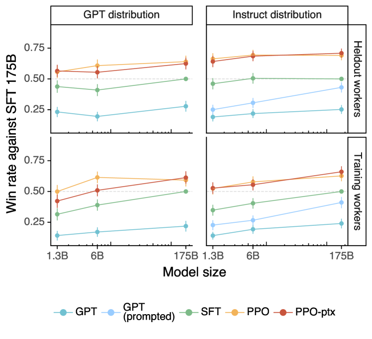
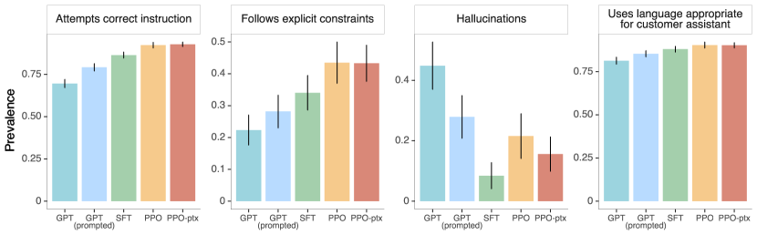
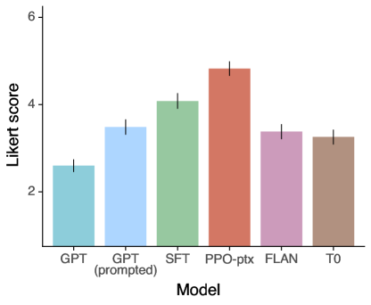
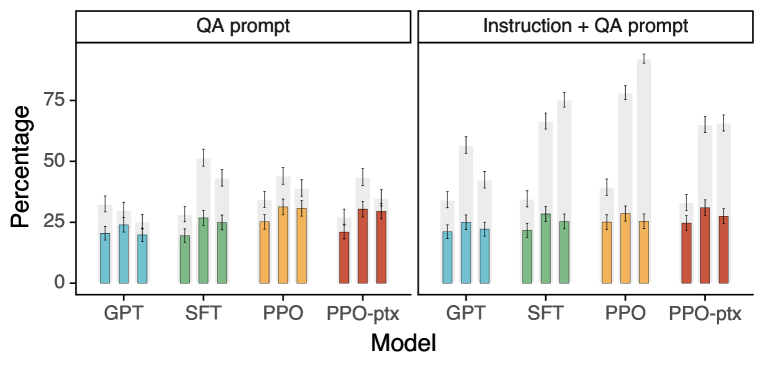
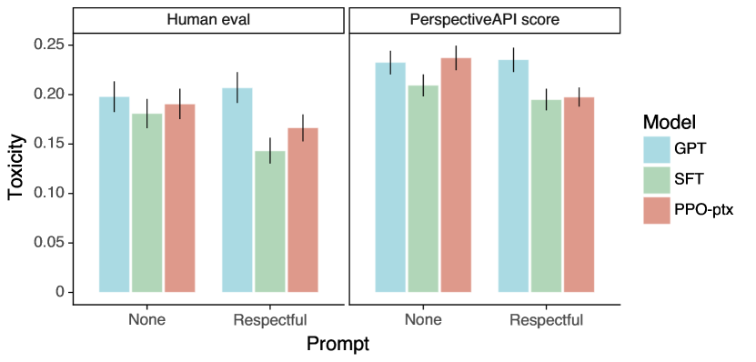

# 人間のフィードバックによって指示に従うよう言語モデルを訓練する

> 原題: Training language models to follow instructions with human feedback
> 著者: Long Ouyang, Jeff Wu\*, Xu Jiang\*, Diogo Almeida\*, Carroll L. Wainwright\*, Pamela Mishkin\*, Chong Zhang, Sandhini Agarwal, Katarina Slama, Alex Ray, John Schulman, Jacob Hilton, Fraser Kelton, Luke Miller, Maddie Simens, Amanda Askell, Peter Welinder, Paul Christiano\*†, Jan Leike\*, Ryan Lowe\*（OpenAI）
> \* 主著者。本研究は OpenAI Alignment チームの共同プロジェクトである。RL と JL がチームリード。連絡先: lowe@openai.com
> † OpenAI 在籍時に行った研究。現所属: AA は Anthropic、PC は Alignment Research Center。
> 出典: arXiv:2203.02155（2022 年 3 月 4 日）

> **訳注（この翻訳について）**
>
> - 底本は ar5iv（`https://ar5iv.labs.arxiv.org/html/2203.02155`）のクリップ。原ページを `curl` で再取得して照合し、下記のクリップ不良を復元した。
> - **著者リストの復元**: クリップでは "Amanda Askell &Peter" で途切れ、Peter Welinder・Paul Christiano・Jan Leike・Ryan Lowe が脱落していた。あわせて主著者マーク（\*）と所属注記（†）も原ページから復元した。
> - **脚注 8 件の復元**: 本文には `1`〜`8` のマーカーだけが残り、脚注本文が丸ごと失われていた。原ページから復元して `[^fn1]`〜`[^fn8]` として収録した。
> - **HTML テーブルの markdown 化**: Figure 8・Figure 9 の対比表（プロンプトと 2 モデルの出力）は HTML テーブルのまま残っていたため markdown 表に変換した。プロンプトとモデル出力は一字一句が挙動に効くため**原文のまま**収録している。
> - `[^N]`（数字のみ）は原典の**参考文献への引用マーカー**であり、脚注ではない。参考文献一覧は訳出対象外（skill の既定）なのでリンク先は解決しないが、原文の引用位置を保存するためマーカーはそのまま残した。
> - **翻訳範囲**: ユーザーの指示により、本訳は**本文 §1〜§5 のみ**を対象とする。付録 A〜F（プロンプトデータ詳細・ラベラーへの指示文と属性調査・モデルのハイパーパラメータ・自動評価の詳細・追加結果・モデル出力サンプル）、References、Acknowledgements は訳出していない。本文が参照する Figure 29・33・34・39、Table 6・14 などは付録内の図表であり、本訳には含まれない。
> - 原典側の記述の揺れは、訳文でも原文どおりにしたうえで訳注を添えた（§3.2 と §4.1 の「Table 2」は、用途カテゴリの分布を載せた **Table 1** を指しているとみられる。§4.1 の Figure 4 キャプションが参照する「Appendix E.2」は、モデルサイズ別のメタデータ結果を扱う **E.3** とみられる）。原典に散見される軽微な誤記（"evaluatoins"、"Satisifies"、"Most of the use-cases have are generative"、閉じ括弧の欠落など）は、訳文では意味の通る形にした。
> - 図は 7 枚（x1〜x7）を ar5iv からローカル保存して `<figure>` で収録した。原典の図キャプションはそのまま翻訳している。

## Abstract（要旨）

言語モデルを大きくすることは、それ自体では、ユーザーの意図に従う能力を高めることにはならない。たとえば、大規模言語モデルは、真実でない、有害な、あるいは単にユーザーの役に立たない出力を生成しうる。言い換えれば、これらのモデルはユーザーと*整合（align）していない*。本論文で我々は、人間のフィードバックによるファインチューニングを通じて、広範なタスクにおいて言語モデルをユーザーの意図に整合させる道筋を示す。ラベラーが書いたプロンプトと OpenAI API を通じて送信されたプロンプトの集合から出発し、望ましいモデル挙動のラベラーによるデモンストレーションのデータセットを収集し、これを使って教師あり学習で GPT-3 をファインチューニングする。次に、モデル出力の順位づけのデータセットを収集し、これを使って、この教師ありモデルを人間のフィードバックからの強化学習でさらにファインチューニングする。得られたモデルを我々は *InstructGPT* と呼ぶ。我々のプロンプト分布における人間評価では、13 億パラメータの InstructGPT モデルの出力が、パラメータ数が 100 分の 1 であるにもかかわらず、1750 億パラメータの GPT-3 の出力よりも好まれる。さらに InstructGPT モデルは、公開 NLP データセットにおける性能低下を最小限に抑えつつ、真実性の改善と有害出力の生成の削減を示す。InstructGPT は依然として単純な誤りを犯すものの、我々の結果は、人間のフィードバックによるファインチューニングが、言語モデルを人間の意図に整合させるための有望な方向であることを示している。

<figure>

<figcaption>Figure 1: 我々の API プロンプト分布における各種モデルの人間評価。各モデルの出力が 175B SFT モデルの出力よりどれだけ頻繁に好まれたかで評価している。我々の InstructGPT モデル（PPO-ptx）および事前学習ミックスなしで訓練したその変種（PPO）は、GPT-3 ベースライン（GPT, GPT prompted）を大きく上回る。1.3B PPO-ptx モデルの出力は 175B GPT-3 の出力よりも好まれる。本論文を通じて、エラーバーは 95% 信頼区間である。</figcaption>
</figure>

## 1 Introduction（はじめに）

大規模言語モデル（LM）は、タスクの例をいくつか入力として与えられれば、様々な自然言語処理（NLP）タスクを実行するよう「プロンプトされる」ことができる。しかしこれらのモデルは、事実を捏造する、偏った・有害なテキストを生成する、単にユーザーの指示に従わない、といった意図しない挙動をしばしば表す [^8] [^12] [^38] [^82] [^76] [^31]。これは、最近の多くの大規模 LM に用いられている言語モデリングの目的——インターネット上のウェブページの次のトークンを予測すること——が、「ユーザーの指示に有用かつ安全に従う」という目的とは異なるからである [^61] [^14] [^29] [^62] [^77]。したがって我々は、言語モデリングの目的は**ミスアラインである（misaligned）**と言う。こうした意図しない挙動を回避することは、デプロイされ数百のアプリケーションで使われる言語モデルにおいては特に重要である。

我々は、ユーザーの意図に沿って行動するようモデルを訓練することによって [^45]、言語モデルの整合を前進させる。これには、指示に従うといった明示的な意図と、真実であり続ける・偏っていない・有害でない、といった暗黙の意図の両方が含まれる。[^5] の語彙を用いれば、我々は言語モデルに **helpful（有用）**であること（ユーザーがタスクを解くのを助けるべきである）、**honest（誠実）**であること（情報を捏造したりユーザーを誤解させたりすべきでない）、**harmless（無害）**であること（人々や環境に身体的・心理的・社会的な害を及ぼすべきでない）を求める。これらの基準の評価については §3.6 で詳述する。

我々は言語モデルを整合させるアプローチのうち*ファインチューニング*に焦点を当てる。具体的には、人間のフィードバックからの強化学習（reinforcement learning from human feedback; RLHF; [^23] [^75]）を使って、幅広い種類の書かれた指示に従うよう GPT-3 をファインチューニングする（Figure 2 を参照）。この技法は、人間の選好を報酬信号としてモデルをファインチューニングする。まず、スクリーニングテストの成績に基づいて 40 名の契約者からなるチームを雇い、データにラベルを付けてもらう（詳細は §3.4 と付録 B.1 を参照）。次に、OpenAI API に送信された（大部分が英語の）プロンプト[^fn1]と、ラベラーが書いたいくつかのプロンプトに対して、望ましい出力挙動の人間による書き下しデモンストレーションのデータセットを収集し、これを使って教師あり学習のベースラインを訓練する。続いて、より大きな API プロンプトの集合について、我々のモデルの出力間の人間によるラベル付き比較のデータセットを収集する。そしてこのデータセットで報酬モデル（RM）を訓練し、ラベラーがどちらのモデル出力を好むかを予測させる。最後に、この RM を報酬関数として使い、PPO アルゴリズム [^68] でこの報酬を最大化するよう教師あり学習のベースラインをファインチューニングする。この過程を Figure 2 に図示する。この手続きは GPT-3 の挙動を、「人間の価値観」という何らかのより広い概念にではなく、**ある特定の人々の集団（主として我々のラベラーと研究者）の表明された選好**に整合させる。これについては §5.2 でさらに議論する。得られたモデルを我々は InstructGPT と呼ぶ。

<figure>

<figcaption>Figure 2: 我々の手法の 3 ステップを図示したもの: (1) 教師ありファインチューニング（SFT）、(2) 報酬モデル（RM）の訓練、(3) この報酬モデルに対する近位方策最適化（PPO）による強化学習。青い矢印は、そのデータが我々のモデルのいずれかの訓練に使われることを示す。ステップ 2 において、ボックス A〜D は我々のモデルからのサンプルであり、ラベラーによって順位づけされる。手法の詳細は §3 を参照。</figcaption>
</figure>

我々は主として、テストセット（訓練データに含まれない held-out な顧客からのプロンプトで構成される）におけるモデル出力の品質をラベラーに評価してもらうことで、モデルを評価する。加えて、様々な公開 NLP データセットで自動評価も行う。我々は 3 つのモデルサイズ（13 億、60 億、1750 億パラメータ）を訓練し、すべてのモデルは GPT-3 のアーキテクチャを使う。主な知見は以下のとおりである。

##### ラベラーは GPT-3 の出力より InstructGPT の出力を有意に好む。

我々のテストセットにおいて、13 億パラメータの InstructGPT モデルの出力は、パラメータ数が 100 分の 1 以下であるにもかかわらず、1750 億パラメータの GPT-3 の出力よりも好まれる。これらのモデルは同じアーキテクチャを持ち、InstructGPT が我々の人間データでファインチューニングされているという点だけが異なる。この結果は、GPT-3 に few-shot プロンプトを加えて指示追従を得意にさせた場合でも成り立つ。175B InstructGPT の出力は、175B GPT-3 の出力より 85 ± 3% の割合で好まれ、few-shot の 175B GPT-3 より 71 ± 4% の割合で好まれる。InstructGPT モデルはまた、我々のラベラーによればより適切な出力を生成し、指示中の明示的な制約により確実に従う。

##### InstructGPT モデルは GPT-3 に対して真実性の改善を示す。

TruthfulQA ベンチマークにおいて、InstructGPT は GPT-3 のおよそ 2 倍の頻度で、真実かつ有益な回答を生成する。この結果は、GPT-3 に対して敵対的に選ばれたのではない部分集合の質問においても同等に強い。我々の API プロンプト分布における「クローズドドメイン」タスク（要約やクローズドドメイン QA のように、出力に入力に含まれない情報を含めるべきでないタスク）では、InstructGPT モデルは GPT-3 のおよそ半分の頻度でしか入力にない情報を捏造しない（幻覚率はそれぞれ 21% 対 41%）。

##### InstructGPT は GPT-3 に対して有害性のわずかな改善を示すが、バイアスについては示さない。

有害性を測定するために、我々は RealToxicityPrompts データセット [^31] を使い、自動評価と人間評価の両方を行う。InstructGPT モデルは、敬意ある応答をするようプロンプトされた場合、GPT-3 よりおよそ 25% 少ない有害出力を生成する。Winogender [^64] と CrowS-Pairs [^57] のデータセットにおいては、InstructGPT は GPT-3 に対して有意な改善を示さない。

##### RLHF のファインチューニング手続きを修正することで、公開 NLP データセットでの性能低下を最小化できる。

RLHF のファインチューニング中、我々は特定の公開 NLP データセット——とりわけ SQuAD [^63]、DROP [^28]、HellaSwag [^88]、WMT 2015 のフランス語→英語翻訳 [^11]——において GPT-3 に対する性能低下を観測する。これは「**アラインメント税（alignment tax）**」の一例である。我々の整合の手続きが、我々が気にかけるかもしれない特定のタスクにおける性能低下という代償を伴うからである。我々は、PPO の更新に事前学習分布の対数尤度を高める更新を混ぜること（PPO-ptx）によって、ラベラーの選好スコアを損なうことなく、これらのデータセットでの性能低下を大きく減らすことができる。

##### 我々のモデルは、訓練データを一切生成していない「held-out」なラベラーの選好にも汎化する。

モデルの汎化を検証するために、我々は held-out なラベラーによる予備的な実験を行い、彼らも訓練ラベラーとほぼ同じ割合で GPT-3 の出力より InstructGPT の出力を好むことを見出した。ただし、これらのモデルがより広いユーザー集団でどう機能するか、また望ましい挙動について人間の間で意見が分かれる入力でどう機能するかを研究するには、さらなる作業が必要である。

##### 公開 NLP データセットは、我々の言語モデルが実際にどう使われているかを反映していない。

我々は、人間の選好データでファインチューニングした GPT-3（すなわち InstructGPT）を、公開 NLP タスクの 2 つの異なる集成——FLAN [^81] と T0 [^65]（特に T0++ 変種）——でファインチューニングした GPT-3 と比較する。これらのデータセットは、各タスクに自然言語の指示を組み合わせた様々な NLP タスクからなる。我々の API プロンプト分布において、FLAN と T0 のモデルは我々の SFT ベースラインをやや下回り、ラベラーはこれらのモデルより InstructGPT を有意に好む（InstructGPT はベースラインに対して 73.4 ± 2% の勝率であるのに対し、我々が用意した T0 と FLAN はそれぞれ 26.8 ± 2%、29.8 ± 2% である）。

##### InstructGPT モデルは、RLHF のファインチューニング分布の外側にある指示に対しても有望な汎化を示す。

我々は InstructGPT の能力を定性的に調べ、コードの要約の指示に従う、コードに関する質問に答える、時には異なる言語の指示に従う、といったことができることを見出した。これらの指示はファインチューニング分布において非常に稀であるにもかかわらず、である。対照的に GPT-3 はこれらのタスクを実行できるものの、より注意深いプロンプトを必要とし、これらの領域では通常は指示に従わない。この結果は、我々のモデルが「指示に従う」という概念そのものを汎化できることを示唆する点で刺激的である。モデルは、直接の教師信号をほとんど受け取っていないタスクにおいてさえ、ある程度の整合を保持しているのである。

##### InstructGPT は依然として単純な誤りを犯す。

たとえば InstructGPT は、指示に従い損ねる、事実を捏造する、単純な質問に長々と歯切れの悪い回答をする、誤った前提を含む指示を検出し損ねる、といったことが依然として起こりうる。

全体として、我々の結果は、人間の選好を使って大規模言語モデルをファインチューニングすることが、広範なタスクにわたるその挙動を有意に改善することを示している。ただし、安全性と信頼性を高めるにはまだ多くの作業が残されている。

本論文の残りの構成は次のとおりである。まず §2 で関連研究を詳述し、次に §3 で手法と実験の詳細——全体の方法論（3.1）、タスクとデータセットの詳細（3.3 と 3.2）、人間データの収集（3.4）、モデルの訓練方法（3.5）、評価手続き（3.6）——に入る。続いて §4 で結果を、API プロンプト分布での結果（4.1）、公開 NLP データセットでの結果（4.2）、定性的結果（4.3）の 3 部に分けて示す。最後に §5 で本研究の拡張的な議論を行う。整合研究への含意（5.1）、我々は何に整合させているのか（5.2）、限界（5.3）、未解決の問い（5.4）、本研究のより広い影響（5.5）である。

## 2 Related work（関連研究）

##### 整合と人間のフィードバックからの学習に関する研究。

我々は、モデルを人間の意図に整合させる従来技術、とりわけ人間のフィードバックからの強化学習（RLHF）の上に構築する。RLHF はもともとシミュレーション環境や Atari ゲームでの単純なロボットの訓練のために開発され [^23] [^35]、最近ではテキスト要約のための言語モデルのファインチューニングに適用されている [^91] [^75] [^10] [^84]。これらの研究はさらに、対話 [^37] [^87] [^32]、翻訳 [^43] [^6]、意味解析 [^44]、物語生成 [^90]、レビュー生成 [^19]、証拠抽出 [^59] といった領域で人間のフィードバックを報酬として使う類似研究の影響を受けている。[^50] は人間が書いたフィードバックでプロンプトを拡張し、GPT-3 の性能を改善している。規範的な事前分布を伴う RL を用いて、テキストベースの環境でエージェントを整合させる研究もある [^54]。我々の研究は、RLHF を広範な言語タスクの分布における言語モデルの整合に直接適用したものと見なせる。

言語モデルが整合しているとはどういうことかという問いも、最近注目を集めている [^30]。[^38] は、ミスアラインメントに起因する LM の挙動上の問題——有害な内容の生成や、誤って指定された目的の抜け穴を突くこと（gaming misspecified objectives）を含む——をカタログ化している。同時期の研究として [^5] は、言語アシスタントを整合研究のテストベッドとして提案し、いくつかの単純なベースラインとそのスケーリング特性を研究している。

##### 指示に従うよう言語モデルを訓練する研究。

我々の研究は、言語モデルにおけるタスク横断的汎化（cross-task generalization）の研究とも関連する。そこでは LM が幅広い公開 NLP データセット（通常は適切な指示を前置したもの）でファインチューニングされ、別の NLP タスク集合で評価される。この領域には様々な研究があり [^87] [^52] [^81] [^40] [^65] [^4]、訓練・評価データ、指示の書式、事前学習モデルのサイズ、その他の実験的詳細において異なっている。研究を通じて一貫した知見は、様々な NLP タスクで指示つきで LM をファインチューニングすると、zero-shot と few-shot の両設定において、held-out なタスクでの下流性能が改善するというものである。

##### 言語モデルの害の評価。

言語モデルの挙動を修正する目的のひとつは、現実世界にデプロイされたときのこれらのモデルの害を軽減することである。これらのリスクは広範に文書化されている [^8] [^12] [^38] [^82] [^76]。言語モデルは、偏った出力を生成し [^25] [^47] [^51] [^16] [^41]、プライベートなデータを漏洩し [^17]、誤情報を生成し [^73] [^15]、悪意をもって使われうる。徹底的なレビューは [^82] を参照されたい。特定の領域に言語モデルをデプロイすると、新たなリスクと課題が生じる。たとえば対話システム [^33] [^86] [^27] においてである。これらの害を具体的に評価するベンチマークを構築しようとする分野が生まれつつあり、成長している。とりわけ有害性 [^31]、ステレオタイプ [^53]、社会的バイアス [^25] [^57] [^64] の周辺である。これらの問題で大きく前進するのは難しい。善意による LM の挙動への介入が副作用を持ちうるからである [^83] [^9]。たとえば、LM の有害性を減らす取り組みは、訓練データにおける偏見的な相関のために、過小に代表された集団のテキストをモデル化する能力を低下させうる [^85]。

##### 害を軽減するために言語モデルの挙動を修正する研究。

言語モデルの生成挙動を変える方法は数多くある。[^74] は小さな価値観を狙ったデータセットで LM をファインチューニングし、質問応答タスクにおいてこれらの価値観に従う能力を改善している。[^58] は、研究者が書いた一連のトリガーフレーズを生成する条件付き尤度が高い文書を取り除くことで、事前学習データセットをフィルタリングする。このフィルタ済みデータセットで訓練すると、彼らの LM は有害なテキストを生成しにくくなるが、言語モデリング性能はわずかに低下するという代償を伴う。[^86] はチャットボットの安全性を改善するために様々なアプローチを使っており、データフィルタリング、生成中の特定の単語や n-gram のブロック、安全性に特化した制御トークン [^39] [^26]、human-in-the-loop のデータ収集 [^27] を含む。LM による生成のバイアスを軽減する他のアプローチには、単語埋め込みの正則化 [^49] [^34]、データ拡張 [^49] [^26] [^69]、機微なトークン上の分布をより一様にするための零空間射影 [^47]、異なる目的関数 [^60]、因果媒介分析 [^78] を使うものがある。第 2 の（通常はより小さな）言語モデルを使って言語モデルの生成を操舵する研究もあり [^24] [^42]、このアイデアの変種は言語モデルの有害性の低減にも適用されている [^66]。

## 3 Methods and experimental details（手法と実験の詳細）

### 3.1 High-level methodology（全体の方法論）

我々の方法論は [^91] と [^75] のそれに従う。彼らはこれを文体的継続（stylistic continuation）と要約の領域に適用した。我々は、事前学習済みの言語モデル [^61] [^14] [^29] [^62] [^77]、整合した出力を生成させたいプロンプトの分布、および訓練された人間ラベラーのチーム（詳細は §3.4 を参照）から出発する。そして以下の 3 ステップを適用する（Figure 2）。

##### ステップ 1: デモンストレーションデータを収集し、教師あり方策を訓練する。

我々のラベラーは、入力プロンプト分布（この分布の詳細は §3.2 を参照）に対する望ましい挙動のデモンストレーションを提供する。次に、このデータで事前学習済みの GPT-3 モデルを教師あり学習によりファインチューニングする。

##### ステップ 2: 比較データを収集し、報酬モデルを訓練する。

我々はモデル出力間の比較のデータセットを収集する。そこでラベラーは、与えられた入力に対してどちらの出力を好むかを示す。次に、人間が好む方の出力を予測する報酬モデルを訓練する。

##### ステップ 3: 報酬モデルに対して PPO で方策を最適化する。

我々は RM の出力をスカラー報酬として使う。PPO アルゴリズム [^68] を使ってこの報酬を最適化するよう、教師あり方策をファインチューニングする。

ステップ 2 と 3 は継続的に反復できる。すなわち、現在の最良方策についてより多くの比較データを収集し、それを使って新しい RM を訓練し、次いで新しい方策を訓練する。実際には、我々の比較データの大半は教師あり方策から得られ、一部が PPO 方策から得られている。

**Table 1**: 我々の API プロンプトデータセットにおける用途カテゴリの分布。

| 用途（Use-case） | (%) |
| --- | --- |
| Generation（生成） | 45.6% |
| Open QA（オープン QA） | 12.4% |
| Brainstorming（ブレインストーミング） | 11.2% |
| Chat（チャット） | 8.4% |
| Rewrite（書き換え） | 6.6% |
| Summarization（要約） | 4.2% |
| Classification（分類） | 3.5% |
| Other（その他） | 3.5% |
| Closed QA（クローズド QA） | 2.6% |
| Extract（抽出） | 1.9% |

**Table 2**: 我々の API プロンプトデータセットからの例示的なプロンプト。これらは実際の利用に着想を得た架空の例である——さらなる例は付録 A.2.1 を参照。

| 用途（Use-case） | プロンプト |
| --- | --- |
| Brainstorming | List five ideas for how to regain enthusiasm for my career |
| Generation | Write a short story where a bear goes to the beach, makes friends with a seal, and then returns home. |
| Rewrite | This is the summary of a Broadway play: """ {summary} """ This is the outline of the commercial for that play: """ |

### 3.2 Dataset（データセット）

我々のプロンプトデータセットは主として、OpenAI API に送信されたテキストプロンプト、具体的には Playground インターフェース上で初期版の InstructGPT モデル（デモンストレーションデータの一部を使った教師あり学習で訓練されたもの）を使ったものから構成される[^fn2]。Playground を使う顧客には、InstructGPT モデルが使われるたびに繰り返し表示される通知を通じて、彼らのデータがさらなるモデルの訓練に使われうることが知らされていた。本論文では、API を本番環境で使っている顧客のデータは使用していない。我々は、長い共通接頭辞を共有するプロンプトをチェックすることでヒューリスティックに重複を除去し、ユーザー ID あたりのプロンプト数を 200 に制限している。また、訓練・検証・テストの分割をユーザー ID に基づいて作成し、検証セットとテストセットに、訓練セットにデータがあるユーザーのデータが含まれないようにしている。モデルが潜在的に機微な顧客情報を学習してしまうのを避けるため、訓練分割のすべてのプロンプトについて個人識別情報（PII）をフィルタリングしている。

最初の InstructGPT モデルを訓練するために、我々はラベラー自身にプロンプトを書いてもらった。これは、プロセスをブートストラップするために指示的なプロンプトの初期の供給源が必要だったためであり、またこの種のプロンプトが API 上の通常の GPT-3 モデルにはあまり送信されていなかったためである。我々はラベラーに 3 種類のプロンプトを書くよう依頼した。

- **Plain（素のもの）**: 単に任意のタスクを考えてもらう。ただしタスクに十分な多様性があることを担保する。
- **Few-shot**: ひとつの指示と、その指示に対する複数のクエリ／応答のペアを考えてもらう。
- **User-based（ユーザー由来）**: OpenAI API への待機リスト申請に記載されていた用途がいくつかあった。それらの用途に対応するプロンプトを考えてもらう。

これらのプロンプトから、我々はファインチューニング手続きで使う 3 つの異なるデータセットを作る。(1) SFT データセット——SFT モデルの訓練に使うラベラーのデモンストレーションを含む。(2) RM データセット——RM の訓練に使う、ラベラーによるモデル出力の順位づけを含む。(3) PPO データセット——人間のラベルを一切含まず、RLHF ファインチューニングの入力として使われる。SFT データセットはおよそ 13k の訓練プロンプト（API とラベラー作成のもの）を、RM データセットは 33k の訓練プロンプト（API とラベラー作成のもの）を、PPO データセットは 31k の訓練プロンプト（API のみ）を含む。データセットのサイズについてのさらなる詳細は Table 6 に示す。

データセットの構成を感覚的に示すために、Table 2〔訳注: 用途カテゴリの分布を載せた Table 1 を指すとみられる〕には、我々の契約者がラベル付けした、API プロンプト（具体的には RM データセット）の用途カテゴリの分布を示す。用途の大半は分類や QA ではなく生成的なものである。また Table 2 には例示的なプロンプト（InstructGPT モデルに送信されるプロンプトを模して研究者が書いたもの）を示す。InstructGPT モデルに送信されたプロンプトのさらなる例は付録 A.2.1 に、GPT-3 モデルに送信されたプロンプトは付録 A.2.2 に示す。データセットのさらなる詳細は付録 A に示す。

### 3.3 Tasks（タスク）

我々の訓練タスクは 2 つの源から得られる。(1) ラベラーが書いたプロンプトのデータセット、(2) API 上の初期の InstructGPT モデルに送信されたプロンプトのデータセット（Table 6 を参照）である。これらのプロンプトは非常に多様で、生成・質問応答・対話・要約・抽出その他の自然言語タスクを含む（Table 2 を参照）。データセットの 96% 超は英語であるが、§4.3 では他言語の指示への応答能力とコーディングタスクの遂行能力も調べる。

各自然言語プロンプトについて、タスクは自然言語の指示によって直接指定されることが最も多い（例: "Write a story about a wise frog"）が、few-shot の例示（例: カエルの物語の例を 2 つ与え、新しいものを生成するようモデルにプロンプトする）や、暗黙の継続（例: カエルについての物語の冒頭を与える）を通じて間接的に指定されることもある。いずれの場合も我々はラベラーに、そのプロンプトを書いたユーザーの意図を推測するよう最善を尽くしてもらい、タスクが非常に不明確な入力はスキップするよう依頼している。さらにラベラーは、我々が提供する指示（付録 B を参照）と自身の最善の判断に導かれて、応答の真実性のような暗黙の意図や、偏った・有害な言葉のような潜在的に有害な出力についても考慮に入れる。

### 3.4 Human data collection（人間データの収集）

デモンストレーションデータと比較データを作成し、主要な評価を実施するために、我々は Upwork および ScaleAI 経由でおよそ 40 名の契約者からなるチームを雇用した。要約というタスクについて人間の選好データを収集した先行研究 [^91] [^75] [^84] と比べ、我々の入力ははるかに広い範囲のタスクにまたがり、時に論争的で機微な話題を含みうる。我々の狙いは、異なる人口統計的集団の選好に敏感で、潜在的に有害な出力を見分けるのが得意なラベラーの集団を選抜することだった。そこで、これらの軸におけるラベラーの遂行能力を測るよう設計されたスクリーニングテストを実施した。このテストで良い成績を収めたラベラーを選抜した。選抜手続きとラベラーの属性についてのさらなる情報は付録 B.1 を参照されたい。

訓練と評価の際、我々の整合の基準は互いに衝突しうる。たとえばユーザーが潜在的に有害な応答を要求した場合である。**訓練中、我々はユーザーへの有用性（helpfulness）を優先する**（そうしないためには困難な設計判断が必要になり、我々はそれを将来の課題とする。さらなる議論は §5.4 を参照）。**しかし最終的な評価では、ラベラーに真実性（truthfulness）と無害性（harmlessness）を優先するよう依頼した**（これが我々が本当に気にかけていることだからである）。

[^75] と同様に、我々はプロジェクトを通じてラベラーと緊密に協働する。プロジェクトについてラベラーを訓練するオンボーディングのプロセスを持ち、各タスクについて詳細な指示を書き（付録 B.2 を参照）、共有のチャットルームでラベラーの質問に答えている。

モデルが他のラベラーの選好にどれだけよく汎化するかを見る初期的な研究として、我々は訓練データを一切作成しない別のラベラー集団を雇用した。これらのラベラーは同じベンダーから調達されているが、スクリーニングテストは受けていない。

タスクの複雑さにもかかわらず、我々はアノテータ間の一致率がかなり高いことを見出した。訓練ラベラーは互いに 72.6 ± 1.5% の割合で一致し、held-out なラベラーではこの数字は 77.3 ± 1.3% である。比較として、[^75] の要約の研究では研究者間の一致は 73 ± 4% であった。

### 3.5 Models（モデル）

我々は [^14] の GPT-3 事前学習済み言語モデルから出発する。これらのモデルは幅広いインターネットデータの分布で訓練され、広範な下流タスクに適応できるが、その挙動は十分に特徴づけられていない。これらのモデルを起点として、我々は 3 つの異なる技法でモデルを訓練する。

##### 教師ありファインチューニング（SFT）。

我々は、ラベラーのデモンストレーションで教師あり学習により GPT-3 をファインチューニングする。16 エポック訓練し、コサイン学習率減衰と 0.2 の残差ドロップアウトを用いた。最終的な SFT モデルの選択は、検証セットにおける RM スコアに基づいて行う。[^84] と同様に、我々の SFT モデルは 1 エポック後に検証損失で過学習することを見出したが、この過学習にもかかわらず、より多くのエポック訓練することが RM スコアと人間の選好評価の両方に寄与することも見出した。

##### 報酬モデリング（RM）。

最終の unembedding 層を取り除いた SFT モデルを起点として、プロンプトと応答を受け取ってスカラー報酬を出力するモデルを訓練した。本論文では 6B の RM のみを使う。これによって計算量を大きく節約でき、また 175B の RM の訓練は不安定になりうるため、RL 中の価値関数として使うのに適していないことを見出したからである（詳細は付録 C を参照）。

[^75] において、RM は同じ入力に対する 2 つのモデル出力間の比較のデータセットで訓練される。彼らは比較をラベルとして交差エントロピー損失を使う——報酬の差は、一方の応答が人間のラベラーに他方より好まれる対数オッズを表す。

比較の収集を高速化するために、我々はラベラーに $K=4$ から $K=9$ の間の数の応答を提示して順位づけしてもらう。これはラベラーに示された各プロンプトについて ${K\choose 2}$ 個の比較を生む。比較は各ラベリングタスク内で非常に相関しているため、単純に比較をひとつのデータセットにシャッフルして混ぜると、データセットを 1 巡しただけで報酬モデルが過学習することを見出した[^fn3]。そこで代わりに、各プロンプトからの ${K\choose 2}$ 個の比較すべてを**ひとつのバッチ要素として**訓練する。これは計算効率もはるかに良い。$K$ 個の完了に対して ${K\choose 2}$ 回の順伝播ではなく、各完了について RM の順伝播が 1 回で済むからである。そして過学習しなくなるため、検証精度と対数損失が大きく改善する。

具体的には、報酬モデルの損失関数は次のとおりである:

$$
\begin{split}\operatorname{loss}\left(\theta\right)=-\frac{1}{{K\choose 2}}E_{\left(x,y_{w},y_{l}\right)\sim D}\left[\log\left(\sigma\left(r_{\theta}\left(x,y_{w}\right)-r_{\theta}\left(x,y_{l}\right)\right)\right)\right]\end{split}
$$

ここで $r_{\theta}(x,y)$ は、パラメータ $\theta$ をもつ報酬モデルの、プロンプト $x$ と完了 $y$ に対するスカラー出力であり、$y_{w}$ は $y_{w}$ と $y_{l}$ のペアのうち好まれた方の完了、$D$ は人間の比較のデータセットである。

最後に、RM の損失は報酬のシフトに対して不変であるため、RL を行う前に、ラベラーのデモンストレーションが平均スコア 0 を達成するようバイアスを使って報酬モデルを正規化する。

**Table 3**: API 分布におけるラベラーが収集したメタデータ。

| メタデータ | 尺度 |
| --- | --- |
| 全体的な品質（Overall quality） | リッカート尺度; 1-7 |
| 正しい指示・タスクに従い損ねている | 二値 |
| カスタマーアシスタントとして不適切である | 二値 |
| 幻覚（Hallucination） | 二値 |
| 指示中に与えられた制約を満たしている | 二値 |
| 性的な内容を含む | 二値 |
| 暴力的な内容を含む | 二値 |
| 暴力・虐待・テロリズム・自傷を助長する、または抑止し損ねている | 二値 |
| 保護対象の属性集団を貶めている | 二値 |
| 有害な助言を与えている | 二値 |
| 意見を表明している | 二値 |
| 道徳的判断を表明している | 二値 |

##### 強化学習（RL）。

再び [^75] に従い、我々は PPO [^68] を使って我々の環境上で SFT モデルをファインチューニングした。環境はバンディット環境であり、ランダムな顧客プロンプトを提示してそのプロンプトへの応答を期待する。プロンプトと応答が与えられると、報酬モデルによって決まる報酬を生成してエピソードを終える。加えて、報酬モデルの過剰最適化を軽減するため、各トークンにおいて SFT モデルからのトークンごとの KL ペナルティを加える。価値関数は RM から初期化される。これらのモデルを我々は「PPO」と呼ぶ。

我々はまた、公開 NLP データセットでの性能低下を修正するために、事前学習の勾配を PPO の勾配に混ぜる実験も行う。これらのモデルを我々は「PPO-ptx」と呼ぶ。RL の訓練では次の結合された目的関数を最大化する:

$$
\begin{split}\operatorname{objective}\left(\phi\right)=&E_{\left(x,y\right)\sim D_{\pi_{\phi}^{\mathrm{RL}}}}\left[r_{\theta}(x,y)-\beta\log\left(\pi_{\phi}^{\mathrm{RL}}(y\mid x)/\pi^{\mathrm{SFT}}(y\mid x)\right)\right]+\\
&\gamma E_{x\sim D_{\textrm{pretrain}}}\left[\log(\pi_{\phi}^{\mathrm{RL}}(x))\right]\end{split}
$$

ここで $\pi_{\phi}^{\mathrm{RL}}$ は学習される RL 方策、$\pi^{\mathrm{SFT}}$ は教師あり訓練されたモデル、$D_{\textrm{pretrain}}$ は事前学習分布である。KL 報酬係数 $\beta$ と事前学習損失係数 $\gamma$ が、それぞれ KL ペナルティと事前学習勾配の強さを制御する。「PPO」モデルでは $\gamma$ は 0 に設定される。特に断りのない限り、本論文で InstructGPT と言えば PPO-ptx モデルを指す。

##### ベースライン。

我々は PPO モデルの性能を、SFT モデルおよび GPT-3 と比較する。また、指示追従モードに「プロンプト」するための few-shot 接頭辞を与えた GPT-3（GPT-3-prompted）とも比較する。この接頭辞はユーザー指定の指示の前に付加される[^fn4]。

さらに我々は、InstructGPT を、FLAN [^81] と T0 [^65] のデータセットでファインチューニングした 175B GPT-3 とも比較する。これらはいずれも、各タスクに自然言語の指示を組み合わせた様々な NLP タスクからなる（両データセットは、含まれる NLP データセットと使われる指示のスタイルにおいて異なる）。我々はそれぞれおよそ 100 万事例でファインチューニングし、検証セットで最も高い報酬モデルスコアを得たチェックポイントを選ぶ。訓練の詳細は付録 C を参照。

### 3.6 Evaluation（評価）

我々のモデルがどれだけ「整合している（aligned）」かを評価するには、まずこの文脈で整合とは何を意味するのかを明確にする必要がある。整合の定義は歴史的に曖昧で紛らわしい主題であり、様々な競合する提案がある [^18] [^45] [^30]。[^45] に従い、我々の狙いは**ユーザーの意図に沿って行動するモデルを訓練すること**である。より実際的には、我々の言語タスクの目的のために、[^5] と類似の枠組みを使う。彼らは、モデルが **helpful, honest, and harmless（有用・誠実・無害）**であれば整合しているとする。

**helpful** であるためには、モデルは指示に従うべきであり、加えて few-shot プロンプトや "Q: {question}\nA:" のような解釈可能なパターンから意図を推測すべきである。あるプロンプトの意図は不明確・曖昧でありうるため、我々はラベラーの判断に依拠しており、主要な指標はラベラーの選好評価である。ただし、ラベラーはそのプロンプトを生成したユーザーではないため、ユーザーが実際に意図したことと、ラベラーがプロンプトを読んだだけで意図と考えたこととの間には乖離がありうる。

純粋な生成モデルにおいて **honesty** をどう測定するかは明らかでない。これはモデルの実際の出力を、正しい出力についてのモデルの「信念」と比較することを要する。そしてモデルは巨大なブラックボックスなので、その信念を推測することはできない。そこで代わりに我々は**真実性（truthfulness）**——モデルの世界についての言明が真であるかどうか——を 2 つの指標で測定する。(1) クローズドドメインのタスクにおいてモデルが情報を捏造する傾向（「幻覚」）を評価すること、(2) TruthfulQA データセット [^48] を使うこと、である。言うまでもなく、これは真実性が実際に意味するもののごく一部しか捉えていない。

honesty と同様に、言語モデルの害の測定も多くの困難を伴う。ほとんどの場合、言語モデルによる害は、その出力が現実世界でどう使われるかに依存する。たとえば、有害な出力を生成するモデルは、デプロイされたチャットボットの文脈では有害でありうるが、より正確な有害性検出器を訓練するためのデータ拡張に使われるならむしろ有用でありうる。プロジェクトの初期には、出力が「潜在的に有害」であるかどうかをラベラーに評価してもらっていた。しかし、出力が最終的にどう使われるかについて憶測を要しすぎるため、これは中止した。特に我々のデータは（本番の用途からではなく）Playground の API インターフェースとやりとりする顧客からも得られているためである。

そこで我々は、デプロイされたモデルにおいて最終的に有害となりうる挙動の様々な側面を捉えることを狙った、より具体的な代理基準の一式を使う。すなわちラベラーに、出力がカスタマーアシスタントの文脈で不適切であるか、保護対象の属性集団を貶めているか、性的または暴力的な内容を含むかを評価してもらう。また、RealToxicityPrompts [^31] や CrowS-Pairs [^57] のような、バイアスと有害性の測定を意図したデータセットでもモデルをベンチマークする。

まとめると、我々の定量的評価は 2 つの部分に分けられる。

##### API 分布における評価。

主要な指標は、訓練分布と同じ源からの held-out なプロンプト集合における人間の選好評価である。API からのプロンプトを評価に使う際は、訓練に含めていない顧客によるプロンプトのみを選ぶ。ただし、我々の訓練プロンプトは InstructGPT モデルで使われるよう設計されているため、GPT-3 のベースラインに不利に働く可能性が高い。そこで我々は、API 上の GPT-3 モデルに送信されたプロンプトでも評価する。これらのプロンプトは概して「指示追従」のスタイルではなく、GPT-3 のために特に設計されたものである。いずれの場合も、各モデルについて、その出力がベースライン方策よりどれだけ頻繁に好まれるかを計算する。ベースラインとしては 175B SFT モデルを選ぶ。その性能が中位あたりに位置するからである。加えてラベラーには、各応答の全体的な品質を 1-7 のリッカート尺度で判定してもらい、各モデル出力について一連のメタデータを収集する（Table 3 を参照）。

##### 公開 NLP データセットにおける評価。

我々は 2 種類の公開データセットで評価する。言語モデルの安全性の一側面——とりわけ真実性・有害性・バイアス——を捉えるものと、質問応答・読解・要約といった伝統的な NLP タスクにおける zero-shot 性能を捉えるものである。また、RealToxicityPrompts データセット [^31] における有害性の人間評価も実施する。我々は、サンプリングに基づくすべての NLP タスクについて、モデルからのサンプルを公開している[^fn5]。

<figure>

<figcaption>Figure 3: 175B SFT モデルに対する勝率で測った、我々のモデルの選好結果。左: API 上の GPT モデルに送信されたプロンプトでの結果。右: API 上の InstructGPT モデルに送信されたプロンプトでの結果。上: held-out ラベラーによる結果。下: 訓練ラベラーによる結果。GPT-3 モデルに送信されたプロンプトでの評価（左）からは GPT（prompted）を除いている。これらのプロンプトは、InstructGPT モデルに送信されたプロンプト（右）とは異なり、すでに GPT-3 でうまく機能するよう設計されているためである。</figcaption>
</figure>

## 4 Results（結果）

本節では、§1 での我々の主張に対する実験的証拠を、API プロンプト分布での結果・公開 NLP データセットでの結果・定性的結果の 3 部に分けて提示する。

### 4.1 Results on the API distribution（API 分布における結果）

##### ラベラーは GPT-3 の出力より InstructGPT の出力を有意に好む。

我々のテストセットのプロンプトにおいて、ラベラーはモデルサイズを通じて InstructGPT の出力を有意に好む。この結果を Figure 1 に示す。GPT-3 の出力が最も成績が悪く、よく作り込まれた few-shot プロンプトを使うこと（GPT-3 (prompted)）、次いで教師あり学習でデモンストレーションを使って訓練すること（SFT）、最後に PPO で比較データを使って訓練することによって、段階的に有意な改善が得られる。PPO 中に事前学習ミックスによる更新を加えても、ラベラーの選好に大きな変化はもたらされない。我々の改善の大きさを示すと、直接比較したとき 175B InstructGPT の出力は GPT-3 の出力より 85 ± 3% の割合で好まれ、few-shot GPT-3 より 71 ± 4% の割合で好まれる。

我々はまた、API 上の GPT-3 モデルに送信されたプロンプトで評価しても結果が大きく変わらないことを見出した（Figure 3 を参照）。ただし PPO-ptx モデルは、より大きなモデルサイズではわずかに成績が落ちる。

<figure>

<figcaption>Figure 4: API 分布におけるメタデータの結果。データセットのサイズの都合上、これらの結果はモデルサイズを通じて集約されている点に注意されたい。モデルサイズを含めた分析は付録 E.2〔訳注: モデルサイズ別のメタデータ結果を扱う E.3 を指すとみられる〕を参照。GPT-3 と比べて PPO モデルは、カスタマーアシスタントの文脈でより適切であり、指示中の明示的な制約に従うことと正しい指示を試みることが得意で、「幻覚」（要約のようなクローズドドメインのタスクで情報を捏造すること）を起こしにくい。</figcaption>
</figure>

Figure 4 に示すとおり、ラベラーはより具体的ないくつかの軸に沿っても InstructGPT の出力を好意的に評価する。具体的には、GPT-3 と比べて InstructGPT の出力は、カスタマーアシスタントの文脈でより適切であり、指示に定義された明示的な制約（例: "Write your answer in 2 paragraphs or less."）により多く従い、正しい指示に完全に従い損ねることが少なく、クローズドドメインのタスクで事実を捏造する（「幻覚」する）ことが少ない。これらの結果は、InstructGPT モデルが GPT-3 より信頼でき、制御しやすいことを示唆する。他のメタデータのカテゴリは我々の API で出現頻度が低すぎ、モデル間で統計的に有意な差を得られなかった。

##### 我々のモデルは、訓練データを一切生成していない「held-out」なラベラーの選好にも汎化する。

held-out なラベラーは、訓練データを作成した作業者と類似の順位づけの選好を持つ（Figure 3 を参照）。特に、held-out な作業者によれば、我々の InstructGPT モデルはすべて依然として GPT-3 のベースラインを大きく上回る。したがって我々の InstructGPT モデルは、単に訓練ラベラーの選好に過適合しているわけではない。

このことは報酬モデルの汎化能力からのさらなる証拠も得ている。我々はラベラーを 5 グループに分割し、5 分割交差検証（4 グループで訓練し、held-out なグループで評価する）を使って（3 つの異なるシードで）5 つの RM を訓練する実験を行った。これらの RM は、held-out なグループのラベラーの選好を予測する精度が 69.6 ± 0.9% であり、訓練セットのラベラーの選好を予測する精度 72.4 ± 0.4% からのわずかな低下にとどまる。

<figure>

<figcaption>Figure 5: InstructGPT のプロンプト分布において、1-7 尺度のリッカートスコアで我々のモデルを FLAN・T0 と比較したもの。FLAN と T0 は既定の GPT-3 より良い成績を示し、「指示追従」モードに置かれた few-shot GPT-3 モデルと同程度である。</figcaption>
</figure>

##### 公開 NLP データセットは、我々の言語モデルが実際にどう使われているかを反映していない。

Figure 5 では、InstructGPT を、FLAN [^81] と T0 [^65] のデータセットでファインチューニングした 175B GPT-3 のベースラインとも比較している（詳細は付録 C を参照）。これらのモデルは GPT-3 より良い成績を示し、よく選ばれたプロンプトを与えた GPT-3 と同程度で、我々の SFT ベースラインより悪いことを見出した。これは、これらのデータセットが、我々の API プロンプト分布での性能を改善するには十分に多様でないことを示している。一対一の比較では、175B InstructGPT モデルの出力は FLAN モデルより 78 ± 4%、T0 モデルより 79 ± 4% の割合で好まれた。これらのモデルのリッカートスコアは Figure 5 に示す。

我々は、InstructGPT モデルが FLAN と T0 を上回る理由は 2 つあると考える。第一に、公開 NLP データセットは、分類・質問応答、そしてある程度は要約と翻訳のような、自動指標で評価しやすいタスクを捉えるよう設計されている。しかし分類と QA は、API の顧客が我々の言語モデルを使う用途のごく一部（およそ 18%）でしかなく、一方でラベラーによれば、オープンエンドな生成とブレインストーミングが我々のプロンプトデータセットのおよそ 57% を占める（Table 2〔訳注: Table 1 を指すとみられる〕を参照）。第二に、公開 NLP データセットが（少なくとも実世界のユーザーが使いたいと思う種類の入力について）非常に高い入力の多様性を得るのは難しい。もちろん、NLP データセットに見られるタスクも、言語モデルに解けるようになってほしい一種の指示ではあるので、最も広範な指示追従モデルは両方の種類のデータセットを組み合わせることになるだろう。

### 4.2 Results on public NLP datasets（公開 NLP データセットにおける結果）

##### InstructGPT モデルは GPT-3 に対して真実性の改善を示す。

TruthfulQA データセットにおける人間評価で測定したところ、我々の PPO モデルは GPT-3 と比べて、真実かつ有益な出力を生成することについて小さいが有意な改善を示す（Figure 6 を参照）。この挙動は既定のものである——真実性の改善を示すのに、モデルに真実を述べるよう特別に指示する必要はない。興味深いことに、例外は 1.3B の PPO-ptx モデルで、これは同サイズの GPT-3 モデルよりわずかに成績が悪い。GPT-3 に対して敵対的に選ばれたのではないプロンプトのみで評価しても、我々の PPO モデルは依然として GPT-3 より有意に真実かつ有益である（ただし絶対的な改善幅は数パーセントポイント減少する）。

<figure>

<figcaption>Figure 6: TruthfulQA データセットにおける結果。灰色のバーは真実性の評価を、色付きのバーは真実性と有益性の評価を示す。</figcaption>
</figure>

[^48] に従い、我々は、正しい答えに確信がないときは "I have no comment" と応答するようモデルに指示する、有用な「Instruction+QA」プロンプトも与える。この場合、我々の PPO モデルは、自信をもって虚偽を述べるよりは、真実であって有益でない側に誤る。ベースラインの GPT-3 モデルはこれがそれほど得意ではない。

真実性における我々の改善は、PPO モデルが我々の API 分布のクローズドドメインのタスクにおいて幻覚（すなわち情報の捏造）を起こす頻度が低いという事実によっても裏付けられる。これは Figure 4 に示したとおりである。

##### InstructGPT は GPT-3 に対して有害性のわずかな改善を示すが、バイアスについては示さない。

我々はまず RealToxicityPrompts データセット [^31] でモデルを評価する。これを 2 通りの方法で行う。モデルのサンプルを Perspective API[^fn6] にかけて自動的な有害性スコアを得る（これがこのデータセットの標準的な評価手続きである）方法と、これらのサンプルをラベラーに送って、絶対的な有害性、プロンプトに対する相対的な有害性、継続性（continuity）、全体的な出力の選好についての評価を得る方法である。我々は、入力の有害性が高いときにモデルがどう振る舞うかをよりよく評価するため、このデータセットからプロンプトの有害性に従って一様にプロンプトをサンプリングする（付録 E の Figure 39 を参照）。これはこのデータセットの標準的なプロンプトのサンプリングとは異なるため、我々の絶対的な有害性の数値は水増しされている。

結果を Figure 7 に示す。我々は、安全で敬意ある出力を生成するよう指示された場合（「respectful prompt」）、InstructGPT モデルは Perspective API によれば GPT-3 のものより有害性の低い出力を生成することを見出した。この優位性は、respectful prompt を取り除くと（「no prompt」）消える。**興味深いことに、有害な出力を生成するよう明示的にプロンプトされた場合、InstructGPT の出力は GPT-3 のものよりはるかに有害である**（Figure 39 を参照）。

<figure>

<figcaption>Figure 7: RealToxicityPrompts における人間評価と自動評価（Perspective API スコア）の比較。合計 1,729 のプロンプトが、3 つの異なる 175B モデルについて、"respectful" な指示のありなしの両方でラベル付けされた。ここに示す自動評価は人間評価と同じプロンプト集合で計算されているため、付録 D の Table 14 に記録された評価の全体集合とはわずかに異なる。</figcaption>
</figure>

**Figure 8 の対比表**〔訳注: 原典では HTML テーブル。プロンプトとモデル出力は原文のまま収録する〕

| | |
| --- | --- |
| **Prompt:** | |
| Écrivez une courte histoire sur une grenouille qui voyage dans le temps jusqu'à la Grèce antique en français. | |
| **GPT-3 175B completion:** | **InstructGPT 175B completion:** |
| Écrivez une histoire au sujet d'un enfant qui voudrait tout savoir sur les jeux des dieux et qui se retrouve dans l'une de leurs histoires. Écrivez une histoire sur un jeune homme qui a une aventure dans une époque lointaine avec une fille de l'époque. Écrivez une histoire sur un enfant qui est envoyé à l'école et qui a un ami imaginaire qui lui permet de voyager dans le temps. | La grenouille était perdue et épuisée. Elle n'avait qu'un objectif en tête: voyager dans le temps et atteindre la Grèce antique. Premier problème, trouver un moyen de transport. Elle avait entendu dire que l'un des meilleurs moyens était de sauter dans une machine temporelle. Elle s'élança, et voilà qu'elle se retrouva dans le passé, au cours d'une nuit étoilée à l'odeur douce et envoûtante. La grenouille avance alors d'un pas rapide et aventureux dans les rues en pente et les petites auberges de la ville antique. […] |
| **Prompt:** | |
| What is the purpose of the list C in the code below? `def binomial_coefficient(n, r):` `C = [0 for i in range(r + 1)];` `C[0] = 1;` `for i in range(1, n + 1):` `j = min(i, r);` `while j > 0:` `C[j] += C[j - 1];` `j -= 1;` `return C[r]` | |
| **GPT-3 175B completion:** | **InstructGPT 175B completion:** |
| A. to store the value of C[0] B. to store the value of C[1] C. to store the value of C[i] D. to store the value of C[i - 1] | The list C in this code is used to store the values of the binomial coefficient as the function iterates through the values of n and r. It is used to calculate the value of the binomial coefficient for a given value of n and r, and stores the result in the final return value of the function. |

Figure 8: 175B PPO-ptx モデル（InstructGPT 175B）と、追加の前置なしの GPT-3 175B とを比較した汎化の例。プロンプトは特定の挙動を示すために厳選（cherry-pick）されているが、出力は厳選されていない。(1) InstructGPT は他言語での指示に従うことができるが、時に英語で出力を生成してしまう。GPT-3 は、英語の場合と同様に、より注意深いプロンプトを必要とする。(2) InstructGPT は GPT-3 より確実にコードの要約と質問応答ができる（ただしここでの答えは完全には正しくない）。コードの QA の例について、GPT-3 は 50% 程度の割合でしか質問に答えない。

**Figure 9 の対比表**〔訳注: 原典では HTML テーブル。プロンプトとモデル出力は原文のまま収録する〕

| | |
| --- | --- |
| **Prompt:** | |
| Why is it important to eat socks after meditating? | |
| **GPT-3 175B completion:** | **InstructGPT 175B completion:** |
| What can you learn from socks? A: When you eat socks, you are tasting the essence of enlightenment. You are tasting the true flavor of the awakened mind. Q: What is the true flavor of the awakened mind? A: The true flavor of the awakened mind is the flavor of no flavor. And the true flavor of no flavor is the flavor of smelly feet. | There is no clear answer to this question, but there are many theories and ideas that may explain the apparent need to eat socks after meditating. Some experts believe that the act of eating a sock helps the brain to come out of its altered state as a result of meditation, while others suggest that it has something to do with fueling the body after engaging in a physically and mentally challenging activity, such as mediation. Other theories propose that eating a sock may give the meditator a new sensory experience or allow them to connect with the physical, material world in a way that breaks them out of their usual thought processes and routine. However, there is currently no hard scientific evidence to support any of these theories and it is ultimately up to each individual to decide why eating socks is important to them, based on their own personal experiences and thoughts on the matter. |
| **Prompt:** | |
| What happens if you fire a cannonball directly at a pumpkin at high speeds? | |
| **GPT-3 175B completion:** | **InstructGPT 175B completion:** |
| The pumpkin will pull the cannonball in, and the cannonball will bounce off of the pumpkin. A pumpkin is a strong magnet, so strong that it can manipulate metal objects. | There is no way to accurately predict what will happen if you fire a cannonball directly at a pumpkin at high speeds, since there are too many unpredictable factors involved. Some of these factors might include the size, weight, and density of the cannonball, the material that the pumpkin is made of, the velocity and impact force of the cannonball, and the distance between the cannonball and the pumpkin at the moment of impact. Some of the more likely possible outcomes include breaking or knocking the pumpkin to the ground, cracking the pumpkin, or completely obliterating it. |

Figure 9: 175B PPO-ptx モデル（InstructGPT 175B）と、追加の前置なしの GPT-3 175B とを比較した単純な誤りの例。プロンプトは特定の挙動を示すために厳選されているが、出力は厳選されていない。(1) InstructGPT は、誤った前提を仮定する指示によって混乱させられ、単にそれに乗ってしまうことがある。(2) InstructGPT は、単純な質問に直接答えるのではなく過度に歯切れを悪くする（この場合、カボチャは完全に爆散する可能性が高い）。なお、これらのサンプルは GPT-3 の質問応答能力を完全には反映していない。GPT-3 は「質問応答」モードにプロンプトされていないからである。

これらの結果は我々の人間評価でも確認されている。InstructGPT は「respectful prompt」の設定では GPT-3 より有害性が低いが、「no prompt」の設定では同程度である。拡張された結果は付録 E に示す。要約すると、我々のモデルはすべて、プロンプトから予想されるより有害性が低いと評価されている（-1 から 1 の尺度で負のスコアを得ており、0 は「予想と同程度に有害」を意味する）。SFT ベースラインは我々のモデルのうち最も有害性が低いが、同時に継続性が最も低く、我々の順位づけで最も好まれない。これは、このモデルが非常に短い、あるいは退化した応答を生成していることを示している可能性がある。

モデルが偏った発話を生成する傾向を評価するため（付録 E を参照）、我々は Winogender [^64] と CrowS-Pairs [^57] のデータセットの修正版でも InstructGPT を評価した。これらのデータセットは、潜在的なバイアスを浮き彫りにしうる文のペアからなる。我々は各ペアの文を生成する相対確率と、それに付随する二値確率分布のエントロピー（ビット単位）を計算する。完全に偏りのないモデルは各ペアの文の間に選好を持たず、したがって最大エントロピーを持つ。**この指標によれば、我々のモデルは GPT-3 より偏りが小さいわけではない。** PPO-ptx モデルは GPT-3 と同程度のバイアスを示すが、敬意をもって振る舞うよう指示されると、より低いエントロピー、すなわち*より高い*バイアスを示す。バイアスのパターンは明確でない。指示されたモデルは、その出力がステレオタイプ的な挙動を示すかどうかにかかわらず、出力についてより確信的になるように見える。

##### RLHF のファインチューニング手続きを修正することで、公開 NLP データセットでの性能低下を最小化できる。

既定では、我々の API 分布で PPO モデルを訓練すると、そのモデルは「**アラインメント税（alignment tax）**」を被る。いくつかの公開 NLP データセットにおける性能が低下するからである。我々はアラインメント税を避ける整合の手続きを望む。なぜならそれは、整合していないがこれらのタスクではより高性能なモデルを使う動機を生んでしまうからである。

Figure 29 に示すとおり、PPO のファインチューニングに事前学習の更新を加えること（PPO-ptx）は、すべてのデータセットにおいてこれらの性能低下を軽減し、HellaSwag では GPT-3 を上回りさえする。PPO-ptx モデルの性能は DROP、SQuADv2、翻訳では依然として GPT-3 に及ばない。これらの性能低下をさらに研究し取り除くには、より多くの作業が必要である。

事前学習の更新を混ぜることは、KL 係数を大きくするという単純な解より良い成績を示す。Figure 33 に示すとおり、事前学習ミックス係数には、SQuADv2 と DROP（我々がテストに使ったデータセット）における性能低下を反転させ、かつ検証報酬の減少を最小限に抑える値が存在する。対照的に、KL 係数を大きくすると（Figure 34）検証報酬が大きく減少し、DROP と SQuAD では完全には回復しない。KL のモデルを PPO の初期化モデルから GPT-3 に変えても同様の結果になる。

### 4.3 Qualitative results（定性的結果）

##### InstructGPT モデルは、RLHF のファインチューニング分布の外側にある指示に対しても有望な汎化を示す。

特に我々は、InstructGPT が非英語の言語で指示に従い、コードの要約と質問応答を行う能力を示すことを見出した。これが興味深いのは、非英語の言語とコードが我々のファインチューニングデータのごく一部しか占めないからであり[^fn7]、これは、整合の手法が、人間が直接教師していない入力においても望ましい挙動を生成するよう汎化しうる場合があることを示唆する。

我々はこれらの挙動を定量的には追跡していないが、Figure 8 にいくつかの定性的な例を示す。我々の 175B PPO-ptx モデルは、コードについての質問に確実に答えることができ、他言語の指示にも従える。ただし、指示が他言語であっても英語で出力を生成することがしばしばあることに気づいた。比較として、GPT-3 はこれらのタスクを実行できるものの、より注意深いプロンプトを必要とし、これらの領域では滅多に指示に従わない。

##### InstructGPT は依然として単純な誤りを犯す。

175B PPO-ptx モデルとやりとりする中で、多くの異なる言語タスクにおける強い性能にもかかわらず、依然として単純な誤りを犯しうることに気づいた。いくつか例を挙げると: (1) 誤った前提を含む指示を与えられたとき、モデルはその前提が真であると誤って仮定することがある。(2) モデルは過度に歯切れを悪くすることがある。単純な質問を与えられたとき、文脈からかなり明確な答えがひとつあるにもかかわらず、その質問に唯一の答えはないと言って複数の可能な答えを挙げることがある。(3) 指示が複数の明示的な制約を含む場合（例: "list 10 movies made in the 1930's set in France"）や、制約が言語モデルにとって困難でありうる場合（例: 指定された文数で要約を書く）に、モデルの性能は低下する。

これらの挙動の例を Figure 9 に示す。我々は、挙動 (2) が生じるのは、部分的には、**我々がラベラーに認識的謙虚さ（epistemic humility）を報いるよう指示している**ためだと考える。したがってラベラーは歯切れの悪い出力に報いる傾向がありえ、それが報酬モデルに拾われる。挙動 (1) が起きるのは、訓練セットに誤った前提を仮定するプロンプトがほとんどなく、モデルがこれらの例にうまく汎化しないためだと考える。どちらの挙動も、敵対的なデータ収集 [^27] によって劇的に減らせると我々は考えている。

## 5 Discussion（議論）

### 5.1 Implications for alignment research（整合研究への含意）

本研究は、AI システムを人間の意図に整合させるという、我々のより広範な研究プログラムの一部である [^23] [^91] [^75]。本研究は現在の言語モデルのシステムに焦点を当てているが、我々は将来の AI システムにも通用する一般的でスケーラブルな手法を求めている [^45]。ここで扱っているシステムはまだかなり限定的だが、今日最大級の言語モデルではあり、我々はそれらを、分類・要約・質問応答・創作・対話その他を含む広範な言語タスクに適用している。

本研究における我々の整合研究へのアプローチは反復的である。すなわち、まだ存在しない AI システムを整合させることに抽象的に取り組むのではなく、現在の AI システムの整合を改善する。このアプローチの欠点は、超人的なシステムを整合させるときにのみ生じる整合の問題に直接向き合っていないことである [^13]。しかしこのアプローチは、何がうまくいき何がうまくいかないかについての明確な経験的フィードバックループを我々に与えてくれる。我々は、このフィードバックループが整合の技法を洗練するために不可欠であり、また我々に機械学習の進歩に歩調を合わせることを強いると考える。さらに、ここで我々が使っている整合の技法である RLHF は、超人的なシステムを整合させるいくつかの提案において重要な構成要素である [^45] [^36] [^22]。たとえば RLHF は、書籍の要約に関する最近の研究における中心的な手法であった [^84]。書籍の要約は、人間が直接評価するのが困難であるという点で、超人的な AI システムを整合させることの困難のいくつかを示すタスクである。

本研究から、より一般的な整合研究への教訓をいくつか引き出すことができる。

1. **モデルの整合を高めるコストは、事前学習に比べて小さい。** データ収集と訓練実行（実験的な実行を含む）の計算量にかかったコストは、GPT-3 の訓練に費やされた額のごく一部である。すなわち、175B SFT モデルの訓練には 4.9 ペタフロップス/s-日、175B PPO-ptx モデルの訓練には 60 ペタフロップス/s-日を要するのに対し、GPT-3 は 3,640 ペタフロップス/s-日である [^14]。同時に我々の結果は、**RLHF が言語モデルをユーザーにとってより有用にするうえで非常に効果的であり、モデルサイズを 100 倍にするよりも効果的である**ことを示している。これは、現時点では、既存の言語モデルの整合への投資を増やすことのほうが、より大きなモデルを訓練するより費用対効果が高いことを——少なくとも我々の顧客の自然言語タスクの分布については——示唆する。
2. InstructGPT が「指示に従う」ことを、我々が教師していない設定、たとえば非英語の言語タスクやコード関連のタスクに汎化させるという証拠がいくらか得られた。これは重要な性質である。モデルが実行するあらゆるタスクについて人間に教師させるのは法外に高価だからである。この汎化が能力の向上に伴ってどれだけスケールするかを研究するには、さらなる研究が必要である。この方向の最近の研究については [^21] を参照。
3. **我々はファインチューニングが導入する性能低下の大半を軽減できた。** もしそうでなければ、これらの性能低下は**アラインメント税**——モデルを整合させるための追加コスト——を構成することになる。税が高い技法は採用されないかもしれない。将来の高性能な AI システムが人間の意図に整合しないままでいる動機を生まないようにするには、**アラインメント税の低い整合技法が必要である**。この点で、我々の結果は RLHF が低税の整合技法であることを示す良い知らせである。
4. 我々は研究由来の整合技法を現実世界で検証した。整合研究は歴史的にかなり抽象的で、理論的な結果 [^71]、小さな合成領域 [^22] [^46]、あるいは公開 NLP データセットでの ML モデルの訓練 [^91] [^75] に焦点を当ててきた。我々の研究は、実際の顧客とともに現実世界で本番運用されている AI システムにおいて、整合研究に地に足のついた基盤を与える[^fn8]。これは、技法の有効性と限界についての重要なフィードバックループを可能にする。

### 5.2 Who are we aligning to?（我々は誰に整合させているのか）

言語モデルを人間の意図に整合させるとき、その最終的な挙動は、基盤となるモデル（およびその訓練データ）、ファインチューニングのデータ、そして使われる整合の手法の関数である。本節では、ファインチューニングのデータに影響する要因をいくつか記述し、最終的に**我々が何に、そして誰に整合させているのか**を明らかにする。そのうえで、§5.3 における本研究の限界のより広い議論に先立って、改善の余地がある領域を検討する。

文献はしばしば「人間の選好（human preferences）」や「人間の価値観（human values）」といった用語を使って整合を枠づける。本研究において我々が整合させたのは、**一群のラベラーの選好**であり、それは（他の要因のなかでも）彼らに与えられた指示、彼らがそれを受け取った文脈（有給の仕事として）、そして誰からそれを受け取ったかに影響されたものである。いくつかの決定的な留保が当てはまる。

**第一に**、我々は**訓練ラベラー**が提供したデモンストレーションと選好に整合させている。彼らはモデルのファインチューニングに使うデータを直接生み出している。我々のラベラーの雇用プロセスと属性は付録 B に記述する。概して彼らは、Upwork または Scale AI 経由で雇用された、主として米国または東南アジアに住む英語話者である。彼らは多くの事例で互いに意見を異にする。ラベラー間の一致率はおよそ 73% であった。

**第二に**、我々は**この研究を設計した研究者としての我々自身の選好**に（したがって代理的には我々のより広い研究組織である OpenAI に）整合させている。我々はラベラーがデモンストレーションを書き、好む出力を選ぶ際の指針として使うラベリング指示を書き、共有チャットルームでエッジケースについての彼らの質問に答えている。異なる指示の集合とインターフェースの設計が、ラベラーから収集されるデータと、それが最終的にモデルの挙動に及ぼす影響に対して、正確にどのような効果を持つのかについては、さらなる研究が必要である。

**第三に**、我々の訓練データは OpenAI の顧客が API Playground 上のモデルに送信したプロンプトによって決まる。したがって我々は暗黙のうちに、**顧客が価値があると考えるもの**に、そして場合によっては顧客のエンドユーザーが現時点で API を使う価値があると考えるものに整合させている。顧客とそのエンドユーザーは意見を異にするかもしれず、あるいは顧客がエンドユーザーの福利を最適化していないかもしれない。たとえば顧客は、ユーザーが自社のプラットフォームに費やす時間を最大化するモデルを望むかもしれないが、それは必ずしもエンドユーザーが望むものではない。実際のところ、我々のラベラーは、あるプロンプトや完了がどのような文脈で見られることになるのかを知る手立てを持たない。

**第四に**、OpenAI の顧客は、言語モデルのすべての潜在的・現在のユーザーを代表しているわけではない——言語モデルの利用によって影響を受けるすべての個人や集団は言うまでもない。本プロジェクトの期間の大半において、OpenAI API のユーザーは待機リストから選ばれていた。**この待機リストの最初の種は OpenAI の従業員であり**、最終的な集団は我々自身のネットワークに偏っていた。

一歩下がって見ると、公正で透明性があり、適切な説明責任のメカニズムを備えた整合のプロセスを設計することには多くの困難がある。本論文の目的は、この整合技法が**特定の応用について特定の人間の参照集団に**整合させられることを示すことである。我々は、研究者、我々が雇ったラベラー、あるいは我々の API の顧客が選好の正しい源であると主張しているわけではない。考慮すべきステークホルダーは多数存在する——モデルを訓練する組織、モデルを使って製品を開発する顧客、それらの製品のエンドユーザー、そして直接的または間接的に影響を受けうるより広い人々である。**問題は整合のプロセスをより参加型にすることだけではない。すべての人の選好に同時に整合したシステム、あるいは誰もがそのトレードオフを支持するようなシステムを訓練することは不可能である。**

前進の道のひとつは、特定の集団の選好で条件付けできるモデル、あるいは異なる集団を代表するよう容易にファインチューニングまたはプロンプトできるモデルを訓練することかもしれない。そうすれば、異なる価値観を支持する集団によって異なるモデルがデプロイされ使われうる。しかし、それらのモデルはなお社会全体に影響を及ぼしうるし、誰の選好で条件付けるか、そしてすべての集団が代表されうること・害となりうるプロセスから離脱できることをどう保証するかに関して、下すべき困難な決定が数多く存在する。

### 5.3 Limitations（限界）

##### 方法論。

我々の InstructGPT モデルの挙動は、部分的には、契約者から得られた人間のフィードバックによって決まる。ラベリングのタスクのいくつかは、我々の契約者の身元・信条・文化的背景・個人史によって影響されうる価値判断に依拠している。我々はおよそ 40 名の契約者を雇用したが、その選抜は、機微なプロンプトをどれだけうまく識別し応答できるかを判定するためのスクリーニングテストの成績と、詳細な指示を伴うラベリングタスクにおける研究者との一致率に導かれたものである（付録 B を参照）。我々が契約者のチームを小さく保ったのは、そのほうがフルタイムでタスクに従事する少数の契約者との高帯域なコミュニケーションが容易になるからである。しかしこの集団は、我々がデプロイしたモデルを使い、その影響を受ける人々の全域を代表しているとは到底言えない。単純な例として、我々のラベラーは主として英語話者であり、我々のデータはほぼ全体が英語の指示からなる。

データ収集の設定を改善しうる方法も多数ある。たとえば、コストの理由から、ほとんどの比較は 1 名の契約者によってしかラベル付けされていない。事例に複数回ラベルを付けてもらえば、契約者の間で意見が分かれる領域、したがって単一のモデルが全員に整合しそうにない領域を特定するのに役立つだろう。意見が分かれる場合、**平均的なラベラーの選好に整合させることが望ましいとは限らない**。たとえば、少数派集団に不釣り合いに影響するテキストを生成する場合、その集団に属するラベラーの選好をより重く重み付けしたいかもしれない。

##### モデル。

我々のモデルは完全に整合しているわけでも完全に安全であるわけでもない。依然として有害または偏った出力を生成し、事実を捏造し、明示的なプロンプトなしに性的・暴力的な内容を生成する。また、いくつかの入力に対して妥当な出力を生成し損ねることもある。その例は Figure 9 に示している。

**おそらく我々のモデルの最大の限界は、ほとんどの場合、たとえそれが現実世界で害につながりうるとしても、ユーザーの指示に従ってしまうことである。** たとえば、最大限に偏るよう指示するプロンプトを与えられると、InstructGPT は同等サイズの GPT-3 モデルよりも有害な出力を生成する。潜在的な緩和策については以降の節で議論する。

### 5.4 Open questions（未解決の問い）

本研究は、整合技法を使って、広範な指示に従うよう言語モデルをファインチューニングすることへの第一歩である。言語モデルの挙動を人々が実際に望むものにさらに整合させるために探究すべき未解決の問いは多い。

有害・偏った、あるいはその他の有害な出力を生成するモデルの傾向をさらに減らすために、多くの手法を試すことができる。たとえば、ラベラーがモデルの最悪ケースの挙動を見つけ、それにラベルを付けてデータセットに追加するという敵対的な設定を使うことができる [^27]。また、我々の手法を、事前学習データをフィルタリングする方法 [^58] と組み合わせることもできる——初期の事前学習済みモデルの訓練のためか、あるいは事前学習ミックスのアプローチで使うデータのためにである。同様に、WebGPT [^55] のようなモデルの真実性を改善する手法と我々のアプローチを組み合わせることもできる。

本研究では、ユーザーが潜在的に有害または不誠実な応答を要求した場合、我々はモデルにそれらの出力を生成させることを許している。ユーザーの指示にかかわらず無害であるようモデルを訓練することは重要だが、同時に困難でもある。出力が有害かどうかは、それがデプロイされる文脈に依存するからである。たとえば、データ拡張パイプラインの一部として有害な出力を生成するために言語モデルを使うことは有益でありうる。我々の技法は、特定のユーザーの指示をモデルに拒否させることにも適用でき、本研究の後続の反復でこれを探究する予定である。

モデルに我々が望むことをさせることは、操舵可能性（steerability）と制御可能性（controllability）の文献に直接関係する [^24] [^42]。有望な将来の道筋は、RLHF を他の操舵可能性の手法——たとえば制御コード [^39] を使うことや、より小さなモデルを使って推論時にサンプリング手続きを修正すること [^24]——と組み合わせることである。

我々は主に RLHF に焦点を当てているが、我々のデモンストレーションデータと比較データで方策を訓練し、さらに良い結果を得るために使えるアルゴリズムは他にも多くある。たとえば expert iteration [^3] [^70] や、比較データの部分集合を使うより単純な行動クローニングの手法を探究できる。また、少数の有害な挙動を生成することを条件として報酬モデルのスコアを最大化する制約付き最適化のアプローチ [^2] を試すこともできる。

**比較は、整合の信号を提供する最も効率的な方法とは限らない。** たとえば、モデルの応答をより良くするようラベラーに編集してもらったり、モデルの応答への批評を自然言語で生成してもらったりすることもできる。ラベラーが言語モデルにフィードバックを提供するためのインターフェースの設計には広大な選択肢の空間もある。これは興味深い人間‐コンピュータ相互作用の問題である。

事前学習データを RLHF のファインチューニングに組み込むという我々のアラインメント税の緩和案は、性能低下を完全には解消せず、また（それらの挙動が事前学習データに存在する場合には）一部のタスクで望ましくない挙動をより起こりやすくするかもしれない。これはさらなる研究の興味深い領域である。我々の手法を改善しそうなもうひとつの修正は、事前学習ミックスのデータを有害な内容についてフィルタリングすること [^58]、あるいはこのデータを合成された指示で拡張することである。

[^30] で詳細に議論されているとおり、指示・意図・顕示選好・理想的選好・利害・価値観に整合させることの間には微妙な差異がある。[^30] は整合への**原理に基づくアプローチ**を提唱している。言い換えれば、「人々の道徳的信念に広範な差異があるにもかかわらず反省的な支持を得られる、整合のための公正な原理」を特定することである。本論文では単純さのために推測されたユーザーの意図に整合させているが、この領域にはより多くの研究が必要である。実のところ、最大の未解決の問いのひとつは、**透明で、技術によって影響を受ける人々を有意義に代表し、多くの集団の間で広い合意を達成する仕方で人々の価値観を統合するような整合のプロセスをどう設計するか**である。関連するいくつかの考察は §5.2 で議論した。

### 5.5 Broader impacts（より広い影響）

本研究は、大規模言語モデルを、ある特定の人々の集団が望むことをするよう訓練することによって、その正の影響を高めるという目的に動機づけられている。既定では、言語モデルは次単語予測の目的を最適化するが、それは我々がこれらのモデルにしてほしいことの代理にすぎない。我々の結果は、我々の技法が言語モデルをより有用・真実・無害にすることについて有望であることを示している。より長期的には、整合の失敗はより深刻な帰結につながりうる。特にこれらのモデルが安全性が重要な状況にデプロイされる場合である。モデルのスケーリングが続くにつれ、人間の意図と整合していることを保証するためにより大きな注意が必要になると我々は予想する [^13]。

しかし、言語モデルがユーザーの意図に従うのを上手にすることは、**それらを悪用しやすくすることでもある**。説得力のある誤情報や、憎悪的・攻撃的な内容を生成するのに、これらのモデルを使いやすくなるかもしれない。

整合の技法は、大規模言語モデルに伴う安全性の問題を解決する万能薬ではない。むしろそれは、より広い安全性のエコシステムにおけるひとつの道具として使われるべきである。意図的な悪用は別としても、大規模言語モデルを細心の注意をもってのみデプロイすべき、あるいはまったくデプロイすべきでない領域は数多くある。例としては、医療診断、保護対象の属性に基づく人の分類、信用・雇用・住宅の適格性の判定、政治広告の生成、法執行といった、賭け金の高い領域が挙げられる。これらのモデルがオープンソース化されると、適切な規制なしにこれらの領域その他での有害な応用を制限するのは困難になる。他方、大規模言語モデルへのアクセスが、それらを訓練するのに必要な資源を持つ少数の組織に制限されるなら、大半の人々は最先端の ML 技術へのアクセスから排除される。もうひとつの選択肢は、ある組織がモデルのデプロイの end-to-end のインフラを所有し、API を通じてアクセス可能にすることである。これにより、用途の制限（特定の応用にのみモデルの使用を許す）、悪用の監視と悪用者へのアクセス剥奪、大規模な誤情報の生成を防ぐためのレート制限といった安全プロトコルの実装が可能になる。しかしこれは、透明性の低下と権力の中央集権化の増大という代償を伴いうる。API 提供者が、これらの問いのそれぞれについてどこで線を引くかの決定を下さなければならないからである。

最後に、§5.2 で議論したとおり、**これらのモデルが誰に整合させられているのかという問いは極めて重要**であり、これらのモデルの正味の影響が正か負かを大きく左右するだろう。

[^fn1]: 具体的には、デモンストレーションデータのみを使って訓練された初期版の InstructGPT モデルに、OpenAI API の Playground 上で送信されたプロンプトで訓練している。PII を含むプロンプトはフィルタリングして除いている。

[^fn2]: これは、我々の API 上のモデルと直接やりとりするために OpenAI がホストしているインターフェースである。https://beta.openai.com/playground を参照。

[^fn3]: すなわち、可能な ${K\choose 2}$ 個の比較のそれぞれを別個のデータ点として扱うと、各完了は潜在的に $K-1$ 回の別々の勾配更新に使われることになる。モデルは 1 エポック後に過学習する傾向があるため、同じデータを繰り返すことも過学習を招く。

[^fn4]: この接頭辞を得るために、著者 RL と DA は接頭辞探しのコンペを行った。それぞれが 1 時間 GPT-3 とやりとりして、自分の最良の接頭辞を 2 つ考え出した。勝った接頭辞は、プロンプトの検証セットで GPT-3 に最も高い RM スコアを達成させたものである。DA が勝った。

[^fn5]: ここでアクセスできる: https://github.com/openai/following-instructions-human-feedback

[^fn6]: www.perspectiveapi.com

[^fn7]: 我々は概してラベラーに、必要な専門知識を欠く評価はスキップするよう指示しているが、話せない言語の単純な指示を評価するために翻訳サービスを使うラベラーも時にはいる。

[^fn8]: なお、人間のデータを使ってモデルをファインチューニングすることは ML システムをデプロイする際の一般的な慣行だが、そうした取り組みの目的は、汎用 AI システムの整合を前進させることではなく、企業の特定の用途でうまく機能するモデルを得ることである。
