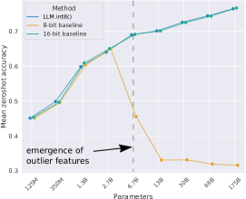
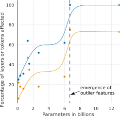
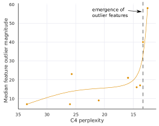
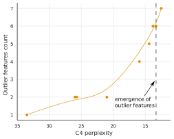

# LLM.int8(): 大規模トランスフォーマーのための 8 ビット行列積

> 原題: LLM.int8(): 8-bit Matrix Multiplication for Transformers at Scale
> 著者: Tim Dettmers, Mike Lewis, Younes Belkada, Luke Zettlemoyer
> 所属: University of Washington / Facebook AI Research† / Hugging Face§ / ENS Paris-Saclay∓（∓ は Facebook AI Research での客員研究員として研究の大半を実施）
> 出典: arXiv:2208.07339（NeurIPS 2022）・原典クリップ `raw/papers/LLM.int8()_ 8-bit Matrix Multiplication for Transformers at Scale.md`（ar5iv 版）

---

> **訳注（クリップの復元について）**
>
> 底本は ar5iv（`https://ar5iv.labs.arxiv.org/html/2208.07339`）を Obsidian Web Clipper で保存した markdown。原ページと照合し、以下を復元した。
>
> 1. **画像 6 枚のうち 2 枚が欠落**していた（クリップは 4 枚）。Figure 3 と Figure 4 はいずれも 2 パネル構成だが、**各図の (a) パネルしか残っていなかった**（`x4.png` と `x6.png` が欠落）。ar5iv から取得して収録した。とくに **Figure 3(b) と Figure 4(b) は「創発を予測するのはパラメータ数でなくパープレキシティである」という本論文の最も重要な主張を担う図**なので、欠落の影響が大きかった。
> 2. **Figure 3 と Figure 4 の本キャプションが 2 つとも消滅**していた。クリップに残っていたのは `((a))` というサブキャプションのみで、どの図に属するか判別できない状態だった。ar5iv から復元した。
> 3. HTML の表 6 つ（Table 2・3・4・7・8・10）は `<math><semantics>` のノイズを除去して markdown の表へ変換した。
>
> 以下は**原論文の側の特徴**であり、クリップの責任ではない。
>
> - **Table 2（§6）と Table 3（付録 A）は同一の表の重複**である（キャプションも内容も一致）。§7 本文が「See Table 3」と参照しているのは付録側にあたる。原文に忠実に両方を収録した。
>
> 参考文献一覧（References）・謝辞（Acknowledgments）・Checklist は既定どおり訳出していない。**付録 A〜F はすべて全訳した（圧縮箇所はない）**。本文中の引用は原典クリップの脚注番号 `[^N]` をそのまま維持している。

---

## Abstract（要旨）

大規模言語モデルは広く採用されているが、推論に大量の GPU メモリを必要とする。我々はトランスフォーマーのフィードフォワード層と attention の射影層に対する Int8 行列積の手続きを開発した。これは完全精度の性能を保ったまま、推論に必要なメモリを半分に削減する。我々の手法により、1750 億パラメータの 16/32 ビットのチェックポイントをロードし、Int8 へ変換して、性能劣化なしに直ちに使うことができる。これは、attention とトランスフォーマーの予測性能を支配する、**高度に体系的な創発的特徴**の性質を理解し、それを回避することによって可能になる。これらの特徴に対処するため、我々は 2 部からなる量子化手続き **LLM.int8()** を開発する。まず、行列積における各内積に対して別々の正規化定数を用いる **vector-wise 量子化**によって、大半の特徴を量子化する。しかし創発的な外れ値に対しては、**混合精度分解（mixed-precision decomposition）**という新しい方式も併せて用いる。これは外れ値の特徴次元を 16 ビットの行列積へ分離しつつ、なお 99.9% 超の値を 8 ビットで乗算するものである。LLM.int8() を用いることで、我々は最大 1750 億パラメータの LLM において性能劣化なしに推論を実行できることを実証的に示す。この結果により、このようなモデルに対する新しい見方が可能になり、たとえばコンシューマ向け GPU を備えた単一のサーバ上で OPT-175B/BLOOM を使うことが初めて可能になる。我々はソフトウェアをオープンソース化する。

## 1 Introduction（はじめに）

大規模な事前学習済み言語モデルは NLP で広く採用されている [^48] [^39] [^4] [^59] が、推論に大量のメモリを必要とする。67 億パラメータ以上の大規模トランスフォーマー言語モデルでは、フィードフォワード層と attention の射影層およびその行列積演算が、消費パラメータの 95%1 と全計算の 65〜85% を占める [^23]。パラメータのサイズを減らす一つの方法は、それらをより少ないビットへ量子化し、低ビット精度の行列積を使うことである。この目標のもと、トランスフォーマー向けの 8 ビット量子化手法が開発されてきた [^6] [^28] [^56] [^44]。これらの手法はメモリ使用量を減らすが、性能を劣化させ、通常は訓練後にさらに量子化の調整を要し、かつ 3.5 億パラメータ未満のモデルでしか研究されてこなかった。3.5 億パラメータまでの劣化なし量子化は十分に理解されておらず、数十億パラメータ規模の量子化は未解決の課題のままである。

> **訳注（脚注 1）**: 原典クリップに脚注本文が残っていないが、この `1` を含む文の主張は本文の記述で完結している。

本論文で我々は、**性能劣化を一切伴わない、数十億規模のトランスフォーマー向け Int8 量子化手続きとしては初のもの**を提示する。我々の手続きにより、16 または 32 ビットの重みを持つ 1750 億パラメータのトランスフォーマーをロードし、フィードフォワード層と attention の射影層を 8 ビットへ変換して、その結果得られたモデルを性能劣化なしに直ちに推論へ使うことが可能になる。我々はこの結果を、2 つの主要な課題を解くことによって達成する。10 億パラメータを超える規模で必要になる**より高い量子化精度**と、いったんすべてのトランスフォーマー層で創発すると量子化精度を台無しにする、**疎だが体系的な大きさの外れ値特徴を明示的に表現する**必要性である。この精度の損失は、これらの外れ値特徴が創発するや否や、C4 の評価パープレキシティ（Section 3）にも zeroshot 精度にも反映される。Figure 1 に示すとおりである。

<figure>

<figcaption>図1: WinoGrande・HellaSwag・PIQA・LAMBADA のデータセットにおける OPT モデルの平均 zeroshot 精度。16 ビットのベースライン、ベースラインとしての従来最も精度の高い 8 ビット量子化手法、そして我々の新しい 8 ビット量子化手法 LLM.int8() を示す。67 億パラメータの規模でひとたび体系的な外れ値が生じると、通常の量子化手法は破綻するのに対し、LLM.int8() は 16 ビットの精度を保つことが見て取れる。</figcaption>
</figure>

我々は、手法の第一部である **vector-wise 量子化**によって、27 億パラメータまでの規模で性能を保てることを示す。vector-wise 量子化では、行列積を行ベクトルと列ベクトルの独立な内積の列と見なすことができる。したがって、各内積に対して別々の量子化正規化定数を用いて量子化精度を高められる。行列積の出力は、次の演算を行う前に、列と行の正規化定数の外積で非正規化することによって復元できる。

67 億パラメータを超えて性能劣化なしにスケールするには、推論中の隠れ状態の特徴次元における**極端な外れ値の創発**を理解することが決定的に重要である。この目的のため、我々は新しい記述的分析を与える。それによれば、他の次元より最大 20 倍大きい大きさを持つ特徴が、まず全トランスフォーマー層の約 25% に現れ、その後トランスフォーマーを 60 億パラメータへスケールするにつれて徐々に他の層へ広がる。約 67 億パラメータで**相転移**が起こり、すべてのトランスフォーマー層と全系列次元の 75% が極端な大きさの特徴に影響される。これらの外れ値は高度に体系的である。67 億の規模では 1 系列あたり 150,000 個の外れ値が生じるが、それらはトランスフォーマー全体でわずか **6 個の特徴次元**に集中している。これらの外れ値の特徴次元をゼロに設定すると、top-1 softmax の確率質量が 20% 以上減少し、検証パープレキシティが 600〜1000% 劣化する——それらが全入力特徴の約 0.1% しか占めないにもかかわらずである。対照的に、同数のランダムな特徴を除去した場合、確率の減少は最大 0.3%、パープレキシティの劣化は約 0.1% である。

このような極端な外れ値のもとで効果的な量子化を支えるため、我々は手法の第二部である**混合精度分解**を開発する。外れ値の特徴次元に対しては 16 ビットの行列積を、その他 99.9% の次元に対しては 8 ビットの行列積を実行する。vector-wise 量子化と混合精度分解の組み合わせを **LLM.int8()** と名づける。LLM.int8() を用いることで、最大 1750 億パラメータの LLM において性能劣化なしに推論を実行できることを示す。我々の手法は、これらの外れ値がモデル性能に及ぼす影響について新しい洞察を与えるだけでなく、たとえば OPT-175B/BLOOM のような非常に大きなモデルを、コンシューマ向け GPU を備えた単一のサーバ上で使うことを初めて可能にする。我々の仕事は大規模言語モデルを劣化なしにアクセス可能にすることに焦点を当てているが、付録 D では BLOOM-176B のような大きなモデルについてエンドツーエンドの推論実行時性能を維持し、67 億パラメータ以上の GPT-3 モデルについては行列積の穏やかな高速化を提供することも示す。我々はソフトウェアをオープンソース化し2、Hugging Face Transformers [^52] への統合を公開する。

<figure>

<figcaption>図2: LLM.int8() の模式図。16 ビット浮動小数点の入力 Xf16 と重み Wf16 が与えられると、特徴と重みは大きな大きさの特徴の部分行列とその他の値の部分行列へ分解される。外れ値の特徴行列は 16 ビットで乗算される。それ以外のすべての値は 8 ビットで乗算される。8 ビットの vector-wise 乗算は Cx と Cw の行ごと・列ごとの絶対最大値でスケールしてから出力を Int8 へ量子化することで行う。Int32 の行列積の出力 Outi32 は、正規化定数の外積 Cx ⊗ Cw によって逆量子化される。最後に、外れ値側と通常側の出力がともに 16 ビット浮動小数点の出力へ累算される。</figcaption>
</figure>

## 2 Background（背景）

本研究では、トランスフォーマーモデルをスケールすることによって量子化技法を限界まで押し進める。我々は 2 つの問いに関心がある。**どの規模で、そしてなぜ量子化技法は破綻するのか。それは量子化精度とどう関係するのか。** これらの問いに答えるため、我々は高精度な非対称量子化（zeropoint 量子化）と対称量子化（絶対最大値量子化）を研究する。zeropoint 量子化はデータ型のビット範囲を全て使うことで高い精度を提供するが、実務上の制約からめったに使われない。絶対最大値量子化が最も一般的に使われる技法である。

### 2.1 8-bit Data Types and Quantization（8 ビットのデータ型と量子化）

**absmax 量子化**は、テンソル全体の絶対最大値で 127 を割った値 $s_{x_{f16}}$ を掛けることによって、入力を 8 ビットの範囲 $[-127,127]$ へスケールする。これは無限大ノルムで割って 127 を掛けることに等しい。したがって FP16 の入力行列 $\mathbf{X}_{f16}\in\mathbb{R}^{s\times h}$ に対する Int8 の absmax 量子化は次で与えられる:

$$
\mathbf{X}_{i8}=\Biggl{\lfloor}{\dfrac{127\cdot\mathbf{X}_{f16}}{\max\limits_{ij}(|\mathbf{X}_{f16_{ij}}|)}}\Biggr{\rceil}=\Biggl{\lfloor}{\dfrac{127}{\lVert\mathbf{X}_{f16}\rVert_{\infty}}\mathbf{X}_{f16}}\Biggr{\rceil}=\Bigl{\lfloor}{s_{x_{f16}}\mathbf{X}_{f16}}\Bigr{\rceil},
$$

ここで $\lfloor{}\rceil{}$ は最近傍の整数への丸めを表す。

**zeropoint 量子化**は、正規化された動的範囲 $nd_{x}$ でスケールしてからゼロ点 $zp_{x}$ でずらすことによって、入力の分布を全範囲 $[-127,127]$ へ移す。このアフィン変換により、任意の入力テンソルがデータ型の全ビットを使うようになり、非対称な分布に対する量子化誤差を減らす。たとえば ReLU の出力については、absmax 量子化では $[-127,0)$ のすべての値が使われないままだが、zeropoint 量子化では $[-127,127]$ の全範囲が使われる。zeropoint 量子化は次の式で与えられる:

$$
nd_{x_{f16}}=\dfrac{2\cdot 127}{\max\limits_{ij}(\mathbf{X}_{f16}^{ij})-\min\limits_{ij}(\mathbf{X}_{f16}^{ij})}
$$

$$
zp_{x_{i16}}=\bigl{\lfloor}{\mathbf{X}_{f16}\cdot\min\limits_{ij}(\mathbf{X}_{f16}^{ij})\bigr{\rceil}}
$$

$$
\mathbf{X}_{i8}=\bigl{\lfloor}{{nd_{x_{f16}}\mathbf{X}_{f16}}\bigr{\rceil}}
$$

演算において zeropoint 量子化を使うには、テンソル $\mathbf{X}_{i8}$ とゼロ点 $zp_{x_{i16}}$ の両方を特別な命令3へ渡す。この命令は 16 ビット整数演算を行う前に $\mathbf{X}_{i8}$ の各要素へ $zp_{x_{i16}}$ を加える。たとえば、zeropoint 量子化された 2 つの数 $A_{i8}$ と $B_{i8}$ を、それらのゼロ点 $zp_{a_{i16}}$ と $zp_{b_{i16}}$ とともに乗算するには、次を計算する:

$$
C_{i32}=\text{multiply}_{i16}({A}_{zp_{a_{i16}}},{B}_{zp_{b_{i16}}})=({A}_{i8}+zp_{a_{i16}})({B}_{i8}+zp_{b_{i16}})
$$

GPU や TPU のように multiplyi16 命令が利用できない場合は、展開が必要になる:

$$
C_{i32}={A}_{i8}{B}_{i8}+{A}_{i8}zp_{b_{i16}}+{B}_{i8}zp_{a_{i16}}+zp_{a_{i16}}zp_{b_{i16}},
$$

ここで $A_{i8}B_{i8}$ は Int8 精度で計算され、残りは Int16/32 精度で計算される。したがって、multiplyi16 命令が利用できない場合、zeropoint 量子化は遅くなりうる。いずれの場合も、出力は 32 ビット整数 $C_{i32}$ として累算される。$C_{i32}$ を逆量子化するには、スケーリング定数 $nd_{a_{f16}}$ と $nd_{b_{f16}}$ で割る。

#### Int8 Matrix Multiplication with 16-bit Float Inputs and Outputs.（16 ビット浮動小数点の入出力を伴う Int8 行列積）

系列次元 $s$、特徴次元 $h$、出力次元 $o$ を持つ隠れ状態 ${\mathbf{X}_{f16}\in\mathbb{R}^{s\times h}}$ と重み $\mathbf{W}_{f16}\in\mathbb{R}^{h\times o}$ が与えられたとき、我々は 16 ビットの入出力を伴う 8 ビット行列積を次のように実行する:

$$
\begin{split}\mathbf{X}_{f16}\mathbf{W}_{f16}=\mathbf{C}_{f16}&\approx\frac{1}{c_{x_{f16}}c_{w_{f16}}}\mathbf{C}_{i32}=S_{f16}\cdot\mathbf{C}_{i32}\\
&\approx S_{f16}\cdot\mathbf{A}_{i8}\mathbf{B}_{i8}=S_{f16}\cdot Q(\mathbf{A}_{f16})\phantom{.}Q(\mathbf{B}_{f16}),\end{split}
$$

ここで $Q(\cdot)$ は absmax または zeropoint 量子化のいずれかであり、$c_{x_{f16}}$ と $c_{w_{f16}}$ はそれぞれのテンソル単位のスケーリング定数——absmax では $s_{x}$ と $s_{w}$、zeropoint 量子化では $nd_{x}$ と $nd_{w}$——である。

## 3 Int8 Matrix Multiplication at Scale（大規模での Int8 行列積）

テンソルごとに単一のスケーリング定数を用いる量子化手法の主要な課題は、**たった 1 つの外れ値が他のすべての値の量子化精度を下げうる**ことである。したがって、ブロック単位の定数 [^11] のように、テンソルごとに複数のスケーリング定数を持ち、外れ値の影響を各ブロック内に閉じ込めることが望ましい。我々は、量子化をブロック化する最も一般的な方法の一つである行ごとの量子化 [^25] を、以下で詳述する **vector-wise 量子化**によって改善する。

67 億の規模を超えてすべてのトランスフォーマー層に生じる大きな大きさの外れ値特徴を扱うには、vector-wise 量子化ではもはや十分でない。この目的のため、我々は**混合精度分解**を開発する。そこでは少数の大きな大きさの特徴次元（約 0.1%）が 16 ビット精度で表現され、他の 99.9% の値が 8 ビットで乗算される。大半の要素は依然として低精度で表現されるので、16 ビットと比べて約 50% のメモリ削減を維持する。たとえば BLOOM-176B については、モデルのメモリフットプリントを 1.96 倍削減する。

vector-wise 量子化と混合精度分解を Figure 2 に示す。LLM.int8() の手法は、absmax の vector-wise 量子化と混合精度分解の組み合わせである。

### 3.1 Vector-wise Quantization（vector-wise 量子化）

行列積のスケーリング定数の数を増やす一つの方法は、行列積を独立な内積の列と見なすことである。隠れ状態 $\mathbf{X}_{f16}\in\mathbb{R}^{b\times h}$ と重み行列 $\mathbf{W}_{f16}\in\mathbb{R}^{h\times o}$ が与えられたとき、$\mathbf{X}_{f16}$ の**各行**に異なるスケーリング定数 $c_{x_{f16}}$ を、$\mathbf{W}_{f16}$ の**各列**に $c_{w}$ を割り当てられる。逆量子化するには、各内積の結果を $1/(c_{x_{f16}}c_{w_{f16}})$ で非正規化する。行列積全体としては、これは外積 $\mathbf{c}_{x_{f16}}\otimes\mathbf{c}_{w_{f16}}$ による非正規化と等価である（$\mathbf{c}_{x}\in\mathbb{R}^{s}$、$\mathbf{c}_{w}\in\mathbb{R}^{o}$）。したがって、行と列の定数を伴う行列積の完全な式は次で与えられる:

$$
\mathbf{C}_{f_{16}}\approx\frac{1}{\mathbf{c}_{x_{f16}}\otimes\mathbf{c}_{w_{f16}}}\mathbf{C}_{i32}=S\cdot\mathbf{C}_{i32}=\mathbf{S}\cdot\mathbf{A}_{i8}\mathbf{B}_{i8}=\mathbf{S}\cdot Q(\mathbf{A}_{f16})\phantom{.}Q(\mathbf{B}_{f16}),
$$

これを我々は行列積のための vector-wise 量子化と呼ぶ。

### 3.2 The Core of LLM.int8(): Mixed-precision Decomposition（LLM.int8() の中核: 混合精度分解）

我々の分析は、数十億規模の 8 ビットトランスフォーマーにとって重大な問題が、**大きな大きさの特徴（列）**を持つことにあると示す。それらはトランスフォーマーの性能にとって重要であり、高精度な量子化を必要とする。しかし我々の最良の量子化技法である vector-wise 量子化は、隠れ状態については各**行**を量子化するので、外れ値の特徴に対しては効果がない。幸いにも、これらの外れ値特徴は実際には**きわめて疎かつ体系的**であり、全特徴次元の約 0.1% しか占めない。そのため、これら特定の次元に対する高精度な乗算に焦点を当てた新しい分解技法を開発できる。

我々は、入力行列 $\mathbf{X}_{f16}\in\mathbb{R}^{s\times h}$ が与えられたとき、これらの外れ値がほとんどすべての系列次元 $s$ にわたって体系的に生じる一方、特定の特徴／隠れ次元 $h$ に限られることを見出す。そこで我々は、行列積のための混合精度分解を提案する。ここでは外れ値の特徴次元を集合 ${O=\{i|i\in\mathbb{Z},0\leq i\leq h\}}$ へ分離する。これは、閾値 $\alpha$ より大きい大きさの外れ値を少なくとも 1 つ持つ $h$ のすべての次元を含む。我々の研究では、**$\alpha=6.0$** がトランスフォーマーの性能劣化をほぼゼロまで下げるのに十分であると分かった。すべての添字を上付きとするアインシュタイン記法を用いて、重み行列 $\mathbf{W}_{f16}\in\mathbb{R}^{h\times o}$ が与えられたとき、行列積のための混合精度分解は次のように定義される:

$$
\mathbf{C}_{f16}\approx\sum\limits_{h\in O}\mathbf{X}_{f16}^{h}\mathbf{W}_{f16}^{h}+\mathbf{S}_{f16}\cdot\sum\limits_{h\not\in O}\mathbf{X}_{i8}^{h}\mathbf{W}_{i8}^{h}
$$

ここで $\mathbf{S}_{f16}$ は Int8 の入力と重み行列 $\mathbf{X}_{i8}$、$\mathbf{W}_{i8}$ に対する非正規化項である。

この 8 ビットと 16 ビットへの分離により、外れ値の高精度な乗算を可能にしつつ、99.9% 超の値についてはメモリ効率のよい 8 ビット重みの行列積を使える。130 億パラメータまでのトランスフォーマーでは外れ値の特徴次元の数が 7 を超えない（$|O|\leq 7$）ので、この分解演算が消費する追加メモリは約 0.1% にすぎない。

### 3.3 Experimental Setup（実験設定）

我々は、いくつかの公開された事前学習済み言語モデルを 1750 億パラメータまでスケールしながら、量子化手法の頑健性を測定する。**鍵となる問いは、ある量子化手法が特定のモデルでどれだけうまく機能するかではなく、スケールするにつれてその手法がどう振る舞うかという傾向である。**

我々は実験に 2 つの設定を用いる。1 つは言語モデリングのパープレキシティに基づくもので、これは量子化の劣化に対して非常に敏感な、極めてロバストな尺度であることが分かっている。この設定は異なる量子化のベースラインを比較するのに用いる。加えて、さまざまな下流タスクにおける OPT モデルの zeroshot 精度の劣化を評価し、我々の手法を 16 ビットのベースラインと比較する。

言語モデリングの設定では、fairseq [^34] で事前学習された 125M から 13B までの密な自己回帰トランスフォーマーを用いる。これらのトランスフォーマーは Books [^63]、英語 Wikipedia、CC-News [^33]、OpenWebText [^19]、CC-Stories [^47]、英語 CC100 [^51] で事前学習されている。これらの事前学習済みモデルがどう訓練されたかの詳細は [^1] を参照されたい。

Int8 量子化後の言語モデリングの劣化を評価するため、Common Crawl コーパスの部分集合である C4 コーパス [^40] の検証データにおける 8 ビットトランスフォーマーのパープレキシティを評価する。4 この評価には NVIDIA A40 GPU を用いる。

zeroshot 性能の劣化を測定するため、OPT モデル [^59] を用い、これらのモデルを EleutherAI の language model evaluation harness [^17] で評価する。

### 3.4 Main Results（主要な結果）

C4 コーパスで評価した 125M から 13B までの Int8 モデルの主要な言語モデリングのパープレキシティの結果は Table 1 に見られる。absmax、行ごと、zeropoint の量子化は、スケールするにつれて破綻し、27 億パラメータ以降のモデルはより小さなモデルより性能が悪くなることが分かる。zeropoint 量子化は代わりに 67 億パラメータを超えたところで破綻する。我々の手法 LLM.int8() は、パープレキシティを保つ唯一の手法である。したがって LLM.int8() は、好ましいスケーリングの傾向を持つ唯一の手法である。

Figure 1 の EleutherAI の language model evaluation harness における OPT モデルの zeroshot 性能のスケーリング傾向を見ると、LLM.int8() は 125M から 175B へスケールしても 16 ビットの完全な性能を保つことが分かる。他方、ベースラインである 8 ビットの absmax vector-wise 量子化は、貧弱にスケールしてランダムな性能へ退化する。

**表1**: 125M から 13B までのさまざまなトランスフォーマーのサイズに対する量子化手法の C4 検証パープレキシティ。absmax、行ごと、zeropoint、vector-wise の量子化は、スケールするにつれて著しい性能劣化を招くことが分かる。とくに 13B の地点では、8 ビットの 13B のパープレキシティが 8 ビットの 6.7B のパープレキシティより悪い。LLM.int8() を使えば、スケールしても完全なパープレキシティを回復する。zeropoint 量子化は非対称量子化ゆえの優位を示すが、混合精度分解と併用するともはや有利ではない。

| Parameters | 125M | 1.3B | 2.7B | 6.7B | 13B |
| --- | --- | --- | --- | --- | --- |
| 32-bit Float | 25.65 | 15.91 | 14.43 | 13.30 | 12.45 |
| Int8 absmax | 87.76 | 16.55 | 15.11 | 14.59 | 19.08 |
| Int8 zeropoint | 56.66 | 16.24 | 14.76 | 13.49 | 13.94 |
| Int8 absmax row-wise | 30.93 | 17.08 | 15.24 | 14.13 | 16.49 |
| Int8 absmax vector-wise | 35.84 | 16.82 | 14.98 | 14.13 | 16.48 |
| Int8 zeropoint vector-wise | 25.72 | 15.94 | 14.36 | 13.38 | 13.47 |
| Int8 absmax row-wise + decomposition | 30.76 | 16.19 | 14.65 | 13.25 | 12.46 |
| Absmax LLM.int8() (vector-wise + decomp) | 25.83 | 15.93 | 14.44 | 13.24 | 12.45 |
| Zeropoint LLM.int8() (vector-wise + decomp) | 25.69 | 15.92 | 14.43 | 13.24 | 12.45 |

我々の主眼はメモリの節約にあるが、LLM.int8() の実行時間も測定した。**量子化のオーバーヘッドは、FP16 のベースラインと比べて 67 億パラメータ未満のモデルでは推論を遅くしうる。** しかし 67 億パラメータ以下のモデルはほとんどの GPU に収まるので、実務上は量子化の必要性が低い。LLM.int8() の実行時間は、175B モデルにおけるものと同等の大きな行列積では約 2 倍速い。付録 D にこれらの実験のさらなる詳細を示す。

## 4 Emergent Large Magnitude Features in Transformers at Scale（大規模トランスフォーマーにおける創発的な大きな大きさの特徴）

トランスフォーマーをスケールするにつれて、大きな大きさを持つ外れ値特徴が創発し、すべての層とその量子化に強く影響する。隠れ状態 $\mathbf{X}\in\mathbb{R}^{s\times h}$（$s$ は系列／トークン次元、$h$ は隠れ／特徴次元）が与えられたとき、我々は特徴を特定の次元 $h_{i}$ と定義する。我々の分析は、与えられたトランスフォーマーのすべての層にわたる特定の特徴次元 $h_{i}$ を見る。

我々は、外れ値特徴が attention とトランスフォーマーの全体的な予測性能に強く影響することを見出す。13B モデルでは 2048 トークンの系列あたり最大 15 万個の外れ値が存在するが、これらの外れ値特徴は高度に体系的であり、**高々 7 個の固有の特徴次元 $h_{i}$ しか表していない**。この分析からの洞察は、混合精度分解を開発するうえで決定的に重要であった。我々の分析は、zeropoint 量子化の優位と、混合精度分解を用いるとそれが消える理由、そして小さいモデルと大きいモデルの量子化性能を説明する。

### 4.1 Finding Outlier Features（外れ値特徴を見つける）

創発現象の定量的分析の難しさは 2 つある。我々は、結果が理解可能で複雑すぎないように分析対象の特徴を小さな部分集合に絞りつつ、重要な確率的・構造的パターンを捉えたい。これらの制約を見つけるのに経験的なアプローチを用いる。我々は外れ値を次の基準に従って定義する: **特徴の大きさが少なくとも 6.0 であり、層の少なくとも 25% に影響し、系列次元の少なくとも 6% に影響すること。**

より形式的には、$L$ 層のトランスフォーマーと隠れ状態 $\mathbf{X}_{l}\in\mathbb{R}^{s\times h},l=0...L$（$s$ は系列次元、$h$ は特徴次元）が与えられたとき、我々は特徴を任意の隠れ状態 $\mathbf{X}_{l_{i}}$ における特定の次元 $h_{i}$ と定義する。我々は、大きさ $\alpha\geq 6$ の値を少なくとも 1 つ持つ次元 $h_{i},0\leq i\leq h$ を追跡し、これらの外れ値がトランスフォーマー層 $0...L$ の少なくとも 25% において同じ特徴次元 $h_{i}$ に生じ、かつすべての隠れ状態 $\mathbf{X}_{l}$ にわたって全系列次元 $s$ の少なくとも 6% に現れる場合にのみ統計を収集する。特徴の外れ値は attention の射影（key/query/value/出力）とフィードフォワードネットワークの拡張層（第一の副層）にのみ生じるので、この分析では attention 関数と FFN の収縮層（第二の副層）を無視する。

これらの閾値の理由は次のとおりである。混合精度分解を用いる場合、大きさ 6 以上の任意の特徴を外れ値特徴として扱えば、パープレキシティの劣化が止まることが分かった。外れ値に影響される層の数については、外れ値特徴は大きなモデルでは体系的である——それらはほとんどの層に生じるか、まったく生じないかのいずれかである。他方、小さなモデルでは確率的である——系列ごとに一部の層で時々生じる。したがって、外れ値特徴を検出するのに何層が影響される必要があるかの閾値は、最も小さい 125M パラメータのモデルにおいて単一の外れ値だけを検出するように設定した。この閾値は、少なくとも 25% のトランスフォーマー層が同じ特徴次元の外れ値に影響されることに対応する。2 番目に一般的な外れ値は単一の層（層の約 2%）にのみ生じており、これが妥当な閾値であることを示している。同じ手続きを使って、125M モデルにおいて外れ値特徴に影響される系列次元の数の閾値を求めた——外れ値は少なくとも 6% の系列次元に生じる。

我々は 130 億パラメータの規模までのモデルを検証する。観測された現象がソフトウェアのバグによるものでないことを確かめるため、3 つの異なるソフトウェアフレームワークで訓練されたトランスフォーマーを評価する。OpenAI のソフトウェアを使う 4 つの GPT-2 モデル、Fairseq [^34] を使う 5 つの Meta AI のモデル、Tensorflow-Mesh [^43] を使う EleutherAI の GPT-J を評価する。詳細は付録 C に示す。また 2 つの異なる推論ソフトウェアフレームワーク（Fairseq と Hugging Face Transformers [^52]）でも分析を行う。

### 4.2 Measuring the Effect of Outlier Features（外れ値特徴の効果を測定する）

外れ値特徴が attention と予測性能にとって本質的であることを実証するため、隠れ状態 $\mathbf{X}_{l}$ を attention の射影層へ与える前に外れ値特徴をゼロに設定し、外れ値がある場合の通常の softmax 確率と top-1 softmax 確率を比較する。これをすべての層について独立に行う。すなわち通常の softmax 確率の値を前方へ伝えることで誤差の連鎖を避け、外れ値特徴に起因する効果を分離する。また、外れ値の特徴次元を除去（ゼロに設定）してこの変更された隠れ状態をトランスフォーマー全体に伝播させた場合のパープレキシティの劣化も報告する。対照として、同じ手続きをランダムな非外れ値の特徴次元に対して適用し、attention とパープレキシティの劣化を記録する。

<figure>

<figcaption>図3(a): モデルサイズによる。パラメータ数（十億）に対する、大きな大きさの外れ値特徴に影響される層と全系列次元の割合。</figcaption>
</figure>

<figure>

<figcaption>図3(b): C4 パープレキシティによる。図3 全体のキャプション: (a) モデルサイズまたは (b) C4 パープレキシティによる、トランスフォーマー全体で大きな大きさの外れ値特徴に影響される層と全系列次元の割合。線は (a) と (b) についてそれぞれ 4 個と 9 個の線分による B スプライン補間である。ひとたび相転移が起こると、外れ値はすべての層と全系列次元の約 75% に存在する。(a) はパラメータサイズにおける突然の相転移を示唆する一方、(b) はパープレキシティが下がるにつれた緩やかな指数的相転移を示唆する。(a) の際立った変化は、量子化手法の性能の突然の劣化と同時に起こる。（訳注: この (b) パネルと図3 の本キャプションはクリップから脱落していたため ar5iv から復元した。）</figcaption>
</figure>

<figure>

<figcaption>図4(a): 最大の外れ値特徴の大きさの中央値。</figcaption>
</figure>

<figure>

<figcaption>図4(b): 外れ値特徴の数と C4 パープレキシティの関係。図4 全体のキャプション: (a) における最大の外れ値特徴の大きさの中央値は、外れ値のサイズの突然の変化を示している。これが、創発後に量子化手法が破綻する主な理由であるように見える。外れ値の特徴次元の数はモデルサイズにおおよそ比例するにすぎないが、(b) は分析したすべてのモデルにわたって外れ値の数がパープレキシティに関して厳密に単調であることを示している。線は 9 個の線分による B スプライン補間である。（訳注: この (b) パネルと図4 の本キャプションはクリップから脱落していたため ar5iv から復元した。）</figcaption>
</figure>

我々の主要な定量的結果は 4 つの主要な点にまとめられる。

**(1)** パラメータ数で測ると、トランスフォーマーの全層にわたる大きな大きさの特徴の創発は、Figure 3(a) に示すように **60 億から 67 億パラメータの間で突然**起こり、影響される層の割合が 65% から 100% へ増える。影響される系列次元の数も 35% から 75% へ急速に増える。この突然の変化は、量子化が破綻し始める点と同時に起こる。

**(2)** 代わりにパープレキシティで測ると、トランスフォーマーの全層にわたる大きな大きさの特徴の創発は、Figure 3(b) に見られるように、**パープレキシティが下がるにつれた指数関数に従って滑らかに現れる**ものと見なせる。これは創発について突然のことは何もないこと、そして**小さなモデルにおける指数的傾向を研究することで、相転移が起こる前に創発する特徴を検出できるかもしれない**ことを示している。またこれは、創発がモデルサイズだけの問題ではなく、使用された訓練データの量やデータ品質など複数の追加要因に関係するパープレキシティの問題であることも示唆する [^22] [^21]。

**(3)** 外れ値特徴がトランスフォーマーの全層に生じるようになると、外れ値特徴の大きさの中央値が急速に増える（Figure 4(a)）。外れ値特徴の大きな大きさと、その非対称な分布が Int8 の量子化精度を乱す。**これが 67 億の規模から量子化手法が破綻する中核的な理由である**——量子化分布の範囲が大きすぎて、大半の量子化ビンが空になり、小さな量子化値がゼロへ量子化されて、本質的に情報が消滅する。我々は、Int8 推論のほかに、通常の 16 ビット浮動小数点の訓練も 67 億の規模を超えると外れ値のせいで不安定になると仮説を立てる——大きさ 60 の値で満たされたベクトルを掛ければ、偶然に 16 ビットの最大値 65535 を超えることは容易だからである。

**(4)** 外れ値特徴の数は、Figure 4(b) に示すように、**C4 パープレキシティの減少に関して厳密に単調増加する**一方、モデルサイズとの関係は非単調である。これは、単なるモデルサイズではなく**モデルのパープレキシティが相転移を決める**ことを示している。我々は、モデルサイズは創発に到達するのに必要な多くの重要な共変量のうちの 1 つにすぎないと仮説を立てる。

これらの外れ値特徴は、相転移が起こった後は高度に体系的である。たとえば系列長 2048 の 67 億のトランスフォーマーでは、トランスフォーマー全体で 1 系列あたり約 15 万個の外れ値特徴が見つかるが、これらの特徴は**わずか 6 個の異なる隠れ次元**に集中している。

これらの外れ値はトランスフォーマーの性能にとって決定的である。外れ値を除去すると、平均 top-1 softmax 確率は約 40% から約 20% へ減り、外れ値の特徴次元が高々 7 個しかないにもかかわらず検証パープレキシティは **600〜1000%** 増える。代わりにランダムな 7 個の特徴次元を除去すると、top-1 確率の減少はわずか 0.02〜0.3% で、パープレキシティは 0.1% 増えるだけである。これはこれらの特徴次元の決定的な性質を際立たせる。**これらの外れ値特徴に対する量子化精度は最重要であり、ごく小さな誤差でもモデル性能に大きく影響する。**

### 4.3 Interpretation of Quantization Performance（量子化性能の解釈）

我々の分析は、特定の特徴次元における外れ値が大規模トランスフォーマーに遍在し、これらの特徴次元がトランスフォーマーの性能にとって決定的であることを示す。行ごとおよび vector-wise の量子化は各隠れ状態の系列次元 $s$（行）をスケールするのに対し、外れ値は特徴次元 $h$（列）に生じるので、**どちらの手法もこれらの外れ値に効果的に対処できない**。これが absmax 量子化手法が創発の直後に急速に破綻する理由である。

しかし、ほぼすべての外れ値は厳密に非対称な分布を持つ——それらは正だけか負だけかのいずれかである（付録 C を参照）。これは zeropoint 量子化をこれらの外れ値に対してとくに効果的にする。zeropoint 量子化は非対称量子化の手法であり、これらの外れ値を $[-127,127]$ の全範囲へスケールするからである。これが Table 1 の量子化スケーリングのベンチマークにおける強い性能を説明する。しかし 13B の規模では、累積した量子化誤差と外れ値の大きさの急速な成長のために、zeropoint 量子化でさえ破綻する（Figure 4(a)）。

混合精度分解を伴う完全な LLM.int8() を使うと、zeropoint 量子化の優位は消える。これは残りの分解された特徴が対称であることを示している。しかし vector-wise 量子化は依然として行ごとの量子化に対して優位を持ち、これはモデルの重みの量子化精度の向上が完全精度の予測性能を保つのに必要であることを示している。

## 5 Related work（関連研究）

量子化のデータ型とトランスフォーマーの量子化に関する密接に関連する仕事があり、以下に述べる。付録 B に畳み込みネットワークの量子化に関するさらなる関連研究を示す。

**8 ビットのデータ型。** 我々の仕事は Int8 データ型を巡る量子化技法を研究する。それが現在 GPU がサポートする唯一の 8 ビットデータ型だからである。他の一般的なデータ型は固定小数点あるいは浮動小数点の 8 ビットデータ型（FP8）である。これらのデータ型は通常、符号ビットと、指数部と小数部の異なるビットの組み合わせを持つ。たとえばこのデータ型の一般的な変種は指数部に 5 ビット、小数部に 2 ビットを持ち [^49] [^45] [^5] [^32]、スケーリング定数を使わないか zeropoint スケーリングを使う。これらのデータ型は小数部が 2 ビットしかないので大きな大きさの値に対して大きな誤差を持つが、小さな大きさの値に対しては高い精度を提供する。[^24] は、特定の標準偏差を持つ入力に対してどの固定小数点の指数部／小数部のビット幅が最適かについて優れた分析を与えている。我々は FP8 データ型が Int8 データ型と比べて優れた性能を提供すると考えるが、現在は GPU も TPU もこのデータ型をサポートしていない。

**言語モデルにおける外れ値特徴。** 言語モデルにおける大きな大きさの外れ値特徴はこれまでにも研究されてきた [^46] [^3] [^50] [^30]。先行研究は、トランスフォーマーにおける外れ値の出現と、それが層正規化およびトークン頻度分布とどう関係するかについて理論的関係を証明した [^16]。同様に [^26] は BERT モデルファミリーにおける外れ値の出現を LayerNorm に帰し、[^37] は外れ値の創発が訓練分布におけるトークンの頻度に関係することを経験的に示した。我々はこの仕事をさらに拡張し、自己回帰モデルの規模がこれらの外れ値特徴の創発的性質とどう関係するか、そして外れ値を適切にモデル化することが効果的な量子化にとっていかに決定的かを示す。

**数十億規模のトランスフォーマーの量子化。** 我々のものと並行して開発された 2 つの手法がある: nuQmm [^36] と ZeroQuant [^54] である。両者は同じ量子化方式を用いる——**group-wise 量子化**であり、これは vector-wise 量子化よりもさらに細かい量子化正規化定数の粒度を持つ。この方式はより高い量子化精度を提供するが、カスタムの CUDA カーネルも必要とする。nuQmm と ZeroQuant はともに推論を加速しメモリフットプリントを削減することを目指すのに対し、我々は 8 ビットのメモリフットプリントのもとで予測性能を保つことに焦点を当てている。nuQmm と ZeroQuant が評価する最大のモデルはそれぞれ 27 億と 200 億パラメータのトランスフォーマーである。ZeroQuant は 200 億モデルの 8 ビット量子化で劣化ゼロの性能を達成している。我々は 1760 億パラメータまでのモデルの劣化ゼロの量子化を可能にすることを示す。nuQmm と ZeroQuant はともに、より細かい量子化粒度が大きなモデルを量子化する効果的な手段になりうることを示唆している。これらの手法は LLM.int8() と相補的である。もう一つの並行研究が GLM-130B であり、我々の仕事からの洞察を用いている。

## 6 Discussion and Limitations（議論と限界）

我々は、数十億パラメータのトランスフォーマーが Int8 へ量子化され、性能劣化なしに直ちに推論へ使えることを初めて実証した。我々はこれを、大規模での創発的な大きな大きさの特徴を分析した洞察を用いて、外れ値の特徴を別の 16 ビット行列積へ分離する混合精度分解を開発することで達成した。vector-wise 量子化と併せた我々の手法 LLM.int8() が、最大 1750 億パラメータのモデルの完全な推論性能を回復できることを実証的に示す。

我々の仕事の主な限界は、**分析が Int8 データ型のみに対するものであり、8 ビット浮動小数点（FP8）のデータ型を研究していない**ことである。現在の GPU と TPU はこのデータ型をサポートしていないので、これは今後の課題とするのが最善だと考える。しかし Int8 データ型からの多くの洞察は FP8 データ型へ直接翻訳されるとも考えている。もう一つの限界は、**1750 億パラメータまでのモデルしか研究していない**ことである。我々は 175B のモデルを性能劣化なしに Int8 へ量子化するが、さらに大きな規模では追加の創発的性質が我々の量子化手法を乱すかもしれない。

第三の限界は、**attention 関数に Int8 の乗算を使っていない**ことである。我々の焦点はメモリフットプリントの削減にあり、attention 関数はパラメータを一切使わないので、厳密には必要でなかった。しかしこの問題の初期的な探究は、ここで開発したもの以外の追加の量子化手法が必要であることを示しており、これは今後の課題とする。

最後の限界は、**推論に焦点を当てており、訓練やファインチューニングを研究していない**ことである。付録 E に大規模での Int8 のファインチューニングと訓練の初期的分析を示す。大規模での Int8 訓練は、量子化精度・訓練速度・エンジニアリングの複雑さの間の複雑なトレードオフを要し、非常に難しい問題である。これも今後の課題とする。

**表2**: 異なるハードウェア構成と、16 ビットと 8 ビットのどちらでどの手法が実行できるか。我々の 8 ビット手法が、これまでアクセスできなかった多くのモデル、とくに OPT-175B/BLOOM をアクセス可能にすることが分かる。

|  |  |  | Largest Model that can be run |  |
| --- | --- | --- | --- | --- |
| Class | Hardware | GPU Memory | 8-bit | 16-bit |
| Enterprise | 8x A100 | 80 GB | OPT-175B / BLOOM | OPT-175B / BLOOM |
| Enterprise | 8x A100 | 40 GB | OPT-175B / BLOOM | OPT-66B |
| Academic server | 8x RTX 3090 | 24 GB | OPT-175B / BLOOM | OPT-66B |
| Academic desktop | 4x RTX 3090 | 24 GB | OPT-66B | OPT-30B |
| Paid Cloud | Colab Pro | 15 GB | OPT-13B | GPT-J-6B |
| Free Cloud | Colab | 12 GB | T0/T5-11B | GPT-2 1.3B |

## 7 Broader Impacts（広範な影響）

我々の仕事の主な影響は、これまで GPU メモリに収まらなかった大きなモデルへのアクセスを可能にすることである。これは限られた GPU メモリのために以前は不可能だった研究と応用を、とくに資源の最も少ない研究者にとって可能にする。性能劣化なしに今やアクセス可能になったモデル／GPU の組み合わせについては Table 3 を参照されたい。しかし我々の仕事は、多数の GPU を持つ資源の豊富な組織が同じ数の GPU でより多くのモデルを提供することも可能にし、資源の豊富な組織と乏しい組織の格差を広げるかもしれない。

とくに我々は、大規模な事前学習済みモデルの公開——たとえば最近の Open Pretrained Transformers（OPT）[^59]——が、我々の新しい Int8 推論による zero-shot / few-shot プロンプティングと相まって、資源の制約のために以前は不可能だった研究を学術機関にもたらすと考えている。このような大規模モデルの広範なアクセシビリティは、社会に対して予測の難しい有益な影響と有害な影響の両方を持つ可能性が高い。

## Appendix A Memory usage compared to 16-bit precision（付録 A: 16 ビット精度と比較したメモリ使用量）

Table 3 は、異なるハードウェア構成に対して、8 ビットと 16 ビットのそれぞれで実行できる最大のモデルを示す。8 ビットの推論により、これまで実行できなかった多くのモデル、とくに OPT-175B と BLOOM が実行可能になる。

**表3**〔訳注: 原論文では Table 2 と同一の表が付録 A にも Table 3 として置かれている。原文に忠実に両方を収録した〕: 異なるハードウェア構成と、16 ビットと 8 ビットのどちらでどの手法が実行できるか。

|  |  |  | Largest Model that can be run |  |
| --- | --- | --- | --- | --- |
| Class | Hardware | GPU Memory | 8-bit | 16-bit |
| Enterprise | 8x A100 | 80 GB | OPT-175B / BLOOM | OPT-175B / BLOOM |
| Enterprise | 8x A100 | 40 GB | OPT-175B / BLOOM | OPT-66B |
| Academic server | 8x RTX 3090 | 24 GB | OPT-175B / BLOOM | OPT-66B |
| Academic desktop | 4x RTX 3090 | 24 GB | OPT-66B | OPT-30B |
| Paid Cloud | Colab Pro | 15 GB | OPT-13B | GPT-J-6B |
| Free Cloud | Colab | 12 GB | T0/T5-11B | GPT-2 1.3B |

## Appendix B Additional Related Work（付録 B: 追加の関連研究）

#### Quantization of Transformers with fewer than 1B Parameters（10 億パラメータ未満のトランスフォーマーの量子化）

トランスフォーマーの量子化は、BERT [^12] や RoBERTa [^29] を含む 10 億パラメータ未満のマスク言語モデル（MLM）に焦点が当てられてきた。8 ビットの BERT/RoBERTa の版には Q8BERT [^56]、QBERT [^44]、量子化ノイズを用いた積量子化 [^15]、TernaryBERT [^60]、BinaryBERT [^2] がある。[^61] の仕事は量子化とプルーニングの両方を行う。これらのモデルはすべて、低精度でモデルを使用可能にするために、量子化を意識したファインチューニングか訓練後量子化のいずれかを必要とする。我々の手法と対照的に、**モデルは性能劣化なしに直接使える**。

行列積を 1x1 の畳み込みと見なせば、vector-wise 量子化は畳み込みのチャネルごとの量子化と行の量子化 [^25] を組み合わせたものと等価である。行列積については、これは BERT サイズのトランスフォーマー（3.5 億パラメータ）に対して [^53] によって用いられたが、**我々は自己回帰的で大規模なモデルに対して vector-wise 量子化を研究した最初の仕事である**。BERT 以外のトランスフォーマーを量子化する、我々が知る唯一の他の仕事は [^6] であり、順伝播で zeropoint 量子化を、逆伝播で zeropoint-row-wise 量子化を用いる訓練後量子化を使っている。しかしこの仕事も 10 億パラメータ未満のトランスフォーマー向けである。我々は評価において zeropoint と行ごとの量子化の両方と比較しており、訓練後量子化を必要としない。

#### Low-bitwidth and Convolutional Network Quantization（低ビット幅と畳み込みネットワークの量子化）

8 ビット未満のデータ型を使う仕事は通常、モデルの劣化を最小化しながらモバイル機器向けにメモリフットプリントを減らし推論速度を上げるための畳み込みネットワーク（CNN）向けである。異なるビット幅の手法が研究されてきた: 1 ビットの手法 [^8] [^41] [^9]、2〜3 ビット [^62] [^7]、4 ビット [^27]、それ以上のビット数 [^10]、あるいは可変のビット数 [^20]。さらなる関連研究については [^38] のサーベイを参照されたい。我々は、ある程度の性能劣化を伴えば数十億規模のトランスフォーマーでも 8 ビット未満の幅が可能だと考えるが、**性能を劣化させず、かつ Int8 テンソルコアによって推論を加速する一般的な GPU の恩恵を受けられる 8 ビットのトランスフォーマー**に焦点を当てている。

畳み込みネットワークの量子化に焦点を当てるもう一つの系統は、量子化誤差を改善するために量子化手続きへの調整を学習することである。たとえばヘッセ行列の情報を使うもの [^13]、ステップサイズの量子化 [^14]、ソフト量子化 [^20]、線形計画最適化による混合精度 [^55]、その他の学習された量子化手法 [^58] [^18] がある。

## Appendix C Detailed Outlier Feature Data（付録 C: 外れ値特徴の詳細データ）

Table 4 は我々の外れ値特徴の分析からの表形式のデータを提供する。各トランスフォーマーにおける最も一般的な外れ値の四分位と、片側の外れ値——すなわちゼロをまたがない非対称な分布を持つもの——の数を示す。

**表4**: 全層の少なくとも 25% と全系列次元の少なくとも 6% に生じる、大きさが少なくとも 6 の外れ値の要約統計。C4 検証パープレキシティが低いほど外れ値が多く存在することが分かる。外れ値は通常片側であり、最大範囲を伴うその四分位は、**外れ値の大きさが他の特徴次元の最大の大きさ（通常は範囲 [-3.5, 3.5]）より 3〜20 倍大きい**ことを示す。規模が増すにつれ、外れ値はトランスフォーマーの全層でますます一般的になり、ほとんどすべての系列次元に生じる。**67 億パラメータで相転移が起こり**、同じ外れ値が全系列次元の約 75%（SDim）について同じ特徴次元の全層に生じる。全特徴の約 0.1% しか占めないにもかかわらず、外れ値は大きな softmax 確率にとって本質的である。

|  |  |  | Outliers |  | Frequency |  |  | Top-1 softmax p |  |
| --- | --- | --- | --- | --- | --- | --- | --- | --- | --- |
| Model | PPL ↓ | Params | Count | 1-sided | Layers | SDims | Quartiles | w/ Outlier | No Outlier |
| GPT2 | 33.5 | 117M | 1 | 1 | 25% | 6% | (-8, -7, -6) | 45% | 19% |
| GPT2 | 26.0 | 345M | 2 | 1 | 29% | 18% | (6, 7, 8) | 45% | 19% |
| FSEQ | 25.7 | 125M | 2 | 2 | 25% | 22% | (-40, -23, -11) | 32% | 24% |
| GPT2 | 22.6 | 762M | 2 | 0 | 31% | 16% | (-9, -6, 9) | 41% | 18% |
| GPT2 | 21.0 | 1.5B | 2 | 1 | 41% | 35% | (-11, -9, -7) | 41% | 25% |
| FSEQ | 15.9 | 1.3B | 4 | 3 | 64% | 47% | (-33, -21, -11) | 39% | 15% |
| FSEQ | 14.4 | 2.7B | 5 | 5 | 52% | 18% | (-25, -16, -9) | 45% | 13% |
| GPT-J | 13.8 | 6.0B | 6 | 6 | 62% | 28% | (-21, -17, -14) | 55% | 10% |
| FSEQ | 13.3 | 6.7B | 6 | 6 | 100% | 75% | (-44, -40, -35) | 35% | 13% |
| FSEQ | 12.5 | 13B | 7 | 6 | 100% | 73% | (-63, -58, -45) | 37% | 16% |

## Appendix D Inference Speedups and Slowdowns（付録 D: 推論の高速化と低速化）

### D.1 Matrix Multiplication benchmarks（行列積のベンチマーク）

我々の仕事はモデルをアクセス可能にするためのメモリ効率に焦点を当てているが、Int8 の手法は推論を加速するのにもしばしば使われる。我々は**量子化と分解のオーバーヘッドが大きい**こと、そして Int8 の行列積それ自体は GPU 全体が十分に飽和している場合にのみ利点をもたらすことを見出す。それが真になるのは大きな行列積の場合だけであり、これはモデル次元 4096 以上の LLM でのみ起こる。

生の行列積と量子化のオーバーヘッドの詳細なベンチマークは Table 5 に見られる。cuBLASLt における生の Int8 行列積は、モデルサイズ 5140（隠れ次元 20560）で cuBLAS の 2 倍速くなり始めることが分かる。入力の量子化と出力の逆量子化が必要な場合——トランスフォーマー全体を Int8 で行うのでなければ厳密に必要である——16 ビットと比べた高速化はモデルサイズ 5140 で 1.6 倍まで減る。**モデルサイズ 2560 以下のモデルは遅くなる。** 混合精度分解を加えると推論はさらに遅くなり、13B と 175B のモデルだけが高速化を得る。

これらの数値は、混合精度分解のために最適化された CUDA カーネルを用いれば大幅に改善されうる。しかし我々は、既存のカスタム CUDA カーネルが、量子化のために既定の PyTorch と NVIDIA 提供のカーネルを使う場合よりもはるかに速いことも見て取る。後者は 175B モデルを除くすべての行列積を遅くする。

**表5**: 異なるサイズの GPT-3 トランスフォーマーのフィードフォワードの第一隠れ層に対する、16 ビット行列積と比較した推論の高速化。隠れ次元はモデル次元の 4 倍である。「オーバーヘッドなしの 8 ビット」の高速化は、量子化も逆量子化も行われないと仮定している。**1.0x より小さい数値は低速化を表す。** Int8 の行列積は、大きなモデル次元と隠れ次元を持つモデルについてのみ推論を高速化する。

| GPT-3 Size | Small | Medium | Large | XL | 2.7B | 6.7B | 13B | 175B |
| --- | --- | --- | --- | --- | --- | --- | --- | --- |
| Model dimension | 768 | 1024 | 1536 | 2048 | 2560 | 4096 | 5140 | 12288 |
| FP16-bit baseline | 1.00x | 1.00x | 1.00x | 1.00x | 1.00x | 1.00x | 1.00x | 1.00x |
| Int8 without overhead | 0.99x | 1.08x | 1.43x | 1.61x | 1.63x | 1.67x | 2.13x | 2.29x |
| Absmax PyTorch+NVIDIA | 0.25x | 0.24x | 0.36x | 0.45x | 0.53x | 0.70x | 0.96x | 1.50x |
| Vector-wise PyTorch+NVIDIA | 0.21x | 0.22x | 0.33x | 0.41x | 0.50x | 0.65x | 0.91x | 1.50x |
| Vector-wise | 0.43x | 0.49x | 0.74x | 0.91x | 0.94x | 1.18x | 1.59x | 2.00x |
| LLM.int8() (vector-wise+decomp) | 0.14x | 0.20x | 0.36x | 0.51x | 0.64x | 0.86x | 1.22x | 1.81x |

### D.2 End-to-end benchmarks（エンドツーエンドのベンチマーク）

行列積のベンチマークのほかに、Hugging Face における BLOOM-176B のエンドツーエンドの推論速度も検証する。Hugging Face は attention 値をキャッシュする最適化された実装を用いる。この種の推論は分散的であり、したがって通信に依存するので、全体の推論実行時間の大部分が固定の通信オーバーヘッドである以上、Int8 推論による全体的な高速化・低速化は小さくなると予想される。

我々は 16 ビットと比較し、Int8 推論の場合はより大きなバッチサイズやより少ない GPU を使う設定も試す。より大きなモデルをより少ないデバイスに収められるからである。ベンチマークの結果は Table 6 に見られる。全体として **Int8 の推論はわずかに遅いが、16 ビット推論と比べてトークンあたりのミリ秒レイテンシに近い**。

**表6**: BLOOM-176B モデルのいくつかの種類の推論を実行するのに用いた GPU 数についてのアブレーション研究。量子化した BLOOM-176B モデルとネイティブの BLOOM-176B モデルが使う GPU 数を比較する。異なるバッチサイズについてトークンあたりの生成速度（ミリ秒）も報告する。マルチ GPU 推論の処理には、HuggingFace の accelerate ライブラリを基盤とする transformers [^52] へ統合した我々の手法を用いる。我々の手法は、**ネイティブのモデルより少ない GPU に収まりながら、同等の性能に達する**。

| Batch Size | Hardware | 1 | 8 | 32 |
| --- | --- | --- | --- | --- |
| bfloat16 baseline | 8xA100 80GB | 239 | 32 | 9.94 |
| LLM.int8() | 8xA100 80GB | 253 | 34 | 10.44 |
| LLM.int8() | 4xA100 80GB | 246 | 33 | 9.40 |
| LLM.int8() | 3xA100 80GB | 247 | 33 | 9.11 |

## Appendix E Training Results（付録 E: 訓練の結果）

我々はさまざまな訓練設定で Int8 の訓練を検証し、32 ビットのベースラインと比較する。8 ビットのフィードフォワードネットワークで、attention 層の 8 ビットの線形射影を伴う場合と伴わない場合、さらに attention 自体を 8 ビットにする場合について別々の設定を検証し、32 ビットの性能と比較する。2 つのタスクを検証する: (1) Books [^63]、CC-News [^33]、OpenWebText [^19]、CC-Stories [^47] を含む RoBERTa コーパスの一部における言語モデリング、(2) WMT14+WMT16 [^31] [^42] におけるニューラル機械翻訳（NMT）[^35]。

結果は Table 7 と Table 8 に示す。訓練については、**attention の線形射影を Int8 データ型と vector-wise 量子化で行うと、NMT と 1.1B の言語モデルでは劣化を招くが、209M の言語モデリングでは招かない**ことが分かる。混合精度分解を使えば結果はわずかに改善するが、ほとんどの場合、完全な性能を回復するには十分でない。これは、**8 ビットの FFN 層での訓練は素直だが、他の層は大規模で性能劣化なしに 8 ビット訓練を行うために追加の技法か Int8 とは異なるデータ型を要する**ことを示唆する。

**表7**: 小規模および大規模の言語モデリングにおける初期的な結果。**attention を 8 ビットで行うと性能が著しく劣化し、混合精度分解でも完全には回復できない。** 小規模の言語モデルは 8 ビットの FFN と attention 層の 8 ビット線形射影の両方でベースラインに近い性能だが、大規模では性能が劣化する。

|  | Is 8-bit |  |  |  |  |
| --- | --- | --- | --- | --- | --- |
| Params | FFN | Linear | Attention | Decomp | PPL |
| 209M |  |  |  | 0% | 16.74 |
| 209M | ✓ |  |  | 0% | 16.77 |
| 209M | ✓ | ✓. |  | 0% | 16.83 |
| 209M | ✓ | ✓ |  | 2% | 16.78 |
| 209M | ✓ | ✓ |  | 5% | 16.77 |
| 209M | ✓ | ✓ |  | 10% | 16.80 |
| 209M | ✓ | ✓ | ✓ | 2% | 24.33 |
| 209M | ✓ | ✓ | ✓ | 5% | 20.00 |
| 209M | ✓ | ✓ | ✓ | 10% | 19.00 |
| 1.1B |  |  |  | 0% | 9.99 |
| 1.1B | ✓ |  |  | 0% | 9.93 |
| 1.1B | ✓ | ✓ |  | 0% | 10.52 |
| 1.1B | ✓ | ✓ |  | 1% | 10.41 |

**表8**: WMT14+16 に対する 8 ビットの FFN と線形 attention 層のニューラル機械翻訳の結果。Decomp は 8 ビットでなく 16 ビットで計算される割合を示す。BLEU スコアは 3 つの乱数種の中央値である。

| Is 8-bit |  |  |  |
| --- | --- | --- | --- |
| FFN | Linear | Decomp | BLEU |
|  |  | 0% | 28.9 |
| ✓ |  | 0% | 28.8 |
| ✓ | ✓ | 0% | unstable |
| ✓ | ✓ | 2% | 28.0 |
| ✓ | ✓ | 5% | 27.6 |
| ✓ | ✓ | 10% | 27.5 |

## Appendix F Fine-tuning Results（付録 F: ファインチューニングの結果）

我々は GLUE でファインチューニングした RoBERTa-large についても 8 ビットのファインチューニングを検証する。2 つの異なる設定で実行する: (1) 他の Int8 手法との比較、(2) 8 ビットの FFN 層および 8 ビットの attention 射影層でのファインチューニングの劣化を 32 ビットと比較する。5 つの乱数種でファインチューニングし、中央値の性能を報告する。

Table 9 はファインチューニングのための従来の 8 ビット手法との比較であり、**vector-wise 量子化が他の手法を改善する**ことを示す。Table 10 は FFN および／または線形 attention 射影を 8 ビットにした場合の性能と、混合精度分解を用いた場合の改善を示す。我々は、**8 ビットの FFN 層は劣化を招かないが、8 ビットの attention 線形射影は、少なくとも大きさ上位 2% の次元を 8 ビットでなく 16 ビットで計算する混合精度分解と組み合わせなければ劣化を招く**ことを見出す。これらの結果は、性能を劣化させたくないのであれば、**ファインチューニングにおいて混合精度分解が決定的な役割を果たす**ことを際立たせる。

**表9**: フィードフォワード層を 8 ビットにし残りを 16 ビットにした量子化手法の GLUE ファインチューニング結果。混合精度分解は用いていない。vector-wise 量子化がベースラインを改善することが分かる。

| Method | MNLI | QNLI | QQP | RTE | SST-2 | MRPC | CoLA | STS-B | Mean |
| --- | --- | --- | --- | --- | --- | --- | --- | --- | --- |
| 32-bit Baseline | 90.4 | 94.9 | 92.2 | 84.5 | 96.4 | 90.1 | 67.4 | 93.0 | 88.61 |
| 32-bit Replication | 90.3 | 94.8 | 92.3 | 85.4 | 96.6 | 90.4 | 68.8 | 92.0 | 88.83 |
| Q-BERT [^44] | 87.8 | 93.0 | 90.6 | 84.7 | 94.8 | 88.2 | 65.1 | 91.1 | 86.91 |
| Q8BERT [^56] | 85.6 | 93.0 | 90.1 | 84.8 | 94.7 | 89.7 | 65.0 | 91.1 | 86.75 |
| PSQ [^6] | 89.9 | 94.5 | 92.0 | 86.8 | 96.2 | 90.4 | 67.5 | 91.9 | 88.65 |
| Vector-wise | 90.2 | 94.7 | 92.3 | 85.4 | 96.4 | 91.0 | 68.6 | 91.9 | 88.81 |

**表10**: GLUE における 8 ビットのフィードフォワードネットワーク（FFN）と線形 attention 層の内訳。スコアは 5 つの乱数種の中央値。Decomp は 16 ビットの行列積へ分解される割合を示す。**推論と比べて、線形 attention 層も 8 ビットへ変換する場合、ファインチューニングはより高い decomp の割合を必要とするように見える。**

| Is 8-bit |  |  |  |  |  |  |  |  |  |  |  |
| --- | --- | --- | --- | --- | --- | --- | --- | --- | --- | --- | --- |
| FFN | Linear | Decomp | MNLI | QNLI | QQP | RTE | SST-2 | MRPC | CoLA | STS-B | MEAN |
|  |  | 0% | 90.4 | 94.9 | 92.2 | 84.5 | 96.4 | 90.1 | 67.4 | 93.0 | 88.6 |
| ✓ |  | 0% | 90.2 | 94.7 | 92.3 | 85.4 | 96.4 | 91.0 | 68.6 | 91.9 | 88.8 |
| ✓ | ✓ | 0% | 90.2 | 94.4 | 92.2 | 84.1 | 96.2 | 89.7 | 63.6 | 91.6 | 87.7 |
