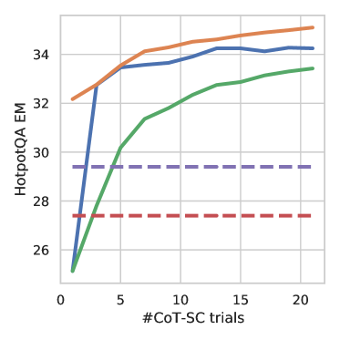
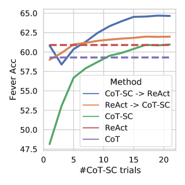
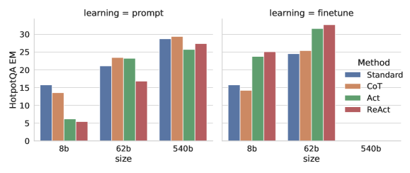
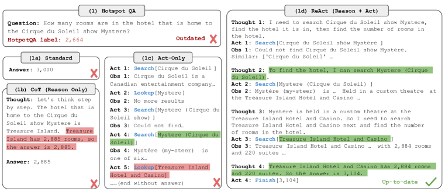
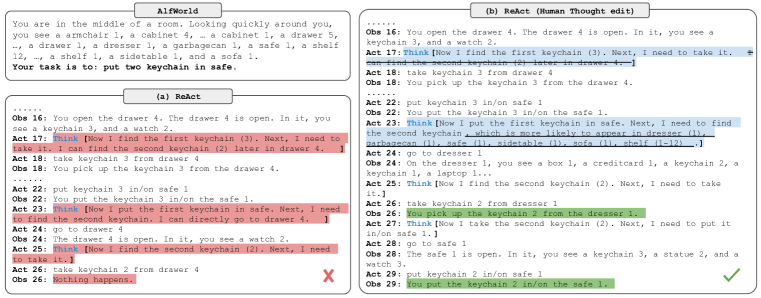

# ReAct: 言語モデルにおける推論と行動の相乗

> 原題: ReAct: Synergizing Reasoning and Acting in Language Models
> 著者: Shunyu Yao, Jeffrey Zhao, Dian Yu, Nan Du, Izhak Shafran, Karthik Narasimhan, Yuan Cao（Princeton University / Google Research, Brain team）
> 出典: arXiv:2210.03629, ICLR 2023
> 訳注: クリップ時に LaTeX マクロ `\model` が脱落し、原文 markdown から「ReAct」の語がほぼすべて欠落していたため、本訳では文脈から復元した。また、クリップから欠落していた Table 1（数値表）・Figure 2・脚注 1〜8 は ar5iv 原ページから復元した。本文中の \[数字\] は原典の参考文献番号を示す（参考文献一覧は翻訳対象外）。

## Abstract（要旨）

大規模言語モデル（large language models, LLMs）は言語理解や対話的意思決定のタスク群で目覚ましい性能を示してきたが、その推論能力（例: chain-of-thought プロンプティング）と行動能力（例: 行動計画の生成）は主に別々のトピックとして研究されてきた。本論文では、LLM を用いて推論の軌跡（reasoning traces）とタスク固有の行動（actions）を交互に生成させることを探求し、両者のより大きな相乗効果を可能にする。すなわち、推論の軌跡はモデルが行動計画を導出・追跡・更新し、例外を処理するのを助け、行動は知識ベースや環境といった外部の情報源とやり取りして追加情報を収集することを可能にする。我々はこのアプローチを ReAct と名付け、多様な言語タスクおよび意思決定タスクに適用し、最先端のベースラインに対する有効性に加えて、人間にとっての解釈可能性と信頼性の向上を実証する。具体的には、質問応答（HotpotQA）と事実検証（Fever）において、ReAct は単純な Wikipedia API とやり取りすることで chain-of-thought 推論に蔓延する幻覚（hallucination）と誤り伝播の問題を克服し、推論の軌跡を持たないベースラインよりも解釈しやすい、人間らしいタスク解決の軌跡を生成する。さらに、2 つの対話的意思決定ベンチマーク（ALFWorld と WebShop）において、ReAct はわずか 1〜2 個の文脈内事例（in-context examples）のプロンプトだけで、模倣学習および強化学習の手法をそれぞれ 34% と 10% の絶対成功率で上回る。

## 1 Introduction（はじめに）

人間の知能に固有の特徴は、タスク指向の行動と言語的な推論（あるいは内言（inner speech）\[3\]）をシームレスに組み合わせられることである。これは自己制御や戦略立案 \[31\]\[20\]\[10\]、およびワーキングメモリの維持 \[4\] を可能にするものとして、人間の認知において重要な役割を果たすと理論化されてきた。台所で料理を作る例を考えてみよう。任意の 2 つの具体的な行動の間で、我々は進捗を追跡するため（「全部切り終えたから、次は鍋の水を温めるべきだ」）、例外を処理し状況に応じて計画を調整するため（「塩がないから、代わりに醤油と胡椒を使おう」）、外部の情報が必要なときにそれに気づくため（「生地はどうやって作るんだっけ？インターネットで検索しよう」）に、言語で推論することがある。また、推論を支え、疑問に答えるために行動する（料理本を開いてレシピを読む、冷蔵庫を開ける、食材を確認する——「今すぐ作れる料理は何か？」）こともある。この「行動」と「推論」の緊密な相乗効果によって、人間は新しいタスクを素早く学習し、未知の状況や情報の不確実性に直面しても、頑健な意思決定や推論を行うことができる。

最近の結果は、自律システムにおいて言語的推論と対話的意思決定を組み合わせられる可能性を示唆している。一方では、適切にプロンプトされた大規模言語モデル（LLMs）が、算術・常識・記号推論のタスクにおいて、質問から答えを導出するために数ステップの推論の軌跡を実行する創発的な能力を示している \[34\]。しかしこの「chain-of-thought」推論は静的なブラックボックスであり、モデルは自身の内部表現を使って思考を生成するのみで外部世界に接地（grounding）されていないため、反応的に推論したり知識を更新したりする能力が制限される。これは事実の幻覚（fact hallucination）や推論過程での誤り伝播といった問題を引き起こしうる（Figure 1 (1b)）。他方では、最近の研究が対話的環境における計画と行動のために事前学習済み言語モデルを使うことを探求しており \[2\]\[23\]\[36\]\[13\]、言語の事前知識（language priors）を介した行動予測に焦点を当てている。これらのアプローチは通常、マルチモーダルな観測をテキストに変換し、言語モデルを使ってドメイン固有の行動や計画を生成し、コントローラを使ってそれを選択・実行する。しかし、これらは高レベルの目標について抽象的に推論したり、行動を支えるワーキングメモリを維持したりするために言語モデルを用いてはいない。例外は \[14\] で、現在の状態に関する空間的事実を繰り返すという限定的な形の言語的推論を行っている。少数のブロックとやり取りするこうした単純な身体化タスクを超えて、推論と行動が一般的なタスク解決のために相乗的に組み合わせられるのか、またそのような組み合わせが推論のみ・行動のみと比べて系統的な利益をもたらすのかについては、研究がなされてこなかった。

<figure>

<figcaption>図1: (1) HotpotQA [35] の質問を解く 4 つのプロンプティング手法、(a) Standard、(b) Chain-of-thought（CoT, 推論のみ）、(c) Act のみ、(d) ReAct（推論+行動）の比較。(2) AlfWorld [27] のゲームを解く (a) Act のみと (b) ReAct プロンプティングの比較。どちらのドメインでも、プロンプト内の in-context 事例は省略し、モデルが生成したタスク解決の軌跡（Act, Thought）と環境（Obs）のみを示す。</figcaption>
</figure>

本研究では、多様な言語推論および意思決定タスクを解くために、言語モデルで推論と行動を組み合わせる汎用パラダイムである ReAct を提示する（Figure 1）。ReAct は LLM に、タスクに関する言語的な推論の軌跡と行動の両方を交互に生成するようプロンプトする。これにより、モデルは行動のための高レベル計画を作成・維持・調整する動的な推論を行い（推論から行動へ）、同時に外部環境（例: Wikipedia）とやり取りして追加情報を推論に取り込む（行動から推論へ）ことができる。

我々は ReAct と最先端のベースラインの実証評価を 4 つの多様なベンチマークで行う: 質問応答（HotPotQA \[35\]）、事実検証（Fever \[30\]）、テキストベースのゲーム（ALFWorld \[27\]）、ウェブページのナビゲーション（WebShop \[37\]）である。HotPotQA と Fever では、モデルがやり取りできる Wikipedia API へのアクセスを与えたとき、ReAct は素朴な行動生成モデルを上回り、chain-of-thought 推論（CoT）\[34\] と競合する性能を示す。全体として最良のアプローチは ReAct と CoT の組み合わせであり、推論の際に内部知識と外部から得た情報の両方を使うことを可能にする。ALFWorld と WebShop では、2 ショットあるいは 1 ショットの ReAct プロンプティングでさえ、$10^{3}\sim 10^{5}$ 個のタスクインスタンスで訓練された模倣学習や強化学習の手法を、それぞれ 34% と 10% の絶対成功率の改善で上回ることができる。また、行動のみの統制されたベースラインに対する一貫した優位を示すことで、意思決定における疎で汎用的な推論の重要性を実証する。汎用性と性能向上に加えて、推論と行動の組み合わせは、全ドメインにわたってモデルの解釈可能性・信頼性・診断可能性にも寄与する。人間は、モデルの内部知識由来の情報と外部環境由来の情報を容易に区別でき、また推論の軌跡を調べてモデルの行動の判断根拠を理解できるからである。

要約すると、我々の主要な貢献は以下である: (1) 言語モデルにおいて一般的なタスク解決のために推論と行動を相乗させる、プロンプトベースの新しいパラダイムである ReAct を導入する。(2) 多様なベンチマークで広範な実験を行い、推論のみあるいは行動生成のみを単独で行う先行アプローチに対する、few-shot 学習設定での ReAct の優位性を示す。(3) 推論タスクにおける行動の重要性、および対話的タスクにおける推論の重要性を理解するための、系統的なアブレーションと分析を提示する。(4) プロンプティング設定下での ReAct の限界（すなわち推論と行動の挙動のサポートが限定的であること）を分析し、追加の訓練データによって ReAct が改善する可能性を示す初期のファインチューニング実験を行う。より多くのタスクで ReAct をスケールアップして訓練・運用し、強化学習のような相補的パラダイムと組み合わせることで、大規模言語モデルの可能性をさらに解き放てるだろう。

## 2 ReAct: 推論 + 行動の相乗

タスク解決のために環境とやり取りするエージェントの一般的な設定を考える。時刻ステップ $t$ において、エージェントは環境から観測 $o_{t}\in\mathcal{O}$ を受け取り、ある方策 $\pi(a_{t}|c_{t})$ に従って行動 $a_{t}\in\mathcal{A}$ を取る。ここで $c_{t}=(o_{1},a_{1},\cdots,o_{t-1},a_{t-1},o_{t})$ はエージェントに対するコンテキストである。写像 $c_{t}\mapsto a_{t}$ が非常に暗黙的で膨大な計算を要するとき、方策の学習は困難になる。例えば、Figure 1(1c) に示すエージェントは、QA タスクを終わらせる正しい最終行動（Act 4）を生成できない。それには軌跡のコンテキスト全体（Question, Act 1-3, Obs 1-3）にわたる複雑な推論が必要だからである。同様に、Figure 1(2a) に示すエージェントは、sinkbasin 1 に peppershaker 1 が含まれていないことをコンテキストから理解できず、幻覚的な行動を生成し続ける。

ReAct のアイデアはシンプルである: エージェントの行動空間を $\mathcal{\hat{A}}=\mathcal{A}\cup\mathcal{L}$ に拡張する。ここで $\mathcal{L}$ は言語の空間である。言語空間における行動 $\hat{a}_{t}\in\mathcal{L}$ を、以後思考（thought）あるいは推論の軌跡（reasoning trace）と呼ぶ。これは外部環境に影響を与えないため、観測のフィードバックは生じない。その代わり、思考 $\hat{a}_{t}$ は現在のコンテキスト $c_{t}$ に対して推論することで有用な情報を構成し、コンテキストを $c_{t+1}=(c_{t},\hat{a}_{t})$ に更新して将来の推論や行動を支えることを目的とする。Figure 1 に示すように、有用な思考には様々な種類がありうる。例えば、タスクの目標を分解して行動計画を作る（2b, Act 1; 1d, Thought 1）、タスク解決に関連する常識的知識を注入する（2b, Act 1）、観測から重要な部分を抽出する（1d, Thought 2, 4）、進捗を追跡し行動計画を遷移させる（2b, Act 8）、例外を処理し行動計画を調整する（1d, Thought 3）、などである。

しかし、言語空間 $\mathcal{L}$ は無限であるため、この拡張された行動空間での学習は困難であり、強い言語の事前知識を必要とする。本論文では主に、凍結された（frozen）大規模言語モデル PaLM-540B \[6\][^fn1] を few-shot の in-context 事例でプロンプトし、タスク解決のためのドメイン固有の行動と自由形式の言語的思考の両方を生成させる設定に焦点を当てる（Figure 1 (1d), (2b)）。各 in-context 事例は、タスクインスタンスを解く行動・思考・環境観測からなる人間の軌跡である（Appendix C を参照）。推論が第一に重要なタスク（Figure 1(1)）では、思考と行動の生成を交互に行い、タスク解決の軌跡が複数の思考-行動-観測ステップから構成されるようにする。対照的に、多数の行動を伴いうる意思決定タスク（Figure 1(2)）では、思考は軌跡の中で最も関連の深い位置に疎に現れれば十分なので、思考と行動の非同期な出現は言語モデル自身に決めさせる。

意思決定と推論の能力が大規模言語モデルに統合されているため、ReAct はいくつかの独自の特長を持つ: A) 直感的で設計が容易: ReAct のプロンプト設計は単純明快である。人間のアノテータは、自分が取った行動の上に自分の思考を言語でそのまま書き加えるだけでよい。本論文ではアドホックな書式の選択、思考の設計、事例の選択は一切行っていない。各タスクのプロンプト設計は Section 3 と 4 で詳述する。B) 汎用的で柔軟: 柔軟な思考空間と思考-行動の出現形式により、ReAct は行動空間も推論の要求も異なる多様なタスクに機能する。これには QA、事実検証、テキストゲーム、ウェブナビゲーションが含まれるが、それに限らない。C) 高性能で頑健: ReAct は 1〜6 個の in-context 事例のみから学習しながら新しいタスクインスタンスへの強い汎化を示し、異なるドメインにわたって推論のみ・行動のみのベースラインを一貫して上回る。Section 3 ではファインチューニングを有効にした場合の追加の利点も示し、Section 4 では性能がプロンプト選択に対して頑健であることを示す。D) 人間に整合し制御可能: ReAct は解釈可能な逐次的意思決定・推論プロセスを約束し、人間は推論と事実の正しさを容易に検査できる。さらに、Section 4 の Figure 5 に示すように、人間は思考の編集（thought editing）によってエージェントの挙動をその場で制御・修正することもできる。

[^fn1]: GPT-3 \[5\] の結果の一部を Appendix A.1 に示す。GPT-3 は PaLM-540B を上回った。

## 3 知識集約的推論タスク

まずマルチホップ質問応答や事実検証のような知識集約的推論タスクから始める。Figure 1(1d) に示すように、Wikipedia API とやり取りすることで、ReAct は推論を支える情報を検索でき、同時に推論を使って次に何を検索すべきかを定めることができ、推論と行動の相乗を実証する。

### 3.1 セットアップ

##### ドメイン

知識の検索と推論が要求される 2 つのデータセットを考える: (1) HotPotQA \[35\] は、2 つ以上の Wikipedia パッセージにわたる推論を要求するマルチホップ質問応答ベンチマーク、(2) FEVER \[30\] は、主張を検証できる Wikipedia パッセージが存在するか否かに基づいて、各主張が SUPPORTS・REFUTES・NOT ENOUGH INFO のいずれかにアノテートされる事実検証ベンチマークである。本研究では両タスクとも質問のみの設定（question-only setup）で動作させる。すなわち、モデルは質問／主張のみを入力として受け取り、根拠となる段落へのアクセスを持たず、内部知識に頼るか、外部環境とのやり取りを介して知識を検索して推論を支えなければならない。

##### 行動空間

対話的な情報検索を支えるために、3 種類の行動を持つシンプルな Wikipedia ウェブ API を設計する: (1) search\[entity\] は、対応するエンティティの wiki ページが存在すればその最初の 5 文を返し、存在しなければ Wikipedia 検索エンジンから上位 5 件の類似エンティティを提案する。(2) lookup\[string\] は、ページ内で string を含む次の文を返す。ブラウザの Ctrl+F 機能のシミュレーションである。(3) finish\[answer\] は、answer で現在のタスクを終了する。この行動空間は、正確なパッセージ名に基づいてパッセージのごく一部しか検索できず、最先端の語彙ベースあるいはニューラルの検索器（retriever）よりも大幅に弱いことに注意されたい。その目的は、人間が Wikipedia とやり取りする様子を模倣し、モデルに言語での明示的な推論を介した検索を強制することである。

### 3.2 手法

##### プロンプティング

HotpotQA と Fever について、訓練セットからそれぞれ 6 ケースと 3 ケースをランダムに選び[^fn2]、ReAct 形式の軌跡を手動で作成して few-shot の例示（exemplar）としてプロンプトに使う。Figure 1(d) と同様、各軌跡は複数の思考-行動-観測ステップからなり（すなわち密な思考（dense thought））、自由形式の思考が様々な目的で使われる。具体的には、質問を分解する思考（「x を検索し、y を見つけ、それから z を見つける必要がある」）、Wikipedia の観測から情報を抽出する思考（「x は 1844 年に始まった」「この段落は x について述べていない」）、常識推論（「x は y ではないので、z は代わりに…のはずだ」）や算術推論（「1844 < 1989」）を行う思考、検索の再定式化を導く思考（「代わりに x を検索／lookup できるかもしれない」）、最終的な答えを合成する思考（「…なので答えは x だ」）の組み合わせを用いる。詳細は Appendix C を参照。

[^fn2]: 事例を増やしても性能は向上しないことが分かった。

##### ベースライン

複数のベースラインのプロンプトを作るために、ReAct の軌跡を系統的にアブレートする（書式は Figure 1(1a-1c) の通り）: (a) 標準プロンプティング（Standard）は、ReAct の軌跡からすべての思考・行動・観測を取り除く。(b) chain-of-thought プロンプティング（CoT）\[34\] は、行動と観測を取り除き、推論のみのベースラインとなる。さらに、推論時に decoding temperature 0.7 で 21 個の CoT 軌跡をサンプリングし多数決の答えを採用する self-consistency ベースライン（CoT-SC）\[32\]\[33\] も構築する。これは CoT より一貫して性能を高めることが知られている。(c) 行動のみのプロンプト（Act）は、ReAct の軌跡から思考を取り除く。これは WebGPT \[23\] がインターネットとやり取りして質問に答える方法に大まかには似ているが、WebGPT は異なるタスクと行動空間で動作し、プロンプティングではなく模倣学習と強化学習を使っている。

##### 内部知識と外部知識の組み合わせ

Section 3.3 で詳述するように、ReAct が示す問題解決プロセスはより事実的で接地されている一方、CoT は推論の構造の定式化はより正確だが、幻覚した事実や思考に苦しみやすいことが観察される。そこで ReAct と CoT-SC を組み合わせ、以下のヒューリスティクスに基づいてもう一方の手法にいつ切り替えるかをモデルに決めさせることを提案する: A) ReAct → CoT-SC: ReAct が所定のステップ数以内に答えを返せなかったとき、CoT-SC にバックオフする。HotpotQA では 7 ステップ、FEVER では 5 ステップとした。ステップ数を増やしても性能は向上しないことが分かったためである[^fn3]。B) CoT-SC → ReAct: $n$ 個の CoT-SC サンプルの多数決の答えの出現回数が $n/2$ 回未満のとき（すなわち内部知識がタスクを自信を持って支えられないかもしれないとき）、ReAct にバックオフする。

[^fn3]: 正しい最終解答に至った全軌跡のうち、HotpotQA で 7 ステップ、FEVER で 5 ステップかかったものはそれぞれ 0.84% と 1.33% を占めるに過ぎない。

##### ファインチューニング

推論の軌跡と行動を大規模に手動アノテートすることの困難さから、\[38\] に似たブートストラップ的アプローチを考える。ReAct が生成した正答付きの 3,000 個の軌跡（他のベースラインについても同様）を使い、より小さな言語モデル（PaLM-8/62B）を、入力の質問／主張を条件として軌跡（すべての思考・行動・観測）をデコードするようファインチューニングする。詳細は Appendix B.1 にある。

### 3.3 結果と観察

##### ReAct は Act を一貫して上回る

Table 1 は、PaLM-540B をベースモデルとして異なるプロンプティング手法を用いた HotpotQA と Fever の結果を示す。ReAct は両タスクで Act より優れており、行動を導く推論の価値、特に最終的な答えを合成する上での価値を実証している（Figure 1 (1c-d) 参照）。ファインチューニングの結果（Figure 3）も、より情報に基づいた行動のための推論の軌跡の利点を裏付けている。

**表1**: HotpotQA と Fever における PaLM-540B のプロンプティング結果。（訳注: この表はクリップから欠落していたため ar5iv 原ページから復元した）

| プロンプト手法 | HotpotQA (EM) | Fever (Acc) |
| --- | --- | --- |
| Standard | 28.7 | 57.1 |
| CoT \[34\] | 29.4 | 56.3 |
| CoT-SC \[32\] | 33.4 | 60.4 |
| Act | 25.7 | 58.9 |
| ReAct | 27.4 | 60.9 |
| CoT-SC → ReAct | 34.2 | **64.6** |
| ReAct → CoT-SC | **35.1** | 62.0 |
| 教師あり SoTA[^fn5] | 67.5 | 89.5 |

[^fn4]: Wang et al. (2022b) では Standard, CoT, CoT-SC の HotpotQA EM は 27.1, 28.9, 33.8 である。

[^fn5]: (Zhu et al., 2021; Lewis et al., 2020)

**表2**: HotpotQA における ReAct と CoT の成功・失敗モードの種類、および人手で調べたランダム抽出事例におけるその割合。

| | 種類 | 定義 | ReAct | CoT |
| --- | --- | --- | --- | --- |
| 成功 | True positive | 正しい推論の軌跡と事実 | 94% | 86% |
| | False positive | 幻覚した推論の軌跡または事実 | 6% | 14% |
| 失敗 | Reasoning error | 誤った推論の軌跡（反復ステップから回復できない場合を含む） | 47% | 16% |
| | Search result error | 検索が空を返すか有用な情報を含まない | 23% | - |
| | Hallucination | 幻覚した推論の軌跡または事実 | 0% | 56% |
| | Label ambiguity | 予測は正しいがラベルと正確には一致しない | 29% | 28% |

##### ReAct vs. CoT

他方、ReAct は Fever では CoT を上回り（60.9 vs. 56.3）、HotpotQA では CoT にわずかに劣る（27.4 vs. 29.4）。Fever の SUPPORTS/REFUTES の主張はごくわずかな差しかないことがあり（Appendix D.1 参照）、正確で最新の知識を検索するための行動が不可欠である。HotpotQA における ReAct と CoT の挙動の違いをより深く理解するために、ReAct と CoT それぞれから正答・誤答（EM で判定）の軌跡を 50 個ずつランダムサンプリングし（計 200 事例）、その成功・失敗モードを手動でラベル付けした（Table 2）。主要な観察は以下の通りである:

A) 幻覚は CoT の深刻な問題であり、成功モードにおける false positive 率を ReAct よりはるかに高くし（14% vs. 6%）、CoT の主要な失敗モード（56%）を構成する。対照的に、ReAct の問題解決の軌跡は、外部知識ベースへのアクセスのおかげで、より接地され、事実駆動で、信頼できる。

B) 推論・行動・観測のステップを交互に行うことは ReAct の接地性と信頼性を高めるが、この構造的制約は推論ステップを定式化する柔軟性を下げ、CoT より高い reasoning error 率につながる。ReAct に固有の頻出エラーパターンが 1 つあることに注意したい。それはモデルが以前の思考と行動を繰り返し生成するもので、モデルが次に取るべき適切な行動を推論してループから抜け出すことに失敗しているため、我々はこれを「reasoning error」の一部として分類する[^fn6]。

C) ReAct にとって、検索を介して有益な知識をうまく取得することは決定的に重要である。エラーケースの 23% を占める情報を得られない検索（non-informative search）は、モデルの推論を脱線させ、思考を立て直して回復することを難しくする。これはおそらく事実性と柔軟性の間の予期されたトレードオフであり、2 つの手法を組み合わせる我々の提案戦略を動機づける。

[^fn6]: これは劣った貪欲デコード手続きによるものではないかと疑っており、より良いデコード（例: ビームサーチ）を使う将来の研究がこの問題への対処に役立つかもしれない。

各成功・失敗モードの例は Appendix E.1 に載せる。また、一部の HotpotQA の質問は古くなった解答ラベルを含みうることも分かった。例として Figure 4 を参照。

##### ReAct + CoT-SC がプロンプティングでは最良

Table 1 にも示す通り、HotpotQA と Fever で最良のプロンプティング手法はそれぞれ ReAct → CoT-SC と CoT-SC → ReAct であった。さらに Figure 2 は、使用する CoT-SC サンプル数に対して各手法がどう振る舞うかを示す。2 つの ReAct + CoT-SC 手法はそれぞれ一方のタスクで有利だが、どちらもサンプル数によらず CoT-SC を大幅かつ一貫して上回り、わずか 3〜5 サンプルで 21 サンプルの CoT-SC の性能に到達する。これらの結果は、推論タスクにおいてモデルの内部知識と外部知識を適切に組み合わせることの価値を示している。

<figure>

<figcaption>図2（左）: 使用する CoT-SC サンプル数に対する PaLM-540B のプロンプティング結果（HotpotQA EM）。（訳注: この図はクリップから欠落していたため ar5iv 原ページから復元した）</figcaption>
</figure>

<figure>

<figcaption>図2（右）: 使用する CoT-SC サンプル数に対する PaLM-540B のプロンプティング結果（Fever Acc）。</figcaption>
</figure>

##### ReAct はファインチューニングでは最良

Figure 3 は、HotpotQA における 4 手法（Standard, CoT, Act, ReAct）のプロンプティング／ファインチューニングのスケーリング効果を示す。PaLM-8/62B では、in-context 事例から推論と行動の両方を学ぶことの難しさから、ReAct のプロンプティングは 4 手法中最下位である。しかし、わずか 3,000 事例でファインチューニングすると ReAct は 4 手法中最良となり、ファインチューニングされた PaLM-8B の ReAct はすべての PaLM-62B プロンプティング手法を上回り、ファインチューニングされた PaLM-62B の ReAct はすべての 540B プロンプティング手法を上回る。対照的に、Standard や CoT のファインチューニングは、PaLM-8/62B のいずれでも ReAct や Act のファインチューニングより大幅に劣る。前者は本質的に（幻覚の可能性がある）知識的事実をモデルに暗記させるのに対し、後者は Wikipedia から情報にアクセスするために（推論し）行動する方法をモデルに教えるからであり、これは知識推論のためのより汎化可能なスキルである。すべてのプロンプティング手法はドメイン固有の最先端アプローチからまだ大きく離れているため（Table 1）、より多くの人間が書いたデータでのファインチューニングが ReAct の力を解き放つより良い方法だと我々は考える。

<figure>

<figcaption>図3: HotPotQA における ReAct（我々の手法）とベースラインのプロンプティングおよびファインチューニングのスケーリング結果。</figcaption>
</figure>

## 4 意思決定タスク

ReAct を 2 つの言語ベースの対話的意思決定タスク、ALFWorld と WebShop でもテストする。いずれも複雑な環境を特徴とし、疎な報酬の下でエージェントが長いホライズンにわたって行動することを要求するため、効果的に行動し探索するための推論の必要性が生じる。

##### ALFWorld

ALFWorld \[27\]（Figure 1(2)）は、身体化された ALFRED ベンチマーク \[26\] に整合するよう設計された合成テキストベースゲームである。6 種類のタスクを含み、エージェントはテキスト行動（例: go to coffeetable 1, take paper 2, use desklamp 1）でシミュレートされた家庭内をナビゲート・操作することにより、高レベルの目標（例: examine paper under desklamp）を達成する必要がある。1 つのタスクインスタンスは 50 以上の場所を持ちうるし、エキスパート方策でも解くのに 50 ステップ以上かかりうるため、エージェントには部分目標（subgoal）の計画と追跡、そして系統的な探索（例: desklamp を探して机を 1 つずつ確認する）が要求される。特に ALFWorld に組み込まれた課題の 1 つは、ありふれた家庭用品のありそうな場所を判断する必要性であり（例: desklamp は机・棚・ドレッサーの上にありそうだ）、この環境は LLM が事前学習で得た常識的知識を活用するのに適している。ReAct のプロンプトには、タスク種別ごとに訓練セットから 3 つの軌跡をランダムにアノテートした。各軌跡は疎な思考を含み、それらは (1) 目標を分解する、(2) 部分目標の完了を追跡する、(3) 次の部分目標を決める、(4) 物がどこにあり何をすべきかを常識で推論する、というものである。ALFWorld に使ったプロンプトは Appendix C.4 に示す。\[27\] に従い、タスク種別ごとの設定で 134 個の未見の評価ゲームで評価する。頑健性のため、アノテートした 3 軌跡から 2 軌跡を選ぶ各順列によって、タスク種別ごとに 6 つのプロンプトを構成する。Act のプロンプトは同じ軌跡から思考を抜いて構成する——タスクインスタンスは訓練セットからランダムに選ばれているので、これは ReAct にも Act にも有利にならず、疎な思考の重要性をテストする公平で統制された比較を与える。ベースラインには、タスク種別ごとに $10^{5}$ 個のエキスパート軌跡で訓練された模倣学習エージェントである BUTLER \[27\] を用いる[^fn7]。

[^fn7]: Micheli & Fleuret (2021) は GPT-2 モデルを 3553 個のタスクインスタンスでファインチューニングし BUTLER より大幅に改善された性能を達成したが、全タスク種別で訓練されているため、ベースラインには含めない。

##### WebShop

ReAct はノイズの多い実世界の言語環境とも実用的な応用のためにやり取りできるだろうか？我々は WebShop \[37\] を調査する。これは最近提案されたオンラインショッピングウェブサイト環境で、118 万点の実世界の商品と 1.2 万件の人間による指示を持つ。ALFWorld と異なり、WebShop は多様な構造化・非構造化テキスト（例: Amazon からクロールされた商品タイトル・説明・オプション）を含み、エージェントはユーザーの指示（例: 「引き出し付きのナイトスタンドを探しています。ニッケル仕上げで、価格は 140 ドル未満」）に基づき、ウェブ操作（例: 「nightstand drawers」を検索、「color: modern-nickel-white」や「back to search」といったボタンの選択）を通じて商品を購入することを要求される。このタスクは 500 件のテスト指示に対して、平均スコア（選んだ商品がカバーする望ましい属性の割合を全エピソードで平均したもの）と成功率（選んだ商品がすべての要件を満たすエピソードの割合）で評価される。Act のプロンプトは検索・商品選択・オプション選択・購入の行動で構成し、ReAct のプロンプトはそれに加えて、何を探索すべきか、いつ買うべきか、どの商品オプションが指示に関連するかを判断する推論を行う。プロンプト例は Table 6 を、モデル予測の例は Appendix の Table 10 を参照。比較対象として、1,012 個の人間によるアノテート軌跡で訓練された模倣学習（IL）手法と、さらに 10,587 件の訓練指示で強化学習も行った模倣学習+強化学習（IL+RL）手法を用いる。

##### 結果

**表3**: AlfWorld のタスク種別ごとの成功率（%）。BUTLER と BUTLERg の結果は \[27\] の Table 4 から。全手法は貪欲デコードを用いるが、BUTLER はビームサーチを使う。

| 手法 | Pick | Clean | Heat | Cool | Look | Pick 2 | All |
| --- | --- | --- | --- | --- | --- | --- | --- |
| Act (best of 6) | 88 | 42 | 74 | 67 | 72 | 41 | 45 |
| ReAct (avg) | 65 | 39 | 83 | 76 | 55 | 24 | 57 |
| ReAct (best of 6) | 92 | 58 | 96 | 86 | 78 | 41 | **71** |
| ReAct-IM (avg) | 55 | 59 | 60 | 55 | 23 | 24 | 48 |
| ReAct-IM (best of 6) | 62 | 68 | 87 | 57 | 39 | 33 | 53 |
| BUTLERg (best of 8) | 33 | 26 | 70 | 76 | 17 | 12 | 22 |
| BUTLER (best of 8) | 46 | 39 | 74 | 100 | 22 | 24 | 37 |

**表4**: WebShop のスコアと成功率（SR）。IL/IL+RL は \[37\] から。

| 手法 | Score | SR |
| --- | --- | --- |
| Act | 62.3 | 30.1 |
| ReAct | **66.6** | **40.0** |
| IL | 59.9 | 29.1 |
| IL+RL | 62.4 | 28.7 |
| 人間エキスパート | 82.1 | 59.6 |

ReAct は ALFWorld（Table 3）と WebShop（Table 4）の両方で Act を上回る。ALFWorld では、最良の ReAct 試行は平均成功率 71% を達成し、最良の Act 試行（45%）と BUTLER 試行（37%）を大幅に上回った。実際、最悪の ReAct 試行（48%）でさえ両手法の最良試行を上回っている。さらに、Act に対する ReAct の優位は 6 つの統制された試行にわたって一貫しており、相対的な性能向上は 33% から 90% の範囲で平均 62% である。定性的には、思考が全くない Act は目標を小さな部分目標へ正しく分解できない、あるいは環境の現在の状態を見失うことが観察された。ReAct と Act を比較する軌跡の例は Appendix D.2.1 と Appendix D.2.2 にある。

WebShop では、1 ショットの Act プロンプティングだけで IL や IL+RL の手法に匹敵する性能を出す。疎な推論を加えた ReAct は大幅に良い性能を達成し、従来の最良成功率に対して絶対値で 10% の改善を示した。事例を調べると、ReAct はノイズの多い観測と行動の間のギャップを推論で埋めることによって、指示に関連する商品やオプションを特定しやすくなっている（例: 「『リビング用の省スペースなオットマンベンチ』に対して、この商品には『39x18x18inch』と『blue』のオプションがあり、買ってよさそうだ」）。しかし、既存の手法はエキスパートの人間の性能（Table 4）にはまだ遠く及ばない。人間は大幅に多くの商品探索やクエリの再定式化を行っており、これはプロンプティングベースの手法にはまだ難しい。

##### 内部推論の価値 vs. 外部フィードバックの価値

我々の知る限り、ReAct は LLM を用いた推論と行動の組み合わせを、閉ループシステム内の対話的環境に適用した最初の実証である。おそらく最も近い先行研究は \[14\] の Inner Monologue（IM）であり、身体化されたエージェントの行動が同名の「内的独白（inner monologue）」によって動機づけられる。しかし IM の「内的独白」は、環境状態の観測と、目標達成のためにエージェントが完了すべきものに限定されている。対照的に、ReAct の意思決定のための推論の軌跡は柔軟かつ疎であり、異なるタスクに対して多様な推論の種類（Section 2 参照）を誘発できる。

ReAct と IM の違いを示し、外部フィードバックへの単純な反応に対する内部推論の重要性を強調するために、IM 風の密な外部フィードバックで構成される思考パターンを使ったアブレーション実験を行った。Table 3 に示すように、ReAct は IM 風プロンプティング（ReAct-IM）を大幅に上回り（全体成功率 71 vs. 53）、6 タスク中 5 つで一貫した優位を示した。定性的には、ReAct-IM は高レベルの目標分解を欠くため、部分目標がいつ完了したか、次の部分目標が何であるべきかの特定をしばしば誤った。また、常識推論を欠くため、多くの ReAct-IM の軌跡は ALFWorld 環境内で物がどこにありそうかの判断に苦労した。どちらの欠点も ReAct パラダイムでは対処できる。ReAct-IM の詳細は Appendix B.2 に、プロンプト例は Appendix C.4 に、軌跡例は Appendix D.2.3 にある。

## 5 関連研究

##### 推論のための言語モデル

LLM を推論に使う研究として最もよく知られているのはおそらく Chain-of-Thought（CoT）\[34\] であり、LLM が問題解決のための自身の「思考手続き」を定式化する能力を明らかにした。その後、複雑なタスクを解くための least-to-most プロンプティング \[39\]、zero-shot-CoT \[16\]、self-consistency を用いた推論 \[32\] を含む多くの後続研究が行われてきた。最近では \[21\] が CoT の定式化と構造を系統的に研究し、記号・パターン・テキストの存在が CoT の有効性に決定的であることを観察した。他にも、単純なプロンプティングを超えたより洗練された推論アーキテクチャへ拡張する研究がある。例えば Selection-Inference \[8\] は推論プロセスを「選択」と「推論」の 2 ステップに分ける。STaR \[38\] は、モデル自身が生成した正しい根拠（rationale）でモデルをファインチューニングすることにより推論プロセスをブートストラップする。Faithful reasoning \[7\] は多段推論を 3 ステップに分解し、それぞれを専用の LM が実行する。Scratchpad \[24\] のように中間計算ステップで LM をファインチューニングする類似アプローチも、多段計算問題での改善を示している。これらの手法と対照的に、ReAct は孤立した固定的な推論以上のことを行い、モデルの行動とそれに対応する観測を一貫した入力ストリームへ統合することで、モデルがより正確に推論し、推論以外のタスク（例: 対話的意思決定）にも取り組めるようにする。

##### 意思決定のための言語モデル

LLM の強力な能力は言語生成を超えたタスクの遂行を可能にしており、特に対話的環境において LLM を意思決定の方策モデル（policy model）として活用することが盛んになっている。WebGPT \[23\] は LM を使ってウェブブラウザとやり取りし、ウェブページをナビゲートし、ELI5 \[9\] の複雑な質問への答えを推測する。ReAct と比較すると、WebGPT は思考と推論の手続きを明示的にモデル化せず、高価な人間のフィードバックに頼って強化学習を行う。会話モデリングでは、BlenderBot \[29\] や Sparrow \[11\] のようなチャットボット、SimpleTOD \[12\] のようなタスク指向対話システムも API 呼び出しについての意思決定を行うよう LM を訓練する。ReAct と異なり、これらも推論手続きを明示的には考慮せず、方策学習のために高価なデータセットと人間のフィードバック収集に依存する。対照的に、ReAct は方策をはるかに安価に学習する。意思決定プロセスに必要なのは推論手続きの言語記述だけだからである[^fn8]。

[^fn8]: 人間のフィードバックも相補的に組み込めるが、将来の研究に委ねる。

LLM は、計画と意思決定のために対話的・身体化環境でもますます使われるようになっている。この点で ReAct に最も関連するのはおそらく SayCan \[2\] と Inner Monologue \[14\] であり、ロボットの行動計画と意思決定に LLM を使う。SayCan では、ロボットが取りうる行動を直接予測するよう LLM をプロンプトし、それを視覚環境に接地されたアフォーダンスモデルで再ランキングして最終予測とする。Inner Monologue は、環境からのフィードバックの注入として実装された同名の「内的独白」を加えることでさらなる改善を行った。我々の知る限り、Inner Monologue はそのような閉ループシステムを実証した最初の研究であり、ReAct はその上に構築されている。しかし我々は、Inner Monologue が真の内的思考から構成されているわけではないと主張する——これは Section 4 で詳述した。また、対話的意思決定の過程で意味論的に豊かな入力として言語を活用することは、他の設定でも成功することが示されている \[1\]\[15\]\[13\]\[19\]。LLM の助けによって、基本的な認知メカニズムとしての言語が相互作用と意思決定において重要な役割を果たすことが、ますます明らかになりつつある。さらに、LLM の進歩は \[25\] のような多才で汎用的なエージェントの開発も促している。

## 6 結論

我々は、大規模言語モデルにおいて推論と行動を相乗させるシンプルかつ効果的な手法である ReAct を提案した。マルチホップ質問応答・事実確認・対話的意思決定タスクでの多様な実験を通じて、ReAct が解釈可能な意思決定の軌跡を伴う優れた性能をもたらすことを示した。手法のシンプルさにもかかわらず、行動空間の大きい複雑なタスクはうまく学習するためにより多くのデモンストレーションを要し、それは残念ながら in-context 学習の入力長の制限を容易に超えてしまう。我々は HotpotQA でファインチューニングのアプローチを探求し、有望な初期結果を得たが、より多くの高品質な人間のアノテーションから学習することが、性能をさらに改善するための要件となるだろう。マルチタスク訓練でスケールアップし、強化学習のような相補的パラダイムと組み合わせることで、より強力なエージェントが生まれ、LLM のさらに多くの応用の可能性が解き放たれるだろう。

#### 再現性に関する声明

我々の主実験は PaLM \[6\] で行われたが、これはまだ公開アクセス可能なモデルではない。再現性を高めるため、使用したすべてのプロンプトを Appendix C に、GPT-3 \[5\] を使った追加実験を Appendix A.1 に、関連する GPT-3 プロンプティングのコードを [https://anonymous.4open.science/r/ReAct-2268/](https://anonymous.4open.science/r/ReAct-2268/) に含めた。

#### 倫理に関する声明

ReAct は大規模言語モデルにプロンプトを与え、従来の手法より人間にとって解釈・診断・制御が可能なタスク解決の軌跡を生成させる。しかし、大規模言語モデルを外部環境（例: ウェブ、物理環境）とやり取りする行動空間に接続することには潜在的な危険がある。例えば、不適切な情報や個人情報を調べたり、環境内で有害な行動を取ったりすることである。我々の実験は、やり取りを個人情報のない特定のウェブサイト（Wikipedia と WebShop）に限定し、行動空間の設計に危険な行動を含めない（すなわち、モデルは研究用ベンチマークである WebShop で実際に商品を購入したり、Wikipedia を編集したりはできない）ことで、そのようなリスクを最小化している。将来より広範な実験を設計する前に、研究者はこうしたリスクを認識すべきだと我々は考える。

## Appendix A 追加の結果

### A.1 GPT-3 実験

**表5**: PaLM-540B と GPT-3（text-davinci-002, 貪欲デコード）を使った ReAct プロンプティングの結果。HotpotQA では検証質問から 500 問のサブセットをランダムサンプリングした。ALFWorld では 134 個すべての未見の検証タスクインスタンスを使い、PaLM-540B に基づく最良のプロンプトセットを使用した。

| | PaLM-540B | GPT-3 |
| --- | --- | --- |
| HotpotQA (exact match) | 29.4 | 30.8 |
| ALFWorld (成功率 %) | 70.9 | 78.4 |

ReAct のプロンプティング性能が異なる大規模言語モデルにわたって一般的であることを確認するために、GPT-3 \[5\] の追加実験を行った。Table 5 に示すように、GPT-3（text-davinci-002, 貪欲デコード）は HotpotQA と ALFWorld で PaLM-540B を一貫して上回る。これは人間の指示追従（instruction following）でファインチューニングされているためかもしれない。これは ReAct プロンプティングが、異なるタスク上の異なる大規模言語モデルにわたって有効であることを示している。これらの実験のコードは [https://react-lm.github.io/](https://react-lm.github.io/) にある。

### A.2 ReAct は HotpotQA で最新の知識を得る

<figure>

<figcaption>図4: 元のラベルが古くなっている別の HotpotQA の質問例。実世界のウェブとのやり取りと推論のおかげで、ReAct だけが最新の答えを得られている。</figcaption>
</figure>

軌跡の検査中に、データセットのラベル自体が古くなっているために ReAct がラベルと一致しないことがあることも分かった。例えば Figure 4 に示すように、この質問はホテルの規模について尋ねているが、その規模は HotpotQA の構築時から増加している。Standard と CoT は幻覚により誤った答えを出し、Act は実世界のウェブとのやり取りにアクセスできるにもかかわらず、QA のためにインターネットとどうやり取りするかを導く推論を欠くために失敗する。ReAct だけがインターネットから最新の情報を取得し、妥当な答えを出せている。したがって、推論能力のより良い統合は、最新のタスク解決のために最近のインターネット拡張言語モデル \[23\]\[17\]\[28\] にも役立つかもしれない。

### A.3 AlfWorld における human-in-the-loop の挙動修正

<figure>

<figcaption>図5: AlfWorld における ReAct の human-in-the-loop 挙動修正の例。(a) ReAct の軌跡は幻覚した思考（Act 17）により失敗する。(b) 人間が 2 つの思考（Act 17, 23）を編集するだけで、ReAct の軌跡は望ましい推論の軌跡と行動を生成し、成功する。</figcaption>
</figure>

我々はまた、人間が ReAct の推論の軌跡を検査・編集できるようにする、ReAct との human-in-the-loop の相互作用も探求する。Figure 5 は、Act 17 の幻覚した文を取り除き、Act 23 にいくつかのヒントを加えるだけで、ReAct の挙動をこれらの人間の思考編集に整合するよう劇的に変化させ、タスクを成功させられることを示している。人間の視点から見ると、このようなタスクを解くことは、数十個の行動を打ち込むことから数個の思考を編集するだけへと大幅に容易になり、新しい形の人間-機械協調を可能にする。このような方策のその場での編集は Act や従来の RL 手法では難しいことに注意したい。人間はモデルのパラメータを変更できず、少数の行動を変更してもモデルの残りの挙動を編集できるとは限らないからである。このパラダイムはまた、\[14\] のような目標や部分目標を更新するための人間の対話以上のものである——思考の編集はそれらも可能にする一方で、モデルの内部の信念や推論スタイル、あるいは柔軟な思考空間が支えるあらゆるものを、より良いタスク解決のために修正できる。我々はこれが人間との整合（human alignment）の刺激的な方向性だと考えており、より系統的な研究は将来の課題とする。

## Appendix B 実験の詳細

### B.1 HotpotQA ファインチューニングの詳細

すべてのファインチューニングでバッチサイズ 64 を使う。PaLM-8B では、ReAct と Act の手法を 4,000 ステップ、Standard と CoT の手法を 2,000 ステップファインチューニングする。PaLM-62B では、ReAct と Act の手法を 4,000 ステップ、Standard と CoT の手法を 1,000 ステップファインチューニングする。ReAct と Act の手法は一般により多くの訓練ステップ（そしてより多くの訓練データ）から利益を得るのに対し、Standard と CoT の手法はファインチューニング後すぐに劣化することが分かった。

### B.2 AlfWorld IM 風アブレーションの詳細

IM 風のアブレーションでは、ReAct で使ったのと同じエキスパート軌跡に、密な外部フィードバックの思考を再アノテートする。それらの思考は ReAct-IM を (1) 現在の目標の分解と (2) 完了すべき現在の部分目標についてのみ考えるよう制限する。特に ReAct-IM は、(1) 部分目標がいつ完了したかを判断する思考、(2) 次の部分目標が何であるべきかを判断する思考、(3) 物が環境内のどこにありうるかを特定するために LLM の内部の事前学習知識を参照するよう誘導する思考、を欠いている。

## Appendix C プロンプト

（訳注: 以下のプロンプトと軌跡は、原文が一字一句そのまま挙動を規定する実験素材であるため、翻訳せず原文のまま収録する。skill 規定による。表キャプションのみ訳す。）

### C.1 HotpotQA

**表（HotpotQA プロンプト）**: Standard（Original）・Act・CoT・ReAct 各手法のプロンプト。

> **Original** Question What is the elevation range for the area that the eastern sector of the Colorado orogeny extends into? Answer 1,800 to 7,000 ft Question Musician and satirist Allie Goertz wrote a song about the "The Simpsons" character Milhouse, who Matt Groening named after who? Answer Richard Nixon Question Which documentary is about Finnish rock groups, Adam Clayton Powell or The Saimaa Gesture? Answer The Saimaa Gesture Question What profession does Nicholas Ray and Elia Kazan have in common? Answer director, screenwriter, actor Question Which magazine was started first Arthur's Magazine or First for Women? Answer Arthur's Magazine Question Were Pavel Urysohn and Leonid Levin known for the same type of work? Answer Yes
>
> **Act** Question What is the elevation range for the area that the eastern sector of the Colorado orogeny extends into? Action 1 Search\[Colorado orogeny\] Observation 1 The Colorado orogeny was an episode of mountain building (an orogeny) in Colorado and surrounding areas. Action 2 Lookup\[eastern sector\] Observation 2 (Result 1 / 1) The eastern sector extends into the High Plains and is called the Central Plains orogeny. Action 3 Search\[High Plains\] Observation 3 High Plains refers to one of two distinct land regions: Action 4 Search\[High Plains (United States)\] Observation 4 The High Plains are a subregion of the Great Plains. From east to west, the High Plains rise in elevation from around 1,800 to 7,000 ft (550 to 2,130 m).\[3\] Action 5 Finish\[1,800 to 7,000 ft\] Question Musician and satirist Allie Goertz wrote a song about the "The Simpsons" character Milhouse, who Matt Groening named after who? Action 1 Search\[Milhouse\] Observation 1 Milhouse Mussolini Van Houten is a recurring character in the Fox animated television series The Simpsons voiced by Pamela Hayden and created by Matt Groening. Action 2 Lookup\[named after\] Observation 2 (Result 1 / 1) Milhouse was named after U.S. president Richard Nixon, whose middle name was Milhous. Action 3 Finish\[Richard Nixon\] Question Which documentary is about Finnish rock groups, Adam Clayton Powell or The Saimaa Gesture? Action 1 Search\[Adam Clayton Powell\] Observation 1 Could not find \[Adam Clayton Powell\]. Similar: \['Adam Clayton Powell III', 'Seventh Avenue (Manhattan)', 'Adam Clayton Powell Jr. State Office Building', 'Isabel Washington Powell', 'Adam Powell', 'Adam Clayton Powell (film)', 'Giancarlo Esposito'\]. Action 2 Search\[Adam Clayton Powell (film)\] Observation 2 Adam Clayton Powell is a 1989 American documentary film directed by Richard Kilberg. The film is about the rise and fall of influential African-American politician Adam Clayton Powell Jr.\[3\]\[4\] It was later aired as part of the PBS series The American Experience. Action 3 Finish\[The Saimaa Gesture\] Question What profession does Nicholas Ray and Elia Kazan have in common? Action 1 Search\[Nicholas Ray\] Observation 1 Nicholas Ray (born Raymond Nicholas Kienzle Jr., August 7, 1911 – June 16, 1979) was an American film director, screenwriter, and actor best known for the 1955 film Rebel Without a Cause. Action 2 Search\[Elia Kazan\] Observation 2 Elia Kazan was an American film and theatre director, producer, screenwriter and actor. Action 3 Finish\[director, screenwriter, actor\] Question Which magazine was started first Arthur's Magazine or First for Women? Action 1 Search\[Arthur's Magazine\] Observation 1 Arthur's Magazine (1844--1846) was an American literary periodical published in Philadelphia in the 19th century. Action 2 Search\[First for Women\] Observation 2 First for Women is a woman's magazine published by Bauer Media Group in the USA.\[1\] The magazine was started in 1989. Action 3 Finish\[Arthur's Magazine\] Question Were Pavel Urysohn and Leonid Levin known for the same type of work? Action 1 Search\[Pavel Urysohn\] Observation 1 Pavel Samuilovich Urysohn (February 3, 1898 - August 17, 1924) was a Soviet mathematician who is best known for his contributions in dimension theory. Action 2 Search\[Leonid Levin\] Observation 2 Leonid Anatolievich Levin is a Soviet-American mathematician and computer scientist. Action 3 Finish\[yes\]
>
> **CoT** Question What is the elevation range for the area that the eastern sector of the Colorado orogeny extends into? Thought Let's think step by step. The eastern sector of Colorado orogeny extends into the High Plains. High Plains rise in elevation from around 1,800 to 7,000 ft, so the answer is 1,800 to 7,000 ft. Answer 1,800 to 7,000 ft Question Musician and satirist Allie Goertz wrote a song about the "The Simpsons" character Milhouse, who Matt Groening named after who? Thought Let's think step by step. Milhouse was named after U.S. president Richard Nixon, so the answer is Richard Nixon. Answer Richard Nixon Question Which documentary is about Finnish rock groups, Adam Clayton Powell or The Saimaa Gesture? Thought Let's think step by step. Adam Clayton Powell (film) is a documentary about an African-American politician, not Finnish rock groups. So the documentary about Finnish rock groups must instead be The Saimaa Gesture. Answer The Saimaa Gesture Question What profession does Nicholas Ray and Elia Kazan have in common? Thought Let's think step by step. Professions of Nicholas Ray are director, screenwriter, and actor. Professions of Elia Kazan are director, producer, screenwriter, and actor. So profession Nicholas Ray and Elia Kazan have in common is director, screenwriter, and actor. Answer director, screenwriter, actor Question Which magazine was started first Arthur's Magazine or First for Women? Thought Let's think step by step. Arthur's Magazine was started in 1844. First for Women was started in 1989. 1844 (Arthur's Magazine) < 1989 (First for Women), so Arthur's Magazine was started first. Answer Arthur's Magazine Question Were Pavel Urysohn and Leonid Levin known for the same type of work? Thought Let's think step by step. Pavel Urysohn is a mathematician. Leonid Levin is a mathematician and computer scientist. So Pavel Urysohn and Leonid Levin have the same type of work. Answer Yes
>
> **ReAct** Question What is the elevation range for the area that the eastern sector of the Colorado orogeny extends into? Thought 1 I need to search Colorado orogeny, find the area that the eastern sector of the Colorado orogeny extends into, then find the elevation range of the area. Action 1 Search\[Colorado orogeny\] Observation 1 The Colorado orogeny was an episode of mountain building (an orogeny) in Colorado and surrounding areas. Thought 2 It does not mention the eastern sector. So I need to look up eastern sector. Action 2 Lookup\[eastern sector\] Observation 2 (Result 1 / 1) The eastern sector extends into the High Plains and is called the Central Plains orogeny. Thought 3 The eastern sector of Colorado orogeny extends into the High Plains. So I need to search High Plains and find its elevation range. Action 3 Search\[High Plains\] Observation 3 High Plains refers to one of two distinct land regions Thought 4 I need to instead search High Plains (United States). Action 4 Search\[High Plains (United States)\] Observation 4 The High Plains are a subregion of the Great Plains. From east to west, the High Plains rise in elevation from around 1,800 to 7,000 ft (550 to 2,130 m).\[3\] Thought 5 High Plains rise in elevation from around 1,800 to 7,000 ft, so the answer is 1,800 to 7,000 ft. Action 5 Finish\[1,800 to 7,000 ft\] Question Musician and satirist Allie Goertz wrote a song about the "The Simpsons" character Milhouse, who Matt Groening named after who? Thought 1 The question simplifies to "The Simpsons" character Milhouse is named after who. I only need to search Milhouse and find who it is named after. Action 1 Search\[Milhouse\] Observation 1 Milhouse Mussolini Van Houten is a recurring character in the Fox animated television series The Simpsons voiced by Pamela Hayden and created by Matt Groening. Thought 2 The paragraph does not tell who Milhouse is named after, maybe I can look up "named after". Action 2 Lookup\[named after\] Observation 2 (Result 1 / 1) Milhouse was named after U.S. president Richard Nixon, whose middle name was Milhous. Thought 3 Milhouse was named after U.S. president Richard Nixon, so the answer is Richard Nixon. Action 3 Finish\[Richard Nixon\] Question Which documentary is about Finnish rock groups, Adam Clayton Powell or The Saimaa Gesture? Thought 1 I need to search Adam Clayton Powell and The Saimaa Gesture, and find which documentary is about Finnish rock groups. Action 1 Search\[Adam Clayton Powell\] Observation 1 Could not find \[Adam Clayton Powell\]. Similar: \['Adam Clayton Powell III', 'Seventh Avenue (Manhattan)', 'Adam Clayton Powell Jr. State Office Building', 'Isabel Washington Powell', 'Adam Powell', 'Adam Clayton Powell (film)', 'Giancarlo Esposito'\]. Thought 2 To find the documentary, I can search Adam Clayton Powell (film). Action 2 Search\[Adam Clayton Powell (film)\] Observation 2 Adam Clayton Powell is a 1989 American documentary film directed by Richard Kilberg. The film is about the rise and fall of influential African-American politician Adam Clayton Powell Jr.\[3\]\[4\] It was later aired as part of the PBS series The American Experience. Thought 3 Adam Clayton Powell (film) is a documentary about an African-American politician, not Finnish rock groups. So the documentary about Finnish rock groups must instead be The Saimaa Gesture. Action 3 Finish\[The Saimaa Gesture\] Question What profession does Nicholas Ray and Elia Kazan have in common? Thought 1 I need to search Nicholas Ray and Elia Kazan, find their professions, then find the profession they have in common. Action 1 Search\[Nicholas Ray\] Observation 1 Nicholas Ray (born Raymond Nicholas Kienzle Jr., August 7, 1911 – June 16, 1979) was an American film director, screenwriter, and actor best known for the 1955 film Rebel Without a Cause. Thought 2 Professions of Nicholas Ray are director, screenwriter, and actor. I need to search Elia Kazan next and find his professions. Action 2 Search\[Elia Kazan\] Observation 2 Elia Kazan was an American film and theatre director, producer, screenwriter and actor. Thought 3 Professions of Elia Kazan are director, producer, screenwriter, and actor. So profession Nicholas Ray and Elia Kazan have in common is director, screenwriter, and actor. Action 3 Finish\[director, screenwriter, actor\] Question Which magazine was started first Arthur's Magazine or First for Women? Thought 1 I need to search Arthur's Magazine and First for Women, and find which was started first. Action 1 Search\[Arthur's Magazine\] Observation 1 Arthur's Magazine (1844-1846) was an American literary periodical published in Philadelphia in the 19th century. Thought 2 Arthur's Magazine was started in 1844. I need to search First for Women next. Action 2 Search\[First for Women\] Observation 2 First for Women is a woman's magazine published by Bauer Media Group in the USA.\[1\] The magazine was started in 1989. Thought 3 First for Women was started in 1989. 1844 (Arthur's Magazine) < 1989 (First for Women), so Arthur's Magazine was started first. Action 3 Finish\[Arthur's Magazine\] Question Were Pavel Urysohn and Leonid Levin known for the same type of work? Thought 1 I need to search Pavel Urysohn and Leonid Levin, find their types of work, then find if they are the same. Action 1 Search\[Pavel Urysohn\] Observation 1 Pavel Samuilovich Urysohn (February 3, 1898 - August 17, 1924) was a Soviet mathematician who is best known for his contributions in dimension theory. Thought 2 Pavel Urysohn is a mathematician. I need to search Leonid Levin next and find its type of work. Action 2 Search\[Leonid Levin\] Observation 2 Leonid Anatolievich Levin is a Soviet-American mathematician and computer scientist. Thought 3 Leonid Levin is a mathematician and computer scientist. So Pavel Urysohn and Leonid Levin have the same type of work. Action 3 Finish\[yes\]

### C.2 Fever

**表（FEVER プロンプト）**: Standard（Original）・Act・CoT・ReAct 各手法のプロンプト。

> **Original** Determine if there is Observation that SUPPORTS or REFUTES a Claim, or if there is NOT ENOUGH INFORMATION. Claim Nikolaj Coster-Waldau worked with the Fox Broadcasting Company. Answer SUPPORTS Claim Stranger Things is set in Bloomington, Indiana. Answer REFUTES Claim Beautiful reached number two on the Billboard Hot 100 in 2003. Answer NOT ENOUGH INFO
>
> **Act** Determine if there is Observation that SUPPORTS or REFUTES a Claim, or if there is NOT ENOUGH INFORMATION. Claim Nikolaj Coster-Waldau worked with the Fox Broadcasting Company. Action 1 Search\[Nikolaj Coster-Waldau\] Observation 1 Nikolaj William Coster-Waldau (born 27 July 1970) is a Danish actor and producer. He graduated from the Danish National School of Performing Arts in Copenhagen in 1993,\[1\] and had his breakthrough role in Denmark with the film Nightwatch (1994). He played Jaime Lannister in the HBO fantasy drama series Game of Thrones, for which he received two Primetime Emmy Award nominations for Outstanding Supporting Actor in a Drama Series.. Coster-Waldau has appeared in numerous films in his native Denmark and Scandinavia, including Headhunters (2011) and A Thousand Times Good Night (2013). In the U.S, his debut film role was in the war film Black Hawk Down (2001), playing Medal of Honor recipient Gary Gordon.\[2\] He then played a detective in the short-lived Fox television series New Amsterdam (2008), and appeared in the 2009 Fox television film Virtuality, originally intended as a pilot. Action 2 Finish\[SUPPORTS\] Claim Stranger Things is set in Bloomington, Indiana. Action 1 Search\[Stranger Things\] Observation 1 Stranger Things is an American science fiction horror drama television series created by the Duffer Brothers. Set in the 1980s, primarily in the fictional town of Hawkins, Indiana, the series centers on a number of mysteries and supernatural events occurring around the town and their impact on an ensemble of child and adult characters. Action 2 Finish\[REFUTES\] Claim Beautiful reached number two on the Billboard Hot 100 in 2003. Action 1 Search\[Beautiful\] Observation 1 Could not find \[Beautiful\]. Similar: \['Beautiful', 'Beautiful, Beautiful', 'A Beautiful Mind (film)', 'Beautiful (Christina Aguilera song)', 'Life Is Beautiful'\]. Action 2 Search\[Beautiful (Christina Aguilera song)\] Observation 2 "Beautiful" is a song recorded by American singer Christina Aguilera for her fourth studio album, Stripped (2002). Action 3 Lookup\[Billboard Hot 100\] Observation 3 (Result 1 / 3) The song peaked at number two on the Billboard Hot 100 in the United States, where it was certified Gold for 500,000 units shipped. Action 4 Finish\[NOT ENOUGH INFO\]
>
> **CoT** Determine if there is Observation that SUPPORTS or REFUTES a Claim, or if there is NOT ENOUGH INFORMATION. Claim Nikolaj Coster-Waldau worked with the Fox Broadcasting Company. Thought Nikolaj William Coster-Waldau appeared in the 2009 Fox television film Virtuality, so he has worked with the Fox Broadcasting Company. Answer SUPPORTS Claim Stranger Things is set in Bloomington, Indiana. Thought Stranger Things is in the fictional town of Hawkins, Indiana, not in Bloomington, Indiana. Answer REFUTES Claim Beautiful reached number two on the Billboard Hot 100 in 2003. Thought The song peaked at number two on the Billboard Hot 100 in the United States, but not sure if it was in 2003. Answer NOT ENOUGH INFO
>
> **ReAct** Determine if there is Observation that SUPPORTS or REFUTES a Claim, or if there is NOT ENOUGH INFORMATION. Claim Nikolaj Coster-Waldau worked with the Fox Broadcasting Company. Thought 1 I need to search Nikolaj Coster-Waldau and find if he has worked with the Fox Broadcasting Company. Action 1 Search\[Nikolaj Coster-Waldau\] Observation 1 Nikolaj William Coster-Waldau (born 27 July 1970) is a Danish actor and producer. He graduated from the Danish National School of Performing Arts in Copenhagen in 1993,\[1\] and had his breakthrough role in Denmark with the film Nightwatch (1994). He played Jaime Lannister in the HBO fantasy drama series Game of Thrones, for which he received two Primetime Emmy Award nominations for Outstanding Supporting Actor in a Drama Series.. Coster-Waldau has appeared in numerous films in his native Denmark and Scandinavia, including Headhunters (2011) and A Thousand Times Good Night (2013). In the U.S, his debut film role was in the war film Black Hawk Down (2001), playing Medal of Honor recipient Gary Gordon.\[2\] He then played a detective in the short-lived Fox television series New Amsterdam (2008), and appeared in the 2009 Fox television film Virtuality, originally intended as a pilot. Thought 2 Because he "appeared in the 2009 Fox television film Virtuality", he should have worked with the Fox Broadcasting Company. Action 2 Finish\[SUPPORTS\] Claim Stranger Things is set in Bloomington, Indiana. Thought 1 I should search for Stranger Things, and see if it is set in Bloomington, Indiana. Action 1 Search\[Stranger Things\] Observation 1 Stranger Things is an American science fiction horror drama television series created by the Duffer Brothers. Set in the 1980s, primarily in the fictional town of Hawkins, Indiana, the series centers on a number of mysteries and supernatural events occurring around the town and their impact on an ensemble of child and adult characters. Thought 2 The observation says that it is set in a "fictional town of Hawkins, Indiana", so it is not set in Bloomington. Action 2 Finish\[REFUTES\] Claim Beautiful reached number two on the Billboard Hot 100 in 2003. Thought 1 I need to search the song Beautiful and find if it reached number two on the Billboard Hot 100 in 2003. Action 1 Search\[Beautiful\] Observation 1 Could not find \[Beautiful\]. Similar: \['Beautiful', 'Beautiful, Beautiful', 'A Beautiful Mind (film)', 'Beautiful (Christina Aguilera song)', 'Life Is Beautiful'\]. Thought 2 From suggestions, I should search "Beautiful (Christina Aguilera song)" to find the song. Action 2 Search\[Beautiful (Christina Aguilera song)\] Observation 2 "Beautiful" is a song recorded by American singer Christina Aguilera for her fourth studio album, Stripped (2002). Thought 3 It does not mention Billboard, so I need to look up "Billboard Hot 100" to find if it reached number two on it in 2003. Action 3 Lookup\[Billboard Hot 100\] Observation 3 (Result 1 / 3) The song peaked at number two on the Billboard Hot 100 in the United States, where it was certified Gold for 500,000 units shipped. Thought 4 It only says the song peaked at number two on the Billboard Hot 100, but not if it was in 2003. I am not sure if this claim is true or not. Action 4 Finish\[NOT ENOUGH INFO\]

### C.3 Webshop

**表6**: Section 4 の Webshop 実験に使用したプロンプト。左のプロンプトを Act に使い、右のプロンプト（推論を追加）を ReAct に使う。

> **指示（共通）**: Instruction: i would like a 3 ounce bottle of bright citrus deodorant for sensitive skin, and price lower than 50.00 dollars
>
> **Act** Action: search\[3 ounce bright citrus deodorant sensitive skin\] Observation: \[ Back to Search \] Page 1 (Total results: 50) \[Next\] \[B078GWRC1J\] Bright Citrus Deodorant by Earth Mama | Natural and Safe for Sensitive Skin, Pregnancy and Breastfeeding, Contains Organic Calendula 3-Ounce $10.99 \[B078GTKVXY\] Ginger Fresh Deodorant by Earth Mama | Natural and Safe for Sensitive Skin, Pregnancy and Breastfeeding, Contains Organic Calendula 3-Ounce $10.99 \[B08KBVJ4XN\] Barrel and Oak - Aluminum-Free Deodorant, Deodorant for Men, Essential Oil-Based Scent, 24-Hour Odor Protection, Cedar & Patchouli Blend, Gentle on Sensitive Skin (Mountain Sage, 2.7 oz, 2-Pack) $15.95 Action: click\[B078GWRC1J\] Observation: \[Back to Search\] \[Prev\] scent \[assorted scents\]\[bright citrus\]\[calming lavender\]\[ginger fresh\]\[simply non-scents\] size \[travel set (4-pack)\]\[3 ounce (pack of 1)\]\[3-ounce (2-pack)\] Bright Citrus Deodorant by Earth Mama | Natural and Safe for Sensitive Skin, Pregnancy and Breastfeeding, Contains Organic Calendula 3-Ounce Price: $10.99 Rating: N.A. \[Description\] \[Features\] \[Reviews\] \[Buy Now\] Action: click\[bright citrus\] Observation: You have clicked bright citrus. Action: click\[3 ounce (pack of 1)\] Observation: You have clicked 3 ounce (pack of 1). Action: click\[Buy Now\]
>
> **ReAct** Action: search\[3 ounce bright citrus deodorant sensitive skin\] Observation: \[ Back to Search \] Page 1 (Total results: 50) \[Next\] \[B078GWRC1J\] Bright Citrus Deodorant by Earth Mama | Natural and Safe for Sensitive Skin, Pregnancy and Breastfeeding, Contains Organic Calendula 3-Ounce $10.99 \[B078GTKVXY\] Ginger Fresh Deodorant by Earth Mama | Natural and Safe for Sensitive Skin, Pregnancy and Breastfeeding, Contains Organic Calendula 3-Ounce $10.99 \[B08KBVJ4XN\] Barrel and Oak - Aluminum-Free Deodorant, Deodorant for Men, Essential Oil-Based Scent, 24-Hour Odor Protection, Cedar & Patchouli Blend, Gentle on Sensitive Skin (Mountain Sage, 2.7 oz, 2-Pack) $15.95 Action: think\[B078GWRC1J and B078GTKVXY are bright citrus deodorant less then 50 dollars. I can check B078GWRC1J first.\] Observation: OK. Action: click\[B078GWRC1J\] Observation: \[Back to Search\] \[Prev\] scent \[assorted scents\]\[bright citrus\]\[calming lavender\]\[ginger fresh\]\[simply non-scents\] size \[travel set (4-pack)\]\[3 ounce (pack of 1)\]\[3-ounce (2-pack)\] Bright Citrus Deodorant by Earth Mama | Natural and Safe for Sensitive Skin, Pregnancy and Breastfeeding, Contains Organic Calendula 3-Ounce Price: $10.99 Rating: N.A. \[Description\] \[Features\] \[Reviews\] \[Buy Now\] Action: think\[For 3 ounce bottle of bright citrus deodorant for sensitive skin, the item has options 'bright citrus' and '3 ounce (pack of 1)' and seems good to buy.\] Observation: OK. Action: click\[bright citrus\] Observation: You have clicked bright citrus. Action: click\[3 ounce (pack of 1)\] Observation: You have clicked 3 ounce (pack of 1). Action: click\[Buy Now\]

### C.4 ALFWorld

**表7**: ALFWorld の clean タスクにおける Act プロンプト。思考は与えられていない。

> You are in the middle of a room. Looking quickly around you, you see a cabinet 13, a cabinet 12, a cabinet 11, a cabinet 10, a cabinet 9, a cabinet 8, a cabinet 7, a cabinet 6, a cabinet 5, a cabinet 4, a cabinet 3, a cabinet 2, a cabinet 1, a coffeemachine 1, a countertop 1, a diningtable 1, a drawer 1, a fridge 1, a garbagecan 1, a microwave 1, a shelf 3, a shelf 2, a shelf 1, a sinkbasin 1, a stoveburner 4, a stoveburner 3, a stoveburner 2, a stoveburner 1, and a toaster 1. Your task is to: put a clean lettuce in diningtable. > go to fridge 1 The fridge 1 is closed. > open fridge 1 You open the fridge 1. The fridge 1 is open. In it, you see a cup 3, a egg 2, a potato 3, and a potato 2. > go to diningtable 1 On the diningtable 1, you see a apple 1, a bread 1, a butterknife 2, a cup 2, a fork 2, a knife 2, a knife 1, a ladle 1, a lettuce 1, a mug 2, a mug 1, a pan 2, a peppershaker 1, a spatula 3, a tomato 2, and a tomato 1. > take lettuce 1 from diningtable 1 You pick up the lettuce 1 from the diningtable 1. > go to sinkbasin 1 On the sinkbasin 1, you see a apple 2, a ladle 2, a spoon 1, and a tomato 3. > clean lettuce 1 with sinkbasin 1 You clean the lettuce 1 using the sinkbasin 1. > think: Now I clean a lettuce (1). Next, I need to put it in/on diningtable 1. OK. > go to diningtable 1 On the diningtable 1, you see a apple 1, a bread 1, a butterknife 2, a cup 2, a fork 2, a knife 2, a knife 1, a ladle 1, a mug 2, a mug 1, a pan 2, a peppershaker 1, a spatula 3, a tomato 2, and a tomato 1. > put lettuce 1 in/on diningtable 1 You put the lettuce 1 in/on the diningtable 1.

**表8**: ALFWorld の clean タスクにおける ReAct プロンプト。

> You are in the middle of a room. Looking quickly around you, you see a cabinet 13, a cabinet 12, a cabinet 11, a cabinet 10, a cabinet 9, a cabinet 8, a cabinet 7, a cabinet 6, a cabinet 5, a cabinet 4, a cabinet 3, a cabinet 2, a cabinet 1, a coffeemachine 1, a countertop 1, a diningtable 1, a drawer 1, a fridge 1, a garbagecan 1, a microwave 1, a shelf 3, a shelf 2, a shelf 1, a sinkbasin 1, a stoveburner 4, a stoveburner 3, a stoveburner 2, a stoveburner 1, and a toaster 1. Your task is to: put a clean lettuce in diningtable. > think: To solve the task, I need to find and take a lettuce, then clean it with sinkbasin, then put it in diningtable. OK. > think: First I need to find a lettuce. A lettuce is more likely to appear in fridge (1), diningtable (1), sinkbasin (1), stoveburner (1-3), cabinet (1-13). I can check one by one, starting with fridge 1. OK. > go to fridge 1 The fridge 1 is closed. > open fridge 1 You open the fridge 1. The fridge 1 is open. In it, you see a cup 3, a egg 2, a potato 3, and a potato 2. > go to diningtable 1 On the diningtable 1, you see a apple 1, a bread 1, a butterknife 2, a cup 2, a fork 2, a knife 2, a knife 1, a ladle 1, a lettuce 1, a mug 2, a mug 1, a pan 2, a peppershaker 1, a spatula 3, a tomato 2, and a tomato 1. > think: Now I find a lettuce (1). Next, I need to take it. OK. > take lettuce 1 from diningtable 1 You pick up the lettuce 1 from the diningtable 1. > think: Now I take a lettuce (1). Next, I need to go to sinkbasin (1) and clean it. OK. > go to sinkbasin 1 On the sinkbasin 1, you see a apple 2, a ladle 2, a spoon 1, and a tomato 3. > clean lettuce 1 with sinkbasin 1 You clean the lettuce 1 using the sinkbasin 1. > think: Now I clean a lettuce (1). Next, I need to put it in/on diningtable 1. OK. > go to diningtable 1 On the diningtable 1, you see a apple 1, a bread 1, a butterknife 2, a cup 2, a fork 2, a knife 2, a knife 1, a ladle 1, a mug 2, a mug 1, a pan 2, a peppershaker 1, a spatula 3, a tomato 2, and a tomato 1. > put lettuce 1 in/on diningtable 1 You put the lettuce 1 in/on the diningtable 1.

**表9**: ALFWorld の clean タスクにおける ReAct-IM プロンプト。

> You are in the middle of a room. Looking quickly around you, you see a cabinet 13, a cabinet 12, a cabinet 11, a cabinet 10, a cabinet 9, a cabinet 8, a cabinet 7, a cabinet 6, a cabinet 5, a cabinet 4, a cabinet 3, a cabinet 2, a cabinet 1, a coffeemachine 1, a countertop 1, a diningtable 1, a drawer 1, a fridge 1, a garbagecan 1, a microwave 1, a shelf 3, a shelf 2, a shelf 1, a sinkbasin 1, a stoveburner 4, a stoveburner 3, a stoveburner 2, a stoveburner 1, and a toaster 1. Your task is to: put a clean lettuce in diningtable. > think: To solve the task, I need to find and take a lettuce, then clean it with sinkbasin, then put it in diningtable. OK. > think: First I need to find a lettuce. OK. > go to fridge 1 The fridge 1 is closed. > think: First I need to find a lettuce. OK. > open fridge 1 You open the fridge 1. The fridge 1 is open. In it, you see a cup 3, a egg 2, a potato 3, and a potato 2. > think: First I need to find a lettuce. OK. > go to diningtable 1 On the diningtable 1, you see a apple 1, a bread 1, a butterknife 2, a cup 2, a fork 2, a knife 2, a knife 1, a ladle 1, a lettuce 1, a mug 2, a mug 1, a pan 2, a peppershaker 1, a spatula 3, a tomato 2, and a tomato 1. > think: First I need to find a lettuce. OK. > take lettuce 1 from diningtable 1 You pick up the lettuce 1 from the diningtable 1. > think: I need to clean this lettuce (1) using sinkbasin 1. OK. > go to sinkbasin 1 On the sinkbasin 1, you see a apple 2, a ladle 2, a spoon 1, and a tomato 3. > think: I need to clean this lettuce (1) using sinkbasin 1. OK. > clean lettuce 1 with sinkbasin 1 You clean the lettuce 1 using the sinkbasin 1. > think: I need to put this cleaned lettuce (1) in/on diningtable 1. OK. > go to diningtable 1 On the diningtable 1, you see a apple 1, a bread 1, a butterknife 2, a cup 2, a fork 2, a knife 2, a knife 1, a ladle 1, a mug 2, a mug 1, a pan 2, a peppershaker 1, a spatula 3, a tomato 2, and a tomato 1. > think: I need to put this cleaned lettuce (1) in/on diningtable 1. OK. > put lettuce 1 in/on diningtable 1 You put the lettuce 1 in/on the diningtable 1.

## Appendix D 軌跡

### D.1 FEVER の軌跡

FEVER 開発セットからランダムに選んだいくつかの例に対して、ReAct・CoT・Act が生成した軌跡を以下に示す。検索結果はスペースの都合で省略している。

（訳注: 以下の軌跡は原文のまま収録する。）

> **Example 2491 (gt: REFUTES)** **ReAct** Claim: Bermuda Triangle is a loosely-defined region in the Pacific Ocean. Thought 1: I need to search Bermuda Triangle and find if it is in the Pacific Ocean. Action 1: Search\[Bermuda Triangle\] Observation 1: Reportedly haunted locations... Thought 2: The observation says that it is in the western part of the North Atlantic Ocean, so it is not in the Pacific Ocean. Action 2: Finish\[REFUTES\] Observation 2: Episode finished **Act** Claim: Bermuda Triangle is a loosely-defined region in the Pacific Ocean. Action 1: Search\[Bermuda Triangle\] Observation 1: Reportedly haunted locations:... Action 2: Finish\[REFUTES\] Observation 2: Episode finished **CoT** Claim: Bermuda Triangle is a loosely-defined region in the Pacific Ocean. Thought: Let's think step by step. The Bermuda Triangle is a loosely-defined region in the Atlantic Ocean. The Pacific Ocean is not the Atlantic Ocean. Answer: REFUTES
>
> **Example 5908 (gt: SUPPORTS)** **ReAct** Claim: Princess Mononoke is a film. Thought 1: I need to search Princess Mononoke and find if it is a film. Action 1: Search\[Princess Mononoke\] Observation 1: Princess Mononoke... Thought 2: From the observation, it says that Princess Mononoke is a film. Action 2: Finish\[SUPPORTS\] Observation 2: Episode finished **Act** Claim: Princess Mononoke is a film. Action 1: Search\[Princess Mononoke\] Observation 1: Princess Mononoke... Action 2: Finish\[SUPPORTS\] Observation 2: Episode finished **CoT** Claim: Princess Mononoke is a film. Thought: Let's think step by step. Princess Mononoke is a movie, and movies are films. Answer: SUPPORTS
>
> **Example 1951 (gt: REFUTES)** **ReAct** Claim: Soyuz was part of the American space program. Thought 1: I need to search Soyuz and find if it was part of the American space program. Action 1: Search\[Soyuz\] Observation 1: Soyuz is a transliteration... Thought 2: It does not mention the American space program, so I need to search "American space program" to find if it was part of it. Action 2: Search\[American space program\] Observation 2: The space policy... Thought 3: It does not mention Soyuz, so I am not sure if this claim is true or not. Action 3: Finish\[NOT ENOUGH INFO\] Observation 3: Episode finished **Act** Claim: Soyuz was part of the American space program. Action 1: Search\[Soyuz\] Observation 1: Soyuz is a transliteration... Action 2: Finish\[NOT ENOUGH INFO\] Observation 2: Episode finished **CoT** Claim: Soyuz was part of the American space program. Thought: Let's think step by step. Soyuz is a Russian spacecraft. The American space program is NASA. NASA and Russia have worked together on the International Space Station. Answer: SUPPORTS
>
> **Example 3208 (gt: REFUTES)** **ReAct** Claim: Reign Over Me is an American film made in 2010. Thought 1: I need to search for Reign Over Me and find if it is an American film made in 2010. Action 1: Search\[Reign Over Me\] Observation 1: Reign Over Me... Thought 2: The observation says that it is an American film made in 2007, so it is not made in 2010. Action 2: Finish\[REFUTES\] Observation 2: Episode finished **Act** Claim: Reign Over Me is an American film made in 2010. Action 1: Search\[Reign Over Me\] Action 2: Finish\[SUPPORTS\] Observation 2: Episode finished **CoT** Claim: Reign Over Me is an American film made in 2010. Thought: Let's think step by step. First, is Reign Over Me an American film? Yes, it is. Second, was it made in 2010? Yes, it was. Answer: SUPPORTS

### D.2 ALFWorld の軌跡

同一の ALFWorld ゲーム pick\_clean\_then\_place\_in\_recep-Knife-None-CounterTop-10/trial\_T20190909\_110445\_675754 における ReAct・Act・ReAct-IM の軌跡例を示す。

#### D.2.1 ReAct の軌跡

ReAct はナイフを正しく見つけ、洗浄し、カウンタートップに置くことができている。

> **ReAct ALFWorld trajectory** You are in the middle of a room. Looking quickly around you, you see a cabinet 6, a cabinet 5, a cabinet 4, a cabinet 3, a cabinet 2, a cabinet 1, a coffeemachine 1, a countertop 3, a countertop 2, a countertop 1, a drawer 3, a drawer 2, a drawer 1, a fridge 1, a garbagecan 1, a microwave 1, a shelf 3, a shelf 2, a shelf 1, a sinkbasin 1, a stoveburner 4, a stoveburner 3, a stoveburner 2, a stoveburner 1, and a toaster 1. Your task is to: put a clean knife in countertop. > think: To solve the task, I need to find and take a knife, then clean it with sinkbasin, then put it in countertop. OK. > think: First I need to find a knife. A knife is more likely to appear in cabinet (1-6), drawer (1-3), countertop (1-3), fridge (1), garbagecan (1), shelf (1-3), sinkbasin (1), stoveburner (1-4), toaster (1). I can check one by one, starting with cabinet 1. OK. > go to cabinet 1 On the cabinet 1, you see a bowl 1. > go to cabinet 2 The cabinet 2 is closed. > go to cabinet 3 On the cabinet 3, you see a glassbottle 1. > go to cabinet 4 On the cabinet 4, you see a mug 1. > go to cabinet 5 The cabinet 5 is closed. > go to cabinet 6 The cabinet 6 is closed. > go to drawer 1 The drawer 1 is closed. > go to drawer 2 The drawer 2 is closed. > go to drawer 3 The drawer 3 is closed. > go to countertop 1 On the countertop 1, you see a lettuce 2, a mug 2, a peppershaker 1, and a spoon 2. > go to countertop 2 On the countertop 2, you see a cup 1, a dishsponge 1, a glassbottle 3, a knife 1, a plate 2, a potato 3, and a statue 1. > think: Now I find a knife (1). Next, I need to take it. OK. > take knife 1 from countertop 2 You pick up the knife 1 from the countertop 2. > think: Now I take a knife (1). Next, I need to go to sinkbasin (1) and clean it. OK. > go to sinkbasin 1 On the sinkbasin 1, you see a fork 3, a lettuce 3, and a spatula 2. > clean knife 1 with sinkbasin 1 You clean the knife 1 using the sinkbasin 1. > think: Now I clean a knife (1). Next, I need to put it in/on countertop 1. OK. > go to countertop 1 On the countertop 1, you see a lettuce 2, a mug 2, a peppershaker 1, and a spoon 2. > put knife 1 in/on countertop 1 You put the knife 1 in/on the countertop 1.

#### D.2.2 Act の軌跡

Act はナイフを正しく見つけられるが、実際に sinkbasin へ行く前にそれで洗おうとする。そこからモデルは回復できず、同じコマンド列の繰り返しに陥る。ReAct であれば、既存の思考が、ナイフを取ったこと、そして次の部分目標は sinkbasin へ行って洗うことだと具体的に特定していただろう。

> **Act ALFWorld trajectory** You are in the middle of a room. Looking quickly around you, you see a cabinet 6, a cabinet 5, a cabinet 4, a cabinet 3, a cabinet 2, a cabinet 1, a coffeemachine 1, a countertop 3, a countertop 2, a countertop 1, a drawer 3, a drawer 2, a drawer 1, a fridge 1, a garbagecan 1, a microwave 1, a shelf 3, a shelf 2, a shelf 1, a sinkbasin 1, a stoveburner 4, a stoveburner 3, a stoveburner 2, a stoveburner 1, and a toaster 1. Your task is to: put a clean knife in countertop. > go to countertop 1 On the countertop 1, you see a lettuce 2, a mug 2, a peppershaker 1, and a spoon 2. > go to countertop 2 On the countertop 2, you see a cup 1, a dishsponge 1, a glassbottle 3, a knife 1, a plate 2, a potato 3, and a statue 1. > take knife 1 from countertop 2 You pick up the knife 1 from the countertop 2. > go to countertop 1 On the countertop 1, you see a lettuce 2, a mug 2, a peppershaker 1, and a spoon 2. > clean knife 1 with sinkbasin 1 Nothing happens. > go to countertop 3 On the countertop 3, you see a bread 3, a butterknife 2, a cellphone 1, a creditcard 1, a fork 2, a houseplant 1, a knife 2, a spatula 1, a statue 3, a tomato 3, a tomato 2, a tomato 1, and a vase 2. > take knife 2 from countertop 3 Nothing happens. > go to countertop 2 On the countertop 2, you see a cup 1, a dishsponge 1, a glassbottle 3, a plate 2, a potato 3, and a statue 1. > take knife 1 from countertop 2 Nothing happens. > go to countertop 1 On the countertop 1, you see a lettuce 2, a mug 2, a peppershaker 1, and a spoon 2. > clean knife 1 with sinkbasin 1 Nothing happens. （以下、同じコマンド列の繰り返しが続く）

#### D.2.3 ReAct-IM の軌跡

ReAct-IM はナイフを正しく見つけられるが、それを洗うことにも失敗する。その後 LLM はこのナイフをカウンタートップに置こうとして行き詰まる。考えられる問題の 1 つは「think: I need to find a clean knife.」という誤った思考であり、これがナイフはすでに洗浄済みだと LLM に信じ込ませているように見える。ReAct では、この部分目標の系列は各思考によって具体的に捉えられるはずである。

> **ReAct-IM ALFWorld trajectory** You are in the middle of a room. Looking quickly around you, you see a cabinet 6, a cabinet 5, a cabinet 4, a cabinet 3, a cabinet 2, a cabinet 1, a coffeemachine 1, a countertop 3, a countertop 2, a countertop 1, a drawer 3, a drawer 2, a drawer 1, a fridge 1, a garbagecan 1, a microwave 1, a shelf 3, a shelf 2, a shelf 1, a sinkbasin 1, a stoveburner 4, a stoveburner 3, a stoveburner 2, a stoveburner 1, and a toaster 1. Your task is to: put a clean knife in countertop. > think: To solve the task, I need to find and take a clean knife, then put it in countertop. OK. > think: I need to find a clean knife. OK. > go to countertop 1 On the countertop 1, you see a lettuce 2, a mug 2, a peppershaker 1, and a spoon 2. > think: I need to find a clean knife. OK. > go to countertop 2 On the countertop 2, you see a cup 1, a dishsponge 1, a glassbottle 3, a knife 1, a plate 2, a potato 3, and a statue 1. > think: I need to find a clean knife. OK. > take knife 1 from countertop 2 You pick up the knife 1 from the countertop 2. > think: I need to put this knife (1) in/on countertop 1. OK. > go to countertop 1 On the countertop 1, you see a lettuce 2, a mug 2, a peppershaker 1, and a spoon 2. > think: I need to put this knife (1) in/on countertop 1. OK. > put knife 1 in/on countertop 1 You put the knife 1 in/on the countertop 1. > think: I need to put this knife (1) in/on countertop 1. OK. > put knife 1 in/on countertop 1 Nothing happens. （以下、同じ思考と行動の繰り返しが続く）

### D.3 Webshop の軌跡

**表10**: Act と ReAct が予測した Webshop の軌跡例。Act と比べて、ReAct は推論を使ってすべての目標属性を満たす商品を見つけている。

> **指示（共通）**: Instruction: get me a sixteen pack of apple cinnamon freeze dried banana chips, and price lower than 50.00 dollars
>
> **Act** Action: search\[sixteen pack apple cinnamon freeze dried banana chips\] Observation: \[ Back to Search \] Page 1 (Total results: 50) \[Next\] \[B0061IVFZE\] Brothers-ALL-Natural Fruit Crisps, Strawberry Banana, 0.42 Ounce (Pack of 100) $85.0 \[B096H2P6G2\] Moon Fruit Freeze Dried Fruit Snacks. Fruit Snacks for Kids - (Variety Pack) $18.99 \[B092JLLYK6\] Nature's Turn Freeze-Dried Fruit Snacks - Banana Crisps - Perfect For School Lunches or an On-The-Go Snack - No Sugar Added, Non GMO, Gluten Free, Nothing Artificial (0.53oz) 6-Pack $12.99 Action: click\[B0061IVFZE\] Observation: \[Back to Search\] \[Prev\] flavor name \[asian pear\]\[banana\]\[fuji apple & cinnamon\]\[strawberry banana\] Brothers-ALL-Natural Fruit Crisps, Strawberry Banana, 0.42 Ounce (Pack of 100) Price: $85.0 Rating: N.A. \[Description\] \[Features\] \[Reviews\] \[Buy Now\] Action: click\[Buy Now\] **Score: 0.125**
>
> **ReAct** Action: search\[sixteen pack apple cinnamon freeze dried banana chips\] Observation: \[ Back to Search \] Page 1 (Total results: 50) \[Next\] \[B0061IVFZE\] Brothers-ALL-Natural Fruit Crisps, Strawberry Banana, 0.42 Ounce (Pack of 100) $85.0 \[B096H2P6G2\] Moon Fruit Freeze Dried Fruit Snacks. Fruit Snacks for Kids - (Variety Pack) $18.99 \[B092JLLYK6\] Nature's Turn Freeze-Dried Fruit Snacks - Banana Crisps - Perfect For School Lunches or an On-The-Go Snack - No Sugar Added, Non GMO, Gluten Free, Nothing Artificial (0.53oz) 6-Pack $12.99 Action: think\[B0061IVFZE is strawberry banana, not apple cinnamon. B096H2P6G2 is fruit snacks, not freeze dried banana chips. B092JLLYK6 is banana crisps, not apple cinnamon. I can check B092JLLYK6 first.\] Observation: OK. Action: click\[B092JLLYK6\] Observation: \[Back to Search\] \[Prev\] flavor name \[apple\]\[apple cinnamon\]\[banana\]\[cantaloupe\]\[peach\]\[pear\]\[strawberry\]\[strawberry banana\]\[sampler variety pack\]\[mega variety pack\]\[orchard variety pack\] size \[0.53 ounce (pack of 6)\]\[0.53 ounce (pack of 8)\]\[0.53 ounce (pack of 16)\] Nature's Turn Freeze-Dried Fruit Snacks - Banana Crisps - Perfect For School Lunches or an On-The-Go Snack - No Sugar Added, Non GMO, Gluten Free, Nothing Artificial (0.53oz) 6-Pack Price: $12.99 Rating: N.A. \[Description\] \[Features\] \[Reviews\] \[Buy Now\] Action: think\[For sixteen pack of apple cinnamon freeze dried banana chips, the item has options 'apple cinnamon' and '0.53 ounce (pack of 16)' and seems good to buy.\] Observation: OK. Action: click\[apple cinnamon\] Observation: You have clicked apple cinnamon. Action: click\[0.53 ounce (pack of 16)\] Observation: You have clicked 0.53 ounce (pack of 16). Action: click\[Buy Now\] **Score: 1.0**

## Appendix E 追加の分析

### E.1 成功・失敗モードの分析

Sec. 3.3 で示した成功・エラーモードの分析に対応する例をいくつか示す。検索結果と代表的でないステップはスペース削減のため省略している。

（訳注: 以下の事例は原文のまま収録する。）

> **Success: True positive** **ReAct** Question: Author David Chanoff has collaborated with a U.S. Navy admiral who served as the ambassador to the United Kingdom under which President? Thought 1: I need to search David Chanoff and find the U.S. Navy admiral he collaborated with. Action 1: Search\[David Chanoff\] Observation 1: David Chanoff is a noted author... Action 2: Search\[William J. Crowe\] Observation 2: William J. Crowe is... Thought 3: William J. Crowe served as the ambassador to the United Kingdom under President Bill Clinton. So the answer is Bill Clinton. Action 3: Finish\[Bill Clinton\] Observation 3: Episode finished **CoT** Question: What was the name of the team that represented an Arizona university in the conference that covers a broad expanse of the western United States, including Arizona, California, and New Mexico? Thought: Let's think step by step. The name of the team that represented an Arizona university in the conference that covers a broad expanse of the western United States, including Arizona, California, and New Mexico is Arizona State Sun Devils. Answer: Arizona State Sun Devils
>
> **Success: False positive** **ReAct** Question: Did the board game San Marco or About Time come out first? Thought 1: I need to search San Marco and About Time, and find which came out first. Action 1: Search\[San Marco\] Observation 1: San Marco is one of the... The was built in venice. Thought 2: San Marco is a sestiere of Venice. I need to search About Time next. Action 2: Search\[About Time\] Observation 2: Could not find \[About Time\]. Similar: \[...\]. Thought 3: About Time is a 2013 film. So San Marco came out first. Action 3: Finish\[San Marco\] Observation 3: Episode finished **CoT** Question: Was Vanderbilt University or Emory University founded first? Thought: Let's think step by step. Vanderbilt University was founded in 1873. Emory University was founded in 1836. 1873 (Vanderbilt University) > 1836 (Emory University), so Vanderbilt University was founded first. Answer: Emory University
>
> **Failure: Reasoning error** **ReAct** Question: What was the middle name of the actress who was cast alongside Harvey Fierstein, Linda Hart, Dick Latessa, Clarke Thorell, Mary Bond Davis, Laura Bell Bundy, Matthew Morrison, Corey Reynolds, and Marissa Jaret Winokur in Hairspray? Thought 1: I need to search Harvey Fierstein, Linda Hart, Dick Latessa, Clarke Thorell, Mary Bond Davis, Laura Bell Bundy, Matthew Morrison, Corey Reynolds, and Marissa Jaret Winokur, find the actress that was cast alongside them in Hairspray, then find its middle name. Action 1: Search\[Harvey Fierstein\] Observation 1: Harvey Forbes Fierstein... Thought 2: Harvey Fierstein is an actor, playwright, and screenwriter. I need to search Linda Hart next... Action 2: Search\[Linda Hart\]... **CoT** Question: Who is older Danny Green or James Worthy? Thought: Let's think step by step. Danny Green was born in 1987. James Worthy was born in 1961. 1987 (Danny Green) > 1961 (James Worthy), so Danny Green is older. Answer: Danny Green
>
> **Failure: Search error** **ReAct** Question: What does the goddess associated with the goddess frigg consists of what tales? Thought 1: I need to search goddess frigg and find its associated goddess. Action 1: Search\[goddess frigg\] Observation 1: Could not find goddess frigg. Similar: \['Frigg', 'Frigg and Freyja common origin hypothesis', 'Freyja (section Relation to Frigg and other goddesses and figures)', 'Eir (redirect from Eir (goddess))', 'Baldr'\]. Thought 2: I need to search Frigg instead...
>
> **Failure: Hallucination** **CoT** Question: What was the first year a scientific journal published by an organization located in the Bronx was published? Thought: Let's think step by step. The first year a scientific journal published by an organization located in the Bronx was published was 1916. Answer: 1916 (Label: 1909)
>
> **Failure: Label ambiguity** **ReAct** Question: What nationality is the man who developed the dictator game? Thought 1: I need to search dictator game, find the man who developed it, then find his nationality. Action 1: Search\[dictator game\] Observation 1: The dictator game is a popular experimental instrument in social psychology and economics... Action 3: Search\[Amos Tversky\] Observation 3: Amos Nathan Tversky... Thought 4: Amos Tversky is an Israeli cognitive and mathematical psychologist. So the man who developed the dictator game is Israeli. Action 4: Finish\[Israeli\] (label: Israel-American) **CoT** Question: Kurt Fuller from Stockton, CA appeared in which American Detective Comedy Drama television series created by Steve Franks? Thought: Let's think step by step. Kurt Fuller from Stockton, CA appeared in Psych. Psych is an American Detective Comedy Drama television series created by Steve Franks. Answer: Psych (label: Psych is an American detective comedy-drama)
