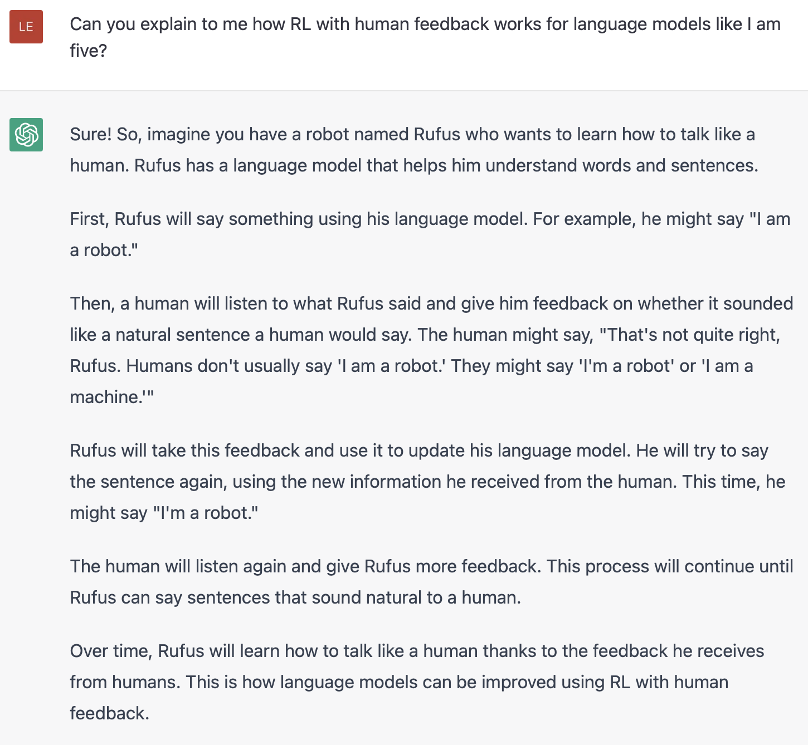

# 図解 Reinforcement Learning from Human Feedback（RLHF）

> 原題: Illustrating Reinforcement Learning from Human Feedback (RLHF)
> 著者: Nathan Lambert, Louis Castricato, Leandro von Werra, Alex Havrilla
> 出典: Hugging Face Blog（2022 年 12 月 9 日公開）

> **訳注（この翻訳について）**
>
> - 底本は Obsidian Web Clipper のクリップ。原ページを `curl` で再取得して照合したところ、本文・図とも欠落はなかった（本文画像は 4 枚で、クリップに残っていた 4 枚と一致）。
> - 除外したもの: 冒頭の他言語訳への案内行（"This article has been translated to Chinese / Vietnamese"）、末尾の Citation・BibTeX・謝辞、およびページ下部の読者コメント欄（Community）。いずれも本文ではないため（skill の Web 記事向け除外規約）。
> - 「Further reading（さらに読む）」は単なる参考文献一覧ではなく、各文献に一行の貢献説明が付いた**注釈つき文献ガイド**であり、RLHF の系譜そのものを述べた本文の一部と判断して訳出した。各項目の URL は収録せず、arXiv 識別子など**文献を特定できる情報のみ**残した。
> - 本文中の外部リンクは、指す先がいずれも技術資料（データセット・リポジトリ・論文・解説記事）で宣伝的なリンクを含まないため、URL をそのまま残した。末尾で言及される講義録画（YouTube）の URL のみ、動画は本文の図表ではないため要約側に参照として記載した。
> - 1 枚目の図は ChatGPT との対話のスクリーンショットである。画像を収録したうえで、後から検索・引用できるよう本文にもテキストとして起こした。対話ログの自然言語は原文のまま残している（プロンプトと応答は一字一句が挙動に効くため）。
> - 原典に図キャプションは存在しない。`<figcaption>` はすべて訳者による説明であり、その旨を「訳注」として明示した。

言語モデル（language model）はこの数年、人間が入力したプロンプトから多様で説得力のあるテキストを生成することで、目覚ましい能力を示してきた。しかし、何が「良い」テキストなのかは本質的に定義しにくい。それは主観的であり、文脈に依存するからである。用途は数多くあり、たとえば物語を書くなら創造性が欲しいし、情報を伝える文章なら真実であってほしいし、コード片なら実行できてほしい。

これらの性質を捉える損失関数（loss function）を書くのは手に負えないように見え、ほとんどの言語モデルはいまだに単純な次トークン予測の損失（たとえば交差エントロピー）で訓練されている。損失そのものの不足を補うために、人々は人間の選好をよりよく捉えるように設計された指標——[BLEU](https://en.wikipedia.org/wiki/BLEU) や [ROUGE](https://en.wikipedia.org/wiki/ROUGE_\(metric\)) のような——を定義してきた。これらは損失関数そのものよりは性能の測定に適しているが、単純なルールで生成テキストを参照文と比較するだけであり、やはり限界がある。生成されたテキストへの人間のフィードバックを性能の尺度として使えたら、さらに一歩進めて、そのフィードバックをモデルを最適化するための損失として使えたら、素晴らしいのではないか。それが Reinforcement Learning from Human Feedback（RLHF, 人間のフィードバックからの強化学習）の発想である。すなわち、強化学習の手法を使って、人間のフィードバックで言語モデルを直接最適化するのである。RLHF によって、一般的なテキストコーパスで訓練されたモデルを、複雑な人間の価値観へと整合（align）させ始めることが可能になった。

RLHF の直近の成功例は、[ChatGPT](https://openai.com/blog/chatgpt/) での利用である。ChatGPT の目覚ましい能力を踏まえて、私たちは ChatGPT 自身に RLHF を説明してもらった。

<figure>

<figcaption>図1（訳注）: 著者らが ChatGPT に「5 歳児にも分かるように RLHF を説明して」と尋ねた対話のスクリーンショット。ロボット Rufus が発話し、人間が「もっと自然な言い方がある」とフィードバックし、Rufus がそれを使ってモデルを更新する、という繰り返しとして説明されている。</figcaption>
</figure>

> **訳注**: 上図の対話を本文にも起こしたもの。プロンプトと応答は原文のまま残す。
>
> **User**: Can you explain to me how RL with human feedback works for language models like I am five?
>
> **ChatGPT**: Sure! So, imagine you have a robot named Rufus who wants to learn how to talk like a human. Rufus has a language model that helps him understand words and sentences.
>
> First, Rufus will say something using his language model. For example, he might say "I am a robot."
>
> Then, a human will listen to what Rufus said and give him feedback on whether it sounded like a natural sentence a human would say. The human might say, "That's not quite right, Rufus. Humans don't usually say 'I am a robot.' They might say 'I'm a robot' or 'I am a machine.'"
>
> Rufus will take this feedback and use it to update his language model. He will try to say the sentence again, using the new information he received from the human. This time, he might say "I'm a robot."
>
> The human will listen again and give Rufus more feedback. This process will continue until Rufus can say sentences that sound natural to a human.
>
> Over time, Rufus will learn how to talk like a human thanks to the feedback he receives from humans. This is how language models can be improved using RL with human feedback.

驚くほどよくできているが、すべてを網羅しているわけではない。その隙間を埋めていこう。

## RLHF: Let's take it step by step（RLHF を一歩ずつ見ていく）

Reinforcement learning from Human Feedback（RL from human preferences とも呼ばれる）は難しい概念である。複数モデルの訓練プロセスを含み、デプロイの段階も異なるからだ。このブログ記事では、訓練プロセスを 3 つの中核ステップに分解する。

1. 言語モデル（LM）の事前学習（pretraining）
2. データを集めて報酬モデル（reward model）を訓練する
3. 強化学習で LM を微調整する

まずは、言語モデルがどのように事前学習されるかを見よう。

#### Pretraining language models（言語モデルの事前学習）

出発点として、RLHF は古典的な事前学習目的ですでに事前学習された言語モデルを使う（詳細はこの[ブログ記事](https://huggingface.co/blog/how-to-train)を参照）。OpenAI は最初の広く知られた RLHF モデルである [InstructGPT](https://openai.com/blog/instruction-following/) に、GPT-3 の小さい版を用いた。共同で発表された論文において、Anthropic はこのタスクのために訓練された 1000 万〜520 億パラメータの transformer モデルを使っている。DeepMind は 2800 億パラメータのモデル [Gopher](https://arxiv.org/abs/2112.11446)（arXiv:2112.11446）まで使ったことを記録している。これらの企業はいずれも、RLHF を用いた自社製品ではもっと大きなモデルを使っている可能性が高い。

この初期モデルは、追加のテキストや条件でさらに微調整**してもよい**が、必ずしもその必要はない。たとえば OpenAI は「望ましい」人間生成テキストで微調整し、Anthropic は自社の「helpful, honest, and harmless（有用・誠実・無害）」基準に関する文脈手がかりを用いて元の LM を蒸留することで RLHF 用の初期 LM を生成した。どちらも、私たちが高価な**拡張（augmented）**データと呼ぶものの出どころだが、RLHF を理解するうえで必須の技法ではない。RLHF のプロセスを始めるうえで核心なのは、**多様な指示にうまく応答するモデル**を持っていることである。

一般に、RLHF の出発点として「どのモデル」が最良かについて明確な答えはない。これは本ブログを通じて繰り返し現れるテーマになる——RLHF 訓練における選択肢の設計空間は、まだ徹底的には探索されていないのである。

次に、言語モデルを手にしたうえで、**報酬モデル**を訓練するためのデータを生成する必要がある。人間の選好がシステムに組み込まれるのは、この報酬モデルを通じてである。

<figure>

<figcaption>図2（訳注）: ステップ 1 の図解。プロンプトとテキストのデータセットから初期言語モデル（Initial Language Model）を訓練する。人間が拡張したテキスト（Human Augmented Text）による追加の微調整は破線で描かれており、任意（Optional）であることを示している。</figcaption>
</figure>

#### Reward model training（報酬モデルの訓練）

人間の選好に較正された報酬モデル（RM。選好モデル (preference model) とも呼ばれる）を作るところから、RLHF における比較的新しい研究が始まる。根底にある目標は、テキストの系列を受け取り、人間の選好を数値的に表現するスカラー報酬を返すモデルないしシステムを得ることである。このシステムは end-to-end の LM でもよいし、報酬を出力するモジュール式のシステム（たとえば、モデルが出力を順位づけし、その順位を報酬に変換する）でもよい。出力が**スカラー報酬**であることは、後段の RLHF プロセスで既存の RL アルゴリズムをシームレスに統合するうえで決定的に重要である。

報酬モデリング用のこれらの LM は、別の微調整済み LM でもよいし、選好データでゼロから訓練した LM でもよい。たとえば Anthropic は、事前学習後にこれらのモデルを初期化するのに特殊な微調整手法（preference model pretraining, PMP）を用いている。微調整よりもサンプル効率が良いと分かったからである。とはいえ、報酬モデルにとって明確に最良と言えるベースモデルは存在しない。

RM 用の「プロンプト–生成」ペアからなる訓練データセットは、あらかじめ定めたデータセットからプロンプト集合をサンプリングして生成される（Anthropic のデータは主に Amazon Mechanical Turk 上のチャットツールで生成され、Hub 上で[公開](https://huggingface.co/datasets/Anthropic/hh-rlhf)されている。OpenAI は GPT API にユーザーが送信したプロンプトを使った）。それらのプロンプトを初期言語モデルに通して、新しいテキストを生成する。

LM が生成したテキスト出力を順位づけするために、人間のアノテータが使われる。報酬モデルを作るには、人間がテキストの各断片に直接スカラーのスコアを付ければよいと最初は思うかもしれないが、実際にはこれは難しい。人間ごとに価値観が異なるため、こうしたスコアは較正されず、ノイズが多くなってしまう。そこで代わりに**順位づけ**を使い、複数モデルの出力を比較して、はるかによく正則化されたデータセットを作る。

テキストを順位づけする方法は複数ある。うまくいった方法のひとつは、同じプロンプトを条件とした 2 つの言語モデルの生成テキストをユーザーに比較させるものである。モデル出力を一対一の対戦形式で比較することで、[Elo](https://en.wikipedia.org/wiki/Elo_rating_system) システムを用いてモデルおよび出力の相対的な順位を生成できる。これらの異なる順位づけ手法は、訓練用にスカラーの報酬信号へと正規化される。

このプロセスの興味深い副産物として、これまで成功している RLHF システムでは、テキスト生成側のモデルに対して報酬言語モデルのサイズがまちまちであることが挙げられる（たとえば OpenAI は 175B の LM に対して 6B の報酬モデル、Anthropic は LM・報酬モデルとも 10B〜52B、DeepMind は LM・報酬モデルの両方に 70B の Chinchilla モデルを使用）。直感的には、これらの選好モデルは、当のテキストを生成するのにモデルが必要とするのと同程度の、テキストを理解する容量を持つ必要があるということだろう。

RLHF システムのこの時点で、私たちはテキスト生成に使える初期言語モデルと、任意のテキストを受け取って人間がそれをどれだけ好ましく感じるかのスコアを付ける選好モデルとを手にしている。次は、**強化学習（RL）**を使って、報酬モデルに関して元の言語モデルを最適化する。

<figure>

<figcaption>図3（訳注）: ステップ 2 の図解。プロンプトのデータセットから多数のプロンプトをサンプリングして初期言語モデルに通し、生成テキストを人間が採点する。出力は相対順位や Elo 等で順位づけされ、その {サンプル, 報酬} のペアで報酬（選好）モデルを訓練する。報酬モデルの出力はスカラー r_θ である。</figcaption>
</figure>

#### Fine-tuning with RL（強化学習による微調整）

強化学習で言語モデルを訓練することは、長らく、工学的にもアルゴリズム的にも不可能だと考えられてきた。複数の組織が機能させることに成功したらしいのは、方策勾配（policy-gradient）型の RL アルゴリズムである Proximal Policy Optimization（PPO, 近位方策最適化）を使って、**初期 LM のコピー**のパラメータの一部または全部を微調整する方式である。LM のパラメータの一部は凍結される。100 億や 1000 億超のパラメータのモデル全体を微調整するのは法外に高価だからである（詳しくは LM 向けの Low-Rank Adaptation（[LoRA](https://arxiv.org/abs/2106.09685)、arXiv:2106.09685）や DeepMind の [Sparrow](https://arxiv.org/abs/2209.14375)（arXiv:2209.14375）を参照）——ただし、これはモデルの規模と使用インフラの規模による。どれだけのパラメータを凍結するか（あるいはしないか）の正確な力学は、未解決の研究課題と見なされている。PPO は比較的長く存在してきたアルゴリズムであり、その仕組みについては[多数](https://spinningup.openai.com/en/latest/algorithms/ppo.html)の[ガイド](https://huggingface.co/blog/deep-rl-ppo)がある。この手法が比較的成熟していたことが、RLHF という新しい応用に向けて分散訓練へスケールアップするうえで好都合な選択肢となった。結局のところ、RLHF を行うための中核的な RL の進歩の多くは、**馴染みのあるアルゴリズムでこれほど大きなモデルをどう更新するか**を解明することだったのである（これについては後述する）。

まず、この微調整タスクを RL 問題として定式化しよう。第一に、**方策（policy）**はプロンプトを受け取ってテキストの系列（あるいは単にテキスト上の確率分布）を返す言語モデルである。この方策の**行動空間（action space）**は言語モデルの語彙に対応する全トークン（多くの場合 5 万トークン程度）であり、**観測空間（observation space）**は取りうる入力トークン系列の分布である。これは RL のこれまでの用途に照らしてもかなり大きい（次元はおよそ「語彙サイズ ^ 入力トークン系列長」となる）。**報酬関数（reward function）**は、選好モデルと方策のずれに対する制約とを組み合わせたものである。

報酬関数は、これまで論じてきたすべてのモデルがひとつの RLHF プロセスに統合される場所である。データセットからのプロンプト $x$ が与えられると、微調整中の方策の現在のイテレーションによってテキスト $y$ が生成される。元のプロンプトと連結されたそのテキストが選好モデルに渡され、選好度合いのスカラー値 $r_{\theta}$ が返される。さらに、RL 方策のトークンごとの確率分布が初期モデルのものと比較され、両者の差に対するペナルティが計算される。OpenAI・Anthropic・DeepMind の複数の論文において、このペナルティは、これらのトークン上の分布系列の間の Kullback–Leibler [(KL) ダイバージェンス](https://en.wikipedia.org/wiki/Kullback%E2%80%93Leibler_divergence)をスケールしたもの $r_{\text{KL}}$ として設計されている。KL ダイバージェンス項は、訓練バッチごとに RL 方策が初期の事前学習モデルから大きく離れることにペナルティを課す。これは、モデルの出力がそれなりに一貫したテキスト断片であり続けることを保証するのに役立つ。このペナルティがないと、最適化は、意味をなさない出鱈目でありながら報酬モデルを騙して高い報酬を得るようなテキストを生成し始めうる。実際には、KL ダイバージェンスは両方の分布からのサンプリングによって近似される（John Schulman による[解説](http://joschu.net/blog/kl-approx.html)がある）。RL の更新則に送られる最終的な報酬は $r = r_{\theta} - \lambda r_{\text{KL}}$ である。

RLHF システムのなかには、報酬関数に追加の項を加えたものもある。たとえば OpenAI は InstructGPT において、（人間のアノテーション集合からの）追加の事前学習勾配を PPO の更新則に混ぜ込む実験に成功している。RLHF の研究が進むにつれ、この報酬関数の定式化も進化し続けるだろう。

最後に、**更新則（update rule）**は、現在のデータバッチにおける報酬指標を最大化する PPO のパラメータ更新である（PPO は on-policy であり、パラメータは現在のバッチのプロンプト–生成ペアのみで更新される）。PPO は信頼領域（trust region）型の最適化アルゴリズムであり、更新ステップが学習プロセスを不安定にしないよう勾配に制約を課す。DeepMind は Gopher に対して同様の報酬設定を用いたが、勾配の最適化には[同期型 advantage actor-critic](http://proceedings.mlr.press/v48/mniha16.html)（A2C）を使った。これは顕著に異なる方式だが、外部での再現はなされていない。

<figure>

<figcaption>図4（訳注）: ステップ 3 の全体図。プロンプト x（例: "A dog is..."）を初期言語モデル（Initial Language Model）と調整中の言語モデル（Tuned Language Model = RL Policy、"Parameters Frozen*" と注記）に与える。RL 方策の出力は報酬（選好）モデルに渡されてスカラー r_θ(y|x) になり、これに KL ペナルティ項 −λ_KL·D_KL(π_PPO(y|x) ‖ π_base(y|x)) を加えたものが、強化学習の更新（例: PPO、θ ← θ + ∇_θ J(θ)）に送られる。</figcaption>
</figure>

*技術的な詳細に関する注記: 上の図では両方のモデルが同じプロンプトに対して異なる応答を生成しているように見えるが、実際に起きているのは、RL 方策がテキストを生成し、そのテキストが初期モデルに入力されて、KL ペナルティ用の相対確率が算出される、ということである。この初期モデルは訓練中の勾配更新によって変更されることはない。*

任意選択として、RLHF はこの時点から、報酬モデルと方策を反復的に一緒に更新していく形で続けることもできる。RL 方策が更新されるにつれて、ユーザーはそれらの出力をモデルの以前のバージョンと比較して順位づけし続けることができる。この操作の実装について論じた論文はまだほとんどない。この種のデータを収集するのに必要なデプロイ形態が、熱心なユーザー基盤にアクセスできる対話エージェントでしか成立しないからである。Anthropic はこの選択肢を **Iterated Online RLHF** として論じており（元の[論文](https://arxiv.org/abs/2204.05862)、arXiv:2204.05862 を参照）、方策の各イテレーションがモデル横断の ELO 順位づけシステムに含められる。これは方策と報酬モデルがともに進化するという複雑な力学をもたらし、複雑で未解決の研究課題を成している。

## Open-source tools for RLHF（RLHF のオープンソースツール）

LM に対して RLHF を行うために最初に公開された[コード](https://github.com/openai/lm-human-preferences)は、2019 年に OpenAI が TensorFlow で公開したものである。

今日では、そこから育った PyTorch 製の RLHF リポジトリがすでにいくつか活発に開発されている。主要なリポジトリは、Transformers Reinforcement Learning（[TRL](https://github.com/lvwerra/trl)）、TRL のフォークとして始まった [TRLX](https://github.com/CarperAI/trlx)、そして Reinforcement Learning for Language models（[RL4LMs](https://github.com/allenai/RL4LMs)）である。

TRL は、Hugging Face エコシステム内の事前学習済み LM を PPO で微調整するために設計されている。TRLX は [CarperAI](https://carper.ai/) が構築した TRL の拡張フォークで、オンライン・オフライン両方の訓練でより大きなモデルを扱えるようにしたものである。現時点で TRLX は、LLM のデプロイに必要な規模（たとえば 330 億パラメータ）で、PPO と Implicit Language Q-Learning（ILQL）による本番運用可能な RLHF ができる API を備えている。TRLX の将来のバージョンでは、最大 2000 億パラメータの言語モデルまで扱えるようになる予定である。そのため、TRLX とのやりとりは、この規模の経験を持つ機械学習エンジニア向けに最適化されている。

[RL4LMs](https://github.com/allenai/RL4LMs) は、多様な RL アルゴリズム（PPO, NLPO, A2C, TRPO）・報酬関数・指標を用いて LLM を微調整・評価するための構成要素を提供する。さらに、このライブラリは容易にカスタマイズでき、任意のユーザー指定の報酬関数で、任意の encoder-decoder または encoder 型の transformer ベース LM を訓練できる。特筆すべきは、[最近の研究](https://arxiv.org/abs/2210.01241)（arXiv:2210.01241）において幅広いタスクで十分にテスト・ベンチマークされており、合計 2000 件に及ぶ実験から、データ予算の比較（専門家のデモンストレーション vs 報酬モデリング）、reward hacking と訓練の不安定性への対処など、いくつもの実践的知見が示されている点である。RL4LMs の現在の計画には、より大きなモデルの分散訓練と新しい RL アルゴリズムが含まれる。

TRLX と RL4LMs はいずれも活発に開発が続いているので、近いうちにこれら以外の機能も増えると期待してよい。

Anthropic が作成した大規模な[データセット](https://huggingface.co/datasets/Anthropic/hh-rlhf)が Hub 上で利用できる。

## What's next for RLHF?（RLHF の次に来るもの）

これらの技術は極めて有望かつ影響力があり、AI の最大手研究機関の注目を集めてきたが、明確な限界もなお残っている。モデルは以前よりは良くなったとはいえ、有害だったり事実として不正確だったりするテキストを、何の不確実性の表明もなく出力しうる。この不完全性は長期的な課題であり、同時に RLHF の動機でもある——本質的に人間的な問題領域で動くということは、モデルが**完成**したと呼べるような明確な最終ラインが決して存在しないということだからである。

RLHF を使うシステムをデプロイするとき、人間の選好データを集めるのはかなり高価である。訓練ループの外にいる人間の作業者を直接組み込む必要があるからだ。RLHF の性能は、その人間のアノテーションの品質によって決まる。アノテーションには 2 種類ある——InstructGPT における初期 LM の微調整のような人間生成テキストと、モデル出力間の人間の選好ラベルである。

特定のプロンプトに答えるよく書かれた人間のテキストを生成するのは非常に高くつく。（製品のユーザーやクラウドソーシングに頼るのではなく）パートタイムのスタッフを雇う必要が多いためである。ありがたいことに、RLHF のほとんどの応用で報酬モデルの訓練に使われるデータの規模（ラベル付き選好サンプル約 5 万件）は、それほど高価ではない。とはいえ、大学の研究室が捻出できるであろう額よりは高いコストである。現在のところ、汎用言語モデルに対する RLHF 用の大規模データセットは（[Anthropic](https://huggingface.co/datasets/Anthropic/hh-rlhf) のものが）1 つ存在するだけで、あとは小規模なタスク特化のデータセットがいくつか（[OpenAI](https://github.com/openai/summarize-from-feedback) の要約データなど）あるにすぎない。RLHF のデータに関する第 2 の課題は、人間のアノテータがしばしば意見を異にすることであり、これは正解（ground truth）が存在しないまま訓練データに相当な分散を持ち込むことになる。

こうした限界がある一方で、まだ探索されていない膨大な設計上の選択肢が、RLHF を大きく前進させうる。その多くは RL 最適化器の改善という領域に属する。PPO は比較的古いアルゴリズムだが、他のアルゴリズムが既存の RLHF ワークフローに利点や変種をもたらせない構造的な理由は何もない。LM 方策を微調整するフィードバック部分の大きなコストのひとつは、方策が生成するテキストのすべてを報酬モデルで評価しなければならないこと（報酬モデルは標準的な RL の枠組みでは環境の一部として振る舞うため）である。大きなモデルのこうした高価な順伝播を避けるために、方策の最適化器としてオフライン RL を使うこともできる。最近では、この種の最適化に特によく適合する新しいアルゴリズムが登場している。たとえば implicit language Q-learning（ILQL、arXiv:2206.11871）である〔CarperAI による ILQL の講演もある〕。探索と活用（exploration-exploitation）のバランスのような、RL プロセスにおける他の中核的なトレードオフも、まだ文書化されていない。これらの方向を探索すれば、少なくとも RLHF がどう機能するかについての実質的な理解が深まるだろうし、そうでなくとも性能の改善は得られるだろう。

私たちは 2022 年 12 月 13 日（火）に、この記事を拡張した講義を開催した。録画を視聴できる。

#### Further reading（さらに読む）

以下は、現在までの RLHF に関する最も主要な論文のリストである。この分野は DeepRL の登場（2017 年ごろ）とともに最近になって広まり、多くの大手テクノロジー企業による LLM の応用というより広い研究へと成長してきた。まずは、LM に焦点を当てるより前の RLHF に関する論文をいくつか挙げる。

- **TAMER: Training an Agent Manually via Evaluative Reinforcement**（Knox and Stone 2008）: 人間が、取られた行動に対して反復的にスコアを与えることで報酬モデルを学習する、学習エージェントを提案した。
- **Interactive Learning from Policy-Dependent Human Feedback**（MacGlashan et al. 2017）: 人間のフィードバック（肯定・否定の両方）を advantage 関数の調整に用いる actor-critic アルゴリズム COACH を提案した。
- **Deep Reinforcement Learning from Human Preferences**（Christiano et al. 2017）: Atari の trajectory 間の選好に RLHF を適用した。
- **Deep TAMER: Interactive Agent Shaping in High-Dimensional State Spaces**（Warnell et al. 2018）: 報酬予測のモデル化に深層ニューラルネットワークを用いるかたちで TAMER の枠組みを拡張した。
- **A Survey of Preference-based Reinforcement Learning Methods**（Wirth et al. 2017）: 上記の取り組みを、はるかに多くの参考文献とともに総括している。

そして以下は、LM に対する RLHF の性能を示す「主要」論文の増えつつある集合のスナップショットである。

- **Fine-Tuning Language Models from Human Preferences**（Zieglar et al. 2019、arXiv:1909.08593）: 4 つの特定タスクにおける報酬学習の影響を研究した初期の論文。
- **Learning to summarize with human feedback**（Stiennon et al., 2020）: テキスト要約のタスクに RLHF を適用した。また **Recursively Summarizing Books with Human Feedback**（OpenAI Alignment Team 2021、arXiv:2109.10862）は、書籍の要約に関するその後続研究。
- **WebGPT: Browser-assisted question-answering with human feedback**（OpenAI, 2021、arXiv:2112.09332）: RLHF を用いて Web をナビゲートするエージェントを訓練した。
- **InstructGPT: Training language models to follow instructions with human feedback**（OpenAI Alignment Team 2022、arXiv:2203.02155）: 汎用言語モデルに RLHF を適用した〔InstructGPT のブログ記事もある〕。
- **GopherCite: Teaching language models to support answers with verified quotes**（Menick et al. 2022）: 検証済みの引用つきで回答を返すよう、RLHF で LM を訓練した。
- **Sparrow: Improving alignment of dialogue agents via targeted human judgements**（Glaese et al. 2022、arXiv:2209.14375）: 対話エージェントを RLHF で微調整した。
- **ChatGPT: Optimizing Language Models for Dialogue**（OpenAI 2022）: 汎用チャットボットとしての利用に適するよう、RLHF で LM を訓練した。
- **Scaling Laws for Reward Model Overoptimization**（Gao et al. 2022、arXiv:2210.10760）: RLHF において学習された選好モデルのスケーリング特性を研究した。
- **Training a Helpful and Harmless Assistant with Reinforcement Learning from Human Feedback**（Anthropic, 2022、arXiv:2204.05862）: RLHF で LM アシスタントを訓練した詳細な記録。
- **Red Teaming Language Models to Reduce Harms: Methods, Scaling Behaviors, and Lessons Learned**（Ganguli et al. 2022、arXiv:2209.07858）: 〔言語モデルの〕潜在的に有害な出力を「発見し、測定し、削減しようとする」取り組みの詳細な記録。
- **Dynamic Planning in Open-Ended Dialogue using Reinforcement Learning**（Cohen at al. 2022、arXiv:2208.02294）: オープンエンドな対話エージェントの会話スキルを高めるために RL を用いた。
- **Is Reinforcement Learning (Not) for Natural Language Processing?: Benchmarks, Baselines, and Building Blocks for Natural Language Policy Optimization**（Ramamurthy and Ammanabrolu et al. 2022、arXiv:2210.01241）: RLHF におけるオープンソースツールの設計空間を論じ、PPO の代替として新しいアルゴリズム NLPO（Natural Language Policy Optimization）を提案した。
- **Llama 2**（Touvron et al. 2023、arXiv:2307.09288）: RLHF の詳細を相当量含む、影響力の大きいオープンアクセスのモデル。

この分野は複数の分野の合流点にあるので、他の領域にも資料を見つけることができる。

- 指示の継続学習（[Kojima et al. 2021](https://arxiv.org/abs/2108.04812)、arXiv:2108.04812／[Suhr and Artzi 2022](https://arxiv.org/abs/2212.09710)、arXiv:2212.09710）や、ユーザーフィードバックからのバンディット学習（Sokolov et al. 2016、arXiv:1601.04468／Gao et al. 2022、arXiv:2203.10079）。
- テキスト生成に他の RL アルゴリズムを用いた、より初期の歴史（必ずしも人間の選好を伴わないもの）。たとえば再帰型ニューラルネットワークを用いたもの（Ranzato et al. 2015、arXiv:1511.06732）、テキスト予測のための actor-critic アルゴリズム（Bahdanau et al. 2016、arXiv:1607.07086）、この枠組みに人間の選好を加えた初期の研究（Nguyen et al. 2017、arXiv:1707.07402）。
