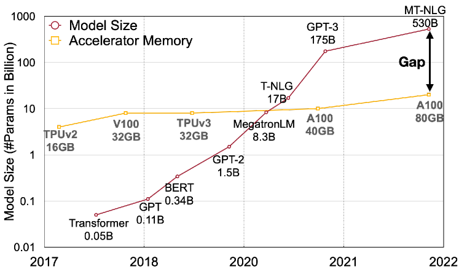
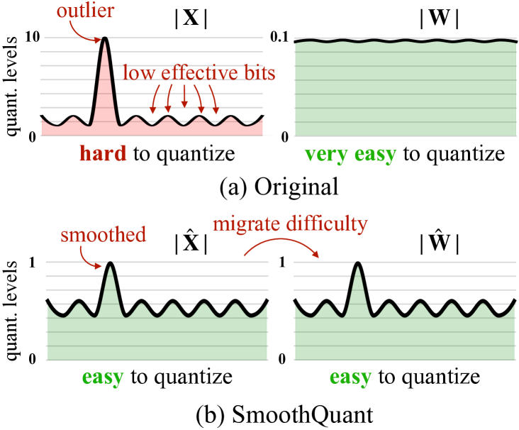
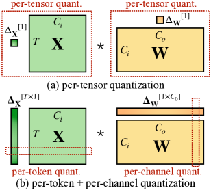
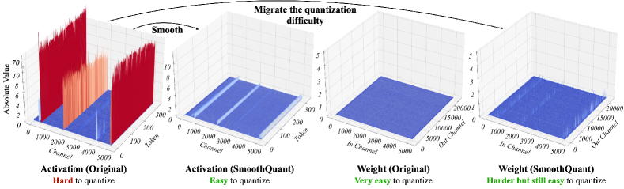
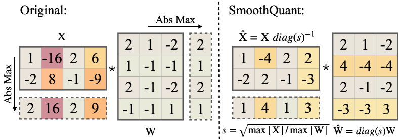
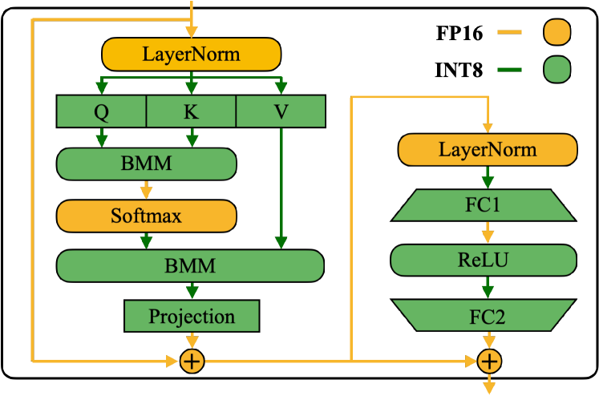
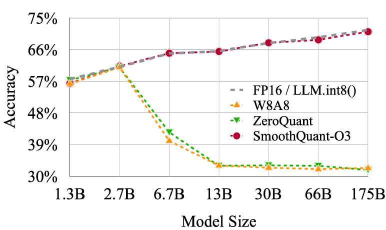
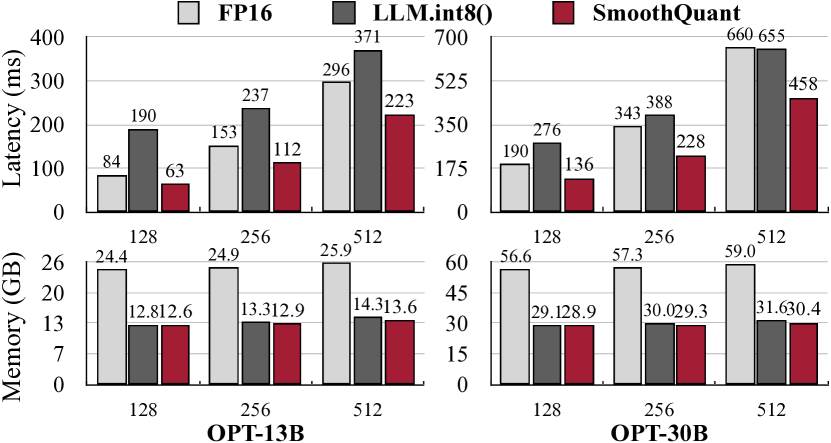
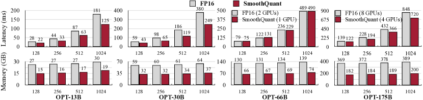
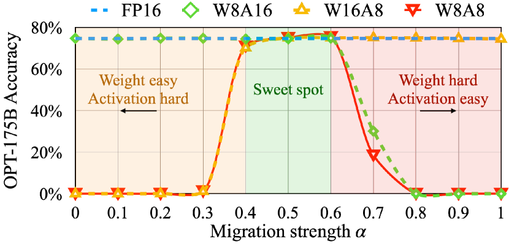

# SmoothQuant: 大規模言語モデルのための正確かつ効率的な訓練後量子化

> 原題: SmoothQuant: Accurate and Efficient Post-Training Quantization for Large Language Models
> 著者: Guangxuan Xiao, Ji Lin, Mickael Seznec, Hao Wu, Julien Demouth, Song Han
> 出典: arXiv:2211.10438（ICML 2023）・原典クリップ `raw/papers/SmoothQuant_ Accurate and Efficient Post-Training Quantization for Large Language Models.md`（ar5iv 版）
> コード: https://github.com/mit-han-lab/smoothquant

---

> **訳注**
>
> 底本は ar5iv（`https://ar5iv.labs.arxiv.org/html/2211.10438`）を Obsidian Web Clipper で保存した markdown。原ページと照合したところ、**クリップは健全**であった——画像は 10 枚すべて（`x1.png`〜`x10.png`）が所定の位置に残り、Figure 1〜10 と Table 1〜10 のキャプションもすべて揃っており、本文の切断も見当たらなかった。
>
> HTML の表 2 つ（Table 7・Table 10）は `<math><semantics>` のノイズを除去して markdown の表へ変換した。
>
> 参考文献一覧（References）と謝辞（Acknowledgements）は既定どおり訳出していない。**付録 A は全訳した（圧縮箇所はない）**。本文中の引用は原典クリップの脚注番号 `[^N]` をそのまま維持している。

---

## Abstract（要旨）

大規模言語モデル（LLM）は優れた性能を示すが、計算とメモリを大量に消費する。量子化はメモリを削減し推論を加速しうる。しかし既存の手法は、精度とハードウェア効率を同時に維持できない。我々は **SmoothQuant** を提案する。これは訓練不要・精度保存・汎用の訓練後量子化（PTQ）の解であり、LLM に対する 8 ビット重み・8 ビット活性（**W8A8**）の量子化を可能にする。**重みは量子化しやすいが活性はそうでない**という事実に基づき、SmoothQuant は**数学的に等価な変換によって、量子化の難しさを活性からオフラインで重みへ移す**ことで、活性の外れ値を平滑化する。SmoothQuant は、OPT・BLOOM・GLM・MT-NLG・LLaMA ファミリーを含む LLM のすべての行列積に対して、重みと活性の両方の INT8 量子化を可能にする。我々は無視できる精度の損失で、LLM について最大 1.56 倍の高速化と 2 倍のメモリ削減を実証する。SmoothQuant は 530B の LLM を単一ノード内で提供することを可能にする。我々の仕事は、ハードウェアコストを削減し LLM を民主化するターンキーの解を提供する。

## 1 Introduction（はじめに）

大規模言語モデル（LLM）はさまざまなタスクで優れた性能を示す [^3] [^42]。しかし LLM を提供することは、その巨大なモデルサイズのため予算とエネルギーを消費する。たとえば GPT-3 [^3] モデルは 1750 億パラメータを含み、FP16 で格納し実行するには少なくとも 350GB のメモリを消費し、推論だけのために 8 台の 48GB A6000 GPU か 5 台の 80GB A100 GPU を必要とする。膨大な計算と通信のオーバーヘッドのため、推論のレイテンシも現実の応用には受け入れがたいものになりうる。**量子化**は LLM のコストを削減する有望な方法である [^6] [^38]。**重みと活性**を低ビットの整数で量子化することにより、GPU のメモリ要求をサイズと帯域の両面で減らし、計算集約的な演算（すなわち線形層の GEMM、attention の BMM）を加速できる。たとえば重みと活性の INT8 量子化は、FP16 と比べて GPU のメモリ使用量を半減し、行列積のスループットをほぼ倍増させうる。

<figure>

<figcaption>図1: 大規模言語モデルのモデルサイズは近年 GPU メモリより速いペースで発展しており、メモリの需要と供給の間に大きなギャップを生んでいる。量子化とモデル圧縮の技法はそのギャップを埋める助けになりうる。</figcaption>
</figure>

しかし CNN モデルや BERT [^7] のようなより小さなトランスフォーマーモデルと異なり、LLM の**活性**は量子化が難しい。LLM を 67 億パラメータを超えてスケールすると、大きな大きさを持つ**体系的な外れ値**が活性に創発し [^6]、大きな量子化誤差と精度の劣化を招く。ZeroQuant [^38] は動的な per-token の活性量子化と group-wise の重み量子化（Figure 3・Sec. 2 で定義）を適用する。これは効率的に実装でき、GPT-3-350M と GPT-J-6B に対しては良い精度をもたらす。しかし 1750 億パラメータの大きな OPT モデルの精度は維持できない（Section 5.2 参照）。LLM.int8() [^6] はさらに**混合精度分解**（すなわち外れ値を FP16 に保ち、他の活性に INT8 を使う）を導入することでその精度の問題に対処する。しかし**この分解をハードウェアアクセラレータ上で効率的に実装するのは難しい**。したがって、**効率的**で**ハードウェアに優しく**、できれば**訓練不要**な、LLM 向けの量子化方式を導くことは未解決の課題である。

我々は SmoothQuant を提案する。これは LLM 向けの正確かつ効率的な訓練後量子化（PTQ）の解である。SmoothQuant は鍵となる観察に依拠する: **外れ値の存在のせいで活性は重みよりはるかに量子化しにくいが [^6]、異なるトークンはそのチャネルにわたって似た変動を示す。**

<figure>

<figcaption>図2: SmoothQuant の直観。活性 X は、外れ値が量子化の範囲を引き伸ばして大半の値に有効なビットをほとんど残さないため、量子化しにくい。我々はオフラインの間にスケールの分散を活性から重み W へ移し、活性の量子化の難しさを減らす。平滑化された活性 X̂ と調整された重み Ŵ はいずれも量子化しやすい。</figcaption>
</figure>

この観察に基づき、SmoothQuant は量子化の難しさを活性からオフラインで重みへ移す（Figure 2）。SmoothQuant は、チャネルにわたる大きさを大幅に平滑化してモデルを量子化に適したものにする、**数学的に等価な per-channel のスケーリング変換**を提案する。SmoothQuant はさまざまな量子化方式と互換なので、我々は SmoothQuant に対して 3 つの効率水準の量子化設定を実装する（Table 2 の O1〜O3 を参照）。実験は SmoothQuant がハードウェア効率的であることを示す: OPT-175B [^42]、BLOOM-176B [^27]、GLM-130B [^41]、MT-NLG 530B [^30] の性能を維持でき、PyTorch 上で最大 1.51 倍の高速化と 1.96 倍のメモリ節約をもたらす。SmoothQuant は実装が容易である。我々は SmoothQuant を最先端のトランスフォーマー提供フレームワークである FasterTransformer へ統合し、FP16 と比べて最大 1.56 倍の高速化とメモリ使用量の半減を達成する。特筆すべきことに、SmoothQuant は 530B のような大きなモデルを**半分の数の GPU** で提供することを可能にする。

## 2 Preliminaries（準備）

量子化は高精度の値を離散的な水準へ写像する。我々はハードウェア支援と効率のため、整数の一様量子化 [^13]（具体的には INT8）を研究する。量子化の過程は次のように表せる:

$$
\bar{\mathbf{X}}^{\text{INT8}}=\lceil\frac{\mathbf{X^{\text{FP16}}}}{\Delta}\rfloor,\quad\Delta=\frac{\max(|\mathbf{X}|)}{2^{N-1}-1},
$$

ここで $\mathbf{X}$ は浮動小数点のテンソル、$\bar{\mathbf{X}}$ はその量子化された対応物、$\Delta$ は量子化のステップサイズ、$\lceil\cdot\rfloor$ は丸め関数、$N$ はビット数（我々の場合は 8）である。簡単のためテンソルは 0 に関して**対称**であると仮定する。非対称の場合（たとえば ReLU の後）についても、ゼロ点を加えれば議論は同様である [^13]。

このような量子化器は $\Delta$ の計算に最大絶対値を用いるので、精度にとって重要であることが分かっている活性の外れ値を保存する [^6]。我々はいくつかの較正サンプルの活性を用いて $\Delta$ をオフラインで計算できる。これを**静的量子化**と呼ぶ。あるいは活性の実行時の統計を使って $\Delta$ を得ることもできる。これを**動的量子化**と呼ぶ。

<figure>

<figcaption>図3: per-tensor・per-token・per-channel の量子化の定義。per-tensor の量子化は実装が最も効率的である。vector-wise の量子化が INT8 の GEMM カーネルを効率的に活用するには、外側の次元（すなわちトークン次元 T と出力チャネル次元 Co）からのスケーリング係数しか使えず、内側の次元（すなわち入力チャネル次元 Ci）は使えない。</figcaption>
</figure>

Figure 3 に示すように、量子化には異なる粒度の水準がある。**per-tensor** の量子化は行列全体に単一のステップサイズを用いる。各トークンに関連づけられた活性ごとに異なる量子化ステップサイズを使う（**per-token** 量子化）か、重みの各出力チャネルごとに使う（**per-channel** 量子化）ことで、さらに細粒度な量子化を可能にできる。per-channel 量子化の粗い版は、異なるチャネル群に対して異なる量子化ステップを使うもので、**group-wise** 量子化と呼ばれる [^28] [^38]。

トランスフォーマー [^32] の線形層 $\mathbf{Y}=\mathbf{X}\cdot\mathbf{W},\mathbf{Y}\in\mathbb{R}^{T\times C_{o}},\mathbf{X}\in\mathbb{R}^{T\times C_{i}},\mathbf{W}\in\mathbb{R}^{C_{i}\times C_{o}}$（$T$ はトークン数、$C_{i}$ は入力チャネル、$C_{o}$ は出力チャネル。Figure 3 参照、簡単のためバッチ次元は省略）については、重みを INT8 へ量子化することで FP16 と比べて格納量を半減できる。しかし**推論を加速するには、幅広いハードウェア（NVIDIA GPU、Intel CPU、Qualcomm DSP 等）がサポートする整数カーネル（例: INT8 GEMM）を活用するために、重みと活性の両方を INT8 へ量子化する（すなわち W8A8）必要がある**。

<figure>

<figcaption>図4: SmoothQuant の前後における OPT-13B の線形層の入力活性と重みの大きさ。観察: (1) 元の活性マップには大きさが非常に大きい（70 を超える）チャネルがいくつかある、(2) 1 つの活性チャネル内の分散は小さい、(3) 元の重みの分布は平坦で一様である。SmoothQuant は外れ値のチャネルを活性から重みへ移す。最終的に、活性の外れ値は大きく平滑化される一方、重みは依然としてかなり滑らかで平坦なままである。</figcaption>
</figure>

## 3 Review of Quantization Difficulty（量子化の難しさの再検討）

LLM は活性の外れ値のために量子化が難しいことで知られている [^6] [^36] [^2]。我々はまず活性量子化の難しさを再検討し、外れ値の中のパターンを探す。大きな量子化誤差を持つ線形層の入力活性と重みを Figure 4（左）に可視化する。手法の動機となるいくつかのパターンが見出せる:

1. **活性は重みより量子化が難しい。** 重みの分布はかなり一様で平坦であり、量子化しやすい。先行研究は、LLM の重みを INT8 あるいは INT4 で量子化しても精度が劣化しないことを示しており [^6] [^38] [^41]、これは我々の観察と一致する。

2. **外れ値が活性の量子化を難しくする。** 活性における外れ値のスケールは、大半の活性値より **約 100 倍**大きい。per-tensor 量子化（式 1）の場合、大きな外れ値が最大の大きさの測定を支配し、外れ値でないチャネルに対する**実効的な量子化ビット／水準**（Figure 2）を低くしてしまう。チャネル $i$ の最大の大きさを $m_{i}$、行列全体の最大値を $m$ とすると、チャネル $i$ の実効的な量子化水準は $2^{8}\cdot m_{i}/m$ である。**外れ値でないチャネルに対しては、実効的な量子化水準は非常に小さく（2〜3）なり**、大きな量子化誤差を招く。

3. **外れ値は固定されたチャネルに持続的に現れる。** 外れ値は**チャネル**のごく一部に現れる。あるチャネルに外れ値があれば、それはすべてのトークンにわたって持続的に現れる（Figure 4、赤）。あるトークンについてのチャネル間の分散は大きい（一部のチャネルの活性は非常に大きいが大半は小さい）が、**あるチャネルのトークンをまたいだ大きさの分散は小さい**（外れ値のチャネルは一貫して大きい）。

**表1**: 異なる活性量子化の方式のうち、精度を保つのは per-channel の量子化 [^2] だけだが、これは INT8 の GEMM カーネルと互換で**ない**（灰色で示す）。WinoGrande・HellaSwag・PIQA・LAMBADA の平均精度を報告する。

| Model size (OPT-) | 6.7B | 13B | 30B | 66B | 175B |
| --- | --- | --- | --- | --- | --- |
| FP16 | 64.9% | 65.6% | 67.9% | 69.5% | 71.6% |
| INT8 per-tensor | 39.9% | 33.0% | 32.8% | 33.1% | 32.3% |
| INT8 per-token | 42.5% | 33.0% | 33.1% | 32.9% | 31.7% |
| INT8 per-channel | 64.8% | 65.6% | 68.0% | 69.4% | 71.4% |

外れ値の持続性と各チャネル内の小さな分散のために、活性の **per-channel** 量子化 [^2]（すなわちチャネルごとに異なる量子化ステップを使うこと）を行えれば、量子化誤差は per-tensor 量子化と比べてはるかに小さくなる一方、**per-token 量子化はほとんど役に立たない**。Table 1 で我々は、模擬的な per-channel の活性量子化が FP16 のベースラインとの精度差を実際に埋めるという仮定を検証しており、これは [^2] の知見と一致する。

**しかし per-channel の活性量子化は、ハードウェアで加速される GEMM カーネルにうまく写像されない。** これらのカーネルは高スループットで実行される一連の演算（例: Tensor Core の MMA）に依存しており、その列の中により低スループットの命令（例: 変換や CUDA Core の FMA）が挿入されることを許容しない。これらのカーネルでは、スケーリングは行列積の**外側の次元**（すなわち活性のトークン次元 $T$、重みの出力チャネル次元 $C_{o}$。Figure 3 参照）に沿ってのみ行え、行列積が終わった後に適用できる:

$$
\mathbf{Y}=\text{diag}(\mathbf{\Delta}_{\mathbf{X}}^{\text{FP16}})\cdot(\mathbf{\bar{X}}^{\text{INT8}}\cdot\mathbf{\bar{W}}^{\text{INT8}})\cdot\text{diag}(\mathbf{\Delta}_{\mathbf{W}}^{\text{FP16}})
$$

したがって先行研究はすべて線形層に per-token の活性量子化を用いている [^6] [^38] が、それらは活性量子化の難しさに対処できていない（per-tensor よりわずかに良いだけである）。

## 4 SmoothQuant

（実行不可能な）per-channel の活性量子化の代わりに、我々は入力活性を **per-channel の平滑化係数** $\mathbf{s}\in\mathbb{R}^{C_{i}}$ で割ることによって「平滑化する」ことを提案する。線形層の数学的等価性を保つため、重みを逆方向へ対応してスケールする:

$$
\mathbf{Y}=(\mathbf{X}\text{diag}(\mathbf{s})^{-1})\cdot(\text{diag}(\mathbf{s})\mathbf{W})=\hat{\mathbf{X}}\hat{\mathbf{W}}
$$

入力 $\mathbf{X}$ は通常それ以前の線形演算（例: 線形層、layer norm 等）から生成されるので、平滑化係数を先行する層のパラメータへオフラインで容易に融合でき、余分なスケーリングによるカーネル呼び出しのオーバーヘッドを生じさせない。入力が残差の加算から来るような他の場合には、[^36] と同様に残差の枝へ追加のスケーリングを加えることができる。

#### Migrate the quantization difficulty from activations to weights.（量子化の難しさを活性から重みへ移す）

我々は $\hat{\mathbf{X}}=\mathbf{X}\text{diag}(\mathbf{s})^{-1}$ が量子化しやすくなるように per-channel の平滑化係数 $\mathbf{s}$ を選びたい。量子化誤差を減らすには、**すべてのチャネルについて実効的な量子化ビットを増やす**べきである。総実効量子化ビットは、すべてのチャネルが同じ最大の大きさを持つときに最大になる。したがって素直な選択は $\mathbf{s}_{j}=\max(|\mathbf{X}_{j}|),j=1,2,...,C_{i}$（$j$ は $j$ 番目の入力チャネル）である。この選択は、割った後にすべての活性チャネルが同じ最大値を持つことを保証し、量子化しやすくする。活性の範囲は動的であり、入力サンプルによって変わることに注意されたい。ここでは事前学習データセットからの較正サンプルを使って活性チャネルのスケールを推定する [^13]。しかしこの式は**すべて**の量子化の難しさを重みへ押しつける。この場合、重みに対する量子化誤差が大きくなることが分かる。

<figure>

<figcaption>図5: α が 0.5 のときの SmoothQuant の主要なアイデア。平滑化係数 s は較正サンプル上で得られ、変換全体はオフラインで実行される。実行時には、活性はスケーリングなしに平滑である。</figcaption>
</figure>

そこで我々は、活性から重みへどれだけの難しさを移したいかを制御するハイパーパラメータ **migration strength（移行強度）** $\alpha$ を導入し、次の式を使う:

$$
\mathbf{s}_{j}=\max(|\mathbf{X}_{j}|)^{\alpha}/\max(|\mathbf{W}_{j}|)^{1-\alpha}
$$

ほとんどのモデル、たとえばすべての OPT [^42] と BLOOM [^27] のモデルについて、**$\alpha=0.5$ が量子化の難しさを均等に分ける、バランスの取れた点**であることが分かる。とくに重みと活性に同じ量子化器（例: per-tensor、静的量子化）を使う場合にそうである。この式は、対応するチャネルにおける重みと活性が似た最大値を共有することを保証し、したがって同じ量子化の難しさを共有させる。Figure 5 は $\alpha=0.5$ を取ったときの平滑化変換を図示している。活性の外れ値がより顕著な他のモデル（たとえば GLM-130B [^41] は約 30% の外れ値を持ち、活性の量子化がより難しい）については、より多くの量子化の難しさを重みへ移すために**より大きな $\alpha$（0.75 など）を選べる**。

<figure>

<figcaption>図6: トランスフォーマーブロックに対する SmoothQuant の精度の対応づけ。線形層や batched matmul（BMM）のような計算集約的な演算子はすべて INT8 の算術を用いる。</figcaption>
</figure>

#### Applying SmoothQuant to Transformer blocks.（トランスフォーマーブロックへ SmoothQuant を適用する）

線形層は LLM モデルのパラメータと計算の大半を占める。既定では、self-attention とフィードフォワード層の入力活性に対してスケールの平滑化を行い、すべての線形層を W8A8 で量子化する。attention 計算における BMM 演算子も量子化する。トランスフォーマーブロックに対する量子化のフローを Figure 6 に設計する。線形層や attention 層の BMM のような計算の重い演算子の入力と重みを INT8 で量子化する一方、ReLU・Softmax・LayerNorm のような他の軽量な要素ごとの演算については活性を FP16 に保つ。この設計は精度と推論効率のバランスを取るのに役立つ。

## 5 Experiments（実験）

### 5.1 Setups（設定）

#### Baselines.（ベースライン）

**表2**: ベースラインと SmoothQuant の量子化設定。特記しない限り、すべての重みと活性は INT8 の表現を用いる。SmoothQuant については、効率は O1 から O3 へ向かって改善する（すなわちレイテンシが下がる）。

| Method | Weight | Activation |
| --- | --- | --- |
| W8A8 | per-tensor | per-tensor dynamic |
| ZeroQuant | group-wise | per-token dynamic |
| LLM.int8() | per-channel | per-token dynamic+FP16 |
| Outlier Suppression | per-tensor | per-tensor static |
| SmoothQuant-O1 | per-tensor | per-token dynamic |
| SmoothQuant-O2 | per-tensor | per-tensor dynamic |
| SmoothQuant-O3 | per-tensor | per-tensor static |

我々は INT8 の訓練後量子化の設定、すなわちモデルパラメータの再訓練なしの設定において、4 つのベースラインと比較する: W8A8 の素朴な量子化、ZeroQuant [^38]、LLM.int8() [^6]、Outlier Suppression [^36] である。SmoothQuant は量子化方式に対して直交なので、O1 から O3 へと段階的に積極的かつ効率的な量子化水準を提供する。ベースラインと SmoothQuant の詳細な量子化方式を Table 2 に示す。

**表3**: SmoothQuant は最も積極的かつ最も効率的な O3 の設定（Table 2）であっても、INT8 量子化後の OPT-175B モデルの精度を維持する。7 つの zero-shot ベンチマーク（平均精度を報告）と 1 つの言語モデリングのベンチマーク（パープレキシティ）で広範にベンチマークした。\*ZeroQuant については、self-attention の入力活性を FP16 に残して残りを INT8 へ量子化する——これは彼らの GPT-NeoX-20B に対する解である——ことも試したが、これは OPT-175B の精度劣化を解決しない。

| *OPT-175B* | LAMBADA | HellaSwag | PIQA | WinoGrande | OpenBookQA | RTE | COPA | Average ↑ | WikiText ↓ |
| --- | --- | --- | --- | --- | --- | --- | --- | --- | --- |
| FP16 | 74.7% | 59.3% | 79.7% | 72.6% | 34.0% | 59.9% | 88.0% | 66.9% | 10.99 |
| W8A8 | 0.0% | 25.6% | 53.4% | 50.3% | 14.0% | 49.5% | 56.0% | 35.5% | 93080 |
| ZeroQuant | 0.0%\* | 26.0% | 51.7% | 49.3% | 17.8% | 50.9% | 55.0% | 35.8% | 84648 |
| LLM.int8() | 74.7% | 59.2% | 79.7% | 72.1% | 34.2% | 60.3% | 87.0% | 66.7% | 11.10 |
| Outlier Suppression | 0.00% | 25.8% | 52.5% | 48.6% | 16.6% | 53.4% | 55.0% | 36.0% | 96151 |
| SmoothQuant-O1 | 74.7% | 59.2% | 79.7% | 71.2% | 33.4% | 58.1% | 89.0% | 66.5% | 11.11 |
| SmoothQuant-O2 | 75.0% | 59.0% | 79.2% | 71.2% | 33.0% | 59.6% | 88.0% | 66.4% | 11.14 |
| SmoothQuant-O3 | 74.6% | 58.9% | 79.7% | 71.2% | 33.4% | 59.9% | 90.0% | 66.8% | 11.17 |

**表4**: SmoothQuant は異なる LLM に対して機能する。公開されている最大の 3 つの LLM モデルを、精度を劣化させずに INT8 へ量子化できる。OPT-175B と BLOOM-176B については WinoGrande・HellaSwag・PIQA・LAMBADA の平均精度を示す。GLM-130B については LAMBADA・MMLU・MNLI・QNLI の平均精度を示す。\*データセットが異なるため精度は列方向に比較できない。

| Method | OPT-175B | BLOOM-176B | GLM-130B\* |
| --- | --- | --- | --- |
| FP16 | 71.6% | 68.2% | 73.8% |
| W8A8 | 32.3% | 64.2% | 26.9% |
| ZeroQuant | 31.7% | 67.4% | 26.7% |
| LLM.int8() | 71.4% | 68.0% | 73.8% |
| Outlier Suppression | 31.7% | 54.1% | 63.5% |
| SmoothQuant-O1 | 71.2% | 68.3% | 73.7% |
| SmoothQuant-O2 | 71.1% | 68.4% | 72.5% |
| SmoothQuant-O3 | 71.1% | 67.4% | 72.8% |

#### Models and datasets.（モデルとデータセット）

我々は SmoothQuant を評価するのに 3 つの LLM のファミリーを選ぶ: OPT [^42]、BLOOM [^27]、GLM-130B [^41] である。OPT と BLOOM モデルの評価には 7 つの zero-shot 評価タスク——LAMBADA [^21]、HellaSwag [^40]、PIQA [^1]、WinoGrande [^26]、OpenBookQA [^19]、RTE [^33]、COPA [^25]——と 1 つの言語モデリングデータセット WikiText [^18] を用いる。GLM-130B モデルの評価には MMLU [^12]、MNLI [^37]、QNLI [^33]、LAMBADA を用いる。前述のベンチマークの一部が GLM-130B の訓練セットに現れるためである。OPT と BLOOM モデルの評価には lm-eval-harness を、GLM-130B にはその公式リポジトリを用いる。最後に、我々は手法を MT-NLG 530B [^30] へスケールアップし、500B 超のモデルを単一ノード内で提供することを初めて可能にする。我々は**相対的な**性能に焦点を当てていることに注意されたい。

#### Activation smoothing.（活性の平滑化）

移行強度 $\alpha=0.5$ はすべての OPT と BLOOM のモデルに対する一般的な適所であり、GLM-130B については活性の量子化がより難しいため $\alpha=0.75$ である [^41]。適切な $\alpha$ は Pile [^10] の検証セットの部分集合で素早くグリッド探索することで得る。活性の統計を得るため、我々は事前学習データセット Pile からの 512 個のランダムな文で平滑化係数と静的量子化のステップサイズを**一度だけ**較正し、同じ平滑化・量子化されたモデルをすべての下流タスクへ適用する。この方法により、量子化された LLM の汎用性と zero-shot 性能をベンチマークできる。

#### Implementation.（実装）

我々は SmoothQuant を 2 つのバックエンドで実装する: (1) 概念実証としての PyTorch Huggingface、(2) 本番環境で用いられる高性能フレームワークの例としての FasterTransformer である。PyTorch Huggingface と FasterTransformer のいずれのフレームワークにおいても、CUTLASS の INT8 GEMM カーネルで INT8 の線形モジュールと batched matrix multiplication（BMM）関数を実装する。元の浮動小数点（FP16）の線形モジュールと bmm 関数を我々の INT8 カーネルへ単純に置き換えて INT8 モデルとする。

### 5.2 Accurate Quantization（正確な量子化）

#### Results of OPT-175B.（OPT-175B の結果）

SmoothQuant は、活性の量子化がより難しい非常に大きな LLM の量子化を扱える。OPT-175B の量子化を研究する。Table 3 に示すように、SmoothQuant はすべての量子化方式で、すべての評価データセットにおいて FP16 の精度に一致できる。LLM.int8() は外れ値を表現するのに浮動小数点の値を使うので浮動小数点の精度に一致できるが、**それは大きなレイテンシのオーバーヘッドを招く（Table 10）**。W8A8、ZeroQuant、Outlier Suppression のベースラインはほぼランダムな結果を生じており、LLM の活性を素朴に量子化すると性能が破壊されることを示している。

#### Results of different LLMs.（異なる LLM での結果）

SmoothQuant はさまざまな LLM の設計に適用できる。Table 4 で、1000 億パラメータを超える既存のすべての公開 LLM を SmoothQuant が量子化できることを示す。OPT-175B モデルと比べて BLOOM-176B モデルは量子化しやすい: どのベースラインもモデルを完全には破壊せず、素朴な W8A8 の per-tensor 動的量子化でさえ精度の劣化は 4% にとどまる。SmoothQuant の O1 と O2 の水準は浮動小数点の精度を維持することに成功する一方、O3 の水準（per-tensor 静的）は平均精度を 0.8% 劣化させる。これは静的に収集した統計と実際の評価サンプルの活性の統計との差異に起因すると考える。対照的に GLM-130B モデルはより量子化が難しい（これは [^41] と一致する）。それでもなお SmoothQuant-O1 は FP16 の精度に一致できる。

<figure>

<figcaption>図7: SmoothQuant-O3（Table 2 で定義される最も効率的な設定）は、INT8 へ量子化したとき異なる規模にわたって OPT モデルの精度を保つ。LLM.int8() は混合精度を必要とし、低速化に苦しむ。</figcaption>
</figure>

#### Results on LLMs of different sizes.（異なるサイズの LLM での結果）

SmoothQuant は 1000 億パラメータを超える非常に大きな LLM に対してだけでなく、より小さな LLM に対しても一貫して機能する。Figure 7 で、SmoothQuant がすべての規模の OPT モデルで機能し、INT8 量子化で FP16 の精度に一致することを示す。

#### Results on Instruction-Tuned LLM（指示チューニングされた LLM での結果）

**表5**: OPT-IML モデルにおける SmoothQuant の性能。

| OPT-IML-30B | LAMBADA ↑ | WikiText ↓ |
| --- | --- | --- |
| FP16 | 69.12% | 14.26 |
| W8A8 | 4.21% | 576.53 |
| ZeroQuant | 5.12% | 455.12 |
| LLM.int8() | 69.14% | 14.27 |
| Outlier Suppression | 0.00% | 9485.62 |
| SmoothQuant-O3 | 69.77% | 14.37 |

Table 5 に示すように、SmoothQuant は指示チューニングされた LLM でも機能する。WikiText-2 と LAMBADA のデータセットを用いて OPT-IML-30B モデルで SmoothQuant を検証する。結果は、SmoothQuant が W8A8 の量子化でモデルの精度を保つことに成功する一方、ベースラインはそうできないことを示す。SmoothQuant はトランスフォーマーモデルの量子化の難しさを均衡させるよう設計された汎用の手法である。指示チューニングされた LLM のアーキテクチャは素の LLM と根本的に異ならず、その事前学習の過程も非常によく似ているので、SmoothQuant は指示チューニングされた LLM にも適用できる。

#### Results on LLaMA models.（LLaMA モデルでの結果）

**表6**: SmoothQuant は LLaMA モデル [^31] に対して損失のない W8A8 量子化を可能にする。結果は WikiText-2 データセットにおけるパープレキシティ。SmoothQuant には per-token の活性量子化と $\alpha$=0.8 を用いた。

| Wiki PPL ↓ | 7B | 13B | 30B | 65B |
| --- | --- | --- | --- | --- |
| FP16 | 11.51 | 10.05 | 7.53 | 6.17 |
| W8A8 SmoothQuant | 11.56 | 10.08 | 7.56 | 6.20 |

LLaMA モデルは優れた性能を持つ新しい公開言語モデルである [^31]。初期的な実験を通じて、**LLaMA モデルは OPT や BLOOM のようなモデルと比べて活性の外れ値の問題が概して深刻でない**ことが分かった。それでもなお SmoothQuant は LLaMA モデルに対してもかなりうまく機能する。LLaMA の W8A8 量子化の初期的な結果を Table 6 に示す。SmoothQuant は無視できる性能劣化で W8A8 の量子化を可能にする。

### 5.3 Speedup and Memory Saving（高速化とメモリ節約）

本節では、PyTorch と FasterTransformer へ統合した SmoothQuant-O3 の実測された高速化とメモリ節約を示す。

#### Context-stage: PyTorch Implementation.（コンテキスト段: PyTorch の実装）

我々は 4 文のバッチについて全隠れ状態を 1 パスで生成するエンドツーエンドのレイテンシ、すなわちコンテキスト段のレイテンシを測定する。この過程における（集約された）ピーク GPU メモリ使用量を記録する。**LLM.int8() だけと比較する。すべての規模で LLM の精度を保てる既存の量子化手法はそれだけだからである。** Huggingface はモデル並列をサポートしていないので、PyTorch の実装については単一 GPU 上での SmoothQuant の性能のみを測定し、評価対象として OPT-6.7B、OPT-13B、OPT-30B を選ぶ。FasterTransformer ライブラリでは SmoothQuant がテンソル並列 [^29] のアルゴリズムとシームレスに動作するので、単一 GPU とマルチ GPU の両方のベンチマークについて OPT-13B、OPT-30B、OPT-66B、OPT-175B で SmoothQuant を検証する。すべての実験は NVIDIA の GPU 上で行う。

<figure>

<figcaption>図8: SmoothQuant-O3 の PyTorch 実装は、単一の NVIDIA A100-80GB GPU 上の OPT モデルについて最大 1.51 倍の高速化と 1.96 倍のメモリ節約を達成する。一方 LLM.int8() はほとんどの場合で推論を遅くする。</figcaption>
</figure>

Figure 8 に、PyTorch の実装に基づく推論レイテンシとピークメモリ使用量を示す。SmoothQuant は FP16 のベースラインより一貫して速く、系列長 256 のとき OPT-30B で 1.51 倍の高速化を得る。**モデルが大きいほど加速が顕著になる**という傾向も見られる。他方、**LLM.int8() はほぼ常に FP16 のベースラインより遅い**。これは混合精度の活性表現の大きなオーバーヘッドによる。メモリについては、SmoothQuant と LLM.int8() のいずれも FP16 モデルのメモリ使用量をほぼ半減できるが、SmoothQuant は完全な INT8 の GEMM を使うのでわずかに多くのメモリを節約する。

<figure>

<figcaption>図9: NVIDIA A100-80GB GPU における FasterTransformer 実装の推論レイテンシ（上）とメモリ使用量（下）。より小さなモデルについては、SmoothQuant-O3 によって FP16 と比べてレイテンシを最大 1.56 倍削減できる。より大きなモデル（OPT-66B と 175B）については、GPU の数を半分にしながら同等かそれ以上に速い推論を達成できる。メモリフットプリントは FP16 と比べてほぼ半減する。</figcaption>
</figure>

#### Context-stage: FasterTransformer Implementation.（コンテキスト段: FasterTransformer の実装）

Figure 9（上）に示すように、FasterTransformer の OPT の FP16 実装と比べて、SmoothQuant-O3 は単一 GPU を使う場合に OPT-13B と OPT-30B の実行レイテンシをさらに最大 1.56 倍削減できる。FasterTransformer は OPT-30B について PyTorch 実装よりすでに 3 倍以上速いので、これは挑戦的である。特筆すべきことに、複数 GPU に分散させなければならないより大きなモデルについては、SmoothQuant は**半分**の数の GPU（OPT-66B で 2 台でなく 1 台、OPT-175B で 8 台でなく 4 台）を使って同等かそれ以上のレイテンシを達成する。これは LLM を提供するコストを大きく下げうる。FasterTransformer で SmoothQuant-O3 を使うときに必要なメモリ量は、Figure 9（下）に示すようにほぼ 2 倍削減される。

#### Decoding-stage.（デコード段）

Table 7 に、SmoothQuant が LLM の自己回帰的なデコード段を大幅に加速できることを示す。SmoothQuant は FP16 と比べてトークンごとのデコードレイテンシを一貫して削減する（最大 1.42 倍の高速化）。加えて SmoothQuant は LLM 推論のメモリフットプリントを半減し、大幅に低いコストでの LLM のデプロイを可能にする。

**表7**: デコード段における SmoothQuant の性能。

| BS | SeqLen | Latency (ms) |  |  | Memory (GB) |  |  |
| --- | --- | --- | --- | --- | --- | --- | --- |
| FP16 | Ours | Speedup (↑) | FP16 | Ours | Saving (↑) |  |  |
| OPT-30B (1 GPU) |  |  |  |  |  |  |  |
| 1 | 512 | 422 | 314 | 1.35 | 57 | 30 | 1.91 |
| 1 | 1024 | 559 | 440 | 1.27 | 58 | 31 | 1.87 |
| 16 | 512 | 2488 | 1753 | 1.42 | 69 | 44 | 1.59 |
| 16 | 1024 | OOM | 3947 | - | OOM | 61 | - |
| OPT-175B (8 GPUs) |  |  |  |  |  |  |  |
| 1 | 512 | 426 | 359 | 1.19 | 44 | 23 | 1.87 |
| 1 | 1024 | 571 | 475 | 1.20 | 44 | 24 | 1.85 |
| 16 | 512 | 2212 | 1628 | 1.36 | 50 | 30 | 1.67 |
| 16 | 1024 | 4133 | 3231 | 1.28 | 56 | 37 | 1.52 |

**表8**: SmoothQuant は無視できる精度の損失で MT-NLG 530B を W8A8 へ量子化できる。

|  | LAMBADA | HellaSwag | PIQA | WinoGrande | Average |
| --- | --- | --- | --- | --- | --- |
| FP16 | 76.6% | 62.1% | 81.0% | 72.9% | 73.1% |
| INT8 | 77.2% | 60.4% | 80.7% | 74.1% | 73.1% |

**表9**: MT-NLG 530B を提供するとき、SmoothQuant は**半分**の数の GPU を使って同等のレイテンシでメモリを半減でき、530B のモデルを単一ノード内で提供することを可能にする。

| SeqLen | Prec. | #GPUs | Latency | Memory |
| --- | --- | --- | --- | --- |
| 128 | FP16 | 16 | 232ms | 1040GB |
|  | INT8 | 8 | 253ms | 527GB |
| 256 | FP16 | 16 | 451ms | 1054GB |
|  | INT8 | 8 | 434ms | 533GB |
| 512 | FP16 | 16 | 838ms | 1068GB |
|  | INT8 | 8 | 839ms | 545GB |
| 1024 | FP16 | 16 | 1707ms | 1095GB |
|  | INT8 | 8 | 1689ms | 570GB |

### 5.4 Scaling Up: 530B Model Within a Single Node（スケールアップ: 単一ノード内での 530B モデル）

我々はさらに SmoothQuant を 500B 級を超えるモデルへスケールアップし、MT-NLG 530B [^30] の効率的かつ正確な W8A8 の量子化を可能にする。Table 8 と Table 9 に示すように、SmoothQuant は無視できる精度の損失で 530B モデルの W8A8 量子化を可能にする。削減されたモデルサイズにより、同等のレイテンシで半分の数の GPU（16 台から 8 台）を使ってモデルを提供でき、**500B 超のモデルを単一ノード（8 台の A100 80GB GPU）内で提供する**ことを可能にする。

**表10**: 異なる量子化方式の GPU レイテンシ（ms）。量子化方式が粗いほど（per-token から per-tensor へ、動的から静的へ、O1 から O3 へ。Table 2 で定義）レイテンシは低い。SmoothQuant はすべての設定で FP16 と比べて低いレイテンシを達成する一方、**LLM.int8() はほとんどの場合より遅い**。バッチサイズは 4 である。

| Model | OPT-13B |  | OPT-30B |  |
| --- | --- | --- | --- | --- |
| Sequence Length | 256 | 512 | 256 | 512 |
| FP16 | 152.6 | 296.3 | 343.0 | 659.9 |
| LLM.int8() | 237.1 | 371.5 | 387.9 | 654.9 |
| SmoothQuant-O1 | 124.5 | 243.3 | 246.7 | 490.7 |
| SmoothQuant-O2 | 120.5 | 235.1 | 240.2 | 478.3 |
| SmoothQuant-O3 | 112.1 | 223.1 | 227.6 | 458.4 |

### 5.5 Ablation Study（アブレーション研究）

#### Quantization schemes.（量子化の方式）

Table 10 は我々の PyTorch 実装に基づく異なる量子化方式の推論レイテンシを示す。量子化の粒度が粗いほど（O1 から O3 へ）レイテンシが低いことが分かる。また**静的量子化は、実行時に量子化のステップサイズを計算する必要がなくなるので、動的量子化と比べて推論を大幅に加速できる**。SmoothQuant はすべての設定で FP16 のベースラインより速い一方、LLM.int8() は通常より遅い。精度が許すなら粗い方式を使うことを推奨する。

#### Migration strength.（移行強度）

重みと活性の量子化の難しさを均衡させるには、適切な移行強度 $\alpha$（式 4 参照）を見つける必要がある。Figure 10 で OPT-175B と LAMBADA について異なる $\alpha$ の効果をアブレーションする。$\alpha$ が小さすぎる（<0.4）と活性が量子化しにくくなり、$\alpha$ が大きすぎる（>0.6）と重みが量子化しにくくなる。**適所の領域（0.4〜0.6）から $\alpha$ を選んだときにのみ**、重みと活性の両方について小さな量子化誤差が得られ、量子化後のモデルの性能が維持される。

<figure>

<figcaption>図10: 適切な移行強度 α（適所）は、活性と重みの両方を量子化しやすくする。α が大きすぎると重みが量子化しにくくなり、小さすぎると活性が量子化しにくくなる。</figcaption>
</figure>

## 6 Related Work（関連研究）

#### Large language models (LLMs).（大規模言語モデル）

事前学習済みの言語モデルは**スケールアップ**によってさまざまなベンチマークで顕著な性能を達成してきた。GPT-3 [^4] は 1000 億パラメータを超える最初の LLM であり、印象的な few-shot / zero-shot 学習の結果を達成した。その後の仕事 [^24] [^30] [^8] [^5] はスケーリングの最前線を押し進め、5000 億パラメータを超えている。しかし言語モデルが大きくなるにつれ、推論のためにそのようなモデルを提供することは高価で挑戦的になる。本研究で我々は、提案手法が公開されている最大の 3 つの LLM——OPT-175B [^42]、BLOOM-176B [^27]、GLM-130B [^41]——さらには MT-NLG 530B [^30] までを量子化して、メモリコストを削減し推論を加速できることを示す。

#### Model quantization.（モデルの量子化）

量子化はモデルサイズを削減し推論を加速する効果的な手法である。さまざまな畳み込みニューラルネットワーク（CNN）[^11] [^13] [^20] [^35] [^16] とトランスフォーマー [^28] [^14] [^17] [^34] [^2] に対して効果的であることが示されている。weight equalization [^20] と channel splitting [^43] は重みの外れ値を抑えることで量子化誤差を減らす。しかしこれらの技法は、**LLM にとって主要な量子化のボトルネックである活性の外れ値には対処できない** [^6]。

#### Quantization of LLMs.（LLM の量子化）

GPTQ [^9] は活性でなく重みにのみ量子化を適用する（付録 A に短い議論がある）。ZeroQuant [^38] と nuQmm [^22] は LLM に per-token と group-wise の量子化方式を用いるが、これはカスタムの CUDA カーネルを必要とする。評価された最大のモデルはそれぞれ 20B と 2.7B であり、OPT-175B のような LLM の性能維持には失敗する。LLM.int8() [^6] は活性の外れ値に対処するのに INT8/FP16 の混合分解を用いる。**しかしそのような実装は大きなレイテンシのオーバーヘッドを招き、FP16 の推論より遅くなることさえある。** Outlier Suppression [^36] は活性の外れ値を扱うのに非スケーリングの LayerNorm とトークンごとのクリッピングを用いる。しかしこれは BERT [^7] や BART [^15] のような小さな言語モデルでのみ成功し、LLM の精度維持には失敗する。

## 7 Conclusion（結論）

我々は SmoothQuant を提案した。これは正確かつ効率的な訓練後量子化の手法であり、最大 5300 億パラメータの LLM に対して損失のない 8 ビットの重みと活性の量子化を可能にする。SmoothQuant は LLM のすべての GEMM について重みと活性の両方の量子化を可能にし、混合精度の活性量子化のベースラインと比べて推論レイテンシとメモリ使用量を大幅に削減する。我々は SmoothQuant を PyTorch と FasterTransformer へ統合し、最大 1.56 倍の推論加速とメモリフットプリントの半減を得る。SmoothQuant は提供コストを削減するターンキーの解を提供することで、LLM の応用を民主化する。

## Appendix A Discussion on Weight-Only Quantization（付録 A: 重みのみの量子化についての議論）

本研究で我々は、INT8 の GEMM カーネルを活用してスループットを上げ推論を加速できるよう、W8A8 の量子化を研究する。LLM の重みのみを量子化する別の系統の仕事（例: GPTQ [^9]）もある。これは推論中の matmul のために量子化された重みをその場で FP16 へ変換するもので、データ読み込みの削減により、とくにバッチサイズ 1 の生成段では高速化につながりうる。

我々は主に、同じ設定にある既存の重み・活性の量子化（すなわち W8A8）の仕事 [^6] [^38] [^36] と比較する。ここでは LLM の設定における重みのみの量子化手法について短く議論したい:

1. まず、我々の手法を GPTQ [^9] と比較しようとしたが、実装の違いのため困難であることが分かった。GPTQ の低ビットカーネルはバッチサイズ 1 の生成段（すなわち一度に単一のトークンのみを処理する）しかサポートせず、コンテキスト段（さまざまな下流タスクやチャットボットで広く使われる）やバッチベースの設定をサポートできない。さらにその低ビットカーネルの最適化は OPT-175B モデルのみを対象としている（README に記載のとおり）。同時に、我々の仕事は大きなモデルを提供するのに FasterTransformer を活用しており、直接比較すれば不公平な優位につながりうる。
2. GPTQ は、処理が高度にメモリ律速であるため、少数の入力トークン（彼らの実験では 1 個）を扱う場合により良い性能を示すかもしれない。対照的に SmoothQuant は、バッチ設定やコンテキスト段（すなわち処理されるトークン数がより多い場合）でより良く働くかもしれない。それでもなお、いくつかの仕事は、本番では高度なバッチングによって同等のレイテンシで GPT モデルの提供スループットを 37 倍改善できることを示している [^39]。**我々は本番においてバッチングが将来の標準になると信じており、SmoothQuant は生成段についてさえさらなる改善をもたらすだろう。**
3. チャットボットのような応用は長いコンテキスト長を扱う必要があり、バッチ設定で実行される可能性がある。この 2 つの要因のため、**KV cache のメモリサイズはもはや無視できない**（[^23] に示されるように、バッチサイズ 512・コンテキスト長 2048 のとき KV cache は合計 3TB になり、これはモデルの重みより 3 倍大きい）。この場合、活性の量子化は KV cache の格納によるメモリコストの削減にも役立ちうる。
4. 最後に、この 2 つの設定はある程度直交していると考える。**より良い重みの量子化のために GPTQ の手法を統合でき、潜在的には W4A4 の量子化を達成できると信じている。** それはさらに良いハードウェア効率につながるだろう（INT4 の命令は NVIDIA の Hopper GPU アーキテクチャでサポートされている）。この探究は今後の課題とする。
