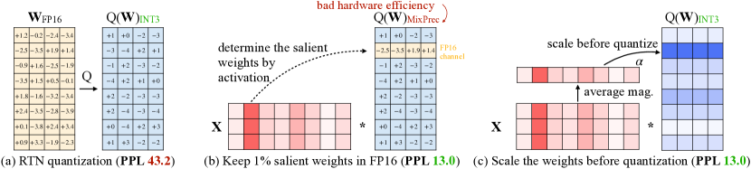
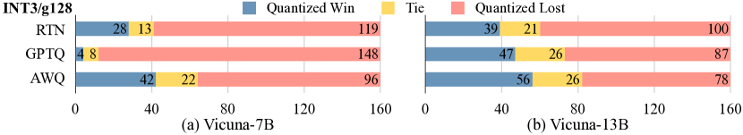
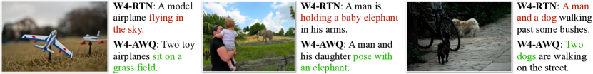
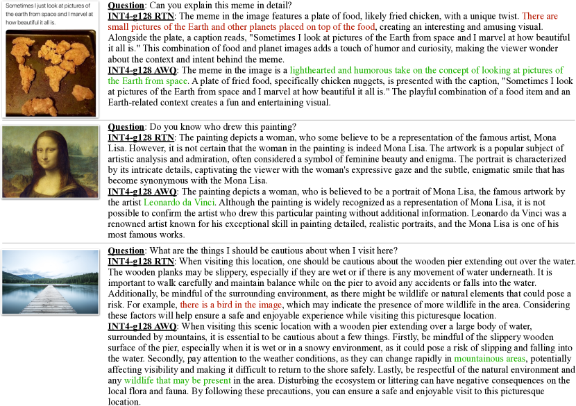
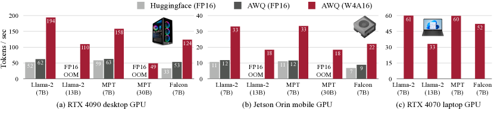
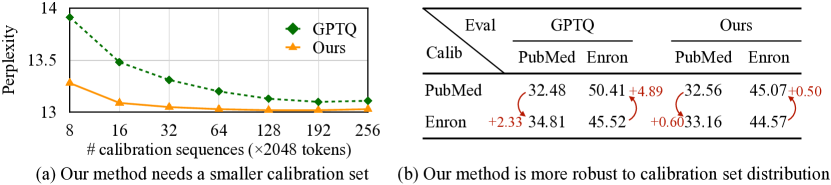

# AWQ: 大規模言語モデルの圧縮と高速化のための活性を意識した重み量子化

> 原題: AWQ: Activation-aware Weight Quantization for LLM Compression and Acceleration
> 著者: Ji Lin¹\*, Jiaming Tang^{1,2}\*, Haotian Tang¹, Shang Yang¹, Xingyu Dang³, Chuang Gan¹, Song Han¹
> 所属: ¹ MIT　² SJTU（上海交通大学）　³ 清華大学
> \* 同等の寄与を示す
> コード: https://github.com/mit-han-lab/llm-awq
> 出典: arXiv:2306.00978（ar5iv 版）/ MLSys 2024

> **訳注（クリップの状態と復元）**
> - 本翻訳の底本は ar5iv 版を Obsidian Web Clipper で markdown 化した `raw/papers/AWQ_...md` である。図 6 枚（x1〜x6）・表 7 件・図表キャプションはすべて欠落なく残っており、**クリップは健全**であった。
> - 復元したのは 3 点のみ。(1) 脚注 3 件の本文（`†` / `*` のマーカーだけが残り本文が消えていた）を ar5iv 原ページから取得した。(2) Figure 5 のキャプションで「3.5」の直後の `×` が脱落していたのを補った。(3) §2.2 の「$00$ means we do not scale」は原文が「$0$ means we do not scale」であり、クリップ時の重複と判断して訂正した。
> - 参考文献一覧と謝辞は既定どおり訳出しない。本文中の引用は原典の番号 `[^N]` のまま残している。
> - 図はすべて `raw/assets/2023-awq/` にローカル保存し、そのパスを参照している。

## Abstract（要旨）

大規模言語モデル（LLM）はさまざまなタスクで優れた性能を示してきたが、天文学的なモデルサイズは、サービング（提供）のハードウェア障壁（メモリ容量）を引き上げ、トークン生成を遅くする（メモリ帯域）。本論文では、LLM の低ビット重みのみ量子化に向けたハードウェアに優しい手法として、**活性を意識した重み量子化（Activation-aware Weight Quantization, AWQ）** を提案する。我々の手法は、**重みは同等に重要ではない**という観測に基づく——**わずか 1%** の顕著な（salient）重みを保護するだけで、量子化誤差を大きく減らすことができる。次に我々は、**重みではなく活性**を観測することで顕著な重みを保護する、最適なチャネルごとのスケーリングを探索することを提案する。AWQ は誤差逆伝播にも再構成にも依存しないため、キャリブレーションセットへ過適合することなく、異なるドメイン・モダリティにおける LLM の汎化能力をよく保つことができる。AWQ は、さまざまな言語モデリングおよびドメイン固有のベンチマークで既存研究を上回る。より良い汎化のおかげで、**指示チューニング済み**の言語モデルに対して優れた量子化性能を達成し、また**マルチモーダル**な言語モデルに対しても初めてそれを達成した。AWQ とあわせて、エッジ上の LLM に合わせた効率的で柔軟な推論フレームワークを実装し、デスクトップ GPU とモバイル GPU の双方で、Huggingface の FP16 実装に対して 3 倍を超える高速化を提供する。これは 70B の Llama-2 モデルのモバイル GPU（NVIDIA Jetson Orin 64GB）上での展開も民主化する。

## 1 Introduction（はじめに）

トランスフォーマ [^40] に基づく大規模言語モデル（LLM）は、さまざまなベンチマークで優れた性能を示してきた [^4] [^49] [^38] [^34]。しかし、大きなモデルサイズは高いサービングコストにつながる。たとえば GPT-3 は 175B のパラメータを持ち、これは FP16 で 350GB になるが、最新の H100 GPU でさえメモリは 96GB しかない——エッジデバイスであればなおさらである。

LLM の低ビット重み量子化はメモリを節約できるが、難しい。**量子化を意識した訓練（quantization-aware training, QAT）は訓練コストが高いため実用的でなく**、一方**訓練後量子化（post-training quantization, PTQ）は低ビット設定で大きな精度劣化を被る**。最も近い研究は GPTQ [^14] であり、二次情報を用いて誤差補償を行う。それは再構成の過程でキャリブレーションセットへ過適合し、分布外のドメインにおいて学習された特徴を歪めるおそれがあり（Figure 6）、LLM が**汎用（generalist）** モデルであることを考えると問題になりうる。

本論文では、LLM 向けのハードウェアに優しい低ビット重みのみ量子化手法として、**活性を意識した重み量子化（AWQ）** を提案する。我々の手法は、**LLM の性能にとって重みは同等に重要ではない**という観測に基づく。ごく一部（0.1%〜1%）の**顕著な（salient）** 重みが存在し、これらの顕著な重みの量子化を省略すると量子化損失が大きく減る（Table 1）。顕著な重みチャネルを見つけるための着眼点は、**重みのみ**の量子化を行っているにもかかわらず、**重み**の分布ではなく**活性**の分布を参照すべきだという点にある——より大きな活性の大きさに対応する重みチャネルは、より重要な特徴を処理しているためにより顕著なのである。ハードウェア効率の悪い混合精度の実装を避けるために、我々は重み量子化からの誤差を解析し、**顕著なチャネルをスケールアップすればその相対的な量子化誤差が減る**ことを導いた（式 2）。この直観に従って、全重み量子化のもとで量子化誤差を最小化する最適なスケーリングを自動的に探索する、チャネルごとのスケーリング手法を設計した。AWQ は誤差逆伝播にも再構成にも依存しないため、キャリブレーションセットへ過適合することなく、さまざまなドメイン・モダリティにおける LLM の汎化能力をよく保つことができる。さらに、AWQ による理論上のメモリ節約を実際の高速化へ変換するために、効率的なサービングフレームワークを実装した。我々のフレームワークはカーネル融合を活用する。

実験は、AWQ が異なるモデルファミリ（例: LLaMA [^38]、OPT [^49]）と異なるモデルサイズにわたり、さまざまなタスクで既存研究を上回ることを示す。より良い汎化のおかげで、**指示チューニング済み**の言語モデル（例: Vicuna）に対しても良好な量子化性能を達成し、また**マルチモーダル**な言語モデル（OpenFlamingo [^2]）に対しても初めてそれを達成した。我々の効率的なシステム実装により、多様な LLM にわたって Huggingface の FP16 実装と比べて一貫して平均 3.2〜3.3 倍の高速化が観測される。さらに、64GB のメモリを持つ NVIDIA Jetson Orin 1 台への Llama-2-70B モデルの展開を容易にする。また、わずか 8GB のメモリしか持たないラップトップの RTX 4070 GPU 上で、最大 130 億パラメータの LLM を毎秒 30 トークンという対話的な速度で民主化する。

AWQ は [FastChat](https://github.com/lm-sys/FastChat/blob/main/docs/awq.md)、[vLLM](https://github.com/vllm-project/vllm/blob/main/vllm/model_executor/quantization_utils/awq.py)、[HuggingFace TGI](https://github.com/huggingface/text-generation-inference/pull/1054)、[LMDeploy](https://github.com/InternLM/lmdeploy) など、さまざまなオープンソースの LLM サービング解に広く採用されている。

## 2 AWQ: Activation-aware Weight Quantization（活性を意識した重み量子化）

**量子化**は浮動小数点数を低ビットの整数へ写す。これは LLM のモデルサイズと推論コストを削減する有効な手法である [^9] [^14] [^47] [^46]。本節ではまず、より「重要な」重みを保護することで、**訓練や回帰なしに**精度を改善する重みのみ量子化手法を提案する。次に、量子化誤差を減らす最適なスケーリングを探索するデータ駆動の手法を開発する（Figure 1）。

<figure>

<figcaption>図1: 我々は、活性の分布を観測することで LLM 中の 1% の顕著な重みを見つけられることを観測した（中央）。顕著な重みを FP16 のまま保つと量子化後の性能が大きく改善する（PPL は 43.2（左）から 13.0（中央）へ）が、混合精度の形式はハードウェア効率が良くない。我々は活性を意識するという原理に従い AWQ を提案する（右）。AWQ はチャネルごとのスケーリングを行って顕著な重みを保護し、量子化誤差を減らす。PPL は OPT-6.7B の INT3-g128 量子化で測定した。</figcaption>
</figure>

### 2.1 Improving LLM Quantization by Preserving 1% Salient Weights（1% の顕著な重みを保つことによる LLM 量子化の改善）

**表1**: 重みのごく一部（0.1%〜1%）を FP16 のまま保つと、最近接丸め（round-to-nearest, RTN）に対して量子化モデルの性能が大きく改善する。これは、**重み**の分布ではなく**活性**の分布を見て FP16 に残す重要な重みを選んだときにのみ有効である。まともなパープレキシティの結果を（原典では）緑で強調している。グループサイズ 128 の INT3 量子化を用い、WikiText のパープレキシティ（↓）を測定した。

| PPL ↓ | FP16 | RTN (w3-g128) | FP16%（活性基準）0.1% | 1% | 3% | FP16%（重み基準）0.1% | 1% | 3% | FP16%（ランダム）0.1% | 1% | 3% |
| --- | --- | --- | --- | --- | --- | --- | --- | --- | --- | --- | --- |
| OPT-1.3B | 14.62 | 119.00 | 25.03 | 16.91 | 16.68 | 108.71 | 98.55 | 98.08 | 119.76 | 109.38 | 61.49 |
| OPT-6.7B | 10.86 | 23.54 | 11.58 | 11.39 | 11.36 | 23.41 | 22.37 | 22.45 | 23.54 | 24.23 | 24.22 |
| OPT-13B | 10.13 | 46.04 | 10.51 | 10.43 | 10.42 | 46.07 | 48.96 | 54.49 | 44.87 | 42.00 | 39.71 |

我々は、LLM の重みが**同等には重要でない**ことを観測した——他と比べて LLM の性能にとってはるかに重要な、ごく一部の**顕著な**重みが存在する。これらの顕著な重みの量子化を省略すれば、量子化損失による性能劣化を**訓練や回帰なしに**埋め合わせる助けになる（Figure 1(b)）。この着想を検証するため、重みチャネルの一部を省略したときの量子化 LLM の性能を Table 1 でベンチマークした。一部の割合の重みチャネルを FP16 に保ちながら、INT3 量子化したモデルの性能を測定している。重みの重要度を決める広く使われる方法は、その大きさや $L_{2}$ ノルムを見ることである [^18] [^13]。しかし我々は、大きなノルムを持つ重みチャネルを省略しても（すなわち FP16%（重み基準））量子化後の性能はさして改善せず、ランダム選択と同程度のわずかな改善しかもたらさないことを見出した。興味深いことに、**活性の大きさ**に基づいて重みを選ぶと性能が大きく改善する——より大きな活性に対応するチャネルのわずか 0.1%〜1% を保つだけで量子化後の性能が大きく改善し、強力な再構成ベースの手法である GPTQ [^14] に匹敵さえする。我々は、より大きな大きさを持つ入力特徴は一般により重要であると仮説を立てる。対応する重みを FP16 のまま保つとそれらの特徴が保存され、より良いモデル性能に寄与する。

**限界**: 重みの 0.1% を FP16 に保つことは、モデルサイズ（総ビット数で測る）を目立って増やすことなく量子化後の性能を改善できるが、そうした混合精度のデータ型はシステム実装を難しくする。**実際に FP16 として保持することなく**、重要な重みを保護する方法を考え出す必要がある。

### 2.2 Protecting Salient Weights by Activation-aware Scaling（活性を意識したスケーリングによる顕著な重みの保護）

我々は、顕著な重みの量子化誤差を**チャネルごとのスケーリング**によって減らす代替手法を提案する。これはハードウェア非効率の問題を被らない。

**量子化誤差の解析**。まず重みのみ量子化からの誤差を解析することから始める。重みのグループ／ブロック $\mathbf{w}$ を考える。線形演算は $y=\mathbf{w}\mathbf{x}$ と書け、量子化された対応物は $y=Q(\mathbf{w})\mathbf{x}$ となる。具体的には、量子化関数は次のように定義される:

$$
Q(\mathbf{w})=\Delta\cdot\text{Round}(\frac{\mathbf{w}}{\Delta}),\quad\Delta=\frac{\max(|\mathbf{w}|)}{2^{N-1}},
$$

ここで $N$ は量子化ビット数、$\Delta$ は絶対最大値によって決まる量子化スケーラである。ここで重み要素 $w\in\mathbf{w}$ を考える。$w$ に $s>1$ を掛け、$x$ を逆にスケールすると、$Q(w\cdot s)(x/s)$ が得られ、これは次のようになる:

$$
Q(w\cdot s)\cdot\frac{x}{s}=\Delta^{{}^{\prime}}\cdot\text{Round}(\frac{ws}{\Delta})\cdot x\cdot\frac{1}{s},
$$

ここで $\Delta^{{}^{\prime}}$ は $s$ を適用した後の新しい量子化スケーラである。我々は経験的に次を見出した。(1) $\text{Round}(\cdot)$ からの期待誤差（$RoundErr$ と表記）は変わらない——丸め関数は浮動小数点数を整数へ写すので、誤差はおおよそ 0 から 0.5 に一様分布し、平均誤差は 0.25 程度になる。(2) 単一の要素 $w$ をスケールアップしても、通常はグループ $\mathbf{w}$ の極値は変わらない。したがって $\Delta^{{}^{\prime}}\approx\Delta$ である。(3) 式 2 からの誤差は $Err^{{}^{\prime}}=\Delta^{{}^{\prime}}\cdot RoundErr\cdot\frac{1}{s}$ と表せ、元の誤差 $RoundErr$ に対する比は $\frac{\Delta^{{}^{\prime}}}{\Delta}\cdot\frac{1}{s}$ となる。$\Delta^{{}^{\prime}}\approx\Delta$ かつ $s>1$ であることから、顕著な重み $w$ にとって相対誤差はより小さくなる。

この着想を検証するため、OPT-6.7B モデルについて 1% の顕著なチャネルに $s>1$ を掛け、各グループの $\Delta$ の変化を Table 2 で測定した。顕著なチャネルをスケールアップすることはかなり有効であることが分かる——パープレキシティは $s=1$（単なる RTN）の 23.54 から、$s=2$ の 11.92 へ改善する。$s$ が大きくなるにつれて $\Delta$ が変化した割合は一般に大きくなるが、$s<2$ ではその比率はまだかなり小さい。顕著なチャネルの相対誤差は $s$ が増えるにつれ小さくなり続ける。にもかかわらず、最良の PPL は実際には $s=2$ で現れる。これは、非常に大きな $s$ を使うと、$\Delta$ が増えたときに**非顕著な**チャネルの相対誤差が増えるためである（非顕著なチャネルの誤差は $\frac{\Delta^{{}^{\prime}}}{\Delta}$ によって増幅され、$s=4$ のもとではチャネルの 21.2% でこの比が 1 より大きくなる）。これはモデル全体の精度を損ないうる。したがって、顕著なチャネルを保護するときには非顕著なチャネルからの誤差も考慮する必要がある。

**表2**: 1% の顕著なチャネルに $s>1$ を掛けたときの統計。顕著なチャネルのスケールアップはパープレキシティを大きく改善する（23.54 → 11.92）。$s$ が大きくなるにつれ、変化した $\Delta$ の割合が増え、顕著なチャネルの誤差削減率も上がる。しかし最良のパープレキシティは $s=2$ で達成される——さらに $s$ を増やすと**非顕著な**チャネルの量子化誤差が増えるからである。

| OPT-6.7B | $s=1$ | $s=1.25$ | $s=1.5$ | $s=2$ | $s=4$ |
| --- | --- | --- | --- | --- | --- |
| $\Delta^{{}^{\prime}}\neq\Delta$ の割合 | 0% | 2.8% | 4.4% | 8.2% | 21.2% |
| 平均 $\Delta^{{}^{\prime}}/\Delta$ | 1 | 1.005 | 1.013 | 1.038 | 1.213 |
| 平均 $\frac{\Delta^{{}^{\prime}}}{\Delta}\cdot\frac{1}{s}$（誤差削減率） | 1 | 0.804 | 0.676 | 0.519 | 0.303 |
| Wiki-2 PPL | 23.54 | 12.87 | 12.48 | 11.92 | 12.36 |

**表3**: AWQ はスケーリングに基づく手法によって顕著な重みを保護し、量子化誤差を減らす。最近接丸め量子化（RTN）を一貫して上回り、混合精度（1% FP16）と同等の性能を、よりハードウェアに優しい形で達成する。

| OPT / PPL ↓ | | 1.3B | 2.7B | 6.7B | 13B | 30B |
| --- | --- | --- | --- | --- | --- | --- |
| FP16 | - | 14.62 | 12.47 | 10.86 | 10.13 | 9.56 |
| INT3 g128 | RTN | 119.47 | 298.00 | 23.54 | 46.04 | 18.80 |
| | 1% FP16 | 16.91 | 13.69 | 11.39 | 10.43 | 9.85 |
| | $s=2$ | 18.63 | 14.94 | 11.92 | 10.80 | 10.32 |
| | AWQ | 16.32 | 13.58 | 11.39 | 10.56 | 9.77 |

**スケールを探索する**。顕著な重みと非顕著な重みの双方を考慮するために、我々は、ある層について量子化後の出力の差を最小化する最適な（入力チャネルごとの）スケーリング係数を自動的に探索することを選ぶ。形式的には、次の目的関数を最適化したい:

$$
\mathbf{s}^{*}=\operatorname*{arg\,min}_{\mathbf{s}}\mathcal{L}(\mathbf{s}),\quad\mathcal{L}(\mathbf{s})=\lVert Q(\mathbf{W}\cdot\mathbf{s})(\mathbf{s^{-1}}\cdot\mathbf{X})-\mathbf{W}\mathbf{X}\rVert
$$

ここで $Q$ は重み量子化関数（例: グループサイズ 128 の INT3/INT4 量子化）、$\mathbf{W}$ は FP16 の元の重み、$\mathbf{X}$ は小さなキャリブレーションセットからキャッシュした入力特徴である（特定のタスクに過適合しないよう、キャリブレーションセットは事前学習データセットから小さく取る）。$\mathbf{s}$ は（入力）チャネルごとのスケーリング係数である。$\mathbf{s^{-1}}\cdot\mathbf{X}$ については、通常は前段の演算子へ融合できる [^44] [^46]。量子化関数は微分可能でないため、この問題を素の誤差逆伝播で直接最適化することはできない。近似勾配に頼る技法もあるが [^3] [^12]、我々はそれらも不安定な収束を被ることを見出した。

過程をより安定させるために、スケーリング係数の選択に影響する要因を解析して、最適なスケールの**探索空間**を定義する。前節で示したとおり、重みチャネルの顕著性は実は活性のスケールによって決まる（ゆえに「活性を意識する（activation-awareness）」）。したがって我々は、ごく単純な探索空間を使う:

$$
\mathbf{s}=\mathbf{s_{X}}^{\alpha},\quad\alpha^{*}=\operatorname*{arg\,min}_{\alpha}\mathcal{L}(\mathbf{s_{X}}^{\alpha})
$$

$\mathbf{s}$ は活性の大きさ $\mathbf{s_{X}}$ にのみ関係し、顕著なチャネルと非顕著なチャネルの保護のバランスを取るために単一のハイパーパラメータ $\alpha$ を使う。最良の $\alpha$ は区間 $[0,1]$ 上の高速なグリッド探索で見つけられる（$0$ はスケールしないことを、$1$ は最も積極的なスケーリングを意味する）。さらに MSE 誤差を最小化する形で重みのクリッピングも適用する。重みをクリップすると式 2 の $\Delta^{{}^{\prime}}$ をさらに減らせるため、量子化誤差が減るからである。INT3-g128 量子化のもとでの OPT モデルに対するアブレーション研究を Table 3 に示す。AWQ は最近接丸め量子化（RTN）を一貫して上回り、混合精度（1% FP16）と同等の性能を、よりハードウェアに優しい形で達成する。

**利点**。我々の手法は、多くの量子化を意識した訓練の手法が必要とする回帰 [^14] や誤差逆伝播にまったく依存しない。チャネルごとの平均的な大きさを測るだけなので、キャリブレーションセットへの依存が最小限であり、過適合を防げる（Figure 6）。したがって我々の手法は量子化の過程でより少ないデータしか必要とせず、キャリブレーションセットの分布の外側にある LLM の知識を保つことができる。詳細は 3.3 節を参照。

## 3 Experiments（実験）

### 3.1 Settings（設定）

#### Quantization（量子化）

本研究では**重みのみのグループ化**量子化に注目する。先行研究 [^10] [^14] が示すとおり、グループ化量子化は性能／モデルサイズのトレードオフを改善するうえで常に有用である。特記しない限り、本研究を通じてグループサイズ 128 を用いた。LLM の性能をおおむね保てる [^10] ことから、INT4/INT3 量子化に注目する。AWQ については、特定の下流ドメインへ過適合しないよう、Pile [^15] データセットからの小さなキャリブレーションセットを用いた。式 4 の最適な $\alpha$ を探索するのにグリッドサイズ 20 を用いた。

#### Models（モデル）

LLaMA [^38] と OPT [^49] のファミリで手法をベンチマークした。BLOOM [^34] のような他のオープンな LLM もあるが、一般に品質が劣るため本研究には含めない。さらに、手法の汎用性を示すために、指示チューニング済みモデル Vicuna [^6] と、視覚言語モデル OpenFlamingo-9B [^2] および LLaVA-13B [^26] でもベンチマークした。

#### Evaluations（評価）

先行文献 [^9] [^46] [^14] [^10] [^47] に従い、主に言語モデリングタスク（WikiText-2 [^27] でのパープレキシティ評価）で量子化モデルをプロファイルした。パープレキシティは LLM の性能を安定して反映するからである [^10]。

#### Baselines（ベースライン）

主要なベースラインは素の最近接丸め量子化（RTN）である。これは 128 のような小さなグループサイズを使うと実際かなり強力である [^14] [^10]。また、LLM の重み量子化についての最先端手法である GPTQ [^14] とも比較する。GPTQ については「reorder（並べ替え）」の工夫を用いた更新版（GPTQ-Reorder あるいは GPTQ-R と表記）とも比較する。ZeroQuant [^47]、AdaRound [^28]、BRECQ [^23] といった他の技法は、量子化された重みを更新するために誤差逆伝播に依存しており、大きなモデルサイズへ容易にスケールしないおそれがある。また GPTQ [^14] を上回ってもいないため、研究対象に含めない。

### 3.2 Evaluation（評価）

#### Results on LLaMA models（LLaMA モデルでの結果）

他のオープンソース LLM [^49] [^34] と比べて優れた性能を持つことから、LLaMA モデル（LLaMA [^38] と Llama-2 [^39]）に研究を集中させる。これは多くの人気あるオープンソースモデル [^36] [^6] の基盤でもある。量子化前後のパープレキシティを Table 4 で評価する。AWQ が、異なるモデル規模（7B〜70B）と世代にわたって、最近接丸め量子化（RTN）と GPTQ [^14]（並べ替えあり・なし）を一貫して上回ることが分かる。

**表4**: AWQ は、異なるモデルサイズと異なるビット精度において最近接丸め量子化（RTN）を改善する。LLaMA および Llama-2 モデルにおいて、GPTQ（並べ替えあり・なし）より一貫して良いパープレキシティを達成する。

| PPL ↓ | | Llama-2 7B | Llama-2 13B | Llama-2 70B | LLaMA 7B | LLaMA 13B | LLaMA 30B | LLaMA 65B |
| --- | --- | --- | --- | --- | --- | --- | --- | --- |
| FP16 | - | 5.47 | 4.88 | 3.32 | 5.68 | 5.09 | 4.10 | 3.53 |
| INT3 g128 | RTN | 6.66 | 5.52 | 3.98 | 7.01 | 5.88 | 4.88 | 4.24 |
| | GPTQ | 6.43 | 5.48 | 3.88 | 8.81 | 5.66 | 4.88 | 4.17 |
| | GPTQ-R | 6.42 | 5.41 | 3.86 | 6.53 | 5.64 | 4.74 | 4.21 |
| | AWQ | 6.24 | 5.32 | 3.74 | 6.35 | 5.52 | 4.61 | 3.95 |
| INT4 g128 | RTN | 5.73 | 4.98 | 3.46 | 5.96 | 5.25 | 4.23 | 3.67 |
| | GPTQ | 5.69 | 4.98 | 3.42 | 6.22 | 5.23 | 4.24 | 3.66 |
| | GPTQ-R | 5.63 | 4.99 | 3.43 | 5.83 | 5.20 | 4.22 | 3.66 |
| | AWQ | 5.60 | 4.97 | 3.41 | 5.78 | 5.19 | 4.21 | 3.62 |

<figure>

<figcaption>図2: INT3-g128 量子化した Vicuna モデルを、GPT-4 の評価プロトコル [^6] のもとで FP16 の対応物と比較したもの。勝ちのケース（原典では青）が多いほど性能が良いことを示す。AWQ は RTN や GPTQ [^14] と比べて量子化後の性能を一貫して改善しており、指示チューニング済みモデルへの汎用性を示している。</figcaption>
</figure>

#### Quantization of instruction-tuned models（指示チューニング済みモデルの量子化）

指示チューニングはモデルの性能と使いやすさを大きく改善しうる [^42] [^33] [^31] [^8]。これはモデル展開前の必須の手順になっている。我々はさらに、人気ある指示チューニング済みモデル Vicuna [^6] で手法の性能を Figure 2 においてベンチマークした。80 個のサンプル質問 [^6] について、量子化モデルの性能を FP16 の対応物に対して評価するのに GPT-4 スコアを用いた。応答は両方の順序（量子化—FP16、FP16—量子化）で比較して順序効果を取り除き（GPT-4 は最初の入力の評点を上げる傾向があることを我々は見出した）、160 回の試行とした。AWQ は 2 つの規模（7B と 13B）の双方で、INT3-g128 量子化した Vicuna モデルを RTN と GPTQ に対して一貫して改善しており、指示チューニング済みモデルへの汎用性を示している。

**表5**: 視覚言語モデル OpenFlamingo-9B [^2] の COCO Captioning データセットにおける量子化結果。AWQ はゼロショットおよびさまざまな few-shot 設定で既存手法を上回り、異なるモダリティおよび文脈内学習ワークロードへの汎用性を示す。AWQ は INT4-g128 のもとで量子化による劣化（32-shot）を 4.57 から 1.17 へ減らし、無視できる性能損失で 4 倍のモデルサイズ削減を提供する。

| COCO (CIDEr ↑) | | 0-shot | 4-shot | 8-shot | 16-shot | 32-shot | Δ (32-shot) |
| --- | --- | --- | --- | --- | --- | --- | --- |
| FP16 | - | 63.73 | 72.18 | 76.95 | 79.74 | 81.70 | - |
| INT4 g128 | RTN | 60.24 | 68.07 | 72.46 | 74.09 | 77.13 | -4.57 |
| | GPTQ | 59.72 | 67.68 | 72.53 | 74.98 | 74.98 | -6.72 |
| | AWQ | 62.57 | 71.02 | 74.75 | 78.23 | 80.53 | -1.17 |
| INT3 g128 | RTN | 46.07 | 55.13 | 60.46 | 63.21 | 64.79 | -16.91 |
| | GPTQ | 29.84 | 50.77 | 56.55 | 60.54 | 64.77 | -16.93 |
| | AWQ | 56.33 | 64.73 | 68.79 | 72.86 | 74.47 | -7.23 |

<figure>

<figcaption>図3: 量子化した OpenFlamingo-9B [^2] の COCO キャプショニングデータセットにおける定性的結果（4-shot、INT4-g128 量子化）。我々の手法は最近接丸め（RTN）のベースラインと比べてキャプションの品質を大きく改善する。正しい／誤ったキャプションを示すためにテキストに色を付けている。</figcaption>
</figure>

#### Quantization of multi-modal language models（マルチモーダル言語モデルの量子化）

大規模マルチモーダルモデル（LMM）あるいは視覚言語モデル（VLM）は、視覚入力で拡張された LLM である [^1] [^22] [^21] [^11] [^48] [^26]。こうしたモデルは画像／動画の入力を条件としたテキスト生成を行える。我々の手法はキャリブレーションセットへの過適合の問題を持たないため、VLM にそのまま適用して正確かつ効率的な量子化を提供できる。OpenFlamingo-9B モデル [^2]（[^1] のオープンソース再現）を COCO キャプショニング [^5] データセットで実験した（Table 5）。異なる few-shot 設定のもとで 5,000 サンプルの平均性能を測定した。モデルサイズを支配するため、量子化するのはモデルの言語部分のみである。AWQ はゼロショットおよびさまざまな few-shot 設定で既存手法を上回り、汎用性を示している。

<figure>

<figcaption>図4: LLaVA-13B モデル [^26] からの視覚推論の例。AWQ は最近接丸め（RTN）のベースラインを改善し、より妥当な回答を与える。正しい／誤った応答を示すためにテキストに色を付けている。</figcaption>
</figure>

#### Visual reasoning results（視覚推論の結果）

さらに LLaVA-13B [^26] モデルによる視覚推論の定性的な例を Figure 4 に示す。AWQ は INT4-g128 量子化について RTN のベースラインと比べて応答を改善し、より妥当な回答につながる。1 つ目の例では、AWQ モデルはそのミームが宇宙から見た地球に似ていることを理解できるが、RTN は誤った記述を生む（赤で示す）。2 つ目の例では、AWQ は質問（絵画の作者）に正しく答えるが、RTN は作者についての情報をまったく与えない。最後の例では、RTN は写真に鳥がいると誤って指摘するが、AWQ は画像が山岳地帯で撮られたことに気付いてより多くの情報を与える。AWQ は応答中の事実誤りを減らすことで VLM の視覚推論能力を改善する。

**表6**: 我々の手法は GPTQ と直交する——GPTQ と組み合わせると、極端な低ビット量子化（INT2-g64）における性能差をさらに縮める。結果は OPT モデルの WikiText-2 パープレキシティ。

| OPT / Wiki PPL ↓ | | 1.3B | 2.7B | 6.7B | 13B | 30B |
| --- | --- | --- | --- | --- | --- | --- |
| FP16 | - | 14.62 | 12.47 | 10.86 | 10.13 | 9.56 |
| INT2 g64 | RTN | 10476 | 193210 | 7622 | 17564 | 8170 |
| | GPTQ | 46.67 | 28.15 | 16.65 | 16.74 | 11.75 |
| | AWQ + GPTQ | 35.71 | 25.70 | 15.71 | 13.25 | 11.38 |

#### Extreme low-bit quantization（極端な低ビット量子化）

限られたデバイスメモリに合わせるため、さらに LLM を INT2 へ量子化する（Table 6）。RTN は完全に破綻し、AWQ は GPTQ の上に大きなパープレキシティ改善をもたらす——ただし FP16 と比べればまだ性能差が残る。我々の手法は GPTQ と直交している。GPTQ と組み合わせて INT2 量子化の性能をさらに改善でき、より実用的な設定にできる。

<figure>

<figcaption>図5: AWQ は、理論上のメモリ使用量の削減を定量可能な高速化へ変換するターンキーな解を提供する。結果として AWQ は、4090（デスクトップ GPU）および Orin（モバイル GPU）において、Huggingface の FP16 実装よりそれぞれ最大 3.9 倍・3.5 倍高速である。AWQ はまた、わずか 8GB のメモリしか持たないラップトップ GPU（4070）への Llama-2-13B の展開を民主化する。</figcaption>
</figure>

#### Speedup Evaluation（高速化の評価）

Figure 5 に AWQ のシステム的な加速結果を示す。線形層と、量子化された重みを持たない層の双方を最適化している。RTX 4090（デスクトップ GPU）、RTX 4070（ラップトップ GPU）、Jetson Orin（モバイル GPU）でベンチマーク実験を行った。すべての LLM について、固定長 4 トークンのプロンプトを用いてバッチサイズ 1 の推論を行う。各推論実行で 200 トークンを生成し、その中央値のレイテンシを最終結果とする。Figure 5(a) のとおり、我々のシステムは 4090 上で 3 つの LLM ファミリ（Llama-2、MPT、Falcon）に対して Huggingface の FP16 実装と比べて 2.7〜3.9 倍の高速化をもたらす。特筆すべきは、わずか 8GB のメモリしか持たないラップトップの 4070 GPU 上でも Llama-2-13B モデルを毎秒 33 トークンで実行できることである——FP16 実装では 7B モデルすら載らない。

我々のシステムは NVIDIA Jetson Orin（32GB）上でも有望な性能を示す。Figure 5(b) のとおり、Llama-2 モデルの実行時に毎秒 33 トークンという対話的な処理速度を達成する。AWQ のおかげで、MPT-30B のようなより大きなモデルさえこの資源制約のあるエッジデバイス上で滑らかに動作し、毎秒 7.8 トークンの処理速度を出す。なお、我々はすべての AWQ モデルの順伝播をネイティブな PyTorch API で実装しており、このコードはさまざまな GPU アーキテクチャで再利用される。結果として我々のシステムは両者の良いとこ取りを提供する——最先端の推論速度と、卓越した拡張性である。

### 3.3 Analysis（分析）

<figure>

<figcaption>図6: 左: AWQ は良い量子化性能に到達するのにはるかに小さなキャリブレーションセットしか必要としない。GPTQ と比べて 10 倍小さいキャリブレーションセットでより良いパープレキシティを達成できる。右: 我々の手法はキャリブレーションセットの分布に対してより頑健である。全体としては、キャリブレーションと評価の分布を同じにするのが最良である（PubMed—PubMed、Enron—Enron）。しかし異なるキャリブレーション分布を使ったとき（PubMed—Enron、Enron—PubMed）、AWQ はパープレキシティが 0.5〜0.6 増えるだけであるのに対し、GPTQ は 2.3〜4.9 悪化する。すべての実験は OPT-6.7B モデルの INT3-g128 量子化で行った。</figcaption>
</figure>

#### Better data-efficiency for the calibration set（キャリブレーションセットに対するより良いデータ効率）

我々の手法は回帰／誤差逆伝播に依存しないため、より小さなキャリブレーションセットしか必要としない。キャリブレーションセットから測るのはチャネルごとの平均的な活性スケールだけであり、これはデータ効率が良い。この考えを示すため、INT3-g128 量子化した OPT-6.7B モデルのパープレキシティを Figure 6(a) で比較する。AWQ は良い量子化性能に到達するのにはるかに小さなキャリブレーションセットしか必要とせず、GPTQ と比べて 10 倍小さいキャリブレーションセット（16 系列 **対** 192 系列）でより良いパープレキシティを達成できる。

#### Robust to the calibration set distributions（キャリブレーションセットの分布に対する頑健性）

我々の手法はキャリブレーションセットから平均的な活性スケールを測るだけなので、キャリブレーションセットの分布に対する感度が低く、異なるデータセット分布にわたってより汎化しやすい。異なるキャリブレーションセット分布の効果を Figure 6(b) でさらにベンチマークした。Pile データセット [^15] から 2 つの部分集合を取った——PubMed Abstracts と Enron Emails [^20] である。それぞれの部分集合をキャリブレーションセットとして使い、量子化モデルを両方の集合で評価する（キャリブレーション集合と評価集合は重複なく分割し、評価には 1,000 サンプルを用いた）。全体としては、キャリブレーションと評価の分布を同じにするのが最良である（PubMed—PubMed、Enron—Enron）。しかし異なるキャリブレーション分布を使ったとき（PubMed—Enron、Enron—PubMed）、AWQ はパープレキシティが 0.5〜0.6 増えるだけである。

## 4 Related Work（関連研究）

#### Model quantization methods（モデル量子化の手法）

量子化は深層学習モデルのビット精度を下げるものであり [^17] [^19] [^29] [^41] [^28] [^25]、モデルサイズの削減と推論の高速化に役立つ。量子化技法は一般に 2 つのカテゴリに分かれる——量子化を意識した訓練（QAT、量子化された重みを更新するのに誤差逆伝播に依存する）[^3] [^16] [^30] [^7] と、訓練後量子化 [^19] [^29] [^28]（PTQ、通常は訓練不要）である。QAT の手法は LLM のような大きなモデルへ容易にはスケールしない。したがって、人々は通常 PTQ の手法で LLM を量子化する。

#### Quantization of LLMs（LLM の量子化）

LLM の量子化については 2 つの設定が研究されている。(1) **W8A8 量子化**——活性と重みの双方を INT8 へ量子化する [^9] [^46] [^47] [^45] [^43]。(2) **低ビットの重みのみ量子化**（例: W4A16）——重みだけを低ビット整数へ量子化する [^14] [^10] [^35] [^32]。本研究では 2 つ目の設定に注目する。これはハードウェアの障壁を下げる（必要なメモリ容量が小さくなる）だけでなく、トークン生成も高速化する（メモリ律速のワークロードを緩和する）からである。素の最近接丸めベースライン（RTN）は別として、GPTQ [^14] が我々の研究に最も近い。しかし GPTQ の再構成の過程はキャリブレーションセットへの過適合の問題につながり、他のモダリティやドメインに対する LLM の汎用的な能力を保てないおそれがある。また並べ替えの工夫も必要とする。

#### System support for low-bit quantized LLMs（低ビット量子化 LLM のシステム支援）

低ビット量子化 LLM は推論コストを下げる人気の設定になっている。実用的な高速化を実現するシステム支援もいくつかある。GPTQ [^14] は OPT モデル向けの INT3 カーネルを提供し、GPTQ-for-LLaMA は Triton [^37] の助けを借りて INT4 の並べ替え量子化へカーネル支援を拡張する。FlexGen [^35] と llama.cpp（https://github.com/ggerganov/llama.cpp ）は、I/O コストとオフロードを減らすためにグループごとの INT4 量子化を行う。FasterTransformer（https://github.com/NVIDIA/FasterTransformer ）は重みのみのテンソルごと量子化に対して FP16 × INT4 の GEMM を実装するが、グループ量子化には対応しない。LUT-GEMM [^32] はルックアップテーブルの助けを借りて GPU の CUDA コア上でビット単位の計算を行う。AWQ のカーネルはテンソルコアと CUDA コアの双方の上で適応的に実行され、LLM 推論の文脈処理フェーズと生成フェーズの双方に適する。結果として、我々は最先端の LLaMA モデルを Huggingface の FP16 実装に対して 3.2〜3.3 倍の高速化で実行する。

## 5 Conclusion（結論）

本研究では、低ビットの重みのみ LLM 圧縮のための単純かつ効果的な手法として、活性を意識した重み量子化（AWQ）を提案した。AWQ は LLM において重みが同等に重要ではないという観測に基づき、顕著な重みの量子化損失を減らすためにチャネルごとのスケーリングを行う。AWQ はキャリブレーションセットに過適合せず、さまざまなドメインとモダリティにおける LLM の汎用的な能力を保つ。言語モデリングで既存研究を上回り、指示チューニング済みの言語モデルやマルチモーダルな言語モデルにも適用できる。我々のシステム実装はさらに、AWQ が達成した理論上のメモリ節約を、デスクトップおよびモバイル GPU 上で Huggingface の FP16 実装に対する 3.2〜3.3 倍の実測高速化へと変換し、エッジ上での LLM 展開を民主化する。

## Appendix A Broader Impacts and Limitations（より広い影響と限界）

**より広い影響**。本論文では、大規模言語モデル（LLM）の正確かつ効率的な低ビット重みのみ量子化を可能にする汎用的な技法を提案する。これは LLM をより効率的かつアクセスしやすくするので、LLM が持つ影響を継承しうる。肯定的な面では、量子化は LLM の民主化に役立ち、より多くの人々（特に低所得の人々）に利益をもたらす。LLM を展開するコストとハードウェアの障壁を下げ、これらのモデルのエッジ推論を促進し、データのプライバシー問題に対処する（データをクラウドへ送る必要がなくなるため）。否定的な面では、LLM は悪意ある利用者によって誤情報や操作の生成に悪用されうる。量子化はそうした否定的な影響を防げないが、悪化させもしない。

**限界**。本論文では先行研究 [^9] [^14] [^46] [^47] [^10] に従い、量子化モデルをおおむねパープレキシティや正解率といった標準的な精度指標でベンチマークしている。しかし精度のほかにも、頑健性・公平性・バイアス・毒性・有用性・キャリブレーションなど、LLM のベンチマークにとって重要な指標がある [^24]。これらの側面をカバーする、量子化 LLM のより全体的な評価を行うことは有用だと考えるが、今後の課題とする。さらに、ハードウェア上でのデータ型のキャストが容易であることから、我々は LLM の低ビット**整数**量子化のみを研究している。データ型を変えること（例: FP4 [^10]）によるさらなる改善もありうるが、本研究には含めない。

## Appendix B Amount of Computation（計算量）

本研究では LLM の訓練後量子化（PTQ）を研究している。誤差逆伝播にまったく依存しないため、計算要件は一般に控えめである。より小さなモデル（40B パラメータ未満）には NVIDIA A100 GPU を 1 台、より大きなモデルにはメモリ制約のため 2〜4 台の A100 GPU を用いた。

量子化の過程は一般に高速で、数 GPU 時間（モデルサイズに応じて 0.1 から 3 の範囲）を要する。精度の測定時間はモデルとデータセットのサイズに依存する——LLaMA-65B（複数データセットで試験した最大のモデル）を 4 つの常識 QA タスクで試験するには 3 GPU 時間、MMLU（57 のサブデータセットからなる）で試験するには 5 GPU 時間を要する。より小さなモデルとデータセット（例: WikiText-2）であれば GPU 時間はより小さくなる。

## Appendix C Limitation with No-group Quantization（グループなし量子化での限界）

我々の手法は、顕著な重みチャネルを保護する良いスケーリングを探索する。グループ化量子化のもとではかなりうまく機能し、顕著な重みを FP16 に保つのと同じ精度に匹敵する（Figure 1）。しかしこうしたスケーリングに基づく手法は、**各グループにつき 1 つ**の顕著なチャネルしか保護できない。グループ化量子化ではこれは問題にならない（保護が必要な顕著チャネルは 0.1%〜1% だけで、グループサイズは通常 128 のように小さいので、各グループで平均 1 チャネル未満を保護すればよい）。しかしグループなしの量子化では、**重み全体**について 1 つの入力チャネルしか保護できず、性能劣化を埋めるのに十分でないおそれがある。Table 7 に示すとおり、INT3-g128 量子化のもとでは AWQ は 1% の顕著な重みを FP16 に保つのと同等の性能を達成する。

**表7**: AWQ は、グループ化量子化のもとでは混合精度を導入することなく 1% の顕著な重みを FP16 に保つのと同等の性能に到達できるが、グループなし量子化ではそうならない。とはいえグループ化量子化はグループなしと比べてはるかに良い性能を持ち、LLM の重みのみ量子化にとってはるかに実用的な設定であり、AWQ はこの設定でかなりうまく機能する。結果は WikiText-2 データセットにおけるパープレキシティ。

| PPL ↓ | FP16 | INT3 (group 128) RTN | 1% FP16 | AWQ | INT3 (no group) RTN | 1% FP16 | AWQ |
| --- | --- | --- | --- | --- | --- | --- | --- |
| OPT-6.7B | 12.29 | 43.16 | 13.02 | 12.99 | 21160 | 14.67 | 18.11 |
| LLaMA-7B | 9.49 | 12.10 | 10.77 | 10.82 | 50.45 | 14.06 | 20.52 |
