# FlashAttention-2: より良い並列性と仕事の分割によるさらに高速な attention

> 原題: FlashAttention-2: Faster Attention with Better Parallelism and Work Partitioning
> 著者: Tri Dao
> 所属: Department of Computer Science, Princeton University / Department of Computer Science, Stanford University
> 出典: arXiv:2307.08691（2023-07）・原典クリップ `raw/papers/FlashAttention-2_ Faster Attention with Better Parallelism and Work Partitioning.md`（ar5iv 版）

---

> **訳注（クリップの復元について）**
>
> 底本は ar5iv（`https://ar5iv.labs.arxiv.org/html/2307.08691`）を Obsidian Web Clipper で保存した markdown。原ページと照合したところ、**これまでの取り込みの中で最も欠落が大きいクリップ**であった。以下を復元している。
>
> 1. **画像 20 枚のうち 13 枚が欠落していた**（クリップに残っていたのは 7 枚）。Figure 4〜7 はいずれも「causal mask の有無 × head dimension 64/128」の 2×2 = 4 パネル構成だが、**各図の (a) パネルしか残っていなかった**。ar5iv から 13 枚すべてを取得して収録した。
> 2. とくに深刻なのが **Figure 3 の (b) パネル（`flash2_partitioning.png`）の欠落**である。Figure 3 は「(a) FlashAttention / (b) FlashAttention-2」の並列比較図で、(b) は**本論文の表題そのものである work partitioning の新方式**を描いたもの。クリップには (a)——つまり比較対象である**旧方式だけ**が残っていた。復元した。
> 3. **Figure 3〜7 の本キャプションが 5 つとも完全に消滅**していた。クリップに残っていたのは `(a) Without causal mask, head dimension 64` というサブキャプションのみで、しかも原典 478〜488 行では Figure 4・5・6 の 3 図がキャプションなしに連続しており、どの画像がどの図に属するか markdown だけからは判別できない状態だった。ar5iv から本キャプションとサブキャプション（(a)〜(d)）をすべて復元し、図番号を明示して配置した。
> 4. **脚注 3 件の本文が脱落**していた（`N` マーカーのみ残存）。コードの公開先 URL、$\mathbf{Q}\mathbf{K}^{\top}$ のスケーリングを省略している旨の断り、および Triton 実装への参照。本文中に「訳注（脚注 N）」として挿入した。
>
> 以下は**原論文の側にある誤り**であり、クリップの責任ではない。原文に忠実であるためそのまま訳し、訳注を添えた。
>
> - **§4.2 の「1.3 倍の高速化」の比較対象が誤っている**。原文は "2.8× speedup compared to a baseline without FlashAttention and 1.3× speedup compared to FlashAttention-2" と書いているが、最後は FlashAttention の誤りである（Table 1 の 175 → 225 TFLOPs/s が根拠。自分自身に対して 1.3 倍にはなり得ない）。原ページでも同じ表記。
> - **§2.2 に `$\S$` という記述がある**（`$\mathbf{S}$` であるべき箇所）。これも原ページで同じ。
>
> 参考文献一覧（References）と謝辞（Acknowledgments）は既定どおり訳出していない。本文中の引用は原典クリップの脚注番号 `[^N]` をそのまま維持している。**本論文に付録はなく、§5 で終わる**（本文をすべて全訳した。圧縮箇所はない）。

---

## Abstract（要旨）

トランスフォーマーをより長い系列長へスケールさせることは、ここ数年の主要な問題であった。それは言語モデリングと高解像度画像理解における性能を改善し、またコード・音声・動画生成における新しい応用を切り拓くことを約束する。attention 層は、その実行時間とメモリが系列長に対して 2 乗で増加するため、より長い系列へスケールする際の主要なボトルネックとなる。FlashAttention [^5] は GPU メモリ階層の非対称性を利用して、大幅なメモリ節約（2 乗ではなく線形）と実行時間の高速化（最適化されたベースライン比で 2〜4 倍）を、近似なしにもたらした。しかし FlashAttention は、最適化された行列積（GEMM）演算にはまだ遠く及ばず、理論最大 FLOPs/s の 25〜40% にしか達していない。我々は、この非効率が GPU 上の異なるスレッドブロックおよび warp 間での**仕事の分割が最適でない**ことに起因し、低い占有率（occupancy）または不必要な共有メモリの読み書きを引き起こしていることを観測した。我々はこれらの問題に対処するため、より良い仕事の分割をもつ FlashAttention-2 を提案する。具体的には、(1) 出力を変えないままアルゴリズムを調整して non-matmul FLOPs の数を減らし、(2) 単一のヘッドについてさえも attention の計算を異なるスレッドブロック間で並列化して占有率を高め、(3) 各スレッドブロック内で warp 間の仕事を分配して共有メモリを介した通信を減らす。これらは FlashAttention と比べておよそ 2 倍の高速化をもたらし、A100 上で理論最大 FLOPs/s の 50〜73% に達する。これは GEMM 演算の効率に近づいている。我々は実験的に、GPT スタイルのモデルをエンドツーエンドで訓練する際に、FlashAttention-2 が A100 GPU あたり最大 225 TFLOPs/s（モデル FLOPs 利用率 72%）の訓練速度に到達することを検証した。1

> **訳注（脚注 1）**: FlashAttention-2 は https://github.com/Dao-AILab/flash-attention で利用できる。

## 1 Introduction（はじめに）

トランスフォーマー [^18] のコンテキスト長をスケールアップすることは難題である。その中心にある attention 層が、入力系列長に対して 2 乗の実行時間とメモリ要件を持つためである。理想的には、標準的な 2k の系列長の限界を超えて、書籍・高解像度画像・長尺動画を理解するモデルを訓練したい。ちょうどこの 1 年のうちに、以前よりはるかに長いコンテキストを持つ言語モデルがいくつか登場した。コンテキスト長 32k の GPT-4 [^12]、コンテキスト長 65k の MosaicML の MPT、コンテキスト長 100k の Anthropic の Claude である。長文書への問い合わせやストーリー執筆といった新たなユースケースが、そのような長いコンテキストを持つモデルの必要性を示している。

このような長いコンテキスト上での attention の計算要件を削減するために、attention を近似する手法が数多く提案されてきた [^9] [^14] [^19] [^8] [^4] [^2] [^20] [^3]。これらの手法はいくつかのユースケースを得てはいるが、我々の知る限り、ほとんどの大規模訓練は依然として標準的な attention を用いている。これに動機づけられて、[^5] は attention の計算を並べ替え、古典的な技法（タイリング、再計算）を活用してそれを大幅に高速化し、メモリ使用量を系列長について 2 乗から線形へと削減することを提案した。これは最適化されたベースラインに対して 2〜4 倍の wall-clock 時間の高速化と、最大 10〜20 倍のメモリ節約を、近似なしにもたらす。その結果、FlashAttention はトランスフォーマーの大規模な訓練と推論において広く採用されるに至った。

しかし、コンテキスト長がさらに増えると、FlashAttention は依然として行列積（GEMM）のような他のプリミティブほど効率的ではない。とくに、FlashAttention はすでに標準的な attention 実装より 2〜4 倍速いものの、forward pass はデバイスの理論最大 FLOPs/s の 30〜50% にしか達していない（Fig. 5）。backward pass はさらに難しく、A100 GPU 上で最大スループットの 25〜35% にしか達していない（Fig. 6）。対照的に、最適化された GEMM はデバイスの理論最大スループットの 80〜90% に達しうる。注意深いプロファイリングを通じて我々は、FlashAttention が依然として GPU 上の異なるスレッドブロックおよび warp 間で最適でない仕事の分割を持ち、低い占有率または不必要な共有メモリの読み書きを引き起こしていることを観測した。

FlashAttention の上に構築して、我々はこれらの課題に対処するため、より良い並列性と仕事の分割をもつ FlashAttention-2 を提案する。

1. Section 3.1 において、我々は出力を変えないままアルゴリズムを調整して non-matmul FLOPs の数を減らす。non-matmul FLOPs は総 FLOPs のごく一部を占めるにすぎないが、GPU が行列積のための専用ユニットを持つためにその実行にはより長い時間がかかり、結果として matmul のスループットは non-matmul のスループットより最大 16 倍も高くなりうる。したがって non-matmul FLOPs を減らし、できるだけ多くの時間を matmul FLOPs に費やすことが重要である。
2. 我々は forward pass と backward pass の両方を、バッチと head 数の次元に加えて**系列長の次元に沿っても**並列化することを提案する。これは、系列が長い（したがってバッチサイズがしばしば小さい）場合に占有率（GPU 資源の利用率）を高める。
3. attention の計算の 1 ブロック内においてさえ、我々はスレッドブロックの異なる warp 間で仕事を分割し、通信と共有メモリの読み書きを減らす。

Section 4 において我々は、FlashAttention-2 が FlashAttention と比べてさえ大幅な高速化をもたらすことを実験的に検証する。異なる設定（causal mask の有無、異なるヘッド次元）でのベンチマークは、FlashAttention-2 が FlashAttention に対しておよそ 2 倍の高速化を達成し、forward pass では理論最大スループットの最大 73%、backward pass では最大 63% に達することを示している。GPT スタイルのモデルをエンドツーエンドで訓練する際には、A100 GPU あたり最大 225 TFLOPs/s の訓練速度に到達する。

## 2 Background（背景）

我々は GPU の性能特性と実行モデルについて背景を述べる。また、attention の標準的な実装と FlashAttention についても説明する。

### 2.1 Hardware characteristics（ハードウェアの特性）

**GPU の性能特性。** GPU は計算要素（例えば浮動小数点演算ユニット）とメモリ階層から構成される。現代のほとんどの GPU は、低精度での行列積を加速する専用ユニットを備えている（例えば FP16/BF16 の行列積のための Nvidia GPU 上の Tensor Core）。メモリ階層は高帯域メモリ（HBM）とオンチップ SRAM（共有メモリとも呼ばれる）から成る。例として、A100 GPU は帯域幅 1.5〜2.0 TB/s の HBM を 40〜80 GB 持ち、108 個のストリーミングマルチプロセッサそれぞれに帯域幅およそ 19 TB/s と推定される 192 KB のオンチップ SRAM を持つ [^7] [^6]。L2 キャッシュはプログラマが直接制御できないため、本稿の議論の目的においては HBM と SRAM に焦点を当てる。

**実行モデル。** GPU は 1 つの演算（カーネルと呼ばれる）を実行するために膨大な数のスレッドを持つ。スレッドは**スレッドブロック**へ組織され、それがストリーミングマルチプロセッサ（SM）上で実行されるようにスケジュールされる。各スレッドブロックの中で、スレッドは **warp**（32 スレッドの集まり）へグループ化される。warp 内のスレッドは高速な shuffle 命令によって通信するか、協調して行列積を実行できる。スレッドブロック内の warp どうしは、共有メモリへの読み書きによって通信できる。各カーネルは HBM からレジスタと SRAM へ入力をロードし、計算し、そして出力を HBM へ書き出す。

### 2.2 Standard Attention Implementation（標準的な attention の実装）

入力系列 $\mathbf{Q},\mathbf{K},\mathbf{V}\in\mathbb{R}^{N\times d}$（$N$ は系列長、$d$ はヘッド次元）が与えられたとき、我々は attention の出力 $\mathbf{O}\in\mathbb{R}^{N\times d}$ を計算したい:

$$
\mathbf{S}=\mathbf{Q}\mathbf{K}^{\top}\in\mathbb{R}^{N\times N},\quad\mathbf{P}=\mathrm{softmax}(\mathbf{S})\in\mathbb{R}^{N\times N},\quad\mathbf{O}=\mathbf{P}\mathbf{V}\in\mathbb{R}^{N\times d},
$$

ここで $\mathrm{softmax}$ は行ごとに適用される。2 マルチヘッド attention（MHA）については、この同じ計算が多数のヘッドにわたって並列に、かつバッチ次元（バッチ内の入力系列の数）にわたって並列に実行される。

> **訳注（脚注 2）**: 説明を明確にするため、我々は $\mathbf{Q}\mathbf{K}^{\top}$ のスケーリング（典型的には $1/\sqrt{d}$ による）と、$\mathbf{S}$ への任意の要素ごとのマスクおよび／または $\mathbf{P}$ へ適用される dropout を省略している。

attention の backward pass は次のように進む。$\mathbf{dO}\in\mathbb{R}^{N\times d}$ を、ある損失関数に関する $\mathbf{O}$ の勾配とする。すると連鎖律（すなわち誤差逆伝播）によって:

$$
\displaystyle\mathbf{dV}=\mathbf{P}^{\top}\mathbf{dO}\in\mathbb{R}^{N\times d}
$$
$$
\displaystyle\mathbf{dP}=\mathbf{dO}\mathbf{V}^{\top}\in\mathbb{R}^{N\times N}
$$
$$
\displaystyle\mathbf{dS}=\mathrm{dsoftmax}(\mathbf{dP})\in\mathbb{R}^{N\times N}
$$
$$
\displaystyle\mathbf{dQ}=\mathbf{dS}\mathbf{K}\in\mathbb{R}^{N\times d}
$$
$$
\displaystyle\mathbf{dK}=\mathbf{Q}\mathbf{dS}^{\top}\in\mathbb{R}^{N\times d},
$$

ここで $\mathrm{dsoftmax}$ は行ごとに適用された softmax の勾配（backward pass）である。あるベクトル $s$ と $p$ について $p=\mathrm{softmax}(s)$ であれば、出力勾配 $dp$ に対して入力勾配は $ds=(\mathrm{diag}(p)-pp^{\top})dp$ となることが導ける。

標準的な attention の実装は行列 $\mathbf{S}$ と $\mathbf{P}$ を HBM 上に実体化し、これは $O(N^{2})$ のメモリを要する。しばしば $N\gg d$ である（典型的には $N$ は 1k〜8k 程度、$d$ は 64〜128 程度）。標準的な attention の実装は、(1) 行列積（GEMM）サブルーチンを呼んで $\mathbf{S}=\mathbf{Q}\mathbf{K}^{\top}$ を計算し、その結果を HBM へ書き出し、次に (2) $\mathbf{S}$ を HBM からロードして softmax を計算し、結果 $\mathbf{P}$ を HBM へ書き出し、最後に (3) GEMM を呼んで $\mathbf{O}=\mathbf{P}\mathbf{V}$ を得る〔訳注: 原文の (2) は `$\S$` と書かれているが `$\mathbf{S}$` の誤り。原ページでも同じ〕。演算の大半がメモリ帯域によって制限されるため、多数のメモリアクセスは遅い wall-clock 時間へと翻訳される。さらに、$\mathbf{S}$ と $\mathbf{P}$ を実体化しなければならないために必要なメモリは $O(N^{2})$ である。加えて、勾配を計算するために backward pass 用に $\mathbf{P}\in\mathbb{R}^{N\times N}$ を保存しなければならない。

### 2.3 FlashAttention

GPU のようなハードウェアアクセラレータ上で attention を高速化するために、[^5] は同じ出力を（近似なしに）維持しながらメモリの読み書きを削減するアルゴリズムを提案している。

#### 2.3.1 Forward pass

FlashAttention は、メモリ IO を削減するために古典的なタイリングの技法を適用する。すなわち (1) 入力のブロックを HBM から SRAM へロードし、(2) そのブロックに関して attention を計算し、そして (3) 大きな中間行列 $\mathbf{S}$ と $\mathbf{P}$ を HBM へ書き出すことなく出力を更新する。softmax は行全体あるいは行のブロック全体を結合してしまうが、online softmax [^11] [^13] は attention の計算をブロックへ分割し、各ブロックの出力を再スケールすることで最終的に正しい結果を得ることができる（近似なしに）。メモリの読み書き量を大幅に削減することによって、FlashAttention は最適化されたベースラインの attention 実装に対して 2〜4 倍の wall-clock 高速化をもたらす。

我々は online softmax の技法 [^11] と、それが attention においてどう使われるか [^13] を説明する。簡単のため、attention 行列 $\mathbf{S}$ の 1 つの行ブロックだけを考える。それは、ある行列 $\mathbf{S}^{(1)},\mathbf{S}^{(2)}\in\mathbb{R}^{B_{r}\times B_{c}}$ に対して $\begin{bmatrix}\mathbf{S}^{(1)}&\mathbf{S}^{(2)}\end{bmatrix}$ の形をしている（$B_{r}$ と $B_{c}$ は行と列のブロックサイズ）。我々はこの行ブロックの softmax を計算し、ある行列 $\mathbf{V}^{(1)},\mathbf{V}^{(2)}\in\mathbb{R}^{B_{c}\times d}$ に対して $\begin{bmatrix}\mathbf{V}^{(1)}\\ \mathbf{V}^{(2)}\end{bmatrix}$ の形をした value と掛け合わせたい。標準的な softmax は次を計算する:

$$
\displaystyle m=\max(\mathrm{rowmax}(\mathbf{S}^{(1)}),\mathrm{rowmax}(\mathbf{S}^{(2)}))\in\mathbb{R}^{B_{r}}
$$
$$
\displaystyle\ell=\mathrm{rowsum}(e^{\mathbf{S}^{(1)}-m})+\mathrm{rowsum}(e^{\mathbf{S}^{(2)}-m})\in\mathbb{R}^{B_{r}}
$$
$$
\displaystyle\mathbf{P}=\begin{bmatrix}\mathbf{P}^{(1)}&\mathbf{P}^{(2)}\end{bmatrix}=\mathrm{diag}(\ell)^{-1}\begin{bmatrix}e^{\mathbf{S}^{(1)}-m}&e^{\mathbf{S}^{(2)}-m}\end{bmatrix}\in\mathbb{R}^{B_{r}\times 2B_{c}}
$$
$$
\displaystyle\mathbf{O}=\begin{bmatrix}\mathbf{P}^{(1)}&\mathbf{P}^{(2)}\end{bmatrix}\begin{bmatrix}\mathbf{V}^{(1)}\\
\mathbf{V}^{(2)}\end{bmatrix}=\mathrm{diag}(\ell)^{-1}e^{\mathbf{S}^{(1)}-m}\mathbf{V}^{(1)}+e^{\mathbf{S}^{(2)}-m}\mathbf{V}^{(2)}\in\mathbb{R}^{B_{r}\times d}.
$$

online softmax は代わりに、各ブロックに関して「局所的な」softmax を計算し、最後に再スケールして正しい出力を得る:

$$
\displaystyle m^{(1)}=\mathrm{rowmax}(\mathbf{S}^{(1)})\in\mathbb{R}^{B_{r}}
$$
$$
\displaystyle\ell^{(1)}=\mathrm{rowsum}(e^{\mathbf{S}^{(1)}-m^{(1)}})\in\mathbb{R}^{B_{r}}
$$
$$
\displaystyle\tilde{\mathbf{P}}^{(1)}=\mathrm{diag}(\ell^{(1)})^{-1}e^{\mathbf{S}^{(1)}-m^{(1)}}\in\mathbb{R}^{B_{r}\times B_{c}}
$$
$$
\displaystyle\mathbf{O}^{(1)}=\tilde{\mathbf{P}}^{(1)}\mathbf{V}^{(1)}=\mathrm{diag}(\ell^{(1)})^{-1}e^{\mathbf{S}^{(1)}-m^{(1)}}\mathbf{V}^{(1)}\in\mathbb{R}^{B_{r}\times d}
$$
$$
\displaystyle m^{(2)}=\max(m^{(1)},\mathrm{rowmax}(\mathbf{S}^{(2)}))=m
$$
$$
\displaystyle\ell^{(2)}=e^{m^{(1)}-m^{(2)}}\ell^{(1)}+\mathrm{rowsum}(e^{\mathbf{S}^{(2)}-m^{(2)}})=\mathrm{rowsum}(e^{\mathbf{S}^{(1)}-m})+\mathrm{rowsum}(e^{\mathbf{S}^{(2)}-m})=\ell
$$
$$
\displaystyle\tilde{\mathbf{P}}^{(2)}=\mathrm{diag}(\ell^{(2)})^{-1}e^{\mathbf{S}^{(2)}-m^{(2)}}
$$
$$
\displaystyle\mathbf{O}^{(2)}=\mathrm{diag}(\ell^{(1)}/\ell^{(2)})^{-1}\mathbf{O}^{(1)}+\tilde{\mathbf{P}}^{(2)}\mathbf{V}^{(2)}=\mathrm{diag}(\ell^{(2)})^{-1}e^{s^{(1)}-m}\mathbf{V}^{(1)}+\mathrm{diag}(\ell^{(2)})^{-1}e^{s^{(2)}-m}\mathbf{V}^{(2)}=\mathbf{O}.
$$

我々は FlashAttention が online softmax を用いてタイリングを可能にし（Fig. 1）、メモリの読み書きを削減する様子を示す。

<figure>

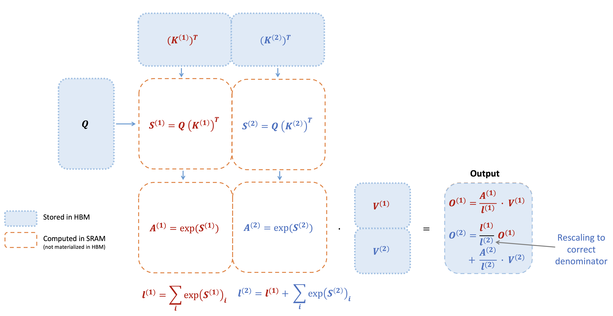

<figcaption>図1: key K が 2 つのブロックに分割され、value V も 2 つのブロックに分割されているときに、FlashAttention の forward pass がどのように実行されるかを示す図。各ブロックに関して attention を計算し出力を再スケールすることで、中間行列 S と P の高価なメモリ読み書きを避けながら、最後には正しい答えが得られる。図を簡単にするため、softmax において各要素から行ごとの最大値を引くステップは省略している。</figcaption>
</figure>

#### 2.3.2 Backward pass

backward pass においては、入力 $\mathbf{Q},\mathbf{K},\mathbf{V}$ のブロックがすでに SRAM へロードされた時点で attention 行列 $\mathbf{S}$ と $\mathbf{P}$ の値を再計算することによって、FlashAttention は大きな中間値を保存する必要を回避する。サイズ $N\times N$ の大きな行列 $\mathbf{S}$ と $\mathbf{P}$ を保存しなくてよいことにより、FlashAttention は系列長に応じて 10〜20 倍のメモリ節約をもたらす（必要メモリが系列長 $N$ について 2 乗ではなく線形になる）。backward pass はまた、メモリの読み書きが減ることによって 2〜4 倍の wall-clock 高速化も達成する。

backward pass は Section 2.2 の式にタイリングを適用する。backward pass は概念的には forward pass より単純である（softmax の再スケールがない）にもかかわらず、その実装は著しく込み入っている。これは、forward pass のわずか 2 回の行列積に対して、backward pass では 5 回の行列積を実行するために SRAM に保持すべき値がより多いためである。

## 3 FlashAttention-2: Algorithm, Parallelism, and Work Partitioning（FlashAttention-2: アルゴリズム・並列性・仕事の分割）

我々は FlashAttention-2 のアルゴリズムを記述する。これには non-matmul FLOPs の数を減らすための FlashAttention へのいくつかの調整が含まれる。次に、GPU 資源を最大限に活用するために異なるスレッドブロック上で計算をどう並列化するかを記述する。最後に、共有メモリへのアクセス量を減らすために 1 つのスレッドブロック内で異なる warp 間の仕事をどう分割するかを記述する。これらの改善は、Section 4 で検証されるように 2〜3 倍の高速化をもたらす。

### 3.1 Algorithm（アルゴリズム）

我々は non-matmul FLOPs の数を減らすため、FlashAttention のアルゴリズムを調整する。これは、現代の GPU が行列積をはるかに高速にする専用の計算ユニット（例えば Nvidia GPU 上の Tensor Core）を持つためである。例として、A100 GPU は FP16/BF16 の行列積について理論最大スループット 312 TFLOPs/s を持つが、non-matmul の FP32 については 19.5 TFLOPs/s しかない。別の考え方をすれば、**non-matmul の 1 FLOP は matmul の 1 FLOP より 16 倍高価である**。高いスループット（例えば理論最大 TFLOPs/s の 50% 超）を維持するためには、できるだけ多くの時間を matmul FLOPs に費やしたい。

#### 3.1.1 Forward pass

我々は Section 2.3 で示した online softmax の技法を再訪し、non-matmul FLOPs を減らすために 2 つの小さな調整を行う:

1. 出力の更新において、両方の項を $\mathrm{diag}(\ell^{(2)})^{-1}$ で再スケールする必要はない:

	$$
	\mathbf{O}^{(2)}=\mathrm{diag}(\ell^{(1)}/\ell^{(2)})^{-1}\mathbf{O}^{(1)}+\mathrm{diag}(\ell^{(2)})^{-1}e^{\mathbf{S}^{(2)}-m^{(2)}}\mathbf{V}^{(2)}.
	$$

	我々は代わりに $\mathbf{O}^{(2)}$ の「スケールしていない」版を保ち、統計量 $\ell^{(2)}$ を持ち回ることができる:

	$$
	\tilde{\mathbf{O}}^{(2)}=\mathrm{diag}(\ell^{(1)})^{-1}\mathbf{O}^{(1)}+e^{\mathbf{S}^{(2)}-m^{(2)}}\mathbf{V}^{(2)}.
	$$

	ループの一番最後においてのみ、最終的な $\tilde{\mathbf{O}}^{(\mathrm{last})}$ を $\mathrm{diag}(\ell^{(\mathrm{last})})^{-1}$ でスケールして正しい出力を得る。
2. backward pass のために最大値 $m^{(j)}$ と指数の和 $\ell^{(j)}$ の両方を保存する必要はない。logsumexp $L^{(j)}=m^{(j)}+\log(\ell^{(j)})$ だけを保存すればよい。

Section 2.3 の 2 ブロックの単純な場合において、online softmax の技法は次のようになる:

$$
\displaystyle m^{(1)}=\mathrm{rowmax}(\mathbf{S}^{(1)})\in\mathbb{R}^{B_{r}}
$$
$$
\displaystyle\ell^{(1)}=\mathrm{rowsum}(e^{\mathbf{S}^{(1)}-m^{(1)}})\in\mathbb{R}^{B_{r}}
$$
$$
\displaystyle\tilde{\mathbf{O}^{(1)}}=e^{\mathbf{S}^{(1)}-m^{(1)}}\mathbf{V}^{(1)}\in\mathbb{R}^{B_{r}\times d}
$$
$$
\displaystyle m^{(2)}=\max(m^{(1)},\mathrm{rowmax}(\mathbf{S}^{(2)}))=m
$$
$$
\displaystyle\ell^{(2)}=e^{m^{(1)}-m^{(2)}}\ell^{(1)}+\mathrm{rowsum}(e^{\mathbf{S}^{(2)}-m^{(2)}})=\mathrm{rowsum}(e^{\mathbf{S}^{(1)}-m})+\mathrm{rowsum}(e^{\mathbf{S}^{(2)}-m})=\ell
$$
$$
\displaystyle\tilde{\mathbf{P}}^{(2)}=\mathrm{diag}(\ell^{(2)})^{-1}e^{\mathbf{S}^{(2)}-m^{(2)}}
$$
$$
\displaystyle\tilde{\mathbf{O}}^{(2)}=\mathrm{diag}(e^{m^{(1)}-m^{(2)}})^{-1}\tilde{\mathbf{O}}^{(1)}+e^{\mathbf{S}^{(2)}-m^{(2)}}\mathbf{V}^{(2)}=e^{s^{(1)}-m}\mathbf{V}^{(1)}+e^{s^{(2)}-m}\mathbf{V}^{(2)}
$$
$$
\displaystyle\mathbf{O}^{(2)}=\mathrm{diag}(\ell^{(2)})^{-1}\tilde{\mathbf{O}}^{(2)}=\mathbf{O}.
$$

我々は完全な FlashAttention-2 の forward pass を Algorithm 1 に記述する。

**Algorithm 1** FlashAttention-2 forward pass

> **必要な入力**: HBM 上の行列 $\mathbf{Q},\mathbf{K},\mathbf{V}\in\mathbb{R}^{N\times d}$、ブロックサイズ $B_{c}$, $B_{r}$。
>
> 1. $\mathbf{Q}$ を各サイズ $B_{r}\times d$ の $T_{r}=\left\lceil\frac{N}{B_{r}}\right\rceil$ 個のブロック $\mathbf{Q}_{1},\dots,\mathbf{Q}_{T_{r}}$ に分割し、$\mathbf{K},\mathbf{V}$ を各サイズ $B_{c}\times d$ の $T_{c}=\left\lceil\frac{N}{B_{c}}\right\rceil$ 個のブロック $\mathbf{K}_{1},\dots,\mathbf{K}_{T_{c}}$ および $\mathbf{V}_{1},\dots,\mathbf{V}_{T_{c}}$ に分割する。
> 2. 出力 $\mathbf{O}\in\mathbb{R}^{N\times d}$ を各サイズ $B_{r}\times d$ の $T_{r}$ 個のブロック $\mathbf{O}_{i},\dots,\mathbf{O}_{T_{r}}$ に分割し、logsumexp $L$ を各サイズ $B_{r}$ の $T_{r}$ 個のブロック $L_{i},\dots,L_{T_{r}}$ に分割する。
> 3. **for** $1\leq i\leq T_{r}$ **do**
> 4. &nbsp;&nbsp;&nbsp;&nbsp;$\mathbf{Q}_{i}$ を HBM からオンチップ SRAM へロードする。
> 5. &nbsp;&nbsp;&nbsp;&nbsp;オンチップで $\mathbf{O}_{i}^{(0)}=(0)_{B_{r}\times d}\in\mathbb{R}^{B_{r}\times d},\ell_{i}^{(0)}=(0)_{B_{r}}\in\mathbb{R}^{B_{r}},m_{i}^{(0)}=(-\infty)_{B_{r}}\in\mathbb{R}^{B_{r}}$ と初期化する。
> 6. &nbsp;&nbsp;&nbsp;&nbsp;**for** $1\leq j\leq T_{c}$ **do**
> 7. &nbsp;&nbsp;&nbsp;&nbsp;&nbsp;&nbsp;&nbsp;&nbsp;$\mathbf{K}_{j},\mathbf{V}_{j}$ を HBM からオンチップ SRAM へロードする。
> 8. &nbsp;&nbsp;&nbsp;&nbsp;&nbsp;&nbsp;&nbsp;&nbsp;オンチップで $\mathbf{S}_{i}^{(j)}=\mathbf{Q}_{i}\mathbf{K}_{j}^{T}\in\mathbb{R}^{B_{r}\times B_{c}}$ を計算する。
> 9. &nbsp;&nbsp;&nbsp;&nbsp;&nbsp;&nbsp;&nbsp;&nbsp;オンチップで $m_{i}^{(j)}=\mathrm{max}(m_{i}^{(j-1)},\mathrm{rowmax}(\mathbf{S}_{i}^{(j)}))\in\mathbb{R}^{B_{r}}$、$\tilde{\mathbf{P}}_{i}^{(j)}=\exp(\mathbf{S}_{i}^{(j)}-m_{i}^{(j)})\in\mathbb{R}^{B_{r}\times B_{c}}$（要素ごと）、$\ell_{i}^{(j)}=e^{m_{i}^{j-1}-m_{i}^{(j)}}\ell_{i}^{(j-1)}+\mathrm{rowsum}(\tilde{\mathbf{P}}_{i}^{(j)})\in\mathbb{R}^{B_{r}}$ を計算する。
> 10. &nbsp;&nbsp;&nbsp;&nbsp;&nbsp;&nbsp;&nbsp;&nbsp;オンチップで $\mathbf{O}_{i}^{(j)}=\mathrm{diag}(e^{m_{i}^{(j-1)}-m_{i}^{(j)}})^{-1}\mathbf{O}_{i}^{(j-1)}+\tilde{\mathbf{P}}_{i}^{(j)}\mathbf{V}_{j}$ を計算する。
> 11. &nbsp;&nbsp;&nbsp;&nbsp;**end for**
> 12. &nbsp;&nbsp;&nbsp;&nbsp;オンチップで $\mathbf{O}_{i}=\mathrm{diag}(\ell_{i}^{(T_{c})})^{-1}\mathbf{O}_{i}^{(T_{c})}$ を計算する。
> 13. &nbsp;&nbsp;&nbsp;&nbsp;オンチップで $L_{i}=m_{i}^{(T_{c})}+\log(\ell_{i}^{(T_{c})})$ を計算する。
> 14. &nbsp;&nbsp;&nbsp;&nbsp;$\mathbf{O}_{i}$ を $\mathbf{O}$ の $i$ 番目のブロックとして HBM へ書き出す。
> 15. &nbsp;&nbsp;&nbsp;&nbsp;$L_{i}$ を $L$ の $i$ 番目のブロックとして HBM へ書き出す。
> 16. **end for**
> 17. 出力 $\mathbf{O}$ と logsumexp $L$ を返す。

##### Causal masking.（因果マスク）

attention の一般的なユースケースの一つは自己回帰的な言語モデリングであり、そこでは attention 行列 $\mathbf{S}$ に因果マスクを適用する必要がある（すなわち $j>i$ であるすべての要素 $\mathbf{S}_{ij}$ を $-\infty$ に設定する）。

1. FlashAttention と FlashAttention-2 はすでにブロック単位で動作しているので、列インデックスがすべて行インデックスより大きいブロック（大きな系列長に対してはおよそ半分のブロック）については、そのブロックの計算をスキップできる。これは因果マスクなしの attention と比べておよそ 1.7〜1.8 倍の高速化をもたらす。
2. 行インデックスが列インデックスより厳密に小さいことが保証されているブロックについては、因果マスクを適用する必要がない。これは、各行について（ブロックが正方であると仮定すれば）因果マスクを適用する必要があるのは 1 ブロックだけであることを意味する。

##### Correctness, runtime, and memory requirement.（正しさ・実行時間・メモリ要件）

FlashAttention と同様に、Algorithm 1 は正しい出力 $\mathbf{O}=\mathrm{softmax}(\mathbf{Q}\mathbf{K}^{\top})\mathbf{V}$ を（近似なしに）返し、$O(N^{2}d)$ FLOPs を用い、入力と出力を超えて $O(N)$ の追加メモリ（logsumexp $L$ を保存するため）を必要とする。証明は [^5] の証明とほぼ同じなので、ここでは省略する。

#### 3.1.2 Backward pass

FlashAttention-2 の backward pass は FlashAttention のそれとほぼ同じである。我々は、softmax において行ごとの最大値と行ごとの指数の和の両方ではなく、行ごとの logsumexp $L$ のみを使うという小さな調整を行う。完全性のため、backward pass の記述を Algorithm 2 に含める。

**Algorithm 2** FlashAttention-2 Backward Pass

> **必要な入力**: HBM 上の行列 $\mathbf{Q},\mathbf{K},\mathbf{V},\mathbf{O},\mathbf{dO}\in\mathbb{R}^{N\times d}$、HBM 上のベクトル $L\in\mathbb{R}^{N}$、ブロックサイズ $B_{c}$, $B_{r}$。
>
> 1. $\mathbf{Q}$ を各サイズ $B_{r}\times d$ の $T_{r}=\left\lceil\frac{N}{B_{r}}\right\rceil$ 個のブロック $\mathbf{Q}_{1},\dots,\mathbf{Q}_{T_{r}}$ に分割し、$\mathbf{K},\mathbf{V}$ を各サイズ $B_{c}\times d$ の $T_{c}=\left\lceil\frac{N}{B_{c}}\right\rceil$ 個のブロック $\mathbf{K}_{1},\dots,\mathbf{K}_{T_{c}}$ および $\mathbf{V}_{1},\dots,\mathbf{V}_{T_{c}}$ に分割する。
> 2. $\mathbf{O}$ を各サイズ $B_{r}\times d$ の $T_{r}$ 個のブロック $\mathbf{O}_{i},\dots,\mathbf{O}_{T_{r}}$ に分割し、$\mathbf{dO}$ を各サイズ $B_{r}\times d$ の $T_{r}$ 個のブロック $\mathbf{dO}_{i},\dots,\mathbf{dO}_{T_{r}}$ に分割し、$L$ を各サイズ $B_{r}$ の $T_{r}$ 個のブロック $L_{i},\dots,L_{T_{r}}$ に分割する。
> 3. HBM 上で $\mathbf{dQ}=(0)_{N\times d}$ と初期化し、各サイズ $B_{r}\times d$ の $T_{r}$ 個のブロック $\mathbf{dQ}_{1},\dots,\mathbf{dQ}_{T_{r}}$ に分割する。$\mathbf{dK},\mathbf{dV}\in\mathbb{R}^{N\times d}$ を各サイズ $B_{c}\times d$ の $T_{c}$ 個のブロック $\mathbf{dK}_{1},\dots,\mathbf{dK}_{T_{c}}$ および $\mathbf{dV}_{1},\dots,\mathbf{dV}_{T_{c}}$ に分割する。
> 4. $D=\mathrm{rowsum}(\mathbf{dO}\circ\mathbf{O})\in\mathbb{R}^{d}$（要素ごとの積）を計算し、$D$ を HBM へ書き出して各サイズ $B_{r}$ の $T_{r}$ 個のブロック $D_{1},\dots,D_{T_{r}}$ に分割する。
> 5. **for** $1\leq j\leq T_{c}$ **do**
> 6. &nbsp;&nbsp;&nbsp;&nbsp;$\mathbf{K}_{j},\mathbf{V}_{j}$ を HBM からオンチップ SRAM へロードする。
> 7. &nbsp;&nbsp;&nbsp;&nbsp;SRAM 上で $\mathbf{dK}_{j}=(0)_{B_{c}\times d},\mathbf{dV}_{j}=(0)_{B_{c}\times d}$ と初期化する。
> 8. &nbsp;&nbsp;&nbsp;&nbsp;**for** $1\leq i\leq T_{r}$ **do**
> 9. &nbsp;&nbsp;&nbsp;&nbsp;&nbsp;&nbsp;&nbsp;&nbsp;$\mathbf{Q}_{i},\mathbf{O}_{i},\mathbf{dO}_{i},\mathbf{dQ}_{i},L_{i},D_{i}$ を HBM からオンチップ SRAM へロードする。
> 10. &nbsp;&nbsp;&nbsp;&nbsp;&nbsp;&nbsp;&nbsp;&nbsp;オンチップで $\mathbf{S}_{i}^{(j)}=\mathbf{Q}_{i}\mathbf{K}_{j}^{T}\in\mathbb{R}^{B_{r}\times B_{c}}$ を計算する。
> 11. &nbsp;&nbsp;&nbsp;&nbsp;&nbsp;&nbsp;&nbsp;&nbsp;オンチップで $\mathbf{P}_{i}^{(j)}=\exp(\mathbf{S}_{ij}-L_{i})\in\mathbb{R}^{B_{r}\times B_{c}}$ を計算する。
> 12. &nbsp;&nbsp;&nbsp;&nbsp;&nbsp;&nbsp;&nbsp;&nbsp;オンチップで $\mathbf{dV}_{j}\leftarrow\mathbf{dV}_{j}+(\mathbf{P}_{i}^{(j)})^{\top}\mathbf{dO}_{i}\in\mathbb{R}^{B_{c}\times d}$ を計算する。
> 13. &nbsp;&nbsp;&nbsp;&nbsp;&nbsp;&nbsp;&nbsp;&nbsp;オンチップで $\mathbf{dP}_{i}^{(j)}=\mathbf{dO}_{i}\mathbf{V}_{j}^{\top}\in\mathbb{R}^{B_{r}\times B_{c}}$ を計算する。
> 14. &nbsp;&nbsp;&nbsp;&nbsp;&nbsp;&nbsp;&nbsp;&nbsp;オンチップで $\mathbf{dS}_{i}^{(j)}=\mathbf{P}_{i}^{(j)}\circ(\mathbf{dP}_{i}^{(j)}-D_{i})\in\mathbb{R}^{B_{r}\times B_{c}}$ を計算する。
> 15. &nbsp;&nbsp;&nbsp;&nbsp;&nbsp;&nbsp;&nbsp;&nbsp;$\mathbf{dQ}_{i}$ を HBM から SRAM へロードし、オンチップで $\mathbf{dQ}_{i}\leftarrow\mathbf{dQ}_{i}+\mathbf{dS}_{i}^{(j)}\mathbf{K}_{j}\in\mathbb{R}^{B_{r}\times d}$ と更新し、HBM へ書き戻す。
> 16. &nbsp;&nbsp;&nbsp;&nbsp;&nbsp;&nbsp;&nbsp;&nbsp;オンチップで $\mathbf{dK}_{j}\leftarrow\mathbf{dK}_{j}+{\mathbf{dS}_{i}^{(j)}}^{\top}\mathbf{Q}_{i}\in\mathbb{R}^{B_{c}\times d}$ を計算する。
> 17. &nbsp;&nbsp;&nbsp;&nbsp;**end for**
> 18. &nbsp;&nbsp;&nbsp;&nbsp;$\mathbf{dK}_{j},\mathbf{dV}_{j}$ を HBM へ書き出す。
> 19. **end for**
> 20. $\mathbf{dQ},\mathbf{dK},\mathbf{dV}$ を返す。

##### Multi-query attention and grouped-query attention.（マルチクエリ attention とグループ化クエリ attention）

マルチクエリ attention（MQA）[^15] とグループ化クエリ attention（GQA）[^1] は、推論時の KV cache のサイズを削減するために、複数の query のヘッドが同じ key と value のヘッドに attend する attention の変種である。計算のために key と value のヘッドを複製する代わりに、我々はヘッドへのインデックスを暗黙的に操作して同じ計算を実行する。backward pass においては、暗黙的に複製された異なるヘッドにわたって勾配 $\mathbf{dK}$ と $\mathbf{dV}$ を合計する必要がある。

### 3.2 Parallelism（並列性）

FlashAttention の最初の版は、バッチサイズとヘッド数にわたって並列化する。我々は 1 つの attention ヘッドを処理するのに 1 つのスレッドブロックを用い、全体で $\text{バッチサイズ}\cdot\text{ヘッド数}$ 個のスレッドブロックが存在する。各スレッドブロックはストリーミングマルチプロセッサ（SM）上で実行されるようにスケジュールされ、例えば A100 GPU にはこの SM が 108 個ある。このスケジューリングは、この数が大きい（たとえば 80 以上の）場合には効率的である。GPU 上のほぼすべての計算資源を実効的に使えるからである。

長い系列の場合（これは通常、小さなバッチサイズあるいは少ないヘッド数を意味する）、GPU 上のマルチプロセッサをより良く活用するために、我々はいま**系列長の次元にわたっても追加で並列化する**。これはこの領域において大幅な高速化をもたらす。

##### Forward pass.

外側ループ（系列長にわたる）は **embarrassingly parallel**（互いに通信を必要としないほど完全に並列）であることが分かるので、我々はそれらを互いに通信する必要のない異なるスレッドブロック上にスケジュールする。我々はまた FlashAttention と同様に、バッチ次元とヘッド数の次元にわたっても並列化する。系列長にわたる並列性の増加は、バッチサイズとヘッド数が小さいときに占有率（使用されている GPU 資源の割合）を改善する助けとなり、この場合の高速化につながる。

ループの順序を入れ替える（外側ループを行ブロックにわたるものとし内側ループを列ブロックにわたるものとする。元の FlashAttention 論文ではその逆であった）というこれらのアイデア、および系列長の次元にわたって並列化するというアイデアは、**Phil Tillet によって Triton [^17] 実装において最初に提案・実装された**。3

> **訳注（脚注 3）**: https://github.com/openai/triton/blob/main/python/tutorials/06-fused-attention.py

##### Backward pass.

異なる列ブロック間で共有される計算は Algorithm 2 における $\mathbf{dQ}$ の更新だけであることに注意する。そこでは $\mathbf{dQ}_{i}$ を HBM から SRAM へロードし、オンチップで $\mathbf{dQ}_{i}\leftarrow\mathbf{dQ}_{i}+\mathbf{dS}_{i}^{(j)}\mathbf{K}_{j}$ と更新し、HBM へ書き戻す必要がある。そこで我々は系列長の次元にわたっても並列化し、backward pass の各列ブロックに対して 1 つのスレッドブロックをスケジュールする。$\mathbf{dQ}$ を更新するために異なるスレッドブロック間で通信するのに atomic add を用いる。

我々は並列化の方式を Fig. 2 に記述する。

<figure>

<figcaption>図2: forward pass（左）では、各ワーカ（スレッドブロック）が attention 行列の行のブロックを担当するようにワーカを並列化する。backward pass（右）では、各ワーカが attention 行列の列のブロックを担当する。</figcaption>
</figure>

### 3.3 Work Partitioning Between Warps（warp 間の仕事の分割）

Section 3.2 でスレッドブロックをどうスケジュールするかを述べたが、各スレッドブロックの内部でも、異なる warp 間で仕事をどう分割するかを決めなければならない。我々は典型的にはスレッドブロックあたり 4 個または 8 個の warp を用い、その分割は Fig. 3 に記述されている。

##### Forward pass.

各ブロックについて、FlashAttention は $\mathbf{K}$ と $\mathbf{V}$ を 4 つの warp に分割し、$\mathbf{Q}$ はすべての warp からアクセス可能なままにする。各 warp は掛け算して $\mathbf{Q}\mathbf{K}^{\top}$ のスライスを得た後、$\mathbf{V}$ のスライスと掛け合わせ、結果を足し合わせるために通信する必要がある。これは「split-K」方式と呼ばれる。しかしこれは非効率である。すべての warp が中間結果を共有メモリへ書き出し、同期し、それから中間結果を足し合わせる必要があるからである。これらの共有メモリの読み書きが FlashAttention の forward pass を遅くしている。

FlashAttention-2 では、我々は代わりに $\mathbf{Q}$ を 4 つの warp に分割し、$\mathbf{K}$ と $\mathbf{V}$ をすべての warp からアクセス可能なままにする。各 warp が行列積を実行して $\mathbf{Q}\mathbf{K}^{\top}$ のスライスを得た後、共有された $\mathbf{V}$ のスライスと掛け合わせるだけで、対応する出力のスライスが得られる。**warp 間の通信は不要である。** 共有メモリの読み書きの削減が高速化をもたらす（Section 4）。

<figure>

<figcaption>図3(a): FlashAttention。Q がすべての warp からアクセスされ（点線）、Kᵀ と V が異なる warp に分割される（破線）。</figcaption>
</figure>

<figure>

<figcaption>図3(b): FlashAttention-2。Q が異なる warp に分割され（破線）、Kᵀ と V がすべての warp からアクセスされる（点線）。図3 全体のキャプション: forward pass における異なる warp 間の仕事の分割。（訳注: この (b) パネルはクリップから脱落していたため ar5iv から復元した。図3 の本キャプションも同様に復元したものである。）</figcaption>
</figure>

##### Backward pass.

backward pass についても同様に、我々は「split-K」方式を避けるように warp を分割することを選ぶ。しかしそれでも、すべての異なる入力と勾配 $\mathbf{Q},\mathbf{K},\mathbf{V},\mathbf{O},\mathbf{dO},\mathbf{dQ},\mathbf{dK},\mathbf{dV}$ の間のより複雑な依存関係のために、ある程度の同期は必要である。それでもなお、「split-K」を避けることは共有メモリの読み書きを減らし、やはり高速化をもたらす。

##### Tuning block sizes（ブロックサイズのチューニング）

ブロックサイズを増やすことは一般に共有メモリのロード／ストアを減らすが、必要なレジスタ数と共有メモリの総量を増やす。あるブロックサイズを超えると、レジスタスピルが著しい速度低下を引き起こすか、必要な共有メモリの量が GPU が持つ量より大きくなり、カーネルがまったく実行できなくなる。典型的には、ヘッド次元 $d$ とデバイスの共有メモリサイズに応じて、$\{64,128\}\times\{64,128\}$ のサイズのブロックを選ぶ。

ブロックサイズの選択肢は本質的に 4 通りしかないので我々は各ヘッド次元について手動でチューニングしているが、この手作業を避けるために自動チューニングが有益でありうる。これは今後の課題とする。

## 4 Empirical Validation（実験的検証）

我々は、トランスフォーマーモデルの訓練に FlashAttention-2 を用いることの影響を評価する。

- **attention のベンチマーク。** 我々は異なる系列長にわたって FlashAttention-2 の実行時間を測定し、PyTorch の標準実装、FlashAttention、および Triton での FlashAttention と比較する。FlashAttention-2 が FlashAttention より 1.7〜3.0 倍速く、Triton での FlashAttention より 1.3〜2.5 倍速く、標準的な attention 実装より 3〜10 倍速いことを確認する。FlashAttention-2 は最大 230 TFLOPs/s に達し、これは A100 GPU 上の理論最大 TFLOPs/s の 73% である。
- **エンドツーエンドの訓練速度。** 系列長 2k または 8k で 1.3B および 2.7B サイズの GPT スタイルモデルをエンドツーエンドで訓練するのに使ったとき、FlashAttention-2 は FlashAttention と比べて最大 1.3 倍、FlashAttention を使わないベースラインと比べて 2.8 倍の高速化をもたらす。FlashAttention-2 は A100 GPU あたり最大 225 TFLOPs/s（モデル FLOPs 利用率 72%）に達する。

### 4.1 Benchmarking Attention（attention のベンチマーク）

我々は A100 80GB SXM4 GPU 上で、異なる設定（因果マスクなし／あり、ヘッド次元 64 または 128）について異なる attention 手法の実行時間を測定する。結果を Fig. 4、Fig. 5、Fig. 6 に報告する。これらは FlashAttention-2 が FlashAttention および xformers での FlashAttention（「cutlass」実装）よりおよそ 2 倍速いことを示している。FlashAttention-2 は Triton での FlashAttention より forward pass でおよそ 1.3〜1.5 倍、backward pass でおよそ 2 倍速い。PyTorch での標準的な attention 実装と比べると、FlashAttention-2 は最大 10 倍速くなりうる。

ベンチマークの設定: 我々は系列長を 512, 1k, …, 16k と変化させ、トークンの総数が 16k になるようにバッチサイズを設定する。隠れ次元を 2048 とし、ヘッド次元は 64 または 128（すなわち 32 ヘッドまたは 16 ヘッド）とする。forward pass の FLOPs を計算するには、次を用いる:

$$
4\cdot\text{seqlen}^{2}\cdot\text{head dimension}\cdot\text{number of heads}.
$$

因果マスクありの場合は、およそ半分の要素しか計算されないことを考慮してこの数を 2 で割る。backward pass の FLOPs を得るには、forward pass の FLOPs を 2.5 倍する（forward pass には 2 回の行列積があり、再計算のために backward pass には 5 回の行列積があるため）。

<figure>

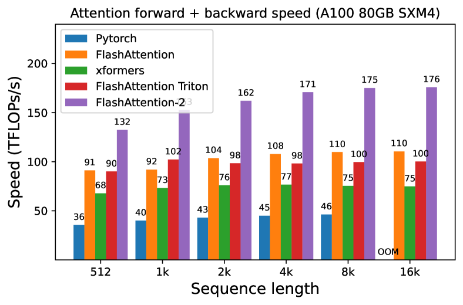

<figcaption>図4(a): 因果マスクなし、ヘッド次元 64。</figcaption>
</figure>

<figure>

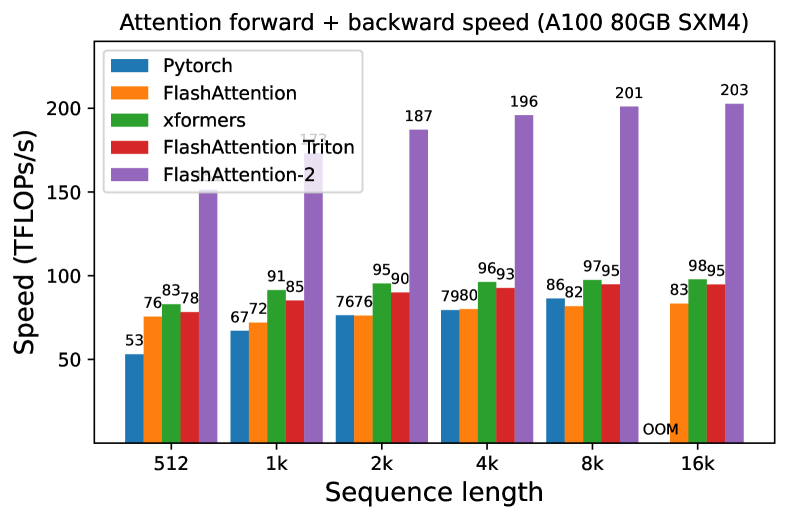

<figcaption>図4(b): 因果マスクなし、ヘッド次元 128。</figcaption>
</figure>

<figure>

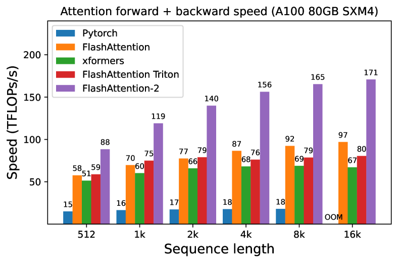

<figcaption>図4(c): 因果マスクあり、ヘッド次元 64。</figcaption>
</figure>

<figure>

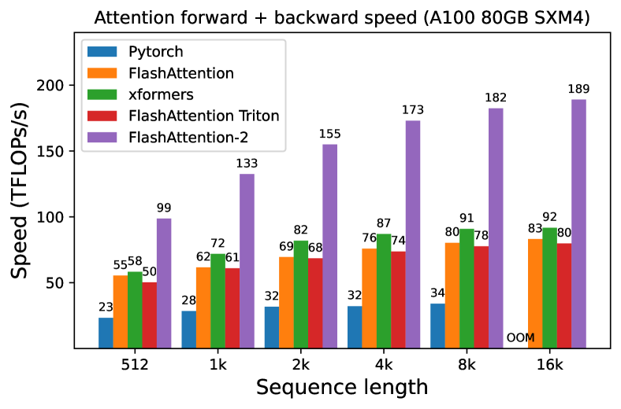

<figcaption>図4(d): 因果マスクあり、ヘッド次元 128。図4 全体のキャプション: A100 GPU における attention の forward + backward 速度。（訳注: (b)(c)(d) の 3 枚と図4 の本キャプションはクリップから脱落していたため ar5iv から復元した。）</figcaption>
</figure>

<figure>

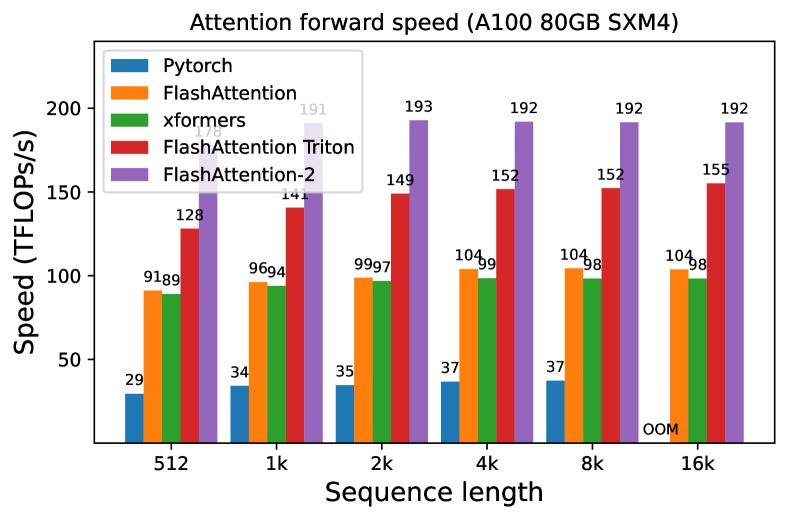

<figcaption>図5(a): 因果マスクなし、ヘッド次元 64。</figcaption>
</figure>

<figure>

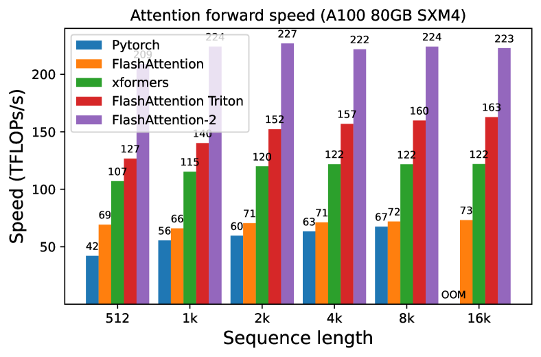

<figcaption>図5(b): 因果マスクなし、ヘッド次元 128。</figcaption>
</figure>

<figure>

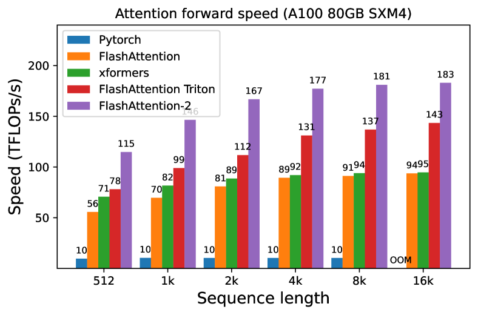

<figcaption>図5(c): 因果マスクあり、ヘッド次元 64。</figcaption>
</figure>

<figure>

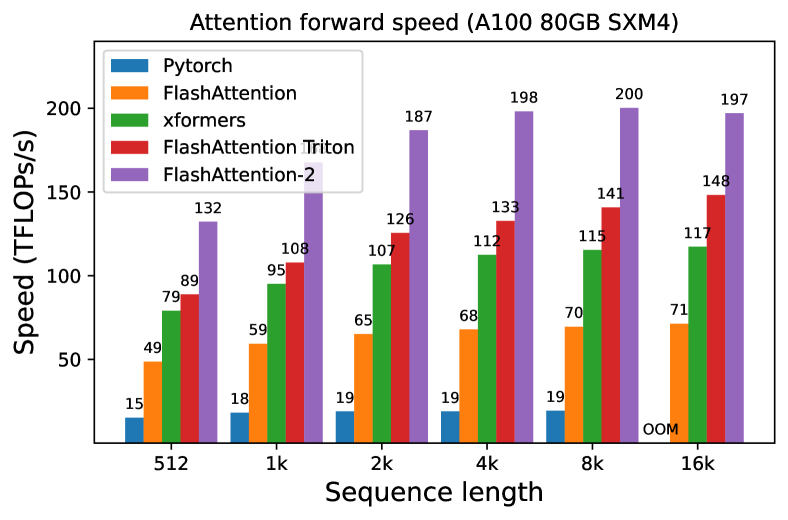

<figcaption>図5(d): 因果マスクあり、ヘッド次元 128。図5 全体のキャプション: A100 GPU における attention の forward 速度。（訳注: (b)(c)(d) の 3 枚と図5 の本キャプションはクリップから脱落していたため ar5iv から復元した。）</figcaption>
</figure>

<figure>

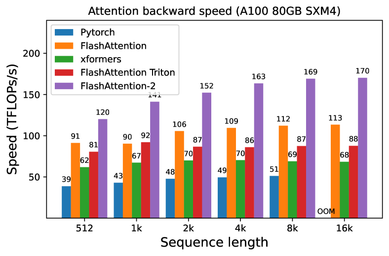

<figcaption>図6(a): 因果マスクなし、ヘッド次元 64。</figcaption>
</figure>

<figure>

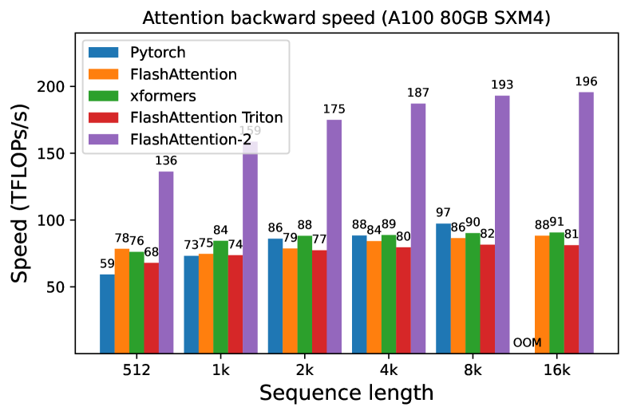

<figcaption>図6(b): 因果マスクなし、ヘッド次元 128。</figcaption>
</figure>

<figure>

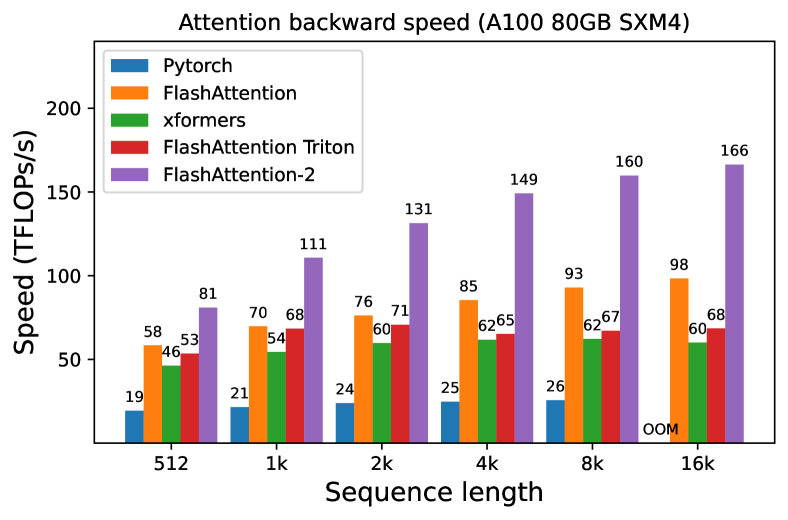

<figcaption>図6(c): 因果マスクあり、ヘッド次元 64。</figcaption>
</figure>

<figure>

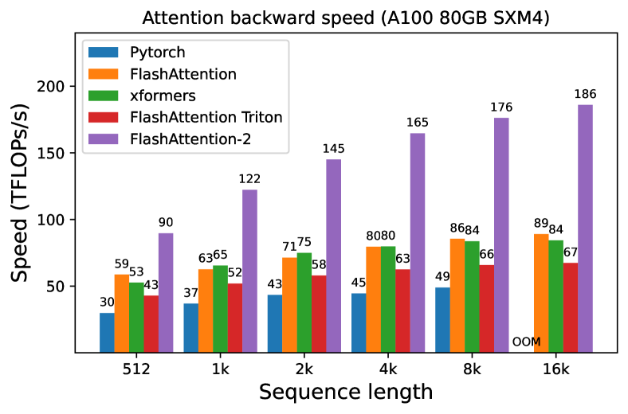

<figcaption>図6(d): 因果マスクあり、ヘッド次元 128。図6 全体のキャプション: A100 GPU における attention の backward 速度。（訳注: (b)(c)(d) の 3 枚と図6 の本キャプションはクリップから脱落していたため ar5iv から復元した。）</figcaption>
</figure>

同じ実装を H100 GPU 上でただ実行するだけで（TMA や第 4 世代 Tensor Core といった新機能を活用する特別な命令を使わずに）、我々は最大 335 TFLOPs/s を得る（Fig. 7）。新しい命令を使えば、H100 GPU 上でさらに 1.5〜2 倍の高速化が得られると期待している。それは今後の課題とする。

<figure>

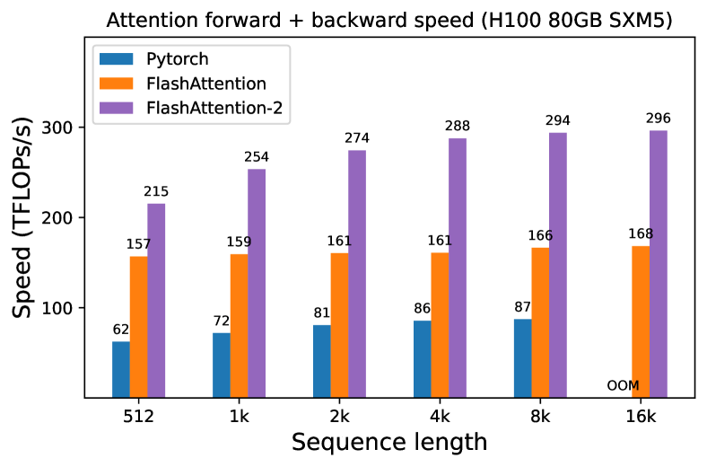

<figcaption>図7(a): 因果マスクなし、ヘッド次元 64。</figcaption>
</figure>

<figure>

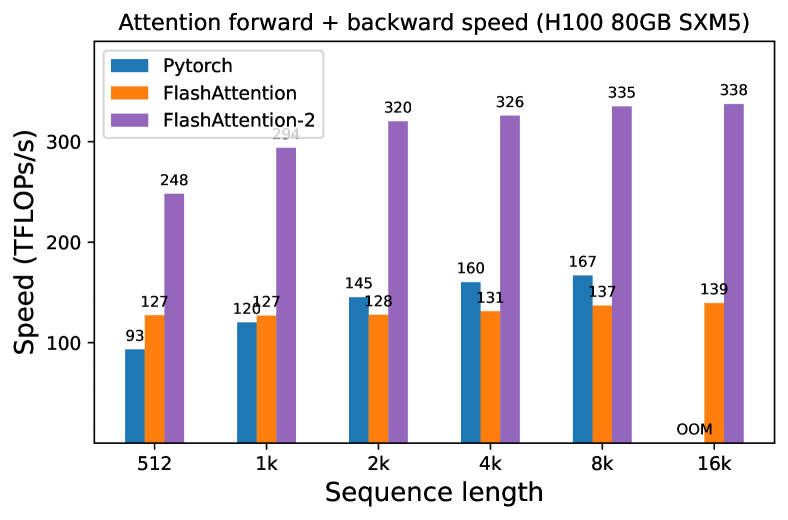

<figcaption>図7(b): 因果マスクなし、ヘッド次元 128。</figcaption>
</figure>

<figure>

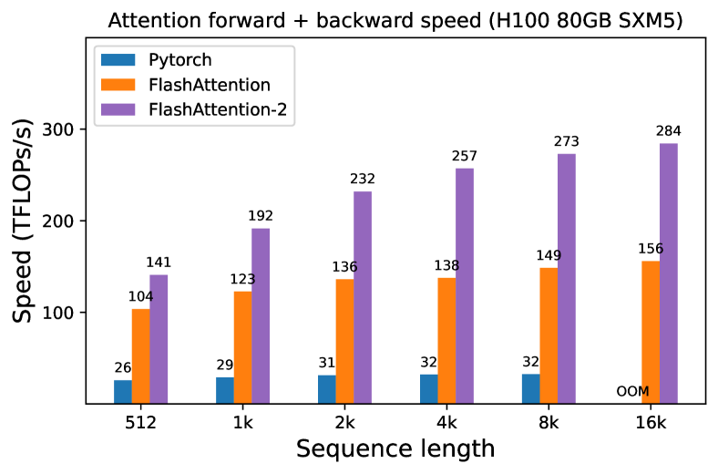

<figcaption>図7(c): 因果マスクあり、ヘッド次元 64。</figcaption>
</figure>

<figure>

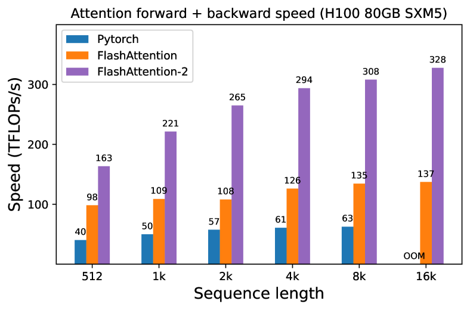

<figcaption>図7(d): 因果マスクあり、ヘッド次元 128。図7 全体のキャプション: H100 GPU における attention の forward + backward 速度。（訳注: (b)(c)(d) の 3 枚と図7 の本キャプションはクリップから脱落していたため ar5iv から復元した。）</figcaption>
</figure>

### 4.2 End-to-end Performance（エンドツーエンドの性能）

我々は 8 台の A100 80GB SXM 上で、1.3B または 2.7B パラメータの GPT スタイルモデルの訓練スループットを測定する。Table 1 に示すように、FlashAttention-2 は FlashAttention を使わないベースラインと比べて 2.8 倍、FlashAttention-2 と比べて 1.3 倍の高速化をもたらし、A100 GPU あたり最大 225 TFLOPs/s に達する。

> **訳注**: 原文は "1.3× speedup compared to FlashAttention-2" と書いているが、比較対象は FlashAttention の誤りである（自分自身に対して 1.3 倍にはなり得ない。Table 1 の GPT3-2.7B 8k context における 175 → 225 TFLOPs/s がおよそ 1.29 倍にあたる）。原ページでも同じ表記になっている。

なお我々は、Megatron-LM [^16]（および他の多くの論文やライブラリ）に従って、次の式で FLOPs を計算していることに注意されたい:

$$
6\cdot\text{seqlen}\cdot\text{number of params}+12\cdot\text{number of layers}\cdot\text{hidden dim}\cdot\text{seqlen}^{2}.
$$

第 1 項は重みと入力の掛け算による FLOPs を、第 2 項は attention による FLOPs を勘定している。しかし、因果マスクありでは attention の要素のおよそ半分しか計算する必要がないので、第 2 項は半分にすべきだと主張することもできる。我々は一貫性のため、文献の式に従う（attention の FLOPs を 2 で割らない）ことを選んだ。

**表1**: 8 台の A100 GPU 上での GPT スタイルモデルの訓練速度（TFLOPs/s/GPU）。FlashAttention-2 は最大 225 TFLOPs/s（モデル FLOPs 利用率 72%）に達する。FlashAttention なしで実行したベースラインと比較している。

| Model | Without FlashAttention | FlashAttention | FlashAttention-2 |
| --- | --- | --- | --- |
| GPT3-1.3B 2k context | 142 TFLOPs/s | 189 TFLOPs/s | 196 TFLOPs/s |
| GPT3-1.3B 8k context | 72 TFLOPS/s | 170 TFLOPs/s | 220 TFLOPs/s |
| GPT3-2.7B 2k context | 149 TFLOPs/s | 189 TFLOPs/s | 205 TFLOPs/s |
| GPT3-2.7B 8k context | 80 TFLOPs/s | 175 TFLOPs/s | 225 TFLOPs/s |

## 5 Discussion and Future Directions（議論と今後の方向）

FlashAttention-2 は FlashAttention より 2 倍速い。これは、以前 8k コンテキストのモデルを訓練していたのと同じ価格で、16k のより長いコンテキストを持つモデルを訓練できることを意味する。我々は、これが長い書籍やレポート、高解像度画像、音声や動画の理解にどう使われうるかに期待している。FlashAttention-2 は既存モデルの訓練・ファインチューニング・推論も高速化するだろう。

近い将来、我々は研究者やエンジニアと協力して、FlashAttention をさまざまな種類のデバイス（例えば H100 GPU、AMD GPU）や、FP8 のような新しいデータ型において広く適用可能にする計画である。当面の次のステップとして、我々は H100 GPU 向けに FlashAttention-2 を最適化し、新しいハードウェア機能（TMA、第 4 世代 Tensor Core、fp8）を使う計画である。FlashAttention-2 における低レベルの最適化と、高レベルのアルゴリズム的変更（例えば local、dilated、ブロックスパース attention）を組み合わせることで、はるかに長いコンテキストを持つ AI モデルを訓練できるようになるかもしれない。我々はまた、これらの最適化技法を容易にプログラム可能にするため、コンパイラ研究者と協働することにも期待している。

