# FP8-LM: FP8 による大規模言語モデルの訓練

> 原題: FP8-LM: Training FP8 Large Language Models
> 著者: Houwen Peng\*, Kan Wu\*, Yixuan Wei\*, Guoshuai Zhao, Yuxiang Yang, Ze Liu, Yifan Xiong, Ziyue Yang, Bolin Ni, Jingcheng Hu, Ruihang Li, Miaosen Zhang, Chen Li, Jia Ning, Ruizhe Wang, Zheng Zhang, Shuguang Liu, Joe Chau, Han Hu†, Peng Cheng†
> 所属: Microsoft Azure and Microsoft Research
> \* 同等の貢献　† 連絡先: {hanhu | pengc}@microsoft.com
> 出典: arXiv:2310.18313（ar5iv 版）

> **訳注（クリップの状態と復元）**
> - 底本は ar5iv 版の Web Clipper クリップ。**本 wiki でこれまで扱った中で最も欠落の多いクリップ**であった。以下をすべて原ページと照合して復元した。
>   1. **データ表 3 件が丸ごと欠落**していた。**Table 3**（SFT の比較）と **Table 4**（RLHF の比較）はキャプションごと消滅、**Table 6**（オプティマイザの精度分離）は**キャプションだけが残って数値表が消え、その位置に Figure 8 の画像（`x7.png`）が入り込んでいた**。
>   2. **図のキャプション 4 件が欠落**（Figure 4・7・8・9）。うち Figure 4 と Figure 7 は多パネル図で、**Figure 4 は 3 パネル中 (a) のみ**（`GPT-13b.png`・`GPT-175b.png` 欠落）、**Figure 7 も 3 パネル中 (a) のみ**（`x5.png`・`x6.png` 欠落）が残っていた。
>   3. **脚注 8 件の本文が欠落**していた（マーカーのみ残存）。復元して該当箇所に訳注として挿入した。
> - 復元した画像は 4 枚（`GPT-13b.png`・`GPT-175b.png`・`x5.png`・`x6.png`）。図はすべて `raw/assets/2023-fp8-lm/` にローカル保存し、そのパスを参照している。
> - 参考文献一覧と謝辞は既定どおり訳出しない。ただし「Contribution and Acknowledgement」節のうち**寄与の内訳**は本文として訳出した（脚注 † が参照しているため）。

## Abstract（要旨）

本論文では、大規模言語モデル（LLM）の効率的な訓練のための FP8 低ビットデータ形式を探究する。我々の主要な着眼は、**LLM の訓練における勾配やオプティマイザ状態といったほとんどの変数が、モデルの精度を損なうことなく、またハイパーパラメータの変更を要求することなく、低精度のデータ形式を採用できる**という点にある。具体的には、LLM を訓練するための新しい FP8 自動混合精度フレームワークを提案する。このフレームワークは、LLM の混合精度訓練と分散並列訓練を効率化するために **3 段階の FP8 活用レベル**を提供する。8 ビットの勾配・オプティマイザ状態・分散学習を、追加的に段階を追って組み込んでいく。実験結果は、H100 GPU プラットフォーム上での GPT-175B モデルの訓練において、我々の FP8 混合精度訓練フレームワークが**実メモリ使用量の 39% 削減**という顕著な成果を達成しただけでなく、広く採用されている BF16 のフレームワーク（すなわち Megatron-LM）より **75% 高速**に走り、Nvidia Transformer Engine の速度を **37% 上回った**ことを示している。これは大規模基盤モデルの訓練コストを大きく削減する。さらに、我々の FP8 混合精度訓練の方法論は汎用的である。LLM の指示チューニングや人間のフィードバックによる強化学習（RLHF）といった他のタスクにも滑らかに適用でき、ファインチューニングの費用の節約をもたらす。

> 訳注（脚注 †）: すべての著者の寄与は「Contribution and Acknowledgement」節にある。

## Introduction（はじめに）

大規模言語モデル（LLM）[^6] [^61] [^7] [^76] は言語の理解と生成において前例のない能力を示し、推論・数学・科学その他多くのタスクにおける突破口をもたらしてきた [^43] [^1]。しかし LLM の訓練は極端に高価である。たとえば PaLM は 540B のモデルを訓練するのに 6,144 個の TPUv4 チップを要し、GPT-3 175B は事前学習に数千 petaflop/s-days の計算を消費する [^7] [^6]。このことが、とりわけ次世代の超知能モデルのスケーリングに向けて、LLM の訓練コストを削減する必要性を動機づけている。

低精度訓練はコストを削減する最も有望な方向の一つである。高い速度・小さなメモリ使用量・低い通信オーバーヘッドを提供できるからである。Megatron-LM [^60]、MetaSeq [^76]、Colossal-AI [^27] といった既存のほとんどの訓練システムは、既定では FP32 完全精度か FP16/BF16 混合精度で LLM を訓練する。しかし、大きなモデルで完全な精度を達成するのにこれは必須ではない。Nvidia H100 GPU のリリースとともに、**FP8 が低精度表現の次世代のデータ型になりつつある** [^39] [^34]。理論上、FP8 は現行の 16 ビット・32 ビット浮動小数点の混合精度訓練と比べて **$2\times$ の高速化・50〜75% のメモリコスト削減・50〜75% の通信削減**を達成でき、次世代基盤モデルのスケールアップにとって非常に有望である。

残念ながら、FP8 訓練への現在の支援は稀で限られている。利用可能な唯一のフレームワークは Nvidia Transformer Engine（TE）[^40] だが、これは **FP8 を GEMM 計算にのみ適用し、master weight と勾配は依然として高精度（例: FP16 や FP32）で保持する**。その結果、端から端までの高速化・メモリと通信コストの節約は非常に限定的であり、FP8 の力を十分に引き出せていない。この問題に対処するため、我々は LLM 訓練のための極度に最適化された FP8 混合精度フレームワークを提案する。中核の着想は、**FP8 の計算・格納・通信を大規模モデル訓練の全過程へ浸透させる**ことであり、順伝播と逆伝播のすべてを低精度の FP8 で行うことで、先行フレームワーク [^33] [^40] [^34] と比べてシステム負荷を大きく削減する。具体的には、FP8 を用いて混合精度訓練と分散訓練を効率化する 3 つの最適化レベルを設計する。3 つのレベルは、8 ビットの集合通信・オプティマイザ・分散並列訓練を段階を追って追加的に組み込んでいく。**最適化レベルが高いほど、LLM 訓練でより多くの FP8 を用いる**ことを意味する。さらに、数千の GPU 上で訓練される GPT-175B のような大規模訓練のために、我々のフレームワークはテンソル・パイプライン・系列の各並列性を含む FP8 低ビット並列性を提供する。

<figure>

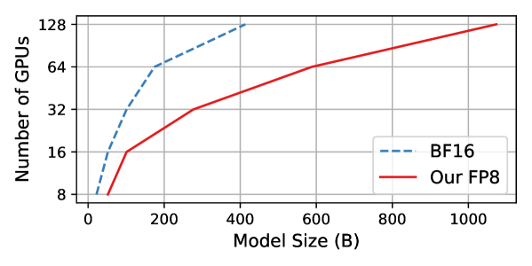

<figcaption>図1: 80GB メモリの Nvidia H100 GPU のクラスタ上で、広く使われている BF16 と我々の FP8 混合精度訓練の手法のいずれかを活用したときに到達可能な最大モデルサイズを比較した分析。</figcaption>
</figure>

FP8 で LLM を訓練するのは自明でない。課題は、FP8 のデータ形式に内在する狭い動的範囲と縮約された精度から生じる量子化誤差と相まって、データのアンダーフローやオーバーフローといった問題に由来する。これらの課題は訓練の全過程を通じて数値的な不安定性と不可逆な発散を引き起こす。それらに取り組むために、我々は決定的な情報の損失を防ぐ 2 つの技法を提案する——**精度分離（precision decoupling）** と**自動スケーリング（automatic scaling）** である。前者は、重み・勾配・オプティマイザ状態といったパラメータに対するデータ精度の影響を分離し、精度に敏感でない構成要素へ縮約された精度を割り当てるものである。後者は、テンソルのスケーリング係数を動的に調整することで勾配値を FP8 のデータ形式の表現範囲内に保ち、それによって all-reduce 通信の間のアンダーフローとオーバーフローの発生を緩和するものである。

提案する FP8 低精度フレームワークを検証するため、我々はそれを GPT 型のモデルの訓練——事前学習と教師ありファインチューニング（SFT）の双方——に適用する。実験結果は我々の FP8 の方法論の有効性を示しており、広く用いられる BF16 混合精度訓練の手法と比べて、**実メモリ使用量の 29〜39% の削減**（例: GPT-7B で 29%、GPT-175B で 39%）と、**重みに関わる通信オーバーヘッドの 63〜65% の減少**という実質的な恩恵をもたらす。学習率や weight decay といったいかなるハイパーパラメータの変更もなしに、FP8 を用いて訓練したモデルは、事前学習と下流タスクの双方で BF16 高精度を用いたものと同等の性能を示す。特筆すべきは、GPT-175B モデルの訓練において、我々の FP8 混合精度フレームワークが TE [^40] と比べて訓練時間を 37% 削減し、H100 GPU プラットフォーム上で 42% 少ないメモリしか消費しないことである。より重要なことに、低精度 FP8 の活用によって達成されるコスト削減は、Fig. 1 に示すとおり**モデルの規模が拡大し続けるにつれてさらに増大しうる**。

ファインチューニングについては、事前学習済み LLM を最終タスクとユーザーの選好により良く整合させるために、指示チューニングと人間のフィードバックによる強化学習（RLHF）に FP8 混合精度を用いる。具体的には、公開されているユーザー共有の指示追従データ [^59] 上で事前学習済みモデルをファインチューニングする。我々の FP8 混合精度でチューニングされたモデルは、AlpacaEval [^28] と MT-Bench [^77] のベンチマークにおいて、半精度 BF16 [^77] を用いたものと同等の性能を示しつつ、**訓練速度の 27% の改善**を達成する。さらに、FP8 混合精度は訓練中に複数のモデルを読み込む必要のある過程である RLHF において相当な潜在力を示す。訓練に FP8 を活用することで、広く用いられる RLHF のフレームワーク AlpacaFarm [^14] は**モデル重みの 32% の削減**と**オプティマイザ状態のメモリ消費の 62% の削減**をもたらしうる。これは我々の FP8 低精度訓練フレームワークの汎用性と適応性をさらに示している。

我々は LLM のための次世代 FP8 低精度訓練の設計を推し進めるべく、次の貢献をなす。

- **新しい FP8 混合精度訓練フレームワーク。** 8 ビットの重み・勾配・オプティマイザ・分散訓練を、アドオン方式で段階的に解放し、使うのが簡便である。この 8 ビットのフレームワークは、ハイパーパラメータや訓練レシピへのいかなる変更も要求することなく、既存の 16/32 ビット混合精度の対応物の単純なドロップイン置換として使える。加えて、数行のコードで 8 ビット低精度訓練を可能にする PyTorch 実装を提供する。
- **FP8 で訓練された GPT 型モデルの新しいファミリ。** 提案する FP8 の方式を GPT の事前学習とファインチューニング（すなわち SFT と RLHF）へ適用し、70 億から 1,750 億パラメータに及ぶ多様なモデル規模でその潜在力を示す。テンソル・パイプライン・系列の各並列性を含む、広く用いられる並列計算のパラダイムに FP8 の支援を装備し、大規模基盤モデルの訓練に FP8 を活用できるようにする。Megatron-LM [^60] の実装に基づく**初の FP8 GPT 訓練コードベースをオープンソース化する**。

我々は、我々の FP8 フレームワークのリリースが、大規模基盤モデルに特化した次世代の低精度訓練システムの新しいパラダイムを確立することを期待している。

## FP8 LLMs（FP8 の LLM）

混合精度 [^33] は、計算とメモリの効率を改善するために LLM の訓練で広く用いられてきた。最も広く用いられる混合精度の方式は FP16-FP32 と BF16-FP32 である。FP16 の限られた数値範囲ゆえに、FP16-FP32 の方式は大きなモデルの訓練において不安定性が知られてきた [^48] [^75]。その結果、コミュニティは現在 LLM の訓練に BF16-FP32 を一般に採用している（Megatron-Turing NLG-530B [^61]、Bloom-175B [^57]、Gopher [^48] など）。その根底にある理由は、**BF16 が数値的安定性を保つ広い動的範囲を持ちつつ、完全精度の FP32 の性能に匹敵する**ことである。さらに BF16 は FP32 と比べて半分のビット数しか使わないので、計算効率を改善しながら相当なメモリ使用量を削減する。

FP8 は、計算コストをさらに削減するための 16 ビットのデータ形式からの自然な進化である。しかし縮約精度の FP8 で LLM を訓練することは新しい課題を突きつける。FP8<sup>1</sup> の動的範囲と表現精度は BF16 や FP16 よりはるかに低く、loss spike や NaN といった訓練の崩壊を不可避的により多く引き起こす。この問題に対処するため、**テンソルスケーリング**の技法が提案されている [^63] [^34]。中核の着想は、より高い精度の値を FP8 へキャストする前にスケーリング係数と掛け合わせ、対応する FP8 形式の表現可能な範囲とより良く重なる範囲へそれらを移すことである<sup>2</sup> [^34]。こうしたテンソルごとのスケーリングの技法は、数値的安定性と精度を改善しつつデータの量子化誤差を減らし、それによって大きなモデルの訓練により低精度の FP8 を活用できるようにする。

> 訳注（脚注 1）: FP8 のデータ形式の詳細は付録 A.1 に示す。
> 訳注（脚注 2）: FP8 のテンソルスケーリングの詳細は付録 A.2 で紹介する。

残念ながら、FP8 低精度訓練への現在の支援は限られている。Nvidia TE [^40] はトランスフォーマ [^69] の線形層に対する FP8 計算のみを支援し、重みの更新や勾配の同期といった他のすべての演算はより高い精度を用いたままである。本研究では、LLM 訓練のための極度に最適化された FP8 混合精度戦略を提示する。新しい FP8 の最適化は 3 つの主要な観点を含む——**FP8 通信・FP8 オプティマイザ・FP8 分散訓練**である。これらの側面を統合することで、175B の GPT-3 モデルのような LLM の訓練が FP8 低精度の利点を完全に活用し、訓練効率を改善できる。

### 2.1 FP8 Gradient and All-Reduce Communication（FP8 の勾配と all-reduce 通信）

既存の混合精度訓練の方法論 [^33] [^40] は典型的に、勾配の計算と格納に 16 ビットまたは 32 ビットのデータ型を用いており、その結果訓練の全過程を通じて集合通信に高い帯域を要求する。我々は、**勾配へ直接 FP8 を適用すると精度が低下する**ことを見出した。根本的な問題は、低ビットの all-reduce 演算から生じるアンダーフローとオーバーフローの問題にある。具体的には、all-reduce の間に GPU をまたいで勾配を集約する標準的な手法が 2 つある——**pre-scaling** と **post-scaling** である。pre-scaling は、$i$ 番目の GPU 上で計算された勾配 $g_{i}$ を、和を取る前に GPU の総数（すなわち $N$）で割るもので、次のように定式化される:

$$
g=g_{1}/N+g_{2}/N+\cdots+g_{N}/N.
$$

$N$ が大きいとき、この除算はデータのアンダーフローを引き起こしうる。とくに勾配の FP8 低精度表現ではそうである。この問題を緩和するため、post-scaling は先に勾配の総和を行い、その後で勾配の収集の過程において除算によるスケーリングを行う:

$$
g=(g_{1}+g_{2}+\cdots+g_{N})/N.
$$

この post-scaling の手法は勾配を FP8 のデータ型の最大値の近くに保ち、アンダーフローの問題を効果的に緩和する。しかしこの手法は**勾配を集約するときにオーバーフローの問題に遭遇する**。

これに対し我々は、pre-scaling と post-scaling の手法におけるアンダーフローとオーバーフローの双方の問題を解決する**自動スケーリング（automatic scaling）** の技法を提案する。具体的には、勾配におけるオーバーフローとアンダーフローの発生を減らすために、訓練中にその場で変化する自動スケーリング係数 $\mu$ を導入する:

$$
g^{\prime}_{i}=\mu\cdot g_{i}.
$$

$g^{\prime}_{i}$ の勾配値について統計的な分析が行われ、FP8 の表現範囲内で実現可能な最大値に達する値の割合を定量化することを目的とする。**最大値の比率が指定した閾値（すなわち 0.001%）を超えたら、続く訓練ステップで $\mu$ を $1/2$ に設定し**、それによってオーバーフローのリスクを緩和する。逆に、その比率が一貫して閾値を下回り続けるときは、**1,000 訓練ステップの範囲で $\mu$ を指数的に $2$ へ増やす**ことを選び、それによってアンダーフローの発生のリスクを効果的に緩和する。

FP8 の集合通信のもう一つの主要な障害は、各勾配テンソルに関連づけられたテンソル単位のスケーリング係数を管理する効果的な戦略を考案することにある。現在の NCCL の実装 [^38] は、追加のテンソル単位のスケーリング係数を考慮した all-reduce 演算を行う能力を欠いている。同時に、効率的な実装も非常に難しく、とくに NCCL の勾配の総和がサブテンソルの水準で動作することを考えるとそうである。この複雑さは、テンソル単位のスケーリング係数の更新を組み込むと大きく増す。この問題を克服するため、我々は**単一の共有スカラーを用いて GPU をまたいで FP8 の勾配をスケールする**新しい機構を提案する。具体的には、$(g^{\prime}_{i},s^{\prime}_{i})$ を $i$ 番目の GPU 上の重み勾配を格納するスケーリングテンソルとし、$g^{\prime}_{i}$ が FP8 のテンソル、$s^{\prime}_{i}$ が対応するスケーリング係数であるとする。実際の重み勾配は ${g^{\prime}_{i}}/{s^{\prime}_{i}}$ である。勾配テンソルに対する all-reduce 演算の前に、まず各勾配テンソルのスケーリング係数 $s^{\prime}_{i}$ をすべての GPU 上で集め、大域的な最小スケーリング係数 $s^{\prime}_{g}$ を計算する:

$$
s^{\prime}_{g}=\textrm{min}\left(s^{\prime}_{1},~{}s^{\prime}_{2},~{}\ldots,~{}s^{\prime}_{N}\right),
$$

ここで大域的な最小スケーリング係数 $s^{\prime}_{g}$ は GPU をまたいで共有される。この共有スケーリング係数 $s^{\prime}_{g}$ を用いて、GPU をまたいだ勾配テンソルの再スケーリングを統一する。このようにして、同じ重みに関連づけられたすべての勾配テンソルが、すべての GPU 上で同じ共有スケーリング係数を用いてテンソルを FP8 形式へ量子化する:

$$
g^{\prime\prime}_{i}=\textrm{FP8}\left(s^{\prime}_{g}\cdot\left(g^{\prime}_{i}/s^{\prime}_{i}\right)\right).
$$

この手法は、単一のスカラー $s^{\prime}_{g}$ のみを送ることで通信オーバーヘッドを削減し、追加の同期ステップを高度に効率的にする。入力テンソルが同じスケーリング係数を共有するので、スケーリング係数を並列に all-reduce することを考える必要がなくなり、標準的な NCCL の all-reduce 演算を実行できるようになる。最終的に収集される勾配は次のように得られる:

$$
g=g^{\prime\prime}_{1}+g^{\prime\prime}_{2}+\cdots+g^{\prime\prime}_{N},\qquad s=N\cdot s^{\prime}_{g},
$$

ここで $g$ は最終的に集約された勾配、$s$ は対応するスケーリング係数である。総和された勾配 $g$ に対してスケーリング係数を再スケールすることは、理論上 $g$ を $N$ で割ることと同値である。前述の分散スケーリングと自動スケーリングという二重の戦略を実装することで、モデルの精度を保ちながら FP8 低ビットの勾配通信を実現できる。さらにこの手法は勾配を FP8 で格納し通信も FP8 で行うことを伴い、それによって GPU メモリ使用量と通信帯域の消費の削減をもたらす。

### 2.2 FP8 Optimizer（FP8 オプティマイザ）

LLM の訓練において、Adam とその変種 [^23] [^32] は最も頻繁に用いられる最適化手法であり、モデル更新のためにモデル重み・勾配・一次および二次の勾配モーメントのコピーを保持する。Adam オプティマイザを用いた混合精度訓練 [^33] は典型的に、数値的安定性のために master weight・勾配・勾配モーメントを 32 ビット浮動小数点形式で格納する [^60] [^50] [^76] [^57]。その結果、Adam オプティマイザは訓練中にパラメータあたり 16 バイトのメモリを消費する:

$$
\underbrace{4}_{\text{master weights}}+\underbrace{4}_{\text{gradients}}+~{}~{}\underbrace{~{}~{}4~{}~{}+~{}~{}4~{}~{}}_{\text{Adam states}}~{}~{}=~{}~{}16\ \text{bytes}.
$$

モデルサイズが大きいとき、Adam 内の変数のメモリ消費はボトルネックになる。先行研究 [^48] [^75] [^31] は、**オプティマイザ内の変数の精度を 16 ビットへ落とすと、十億規模のモデルを訓練するときに精度の低下につながる**ことを明らかにしている<sup>3</sup>。このことは、オプティマイザ内のどの変数に高い精度を割り当てるべきで、どれが低精度に収まりうるのかの評価を促す。

> 訳注（脚注 3）: BF16 は精度に必要な精度を欠き、FP16 は動的範囲が制限されている。これらの課題を踏まえ、広く用いられる混合精度訓練の方法論は master weight・勾配・勾配モーメントに FP32 完全精度を活用することに依存している。

明確にするために、我々はオプティマイザ内の変数に対するデータ精度の影響を分離し、どれがより低い精度を割り当てられるかを調べる——すなわち**精度分離（precision decoupling）** である。ここで指針となる原則を見出した——**勾配の統計量はより低い精度を使えるが、master weight は高い精度を必要とする**。より具体的には、3.3 節で分析するとおり、**一次の勾配モーメントは高い量子化誤差に耐えられて低精度の FP8 を割り当てられる一方、二次のモーメントはより高い精度を要求する**。これは、Adam におけるモデル更新の際に**勾配の大きさよりその方向のほうが重要である**という事実に由来する。テンソルスケーリングを伴う FP8 は、ある程度の精度低下を導入するとはいえ、一次モーメントの分布を高精度のテンソルと同じように効果的に保つことができる。二次の勾配モーメントのために勾配の二乗を計算することは、勾配値が典型的に小さいためデータのアンダーフローにつながりうる。したがって、数値的な精度を保つには 16 ビットのより高い精度を割り当てることが必要である。

一方で我々は、**master weight を高い精度に保つことが決定的である**ことを見出した。その根底にある理由は、重みの更新が訓練中に極端に小さくなったり大きくなったりすることがあり、master weight の精度が高いほど重みを更新するときの情報の損失を防ぎ、より安定で正確な訓練を保証するからである。実装では、master weight には 2 つの実行可能な選択肢がある——FP32 完全精度を活用するか、テンソルスケーリングを伴う FP16 かである。テンソルスケーリングを伴う FP16 は、精度を損なうことなくメモリを節約するという利点を提供する。その結果、我々の既定の選択はオプティマイザ内の master weight の格納にテンソルスケーリングを伴う FP16 を用いることである。我々の FP8 混合精度オプティマイザは訓練中にパラメータあたり 6 バイトのメモリを消費する:

$$
\underbrace{2}_{\text{master weights}}+\underbrace{1}_{\text{gradients}}+~{}~{}\underbrace{~{}~{}1~{}~{}+~{}~{}2~{}~{}}_{\text{Adam states}}~{}~{}=~{}~{}6\ \text{bytes}.
$$

この新しい低ビットのオプティマイザは、式 (7) に例示した先行の解と比べて**メモリ使用量を 2.6 倍削減**する。特筆すべきは、**これが LLM 訓練のための初の FP8 オプティマイザ**であることである。3.2 節の実験は、FP8 オプティマイザが 125M から 175B パラメータに及ぶさまざまな規模でモデルの精度を保てることを示している。

### 2.3 FP8 Distributed Parallel Training（FP8 分散並列訓練）

GPT-3 のような LLM の訓練は、GPU をまたいで並列化する分散学習の戦略を必要とする。頻繁に用いられる戦略には、データ並列・テンソル並列・パイプライン並列・系列並列がある。各並列性はそれぞれの長所を持ち、既存のシステムでは補完的な形で用いられてきた [^61] [^60] [^76] [^57] [^27]。これらの戦略の FP8 支援については、**データ並列もパイプライン並列も特別な変更を必要としない**。データのバッチやモデルの層をデバイスにまたがるセグメントへ分割するときに、追加の FP8 の計算や通信を伴わないからである。

テンソル並列は、重み・勾配・活性のテンソルのシャードが単一の GPU でなく別々の GPU に配置されるように、モデルの個々の層を複数のデバイスにまたがって分割する。テンソル並列に FP8 を装備するために、線形層の計算のためにシャードされた重みと活性のテンソルを FP8 形式へ変換し、順方向の計算と逆方向の勾配の集合通信のすべてを FP8 で行えるようにする。一方、系列並列は入力系列を複数のかたまりへ分割し、部分系列を異なるデバイスへ与えて活性のメモリを節約する。Fig. 2 に示すとおり、系列並列とテンソル並列はトランスフォーマモデルの異なる部分に対して並行して行われ、利用可能なメモリを最大限に活かして訓練効率を改善する。系列並列とテンソル並列の領域の間には、順伝播で系列の分割を all-gather する（あるいは逆伝播でテンソルのセグメントを reduce-scatter する）変換器 $g$ がある。我々は $g$ の前に FP8 のデータ型変換を追加し、all-gather（あるいは reduce-scatter）の演算が GPU をまたいだ通信コストを節約するために FP8 低ビットの活性を用いるようにする。

<figure>

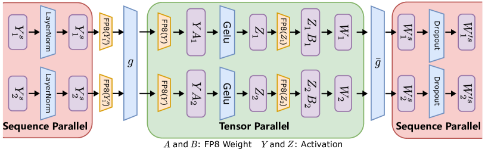

<figcaption>図2: FP8 のテンソル並列と系列並列を伴うトランスフォーマ層。FP8 の低ビット演算をオレンジで強調している。g は順伝播では all-gather、逆伝播では reduce-scatter であり、一方 ḡ は順伝播では reduce-scatter、逆伝播では all-gather である。系列並列とテンソル並列の間の gather-reduce の演算は FP8 低精度の活性を用いて実行され、それによって通信コストを半分に節約する。</figcaption>
</figure>

<figure>

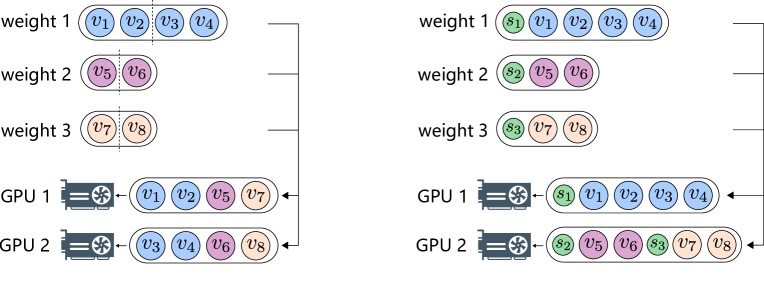

<figcaption>図3: スケーリング係数のある場合とない場合の ZeRO のテンソル分割。左: 元の高精度の ZeRO の手法。単一のテンソルを複数のパーティションへ分割し、それらを異なるデバイスへ分配する。右: 提案する FP8 ZeRO。テンソルのスケーリングを考慮しながら、各テンソルを丸ごとデバイスにまたがって分配する。</figcaption>
</figure>

加えて、Zero Redundancy Optimizer（ZeRO）[^50] は大規模モデル訓練におけるもう一つの頻繁に用いられる分散学習の技法である。ZeRO の中核の着想はモデルの状態をデバイスにまたがって分割し、各デバイスが訓練ステップに必要なデータ（例: master weight・勾配・オプティマイザ状態）の一部だけを保持するようにすることである。メモリ消費を減らすため、ZeRO の手法は一般に単一のテンソルを複数のパーティションへ分割し、それらを異なるデバイスへ分配する。**ZeRO へ FP8 を直接適用するのは実行不可能である。FP8 のパーティションに関連づけられたスケーリング係数を扱うのが難しいからである。** テンソルごとのスケーリング係数は FP8 のパーティションとともに分配されなければならない。この問題に対処するため、我々は、ZeRO のようにテンソルを複数のサブテンソルへ分割するのではなく、**各テンソルを丸ごとデバイスにまたがって分配する**新しい FP8 の分配方式を実装する。FP8 テンソルの分配は Alg. 1 に概説するとおり貪欲な方式で処理される。具体的には、我々の手法はまずモデル状態のテンソルをそのサイズに従ってソートし、次に各 GPU の残りメモリサイズに基づいてテンソルを異なる GPU へ分配する。分配は、**より大きな残りメモリを持つ GPU が新しい分配テンソルを受け取る優先度が高い**という原則に従う。

**Algorithm 1** ZeRO のための貪欲な分配アルゴリズム

```
入力:
  FP8 テンソルと対応するスケーリング係数: T = {(s₁,t₁), (s₂,t₂), …, (sₙ,tₙ)}
    ここで s はスケーリング係数、t は 8 ビットのテンソルを表す。
  各テンソルのサイズ: C = {c₁, c₂, …, cₙ}
出力:
  各 GPU へ割り当てられたスケーリングテンソルを表すパーティション

T をサイズの降順にソートして T' = {(s'₁,t'₁), (s'₂,t'₂), …, (s'ₙ,t'ₙ)} と
  C' = {c'₁, c'₂, …, c'ₙ} を得る（c'₁ ≥ c'₂ ≥ … ≥ c'ₙ）。
各 GPU Gⱼ についてメモリ使用量 uⱼ = 0 とパーティション pⱼ = ∅ で初期化する。
for i = 1 to n do
    j ← argmin_j uⱼ            ▷ メモリ使用量が最小の GPU j ∈ [1,m] を見つける。
    pⱼ ← pⱼ ∪ {(s'ᵢ, t'ᵢ)}      ▷ (s'ᵢ, t'ᵢ) を Gⱼ へ割り当てる。
    uⱼ ← uⱼ + c'ᵢ              ▷ Gⱼ のメモリ使用量を更新する。
end for
return パーティション P = {p₁, p₂, …, pₘ}
```

## Experiment（実験）

本節では、1 億 2,500 万から 1,750 億パラメータに及ぶ広範囲のモデル規模を含む GPT 型 LLM において、提案する FP8 混合精度訓練の手法の有効性を評価する。性能のアブレーションのために、FP8 で訓練した GPT モデルを、半精度 BF16 および完全精度 FP32 で訓練したものと比較する。汎用性の評価のために、FP8 低ビットの事前学習とファインチューニングの双方を含む実験を、指示チューニングと人間の選好への整合を考慮しながら行う。

### 3.1 Experimental Setup（実験設定）

#### 3.1.1 Training Dataset（訓練データセット）

我々の事前学習データは、CommonCrawl<sup>4</sup>、The Pile [^16]、C4 [^49]、OpenWebText [^46] [^17]、CC-NEWS [^30]、CC-Stories [^68]、Redpajama [^53]、Wikipedia<sup>5</sup> を含むいくつかの情報源からのオープンソースの言語コレクションを用いて構成される。データの品質を高めるために CommonCrawl のスナップショットをまたいで曖昧重複除去 [^26] を適用する。付録 A.3 の Tab. 10 は、各情報源からのトークン数や関連するサンプリング重みといった情報を含む、我々の事前学習データの詳細を提供する。データとそのクリーニングのパイプラインのより包括的な理解のために、読者には付録 A.3 を参照することを推奨する。

> 訳注（脚注 4）: https://commoncrawl.org
> 訳注（脚注 5）: https://wikipedia.org

さらに、指示チューニングについては Vicuna-v1.1 [^70] と同じ設定に従い、公開されているユーザー共有の指示追従データ [^59] を用いる。人間のフィードバックによる強化学習については、用いる訓練データは Anthropic の Helpful and Harmless データセット [^2] と Open-Assistant データセット [^25] の組み合わせである。訓練のフレームワークと関連する構成は、公開されている AlpacaFarm [^14] に沿う。

#### 3.1.2 Model Configuration（モデルの構成）

**表1**: モデルのサイズ・アーキテクチャ・訓練のハイパーパラメータ。TP・PP・SP はそれぞれテンソル・パイプライン・系列の並列性を示す。炭素排出を緩和しコストを節約するため、175B モデルの訓練は 400 億トークンのみからなるデータセットに制限した。これはシステム性能を評価するのに十分であることが証明されている。

| params | dimension | $n$ heads | $n$ layers | TP | PP | SP | learning rate | batch size | $n$ tokens |
| --- | --- | --- | --- | --- | --- | --- | --- | --- | --- |
| 125M | 768 | 12 | 12 | 1 | 1 | ✓ | $6.0e^{-4}$ | 1M | 100B |
| 7B | 4096 | 32 | 32 | 1 | 1 | ✓ | $3.0e^{-4}$ | 4M | 100B |
| 13B | 5120 | 40 | 40 | 2 | 1 | ✓ | $3.0e^{-4}$ | 4M | 100B |
| 175B | 12288 | 96 | 96 | 8 | 4 | ✓ | $3.0e^{-5}$ | 1M | 40B |

我々が用いるモデルのアーキテクチャは、PaLM [^7]、OPT [^76]、LLaMA [^67] といった最近の生成 LLM で広く用いられているデコーダのみのトランスフォーマ [^6] である。この基本アーキテクチャに加えて、モデルの効率と有効性を改善するために最近提案されたいくつかの変更を統合している。1) **Rotary Positional Embedding**: 最近の成功した実験 [^5] [^67] から着想を得て、rotary positional embeddings（RoPE）[^62] を我々の手法へ組み込む。この追加により絶対位置と相対位置の双方の情報を捉えられるようになり、とりわけより大きなコンテキストウィンドウへ外挿するときの性能を高める。2) **Flash Attention**: 標準的な attention の実装はメモリアクセスによって律速される [^21]。Flash Attention [^10] は、HBM アクセスの量を減らすために tiling を用いる IO を意識した厳密な attention のアルゴリズムを提案し、実質的な加速を達成した。

我々は、decoupled weight decay [^32] を伴う Adam [^23] の上に構築された、提案する FP8 オプティマイザを用いてモデルを訓練する。一般的な慣行に従い、減衰率は $\beta_{1}$ = 0.9、$\beta_{2}$ = 0.95、weight decay = 0.1 とする。学習率のスケジュールはコサイン型で、最終学習率は最大学習率の 10% である。モデルは 4M トークンのバッチサイズで合計 100B トークン訓練し、入力系列長は 2048 に設定する。モデルのウォームアップは 1,000 反復にわたって行う。Tab. 1 はモデルの構成と対応する訓練設定の詳細を示す。訓練は Azure NDv5 H100 GPU プラットフォーム [^35] 上で行われる。

**表2**: 下流タスクにおけるゼロショット性能。モデルは標準的な BF16 混合精度の方式 [^60] か、提案する FP8 低精度の方式のいずれかで訓練されている。

| | HS | Lambada | BoolQ | PIQA | COPA | Winogrande | Arc-C | Arc-E | ObQA | Avg |
| --- | --- | --- | --- | --- | --- | --- | --- | --- | --- | --- |
| **GPT-7B model zero-shot performance** | | | | | | | | | | |
| BF16 | 61.3 | 61.4 | 61.2 | 75.0 | 79.0 | 58.5 | 32.9 | 59.7 | 36.4 | 58.4 |
| FP8 | 60.0 | 61.8 | 62.0 | 74.2 | 78.0 | 59.8 | 32.9 | 58.7 | 34.6 | 58.0 |
| **GPT-13B model zero-shot performance** | | | | | | | | | | |
| BF16 | 64.8 | 64.9 | 63.4 | 75.9 | 82.0 | 61.0 | 35.2 | 61.5 | 40.6 | 61.0 |
| FP8 | 64.1 | 63.4 | 63.9 | 76.2 | 81.0 | 61.6 | 34.9 | 61.3 | 36.8 | 60.4 |

### 3.2 Main Results（主要な結果）

#### 3.2.1 Model Performance（モデルの性能）

まず、FP8 混合精度を用いて訓練したモデルの性能を BF16 を用いたものと比較する。Fig. 4 では、7B・13B・175B パラメータの GPT モデルについて、トークン数に対する事前学習の損失が示されている。訓練の構成とハイパーパラメータは FP8 と BF16 で訓練したモデル間で一貫している。唯一の違いは活用される混合精度の方式にある。Fig. 4 に示すとおり、**損失曲線は互いにほぼ重なっている**。この結果は、提案する FP8 混合精度の方式が、多様なモデル規模にわたって、広く用いられるより高精度の BF16 の方式 [^60] [^48] [^18] と同等の性能を達成できることを疑いなく示している。また、HellaSwag（HS）[^74]、Lambada [^44]、BoolQ [^8]、PIQA [^4]、COPA [^54]、Winogrande [^55]、Arc [^9]、OpenbookQA（ObQA）[^36] を含む広範囲の下流タスクで事前学習済みモデルを評価する。Tab. 2 に報告するとおり、FP8 で事前学習したモデルは BF16 の対応物と比べて同等のゼロショット性能を示す。この結果は、FP8 低精度で事前学習したモデルが、高精度の対応物と同等の水準で精度と本質的な文脈内学習の能力の双方を保つことをさらに裏づける。

<figure>

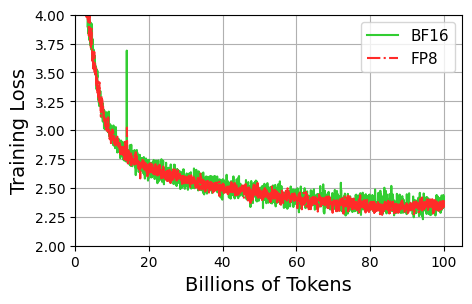

<figcaption>図4(a): GPT-7B。</figcaption>
</figure>

<figure>

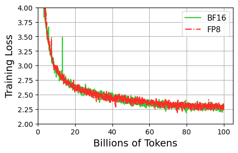

<figcaption>図4(b): GPT-13B。（訳注: この画像はクリップで欠落していたため原ページから復元した。）</figcaption>
</figure>

<figure>

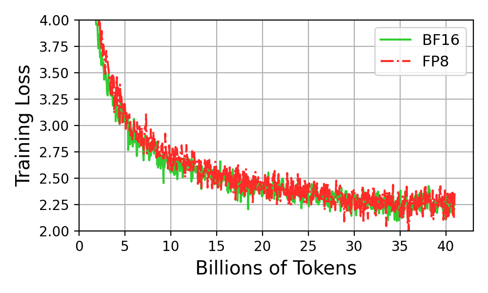

<figcaption>図4(c): GPT-175B。図4 全体のキャプション: FP8 と BF16 の比較——70 億から 1,750 億に及ぶパラメータを持つ GPT モデルの訓練損失の分析。（訳注: この画像と図全体のキャプションはクリップで欠落していたため原ページから復元した。）</figcaption>
</figure>

さらに、指示追従における LLM のファインチューニングに提案する FP8 混合精度の手法を活用する。公平な比較のために、オープンソースの LLaMA-7B [^67] をファインチューニングの基本モデルとして採用する Vicuna-v1.1 [^70] と同じ指示チューニングの設定に従う。Fig. 5 はファインチューニングの損失を示しており、BF16 と FP8 に対応する曲線は顕著な重なりを示している。同時に、Tab. 3 に報告するとおり、我々の FP8 でファインチューニングしたモデルの Davinci-003 [^42] に対する勝率も、BF16 半精度を用いてファインチューニングされた Vicuna-v1.1 と同等である。これは、我々の FP8 低ビットの訓練方式が事前学習の段階だけでなく下流のファインチューニングのタスクにも適用できるという点で汎用的であることを示している。

加えて、提案する FP8 混合精度の方式を、LLM をユーザーの選好に整合させるより複雑な過程である人間のフィードバックによる強化学習（RLHF）へさらに適用する。LLM の整合のための最近の RL フレームワークである AlpacaFarm [^14] と同じ訓練設定に従い、PPO アルゴリズム [^58] で方策モデルを最適化する。唯一の違いは混合精度の訓練方式の選択、すなわち BF16 対 FP8 にある。Fig. 6 と Tab. 4 に報告する結果から、たとえばモデル重みに関して 32% のメモリ削減、オプティマイザ状態に関して 62% の削減という、メモリ利用の顕著な減少が観測される。その結果、**FP8 は RLHF の訓練において BF16 混合精度を再現できる**と推論できる。これは我々の FP8 低ビット訓練の解のより広い適用可能性と汎用性を強調している。

<figure>

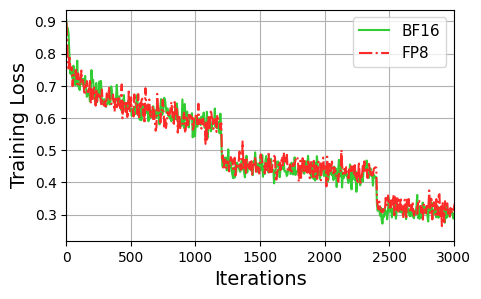

<figcaption>図5: SFT の訓練損失。</figcaption>
</figure>

**表3**: SFT についての FP8 と BF16 の比較。システム性能については GPU メモリ使用量と訓練スループットの結果を報告する。モデル性能については AlpacaEval における Davinci-003 に対する勝率と、MT-Bench における GPT-4 が判定したスコアを示す。（訳注: この表はキャプションごとクリップで欠落していたため、原ページから復元した。）

| Mixed-precision | System Performance: GPU Mem. (GB) | Throughput | Model Performance: AlpacaEval | MT-Bench |
| --- | --- | --- | --- | --- |
| BF16 | 51.1 | 103 | 66.15 | 5.75 |
| FP8 | 44.0 (-14%) | 131 (+27%) | 67.20 | 5.70 |

<figure>

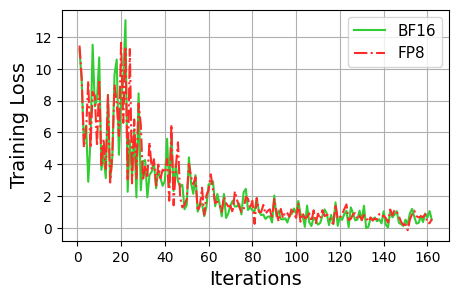

<figcaption>図6: RLHF の訓練損失。</figcaption>
</figure>

**表4**: FP8 と BF16 の RLHF による整合の比較。メモリ使用量は重みとオプティマイザ状態に焦点を当てて評価し、一方モデル性能は AlpacaEval における Davinci-003 に対する勝率と、GPT-4 を判定者とする MT-Bench で評価する。（訳注: この表はキャプションごとクリップで欠落していたため、原ページから復元した。）

| Mixed-precision | Memory Usage (MB): Weights | Optimizer States | Model Performance: AlpacaEval | MT-Bench |
| --- | --- | --- | --- | --- |
| BF16 | 15,082 | 15,116 | 72.05 | 6.16 |
| FP8 | 10,292 (-32%) | 5,669 (-62%) | 72.42 | 6.04 |

#### 3.2.2 System Performance（システム性能）

本節では、コスト削減に重点を置きつつ、通信効率・メモリ利用・全体の速度を考慮して FP8 混合精度のシステム水準の性能を評価する。我々の手法は GPU 間の all-reduce 集合通信に 8 ビットの勾配を用いる。理論上、これは主流の 32 ビットの方式と比べて**通信コストの 75% の削減**をもたらす（BF16 混合精度は 16 ビットの精度で勾配を計算するが、all-reduce 通信には依然として 32 ビットの精度を用いる [^60]）。システムの伝送損失の影響により、GPT モデルの訓練で観測される実際上の削減は Table 5 に示すとおり **63〜65%** の範囲に収まる。さらに、最近の Nvidia Transformer Engine（TE）[^40] は依然として集合通信に完全精度の FP32 に依存しており、我々の FP8 の解に対して同じ水準の削減幅になる点も特筆に値する。

同一のバッチサイズで GPT モデルを訓練するとき、FP8 混合精度は Tab. 5 に報告するとおり BF16 と比べて **28〜39% の範囲のメモリ使用量の削減**をもたらしうる。これらのメモリ消費の削減は、我々が導入した FP8 の勾配と FP8 オプティマイザの技法に帰せられる。さらに TE [^40] と比べても我々の解は非常に競争力があり、異なるモデルサイズ（GPT-7B・13B・175B）についてそれぞれ **36.1%・36.0%・42.1% の追加のメモリ削減**を得ている。TE は計算に FP8 を用いるものの、依然として高精度のオプティマイザと勾配を用いており、我々の解よりはるかに多くのメモリを消費する。加えて、我々の手法で節約されたメモリはより大きなバッチサイズやより長い系列の訓練に使える。たとえば 80GB のメモリ容量を持つ 32 台の H100 GPU を用いるとき、我々の手法は 4,096 トークンのコンテキストを持つ最大 1,750 億パラメータのモデルの訓練を可能にする。対照的に TE は 2,048 トークンのコンテキストのモデルしか収容できない。これは、既存の LLM へ我々の FP8 混合精度訓練を統合し、同じ GPU 資源でより長い系列を訓練できるようにする潜在力を示している。

さらに、我々の FP8 混合精度の方式は広く用いられる BF16 の方式と比べて優れた訓練スループットを示し、GPT-175B モデルへ適用したときに **75% という顕著な高速化**を達成する。FP8 混合精度訓練の model FLOPS utilization（MFU）は H100 GPU 上で **34.2%** であり、TE より 37.3% 優れている。これらの発見は、我々の FP8 の方式が大規模モデルの訓練において効果的にメモリを節約し通信コストを減らし、最終的に最新の H100 GPU プラットフォーム上でのシステム利用効率を高めるという実質的な証拠を提供する。

**表5**: Nvidia H100 GPU 80GB におけるシステム水準の性能。ここで TP・PP・DP はそれぞれテンソル・パイプライン・データの並列性を表す。BS はバッチサイズを示し、MFU は model FLOPs utilization を表す。重みに関わる通信は、重みに対する all-gather 演算と重みの勾配に対する reduce-scatter 演算を含む。

| Model | TP | PP | DP | Micro BS | Mixed Precision | GPU Mem. (GB) | Throughput (#samples/s) | TFLOPS | MFU (%) | Weight-related Comm. Rate (%) | Volume (GB) |
| --- | --- | --- | --- | --- | --- | --- | --- | --- | --- | --- | --- |
| GPT-7B | 1 | 1 | 32 | 2 | BF16 | 69.6 | 159.2 | 445 | 45.0 | 10.1 | 37.2 |
| | | | | 2 | FP8 (TE) | 77.3 | 224.5 | 627 | 31.7 | 9.7 | 37.2 |
| | | | | 2 | FP8 (Ours) | 49.4 (-29%) | 219.8 (+38%) | 615 | 31.1 | 7.9 | 13.9 (-63%) |
| | | | | 4 | FP8 (Ours) | 69.3 | 230.5 (+45%) | 645 | 32.6 | 10.4 | 13.9 (-63%) |
| GPT-13B | 2 | 1 | 16 | 2 | BF16 | 68.2 | 79.3 | 420 | 42.5 | 11.1 | 34.3 |
| | | | | 2 | FP8 (TE) | 76.4 | 111.7 | 592 | 29.9 | 7.1 | 34.3 |
| | | | | 2 | FP8 (Ours) | 48.9 (-28%) | 109.5 (+38%) | 575 | 29.1 | 3.9 | 12.4 (-64%) |
| | | | | 4 | FP8 (Ours) | 67.8 | 121.5 (+53%) | 644 | 32.5 | 9.3 | 12.4 (-64%) |
| GPT-175B | 8 | 4 | 4 | 1 | BF16 | 66.1 | 22.4 | 386 | 39.0 | 8.8 | 23.4 |
| | | | | 1 | FP8 (TE) | 69.6 | 28.7 | 493 | 24.9 | 3.9 | 23.4 |
| | | | | 1 | FP8 (Ours) | 40.3 (-39%) | 27.1 (+21%) | 473 | 23.9 | 2.5 | 8.2 (-65%) |
| | | | | 4 | FP8 (Ours) | 57.7 | 39.3 (+75%) | 677 | 34.2 | 10.9 | 8.2 (-65%) |

### 3.3 Ablation Study（アブレーション研究）

LLM のための FP8 混合精度訓練の戦略についてさまざまな設計上の選択をアブレーションし、Tab. 6〜8 と Fig. 7〜8 に性能を報告する。アブレーションの実験は GPT モデルで行われ、そのアーキテクチャと訓練設定は Tab. 1 に詳述されている。重要なことに、我々のアブレーション研究は LLM 訓練における 8 ビットのデータ型の効果的な活用のためのいくつかの指針をもたらし、それは低ビットのモデル訓練に関する今後の研究を促進しうる。

**通信**。まず、all-reduce 通信の過程で低ビットの勾配を集約するときの、従来の pre-scaling と post-scaling の手法の限界を分析する。Fig. 7 に示すとおり、異なるトランスフォーマブロックにまたがる重み勾配の SNR（信号対雑音比）・アンダーフロー率・オーバーフロー率について統計的な分析を行う。**pre-scaling の手法は 32 ビットから 8 ビットへ勾配を量子化するときに相対的に大きなアンダーフロー率を持つ一方、post-scaling の手法はより高いオーバーフロー率を持つ**ことが観測される。これに対し、提案する自動スケーリングの技法は、Fig. 7 (a) に示すとおり、はるかに良い SNR を得ながら**アンダーフロー率とオーバーフロー率の双方を減らす**ことができる。これは、勾配の all-reduce に 8 ビットのデータ型を活用するときの量子化誤差を減らすうえでの自動スケーリングの手法の有効性を示している。

<figure>

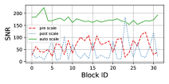

<figcaption>図7(a)。</figcaption>
</figure>

<figure>

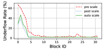

<figcaption>図7(b)。（訳注: この画像はクリップで欠落していたため原ページから復元した。）</figcaption>
</figure>

<figure>

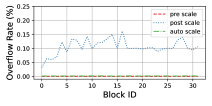

<figcaption>図7(c)。図7 全体のキャプション: FP8 の勾配 all-reduce について、pre-scaling・post-scaling・auto-scaling という異なる戦略を比較したもの。異なるトランスフォーマブロックにまたがる SNR・アンダーフロー率・オーバーフロー率を調べている。（訳注: この画像と図全体のキャプションはクリップで欠落していたため原ページから復元した。）</figcaption>
</figure>

**表6**: オプティマイザ内の変数についての精度分離。ここでは精度に敏感な構成要素である master weight とオプティマイザ状態のアブレーションに焦点を当てる。オプティマイザ状態は一次と二次の勾配モーメントの双方を含む。FP16 の master weight はテンソルスケーリングを用いる点に注意されたい。（訳注: この数値表はクリップで丸ごと欠落しており、その位置に Figure 8 の画像が入り込んでいた。原ページから復元した。）

| Low-bit Settings | Compute (GEMM) | Comm. | Master Weight | Optimizer States |
| --- | --- | --- | --- | --- |
| FP32 #0 | FP32 | FP32 | FP32 | FP32+FP32 |
| BF16 #1 | BF16 | FP32 | FP32 | FP32+FP32 |
| FP8 #2a | FP8 | FP8 | FP16 | FP8+FP16 |
| FP8 #2b | FP8 | FP8 | BF16 | FP8+FP16 |
| FP8 #3 | FP8 | FP8 | FP8 | FP8+FP16 |
| FP8 #4 | FP8 | FP8 | FP16 | FP8+FP8 |

<figure>

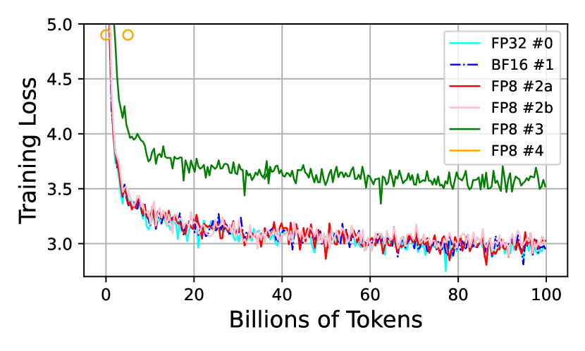

<figcaption>図8: Tab. 6 に示した設定での GPT-125M モデルの訓練損失。FP8 #4 の損失曲線は発散した。（訳注: このキャプションはクリップで欠落していたため原ページから復元した。）</figcaption>
</figure>

**オプティマイザ**。さらに AdamW オプティマイザ内の変数について、精度を落とすことの影響をアブレーションする。BF16 混合精度のオプティマイザをベースラインとする。既存の LLM 訓練フレームワークで広く用いられてきた [^33] [^60] [^40] からである。Tab. 6 は変数について精度を落とした設定を示し、Fig. 8 は対応する訓練損失をプロットする。我々が観察するところでは:

1. **FP8 の master weight は性能低下を引き起こす**（Fig. 8 の #2a 対 #3 の線を参照）一方、**FP16 はテンソルスケーリングを用いることを要求するものの FP32 と同じく精度を保てる**（#2a 対 #0 および #1 を参照）。これは master weight が精度に敏感であることを明らかにする。これは、master weight が重みの更新において果たす役割に帰せられる。重みの更新は小さな大きさを示す傾向があり、精度を保つには高い精度が必要になる。
2. **BF16 の master weight の訓練損失は、スケーリング係数を伴う FP16 のそれよりわずかに高い**。BF16 のほうが仮数ビットが少なく、その結果精度が低いからである（#2a 対 #2b を参照）。
3. **二次の勾配モーメントは一次のものより精度に敏感である**。勾配の二乗の計算がデータのアンダーフローにつながりうるからである。

**並列性**。我々の FP8 LLM 訓練フレームワークでは、GPU をまたいだ活性の通信コストを減らすために、系列並列とテンソル並列へ FP8 の低ビット変換器を導入する。ここでは GPT モデルの訓練中の活性に関わる通信量を数える分析実験を行い、その数値を Tab. 8 に報告する。我々の FP8 の並列方式は、BF16 を活用する元の手法と比べて**活性に関わる通信コストの 34% という実質的な削減**をもたらすことが観測される。さらに ZeRO 分散訓練において、我々の手法は各 FP8 テンソルを、GPU をまたいで分割するのでなく、関連するスケーリング係数とともに丸ごと分配する。この戦略はより多くの GPU メモリの節約をもたらすだけでなく、Tab. 8 に示すとおり GPU をまたいだ**メモリ負荷の均衡も保つ**。

**表7**: 系列並列とテンソル並列における活性に関わる通信量の削減。活性に対する all-gather 演算と、活性の勾配に対する reduce-scatter を含む。

| Model | TP | PP | DP | Micro BS | Mixed Precision | Act-related Comm. Rate (%) | Volume (GB) |
| --- | --- | --- | --- | --- | --- | --- | --- |
| GPT-13B | 2 | 1 | 16 | 2 | BF16 | 12.9 | 4.7 |
| | | | | | FP8 (Ours) | 5.3 | 3.1 |
| GPT-175B | 8 | 4 | 4 | 1 | BF16 | 14.9 | 5.9 |
| | | | | | FP8 (Ours) | 5.2 | 3.9 |

**表8**: GPU をまたいだメモリ負荷の観点での ZeRO の分配手法の比較。ここで「Min」と「Max」は GPU をまたいで観測された最小と最大のメモリ利用を表す。我々の FP8 ZeRO の手法は、メモリを意識した負荷分散を達成しながらより少ないメモリしか使わない。

| Model | TP | PP | DP | Micro BS | Mixed Precision | GPU Memory Min | Max |
| --- | --- | --- | --- | --- | --- | --- | --- |
| GPT-7B | 1 | 1 | 32 | 2 | BF16 | 69.07 | 69.63 |
| | | | | | FP8 (TE) | 76.97 | 77.28 |
| | | | | | FP8 (Ours) | 49.06 | 49.36 |
| GPT-13B | 2 | 1 | 16 | 2 | BF16 | 67.98 | 68.18 |
| | | | | | FP8 (TE) | 73.68 | 76.36 |
| | | | | | FP8 (Ours) | 48.45 | 48.85 |
| GPT-175B | 8 | 4 | 4 | 1 | BF16 | 65.60 | 66.12 |
| | | | | | FP8 (TE) | 69.04 | 69.57 |
| | | | | | FP8 (Ours) | 38.64 | 40.28 |

## Related Work（関連研究）

**混合精度訓練**。縮約された混合精度による効率的な訓練は、計算コストを節約するために現代の深層学習で広く用いられてきた。ビット削減を極限まで推し進めた研究もあるが（すなわち 1 ビットの二値ネットワーク [^19] [^52]）、それらはモデルの精度を保つことに成功していない [^34]。現在最も実用的な方式は FP16 半精度の手法 [^33] であり、訓練効率を改善しながら精度を保つことができる。順伝播と逆伝播の間の計算は FP16 を用い、一方 master weight は FP32 を用いる。FP16 はより狭い動的範囲を持つので、FP16 混合精度は精度の損失を防ぐために loss scaling [^33] を伴う。幸い、**loss scaling の必要性は BF16 のデータ型を用いることで回避できる**。BF16 は完全精度の FP32 と同じ動的範囲を保つからである。この結果、大規模モデルの訓練は現在 BF16 混合精度の方式を好むようになっており、それは訓練中により安定である [^61] [^57] [^75]。

FP8 は、計算コストをさらに削減するための 16 ビットのデータ形式からの自然な進展である。FP8 低ビットのモデル訓練における初期の先駆的な取り組み [^71] [^63] [^11] は、大部分がシミュレーションの段階に留まってきた。その結果、これらの手法の予測される能力と、ハードウェア上での実際の性能との間には無視できない隔たりが存在する [^34]。Nvidia Hopper GPU アーキテクチャ [^39] の登場とともに、FP8 は [^34] で論じられているとおり次世代の低精度訓練のための実行可能で実用的なデータ型として現れつつある。現時点では、Nvidia Transformer Engine（TE）[^40] が FP8 混合精度訓練の主要なフレームワークとして機能している。しかし FP8 の利用に対するその支援はいくらか制約されたままである。**TE の現在の実装は FP8 の利用を重みの計算のみに制限し、モデル重みの格納と勾配の計算は 16 ビットのデータ型で保持している。** その結果、端から端までの高速化・メモリと通信コストの節約は限られている。対照的に我々の研究は、FP8 の勾配・オプティマイザ・分散訓練をモデル訓練の全過程へ浸透させる。

**大規模言語モデル**。近年、LLM の分野は実質的な進化を目の当たりにしてきた。自己回帰的な言語モデリング——テキスト系列の未来をその過去から予測すること——は、数多くのタスクの定式化を許す単純かつ強力な目的関数を提供する。マスク言語モデリング [^12] や置換言語モデリング [^73] といった代替の方法論も存在するが、自己回帰的な手法は強力な性能ゆえに現在より有望である。スケーリング則 [^6] と洗練された法則 [^18] に従って、さまざまな LLM が提案されてきた。密なモデルには GPT-3 [^6]、Jurassic-1 [^29]、Gopher [^48]、Chinchilla [^18]、Bloom [^57]、OPT [^76]、Megatron-Turing NLG [^61]、PaLM [^7]、LaMDA [^65]、LLaMA [^67] が、疎なモデルには GLaM [^13] と Switch transformers [^15] がある。それぞれがリリース時点で広範囲のタスクにわたって際立って競争力のある few-shot 性能を示してきた。とはいえこれらのモデルは、圧倒的な計算要件や、より高品質なデータを獲得する必要性といった課題に依然として直面している。

低精度訓練はコストを削減するために LLM 訓練で広く用いられてきた。OPT [^76] と GLM [^75] は、GPU メモリ使用量を減らし訓練効率を改善するために、順伝播と逆伝播に FP16 を、オプティマイザ状態と master weight に FP32 を活用している。Bloom [^57] は、FP16 の動的範囲が限られているため、とりわけ 100B パラメータより大きなモデルを訓練するときに FP16 が数値的な不安定性と不可逆な発散を引き起こしうることを見出している。その結果、Bloom や Gopher [^48]・Chinchilla [^18] といった他の LLM は BF16 混合精度を採用している。BF16 が FP32 と同じ広い動的範囲を持つからである。8 ビット低精度による LLM の訓練とチューニングは先行研究ではよく探究されていなかった。Nvidia Hopper のインフラのリリース前には FP8 のハードウェア支援が利用できなかったからである。本研究は **LLM の FP8 事前学習とファインチューニングの初の探究**を提示し、極度に最適化された FP8 混合精度の方式を提案する。本研究が FP8 における今後の研究を促進し、潜在的にはさらに低い精度の訓練の探究にまで広がることを願う。

## Conclusion（結論）

本研究では LLM のための 8 ビット訓練を探究した。8 ビットの集合通信・オプティマイザ・分散並列訓練を段階を追って組み込む、新しい FP8 混合精度訓練フレームワークを導入した。我々の知る限り、これは **FP8 の計算・格納・通信を大規模言語モデル訓練の全過程へ浸透させた初の研究**である。広範な実験は、提案する手法がさまざまな規模の GPT モデルの訓練の文脈において、通信オーバーヘッドを効果的に減らしメモリ利用を抑えることを示している。今後の研究では、FP8 GPT モデルのサイズと訓練ステップをスケールアップし、我々の 8 ビット混合精度の方式でさらに訓練することを計画している。さらに、提案する FP8 の方式をマルチモーダルの大規模モデルの訓練にも用い、スマートフォンといった各種のエッジデバイスにおける LLM の低ビットでの展開も探究する。

## Contribution and Acknowledgement（寄与と謝辞）

本プロジェクトは当初 Han Hu と Peng Cheng によって提案され、彼らが方向性の主導者である。Shuguang Liu はプロジェクトを通じてプロダクトの主導者を務めた。

すべての共著者の寄与は次のとおりである。

- **FP8 Framework**: Kan Wu, Houwen Peng, Ze Liu, Peng Cheng, Han Hu
- **System**: Yifan Xiong, Ziyue Yang, Yuxiang Yang, Guoshuai Zhao, Peng Cheng
- **Hardware Infrastructure**: Guoshuai Zhao, Yuxiang Yang, Yifan Xiong, Peng Cheng, Shuguang Liu, Joe Chau
- **Data**: Ruihang Li, Miaosen Zhang, Jia Ning, Chen Li, Ruizhe Wang, Houwen Peng, Han Hu
- **Pre-training**: Yixuan Wei, Kan Wu, Ze Liu, Miaosen Zhang, Zheng Zhang, Houwen Peng, Han Hu
- **Alignment (SFT, RS, and RLHF)**: Bolin Ni, Jingcheng Hu, Yixuan Wei, Houwen Peng, Han Hu
- **Evaluation**: Yixuan Wei, Bolin Ni, Jingcheng Hu
- **Product Engineering**: Yuxiang Yang, Kan Wu, Yifan Xiong, Ziyue Yang, Guoshuai Zhao, Peng Cheng

## Appendix A Appendix（付録）

### A.1 FP8 Data Formats（FP8 のデータ形式）

2022 年 9 月、NVIDIA・ARM・Intel は AI のための交換形式としての標準化に向けて FP8 の仕様を公表した [^34]。産業界は 32 ビットの精度から 16 ビットへ、そして今や AI モデルの訓練のために 8 ビットの精度へと移行してきた。この展開は、高精度から低精度の訓練へ移行してきたより広い産業界の趨勢を反映している。特筆すべきは、提案された FP8 の仕様が、格納される値のより大きな範囲とより高い精度の間のトレードオフを提供する **$E$5$M$2 と $E$4$M$3** という 2 つの異なるデータ型を導入していることである [^41]。

- **$E$4$M$3** は 1 つの符号ビット・4 つの指数ビット・3 ビットの仮数からなる。**±448 までの値と NaN を格納できる。**
- **$E$5$M$2** は 1 つの符号ビット・5 つの指数ビット・2 ビットの仮数からなる。**±57344 までの値、±inf、NaN を格納できる。**

FP8 の形式 [^34] はおおよそ IEEE 754 の標準に従う。FP16 や FP32 といったより高精度のデータ形式と比べて、FP8 は 2 種類の表現の劣化を被る:

- **より低い表現範囲。** データ形式における表現範囲とは、その形式が正確に表現できる最大値と最小値の間の範囲を指定するものである。2 つのモードがある——比較的一定の精度で通常の範囲を定義する**正規（normal）** モードと、より低い精度でより小さな値を表現するために範囲を拡張する**非正規（subnormal）** モードである。正規の範囲は主に指数（$E$）ビットの数に依存し、$E$ ビットが多いほど正規の範囲が大きくなる。一方、非正規の範囲は主に仮数（$M$）ビットの数に影響され、$M$ ビットが増えるほど非正規の範囲が大きくなる。Tab. 9 に示すとおり、FP8 の表現範囲は FP16 や FP32 と比べて著しく狭く、とりわけ $S$1$E$4$M$3 の部分形式（$S$ は符号ビットを表す）でそうである。この隔たりは、大きなモデルの訓練に FP8 を用いるときの主要な課題を表す。
- **より低い表現精度。** 仮数（$M$ ビット）の数が限られていることは量子化の表現誤差につながる。FP8 では $M$ ビットが相当に少ないため、Tab. 9 に描かれるとおり FP8 の表現精度は FP16 より大幅に低い。この課題は、大きなモデルの訓練に FP8 を用いることを考えるときのもう一つの重要な障壁となる。

FP8 は 2 つの部分形式 $S1E4M3$ と $S1E5M2$ からなる。前者はより狭い表現範囲だがより高い精度を提供し、後者はより大きな範囲だがより低い精度を提供する。これら 2 つの部分形式は、モデル訓練における範囲と精度の要求の間で釣り合いを取る柔軟性をユーザーに与える。

**表9**: 異なるデータ形式についての表現範囲と誤差。

| Data format | Max normal | Min normal | Min subnormal | Max Relative Error (normal): Min 〜 Max | (subnormal): Min 〜 Max |
| --- | --- | --- | --- | --- | --- |
| FP32 (S1E8M23) | $3.40\times 10^{38}$ | $1.18\times 10^{-38}$ | $1.40\times 10^{-45}$ | $1.19\times 10^{-7}\sim 5.96\times 10^{-8}$ | $5.00\times 10^{-1}\sim 1.19\times 10^{-7}$ |
| FP16 (S1E5M10) | 65,504 | $6.10\times 10^{-5}$ | $5.96\times 10^{-8}$ | $9.76\times 10^{-4}\sim 4.89\times 10^{-4}$ | $5.00\times 10^{-1}\sim 9.78\times 10^{-4}$ |
| BF16 (S1E8M7) | $3.39\times 10^{38}$ | $1.18\times 10^{-38}$ | $9.18\times 10^{-41}$ | $7.75\times 10^{-3}\sim 3.94\times 10^{-3}$ | $5.00\times 10^{-1}\sim 7.94\times 10^{-3}$ |
| FP8 (S1E4M3) | 448 | $1.56\times 10^{-2}$ | $1.95\times 10^{-3}$ | $1.11\times 10^{-1}\sim 7.69\times 10^{-2}$ | $5.00\times 10^{-1}\sim 1.67\times 10^{-1}$ |
| FP8 (S1E5M2) | 57,344 | $6.10\times 10^{-5}$ | $1.53\times 10^{-5}$ | $2.00\times 10^{-1}\sim 1.67\times 10^{-1}$ | $5.00\times 10^{-1}\sim 5.00\times 10^{-1}$ |

### A.2 FP8 Tensor Scaling（FP8 のテンソルスケーリング）

ここでは、FP8 による大規模モデルの訓練が表現範囲と精度の劣化に伴う課題をどのように克服するのか、その根底にある機構を論じる。背後にある鍵となる技法は**テンソルスケーリング**であり、Fig. 9 に可視化されるとおり、データ形式の表現範囲の外側にもともと位置するテンソル値をその快適域へスケールするものである。先駆的なスケーリングの技法 [^33] [^37] は損失に大域的なスケーリング係数を適用し、すべての層の勾配が単一の適応的な係数によってスケールされるようにする。この大域的な loss scaling の技法の活用は、他の各種の訓練戦略と組み合わさって、V100 と A100 の GPU 上での FP16 混合精度訓練の広範な採用を促進した。特筆すべきは、この手法が精度の劣化をほとんどまたはまったくもたらさなかったことで、とりわけ小〜中規模のモデルでそうであった [^33]。とはいえ、超大規模モデルや DALL-E [^51] のようなモデルの訓練といった複雑なタスクを扱うとき、大域的な loss scaling の技法は依然として重大なアンダーフローの問題に遭遇する。その結果、**ブロック単位** [^51] および**層単位**の勾配スケーリングの手法が提案されている。

大域的なスケーリングの技法が FP16 の訓練（範囲は [5.96E-8, 6.55E+4]）でほとんど精度の低下をもたらさない一方、**細粒度のテンソルごとのスケーリングは、FP8 というさらに浅い範囲（$E$4$M$3 で [1.95E-3, 448]、$E$5$M$2 で [1.53E-5, 5.73E+4]）を用いた安定したモデル訓練を可能にする**。Fig. 9 は、FP8 の表現範囲が一般的なモデル訓練を扱うのに十分大きくなっていることを示す。テンソルごとのスケーリングの技法では、与えられた FP8 テンソルに適したスケーリング係数を選ぶのにさまざまな戦略が利用できる。2 つの一般的な手法が「just-in-time scaling」と「delayed scaling」である [^41]。

- **Just-in-time scaling（ジャストインタイム・スケーリング）**。この戦略は、生成されているテンソルの最大絶対値（amax）に基づいてスケーリング係数を決めることを伴う。しかし実際の応用では、データを複数回走査する必要があるため、この手法はしばしば実行不可能である。具体的には、演算子はまずより高い精度で出力を生成して書き出し、次に出力の最大絶対値を計算し、最後にこのスケーリング係数をすべての値へ適用して最終的な FP8 の出力を得る。この過程は相当な量のオーバーヘッドを導入し、FP8 を使う恩恵を大幅に減らしうる。
- **Delayed scaling（遅延スケーリング）**。この戦略は、一定数の先行する反復で観測された最大絶対値に基づいてスケーリング係数を選ぶことを伴う。この手法は FP8 の計算の性能上の恩恵を完全に活かせるが、FP8 の演算子の追加のパラメータとして最大値の履歴を格納する必要がある。

<figure>

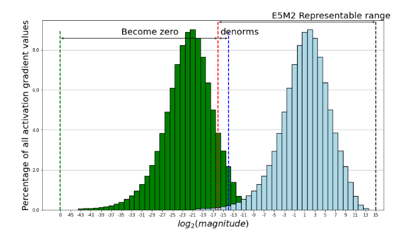

<figcaption>図9: FP8 のデータ型の表現範囲内に収まるよう勾配をスケーリングすること。（訳注: このキャプションはクリップで欠落していたため原ページから復元した。）</figcaption>
</figure>

### A.3 Pre-training Data（事前学習データ）

Tab. 10 は、事前学習で用いた対応するサンプリング重みとともに、我々が収集したデータ源の概観を示す。arXiv と StackExchange の部分集合は Redpajama [^53] から収集され、一方 BookCorpus2 [^78]・Books3 [^45]・DM-Math [^56]・Gutenberg [^47]・HackerNews<sup>6</sup>・NIH ExPorter<sup>7</sup>・OpenSubtitles [^66]・USPTO<sup>8</sup> の部分集合は The Pile [^16] から抽出された。Wikipedia のデータは HuggingFace [^20] からダウンロードされる。20220301 のダンプを用い、24 言語を含む: bg, ca, cs, da, de, en, es, fr, hi, hr, hu, it, jp, ko, nl, pl, pt, ro, ru, sl, sr, sv, uk, zh。

> 訳注（脚注 6）: https://news.ycombinator.com
> 訳注（脚注 7）: https://exporter.nih.gov
> 訳注（脚注 8）: https://bulkdata.uspto.gov

2018 年から 2023 年に及ぶ 11 個の CommonCrawl のスナップショットを CCNet のパイプライン [^72] で前処理する。この過程は行単位でのデータ重複除去と、それに続く fastText の線形分類器 [^22] を活用した言語同定による非英語ページの除去を伴う。n-gram 言語モデルに基づくフィルタリング機構を用いて低品質なコンテンツを除外する。加えて、Wikipedia のページに似た文書と、ランダムにサンプリングした CommonCrawl の文書を区別する線形分類器 [^53] を訓練する。Wikipedia に似ていると分類されなかった文書は除外される。最後に、CommonCrawl から処理したすべてのスナップショットをまたいで曖昧重複除去 [^26] を行う。

Bing のインデックス [^3] が提供するリポジトリの一覧を用いて Github から Python のコードデータを収集する。コードデータのクリーニングは 3 段階からなる。まず $\textbackslash t$ と $\textbackslash n$ を除く制御文字を除去する。次にコード中の著作権表示のコメントを除去する。続いて英数字率のフィルタを適用し、コメントであれば率が 0.5 未満の行を除去し、ファイル全体の英数字率が 0.98 未満であればファイル全体を破棄する。5 行未満のファイルや最大行長が 1,000 文字を超えるファイルも破棄する。また平均行長が 100 文字を超えるファイルも破棄する。最後に、コード中の主要な Python のキーワード（例: import, from, def, class, if, for, try など）を同定するためのパターン検索を行う。これらのキーワードが 3 個未満のファイルは除去される。この包括的な過程により、残った Python のコードデータが高品質で学術研究に適したものであることが保証される。加えて Stack [^24] から Python のコードを追加し、すべてのコードデータ内で曖昧重複除去を行う。

**表10**: 事前学習データ。各部分集合について、サンプリング重み・エポック数・訓練トークン数を列挙する。Books のデータは BookCorpus2 [^78]・Books3 [^45]・Gutenberg [^47] を含む。Dialogue のデータは HackerNews と OpenSubtitles [^66] を含む。訓練トークン数が 1,000 億未満の実験では、同じサンプリング割合を用いる。

| Dataset | Sampling prop. | Epochs | Training Tokens (Billion) |
| --- | --- | --- | --- |
| **Web Crawls** | | | |
| CommonCrawl | 51.71% | 0.16 | 51.71 |
| C4 | 25.56% | 0.16 | 25.56 |
| OpenWebText | 2.73% | 0.16 | 2.73 |
| **Technical & Science content** | | | |
| arXiv | 1.54% | 0.05 | 1.54 |
| StackExchange | 1.42% | 0.08 | 1.42 |
| DM-Math | 0.39% | 0.05 | 0.39 |
| USPTO | 0.52% | 0.05 | 0.52 |
| NIH ExPorter | 0.04% | 0.05 | 0.04 |
| **Programming Languages** | | | |
| Python | 4.50% | 0.11 | 4.50 |
| **Other Curated Sources** | | | |
| Wikipedia | 4.50% | 0.16 | 4.50 |
| Books | 4.50% | 0.09 | 4.50 |
| News | 2.00% | 0.11 | 2.00 |
| Dialogue | 2.00% | 0.27 | 2.00 |
| **Total** | 100.00% | | |
