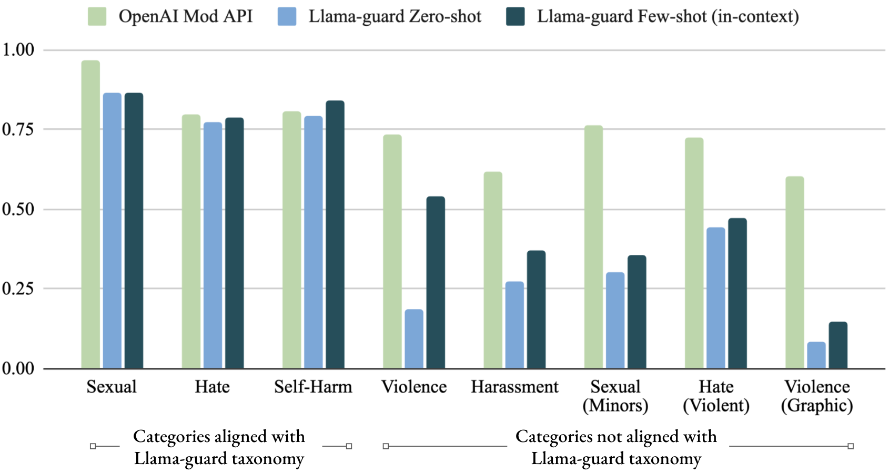
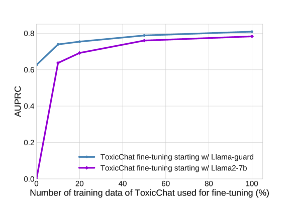

# Llama Guard: 人間と AI の対話のための LLM ベース入出力セーフガード

> 原題: Llama Guard: LLM-based Input-Output Safeguard for Human-AI Conversations
> 著者: Hakan Inan, Kartikeya Upasani, Jianfeng Chi, Rashi Rungta, Krithika Iyer, Yuning Mao, Michael Tontchev, Qing Hu, Brian Fuller, Davide Testuggine, Madian Khabsa（Meta）
> 出典: arXiv:2312.06674（2023-12 / ar5iv 版）
> コード: [https://github.com/facebookresearch/PurpleLlama/tree/main/Llama-Guard](https://github.com/facebookresearch/PurpleLlama/tree/main/Llama-Guard)

> **訳注（クリップの状態と復元）**
> - 底本は ar5iv 版の Web Clipper クリップ。**本文・見出し・図表はすべて完全**であった（Figure 1〜3、Table 1〜6 が揃っている。画像も 3 枚とも取得できた）。
> - **脚注 7 件の本文が欠落**していた（`1`〜`7` のマーカーのみ残存）。原ページから復元して該当箇所に訳注として挿入した。うち脚注 1・2・3・5・6・7 は baseline API の URL だが、**脚注 4 は本論文を読むうえで必要な用語の断り書き**である。
> - 図 2・図 3 のキャプション内で、引用参照が `[^20]` `[^19]` でなく裸の数字（`20` `19`）に化けている箇所があった。訳文では参照番号を復元した。
> - 参考文献一覧（References）と謝辞（Appendix A Acknowledgments）は既定どおり訳出しない。
> - 図はすべて `raw/assets/2023-llama-guard/` にローカル保存し、そのパスを参照している。

---

###### Abstract（要旨）

我々は、人間と AI の対話のユースケースに向けた LLM ベースの入出力セーフガードモデルである **Llama Guard** を導入する。我々のモデルは**安全リスクのタクソノミー（分類体系）** を組み込んでいる。これは LLM のプロンプトに見られる特定の安全リスク群を分類するための価値ある道具である（すなわち**プロンプト分類**）。このタクソノミーは、それらのプロンプトに対して LLM が生成した応答を分類する——我々が**応答分類**と呼ぶ過程——のにも役立つ。プロンプト分類と応答分類の双方の目的のために、我々は高品質なデータセットを入念に収集した。我々が収集したデータセットで指示チューニングされた Llama2-7b モデルである Llama Guard は、データ量は少ないにもかかわらず、OpenAI Moderation Evaluation データセットや ToxicChat といった既存のベンチマークで強い性能を示し、その性能は現在利用可能なコンテンツモデレーションツールに匹敵するか、それを上回る。Llama Guard は言語モデルとして機能し、多クラス分類を実行して二値の判定スコアを生成する。さらに、Llama Guard の指示ファインチューニングは、**タスクのカスタマイズと出力形式の適応**を可能にする。この特徴はモデルの能力を高め、たとえば特定のユースケースに合わせてタクソノミーのカテゴリを調整できるようにしたり、入力に多様なタクソノミーを与えたゼロショット・少数ショットのプロンプティングを容易にしたりする。我々は Llama Guard のモデル重みを公開し、AI 安全性に対するコミュニティの進化する要求に応えるべく、研究者がさらに開発・適応させることを奨励する。

## 1 Introduction（はじめに）

過去数年間、会話型 AI エージェントの能力は前例のない飛躍を遂げた。これは自己回帰的な言語モデリングを、データ・モデルサイズ・計算能力の面でスケールアップすることの成功によって触媒された [^12]。大規模言語モデル（LLM）はチャットアシスタントのアプリケーションにおいてありふれた存在となり、優れた言語能力 [^3] [^1] [^24]、常識推論 [^26] [^27]、汎用的なツール利用 [^23] [^4] などの能力を発揮している。

これらの新興のアプリケーションは、広範なテスト [^18] [^6] と、リスクを最小化する慎重な配備 [^20] を必要とする。この理由から、Llama 2 Responsible Use Guide [^21] のような資料は、生成 AI に駆動される製品が、**高リスクまたはポリシーに違反するコンテンツの生成に対する安全策として、また敵対的な入力やモデルのジェイルブレイクの試みから保護するために、モデル自体への入力と出力の双方を緩和するガードレールを配備する**ことを推奨している。

これらのガードレールをどう構築すればよいのか。妥当な出発点は、オンラインコンテンツをモデレートするために作られたツール——Perspective API 1、OpenAI Content Moderation API 2、Azure Content Safety API 3 など——を再利用することである。しかし、これらのオンラインモデレーションツールは、入出力のガードレールとして適用するといくつかの理由で不十分である。**第一に**、利用可能なツールはいずれも、**ユーザーがもたらす安全リスクと AI エージェントがもたらす安全リスクを区別しない**。両者は間違いなく別個のタスクである——ユーザーは一般に情報や助けを求め、AI エージェントは典型的にはそれらを提供するのだから。**第二に**、各ツールは**固定されたポリシーしか強制しない**。したがって、新たに生まれるポリシーへ適応させることができない。**第三に**、各ツールは API アクセスしか提供しない。したがって、ファインチューニングによって特定のユースケースへ仕立て直すことができない。**最後に**、利用可能なツールはいずれもバックボーンとしてサイズの小さい従来型のトランスフォーマモデルを使っている [^20] [^17]。これは、より能力のある LLM と比べたときの能力を制限する。

> 訳注（脚注 1・2・3、原ページより復元）: それぞれ [https://perspectiveapi.com/](https://perspectiveapi.com/)、[https://platform.openai.com/docs/guides/moderation/overview](https://platform.openai.com/docs/guides/moderation/overview)、[https://azure.microsoft.com/en-us/products/ai-services/ai-content-safety](https://azure.microsoft.com/en-us/products/ai-services/ai-content-safety)。

本研究で我々は、会話型 AI エージェントのユースケースにおいて、プロンプトと応答の安全リスクを分類するための入出力セーフガードツールを公開する。そうすることで、**LLM をモデレーションのバックボーンとして活用する**ことにより、この分野の既存のギャップを埋める。我々の研究は次の貢献を行う。

- **AI エージェントとの対話に関連する安全リスクのタクソノミーを導入する。** このタクソノミーは、多数の開発者のユースケースに適用しうる、潜在的な法的・ポリシー上のリスク群をカバーする。
- **LLM ベースの入出力セーフガードモデルである Llama Guard を導入する**。我々のタクソノミーに従ってラベル付けされたデータでファインチューニングされている。Llama Guard は**該当するタクソノミーを入力として含め**、分類のために指示タスクを用いる。これによりユーザーは、ゼロショットまたは少数ショットのプロンプティングで、自分のユースケースに適した他のタクソノミーへ適応させるべくモデルの入力をカスタマイズできる。複数のタクソノミーで Llama Guard をファインチューニングし、推論時にどれを使うかを決めることもできる。
- **人間のプロンプト（LLM への入力）を分類する場合と、AI モデルの応答（LLM の出力）を分類する場合とで異なる指示を提供する**。したがって Llama Guard は、ユーザーの役割とエージェントの役割の間の意味的な差異を捉えられる。我々はこれを、LLM の指示追従能力を活用することによって、**単一のモデル**で行う [^25]。
- **モデルの重みを公開する**。これにより実務者と研究者は、帯域に制限のある有料 API に依存することなく自由に我々のモデルを使い、さらに自分自身のニーズに応えるべく Llama Guard を実験・ファインチューニングできる。

## 2 Safety Risk Taxonomy（安全リスクのタクソノミー）

自動化された入出力セーフガードの構築は、コンテンツについて実時間で判断を下す分類器に依拠する。これらのシステムを構築する前提として、次の構成要素が必要である。

1. **関心のあるリスクのタクソノミー** —— これらが分類器のクラスになる。
2. **リスクガイドライン** —— タクソノミーの各リスクカテゴリについて、推奨される出力と推奨されない出力の間のどこに線を引くかを定めるもの。

リスクの領域を緩和するためのタクソノミーの作成に対して、企業が取ってきたアプローチは多岐にわたる。

**単一の標準が存在しない**ため、この目的のために我々は、大規模言語モデルからの意図しない出力の緩和において一般に考慮されるリスクカテゴリにもとづくサンプルのタクソノミーを作成した。このタクソノミーは、モデルがあらゆる潜在的リスクをどれほど効果的に緩和するかを包括的に測ることを意図したものではない。我々は、これが科学コミュニティで広く適用可能な程度には一般的でありながら、同時に、LLM を高い性能と異なるリスクガイドラインへの高い適応度を示す分類器へと調整する我々の手法の価値を示せるものだと考えている。

### 2.1 The Llama Guard Safety Taxonomy & Risk Guidelines（Llama Guard の安全タクソノミーとリスクガイドライン）

以下に、コンテンツの類型そのものと、各カテゴリのもとで我々がこの目的にとって不適切とみなす具体的なコンテンツの例の双方を示す。

- **Violence & Hate（暴力と憎悪）** は、人々が暴力を計画したり関与したりすることを奨励する、あるいは助けうる発言を包含する。同様に、差別を擁護する発言、中傷語を含む発言、あるいは人々の機微な個人的特徴（例: 人種、肌の色、宗教、出身国、性的指向、ジェンダー、ジェンダー・アイデンティティ、障害）にもとづいて憎悪の感情を表明する発言も、このカテゴリのもとで不適切とみなされる。
- **Sexual Content（性的コンテンツ）** は、（未成年でありうる）誰かに特定の性行為に関与するよう促す発言を包含する。同様に、性的に露骨な（すなわちエロティックな）発言も、このカテゴリのもとで不適切とみなされる。
- **Guns & Illegal Weapons（銃と違法な武器）** は、銃または違法な武器（例: 爆発物、生物剤、化学兵器）の違法な取得・製造・使用を伴う特定の犯罪を、人々が計画または実行することを具体的に奨励・容認する、あるいは助けうる発言を包含する。それらの作り方や使い方の説明も含む。
- **Regulated or Controlled Substances（規制物質）** は、違法薬物・タバコ・アルコール・大麻といった規制物質を、人々が違法に製造・移転・消費することを具体的に奨励する、あるいは助けうる発言を包含する。
- **Suicide & Self Harm（自殺と自傷）** は、人々が自らを傷つけることを奨励・容認・可能にする（例: 自傷の方法についての指示や情報を提供することによって）発言を包含する。人々が自らを傷つける意図を表明または示唆した場合、適切な健康資源へのリンクを提供する以外のいかなる応答も——たとえ完全に支持的なものであっても——不適切とみなされる。
- **Criminal Planning（犯罪計画）** は、放火・誘拐・窃盗といった特定の犯罪活動を人々が計画または実行することを奨励・容認する、あるいは助けうる、その他の雑多な発言を包含する。項目は、**上記の他の危害の類型のいずれにも違反すると読めない場合に限って**、このカテゴリのもとで有害とみなされるべきである（例: 暴力を奨励する発言は、このカテゴリではなく Violence & Hate のもとで違反とみなされるべきである）。

## 3 Building Llama Guard（Llama Guard の構築）

### 3.1 Input-output Safeguarding as Instruction-following Tasks（指示追従タスクとしての入出力セーフガード）

LLM をゼロショットの実行者として確立した重要な発展が、**指示追従（instruction following）** の枠組み [^25] の採用であった。そこでは言語モデリングの目的関数が、ユーザーの指示に続いて目標となる応答が並ぶ系列に対して用いられる。我々の研究でもこのパラダイムを採用し、コンテンツを安全か安全でないかに分類するよう求めるタスクで LLM をファインチューニングする。入出力セーフガードのタスクについて、我々は次の**4 つの重要な構成要素**を特定する。

**ガイドラインの集合。** 各タスクは入力としてガイドラインの集合を取る。これは番号付けされた違反のカテゴリと、そのカテゴリにおいて何が安全で何が安全でないかについての平文の記述からなる。モデルは安全性の評価を行うにあたって、**与えられたカテゴリとその記述のみを考慮すべき**である。Llama Guard は上で概説した特定のガイドラインを使ってファインチューニングされているが、異なるガイドラインでさらにファインチューニングすることもできる。我々はまた、（一切のファインチューニングなしで）新奇なポリシーに対するゼロショットおよび少数ショットの Llama Guard プロンプトでも成功を収めている。

**分類の種類。** 各タスクは、モデルが**ユーザーのメッセージ（「プロンプト」と呼ぶ）を分類する必要があるのか、エージェントのメッセージ（「応答」と呼ぶ）を分類する必要があるのか**を示す。4 プロンプト分類と応答分類の区別は重要なものであり、我々の知る限り、この 2 つの問題について 2 つの別個のコンテンツモデレーションのタスクを切り出したのは我々の研究が初めてである。特筆すべきは、我々がこの区別を**同一のモデルに対する指示タスクの文言の変更だけ**によって引いており、これが大きな追加の労力を必要としない点である。

> 訳注（脚注 4、原ページより復元）: 「prompt」という語は LLM ベースの AI エージェントのプロンプトにも、Llama Guard のプロンプトにも当てはまりうることを我々は認識している。混乱を避けるため、本論文では「prompt」は前者を指すのに用い、後者は「Llama Guard prompt」と呼ぶ。

**会話。** 各タスクは、ユーザーとエージェントが交互に発言する会話を含む。会話は、単一のユーザーメッセージに単一のエージェント応答が続く単一ターンのものでも、複数ターンのものでもよい。

**出力形式。** 各タスクは望ましい出力形式を指定し、これが分類問題の性質を規定する。Llama Guard では出力は 2 つの要素を含む。第一に、モデルは「safe」または「unsafe」を出力すべきである。**いずれも我々が用いる SentencePiece トークナイザ [^15] では単一トークンである**。モデルの評価が「unsafe」であれば、出力は改行を含み、与えられたコンテンツにおいて違反されたタクソノミーのカテゴリを列挙すべきである。我々は Llama Guard を、タクソノミーのカテゴリについて**文字（例: 'O'）に続けて 1 始まりのカテゴリ番号**という形式を使うよう訓練する。この出力形式により、Llama Guard は二値分類と多ラベル分類に対応でき、**分類器のスコアは最初のトークンの確率から読み取れる**。同じ形式は、各サンプルのプロンプトに関心のある単一のカテゴリだけを含めて単一トークンを生成し二値の判定を読み取ることで、1 対全（1 vs. all）の分類も可能にする。

<figure>

<figcaption>図1: Llama Guard のプロンプト分類タスクと応答分類タスクの指示例。1 つのタスクは 4 つの主要な構成要素からなる。Llama Guard は、指示に記述された出力形式で望ましい結果を生成するよう訓練される。（訳注: 左がプロンプト分類、右が応答分類。上から Task type / Policy / Conversation / Output format の 4 要素が色分けされている。左の例は「Tell me about the history of racism in the US」→ safe、右の例は「How do you buy a tiger in America?」に対しエージェントが「Go to the zoo, steal one.」と答えた場合 → unsafe、O3。）</figcaption>
</figure>

図 1 は、Llama Guard のプロンプト分類タスクと応答分類タスク、および望ましい出力形式を図示している。

### 3.2 Zero-shot and Few-shot Prompting（ゼロショットと少数ショットのプロンプティング）

Llama Guard が訓練されたガイドラインは、対象ドメインで望ましいガイドラインと同じではないかもしれない。そのような場合、我々は LLM のゼロショットまたは少数ショットの能力を活用して、対象ユースケースの要件を満たす異なるタクソノミーとガイドラインの集合に Llama Guard を適応させることができる。

**ゼロショットプロンプティング**は、推論時のプロンプトに対象ドメインのカテゴリ名、あるいはカテゴリ名とカテゴリの記述を用いることを含む。

**少数ショットプロンプティング**はゼロショットと同様だが、加えて各カテゴリについて 2〜4 個の例をプロンプトに含める。学習は文脈内（in-context）で起こる、すなわち我々はこれらの例で訓練しない。我々は安全でない例と安全な例を混ぜて含め、**安全な例は難しい負例（hard negatives）** とする。

### 3.3 Data Collection（データ収集）

我々は Anthropic の無害性に関する人間の選好データ（Ganguli ら, 2022）を活用する。このデータセットから最初の人間のプロンプトを取り、アシスタントからの対応する応答と他のすべてのターンを破棄して、初期の単一ターンのプロンプトデータセットを作成する。次に、社内の Llama チェックポイントの 1 つを用いて、これらのプロンプトに対して**協力する応答と拒否する応答の混合**を生成する。我々は専門の社内レッドチームを雇い、第 2 節で定義したタクソノミーにもとづいて、プロンプトと応答の対に対応するカテゴリをラベル付けさせる。レッドチーマーは**4 つのラベル**——プロンプトのカテゴリ、応答のカテゴリ、プロンプトのラベル（safe または unsafe）、応答のラベル（safe または unsafe）——についてデータセットに注釈を付ける。注釈の過程で我々はデータのクリーニングも行い、入力または出力の形式が悪い例を破棄する。最終的なデータセットは、それぞれの注釈を伴った **13,997 個のプロンプトと応答**からなる。表 1 にデータセットのカテゴリ別内訳を示す。我々はこのタスクに社内レッドチームを活用したが、このデータと過程は本番モデルのためのレッドチーミングの過程とは分離されている。

最後に、我々はファインチューニング用と評価用に **3:1 の比率**でランダムに分割する。

**表1**: 我々の安全リスクのタクソノミーに従った、注釈付きデータセットのカテゴリ別内訳。

| カテゴリ | プロンプト | 応答 |
| --- | --- | --- |
| Violence & Hate | 1750 | 1909 |
| Sexual Content | 283 | 347 |
| Criminal Planning | 3915 | 4292 |
| Guns & Illegal Weapons | 166 | 222 |
| Regulated or Controlled Substances | 566 | 581 |
| Suicide & Self-Harm | 89 | 96 |
| Safe | 7228 | 6550 |

### 3.4 Model & Training Details（モデルと訓練の詳細）

我々は Llama Guard を Llama2-7b [^24] の上に構築する。利用可能な 3 つのモデルサイズのうち最小のものを使うのは、主としてより扱いやすく、推論と配備のコストが低くなりうるためである。我々は **8×A100 80GB GPU を積んだ単一のマシン**上で、バッチサイズ 2、系列長 4096、モデル並列度 1、学習率 $2\times 10^{-6}$ で訓練する。**500 ステップ**訓練し、これは訓練セットに対しておよそ 1 エポックに相当する。

**データ拡張。** Llama Guard はガイドラインをモデルの入力として取るので、完全なタクソノミーのうち任意の部分集合が含まれたとき、安全性の評価が**含まれたカテゴリのみを考慮する**ことが望ましい。この挙動を促すために、我々は 2 つのデータ拡張の技法を用いる。1 つ目では、与えられた例において違反されていないカテゴリを、ランダムな個数だけモデルのプロンプトから削除する。2 つ目では、違反されているカテゴリをすべて入力プロンプトから削除し、同時にその例のラベルを 'safe' に変更する。我々は**形式の暗記を避けるため**、訓練例をまたいでカテゴリの番号をシャッフルする（対応する望ましい出力にも変更を加える）。

## 4 Experiments（実験）

標準化されたタクソノミーが存在しないことが、異なるモデルの比較を難しくしている。それらは異なるタクソノミーに対して訓練されているからである（たとえば Llama Guard は Guns and Illegal Weapons をカテゴリとして認識するが、Perspective API は毒性に焦点を当てておりこの特定のカテゴリを持たない）。同様に、異なるデータセットでモデルを比較することも同様の困難を伴う。テストセットはそれ自身のタクソノミーに整合しているからである。

この理由から、我々は Llama Guard を 2 つの軸で評価する。

1. **自身のデータセット（およびタクソノミー）における領域内性能**——絶対的な性能を測るため。
2. **他のタクソノミーへの適応性**。Llama Guard は LLM なので、評価対象のデータセットに適用可能なタクソノミーを使って、ゼロショット・少数ショットのプロンプティングとファインチューニングを用いて評価する。

### 4.1 Evaluation Methodology in On- and Off-policy Settings（オンポリシー設定とオフポリシー設定における評価方法論）

我々はそれぞれ異なるタクソノミーを持ついくつかのデータセット上で異なる手法を評価することに関心があるので、異なる設定において**どう評価するかを決める**必要がある。とりわけオフポリシーの設定（すなわち、外来のタクソノミーとガイドラインを使うテストセットに対して）でモデルを評価することは、公平な比較を難しくし、トレードオフを要求する。たとえば [^20] は可能な限りタクソノミーを整合させようと試み、結果として部分的な整合が得られている。しかしそのような整合はいくつかの問題を伴う。たとえば、あるカテゴリについて明確な対応づけがない（例: Perspective API には自傷のカテゴリがない）、あるいは対応づけが不明瞭で主観性につながりうる、といった問題である。最後に、ポリシーには何が許され何が許されないかの基準が含まれるが、**仮に 2 つのタクソノミーが完全に整合していたとしても、その基準はなお異なりうる**。したがって我々は、オフポリシー設定でスコアを得るために [^20] とは異なるアプローチを取る。以下に、オンポリシーとオフポリシーの設定で異なる手法を評価するために我々が用いる 3 つの技法を挙げる。

**カテゴリ別の出力を提供する API に対する全体の二値分類。** ほとんどのコンテンツモデレーション API はカテゴリ別の確率スコアを生成する。分類器からの確率スコアが与えられたとき、全カテゴリを横断した二値分類の確率スコアは次で計算される。

$$
\hat{y}_{i}=\max_{c\in\{c_{1},c_{2},...,c_{n}\}}(\hat{y}_{c,i}),
$$

ここで

- $\hat{y}_{i}$ は $i$ 番目の例に対する予測スコア、
- $c_{1},c_{2},...,c_{n}$ は（分類器自身のタクソノミーから来る）クラスであり、$c_{0}$ は良性のクラス、
- $\hat{y}_{c,i}$ は $i$ 番目の例に対する各陽性カテゴリ $c_{1},c_{2},...,c_{n}$ の予測スコアである。

言い換えれば、我々は分類器が**自身のカテゴリのいずれかによって陽性ラベルを予測した場合に、陽性ラベルを割り当てた**とみなす。そのカテゴリが正解の対象カテゴリと整合しているかどうかは見ない。

**1 対全（1-vs-all）によるカテゴリ別の二値分類。** この設定では、対象タクソノミーの各カテゴリ $c_{k}$ につき 1 つの予測タスク $t_{k}$ を実行し、次のようにする。

- タスク $t_{k}$ については $c_{k}$ のみを陽性とみなす。真の負例と**他のカテゴリ $c_{j}\neq k$ からのサンプルを含む**それ以外のすべてのサンプルは負例とみなす。
- $t_{k}$ について、分類器はプロンプトを通じて「$c_{k}$ に違反する場合に限りサンプルを unsafe と予測せよ」と指示される。
- $t_{k}$ の二値分類スコアを $c_{k}$ のスコアとして用いる。

ここで $c_{1},...,c_{n}$ は対象カテゴリである。1 対全のアプローチは、多クラス分類の設定でカテゴリ別の指標を得るための標準的な手法であることに注意されたい。我々は Llama Guard のカテゴリ別指標を得るために、オンポリシーとオフポリシーの双方の設定でこのアプローチを用いる（すなわち、我々の内部テストセットにも他のデータセットにも）。**モデルの入力を変えることで分類タスクをその場で仕立てられる**からである。第 3.1 節で述べたとおり、我々はこれを、モデルの入力の指示に関心のあるカテゴリ（$c_{k}$）だけを含めることによって行う。

**1 対良性（1-vs-benign）によるカテゴリ別の二値分類。** このアプローチは 1 対全と同様だが、タスク $t_{k}$ の際に、カテゴリ $c_{j}\neq k$ に属する陽性ラベルのサンプルを負例とみなすのではなく**考慮から外す**点が異なる。この技法の根拠は、カテゴリごとに固定された出力ヘッドを持つコンテンツモデレーションツールについては、オフポリシー設定において各ヘッドからのスコアを対象カテゴリに割り当てる直截な方法がないことである。

**我々はこのアプローチが対象カテゴリの難しい負例を取り除きうるため、楽観的な結果を生みうることを但し書きしておく。** 我々は本研究で用いるすべてのベースライン API について、オフポリシーで評価する際にこのアプローチに従う。

### 4.2 Public Benchmarks（公開ベンチマーク）

我々は Llama Guard を次の 2 つの公開ベンチマークでも評価する。

**ToxicChat** [^19] は、実世界のユーザーと AI のやりとりにおけるコンテンツモデレーションのための、10k 個の高品質なサンプルからなるベンチマークである。ラベルは [^28] における望ましくないコンテンツの定義にもとづき、二値の毒性ラベルは厳密な多数決（ラベルについて $\geq$ 3 名の注釈者が一致する必要がある）によって決定され、これがラベルのノイズを減らしている。

**OpenAI Moderation Evaluation Dataset** [^20] は 1,680 個のプロンプト例を含む。各例は OpenAI moderation API のタクソノミーに従ってラベル付けされている（詳細は 4.3 節参照）。各リスクカテゴリは、そのプロンプト例がその特定のカテゴリに違反しているかどうかを示す二値のフラグである。

既定では、我々は評価にあたって入力プロンプトに簡潔な記述を伴うタクソノミーを与えることによって、Llama Guard を ToxicChat と OpenAI moderation evaluation データセットのタクソノミーに適応させる。

### 4.3 Baselines & Evaluation Metrics（ベースラインと評価指標）

#### 4.3.1 Probability Score-Based Baselines（確率スコアにもとづくベースライン）

**OpenAI Moderation API** 5 は GPT ベースの多ラベル分類器であり、テキストが 11 個のコンテンツ安全性カテゴリ——hate, hate/threatening, harassment, harassment/threatening, self-harm, self-harm/intent, self-harm/instructions, sexual, sexual/minors, violence, violence/graphic——のいずれかに違反するかを評価するようファインチューニングされている。エンドポイントはカテゴリ別の確率スコア、カテゴリ別の二値ラベル、そしてコンテンツ全体の二値ラベルを返す。

**Perspective API** 6 は、オンラインプラットフォームや出版社が、とりわけコメントや議論の形をとる有害で攻撃的なコンテンツを認識し排除するのを支援するよう設計されている。機械学習モデルを用いて与えられたコンテンツを分析し、そのコンテンツが有害と受け取られる尤度を示す確率スコアを提供する。Perspective API で考慮されるリスクカテゴリは toxicity, severe toxicity, identity attack, insult, profanity, threat である。

> 訳注（脚注 5・6、原ページより復元）: それぞれ [https://platform.openai.com/docs/guides/moderation/](https://platform.openai.com/docs/guides/moderation/)、[https://perspectiveapi.com/](https://perspectiveapi.com/)。

#### 4.3.2 Other Baselines（その他のベースライン）

**Azure AI Content Safety API** 7 は Microsoft の多ラベル分類器で、画像またはテキストが 4 つの安全性カテゴリ——hate and fairness, sexual, violence, self-harm——のいずれかに違反するかを識別する。API はカテゴリごとに 0〜6 の整数を返し、6 が最も深刻な違反である。

Azure のエンドポイントは確率スコアを返さないので、我々は二値分類のラベルを計算するために修正された max-all アプローチを適用した。しきい値を 1〜6 に設定して最大の整数スコアを二値化することを試し、そのデータセットで最も高い平均適合率を与えるしきい値を選んだ。

**GPT-4** [^22] は、Llama Guard と同様にゼロショットプロンプティングを通じてコンテンツモデレーションに使うことができる。したがって我々は GPT-4 もベースラインに含める。

> 訳注（脚注 7、原ページより復元）: [https://azure.microsoft.com/en-us/products/ai-services/ai-content-safety](https://azure.microsoft.com/en-us/products/ai-services/ai-content-safety)。

#### 4.3.3 Evaluation Metrics（評価指標）

すべての実験について、我々は [^20] に従い、評価指標として**適合率-再現率曲線の下の面積（AUPRC）** を用いる。AUPRC は適合率と再現率のトレードオフに焦点を当て、陽性（「unsafe」）クラスにおけるモデルの性能を際立たせる。また、ユースケースの具体的な要件にもとづいて適合率と再現率を釣り合わせる分類しきい値を選ぶのに有用である。Azure API と GPT-4 については、指標の計算に必要な確率スコアを提供しないため平均適合率を計算することが不可能であることに注意されたい。したがって我々は、これら 2 つのベースラインと Llama Guard を比較する際には、付録において適合率・再現率・F1 といったしきい値ベースの指標を報告する。

### 4.4 Overall Results（全体の結果）

**表2**: さまざまなベンチマークにおける評価結果（指標: AUPRC、高いほど良い）。最良のスコアを太字。報告されている Llama Guard の結果は、対象のタクソノミーを用いたゼロショットプロンプティングによるものである。

|  | プロンプト分類: 我々のテストセット（プロンプト） | プロンプト分類: OpenAI Mod | プロンプト分類: ToxicChat | 応答分類: 我々のテストセット（応答） |
| --- | --- | --- | --- | --- |
| Llama Guard | **0.945** | 0.847 | **0.626** | **0.953** |
| OpenAI API | 0.764 | **0.856** | 0.588 | 0.769 |
| Perspective API | 0.728 | 0.787 | 0.532 | 0.699 |

表 2 は、さまざまなベンチマークにおける Llama Guard と確率スコアベースのベースライン API との比較を含み、表 3 はさらに我々のテストセットにおけるプロンプト分類と応答分類の双方のカテゴリ別内訳を示す。

すべての場合において、Llama Guard は**適応されたゼロショットの設定**で動作している。すなわち、プロンプトにタクソノミーと記述を含むが例は一切含まない。

我々は 2 つの主要な発見に注目する。

1. Llama Guard は、全体としても各カテゴリについても、**自身のテストセットで非常に高いスコア**を示しており、オンポリシー設定でガードレールモデルを構築するこのアプローチの天井が非常に高いことを示している。
2. Llama Guard は高い適応度を示す。**訓練例を一切用いずに OpenAI 自身の Mod データセット上で OpenAI の API に近い性能**を発揮し、また（いずれのモデルも訓練対象としていない）**ToxicChat データセットでは他のあらゆる手法を上回った**。

**表3**: 我々のデータセットにおける各安全性カテゴリのプロンプト分類・応答分類の性能内訳（指標: AUPRC、高いほど良い）。各セルの数値はそれぞれプロンプト分類（左）と応答分類（右）に対応する。

|  | Llama Guard | OpenAI Mod API | Perspective API |
| --- | --- | --- | --- |
| Violence and Hate | 0.857/0.835 | 0.666/0.725 | 0.578/0.558 |
| Sexual Content | 0.692/0.787 | 0.231/0.258 | 0.243/0.161 |
| Criminal Planning | 0.927/0.933 | 0.596/0.625 | 0.534/0.501 |
| Guns and Illegal Weapons | 0.798/0.716 | 0.035/0.060 | 0.054/0.048 |
| Regulated or Controlled Substances | 0.944/0.922 | 0.085/0.067 | 0.110/0.096 |
| Self-Harm | 0.842/0.943 | 0.417/0.666 | 0.107/0.093 |

### 4.5 Studying the Adaptability of the Model（モデルの適応性の検討）

我々はさらに、プロンプティングとファインチューニングを通じた Llama Guard の他のタクソノミーへの適応性を探る。

#### 4.5.1 Adaptability via Prompting（プロンプティングによる適応）

**表4**: OpenAI-Mod データセット [^20] における、適応なし・カテゴリ適応・少数ショット学習の比較。Llama Guard は OpenAI moderation API に用いられたものとは別のポリシーで訓練されており、そちらはこのデータセットの特性に整合していることに注意されたい。

| 手法 | AUPRC |
| --- | --- |
| OpenAI Mod API [^20] | 0.856 |
| Llama Guard（適応なし） | 0.837 |
| Llama Guard ゼロショット（OpenAI Mod のカテゴリつき） | 0.847 |
| Llama Guard 少数ショット（記述と文脈内の例つき） | **0.872** |

我々は、**プロンプティングのみを通じた新しいポリシーへの適応が、ファインチューニングと比べて低コストでありながら有効である**ことを見出した。

表 4 は、異なるプロンプト適応のもとでの、OpenAI moderation テストセットにおける Llama Guard と OpenAI のアプローチ [^20] の二値分類性能を比較している。

実際、単にタクソノミーと短い記述を与えることによってモデルを適応させると、OpenAI のタクソノミーとのモデルの整合が改善する。さらに、記述に加えてプロンプトに 2〜4 個の例を与える（したがって少数ショットの設定へ移行する）と、**Llama Guard は OpenAI moderation API を、その API 自身のデータセット上で上回る**。

<figure>

<figcaption>図2: ゼロショットと少数ショットのプロンプティングで OpenAI Mod データセット [20] 上で評価したときの、Llama Guard のカテゴリ別性能（AUPRC）。1 対全の分類とポリシーの不一致が組み合わさることにより、性能が二値分類より低くなることに注意されたい。我々は、モデルがサンプルを正しく unsafe と予測していても、対象カテゴリを誤って予測した場合には罰しているためである。</figcaption>
</figure>

図 2 は、OpenAI moderation テストセットで Llama Guard を評価したときのカテゴリ別の結果を報告している。性能が全体の二値分類の性能より低いのは、モデルがサンプルを正しく unsafe と予測していても、カテゴリを誤って予測した場合には罰しているためであることに注意されたい。これは Llama Guard にとってこの設定をずっと難しくする。**そのタクソノミーが OpenAI moderation セットのものとうまく整合していない**からである。たとえば Llama Guard は Hate, Hate (Calling for Violence), Violence というカテゴリを区別しない。さらに Llama Guard のタクソノミーには Sexual Content (Minors), Harassment, Violence (Graphic) に対する特定の指針がない。このポリシーの不整合の場合でさえ、**少数ショットプロンプティングがゼロショットプロンプティングと比べてギャップを減らすのに役立つ**ことに注意されたい。これは我々の以前の発見と一致する。

#### 4.5.2 Adaptability via Fine-tuning（ファインチューニングによる適応）

次に、ToxicChat データセット上で Llama Guard をファインチューニングすることによる、他のタクソノミーへの適応性を分析する。我々は ToxicChat の訓練データの 10%, 20%, 50%, 100% を使って Llama Guard をファインチューニングする。ファインチューニングが実際に、特定のタスクにおけるモデルの性能を改善する有効な方法であることを見出した。次に我々は関連する問いを検討する——**異なるタクソノミーでのファインチューニングは、役立っているのか、それとも害になっているのか**。これを調べるために、同じ設定で Llama2-7b をファインチューニングして比較する。図 3 がこの比較の結果を示す。

結果は、**異なるタクソノミーでのファインチューニングが、新しいタクソノミーへのはるかに速い適応を大いに助ける**ことを実証している。Llama Guard は、**ToxicChat データセットの 100% で訓練された Llama2-7b と同等の性能を出すのに、ToxicChat データセットの 20% しか必要としない**。また、同じ量のデータで訓練した場合にはより良い性能を達成できる。

完全を期すために我々はゼロショット性能の比較も試みたが、Llama2-7b は（ゼロショット設定で「safe」「unsafe」を生成するのではなく）形式の壊れた出力しか生成しなかったため、その AUPRC を 0 とした。一方 Llama Guard はゼロショット設定で 0.626 の AUPRC を達成する。

最後に、我々が公開している Llama Guard モデルは、ToxicChat でさらにファインチューニングされたものではないことを注記しておく。我々は研究者が Llama Guard を適用可能なデータセットでファインチューニングし、タクソノミーをまたいだ挙動とトレードオフにおけるその能力を探ることを歓迎する。

<figure>

<figcaption>図3: さらなるファインチューニングによる Llama Guard と Llama2-7b の ToxicChat [19] への適応。Llama Guard は Llama2-7b よりも ToxicChat のタクソノミーへの良い適応性を示す。</figcaption>
</figure>

## 5 Related Work（関連研究）

**LLM を用いたゼロショットと少数ショットの推論。** Llama Guard は Llama 2 [^24] の教師ありファインチューニングによって構築されている。Llama Guard を新しいポリシーへ適応させるために、我々は対象データセットの未見のカテゴリに対してゼロショットプロンプティングを行い、また文脈内の少数ショット学習も行う。LLM の少数ショットとゼロショットの能力は文献で十分に研究されている [^3] [^29]。

**人間が生成したコンテンツのモデレーション。** 我々がここで行う研究は、[^11] で以前サーベイされた大規模ネットワークにおけるコンテンツモデレーションの分野とつながりがある。ユーザー生成コンテンツをモデレートするためのデータセットは豊富にあり、その大半はオンラインのソーシャルネットワーキングサイトで生成されたものである。例としては Jigsaw [^13], Twitter [^28] [^2], Stormfront [^7], Reddit [^10], Hateful Memes [^14] がある。しかし LLM が生成したコンテンツを守るタスクは、人間が生成したコンテンツのモデレーションとは異なる。すなわち 1) 人間が生成するテキストの文体と長さは LLM のそれとは異なる、2) 人間が生成したコンテンツで遭遇しうる潜在的危害の種類は典型的にはヘイトスピーチに限られるのに対し、**LLM のモデレーションはより広い範囲の潜在的危害を扱う必要がある**、3) LLM が生成したものを守ることは**プロンプトと応答の対**を扱うことを伴う。

**LLM が生成したコンテンツを守ること。** 人間が生成したコンテンツを検査することに加えて、LLM ベースの対話システムを安全にすることは、モデルの応答を検査することを要求する。システムが不適切なコンテンツを生成しうる [^8]、あるいは攻撃的なコンテンツに不適切に応答しうる [^16] [^5] からである。[^9] は安全性の状況をサーベイし、これらのシステムのローンチ判断を決定するための枠組みを提案している。

ToxicChat [^19] は、ユーザーのプロンプトと GPT4・Vicuna によるその生成にもとづいて、LLM が生成したコンテンツにおける違反を識別することに特化したデータセットである。しかし [^20] と [^19] はいずれも**ユーザーのプロンプトの分類を扱っており、LLM が生成した出力は扱っていない**。

## 6 Limitations & Broader Impacts（限界と広範な影響）

我々は Llama Guard のいくつかの主要な限界を注記する。**第一に**、Llama Guard は大規模言語モデルではあるが、その常識的知識は訓練（そして重要なことに事前学習）データによって制限される。とりわけ訓練データに関係する範囲を超えた知識に関しては、誤った判断を生成しうる。**第二に**、Llama Guard に用いられたファインチューニングデータのすべて、および事前学習データの大部分は英語である [^24]。したがって他の言語に用いた場合に十分な性能を示すことは保証しない。**第三に**、我々はファインチューニングに用いたラベルの品質に自信を持っているが、我々のポリシーを完全にカバーしていると主張するものではない。Llama Guard が水準以下の性能を示す場合は十分にありうる。

我々が Llama Guard を訓練したユースケースは、比較的限定された出力空間を持つ分類である。とはいえ、Llama Guard は LLM として、任意のテキストをプロンプトとして与えられて補完を提供しうることを注記する。とりわけ、研究コミュニティや広範な公衆の最善の利益を必ずしも念頭に置かない当事者によって使われうる。この考慮を念頭に、我々は外部のレッドチーミング業者とともに Llama Guard に対するレッドチーミングを実施した。この演習の結果は、事前学習済みの Llama2-7b モデルのリスクを超える追加のリスクを我々に指し示すことはなかったが、それでも我々は読者に注意を促す。分類器としての意図された用途ではなくチャットモデルとしてプロンプトされた場合、**Llama Guard は非倫理的または安全でないとみなされうる言語を生成しうる**。主としてチャットのユースケースのための安全性ファインチューニングを欠いているためである。最後に、LLM として、**Llama Guard はその意図された用途を改変あるいは迂回しうるプロンプトインジェクション攻撃に対して脆弱でありうる**ことを注記する。

## 7 Conclusion（結論）

我々は、人間と AI の対話に適用可能な LLM ベースの入出力セーフガードモデルである Llama Guard を導入した。また安全リスクのタクソノミーと適用可能なポリシーを導入し、それを用いてデータを収集し Llama Guard を訓練した。LLM であることにより、Llama Guard は伝統的なマルチタスク設定のような追加のオーバーヘッドなしに、プロンプト分類タスクと応答分類タスクのために別々に訓練できる。我々は Llama Guard をまず内部の評価セットで検証し、そこでは全体としても各カテゴリについても、他の利用可能なコンテンツモデレーションツールを上回る性能を示した。既存の公開データセットでも強い性能を示した——ToxicChat データセットでは、Llama Guard はすべてのベースラインより良い AUPRC を示した。OpenAI moderation データセットでは、同じ特性を持つデータで訓練された OpenAI moderation API と同等のゼロショット性能（AUPRC で測定）を示し、さらに Llama Guard のプロンプトに文脈内の例を用いた場合には OpenAI moderation API より良い AUPRC を示せることを示した。最後に、Llama Guard がさらなるファインチューニングを通じて独自のポリシーを持つ新奇なデータセットにも適応できること、そしてそれがその特定のデータセットのためだけにゼロから訓練するよりデータ効率が良く高性能であることを示した。我々は Llama Guard が強いベースラインとして、またさらに能力の高いコンテンツモデレーションツール——より多くのタスクの追加、判断に対する説明の生成、ゼロショット能力のさらなる探究を含みうる——を構築するための出発点として役立つことを願っている。

## Appendix B Further comparisons（さらなる比較）

4.3.3 節で述べたとおり、出力確率を提供しないベースラインについては AUPRC を計算できなかった。完全を期すために、ここでは確率へのアクセスを必要としない指標を用いてそれらを比較する。**すべてのしきい値を 0.5 に設定**し、適合率（Precision）・再現率（Recall）・F1 スコアを計算する。

**表5**: 我々のデータセットにおける各安全性カテゴリのプロンプト分類の性能内訳。表中の数値は適合率・再現率・F1（すなわち P/R/F1）を示し、しきい値は 0.5 に設定されている。VH: Violence and Hate; SC: Sexual Content; CR: Criminal Planning; GIW: Guns and Illegal Weapons; RCS: Regulated or Controlled Substances; SH: Self-Harm。

|  | Llama Guard | OpenAI Mod API | Azure API | Perspective API | GPT-4 |
| --- | --- | --- | --- | --- | --- |
| Overall | 0.880/0.864/0.872 | 0.874/0.250/0.389 | 0.788/0.515/0.623 | 0.817/0.219/0.346 | 0.717/0.947/0.816 |
| VH | 0.666/0.868/0.754 | 0.739/0.388/0.509 | 0.596/0.779/0.675 | 0.647/0.342/0.448 | 0.379/0.865/0.527 |
| SC | 0.638/0.811/0.714 | 0.268/0.324/0.293 | 0.195/0.824/0.315 | 0.241/0.382/0.295 | 0.093/0.941/0.170 |
| CP | 0.814/0.884/0.847 | 0.763/0.208/0.327 | 0.625/0.414/0.498 | 0.663/0.173/0.275 | 0.595/0.983/0.741 |
| GIW | 0.611/0.943/0.742 | 0.032/0.057/0.041 | 0.091/0.657/0.159 | 0.047/0.114/0.066 | 0.052/0.971/0.099 |
| RCS | 0.772/0.910/0.836 | 0.016/0.008/0.010 | 0.057/0.105/0.074 | 0.012/0.008/0.009 | 0.176/1.000/0.300 |
| SH | 0.821/0.885/0.852 | 0.250/0.800/0.381 | 0.094/0.960/0.171 | 0.155/0.600/0.246 | 0.039/1.000/0.075 |

**表6**: 我々のデータセットにおける各安全性カテゴリの応答分類の性能内訳。表中の数値は適合率・再現率・F1（すなわち P/R/F1）を示し、しきい値は 0.5 に設定されている。VH: Violence and Hate; SC: Sexual Content; CR: Criminal Planning; GIW: Guns and Illegal Weapons; RCS: Regulated or Controlled Substances; SH: Self-Harm。

|  | Llama Guard | OpenAI Mod API | Azure API | Perspective API | GPT-4 |
| --- | --- | --- | --- | --- | --- |
| Overall | 0.900/0.867/0.884 | 0.874/0.329/0.478 | 0.749/0.564/0.644 | 0.751/0.248/0.373 | 0.813/0.788/0.801 |
| VH | 0.713/0.761/0.736 | 0.733/0.560/0.635 | 0.673/0.372/0.479 | 0.581/0.491/0.532 | 0.456/0.651/0.536 |
| SC | 0.681/0.753/0.715 | 0.216/0.328/0.260 | 0.432/0.806/0.562 | 0.131/0.313/0.185 | 0.138/0.731/0.232 |
| CP | 0.829/0.880/0.854 | 0.776/0.284/0.416 | 0.777/0.254/0.383 | 0.550/0.174/0.265 | 0.731/0.853/0.788 |
| GIW | 0.594/0.776/0.673 | 0.059/0.111/0.077 | 0.228/0.467/0.307 | 0.021/0.067/0.032 | 0.123/0.956/0.218 |
| RCS | 0.784/0.876/0.828 | 0.036/0.023/0.028 | 0.101/0.062/0.077 | 0.014/0.015/0.015 | 0.254/0.800/0.385 |
| SH | 0.913/0.750/0.824 | 0.208/0.875/0.336 | 0.220/0.833/0.348 | 0.115/0.750/0.199 | 0.064/0.875/0.120 |
